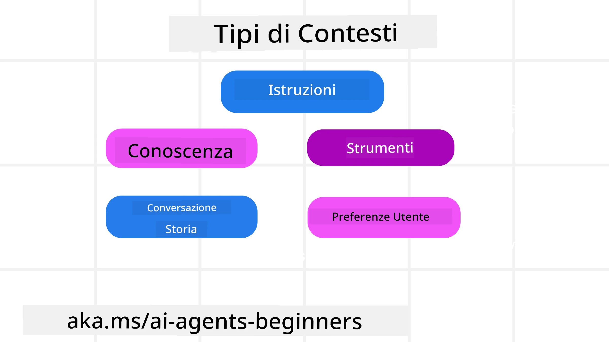
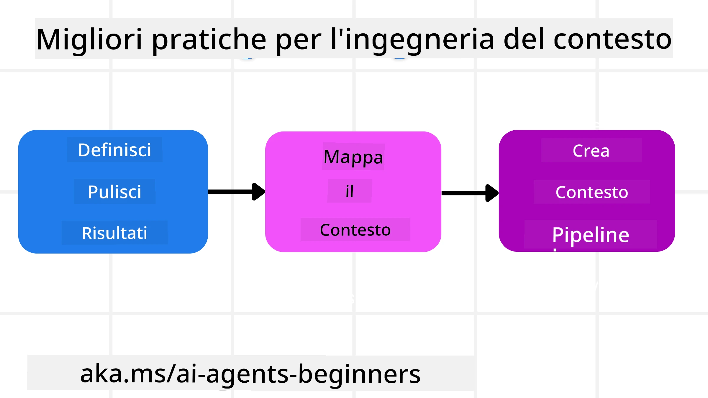

# Ingegneria del Contesto per Agenti AI

> _(Fai clic sull'immagine sopra per vedere il video di questa lezione)_

Comprendere la complessità dell'applicazione per cui si sta costruendo un agente AI è importante per realizzarne uno affidabile. Dobbiamo costruire agenti AI che gestiscano efficacemente le informazioni per rispondere a esigenze complesse, andando oltre l'ingegneria dei prompt.

In questa lezione, vedremo cos'è l'ingegneria del contesto e il suo ruolo nella costruzione di agenti AI.

## Introduzione

Questa lezione tratterà:

• **Cos'è l'Ingegneria del Contesto** e perché è diversa dall'ingegneria dei prompt.

• **Strategie per una efficace Ingegneria del Contesto**, incluso come scrivere, selezionare, comprimere e isolare le informazioni.

• **Errori Comuni nel Contesto** che possono far deragliare il tuo agente AI e come risolverli.

## Obiettivi di Apprendimento

Dopo aver completato questa lezione, saprai come:

• **Definire l'ingegneria del contesto** e differenziarla dall'ingegneria dei prompt.

• **Individuare i componenti chiave del contesto** nelle applicazioni di Large Language Model (LLM).

• **Applicare strategie per scrivere, selezionare, comprimere e isolare il contesto** per migliorare le prestazioni dell’agente.

• **Riconoscere errori comuni nel contesto** quali avvelenamento, distrazione, confusione e conflitto, e implementare le tecniche di mitigazione.

## Cos’è l’Ingegneria del Contesto?

Per gli Agenti AI, il contesto è ciò che guida la pianificazione di un agente AI a compiere certe azioni. L’ingegneria del contesto è la pratica di assicurarsi che l’agente AI abbia le informazioni giuste per completare il prossimo passo del compito. La finestra del contesto ha una dimensione limitata, quindi come creatori di agenti dobbiamo costruire sistemi e processi per gestire l’aggiunta, la rimozione e la condensazione delle informazioni nella finestra del contesto.

### Ingegneria dei Prompt vs Ingegneria del Contesto

L’ingegneria dei prompt si concentra su un singolo set di istruzioni statiche per guidare efficacemente gli agenti AI con un insieme di regole. L’ingegneria del contesto riguarda invece come gestire un set dinamico di informazioni, incluso il prompt iniziale, per garantire che l’agente AI abbia ciò che gli serve nel tempo. L’idea principale dell’ingegneria del contesto è rendere questo processo ripetibile e affidabile.

### Tipi di Contesto

È importante ricordare che il contesto non è una sola cosa. Le informazioni di cui l’agente AI ha bisogno possono provenire da diverse fonti ed è compito nostro assicurarci che l’agente abbia accesso a queste fonti:

I tipi di contesto che un agente AI potrebbe dover gestire includono:

• **Istruzioni:** Sono come le "regole" dell’agente – prompt, messaggi di sistema, esempi few-shot (che mostrano all’AI come fare qualcosa) e descrizioni degli strumenti che può utilizzare. Qui il focus dell’ingegneria dei prompt si combina con quella del contesto.

• **Conoscenza:** Copre fatti, informazioni recuperate da database o memorie a lungo termine accumulate dall’agente. Include l’integrazione di un sistema Retrieval Augmented Generation (RAG) se un agente necessita di accesso a diversi archivi di conoscenza e database.

• **Strumenti:** Sono le definizioni di funzioni esterne, API e server MCP che l’agente può chiamare, insieme al feedback (risultati) che ottiene dal loro utilizzo.

• **Cronologia della Conversazione:** Il dialogo in corso con un utente. Col passare del tempo queste conversazioni diventano più lunghe e complesse, il che significa che occupano spazio nella finestra del contesto.

• **Preferenze dell’Utente:** Informazioni apprese sui gusti o le avversioni di un utente nel tempo. Possono essere archiviate e richiamate nel momento di prendere decisioni chiave per aiutare l’utente.

## Strategie per un’Efficace Ingegneria del Contesto

### Strategie di Pianificazione

Una buona ingegneria del contesto parte da una buona pianificazione. Ecco un approccio che ti aiuterà a iniziare a pensare a come applicare il concetto di ingegneria del contesto:

1. **Definire Risultati Chiari** - I risultati dei compiti assegnati agli agenti AI dovrebbero essere chiaramente definiti. Rispondi alla domanda - "Come sarà il mondo quando l’agente AI avrà completato il suo compito?" In altre parole, quale cambiamento, informazione o risposta dovrebbe avere l’utente dopo aver interagito con l’agente AI.

2. **Mappare il Contesto** - Una volta definiti i risultati dell’agente AI, devi rispondere alla domanda "Quali informazioni l’agente AI necessita per completare questo compito?". In questo modo puoi iniziare a mappare il contesto di dove si trovano tali informazioni.

3. **Creare Pipeline di Contesto** - Ora che sai dove sono le informazioni, devi rispondere alla domanda "Come l’agente otterrà queste informazioni?". Questo può essere fatto in vari modi, incluso RAG, utilizzo di server MCP e altri strumenti.

### Strategie Pratiche

La pianificazione è importante, ma quando le informazioni iniziano a fluire nella finestra di contesto del nostro agente, dobbiamo avere strategie pratiche per gestirle:

#### Gestire il Contesto

Mentre alcune informazioni verranno aggiunte automaticamente alla finestra del contesto, l’ingegneria del contesto consiste nell’assumere un ruolo più attivo su queste informazioni, che può essere fatto attraverso alcune strategie:

 1. **Bloc-notes dell’Agente**  
 Permette a un agente AI di prendere appunti su informazioni rilevanti riguardanti i compiti e le interazioni con l’utente durante una singola sessione. Questo dovrebbe esistere al di fuori della finestra del contesto in un file o in un oggetto di runtime che l’agente può recuperare successivamente durante la sessione se necessario.

 2. **Memorie**  
 I bloc-notes sono utili per gestire informazioni fuori dalla finestra di contesto di una singola sessione. Le memorie permettono agli agenti di archiviare e recuperare informazioni rilevanti attraverso più sessioni. Questo può includere riassunti, preferenze dell’utente e feedback per miglioramenti futuri.

 3. **Compressione del Contesto**  
 Una volta che la finestra del contesto cresce e si avvicina al limite, si possono usare tecniche come la sintesi e il trimming. Ciò include mantenere solo le informazioni più rilevanti o rimuovere messaggi più vecchi.

 4. **Sistemi Multi-Agente**  
 Sviluppare un sistema multi-agente è una forma di ingegneria del contesto perché ogni agente ha la propria finestra del contesto. Come tale contesto viene condiviso e passato a diversi agenti è un altro aspetto da pianificare nella costruzione di questi sistemi.

 5. **Ambienti Sandbox**  
 Se un agente deve eseguire del codice o processare grandi quantità di informazioni in un documento, questo può richiedere un grande numero di token per elaborare i risultati. Invece di memorizzare tutto ciò nella finestra del contesto, l’agente può utilizzare un ambiente sandbox capace di eseguire questo codice e leggere solo i risultati e le informazioni rilevanti.

 6. **Oggetti di Stato di Runtime**  
 Questo viene fatto creando contenitori di informazioni per gestire situazioni in cui l’agente deve avere accesso a determinate informazioni. Per un compito complesso, questo consentirebbe a un agente di archiviare i risultati di ogni sotto-compito passo dopo passo, permettendo al contesto di rimanere connesso solo a quel sotto-compito specifico.

#### Ispezionare il Contesto

Dopo aver applicato una di queste strategie, vale la pena verificare cosa ha effettivamente ricevuto la prossima chiamata al modello. Una domanda utile per il debug è:

> L’agente ha caricato troppo contesto, il contesto sbagliato, o ha perso contesto di cui aveva bisogno?

Non è necessario registrare prompt grezzi, output degli strumenti o contenuti delle memorie per rispondere a questa domanda. In produzione, preferisci piccoli record di ispezione del contesto che catturino conteggi, ID, hash e etichette di policy:

- **Selezione:** Tieni traccia di quanti chunk candidati, strumenti o memorie sono stati considerati, quanti selezionati e quale regola o punteggio ha causato l’esclusione degli altri.

- **Compressione:** Registra l’intervallo di origine o l’ID traccia, l’ID del sommario, una stima del conteggio token prima e dopo la compressione, e se il contenuto grezzo è stato escluso dalla chiamata successiva.

- **Isolamento:** Annota quale sotto-compito è stato eseguito in un agente, sessione o sandbox separati, quale sommario limitato è stato restituito e se l’output di strumenti voluminosi è rimasto fuori dal contesto dell’agente principale.

- **Memoria e RAG:** Memorizza gli ID dei documenti recuperati, gli ID memoria, i punteggi, gli ID selezionati e lo stato di redazione anziché l’intero testo recuperato.

- **Sicurezza e privacy:** Preferisci hash, ID, token bucket ed etichette di policy rispetto a testo sensibile di prompt, argomenti degli strumenti, risultati o corpi di memoria utente.

L’obiettivo non è mantenere più contesto. È lasciare sufficienti prove affinchè uno sviluppatore possa capire quale strategia di contesto è stata applicata e se ha modificato la chiamata successiva al modello nel modo previsto.

### Esempio di Ingegneria del Contesto

Supponiamo di voler che un agente AI **"Mi prenoti un viaggio a Parigi."**

• Un agente semplice che usa solo l’ingegneria dei prompt potrebbe rispondere semplicemente: **"Ok, quando vorresti andare a Parigi?"**. Ha processato solo la tua domanda diretta al momento in cui è stata posta.

• Un agente che usa le strategie di ingegneria del contesto viste farebbe molto di più. Prima ancora di rispondere, il suo sistema potrebbe:

  ◦ **Controllare il tuo calendario** per date disponibili (recuperando dati in tempo reale).

 ◦ **Richiamare preferenze di viaggio passate** (dalla memoria a lungo termine) come la compagnia aerea preferita, il budget o se preferisci voli diretti.

 ◦ **Identificare strumenti disponibili** per prenotazione di voli e hotel.

- Poi una risposta esempio potrebbe essere: "Ciao [Tuo Nome]! Vedo che sei libero la prima settimana di ottobre. Vuoi che cerchi voli diretti per Parigi con [Compagnia aerea preferita] entro il tuo budget usuale di [Budget]?". Questa risposta più ricca e consapevole del contesto dimostra la potenza dell’ingegneria del contesto.

## Errori Comuni nel Contesto

### Avvelenamento del Contesto

**Cos’è:** Quando un’allucinazione (informazione falsa generata dal LLM) o un errore entra nel contesto ed è ripetutamente citato, causando all’agente di perseguire obiettivi impossibili o sviluppare strategie insensate.

**Cosa fare:** Implementa **validazione del contesto** e **quarantena**. Valida le informazioni prima che vengano aggiunte alla memoria a lungo termine. Se viene rilevato un possibile avvelenamento, avvia thread di contesto nuovi per prevenire la diffusione dell’informazione errata.

**Esempio di Prenotazione Viaggio:** Il tuo agente allucina un **volo diretto da un piccolo aeroporto locale a una città internazionale lontana** che in realtà non offre voli internazionali. Questo dettaglio di volo inesistente viene salvato nel contesto. Più tardi, quando chiedi all’agente di prenotare, continua a cercare biglietti per questa rotta impossibile, causando errori ripetuti.

**Soluzione:** Implementa un passaggio che **valida l’esistenza dei voli e delle rotte con un’API in tempo reale** _prima_ di aggiungere il dettaglio del volo al contesto di lavoro dell’agente. Se la validazione fallisce, l’informazione erronea viene "messa in quarantena" e non utilizzata ulteriormente.

### Distrazione del Contesto

**Cos’è:** Quando il contesto diventa così grande che il modello si concentra troppo sulla storia accumulata invece di usare ciò che ha imparato durante l’addestramento, portando a azioni ripetitive o inutili. I modelli possono iniziare a sbagliare anche prima che la finestra del contesto sia piena.

**Cosa fare:** Usa **sintesi del contesto**. Comprimi periodicamente le informazioni accumulate in riassunti più brevi, mantenendo dettagli importanti mentre rimuovi la storia ridondante. Questo aiuta a "resettare" il focus.

**Esempio di Prenotazione Viaggio:** Hai discusso molte destinazioni di viaggio da sogno per lungo tempo, inclusa una dettagliata descrizione del tuo viaggio zaino in spalla di due anni fa. Quando alla fine chiedi di **"trovare un volo economico per il mese prossimo,"** l’agente si impantana nei vecchi dettagli irrilevanti e continua a chiedere del tuo equipaggiamento da zaino in spalla o itinerari passati, trascurando la richiesta attuale.

**Soluzione:** Dopo un certo numero di turni o quando il contesto cresce troppo, l’agente dovrebbe **riassumere le parti più recenti e rilevanti della conversazione** – concentrandosi sulle date e destinazioni attuali – e utilizzare questo riassunto condensato per la chiamata LLM successiva, scartando la chat storica meno rilevante.

### Confusione del Contesto

**Cos’è:** Quando contesto non necessario, spesso sotto forma di troppi strumenti disponibili, fa sì che il modello generi risposte errate o chiami strumenti irrilevanti. I modelli più piccoli sono particolarmente soggetti a questo.

**Cosa fare:** Implementa la **gestione del carico degli strumenti** utilizzando tecniche RAG. Memorizza le descrizioni degli strumenti in un database vettoriale e seleziona _solo_ gli strumenti più rilevanti per ogni compito specifico. Le ricerche mostrano di limitare la selezione a meno di 30 strumenti.

**Esempio di Prenotazione Viaggio:** Il tuo agente ha accesso a decine di strumenti: `book_flight`, `book_hotel`, `rent_car`, `find_tours`, `currency_converter`, `weather_forecast`, `restaurant_reservations`, ecc. Chiedi, **"Qual è il modo migliore per spostarsi a Parigi?"** A causa del gran numero di strumenti, l’agente si confonde e tenta di chiamare `book_flight` _dentro_ Parigi, o `rent_car` anche se preferisci i trasporti pubblici, perché le descrizioni degli strumenti potrebbero sovrapporsi o semplicemente non riesce a discernere il migliore.

**Soluzione:** Usa **RAG sulle descrizioni degli strumenti**. Quando chiedi come muoverti a Parigi, il sistema recupera dinamicamente _solo_ gli strumenti più rilevanti come `rent_car` o `public_transport_info` in base alla tua domanda, presentando una "dotazione" focalizzata di strumenti al LLM.

### Conflitto del Contesto

**Cos’è:** Quando informazioni contrastanti esistono all’interno del contesto, portando a ragionamenti incoerenti o risposte finali errate. Ciò accade spesso quando le informazioni arrivano in fasi, e le supposizioni errate iniziali rimangono nel contesto.

**Cosa fare:** Usa il **potatura del contesto** e l’**offload**. La potatura significa rimuovere informazioni obsolete o contraddittorie con l’arrivo di nuovi dettagli. L’offload dà al modello un’area di lavoro "scratchpad" separata per elaborare l’informazione senza ingombrare il contesto principale.
**Esempio di prenotazione viaggio:** Inizialmente dici al tuo agente, **"Voglio volare in classe economica."** Più avanti nella conversazione, cambi idea e dici, **"In realtà, per questo viaggio, scegliamo la classe business."** Se entrambe le istruzioni rimangono nel contesto, l'agente potrebbe ricevere risultati di ricerca contrastanti o confondersi su quale preferenza dare priorità.

**Soluzione:** Implementare il **potatore di contesto**. Quando una nuova istruzione contraddice una vecchia, la vecchia istruzione viene rimossa o esplicitamente sovrascritta nel contesto. In alternativa, l'agente può usare un **blocco schizzi** per conciliare le preferenze contrastanti prima di decidere, garantendo che solo l'istruzione finale e coerente guidi le sue azioni.

## Hai altre domande sull'ingegneria del contesto?

Unisciti al [Microsoft Foundry Discord](https://aka.ms/ai-agents/discord) per incontrare altri studenti, partecipare alle ore di ufficio e ottenere risposte alle tue domande sugli Agenti AI.

---

<!-- CO-OP TRANSLATOR DISCLAIMER START -->
**Disclaimer**:
Questo documento è stato tradotto utilizzando il servizio di traduzione AI [Co-op Translator](https://github.com/Azure/co-op-translator). Sebbene ci impegniamo per garantire la precisione, si prega di notare che le traduzioni automatizzate possono contenere errori o imprecisioni. Il documento originale nella sua lingua nativa deve essere considerato la fonte autorevole. Per informazioni critiche, si raccomanda una traduzione professionale effettuata da un essere umano. Non siamo responsabili per eventuali malintesi o interpretazioni errate derivanti dall’uso di questa traduzione.
<!-- CO-OP TRANSLATOR DISCLAIMER END -->