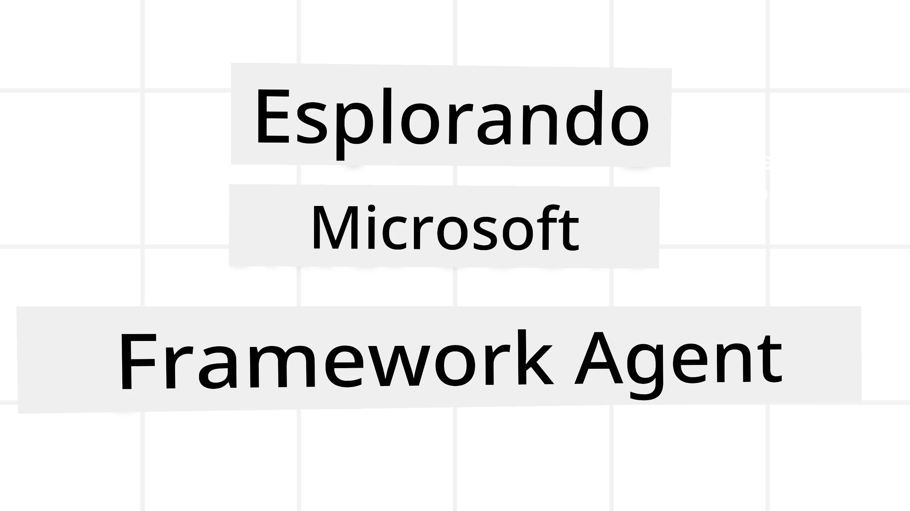
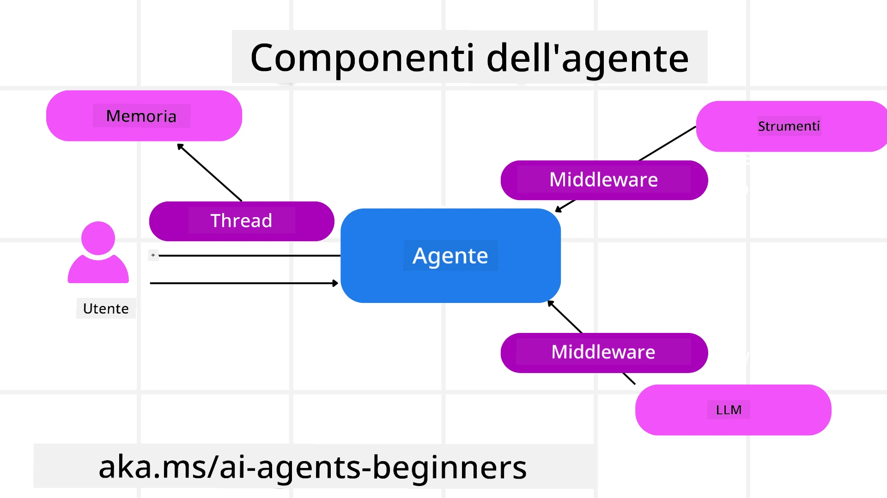

# Esplorare Microsoft Agent Framework



### Introduzione

Questa lezione coprirà:

- Comprendere Microsoft Agent Framework: Caratteristiche chiave e valore  
- Esplorare i concetti chiave di Microsoft Agent Framework
- Pattern avanzati MAF: Flussi di lavoro, middleware e memoria

## Obiettivi di apprendimento

Dopo aver completato questa lezione, saprai come:

- Costruire agenti AI pronti per la produzione utilizzando Microsoft Agent Framework
- Applicare le funzionalità core di Microsoft Agent Framework ai tuoi casi d'uso agentici
- Utilizzare pattern avanzati inclusi flussi di lavoro, middleware e osservabilità

## Esempi di codice

Gli esempi di codice per [Microsoft Agent Framework (MAF)](https://aka.ms/ai-agents-beginners/agent-framewrok) possono essere trovati in questo repository nei file `xx-python-agent-framework` e `xx-dotnet-agent-framework`.

## Comprendere Microsoft Agent Framework


[Microsoft Agent Framework (MAF)](https://aka.ms/ai-agents-beginners/agent-framewrok) è il framework unificato di Microsoft per la creazione di agenti AI. Offre la flessibilità di affrontare la vasta gamma di casi d'uso agentici visti sia in ambienti di produzione che di ricerca, inclusi:

- **Orchestrazione sequenziale dell'agente** in scenari in cui sono necessari flussi di lavoro passo dopo passo.
- **Orchestrazione concorrente** in scenari in cui gli agenti devono completare attività contemporaneamente.
- **Orchestrazione di chat di gruppo** in scenari in cui gli agenti possono collaborare insieme su un unico compito.
- **Orchestrazione di handoff** in scenari in cui gli agenti si passano il compito mano a mano che i sottocompiti vengono completati.
- **Orchestrazione magnetica** in scenari in cui un agente manager crea e modifica una lista di compiti e gestisce il coordinamento dei sottoagenti per completare il compito.

Per fornire agenti AI in produzione, MAF include anche funzionalità per:

- **Osservabilità** tramite l'uso di OpenTelemetry dove ogni azione dell'agente AI inclusa l'invocazione degli strumenti, i passaggi di orchestrazione, i flussi di ragionamento e il monitoraggio delle prestazioni sono accessibili tramite dashboard Microsoft Foundry.
- **Sicurezza** ospitando gli agenti nativamente su Microsoft Foundry, il quale include controlli di sicurezza come l'accesso basato sui ruoli, la gestione dei dati privati e la sicurezza integrata dei contenuti.
- **Durabilità** con thread e flussi di lavoro dell'agente che possono essere messi in pausa, ripresi e recuperati da errori, consentendo processi a esecuzione più lunga.
- **Controllo** con flussi di lavoro human-in-the-loop supportati, dove le attività sono contrassegnate come richiedenti l'approvazione umana.

Microsoft Agent Framework è anche orientato all'interoperabilità tramite:

- **Indipendenza dal cloud** - Gli agenti possono essere eseguiti in container, on-premises e su più cloud differenti.
- **Indipendenza dal provider** - Gli agenti possono essere creati tramite l'SDK preferito, inclusi Azure OpenAI e OpenAI.
- **Integrazione di standard aperti** - Gli agenti possono utilizzare protocolli come Agent-to-Agent(A2A) e Model Context Protocol (MCP) per scoprire e usare altri agenti e strumenti.
- **Plugin e connettori** - Possono essere stabilite connessioni a servizi di dati e memoria come Microsoft Fabric, SharePoint, Pinecone e Qdrant.

Vediamo come queste funzionalità sono applicate ad alcuni dei concetti chiave di Microsoft Agent Framework.

## Concetti chiave di Microsoft Agent Framework

### Agenti



**Creazione di Agenti**

La creazione dell'agente avviene definendo il servizio di inferenza (Provider LLM), un insieme di istruzioni che l'agente AI deve seguire e un `nome` assegnato:

```python
agent = AzureOpenAIChatClient(credential=AzureCliCredential()).create_agent( instructions="You are good at recommending trips to customers based on their preferences.", name="TripRecommender" )
```

L'esempio sopra utilizza `Azure OpenAI`, ma gli agenti possono essere creati usando una varietà di servizi inclusi `Microsoft Foundry Agent Service`:

```python
AzureAIAgentClient(async_credential=credential).create_agent( name="HelperAgent", instructions="You are a helpful assistant." ) as agent
```

API OpenAI `Responses`, `ChatCompletion`

```python
agent = OpenAIResponsesClient().create_agent( name="WeatherBot", instructions="You are a helpful weather assistant.", )
```

```python
agent = OpenAIChatClient().create_agent( name="HelpfulAssistant", instructions="You are a helpful assistant.", )
```

o agenti remoti usando il protocollo A2A:

```python
agent = A2AAgent( name=agent_card.name, description=agent_card.description, agent_card=agent_card, url="https://your-a2a-agent-host" )
```

**Esecuzione degli agenti**

Gli agenti vengono eseguiti usando i metodi `.run` o `.run_stream` per risposte non in streaming o in streaming.

```python
result = await agent.run("What are good places to visit in Amsterdam?")
print(result.text)
```

```python
async for update in agent.run_stream("What are the good places to visit in Amsterdam?"):
    if update.text:
        print(update.text, end="", flush=True)

```

Ogni esecuzione di agente può includere opzioni per personalizzare parametri come `max_tokens` usati dall'agente, gli `strumenti` che l'agente può chiamare, e persino il `modello` usato per l'agente.

Questo è utile nei casi in cui sono richiesti modelli o strumenti specifici per completare il compito di un utente.

**Strumenti**

Gli strumenti possono essere definiti sia durante la definizione dell'agente:

```python
def get_attractions( location: Annotated[str, Field(description="The location to get the top tourist attractions for")], ) -> str: """Get the top tourist attractions for a given location.""" return f"The top attractions for {location} are." 


# Quando si crea direttamente un ChatAgent

agent = ChatAgent( chat_client=OpenAIChatClient(), instructions="You are a helpful assistant", tools=[get_attractions]

```

sia durante l'esecuzione dell'agente:

```python

result1 = await agent.run( "What's the best place to visit in Seattle?", tools=[get_attractions] # Strumento fornito solo per questa esecuzione )
```

**Thread dell'agente**

I thread dell'agente sono usati per gestire conversazioni multi-turno. I thread possono essere creati tramite:

- L'uso di `get_new_thread()` che permette al thread di essere salvato nel tempo
- La creazione automatica di un thread durante l'esecuzione di un agente, con il thread che dura solo per la durata della corrente esecuzione.

Per creare un thread, il codice è il seguente:

```python
# Crea un nuovo thread.
thread = agent.get_new_thread() # Esegui l'agente con il thread.
response = await agent.run("Hello, I am here to help you book travel. Where would you like to go?", thread=thread)

```

Puoi quindi serializzare il thread per conservarlo per un uso futuro:

```python
# Crea un nuovo thread.
thread = agent.get_new_thread() 

# Esegui l'agente con il thread.

response = await agent.run("Hello, how are you?", thread=thread) 

# Serializza il thread per l'archiviazione.

serialized_thread = await thread.serialize() 

# Deserializza lo stato del thread dopo il caricamento dall'archivio.

resumed_thread = await agent.deserialize_thread(serialized_thread)
```

**Middleware dell'agente**

Gli agenti interagiscono con strumenti e LLM per completare i compiti degli utenti. In certi scenari, vogliamo eseguire o tracciare azioni tra queste interazioni. Il middleware dell'agente ci consente di fare questo tramite:

*Middleware funzione*

Questo middleware permette di eseguire un'azione tra l'agente e una funzione/strumento che chiamerà. Un esempio d'uso è quando si vuole fare un logging sulla chiamata della funzione.

Nel codice sottostante `next` definisce se deve essere chiamato il middleware successivo o la funzione vera e propria.

```python
async def logging_function_middleware(
    context: FunctionInvocationContext,
    next: Callable[[FunctionInvocationContext], Awaitable[None]],
) -> None:
    """Function middleware that logs function execution."""
    # Pre-elaborazione: Registrare prima dell'esecuzione della funzione
    print(f"[Function] Calling {context.function.name}")

    # Continuare al middleware successivo o all'esecuzione della funzione
    await next(context)

    # Post-elaborazione: Registrare dopo l'esecuzione della funzione
    print(f"[Function] {context.function.name} completed")
```

*Middleware chat*

Questo middleware permette di eseguire o registrare un'azione tra l'agente e le richieste tra l'LLM.

Contiene informazioni importanti come i `messaggi` inviati al servizio AI.

```python
async def logging_chat_middleware(
    context: ChatContext,
    next: Callable[[ChatContext], Awaitable[None]],
) -> None:
    """Chat middleware that logs AI interactions."""
    # Pre-elaborazione: Registrare prima della chiamata AI
    print(f"[Chat] Sending {len(context.messages)} messages to AI")

    # Continua al middleware o servizio AI successivo
    await next(context)

    # Post-elaborazione: Registrare dopo la risposta AI
    print("[Chat] AI response received")

```

**Memoria dell'agente**

Come trattato nella lezione `Agentic Memory`, la memoria è un elemento importante per permettere all'agente di operare su contesti diversi. MAF offre diversi tipi di memorie:

*Memoria In-Memory*

Questa è la memoria immagazzinata nei thread durante l'esecuzione dell'applicazione.

```python
# Crea un nuovo thread.
thread = agent.get_new_thread() # Esegui l'agente con il thread.
response = await agent.run("Hello, I am here to help you book travel. Where would you like to go?", thread=thread)
```

*Messaggi Persistenti*

Questa memoria viene utilizzata per conservare la cronologia della conversazione attraverso differenti sessioni. È definita usando `chat_message_store_factory`:

```python
from agent_framework import ChatMessageStore

# Crea un archivio messaggi personalizzato
def create_message_store():
    return ChatMessageStore()

agent = ChatAgent(
    chat_client=OpenAIChatClient(),
    instructions="You are a Travel assistant.",
    chat_message_store_factory=create_message_store
)

```

*Memoria Dinamica*

Questa memoria viene aggiunta al contesto prima dell'esecuzione degli agenti. Queste memorie possono essere conservate in servizi esterni come mem0:

```python
from agent_framework.mem0 import Mem0Provider

# Utilizzo di Mem0 per capacità di memoria avanzate
memory_provider = Mem0Provider(
    api_key="your-mem0-api-key",
    user_id="user_123",
    application_id="my_app"
)

agent = ChatAgent(
    chat_client=OpenAIChatClient(),
    instructions="You are a helpful assistant with memory.",
    context_providers=memory_provider
)

```

**Osservabilità dell'agente**

L'osservabilità è importante per costruire sistemi agentici affidabili e mantenibili. MAF si integra con OpenTelemetry per fornire tracing e meter per una migliore osservabilità.

```python
from agent_framework.observability import get_tracer, get_meter

tracer = get_tracer()
meter = get_meter()
with tracer.start_as_current_span("my_custom_span"):
    # fare qualcosa
    pass
counter = meter.create_counter("my_custom_counter")
counter.add(1, {"key": "value"})
```

### Flussi di lavoro

MAF offre flussi di lavoro che sono passaggi predefiniti per completare un compito e includono agenti AI come componenti in quei passaggi.

I flussi di lavoro sono composti da diversi componenti che consentono un migliore controllo del flusso. Inoltre, i flussi di lavoro abilitano **orchestrazione multi-agente** e **checkpointing** per salvare lo stato del flusso.

I componenti core di un flusso di lavoro sono:

**Esecutori**

Gli esecutori ricevono messaggi in ingresso, eseguono i compiti assegnati e producono un messaggio in uscita. Questo fa avanzare il flusso di lavoro verso il completamento del compito più ampio. Gli esecutori possono essere agenti AI o logica personalizzata.

**Bordi**

I bordi sono usati per definire il flusso di messaggi in un flusso di lavoro. Possono essere:

*Bordi diretti* - Connessioni semplici uno a uno tra esecutori:

```python
from agent_framework import WorkflowBuilder

builder = WorkflowBuilder()
builder.add_edge(source_executor, target_executor)
builder.set_start_executor(source_executor)
workflow = builder.build()
```

*Bordi condizionali* - Si attivano una volta che si soddisfa una certa condizione. Per esempio, quando le stanze d'albergo non sono disponibili, un esecutore può suggerire altre opzioni.

*Bordi switch-case* - Instradano messaggi a diversi esecutori sulla base di condizioni definite. Ad esempio, se un cliente di viaggio ha accesso prioritario, i suoi compiti saranno gestiti tramite un altro flusso di lavoro.

*Bordi fan-out* - Invia un messaggio a più destinazioni.

*Bordi fan-in* - Raccoglie più messaggi da diversi esecutori e li invia a una destinazione.

**Eventi**

Per fornire migliore osservabilità nei flussi di lavoro, MAF offre eventi integrati per l'esecuzione, inclusi:

- `WorkflowStartedEvent`  - Inizio esecuzione flusso di lavoro
- `WorkflowOutputEvent` - Il flusso di lavoro produce un output
- `WorkflowErrorEvent` - Il flusso di lavoro incontra un errore
- `ExecutorInvokeEvent`  - L'esecutore inizia l'elaborazione
- `ExecutorCompleteEvent`  -  L'esecutore termina l'elaborazione
- `RequestInfoEvent` - Viene emessa una richiesta

## Pattern avanzati di MAF

Le sezioni sopra coprono i concetti chiave di Microsoft Agent Framework. Man mano che costruisci agenti più complessi, ecco alcuni pattern avanzati da considerare:

- **Composizione Middleware**: Collegare più gestori middleware (logging, autenticazione, rate-limiting) usando middleware funzione e chat per un controllo preciso sul comportamento dell'agente.
- **Checkpointing del flusso di lavoro**: Usare eventi di flusso di lavoro e serializzazione per salvare e riprendere processi agenti di lunga durata.
- **Selezione dinamica degli strumenti**: Combinare RAG su descrizioni di strumenti con la registrazione degli strumenti di MAF per presentare solo gli strumenti rilevanti per la query.
- **Handoff multi-agente**: Usare bordi di flusso di lavoro e instradamento condizionale per orchestrare passaggi tra agenti specializzati.

## Esempi di codice

Gli esempi di codice per Microsoft Agent Framework possono essere trovati in questo repository nei file `xx-python-agent-framework` e `xx-dotnet-agent-framework`.

## Hai altre domande su Microsoft Agent Framework?

Unisciti al [Microsoft Foundry Discord](https://aka.ms/ai-agents/discord) per incontrare altri studenti, partecipare a ore d'ufficio e ottenere risposte alle tue domande sugli agenti AI.

---

<!-- CO-OP TRANSLATOR DISCLAIMER START -->
**Avvertenza**:  
Questo documento è stato tradotto utilizzando il servizio di traduzione AI [Co-op Translator](https://github.com/Azure/co-op-translator). Sebbene ci impegniamo per garantire accuratezza, si prega di notare che le traduzioni automatiche potrebbero contenere errori o imprecisioni. Il documento originale nella sua lingua natale deve essere considerato la fonte autorevole. Per informazioni critiche, si raccomanda la traduzione professionale effettuata da un umano. Non ci assumiamo alcuna responsabilità per eventuali incomprensioni o interpretazioni errate derivanti dall’uso di questa traduzione.
<!-- CO-OP TRANSLATOR DISCLAIMER END -->