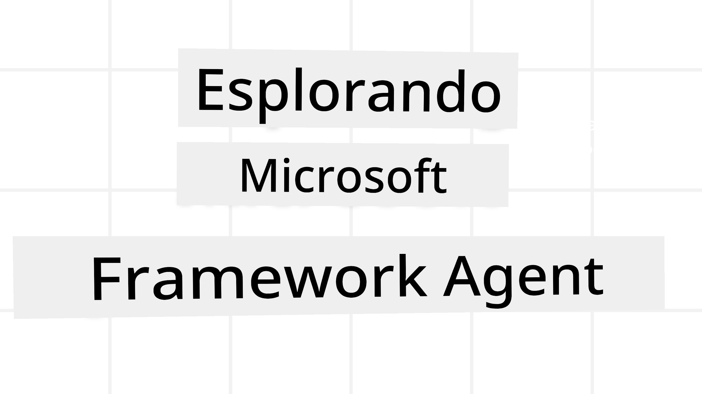
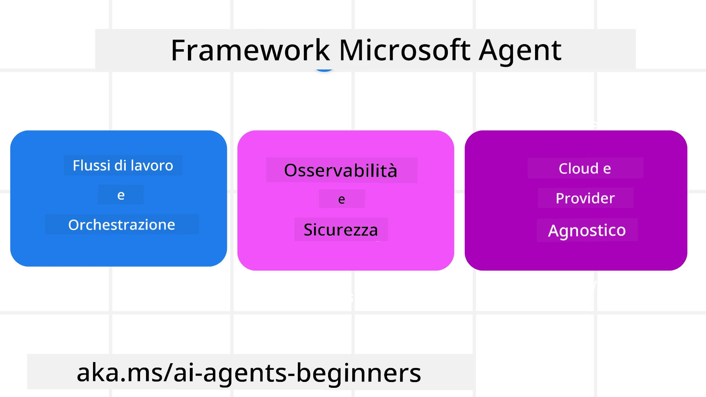
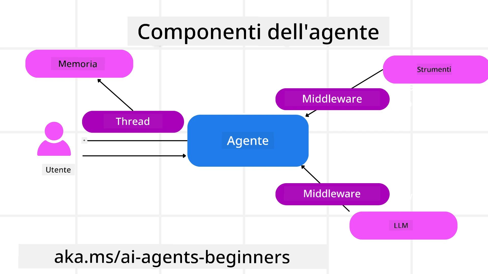

# Esplorare Microsoft Agent Framework



### Introduzione

Questa lezione tratterà:

- Comprendere Microsoft Agent Framework: caratteristiche chiave e valore  
- Esplorare i concetti chiave di Microsoft Agent Framework
- Pattern avanzati di MAF: workflow, middleware e memoria

## Obiettivi di apprendimento

Dopo aver completato questa lezione, saprai come:

- Costruire agenti AI pronti per la produzione utilizzando Microsoft Agent Framework
- Applicare le funzionalità principali di Microsoft Agent Framework ai tuoi casi d'uso agentici
- Usare pattern avanzati tra cui workflow, middleware e osservabilità

## Esempi di codice

Gli esempi di codice per [Microsoft Agent Framework (MAF)](https://learn.microsoft.com/en-us/agent-framework/overview/?wt.mc_id=youtube_26688_organicsocial_reactor&pivots=programming-language-python) si trovano in questo repository sotto i file `xx-python-agent-framework` e `xx-dotnet-agent-framework`.

## Comprendere Microsoft Agent Framework



[Microsoft Agent Framework (MAF)](https://learn.microsoft.com/en-us/agent-framework/overview/?wt.mc_id=youtube_26688_organicsocial_reactor&pivots=programming-language-python) è il framework unificato di Microsoft per la costruzione di agenti AI. Offre la flessibilità di affrontare la vasta varietà di casi d'uso agentici visibili sia in ambienti di produzione che di ricerca, inclusi:

- **Orchestrazione sequenziale di agenti** in scenari dove sono necessari workflow passo dopo passo.
- **Orchestrazione concorrente** in scenari dove gli agenti devono completare compiti contemporaneamente.
- **Orchestrazione di chat di gruppo** in scenari dove gli agenti possono collaborare insieme su un compito.
- **Orchestrazione di passaggio** in scenari dove gli agenti si passano il compito man mano che i sottocompiti sono completati.
- **Orchestrazione magnetica** in scenari dove un agente manager crea e modifica una lista di compiti e gestisce il coordinamento dei subagenti per completare il compito.

Per fornire agenti AI in produzione, MAF include anche funzionalità per:

- **Osservabilità** attraverso l'uso di OpenTelemetry dove ogni azione dell'agente AI, inclusa l'invocazione di strumenti, passaggi di orchestrazione, flussi di ragionamento e monitoraggio delle prestazioni tramite dashboard Microsoft Foundry.
- **Sicurezza** ospitando gli agenti nativamente su Microsoft Foundry che include controlli di sicurezza come accesso basato sui ruoli, gestione dei dati privati e sicurezza dei contenuti integrata.
- **Durabilità** poiché i thread e i workflow degli agenti possono mettere in pausa, riprendere e recuperare da errori, consentendo processi a lunga durata.
- **Controllo** poiché i workflow con l'intervento umano sono supportati, dove i compiti sono contrassegnati come richiedenti approvazione umana.

Microsoft Agent Framework è anche focalizzato sull'interoperabilità tramite:

- **Essere cloud-agnostico** - Gli agenti possono girare in container, on-premise e su più cloud differenti.
- **Essere provider-agnostico** - Gli agenti possono essere creati tramite il tuo SDK preferito inclusi Azure OpenAI e OpenAI
- **Integrare standard aperti** - Gli agenti possono utilizzare protocolli come Agent-to-Agent (A2A) e Model Context Protocol (MCP) per scoprire e usare altri agenti e strumenti.
- **Plugin e connettori** - Possono essere effettuate connessioni a servizi di dati e memoria come Microsoft Fabric, SharePoint, Pinecone e Qdrant.

Diamo un'occhiata a come queste funzionalità sono applicate ad alcuni dei concetti chiave di Microsoft Agent Framework.

## Concetti chiave di Microsoft Agent Framework

### Agenti



**Creazione di agenti**

La creazione di un agente avviene definendo il servizio di inferenza (LLM Provider), un
insieme di istruzioni che l'agente AI deve seguire, e un `nome` assegnato:

```python
agent = AzureOpenAIChatClient(credential=AzureCliCredential()).create_agent( instructions="You are good at recommending trips to customers based on their preferences.", name="TripRecommender" )
```

Quanto sopra usa `Azure OpenAI` ma gli agenti possono essere creati usando vari servizi tra cui `Microsoft Foundry Agent Service`:

```python
AzureAIAgentClient(async_credential=credential).create_agent( name="HelperAgent", instructions="You are a helpful assistant." ) as agent
```

API OpenAI `Responses`, `ChatCompletion`

```python
agent = OpenAIResponsesClient().create_agent( name="WeatherBot", instructions="You are a helpful weather assistant.", )
```

```python
agent = OpenAIChatClient().create_agent( name="HelpfulAssistant", instructions="You are a helpful assistant.", )
```

o [MiniMax](https://platform.minimaxi.com/), che fornisce un'API compatibile con OpenAI con finestre di contesto ampie (fino a 204K token):

```python
agent = OpenAIChatClient(base_url="https://api.minimax.io/v1", api_key=os.environ["MINIMAX_API_KEY"], model_id="MiniMax-M3").create_agent( name="HelpfulAssistant", instructions="You are a helpful assistant.", )
```

o agenti remoti usando il protocollo A2A:

```python
agent = A2AAgent( name=agent_card.name, description=agent_card.description, agent_card=agent_card, url="https://your-a2a-agent-host" )
```

**Esecuzione degli agenti**

Gli agenti vengono eseguiti utilizzando i metodi `.run` o `.run_stream` per risposte rispettivamente non in streaming o in streaming.

```python
result = await agent.run("What are good places to visit in Amsterdam?")
print(result.text)
```

```python
async for update in agent.run_stream("What are the good places to visit in Amsterdam?"):
    if update.text:
        print(update.text, end="", flush=True)

```

Ogni esecuzione di un agente può avere opzioni per personalizzare parametri come `max_tokens` usati dall'agente, `tools` che l'agente può chiamare, e anche il `modello` stesso usato per l'agente.

Questo è utile in casi dove modelli o strumenti specifici sono richiesti per completare il compito dell'utente.

**Strumenti**

Gli strumenti possono essere definiti sia durante la definizione dell'agente:

```python
def get_attractions( location: Annotated[str, Field(description="The location to get the top tourist attractions for")], ) -> str: """Get the top tourist attractions for a given location.""" return f"The top attractions for {location} are." 


# Quando si crea direttamente un ChatAgent

agent = ChatAgent( chat_client=OpenAIChatClient(), instructions="You are a helpful assistant", tools=[get_attractions]

```

e anche durante l'esecuzione dell'agente:

```python

result1 = await agent.run( "What's the best place to visit in Seattle?", tools=[get_attractions] # Strumento fornito solo per questa esecuzione )
```

**Thread degli agenti**

I thread degli agenti sono usati per gestire conversazioni multi-turno. I thread possono essere creati in due modi:

- Usando `get_new_thread()` che abilita il thread a essere salvato nel tempo
- Creando un thread automaticamente durante l'esecuzione di un agente e facendo durare il thread solo durante questa esecuzione.

Per creare un thread, il codice è così:

```python
# Crea un nuovo thread.
thread = agent.get_new_thread() # Esegui l'agente con il thread.
response = await agent.run("Hello, I am here to help you book travel. Where would you like to go?", thread=thread)

```

Puoi quindi serializzare il thread per archiviarlo per un uso futuro:

```python
# Crea un nuovo thread.
thread = agent.get_new_thread() 

# Esegui l'agente con il thread.

response = await agent.run("Hello, how are you?", thread=thread) 

# Serializza il thread per l'archiviazione.

serialized_thread = await thread.serialize() 

# Deserializza lo stato del thread dopo il caricamento dall'archivio.

resumed_thread = await agent.deserialize_thread(serialized_thread)
```

**Middleware degli agenti**

Gli agenti interagiscono con strumenti e LLM per completare i compiti degli utenti. In certi scenari, vogliamo eseguire o tracciare azioni intermedie durante queste interazioni. Il middleware degli agenti permette di farlo tramite:

*Middleware delle funzioni*

Questo middleware ci consente di eseguire un'azione tra l'agente e una funzione/strumento che sta per chiamare. Un esempio di quando usarlo è per fare logging sulla chiamata di funzione.

Nel codice sotto `next` definisce se si deve chiamare il middleware successivo o la funzione effettiva.

```python
async def logging_function_middleware(
    context: FunctionInvocationContext,
    next: Callable[[FunctionInvocationContext], Awaitable[None]],
) -> None:
    """Function middleware that logs function execution."""
    # Pre-elaborazione: Registra prima dell'esecuzione della funzione
    print(f"[Function] Calling {context.function.name}")

    # Continua al middleware successivo o all'esecuzione della funzione
    await next(context)

    # Post-elaborazione: Registra dopo l'esecuzione della funzione
    print(f"[Function] {context.function.name} completed")
```

*Middleware chat*

Questo middleware ci permette di eseguire o registrare un'azione tra l'agente e le richieste tra l'LLM.

Contiene informazioni importanti come i `messages` inviati al servizio AI.

```python
async def logging_chat_middleware(
    context: ChatContext,
    next: Callable[[ChatContext], Awaitable[None]],
) -> None:
    """Chat middleware that logs AI interactions."""
    # Pre-elaborazione: Registrare il log prima della chiamata AI
    print(f"[Chat] Sending {len(context.messages)} messages to AI")

    # Continua al prossimo middleware o servizio AI
    await next(context)

    # Post-elaborazione: Registrare il log dopo la risposta AI
    print("[Chat] AI response received")

```

**Memoria degli agenti**

Come discusso nella lezione `Agentic Memory`, la memoria è un elemento importante per consentire all'agente di operare su contesti diversi. MAF offre diversi tipi di memorie:

*Memoria in memoria*

Questa è la memoria archiviata nei thread durante il runtime dell'applicazione.

```python
# Crea un nuovo thread.
thread = agent.get_new_thread() # Esegui l'agente con il thread.
response = await agent.run("Hello, I am here to help you book travel. Where would you like to go?", thread=thread)
```

*Messaggi persistenti*

Questa memoria è usata per conservare la cronologia delle conversazioni tra sessioni diverse. È definita usando `chat_message_store_factory`:

```python
from agent_framework import ChatMessageStore

# Crea un archivio di messaggi personalizzato
def create_message_store():
    return ChatMessageStore()

agent = ChatAgent(
    chat_client=OpenAIChatClient(),
    instructions="You are a Travel assistant.",
    chat_message_store_factory=create_message_store
)

```

*Memoria dinamica*

Questa memoria è aggiunta al contesto prima che gli agenti vengano eseguiti. Queste memorie possono essere archiviate in servizi esterni come mem0:

```python
from agent_framework.mem0 import Mem0Provider

# Utilizzo di Mem0 per funzionalità avanzate di memoria
memory_provider = Mem0Provider(
    api_key="your-mem0-api-key",
    user_id="user_123",
    application_id="my_app"
)

agent = ChatAgent(
    chat_client=OpenAIChatClient(),
    instructions="You are a helpful assistant with memory.",
    context_providers=memory_provider
)

```

**Osservabilità degli agenti**

L'osservabilità è importante per costruire sistemi agentici affidabili e manutenibili. MAF integra OpenTelemetry per fornire tracing e metriche per migliore osservabilità.

```python
from agent_framework.observability import get_tracer, get_meter

tracer = get_tracer()
meter = get_meter()
with tracer.start_as_current_span("my_custom_span"):
    # fare qualcosa
    pass
counter = meter.create_counter("my_custom_counter")
counter.add(1, {"key": "value"})
```

### Workflow

MAF offre workflow che sono passi predefiniti per completare un compito e includono agenti AI come componenti in quei passi.

I workflow sono composti da diversi componenti che permettono un migliore flusso di controllo. I workflow abilitano anche **orchestrazione multi-agente** e **checkpointing** per salvare stati del workflow.

I componenti principali di un workflow sono:

**Executor**

Gli executor ricevono messaggi in input, eseguono i compiti assegnati e producono un messaggio in output. Questo muove il workflow verso il completamento del compito più ampio. Gli executor possono essere un agente AI o logica personalizzata.

**Edges**

Gli edges sono usati per definire il flusso dei messaggi in un workflow. Questi possono essere:

*Edges diretti* - Connessioni semplici uno a uno tra executor:

```python
from agent_framework import WorkflowBuilder

builder = WorkflowBuilder()
builder.add_edge(source_executor, target_executor)
builder.set_start_executor(source_executor)
workflow = builder.build()
```

*Edges condizionali* - Attivati dopo che una certa condizione è soddisfatta. Ad esempio, quando le camere d'albergo non sono disponibili, un executor può suggerire altre opzioni.

*Edges a switch-case* - Instradano messaggi a diversi executor basati su condizioni definite. Ad esempio, se un cliente viaggio ha accesso prioritario i loro compiti saranno gestiti tramite un altro workflow.

*Edges fan-out* - Inviano un messaggio a più destinatari.

*Edges fan-in* - Raccogliere messaggi multipli da executor diversi e inviarli a un singolo destinatario.

**Eventi**

Per fornire migliore osservabilità nei workflow, MAF offre eventi incorporati per l'esecuzione tra cui:

- `WorkflowStartedEvent`  - Inizio esecuzione workflow
- `WorkflowOutputEvent` - Workflow produce un output
- `WorkflowErrorEvent` - Workflow incontra un errore
- `ExecutorInvokeEvent`  - L'executor inizia l'elaborazione
- `ExecutorCompleteEvent`  -  L'executor termina l'elaborazione
- `RequestInfoEvent` - Una richiesta viene emessa

## Pattern avanzati di MAF

Le sezioni sopra coprono i concetti chiave di Microsoft Agent Framework. Durante la costruzione di agenti più complessi, considera questi pattern avanzati:

- **Composizione middleware**: Catena di handler middleware multipli (logging, autenticazione, limitazione di velocità) usando middleware per funzioni e chat per un controllo granulare sul comportamento degli agenti.
- **Checkpointing dei workflow**: Usa eventi del workflow e serializzazione per salvare e riprendere processi agentici a lunga esecuzione.
- **Selezione dinamica degli strumenti**: Combina RAG sulle descrizioni degli strumenti con la registrazione degli strumenti di MAF per presentare solo gli strumenti rilevanti per la query.
- **Passaggio multi-agente**: Usa edges del workflow e instradamento condizionale per orchestrare passaggi tra agenti specializzati.

## Ospitare agenti LangChain / LangGraph su Microsoft Foundry

Microsoft Agent Framework è **interoperabile a livello di framework** — non sei limitato agli agenti scritti con MAF. Se hai già un agente costruito con **LangChain** o **LangGraph**, puoi eseguirlo come **agente ospitato da Microsoft Foundry** in modo che Foundry gestisca runtime, sessioni, scalabilità, identità e endpoint di protocollo per te, mentre la logica del tuo agente rimane in LangGraph.

Questo è fatto con il pacchetto `langchain_azure_ai.agents.hosting`, che espone un grafo LangGraph compilato sugli stessi protocolli usati dagli agenti ospitati in Foundry.

**1. Installa l'extra hosting:**

```bash
pip install -U "langchain-azure-ai[hosting]>=1.2.4" azure-identity
```

L'extra `hosting` installa le librerie di protocollo Foundry: `azure-ai-agentserver-responses` (l'endpoint `/responses` compatibile con OpenAI) e `azure-ai-agentserver-invocations` (l'endpoint generico `/invocations`).

**2. Scegli un protocollo di hosting:**

| Protocollo | Classe host | Endpoint | Uso |
|----------|-----------|----------|----------|
| **Responses** | `ResponsesHostServer` | `/responses` | Vuoi chat compatibile OpenAI, streaming, cronologia delle risposte e threading conversazionale — la predefinita raccomandata per agenti conversazionali. |
| **Invocations** | `InvocationsHostServer` | `/invocations` | Hai bisogno di una forma JSON personalizzata, un endpoint stile webhook o elaborazione non conversazionale. |

Poiché **l'API Responses è l'API principale per lo sviluppo di agenti in Foundry**, inizia con `ResponsesHostServer` per la maggior parte degli agenti.

**3. Configura le variabili d'ambiente** (`az login` prima così `DefaultAzureCredential` può autenticarsi):

```bash
export FOUNDRY_PROJECT_ENDPOINT="https://<resource>.services.ai.azure.com/api/projects/<project>"
export FOUNDRY_MODEL_NAME="gpt-5-mini"
```

Quando l'agente sarà eseguito come agente ospitato in Foundry, la piattaforma inietterà automaticamente `FOUNDRY_PROJECT_ENDPOINT`.

**4. Esporre un agente LangGraph sul protocollo Responses:**

```python
import os

from azure.ai.projects import AIProjectClient
from azure.identity import DefaultAzureCredential, get_bearer_token_provider
from langchain.agents import create_agent
from langchain_openai import ChatOpenAI
from langchain_azure_ai.agents.hosting import ResponsesHostServer

_AZURE_AI_SCOPE = "https://ai.azure.com/.default"


def build_chat_model() -> ChatOpenAI:
    project_endpoint = os.environ["FOUNDRY_PROJECT_ENDPOINT"].rstrip("/")
    deployment = os.environ.get("FOUNDRY_MODEL_NAME", "gpt-5-mini")
    credential = DefaultAzureCredential()
    project = AIProjectClient(endpoint=project_endpoint, credential=credential)
    openai_client = project.get_openai_client()
    token_provider = get_bearer_token_provider(credential, _AZURE_AI_SCOPE)

    # ChatOpenAI qui si rivolge all'endpoint compatibile con OpenAI (Risposte) del progetto Foundry.
    return ChatOpenAI(
        model=deployment,
        base_url=str(openai_client.base_url),
        api_key=token_provider,
    )


def main() -> None:
    graph = create_agent(build_chat_model(), tools=[])
    port = int(os.environ.get("PORT", "8088"))
    ResponsesHostServer(graph).run(port=port)


if __name__ == "__main__":
    main()
```

Eseguilo localmente con `python main.py`, poi invia una richiesta Responses a `http://localhost:8088/responses`.

**Comportamenti chiave:**

- **Conversazioni**: I clienti continuano una conversazione passando `previous_response_id` o un ID `conversation`. Se il tuo grafo è compilato con un LangGraph checkpointer, Foundry associa lo stato della conversazione al checkpoint (usa un checkpointer duraturo in produzione; `MemorySaver` va bene per test locali).
- **Intervento umano**: Se il tuo grafo usa LangGraph `interrupt()`, `ResponsesHostServer` presenta l'interruzione pendente come un item Responses `function_call` / `mcp_approval_request`, e i client riprendono con un `function_call_output` / `mcp_approval_response` corrispondente.
- **Deploy su Foundry**: Usa Azure Developer CLI — `azd ext install azure.ai.agents`, `azd ai agent init -m <manifest>`, `azd ai agent run` (locale, richiede Docker), poi `azd provision` e `azd deploy`. Il deployment agente-hosted richiede il ruolo **Foundry Project Manager**.

Una versione eseguibile di questo esempio si trova in [code-samples/14-langchain-hosted-agent.py](../../../14-microsoft-agent-framework/code-samples/14-langchain-hosted-agent.py). Per la guida completa (protocollo Invocations, schemi di richiesta personalizzati e risoluzione dei problemi), vedi [Host LangGraph agents as Foundry hosted agents](https://learn.microsoft.com/azure/foundry/how-to/develop/langchain-hosted-agents).

## Esempi di codice

Gli esempi di codice per Microsoft Agent Framework si trovano in questo repository nei file `xx-python-agent-framework` e `xx-dotnet-agent-framework`.

## Hai altre domande su Microsoft Agent Framework?

Unisciti al [Microsoft Foundry Discord](https://discord.com/invite/ATgtXmAS5D) per incontrare altri studenti, partecipare alle ore di ufficio e ottenere risposte alle tue domande sugli agenti AI.
## Lezione precedente

[Memoria per agenti AI](../13-agent-memory/README.md)

## Lezione successiva

[Costruire agenti per uso del computer (CUA)](../15-browser-use/README.md)

---

<!-- CO-OP TRANSLATOR DISCLAIMER START -->
**Disclaimer**:
Questo documento è stato tradotto utilizzando il servizio di traduzione AI [Co-op Translator](https://github.com/Azure/co-op-translator). Sebbene ci impegniamo per garantire la precisione, si prega di notare che le traduzioni automatizzate possono contenere errori o imprecisioni. Il documento originale nella sua lingua nativa deve essere considerato la fonte autorevole. Per informazioni critiche, si raccomanda una traduzione professionale effettuata da un essere umano. Non siamo responsabili per eventuali malintesi o interpretazioni errate derivanti dall’uso di questa traduzione.
<!-- CO-OP TRANSLATOR DISCLAIMER END -->