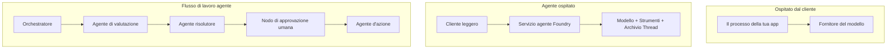
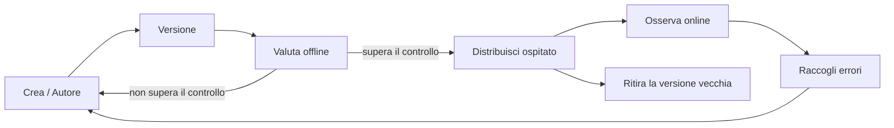
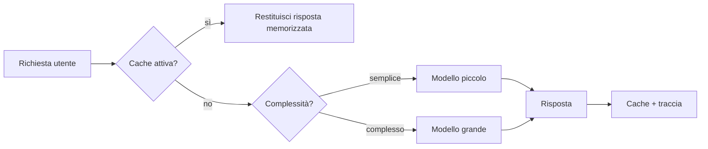
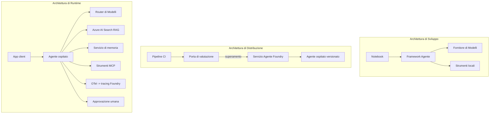

# Distribuire Agenti Scalabili con Microsoft Foundry


Fino a questo punto del corso hai costruito agenti che girano sul tuo laptop, all'interno di un notebook, guidati da `az login` e da alcune variabili d'ambiente. Questo è esattamente il modo giusto per imparare. Non è però il modo corretto per far girare un agente da cui migliaia di clienti dipendono alle 3 del mattino.

Questa lezione riguarda il divario tra "funziona sulla mia macchina" e "funziona, in modo affidabile e conveniente, in produzione." Chiudiamo questo divario usando **Microsoft Foundry** e il **Microsoft Foundry Agent Service**, costruendo un vero agente di assistenza clienti con strumenti, recupero, memoria, valutazione e monitoraggio.

## Introduzione

Questa lezione coprirà:

- La differenza tra un **agente prototipo** e un **agente distribuito**, e perché la transizione riguarda soprattutto tutto ciò che *sta intorno* al modello.
- **Modelli di distribuzione** per agenti: ospitati dal client, ospitati come servizio (Hosted Agents), e orchestrati tramite workflow.
- Il **ciclo di vita dell'agente** su Microsoft Foundry — crea, versiona, distribuisci, valuta, osserva, ritira.
- **Strategie di scalabilità**: instradamento del modello, caching, concorrenza, e design senza stato.
- **Osservabilità** con OpenTelemetry e tracciatura Foundry.
- **Ottimizzazione dei costi** tramite selezione del modello, instradamento, e cancelli di valutazione.
- **Considerazioni aziendali**: governance, approvazione umana, e gestione sicura dei server MCP in produzione.

## Obiettivi di Apprendimento

Dopo aver completato questa lezione, saprai come:

- Scegliere il modello di distribuzione adatto a un carico di lavoro agente specifico.
- Distribuire un agente sul Microsoft Foundry Agent Service affinché sia versionato, governato e osservabile.
- Strumentare un agente per il tracciamento e collegare una pipeline di valutazione che si esegue prima di ogni rilascio.
- Applicare instradamento del modello e caching per mantenere latenza e costi sotto controllo su larga scala.
- Aggiungere un cancello di approvazione umana per azioni ad alto rischio e integrare un server MCP in modo sicuro in produzione.

## Prerequisiti

Questa lezione presuppone che tu abbia completato le lezioni precedenti e che tu sia a tuo agio con:

- Costruire agenti con il [Microsoft Agent Framework](../14-microsoft-agent-framework/README.md) (Lezione 14).
- [Uso degli Strumenti](../04-tool-use/README.md) (Lezione 4) e [Agentic RAG](../05-agentic-rag/README.md) (Lezione 5).
- [Memoria dell’Agente](../13-agent-memory/README.md) (Lezione 13) e [Protocolli Agentic / MCP](../11-agentic-protocols/README.md) (Lezione 11).
- [Osservabilità e Valutazione](../10-ai-agents-production/README.md) (Lezione 10) — questa lezione si basa direttamente su quella.

Avrai inoltre bisogno di:

- Un'**abbonamento Azure** e un **progetto Microsoft Foundry** con almeno un modello chat distribuito.
- L'**Azure CLI** autenticata (`az login`).
- Python 3.12+ e i pacchetti nel repository [`requirements.txt`](../../../requirements.txt).

## Dal Prototipo alla Produzione: Cosa Cambia Davvero

Un agente prototipo e un agente di produzione condividono lo stesso ciclo di base — ragionare, chiamare strumenti, rispondere. Ciò che cambia è tutto ciò che circonda quel ciclo. Il modello è forse il 20% di un agente di produzione; l'altro 80% è lo scheletro operativo.

| Aspetto | Prototipo | Produzione |
| --- | --- | --- |
| **Hosting** | Gira nel tuo notebook | Gira come un servizio ospitato, versionato e distribuito |
| **Identità** | Il tuo token di `az login` | Identità gestita con RBAC con ambito definito |
| **Stato** | In memoria, perso al riavvio | Esternalizzato (thread store, servizio di memoria) |
| **Errori** | Vedi il traceback | Riprova, fallback, dead-letter, allarmi |
| **Costo** | "Sono pochi centesimi" | Tracciato per richiesta, instradato, memorizzato nella cache, budgettato |
| **Qualità** | Controlli visivamente l’output | Valutato automaticamente prima di ogni rilascio |
| **Fiducia** | Approvi ogni azione | Policy + persona nel ciclo per azioni rischiose |

Tieni a mente questa tabella. Ogni sezione qui sotto corrisponde a una di queste righe.

## Modelli di Distribuzione degli Agenti

Ci sono tre modelli che userai, spesso combinati.

### 1. Agenti Ospitati dal Client

L’oggetto agente vive all’interno del processo della *tua* applicazione. Il tuo codice chiama direttamente il provider del modello; il ciclo di ragionamento gira nel tuo servizio. Questo è ciò che ogni lezione precedente ha fatto.

- **Usalo quando** hai bisogno di controllo totale sul ciclo, middleware personalizzato, o stai integrando l’agente in un backend esistente.
- **Compromesso**: gestisci tu stesso scalabilità, stato e resilienza.

### 2. Agenti Ospitati (Foundry Agent Service)

L’agente è *registrato come risorsa* in Microsoft Foundry. Foundry ospita il ciclo di ragionamento, memorizza i thread, applica la sicurezza dei contenuti e l’RBAC, e rende l’agente visibile nel portale Foundry. La tua app diventa un client leggero che crea thread e legge risposte.

- **Usalo quando** vuoi durabilità, osservabilità integrata, governance, e meno superficie operativa.
- **Compromesso**: meno controllo di basso livello in cambio di un runtime gestito.

### 3. Workflow degli Agenti

Molti agenti (e strumenti) sono composti in un grafo con flusso di controllo esplicito — passaggi sequenziali, diramazioni, nodi di approvazione umana, e checkpoint duraturi che possono mettere in pausa e riprendere. Questa è la capacità **Workflow** del Microsoft Agent Framework applicata alla scala di distribuzione.

- **Usalo quando** un singolo compito coinvolge diversi agenti specializzati o richiede un passaggio di approvazione nel mezzo.
- **Compromesso**: più elementi in movimento; necessita osservabilità a livello di orchestrazione.



## Il Ciclo di Vita dell’Agente su Microsoft Foundry

Distribuire un agente non è un `push` una tantum. È un ciclo, e assomiglia molto a un ciclo di rilascio software perché è esattamente quello che è.



L'idea chiave, ripresa da [Lezione 10](../10-ai-agents-production/README.md): **la valutazione offline è un cancello, non un ripensamento.** Una nuova versione dell’agente non viene distribuita se non supera le tue soglie di valutazione. L’osservabilità online poi alimenta i fallimenti reali nel tuo set di test offline. Questo è tutto il ciclo.

## Strategie di Scalabilità

Scalare un agente è diverso dal scalare un’API web senza stato, perché ogni richiesta può innescare molte chiamate costose a modelli e strumenti. Quattro tecniche sostengono la maggior parte del carico.

**Gestione delle richieste senza stato.** Non conservare alcuno stato per utente nella memoria di processo. Conserva i thread delle conversazioni nel thread store di Foundry o in un servizio di memoria così ogni istanza può gestire ogni richiesta. Questo ti permette di scalare orizzontalmente — aggiungi istanze, senza sessioni sticky.

**Instradamento del modello.** Non ogni richiesta ha bisogno del tuo modello più potente (e più costoso). Instrada le richieste semplici — classificazione dell’intento, risposte fattuali brevi — a un modello piccolo e veloce, e riserva il modello grande per il vero ragionamento. Il **Model Router** di Foundry può farlo per te, oppure puoi implementare un classificatore leggero da solo. Costruirai la versione fai-da-te nel laboratorio.

**Caching delle risposte.** Molte richieste di supporto sono quasi duplicati ("come faccio a resettare la mia password?"). Memorizza in cache le risposte alle domande comuni e servile senza invocare il modello. Anche un modesto tasso di hit nella cache riduce significativamente costi e latenza.

**Concorrenza e backpressure.** I provider di modelli hanno limiti di velocità. Limita la concorrenza, usa ripetizioni con backoff esponenziale, e fallisci con grazia (una risposta in coda "stiamo lavorando" è meglio di un 500).



## Osservabilità in Produzione

Non puoi operare ciò che non puoi vedere. Come trattato nella Lezione 10, il Microsoft Agent Framework emette nativamente tracce **OpenTelemetry** — ogni chiamata modello, invocazione strumento, e passaggio di orchestrazione diventa una span. In produzione esporti queste span in Microsoft Foundry (o in qualsiasi backend compatibile OTel) così puoi:

- Tracciare un singolo reclamo cliente end-to-end attraverso ogni chiamata modello e strumento.
- Monitorare la latenza p50/p95 e i costi per richiesta nel tempo.
- Allertare su picchi di tasso di errore e anomalie di costo prima che gli utenti (o il team finanziario) se ne accorgano.

```python
from agent_framework.observability import get_tracer

tracer = get_tracer()

with tracer.start_as_current_span("support_request") as span:
    span.set_attribute("customer.tier", "enterprise")
    span.set_attribute("routed.model", "gpt-5-nano")
    # l'esecuzione dell'agente viene tracciata automaticamente all'interno di questo intervallo
```

Attributi come `customer.tier` e `routed.model` trasformano una parete di tracce in domande a cui si può rispondere ("i clienti enterprise vengono instradati troppo spesso al modello piccolo?").

## Ottimizzazione dei Costi

Il costo negli agenti di produzione è dominato dai token. Tre leve, in ordine di impatto:

1. **Scegliere la dimensione giusta del modello.** Un modello piccolo che supera il cancello di valutazione è quasi sempre più economico di uno grande che passa anch’esso. Usa la valutazione per *dimostrare* che il modello piccolo è sufficiente invece di defaultare al modello più grande per cautela.
2. **Instradare in base alla complessità.** Come sopra — paga i prezzi del modello grande solo per le richieste che necessitano ragionamento da modello grande.
3. **Cache aggressivamente.** La chiamata modello più economica è quella che non fai mai.

I cancelli di valutazione e il controllo dei costi sono la stessa disciplina vista da due angoli: la valutazione ti dice il *pavimento di qualità*, l’instradamento e il caching ti mantengono il più vicino possibile al *costo* di quel pavimento.

## Considerazioni per la Distribuzione Aziendale

**Governance.** Gli Hosted Agents ereditano l’RBAC, la sicurezza dei contenuti e la registrazione audit di Foundry. Assegna a ogni agente un’identità gestita con il minimo privilegio necessario — accesso in sola lettura alla knowledge base, accesso limitato all’API di ticketing, nulla di più.

**Persona nel ciclo.** Alcune azioni sono troppo importanti per essere automatizzate completamente — emettere un rimborso, eliminare un account, escalation a un team legale. Il Microsoft Agent Framework supporta strumenti con **approvazione richiesta**: l’agente propone l’azione, l’esecuzione si mette in pausa, una persona approva o rifiuta, e il workflow riprende. Hai visto il primitivo in [Lezione 6](../06-building-trustworthy-agents/README.md); qui lo distribuisci.

**MCP in produzione.** [MCP](../11-agentic-protocols/README.md) permette al tuo agente di consumare strumenti esterni tramite un’interfaccia standard. In produzione, tratta ogni server MCP come un confine non affidabile: fissa la versione del server, eseguilo con un’identità limitata, valida i suoi output, e mai esporre segreti a esso. Un server MCP è una dipendenza, e le dipendenze vengono aggiornate, controllate e rate-limited.



Quei tre diagrammi — sviluppo, distribuzione, runtime — sono lo stesso agente in tre fasi della sua vita. Il laboratorio che segue ti guida nella sua costruzione.

## Laboratorio Pratico: Un Agente di Supporto Clienti Pronto per la Produzione

Apri [`code_samples/16-python-agent-framework.ipynb`](./code_samples/16-python-agent-framework.ipynb) e seguilo dall’inizio alla fine. Assemblerai un **agente di supporto clienti Contoso** con ogni preoccupazione di produzione collegata:

1. **Chiamata agli strumenti** — consulta lo stato degli ordini e apri ticket di supporto.
2. **RAG** — rispondi a domande sulla policy da una knowledge base (Azure AI Search, con fallback in memoria così il notebook può girare senza risorsa Search).
3. **Memoria** — ricorda il cliente attraverso i turni di conversazione.
4. **Instradamento del modello** — un classificatore di complessità instrada ogni richiesta a un modello piccolo o grande.
5. **Caching delle risposte** — le domande ripetute sono servite da cache.
6. **Approvazione umana** — i rimborsi oltre una soglia mettono in pausa per l’approvazione umana.
7. **Pipeline di valutazione** — un piccolo set di test offline valuta l’agente e funge da cancello di rilascio.
8. **Osservabilità** — tracciatura OpenTelemetry attorno a ogni richiesta.

### Guida Passo a Passo

Il notebook è organizzato in sezioni auto-contenute e eseguibili per ogni preoccupazione di produzione. Il cuore è il gestore di richieste routing-plus-caching:

```python
async def handle_support_request(query: str, customer_id: str) -> str:
    # 1. Servire dalla cache quando possibile.
    cached = response_cache.get(normalize(query))
    if cached:
        return cached

    # 2. Instradare in base alla complessità per controllare i costi.
    model = "gpt-5-nano" if is_simple(query) else "gpt-5-mini"

    # 3. Eseguire l'agente all'interno di uno span di traccia per l'osservabilità.
    with tracer.start_as_current_span("support_request") as span:
        span.set_attribute("routed.model", model)
        span.set_attribute("customer.id", customer_id)
        response = await support_agent.run(query, model=model)

    # 4. Memorizzare nella cache e restituire.
    response_cache.set(normalize(query), response.text)
    return response.text
```

Il cancello di valutazione che protegge un rilascio è simile a questo:

```python
async def evaluation_gate(agent, test_cases, threshold: float = 0.8) -> bool:
    passed = 0
    for case in test_cases:
        result = await agent.run(case["input"])
        if score_response(result.text, case["expected"]) >= 0.8:
            passed += 1
    pass_rate = passed / len(test_cases)
    print(f"Evaluation pass rate: {pass_rate:.0%} (gate: {threshold:.0%})")
    return pass_rate >= threshold  # distribuisci solo se il cancello passa
```

Leggi ogni riga — il notebook mantiene i primitivi deliberatamente piccoli così nulla è nascosto dietro una chiamata framework.

## Validare un Agente Distribuito con Test Smoke

Il cancello di valutazione sopra gira *offline* contro il tuo oggetto agente. Una volta che l’agente è distribuito come Hosted Agent, ti serve un controllo in più, ancora più economico: **l’endpoint distribuito risponde davvero?**

Distribuire "con successo" dimostra solo che il piano di controllo ha accettato la definizione — non dimostra che l’agente risponda. Una dipendenza mancante, un errato instradamento modello, o una connessione scaduta possono lasciare una distribuzione verde che non risponde nulla. Un **test smoke** lo intercetta in secondi, a ogni deploy, senza il costo di una valutazione completa.

Questo repository fornisce una pipeline pronta all’uso di test smoke basata sul GitHub Action [AI Smoke Test](https://github.com/marketplace/actions/ai-smoke-test):

- **Catalogo** — [`tests/lesson-16-smoke-tests.json`](../../../tests/lesson-16-smoke-tests.json) contiene prompt e asserzioni per l’agente di supporto Contoso (risposte grounded sulla policy, ricerca di un ordine, rimanere sul tema, continuità multi-turno). Cataloghi per agenti di altre lezioni vivono insieme; vedi [`tests/README.md`](../tests/README.md).
- **Workflow** — [`.github/workflows/smoke-test.yml`](../../../.github/workflows/smoke-test.yml) esegue il login con Azure OIDC e invia in POST ogni prompt all’endpoint Responses dell’agente, fallendo il lavoro al minimo errore di asserzione.

```yaml
- name: Smoke-test hosted agent
  uses: JFolberth/ai-smoketest@v1
  with:
    project_endpoint: ${{ inputs.project_endpoint }}
    agent_name: ContosoSupportAgent
    tests_file: tests/lesson-16-smoke-tests.json
```


Eseguilo dalla scheda **Actions** una volta che il tuo agente è distribuito, fornendo l'endpoint del progetto Foundry e il nome dell'agente. L'identità federata necessita del ruolo **Azure AI User** a livello di progetto Foundry. Pensa agli strati come a una piramide: i test smoke (raggiungibile e risponde?) vengono eseguiti ad ogni distribuzione, la valutazione offline (abbastanza buona per essere rilasciata?) viene eseguita prima della promozione e la valutazione online (come si comporta sul campo?) viene eseguita continuamente.

## Verifica della Conoscenza

Metti alla prova la tua comprensione prima di passare all'assegnazione.

**1. Approssimativamente, quanto di un agente in produzione è "il modello" e cos'è il resto?**

<details>
<summary>Risposta</summary>

Il modello è una minoranza del sistema — spesso citato intorno al 20%. Il resto è lo scheletro operativo: hosting e versioning, identità e RBAC, stato esternalizzato, gestione dei guasti, monitoraggio dei costi, valutazione e controlli con intervento umano. Passare alla produzione riguarda principalmente costruire tutto *attorno* al ciclo di ragionamento.
</details>

**2. Quando sceglieresti un Hosted Agent invece di un agente ospitato dal client?**

<details>
<summary>Risposta</summary>

Quando desideri un runtime gestito con durabilità incorporata (thread persistenti e resume), osservabilità, sicurezza dei contenuti e RBAC, e sei disposto a scambiare un po' di controllo di basso livello sul ciclo di ragionamento per una minore superficie operativa. L'agente ospitato dal client è preferibile quando hai bisogno di pieno controllo sul ciclo o stai integrando l'agente in un backend esistente.
</details>

**3. Perché un agente scalabile deve essere senza stato nella memoria del proprio processo?**

<details>
<summary>Risposta</summary>

Così ogni istanza può gestire qualsiasi richiesta, il che consente la scalabilità orizzontale senza sessioni sticky. Lo stato della conversazione per utente è esternalizzato in un archivio di thread o servizio di memoria. Se lo stato risiedesse nella memoria del processo, lo perderesti al riavvio e non potresti distribuire liberamente il carico.
</details>

**4. Quale problema risolve il model routing e quale relazione ha con la valutazione?**

<details>
<summary>Risposta</summary>

Il routing indirizza richieste semplici a un modello piccolo, economico e veloce e riserva il modello grande per il vero ragionamento, controllando sia la latenza che il costo. Si collega alla valutazione perché la valutazione è ciò che *dimostra* che il modello piccolo è abbastanza buono per una classe di richieste — il routing senza valutazione è un azzardo.
</details>

**5. Cos'è un "evaluation gate" e dove si colloca nel ciclo di vita?**

<details>
<summary>Risposta</summary>

Un evaluation gate esegue un set di test offline contro una nuova versione dell'agente e blocca la distribuzione a meno che la percentuale di superamento non superi una soglia. Si colloca tra "versione" e "distribuzione" nel ciclo di vita, rendendo la qualità una condizione preliminare per il rilascio e non qualcosa da controllare dopo il rilascio.
</details>

**6. Perché un server MCP deve essere trattato come un confine non affidabile in produzione?**

<details>
<summary>Risposta</summary>

Perché è una dipendenza esterna a cui il tuo agente si rivolge. Dovresti fissarne la versione, eseguirlo con un'identità limitata, convalidare i suoi output, limitare la frequenza delle chiamate e mai esporre segreti — la stessa disciplina che applichi a qualsiasi dipendenza di terze parti. I suoi output entrano nel ragionamento del tuo agente, quindi fidarsi senza convalida è un rischio per la sicurezza.
</details>

**7. Quale singolo cambiamento ha solitamente il maggiore impatto sul costo di un agente in produzione e perché?**

<details>
<summary>Risposta</summary>

Dimensionare correttamente il modello — usare il modello più piccolo che passa ancora il tuo evaluation gate. Il costo è dominato dai token, e un modello più piccolo che soddisfa la soglia di qualità è quasi sempre più economico di uno più grande. La memorizzazione nella cache e il routing riducono ulteriormente il costo, ma scegliere il modello base giusto ha il più grande effetto di primo ordine.
</details>

**8. Quale ruolo giocano attributi di span come `customer.tier` e `routed.model` nell'osservabilità?**

<details>
<summary>Risposta</summary>

Transformano tracce grezze in domande di business cui si può rispondere. Senza attributi hai solo una parete di span; con essi puoi chiedere "i clienti enterprise vengono indirizzati troppo spesso al modello piccolo?" o "quale modello gestisce le nostre richieste più lente?" Gli attributi sono come segmentare la telemetria nelle dimensioni che contano per la tua operazione.
</details>

## Assegnazione

Prendi l'agente di supporto clienti dal laboratorio e rafforzalo per uno scenario specifico: **un agente di supporto per la fatturazione abbonamenti per un'azienda SaaS.**

Il tuo invio dovrebbe:

1. **Sostituire gli strumenti** con quelli rilevanti per la fatturazione: `get_subscription_status`, `get_invoice`, e `issue_credit` (i crediti superiori a $50 richiedono approvazione umana).
2. **Aggiungere tre documenti RAG** che coprano la politica di rimborso dell'azienda, il ciclo di fatturazione e la politica di cancellazione.
3. **Estendere il set di valutazione** ad almeno otto casi, includendo almeno due che *dovrebbero* attivare il percorso di approvazione umana, e confermare che il tuo evaluation gate passa o fallisce correttamente.
4. **Aggiungere un report dei costi**: dopo aver eseguito dieci query miste attraverso l'agente, stampare quante sono andate al modello piccolo, quante a quello grande e quante sono state servite dalla cache.

Scrivi un breve paragrafo (in una cella markdown) spiegando quale regola di routing modello hai scelto e come la convalideresti con traffico reale. Non esiste una risposta corretta unica — sarai valutato sul fatto che le preoccupazioni di produzione siano collegate in modo coerente.

## Sommario

In questa lezione hai portato un agente dal prototipo alla produzione con Microsoft Foundry:

- Il salto alla produzione riguarda soprattutto lo **scheletro operativo** attorno al modello — hosting, identità, stato, gestione dei guasti, costi, qualità e fiducia.
- Hai imparato i tre **modelli di distribuzione** — client-hosted, Hosted Agents e Agent Workflows — e quando ciascuno è adatto.
- Hai seguito il **ciclo di vita dell'agente**, dove la valutazione offline **agisce come un gate di rilascio** e l'osservabilità online alimenta i guasti nel set di test.
- Hai applicato **strategie di scalabilità** — design senza stato, routing del modello, caching e concorrenza limitata — e le hai collegate a **ottimizzazione dei costi**.
- Hai integrato **controlli enterprise**: RBAC, approvazione con intervento umano e integrazione MCP sicura per la produzione.
- Hai costruito un **agente di supporto clienti pronto per la produzione** che collega tutte queste preoccupazioni in codice eseguibile.

La prossima lezione compie il percorso opposto: invece di scalare gli agenti verso il cloud, li porterai *giù* su una singola macchina dello sviluppatore e li eseguirai interamente localmente.

## Risorse Aggiuntive

- <a href="https://learn.microsoft.com/azure/ai-foundry/what-is-azure-ai-foundry" target="_blank">Documentazione Microsoft Foundry</a>
- <a href="https://learn.microsoft.com/azure/ai-foundry/agents/overview" target="_blank">Panoramica Microsoft Foundry Agent Service</a>
- <a href="https://learn.microsoft.com/en-us/agent-framework/overview/?wt.mc_id=youtube_26688_organicsocial_reactor&pivots=programming-language-python" target="_blank">Microsoft Agent Framework</a>
- <a href="https://learn.microsoft.com/azure/ai-foundry/concepts/model-router" target="_blank">Model Router in Microsoft Foundry</a>
- <a href="https://learn.microsoft.com/azure/search/search-what-is-azure-search" target="_blank">Azure AI Search</a>
- <a href="https://opentelemetry.io/" target="_blank">OpenTelemetry</a>
- <a href="https://github.com/marketplace/actions/ai-smoke-test" target="_blank">GitHub Action AI Smoke Test</a>
- <a href="https://modelcontextprotocol.io/" target="_blank">Model Context Protocol (MCP)</a>

## Lezione Precedente

[Costruire Agenti per l'Uso del Computer (CUA)](../15-browser-use/README.md)

## Lezione Successiva

[Creare Agenti AI Locali](../17-creating-local-ai-agents/README.md)

---

<!-- CO-OP TRANSLATOR DISCLAIMER START -->
**Disclaimer**:
Questo documento è stato tradotto utilizzando il servizio di traduzione AI [Co-op Translator](https://github.com/Azure/co-op-translator). Sebbene ci impegniamo per garantire la precisione, si prega di notare che le traduzioni automatizzate possono contenere errori o imprecisioni. Il documento originale nella sua lingua nativa deve essere considerato la fonte autorevole. Per informazioni critiche, si raccomanda una traduzione professionale effettuata da un essere umano. Non siamo responsabili per eventuali malintesi o interpretazioni errate derivanti dall’uso di questa traduzione.
<!-- CO-OP TRANSLATOR DISCLAIMER END -->