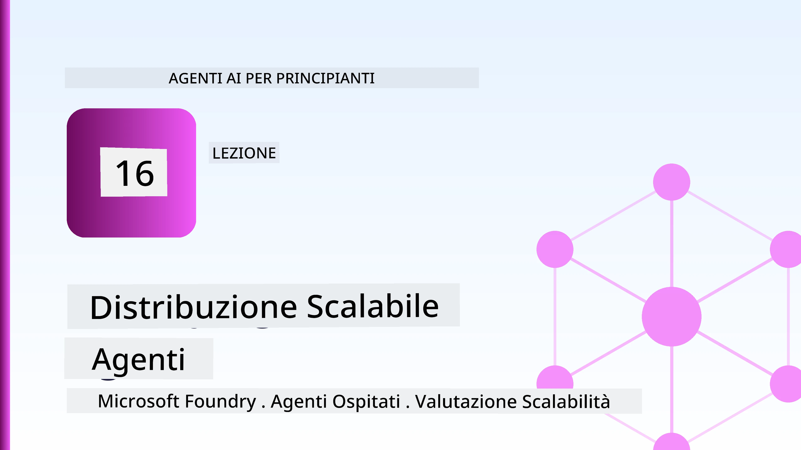
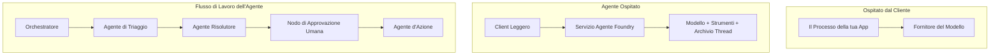
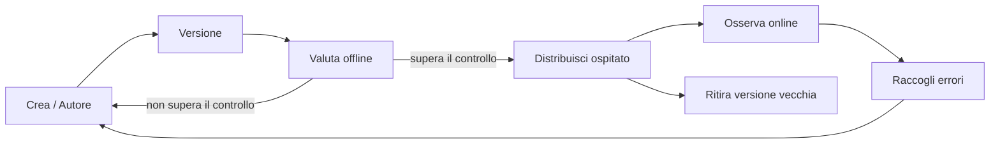
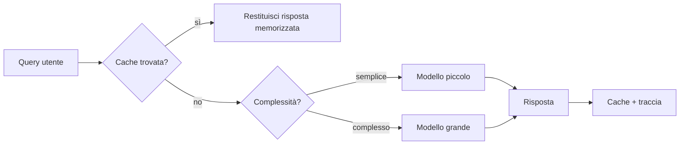
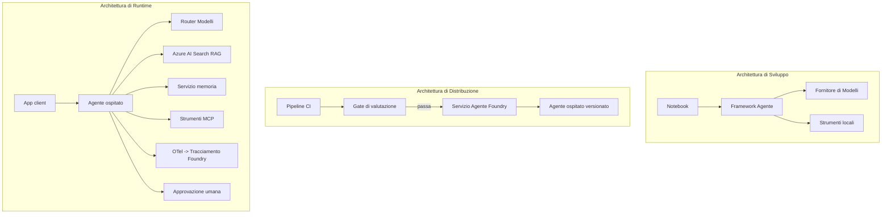

# Distribuire agenti scalabili con Microsoft Foundry



Fino a questo punto del corso hai costruito agenti che girano sul tuo laptop, all'interno di un notebook, guidati da `az login` e da una manciata di variabili d'ambiente. Questo è esattamente il modo giusto per imparare. Non è il modo giusto per far girare un agente da cui migliaia di clienti dipendono alle 3 di notte.

Questa lezione riguarda il divario tra "funziona sulla mia macchina" e "funziona, in modo affidabile e conveniente, in produzione." Chiudiamo quel divario usando **Microsoft Foundry** e il **Microsoft Foundry Agent Service**, e lo facciamo costruendo un vero agente di supporto clienti che dispone di strumenti, recupero, memoria, valutazione e monitoraggio.

## Introduzione

Questa lezione coprirà:

- La differenza tra un **agente prototipo** e un **agente distribuito**, e perché la transizione riguarda principalmente tutto ciò che sta *intorno* al modello.
- I **modelli di distribuzione** per agenti: basato su client, basato su servizio (Hosted Agents) e orchestrato da workflow.
- Il **ciclo di vita dell'agente** su Microsoft Foundry — creazione, versione, distribuzione, valutazione, osservazione, ritiro.
- Le **strategie di scalabilità**: instradamento del modello, caching, concorrenza e progettazione senza stato.
- **Osservabilità** con OpenTelemetry e tracing di Foundry.
- **Ottimizzazione dei costi** tramite selezione del modello, instradamento e porte di valutazione.
- **Considerazioni aziendali**: governance, approvazione umana, ed esecuzione sicura dei server MCP in produzione.

## Obiettivi di apprendimento

Completando questa lezione, saprai come:

- Scegliere il modello di distribuzione giusto per un particolare carico di lavoro dell'agente.
- Distribuire un agente sul Microsoft Foundry Agent Service in modo che sia versionato, governato e osservabile.
- Strumentare un agente per il tracing e collegare una pipeline di valutazione che si esegue prima di ogni rilascio.
- Applicare instradamento e caching del modello per mantenere latenza e costi sotto controllo su scala.
- Aggiungere una porta di approvazione umana per azioni ad alto rischio e integrare un server MCP in modo sicuro per la produzione.

## Prerequisiti

Questa lezione presume che tu abbia completato le lezioni precedenti e sia a tuo agio con:

- Costruire agenti con il [Microsoft Agent Framework](../14-microsoft-agent-framework/README.md) (Lezione 14).
- [Uso degli strumenti](../04-tool-use/README.md) (Lezione 4) e [Agentic RAG](../05-agentic-rag/README.md) (Lezione 5).
- [Memoria dell'agente](../13-agent-memory/README.md) (Lezione 13) e [Protocolli agentici / MCP](../11-agentic-protocols/README.md) (Lezione 11).
- [Osservabilità e valutazione](../10-ai-agents-production/README.md) (Lezione 10) — questa lezione si basa direttamente su di essa.

Avrai anche bisogno di:

- Un **abbonamento Azure** e un **progetto Microsoft Foundry** con almeno un modello chat distribuito.
- L'**Azure CLI** autenticata (`az login`).
- Python 3.12+ e i pacchetti nel repository [`requirements.txt`](../../../requirements.txt).

## Da prototipo a produzione: cosa cambia davvero

Un agente prototipo e un agente di produzione condividono lo stesso ciclo di base — ragionare, chiamare strumenti, rispondere. Ciò che cambia è tutto ciò che sta attorno a quel ciclo. Il modello è forse il 20% di un agente di produzione; l'altro 80% è lo scheletro operativo.

| Aspetto | Prototipo | Produzione |
| --- | --- | --- |
| **Hosting** | Gira nel tuo notebook | Funziona come un servizio ospitato, versionato e distribuito |
| **Identità** | Il tuo token `az login` | Identità gestita con RBAC limitato |
| **Stato** | In memoria, perso al riavvio | Esteriorizzato (store di thread, servizio di memoria) |
| **Errori** | Vedi il traceback | Ritentativi, fallback, dead-letter, avvisi |
| **Costo** | "Sono pochi centesimi" | Tracciato per richiesta, instradato, cache, budgettato |
| **Qualità** | Valuti visivamente l'output | Valutata automaticamente prima di ogni rilascio |
| **Fiducia** | Approvi ogni azione | Policy + intervento umano per azioni rischiose |

Tieni a mente questa tabella. Ogni sezione qui sotto si riferisce a una di queste righe.

## Modelli di distribuzione degli agenti

Ci sono tre modelli che userai, spesso in combinazione.

### 1. Agenti basati su client

L'oggetto agente vive all'interno del processo della *tua* applicazione. Il tuo codice chiama direttamente il fornitore del modello; il ciclo di ragionamento gira nel tuo servizio. Questo è ciò che ogni lezione precedente ha fatto.

- **Usalo quando** hai bisogno del controllo completo sul ciclo, di middleware personalizzati, o stai incorporando l'agente all'interno di un backend esistente.
- **Contro**: gestisci tu scalabilità, stato e resilienza.

### 2. Agenti ospitati (Foundry Agent Service)

L'agente è *registrato come risorsa* in Microsoft Foundry. Foundry ospita il ciclo di ragionamento, memorizza i thread, applica sicurezza dei contenuti e RBAC, e rende l'agente visibile nel portale Foundry. La tua app diventa un client leggero che crea thread e legge risposte.

- **Usalo quando** vuoi durabilità, osservabilità integrata, governance e un'area operativa ridotta.
- **Contro**: meno controllo a basso livello in cambio di un runtime gestito.

### 3. Workflow per agenti

Molti agenti (e strumenti) sono composti in un grafo con flusso di controllo esplicito — fasi sequenziali, diramazioni, nodi di approvazione umana, e checkpoint duraturi che possono mettere in pausa e riprendere. Questa è la capacità **Workflows** del Microsoft Agent Framework applicata su scala di distribuzione.

- **Usalo quando** un singolo compito coinvolge diversi agenti specializzati o richiede un passo di approvazione a metà.
- **Contro**: più parti mobili; necessita di osservabilità a livello di orchestrazione.



## Ciclo di vita dell'agente su Microsoft Foundry

Distribuire un agente non è un semplice `push` unico. È un ciclo, e somiglia molto a un ciclo di rilascio software perché è esattamente quello che è.



L'idea chiave, portata avanti da [Lezione 10](../10-ai-agents-production/README.md): **la valutazione offline è una porta, non un ripensamento.** Una nuova versione dell'agente non viene rilasciata a meno che non superi le tue soglie di valutazione. L'osservabilità online quindi alimenta i fallimenti reali nei tuoi test offline. Questo è tutto il ciclo.

## Strategie di scalabilità

Scalare un agente è diverso dal scalare un'API web senza stato, perché ogni richiesta può scatenare molteplici chiamate costose a modelli e strumenti. Quattro tecniche sopportano la maggior parte del carico.

**Gestione senza stato della richiesta.** Non mantenere stato per utente nella memoria del processo. Conserva i thread di conversazione nello store di thread Foundry o in un servizio di memoria così qualsiasi istanza può gestire qualsiasi richiesta. Questo permette di scalare orizzontalmente — aggiungere istanze, niente sessioni sticky.

**Instradamento del modello.** Non ogni richiesta necessita del tuo modello più capace (e più costoso). Instrada richieste semplici — classificazione dell'intento, risposte fattuali brevi — a un modello piccolo e veloce, e riserva il modello grande per il ragionamento vero. Il **Model Router** di Foundry può farlo per te, oppure puoi implementare un classificatore leggero da solo. Costruirai la versione fai-da-te nel laboratorio.

**Caching delle risposte.** Molte richieste di supporto sono quasi duplicati ("come resettare la password?"). Memorizza in cache le risposte alle domande comuni e servile senza chiamare affatto il modello. Anche un modesto tasso di hit alla cache riduce significativamente costi e latenza.

**Concorrenza e controllo del flusso.** I fornitori di modelli hanno limiti di velocità. Limita la concorrenza, usa ritentativi con backoff esponenziale, e gestisci i fallimenti elegantemente (una risposta in coda "ci stiamo lavorando" è meglio di un errore 500).



## Osservabilità in produzione

Non puoi gestire ciò che non puoi vedere. Come trattato nella Lezione 10, il Microsoft Agent Framework emette nativamente tracce **OpenTelemetry** — ogni chiamata al modello, invocazione di uno strumento, e passo dell'orchestrazione diventa uno span. In produzione esporti quegli span in Microsoft Foundry (o in qualsiasi backend compatibile OTel) così puoi:

- Tracciare una singola lamentela del cliente end-to-end attraverso ogni chiamata a modelli e strumenti.
- Monitorare latenza p50/p95 e costi per richiesta nel tempo.
- Allertare su picchi di tasso di errore e anomalie di costo prima che gli utenti (o il tuo team finanziario) se ne accorgano.

```python
from agent_framework.observability import get_tracer

tracer = get_tracer()

with tracer.start_as_current_span("support_request") as span:
    span.set_attribute("customer.tier", "enterprise")
    span.set_attribute("routed.model", "gpt-5-nano")
    # l'esecuzione dell'agente è tracciata automaticamente all'interno di questo intervallo
```

Attributi come `customer.tier` e `routed.model` trasformano un muro di tracce in domande rispondibili ("i clienti enterprise vengono instradati troppo spesso al modello piccolo?").

## Ottimizzazione dei costi

Il costo negli agenti di produzione è dominato dai token. Tre leve, in ordine di impatto:

1. **Dimensiona correttamente il modello.** Un modello piccolo che supera la tua porta di valutazione è quasi sempre più economico di uno grande che la supera. Usa la valutazione per *dimostrare* che il modello piccolo è abbastanza buono invece di defaultare al modello più grande per cautela.
2. **Instradamento per complessità.** Come sopra — paga prezzi da modello grande solo per le richieste che necessitano ragionamento da modello grande.
3. **Cache aggressivamente.** La chiamata al modello più economica è quella che non fai mai.

Porte di valutazione e controllo dei costi sono la stessa disciplina vista da due angolazioni: la valutazione ti dice il *pavimento di qualità*, l'instradamento e la cache ti mantengono il più vicino possibile al *costo* di quel pavimento.

## Considerazioni aziendali sulla distribuzione

**Governance.** Gli Hosted Agents ereditano RBAC, sicurezza dei contenuti e logging di audit di Foundry. Dai a ogni agente un'identità gestita con il minimo privilegio necessario — accesso in sola lettura alla knowledge base, accesso limitato all'API di ticketing, niente di più.

**Intervento umano nel ciclo.** Alcune azioni sono troppo importanti per essere automatizzate completamente — emettere un rimborso, cancellare un account, segnalare a un team legale. Il Microsoft Agent Framework supporta strumenti **che richiedono approvazione**: l'agente propone l'azione, l'esecuzione si mette in pausa, un umano approva o rifiuta, e il workflow riprende. Hai visto il primitivo in [Lezione 6](../06-building-trustworthy-agents/README.md); qui lo distribuisci.

**MCP in produzione.** [MCP](../11-agentic-protocols/README.md) permette al tuo agente di consumare strumenti esterni tramite un'interfaccia standard. In produzione, tratta ogni server MCP come un confine non affidabile: blocca la versione del server, eseguilo con un'identità limitata, convalida i suoi output, e non esporre mai segreti. Un server MCP è una dipendenza, e le dipendenze vanno patchate, auditate e limitate.



Questi tre diagrammi — sviluppo, distribuzione, runtime — sono lo stesso agente in tre fasi della sua vita. Il laboratorio che segue ti guida nel costruirlo.

## Laboratorio pratico: un agente di supporto clienti pronto per la produzione

Apri [`code_samples/16-python-agent-framework.ipynb`](./code_samples/16-python-agent-framework.ipynb) e seguilo dall'inizio alla fine. Assemblerai un **agente di supporto clienti Contoso** con ogni preoccupazione di produzione integrata:

1. **Chiamata di strumenti** — cerca lo stato degli ordini e apri ticket di supporto.
2. **RAG** — rispondi a domande di policy da una knowledge base (Azure AI Search, con fallback in memoria così il notebook gira senza risorsa Search).
3. **Memoria** — ricorda il cliente attraverso i turni di conversazione.
4. **Instradamento del modello** — un classificatore di complessità instrada ogni richiesta a un modello piccolo o grande.
5. **Caching delle risposte** — le domande ripetute sono servite dalla cache.
6. **Approvazione umana** — rimborsi sopra una soglia mettono in pausa per approvazione umana.
7. **Pipeline di valutazione** — un piccolo set di test offline valuta l'agente e funge da porta di rilascio.
8. **Osservabilità** — tracing OpenTelemetry intorno a ogni richiesta.

### Guida passo-passo

Il notebook è organizzato in modo che ogni preoccupazione di produzione sia una sezione autonoma e eseguibile. Il cuore è il gestore di richieste routing-plus-caching:

```python
async def handle_support_request(query: str, customer_id: str) -> str:
    # 1. Servire dalla cache quando possibile.
    cached = response_cache.get(normalize(query))
    if cached:
        return cached

    # 2. Instradare per complessità per controllare i costi.
    model = "gpt-5-nano" if is_simple(query) else "gpt-5-mini"

    # 3. Eseguire l'agente all'interno di uno span di tracciamento per l'osservabilità.
    with tracer.start_as_current_span("support_request") as span:
        span.set_attribute("routed.model", model)
        span.set_attribute("customer.id", customer_id)
        response = await support_agent.run(query, model=model)

    # 4. Memorizzare nella cache e restituire.
    response_cache.set(normalize(query), response.text)
    return response.text
```

La porta di valutazione che protegge un rilascio è così:

```python
async def evaluation_gate(agent, test_cases, threshold: float = 0.8) -> bool:
    passed = 0
    for case in test_cases:
        result = await agent.run(case["input"])
        if score_response(result.text, case["expected"]) >= 0.8:
            passed += 1
    pass_rate = passed / len(test_cases)
    print(f"Evaluation pass rate: {pass_rate:.0%} (gate: {threshold:.0%})")
    return pass_rate >= threshold  # distribuisci solo se il gate viene superato
```

Leggi riga per riga — il notebook mantiene i primitivi volutamente piccoli così da non nascondere nulla dietro una chiamata a framework.

## Validazione di un agente distribuito con test smoke

La porta di valutazione sopra gira *offline* contro il tuo oggetto agente. Una volta che l'agente è distribuito come Hosted Agent, ti serve un controllo in più, ancora più economico: **la endpoint distribuita risponde davvero?**

Distribuire "con successo" prova solo che il piano di controllo ha accettato la definizione — non prova che l'agente risponda. Una dipendenza mancante, un errato instradamento modello, o una connessione scaduta possono lasciare una distribuzione con esito positivo ma senza risposte. Un **test smoke** lo rileva in pochi secondi, ad ogni distribuzione, senza il costo di una valutazione completa.

Questo repository fornisce una pipeline di test smoke pronta all'uso costruita sull'azione GitHub [AI Smoke Test](https://github.com/marketplace/actions/ai-smoke-test):

- **Catalogo** — [`tests/lesson-16-smoke-tests.json`](../../../tests/lesson-16-smoke-tests.json) contiene prompt e asserzioni per l'agente di supporto Contoso (risposte policy fondate, ricerca ordini, rimanere on-topic, e continuità di thread multi-turno). I cataloghi per agenti di altre lezioni vivono accanto — vedi [`tests/README.md`](../tests/README.md).
- **Workflow** — [`.github/workflows/smoke-test.yml`](../../../.github/workflows/smoke-test.yml) esegue il login con Azure OIDC e fa POST di ogni prompt all'endpoint Risposte dell'agente, fallendo il lavoro in caso di qualsiasi asserzione non soddisfatta.

```yaml
- name: Smoke-test hosted agent
  uses: JFolberth/ai-smoketest@v1
  with:
    project_endpoint: ${{ inputs.project_endpoint }}
    agent_name: ContosoSupportAgent
    tests_file: tests/lesson-16-smoke-tests.json
```


Eseguilo dalla scheda **Actions** una volta che il tuo agente è distribuito, fornendo il tuo endpoint del progetto Foundry e il nome dell'agente. L'identità federata necessita del ruolo **Azure AI User** a livello di progetto Foundry. Pensa agli strati come a una piramide: i test smoke (raggiungibile e risponde?) vengono eseguiti ad ogni distribuzione, la valutazione offline (abbastanza buona da pubblicare?) viene eseguita prima della promozione e la valutazione online (come si comporta nel mondo reale?) viene eseguita continuamente.

## Verifica delle Conoscenze

Metti alla prova la tua comprensione prima di passare all’assegnazione.

**1. Approssimativamente, quanto di un agente di produzione è "il modello" e cos'è il resto?**

<details>
<summary>Risposta</summary>

Il modello è una minoranza del sistema — spesso si cita circa il 20%. Il resto è lo scheletro operativo: hosting e versioning, identità e RBAC, stato esternalizzato, gestione degli errori, monitoraggio dei costi, valutazione e controlli con intervento umano. Andare in produzione riguarda soprattutto la costruzione di tutto *intorno* al ciclo di ragionamento.
</details>

**2. Quando sceglieresti un Hosted Agent rispetto a un agente ospitato sul client?**

<details>
<summary>Risposta</summary>

Quando vuoi un runtime gestito con durabilità integrata (thread persistenti e riprendibili), osservabilità, sicurezza dei contenuti e RBAC, e sei disposto a scambiare un controllo a basso livello sul ciclo di ragionamento per una minore area operativa. L’hosting su client è preferibile quando hai bisogno del pieno controllo sul ciclo o stai incorporando l’agente in un backend esistente.
</details>

**3. Perché un agente scalabile deve essere senza stato nella memoria del proprio processo?**

<details>
<summary>Risposta</summary>

Così qualsiasi istanza può gestire qualsiasi richiesta, il che consente la scalabilità orizzontale senza sessioni sticky. Lo stato della conversazione per utente è esternalizzato in uno store di thread o servizio di memoria. Se lo stato vivesse nella memoria del processo, lo perderesti al riavvio e non potresti distribuire il carico liberamente.
</details>

**4. Quale problema risolve il routing del modello e come si collega alla valutazione?**

<details>
<summary>Risposta</summary>

Il routing invia richieste semplici a un modello piccolo, economico e veloce e riserva il modello grande per il vero ragionamento, controllando sia la latenza che il costo. Si collega alla valutazione perché è questa che *dimostra* che il modello piccolo è sufficientemente buono per una classe di richieste — il routing senza valutazione è un azzardo.
</details>

**5. Cos’è un "evaluation gate" (filtro di valutazione) e dove si colloca nel ciclo di vita?**

<details>
<summary>Risposta</summary>

Un evaluation gate esegue un test offline su un nuovo agente e blocca la distribuzione a meno che il tasso di successo superi una soglia. Si colloca tra "versione" e "distribuzione" nel ciclo di vita, rendendo la qualità una precondizione per la pubblicazione anziché qualcosa da verificare dopo la pubblicazione.
</details>

**6. Perché un server MCP dovrebbe essere trattato come un confine non affidabile in produzione?**

<details>
<summary>Risposta</summary>

Perché è una dipendenza esterna a cui chiama il tuo agente. Dovresti fissarne la versione, eseguirlo con un’identità limitata, validarne gli output, limitarne la frequenza e non esporre mai segreti — la stessa disciplina applicata a qualsiasi dipendenza di terze parti. I suoi output entrano nel ragionamento del tuo agente, quindi una fiducia non validata è un rischio per la sicurezza.
</details>

**7. Quale singola modifica solitamente ha il maggiore impatto sul costo di un agente di produzione, e perché?**

<details>
<summary>Risposta</summary>

Dimensionare correttamente il modello — usare il modello più piccolo che superi ancora il tuo evaluation gate. Il costo è dominato dai token, e un modello più piccolo che raggiunge il livello di qualità è quasi sempre più economico di uno più grande. Caching e routing riducono ulteriormente i costi, ma scegliere il modello base giusto ha l’effetto principale più grande.
</details>

**8. Che ruolo giocano gli attributi span come `customer.tier` e `routed.model` nell’osservabilità?**

<details>
<summary>Risposta</summary>

Trasformano le tracce grezze in domande aziendali a cui si può rispondere. Senza attributi hai un muro di span; con essi puoi chiedere "i clienti enterprise vengono instradati troppo spesso al modello piccolo?" o "quale modello gestisce le nostre richieste più lente?" Gli attributi sono come segmenti la telemetria secondo le dimensioni importanti per la tua attività.
</details>

## Assegnazione

Prendi l’agente di supporto clienti dal laboratorio e rafforzalo per un caso specifico: **un agente di supporto fatturazione abbonamenti per una società SaaS.**

La tua consegna dovrebbe:

1. **Sostituire gli strumenti** con quelli rilevanti per la fatturazione: `get_subscription_status`, `get_invoice` e `issue_credit` (credito superiore a $50 richiede approvazione umana).
2. **Aggiungere tre documenti RAG** che coprano la politica di rimborso dell’azienda, il ciclo di fatturazione e la politica di cancellazione.
3. **Estendere il set di valutazione** ad almeno otto casi, includendo almeno due che *dovrebbero* attivare il percorso di approvazione umana, e confermare che il tuo evaluation gate passa o boccia correttamente.
4. **Aggiungere un report di costi**: dopo aver eseguito dieci query miste attraverso l’agente, stampa quante sono state indirizzate al modello piccolo, quante al modello grande e quante sono state erogate dalla cache.

Scrivi un breve paragrafo (in una cella markdown) spiegando quale regola di routing del modello hai scelto e come la convalideresti con traffico reale. Non esiste una sola risposta corretta — sarai valutato su quanto le preoccupazioni di produzione sono collegate in modo coerente.

## Sommario

In questa lezione hai portato un agente da prototipo a produzione con Microsoft Foundry:

- Il salto verso la produzione riguarda soprattutto lo **scheletro operativo** intorno al modello — hosting, identità, stato, gestione errori, costi, qualità e fiducia.
- Hai imparato i tre **modelli di distribuzione** — client-hosted, Hosted Agents e Agent Workflows — e quando utilizzarli.
- Hai percorso il **ciclo di vita dell’agente**, dove la valutazione offline **funziona da filtro di rilascio** e l’osservabilità online alimenta i fallimenti nel set di test.
- Hai applicato **strategie di scaling** — progettazione senza stato, routing modello, caching e concorrenza limitata — e li hai collegati a **ottimizzazione dei costi**.
- Hai integrato **controlli aziendali**: RBAC, approvazione con intervento umano e integrazione MCP sicura per la produzione.
- Hai costruito un **agente di supporto clienti pronto per la produzione** che unisce tutte queste preoccupazioni in codice eseguibile.

La lezione successiva compie il percorso inverso: invece di scalare agenti nel cloud, li porterai *giù* su una singola macchina di sviluppo e li eseguirai interamente in locale.

## Risorse Aggiuntive

- <a href="https://learn.microsoft.com/azure/ai-foundry/what-is-azure-ai-foundry" target="_blank">Documentazione Microsoft Foundry</a>
- <a href="https://learn.microsoft.com/azure/ai-foundry/agents/overview" target="_blank">Panoramica Microsoft Foundry Agent Service</a>
- <a href="https://learn.microsoft.com/en-us/agent-framework/overview/?wt.mc_id=youtube_26688_organicsocial_reactor&pivots=programming-language-python" target="_blank">Microsoft Agent Framework</a>
- <a href="https://learn.microsoft.com/azure/ai-foundry/concepts/model-router" target="_blank">Model Router in Microsoft Foundry</a>
- <a href="https://learn.microsoft.com/azure/search/search-what-is-azure-search" target="_blank">Azure AI Search</a>
- <a href="https://opentelemetry.io/" target="_blank">OpenTelemetry</a>
- <a href="https://github.com/marketplace/actions/ai-smoke-test" target="_blank">AI Smoke Test GitHub Action</a>
- <a href="https://modelcontextprotocol.io/" target="_blank">Model Context Protocol (MCP)</a>

## Lezione Precedente

[Costruire Agenti per l'Uso del Computer (CUA)](../15-browser-use/README.md)

## Lezione Successiva

[Creazione di Agenti AI Locali](../17-creating-local-ai-agents/README.md)

---

<!-- CO-OP TRANSLATOR DISCLAIMER START -->
**Disclaimer**:
Questo documento è stato tradotto utilizzando il servizio di traduzione AI [Co-op Translator](https://github.com/Azure/co-op-translator). Sebbene ci impegniamo per garantire la precisione, si prega di notare che le traduzioni automatizzate possono contenere errori o imprecisioni. Il documento originale nella sua lingua nativa deve essere considerato la fonte autorevole. Per informazioni critiche, si raccomanda una traduzione professionale effettuata da un essere umano. Non siamo responsabili per eventuali malintesi o interpretazioni errate derivanti dall’uso di questa traduzione.
<!-- CO-OP TRANSLATOR DISCLAIMER END -->