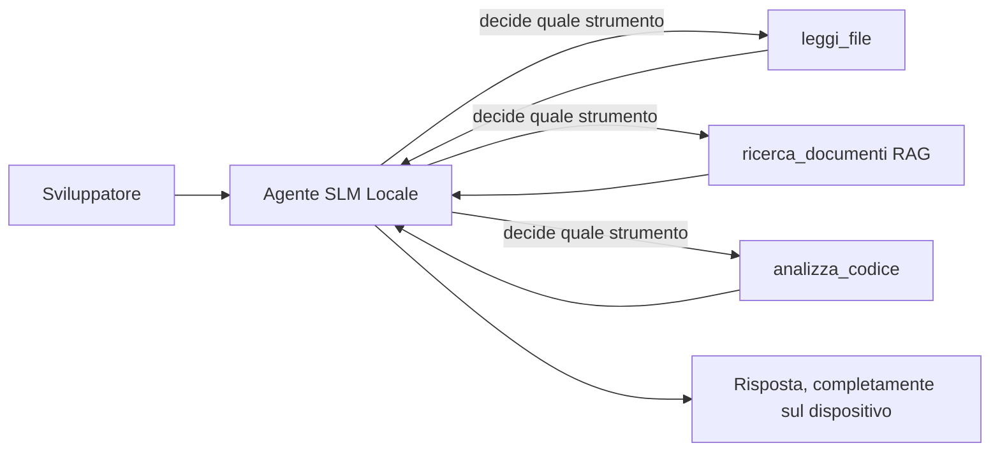
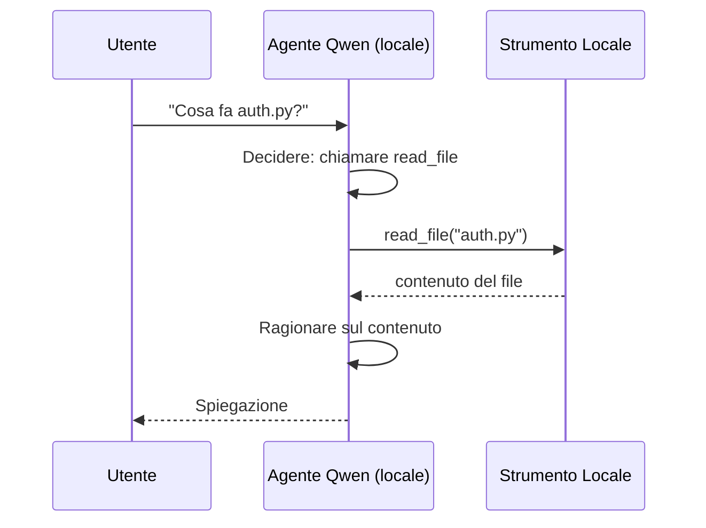
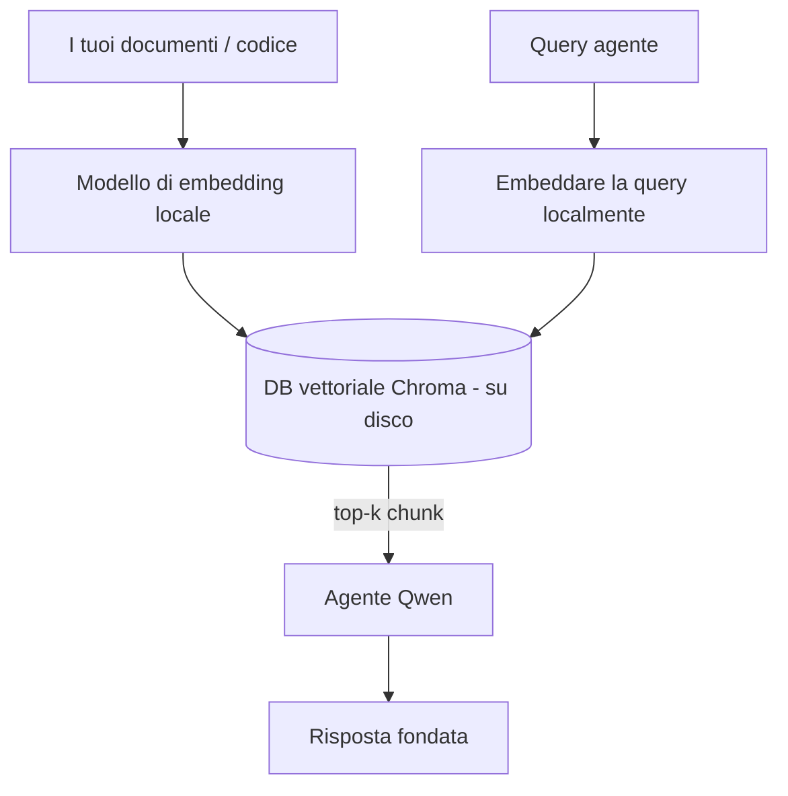
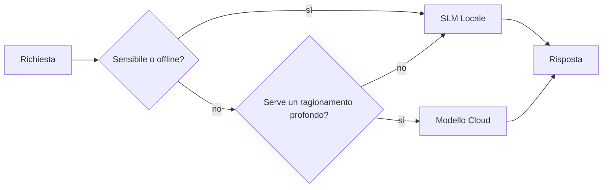

# Creare agenti AI locali utilizzando Microsoft Foundry Local e Qwen


La lezione precedente ha scalato gli agenti *verso l'alto* nel cloud. Questa li porta *verso il basso* su una singola macchina. Alla fine avrai un assistente di ingegneria funzionante che ragiona, chiama strumenti, legge i tuoi file e cerca nella tua documentazione — **senza una singola chiamata di inferenza al cloud.**

Perché lo vorresti? Tre ragioni che emergono costantemente nel lavoro ingegneristico reale:

- **Privacy.** Il codice e i documenti non lasciano mai la macchina. Nessun prompt, nessun snippet, nessun dato cliente attraversa il confine di rete.
- **Costo.** L'inferenza locale non ha un costo per token. Puoi iterare tutto il giorno al prezzo dell'elettricità.
- **Offline.** In aereo, in una struttura sicura o durante un'interruzione, l'agente funziona comunque.

Il compromesso è che stai scambiando un modello cloud di frontiera per un **Small Language Model (SLM)** che gira sulla tua CPU, GPU o NPU. Questa lezione riguarda la costruzione di agenti che siano *validi* entro questo vincolo piuttosto che fingere che il vincolo non esista.

## Introduzione

Questa lezione tratterà:

- **Small Language Models (SLM)** — cosa sono, dove brillano e dove no.
- **Microsoft Foundry Local** — un runtime che scarica e serve modelli sul dispositivo tramite un'**API compatibile OpenAI**.
- **Modelli Qwen per chiamata di funzione** — SLM che producono affidabilmente chiamate agli strumenti, cosa che rende possibile avere agenti *locali* (non solo chat locale).
- **Strumenti locali, RAG locale e MCP locale** — dando capacità all'agente senza il cloud.
- **Modelli ibridi** — quando mantenere le cose locali e quando rivolgersi al cloud.

## Obiettivi di apprendimento

Dopo aver completato questa lezione, saprai come:

- Spiegare i compromessi degli SLM e scegliere i casi d'uso appropriati per agenti locali.
- Servire un modello Qwen localmente con Foundry Local e connetterti attraverso l'endpoint compatibile OpenAI.
- Costruire un agente che chiama strumenti che gira interamente sulla tua workstation.
- Aggiungere RAG locale sui tuoi documenti usando un database vettoriale locale (Chroma).
- Collegare l'agente a un server MCP locale e ragionare su design ibridi locale/cloud.

## Prerequisiti

Questa lezione assume che tu abbia completato le lezioni precedenti e che ti senta a tuo agio con:

- [Uso degli strumenti](../04-tool-use/README.md) (Lezione 4) e [Agentic RAG](../05-agentic-rag/README.md) (Lezione 5).
- [Protocolli agentici / MCP](../11-agentic-protocols/README.md) (Lezione 11).
- Il [Microsoft Agent Framework](../14-microsoft-agent-framework/README.md) (Lezione 14).

Avrai inoltre bisogno di:

- Una workstation per sviluppatori. **8 GB di RAM sono un minimo realistico**; 16 GB+ sono confortevoli. Una GPU o NPU aiuta ma non è obbligatoria.
- **Microsoft Foundry Local** installato (vedi la sezione di configurazione qui sotto).
- Python 3.12+ e i pacchetti nel repository [`requirements.txt`](../../../requirements.txt), più `foundry-local-sdk`, `openai` e `chromadb` per questa lezione.

## Small Language Models: Lo strumento giusto per il lavoro locale

Un modello cloud di frontiera ha centinaia di miliardi di parametri e un data center dietro di sé. Un SLM ha pochi miliardi di parametri e deve stare nella RAM del tuo portatile. Questa differenza crea aspettative chiare.

**Gli SLM sono bravi in:**

- Compiti strutturati e limitati — classificazione, estrazione, riassunto di un documento noto.
- **Chiamata di strumenti** — decidere quale funzione chiamare e con quali argomenti.
- Iterazioni veloci, economiche e private sui tuoi dati.

**Gli SLM sono meno forti in:**

- Ragionamenti aperti, multi-hop, su ampi contesti.
- Conoscenza ampia del mondo (hanno visto meno e dimenticano di più).

La strategia vincente per agenti locali è quindi: **lascia che l'SLM orchestrare, e lascia che gli strumenti facciano il lavoro pesante.** Il modello non deve *conoscere* il tuo codice, ma deve sapere quando chiamare `read_file` e `search_docs`. Questo fa leva direttamente sui punti di forza di un SLM.



## Microsoft Foundry Local

**Microsoft Foundry Local** è un runtime leggero che scarica, gestisce e serve modelli interamente sulla tua macchina. La sua caratteristica più importante per noi è che espone un **endpoint HTTP compatibile OpenAI** — il che significa che l'SDK OpenAI e il client OpenAI del Microsoft Agent Framework funzionano con esso cambiando solo il `base_url`. Tutto quello che hai imparato a costruire agenti si trasferisce direttamente; cambia solo l'endpoint che si sposta dal cloud a `localhost`.

Foundry Local sceglie automaticamente la build migliore di un modello per il tuo hardware — build CPU, build CUDA/GPU o build NPU — così non devi ottimizzare manualmente per ogni macchina.

### Configurazione

Installa Foundry Local (vedi la [documentazione](https://learn.microsoft.com/azure/ai-foundry/foundry-local/) per il tuo sistema operativo), poi verifica che funzioni:

```bash
# Installa (esempio; segui la documentazione per la tua piattaforma)
winget install Microsoft.FoundryLocal      # Windows
# brew install microsoft/foundrylocal/foundrylocal   # macOS

# Scarica ed esegui un modello Qwen, poi avvia il servizio locale
foundry model run qwen2.5-7b-instruct
foundry service status
```

Una volta che il servizio è in esecuzione, hai un endpoint locale compatibile OpenAI (tipicamente `http://localhost:PORT/v1`). Il notebook usa il `foundry-local-sdk` per scoprire automaticamente l'endpoint, così non devi codificare a mano la porta.

## Chiamata di funzione Qwen: Perché è importante

Un agente è solo un agente se può chiamare strumenti. Molti SLM chat possono chattare ma producono chiamate strumenti inaffidabili o malformate. I modelli **Qwen** sono addestrati per la chiamata di funzioni e emettono strutture di chiamata strumenti ben formate in modo consistente — ed è esattamente ciò che trasforma un modello di chat locale in un *agente* locale.

Il flusso è il ciclo standard di chiamata strumenti che già conosci, solo che gira sul dispositivo:



## RAG locale

La ricerca nella documentazione è dove gli agenti locali danno il meglio. Invece di sperare che l'SLM abbia memorizzato la documentazione del tuo framework, inserisci quei documenti in un **database vettoriale locale** e lascia che l'agente recuperi i blocchi rilevanti su richiesta.

Usiamo **Chroma**, un archivio vettoriale embedded che gira in-process senza bisogno di server da gestire. La pipeline è interamente locale: modello di embedding locale → vettori locali → recupero locale → SLM locale.



Questo è lo stesso modello Agentic RAG della Lezione 5 — l'unica differenza è che ogni componente gira sulla tua macchina.

## Server MCP locali

[MCP](../11-agentic-protocols/README.md) è un trasporto, non un servizio cloud. Un server MCP può girare come processo locale su `stdio`, esponendo strumenti al tuo agente tramite il protocollo standard. Questo ti permette di riutilizzare l'ecosistema crescente di server MCP — accesso al file system, operazioni git, query database — completamente offline.

La postura di sicurezza è diversa dal cloud, ma non assente: un server MCP locale gira ancora con i permessi del tuo utente, quindi limita cosa può toccare (una directory di progetto, non tutta la tua home) e tratta i suoi output come input da convalidare.

## Modelli ibridi cloud e locali

Local-first non significa solo locale. Sistemi maturi instradano in base a sensibilità e difficoltà:

| Situazione | Dove gira |
| --- | --- |
| Codice / dati sensibili, o offline | **SLM locale** |
| Compito semplice e limitato | **SLM locale** (economico, veloce) |
| Ragionamento multi-hop difficile su dati non sensibili | **Modello cloud** |
| Tutto durante un'interruzione | **SLM locale** (degrado elegante) |

Questo riflette l'idea di **instradamento modello** della Lezione 16 — eccetto che uno dei "modelli" ora è la tua macchina. Un design robusto ricade sul locale quando il cloud non è disponibile, così l'agente degrada in qualità anziché fallire completamente.



## Laboratorio pratico: un assistente di ingegneria locale

Apri [`code_samples/17-local-agent-foundry-local.ipynb`](./code_samples/17-local-agent-foundry-local.ipynb) e segui. Costruirai un **assistente di ingegneria locale** che gira interamente sulla tua workstation e può:

1. **Chiamare strumenti** — tramite chiamata funzione Qwen attraverso Foundry Local.
2. **Eseguire operazioni su file locali** — elencare e leggere file in una directory di progetto.
3. **Analizzare codice** — riportare metriche base su un file sorgente.
4. **Cercare nella documentazione** — RAG locale su una cartella docs con Chroma.
5. **Usare MCP** — connettersi a un server MCP locale (con salto elegante se nessuno è configurato).

Nessuna inferenza cloud viene usata in nessun momento.

### Guida passo passo

L'assistente si connette a Foundry Local tramite l'endpoint compatibile OpenAI, quindi il codice dell'agente è quasi identico alle lezioni sul cloud — cambia solo il client:

```python
from foundry_local import FoundryLocalManager
from openai import OpenAI

# Foundry Local scopre/scarica il modello e ci fornisce un endpoint locale.
manager = FoundryLocalManager(\"qwen2.5-7b-instruct\")
client = OpenAI(base_url=manager.endpoint, api_key=manager.api_key)  # api_key è un segnaposto locale
```

Gli strumenti sono funzioni Python ordinarie limitate a una directory di progetto:

```python
def read_file(path: str) -> str:
    \"\"\"Read a file, but only inside the sandboxed project directory.\"\"\"
    full = (PROJECT_ROOT / path).resolve()
    if PROJECT_ROOT not in full.parents and full != PROJECT_ROOT:
        return \"Access denied: path is outside the project directory.\"
    return full.read_text(encoding=\"utf-8\")
```

Nota il controllo sandbox — anche localmente, uno strumento che legge percorsi arbitrari è una responsabilità. Il notebook tiene ogni strumento confinato a una singola radice di progetto.

## Verifica della conoscenza

Metti alla prova la tua comprensione prima di passare all'assegnazione.

**1. Fornisci due ragioni concrete per eseguire un agente localmente invece che nel cloud.**

<details>
<summary>Risposta</summary>

Qualsiasi due fra: **privacy** (codice e dati non escono dalla macchina), **costo** (nessun costo per token d'inferenza), e **capacità offline** (funziona senza rete — in aereo, in struttura sicura o durante blackout). Vincoli regolatori/compliance che impediscono l'invio di dati fuori dispositivo sono un driver comune della ragione privacy.
</details>

**2. Qual è la divisione del lavoro raccomandata tra un SLM e i suoi strumenti in un agente locale, e perché?**

<details>
<summary>Risposta</summary>

Lascia che l'SLM **orchestri** (decida quale strumento chiamare e con quali argomenti) e lascia che gli **strumenti facciano il lavoro pesante** (leggere file, recuperare documenti, calcolare risultati). Gli SLM sono forti nelle decisioni delimitate come la selezione degli strumenti ma più deboli nella conoscenza ampia e nei ragionamenti multi-hop lunghi, quindi appoggiarsi agli strumenti è un punto di forza.
</details>

**3. Cosa rende possibile riutilizzare il codice per agenti cloud con Foundry Local?**

<details>
<summary>Risposta</summary>

Foundry Local espone un **endpoint HTTP compatibile OpenAI**. L'SDK OpenAI e il client OpenAI del Framework Agent lavorano con esso cambiando solo il `base_url` (e usando una chiave API segnaposto locale). Tutto il resto del codice agente rimane uguale.
</details>

**4. Perché usiamo specificamente un modello di chiamata funzione Qwen invece di qualsiasi SLM?**

<details>
<summary>Risposta</summary>

Perché un agente deve produrre chiamate **agli strumenti** affidabili e ben formate. Molti SLM possono chattare ma emettono chiamate strumenti malformate o incoerenti. I modelli Qwen sono addestrati alla chiamata funzione e producono chiamate strumenti coerenti, il che trasforma un modello di chat locale in un agente locale funzionante.
</details>

**5. Nella pipeline RAG locale, quali componenti girano sulla macchina?**

<details>
<summary>Risposta</summary>

Tutti: il modello di embedding, il database vettoriale (Chroma, su disco), il passaggio di recupero, e l'SLM. I documenti vengono embedded localmente, archiviati localmente, recuperati localmente, e ragionati da un modello locale — nessun componente tocca il cloud.
</details>

**6. Un server MCP locale gira sulla tua macchina. Lo rende automaticamente sicuro? Quale precauzione dovresti comunque prendere?**

<details>
<summary>Risposta</summary>

No. Un server MCP locale gira con i permessi del tuo utente, quindi può toccare tutto ciò che puoi toccare tu. Limitane l'accesso a ciò di cui ha bisogno (per esempio, una singola directory di progetto anziché tutta la tua home) e tratta i suoi output come input da convalidare prima di agirci sopra.
</details>

**7. Descrivi una regola sensata di instradamento ibrido che includa un modello locale.**

<details>
<summary>Risposta</summary>

Instrada richieste sensibili o offline all'SLM locale; instrada compiti semplici e limitati all'SLM locale per velocità e costo; instrada ragionamenti multi-hop difficili su dati non sensibili a un modello cloud; e ricade sull'SLM locale se il cloud non è disponibile così l'agente degrada elegantemente invece di fallire. Questo è l'instradamento modello (Lezione 16) con la macchina locale come uno dei modelli.
</details>

**8. Qual è una cifra minima realistica di RAM per eseguire l'agente locale in questa lezione e cosa ti dà più RAM?**

<details>
<summary>Risposta</summary>

Circa **8 GB** è un minimo realistico; 16 GB+ è confortevole. Più RAM ti permette di eseguire modelli più grandi e capaci e mantenere più contesto in memoria. Una GPU o NPU accelera l'inferenza ma non è necessaria — Foundry Local seleziona una build CPU quando non è disponibile un acceleratore.
</details>

## Compito

Estendi l'assistente di ingegneria locale in un **revisore della documentazione locale** per un piccolo progetto a tua scelta (usa una delle cartelle lezioni di questo repo se vuoi).

La tua consegna dovrebbe:

1. **Indicizzare una vera cartella docs/codice** in Chroma (almeno cinque file).
2. **Aggiungere uno strumento `find_todos`** che scansioni il progetto per commenti `TODO`/`FIXME` e li ritorni con file e numero di riga — mantenendo lo stesso controllo sandbox di `read_file`.

3. **Fai tre domande all'agente** che lo obblighino a combinare strumenti: una domanda puramente RAG, una che richiede la lettura di un file specifico e una che richiede di trovare i TODO.
4. **Misura**: cronometra ciascuna delle tre risposte e annotale in una cella markdown. Commenta se la latenza è accettabile per il tuo flusso di lavoro previsto.

Poi scrivi un breve paragrafo su **cosa sposteresti sul cloud e cosa manterresti locale** per questo revisore, e perché. Verrai valutato sul fatto che i componenti locali siano collegati correttamente e che il tuo ragionamento ibrido sia solido — non sulla qualità del modello.

## Riepilogo

In questa lezione hai costruito un agente che gira interamente sulla tua macchina:

- **Gli SLM** scambiano ampiezza con privacy, costo e operatività offline — e brillano quando **orchestrano strumenti** piuttosto che portare tutta la conoscenza loro stessi.
- **Foundry Local** serve modelli sul dispositivo dietro un **endpoint compatibile OpenAI**, quindi il codice del tuo agente cloud si trasferisce con una semplice modifica di una riga.
- **I modelli Qwen con chiamata di funzione** rendono possibile una chiamata affidabile a strumenti locali — e quindi *agenti* locali.
- **RAG locale** (Chroma) e **MCP locale** danno capacità all'agente senza uscire dalla macchina.
- **I modelli ibridi** ti permettono di instradare per sensibilità e difficoltà, con il locale come soluzione di riserva elegante.

Questo completa l'arco del deployment: la Lezione 16 ha scalato gli agenti su Microsoft Foundry, e questa lezione li ha scalati su una singola workstation. La lezione successiva si concentra su come mantenere sicuri gli agenti deployati.

## Risorse aggiuntive

- <a href="https://learn.microsoft.com/azure/ai-foundry/foundry-local/" target="_blank">Documentazione Microsoft Foundry Local</a>
- <a href="https://learn.microsoft.com/azure/ai-foundry/what-is-azure-ai-foundry" target="_blank">Documentazione Microsoft Foundry</a>
- <a href="https://learn.microsoft.com/en-us/agent-framework/overview/?wt.mc_id=youtube_26688_organicsocial_reactor&pivots=programming-language-python" target="_blank">Microsoft Agent Framework</a>
- <a href="https://qwen.readthedocs.io/en/latest/framework/function_call.html" target="_blank">Documentazione chiamata funzione Qwen</a>
- <a href="https://modelcontextprotocol.io/" target="_blank">Model Context Protocol (MCP)</a>
- <a href="https://docs.trychroma.com/" target="_blank">Database vettoriale Chroma</a>

## Lezione precedente

[Deploying Scalable Agents](../16-deploying-scalable-agents/README.md)

## Lezione successiva

[Securing AI Agents](../18-securing-ai-agents/README.md)

---

<!-- CO-OP TRANSLATOR DISCLAIMER START -->
**Disclaimer**:
Questo documento è stato tradotto utilizzando il servizio di traduzione AI [Co-op Translator](https://github.com/Azure/co-op-translator). Sebbene ci impegniamo per garantire la precisione, si prega di notare che le traduzioni automatizzate possono contenere errori o imprecisioni. Il documento originale nella sua lingua nativa deve essere considerato la fonte autorevole. Per informazioni critiche, si raccomanda una traduzione professionale effettuata da un essere umano. Non siamo responsabili per eventuali malintesi o interpretazioni errate derivanti dall’uso di questa traduzione.
<!-- CO-OP TRANSLATOR DISCLAIMER END -->