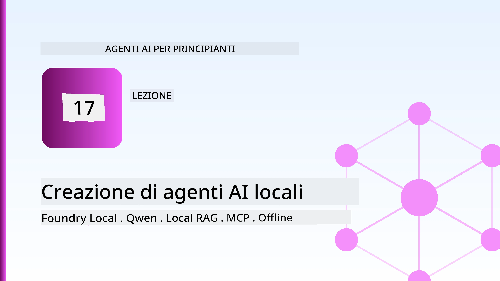
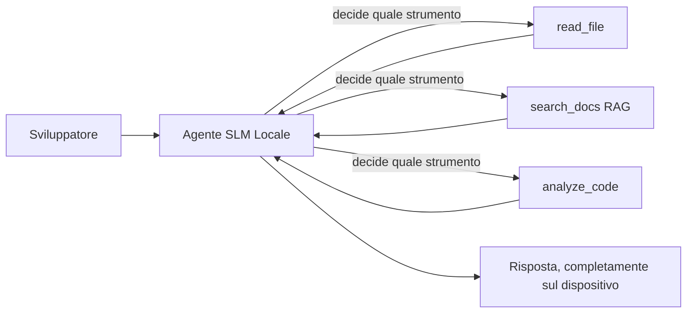
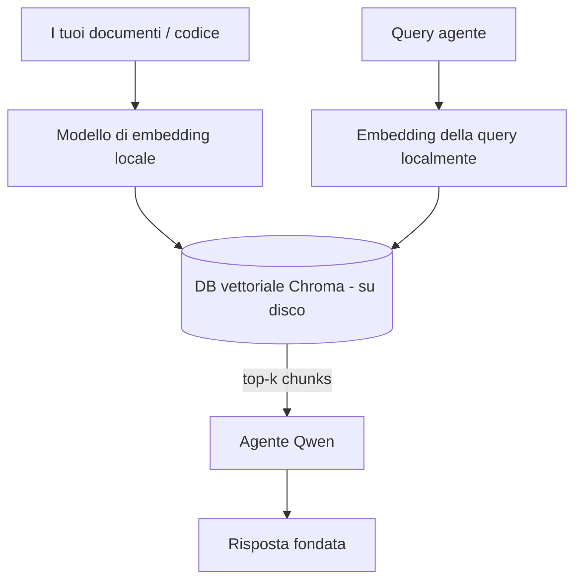
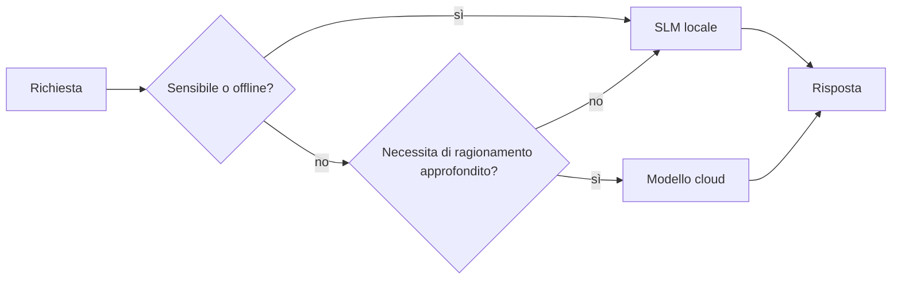

# Creare agenti AI locali usando Microsoft Foundry Local e Qwen



La lezione precedente ha scalato gli agenti *verso l'alto* nel cloud. Questa li porta *verso il basso* su una singola macchina. Alla fine avrai un assistente di ingegneria funzionante che ragiona, chiama strumenti, legge i tuoi file e cerca nella tua documentazione — **senza una singola chiamata di inferenza sul cloud.**

Perché dovresti volerlo? Tre motivi che emergono costantemente nel lavoro di ingegneria reale:

- **Privacy.** Il codice e i documenti non lasciano mai la macchina. Nessun prompt, nessun frammento, nessun dato cliente attraversa il confine di rete.
- **Costo.** L'inferenza locale non ha un costo per token. Puoi iterare tutto il giorno al prezzo dell'elettricità.
- **Offline.** In aereo, in una struttura protetta o durante un'interruzione, l'agente funziona ancora.

Il compromesso è che stai scambiando un modello cloud d'avanguardia per un **Small Language Model (SLM)** che gira sulla tua CPU, GPU o NPU. Questa lezione riguarda la costruzione di agenti che siano *bravi* entro questo vincolo piuttosto che fingere che il vincolo non esista.

## Introduzione

Questa lezione coprirà:

- **Small Language Models (SLM)** — cosa sono, dove si distinguono e dove non lo fanno.
- **Microsoft Foundry Local** — un runtime che scarica e serve modelli direttamente sul dispositivo tramite un'**API compatibile OpenAI**.
- **Modelli Qwen con chiamata di funzione** — SLM che producono chiamate a strumenti in modo affidabile, ciò che rende possibile avere agenti locali (non solo chat locali).
- **Strumenti locali, RAG locale e MCP locale** — per fornire capacità all'agente senza il cloud.
- **Modelli ibridi** — quando mantenere le cose locali e quando rivolgersi al cloud.

## Obiettivi di apprendimento

Dopo aver completato questa lezione, saprai come:

- Spiegare i compromessi degli SLM e scegliere i casi d'uso appropriati per agenti locali.
- Servire un modello Qwen localmente con Foundry Local e connetterti ad esso tramite l'endpoint compatibile OpenAI.
- Costruire un agente chiamata-strumenti che gira interamente sulla tua workstation.
- Aggiungere RAG locale sui tuoi documenti usando un database vettoriale locale (Chroma).
- Collegare l'agente a un server MCP locale e ragionare sui modelli ibridi locale/cloud.

## Prerequisiti

Questa lezione presume che tu abbia completato le lezioni precedenti e sia a tuo agio con:

- [Uso degli strumenti](../04-tool-use/README.md) (Lezione 4) e [Agentic RAG](../05-agentic-rag/README.md) (Lezione 5).
- [Protocolli agentici / MCP](../11-agentic-protocols/README.md) (Lezione 11).
- Il [Microsoft Agent Framework](../14-microsoft-agent-framework/README.md) (Lezione 14).

Avrai inoltre bisogno di:

- Una workstation da sviluppatore. **8 GB di RAM sono un minimo realistico**; 16 GB+ è confortevole. Una GPU o NPU aiuta ma non è obbligatoria.
- **Microsoft Foundry Local** installato (vedi la sezione di configurazione qui sotto).
- Python 3.12+ e i pacchetti nel repository [`requirements.txt`](../../../requirements.txt), più `foundry-local-sdk`, `openai` e `chromadb` per questa lezione.

## Small Language Models: Lo strumento giusto per il lavoro locale

Un modello cloud d'avanguardia ha centinaia di miliardi di parametri e un data center dietro. Un SLM ha pochi miliardi di parametri e deve entrare nella RAM del tuo portatile. Questa differenza fissa aspettative chiare.

**Gli SLM sono bravi a:**

- Compiti strutturati e limitati — classificazione, estrazione, sommario di un documento noto.
- **Chiamata di strumenti** — decidere quale funzione chiamare e con quali argomenti.
- Iterazioni veloci, economiche e private sui tuoi dati.

**Gli SLM sono più deboli in:**

- Ragionamento multi-hop a fine aperto su contesti ampi.
- Ampia conoscenza del mondo (hanno visto meno e dimenticano di più).

La strategia vincente per agenti locali è quindi: **lascia che l'SLM orchestrii e lascia che gli strumenti facciano il lavoro pesante.** Il modello non deve *conoscere* il tuo codice — deve sapere quando chiamare `read_file` e `search_docs`. Questo gioca esattamente sui punti di forza di un SLM.



## Microsoft Foundry Local

**Microsoft Foundry Local** è un runtime leggero che scarica, gestisce e serve modelli interamente sulla tua macchina. La sua caratteristica più importante per noi è che espone un **endpoint HTTP compatibile con OpenAI** — il che significa che l'SDK OpenAI e il client OpenAI del Microsoft Agent Framework funzionano su di esso cambiando solo il `base_url`. Tutto ciò che hai imparato sulla costruzione di agenti si trasferisce direttamente; cambia solo l’endpoint che passa dal cloud a `localhost`.

Foundry Local sceglie anche automaticamente la migliore versione di un modello per il tuo hardware — una build CPU, una build CUDA/GPU o una build NPU — quindi non devi ottimizzare manualmente per ogni macchina.

### Configurazione

Installa Foundry Local (vedi la [documentazione](https://learn.microsoft.com/azure/ai-foundry/foundry-local/) per il tuo sistema operativo), poi conferma che funziona:

```bash
# Installa (esempio; segui la documentazione per la tua piattaforma)
winget install Microsoft.FoundryLocal      # Windows
# brew install microsoft/foundrylocal/foundrylocal   # macOS

# Scarica ed esegui un modello Qwen, quindi avvia il servizio locale
foundry model run qwen2.5-7b-instruct
foundry service status
```

Una volta che il servizio è in esecuzione, hai un endpoint locale compatibile OpenAI (tipicamente `http://localhost:PORT/v1`). Il notebook usa il `foundry-local-sdk` per scoprire automaticamente l'endpoint, così non devi codificare manualmente la porta.

## Chiamate di funzione Qwen: Perché sono importanti

Un agente è solo un agente se può chiamare strumenti. Molti SLM possono chattare ma producono chiamate a strumenti inaffidabili e malformate. I modelli **Qwen** sono addestrati per la chiamata di funzione e generano strutture di chiamata a strumenti ben formate e affidabili — cosa che trasforma un modello di chat locale in un *agente* locale.

Il flusso è il classico ciclo di chiamata a strumenti che già conosci, solo che gira sul dispositivo:


## RAG locale

La ricerca nella documentazione è dove gli agenti locali danno il meglio di sé. Invece di sperare che l'SLM abbia memorizzato la documentazione del tuo framework, incapsuli quei documenti in un **database vettoriale locale** e lasci che l'agente recuperi i blocchi rilevanti su richiesta.

Usiamo **Chroma**, un archivio vettoriale integrato che gira in-process senza bisogno di un server da gestire. La pipeline è completamente locale: modello di embedding locale → vettori locali → recupero locale → SLM locale.



Questo è lo stesso modello Agentic RAG della Lezione 5 — l'unica differenza è che ogni componente gira sulla tua macchina.

## Server MCP locali

[MCP](../11-agentic-protocols/README.md) è un trasporto, non un servizio cloud. Un server MCP può girare come processo locale su `stdio`, esponendo strumenti al tuo agente tramite il protocollo standard. Questo permette di riusare l’ecosistema crescente di server MCP — accesso al filesystem, operazioni git, query al database — completamente offline.

L'approccio di sicurezza è diverso rispetto al cloud, ma non assente: un server MCP locale gira ancora con i permessi del tuo utente, quindi limita ciò che può toccare (una directory del progetto, non l'intera home) e tratta le sue uscite come input da convalidare.

## Modelli ibridi cloud-e-locale

Local-first non significa local-only. Sistemi maturi instradano in base a sensibilità e difficoltà:

| Situazione | Dove gira |
| --- | --- |
| Codice/dati sensibili, o offline | **SLM locale** |
| Compito semplice e limitato | **SLM locale** (economico, veloce) |
| Ragionamento multi-hop complesso su dati non sensibili | **Modello cloud** |
| Tutto, durante un'interruzione | **SLM locale** (degrado graduale) |

Questo rispecchia l'idea di **model routing** dalla Lezione 16 — eccetto che uno dei "modelli" è ora la tua macchina. Un design robusto ricade al locale quando il cloud non è disponibile, così l'agente degrada in qualità invece di fallire del tutto.



## Laboratorio pratico: un assistente di ingegneria locale

Apri [`code_samples/17-local-agent-foundry-local.ipynb`](./code_samples/17-local-agent-foundry-local.ipynb) e segui passo passo. Costruirai un **assistente di ingegneria locale** che gira interamente sulla tua workstation e può:

1. **Chiamare strumenti** — tramite chiamate di funzione Qwen attraverso Foundry Local.
2. **Eseguire operazioni sui file locali** — elencare e leggere file in una directory di progetto.
3. **Analizzare codice** — riportare metriche di base su un file sorgente.
4. **Cercare nella documentazione** — RAG locale su una cartella di documenti con Chroma.
5. **Usare MCP** — collegarsi a un server MCP locale (con salto graduale se nessuno è configurato).

Nessuna inferenza cloud è usata in alcun momento.

### Passo passo

L'assistente si connette a Foundry Local tramite l'endpoint compatibile OpenAI, quindi il codice agente appare quasi identico alle lezioni cloud — cambia solo il client:

```python
from foundry_local import FoundryLocalManager
from openai import OpenAI

# Foundry Local rileva/scarica il modello e ci fornisce un endpoint locale.
manager = FoundryLocalManager(\"qwen2.5-7b-instruct\")
client = OpenAI(base_url=manager.endpoint, api_key=manager.api_key)  # api_key è un segnaposto locale
```

Gli strumenti sono normali funzioni Python limitate a una directory di progetto:

```python
def read_file(path: str) -> str:
    \"\"\"Read a file, but only inside the sandboxed project directory.\"\"\"
    full = (PROJECT_ROOT / path).resolve()
    if PROJECT_ROOT not in full.parents and full != PROJECT_ROOT:
        return \"Access denied: path is outside the project directory.\"
    return full.read_text(encoding=\"utf-8\")
```

Nota il controllo sandbox — anche localmente, uno strumento che legge percorsi arbitrari è un rischio. Il notebook limita ogni strumento a una singola cartella principale di progetto.

## Verifica della conoscenza

Metti alla prova la tua comprensione prima di passare all'assegnazione.

**1. Dai due motivi concreti per eseguire un agente localmente invece che nel cloud.**

<details>
<summary>Risposta</summary>

Qualsiasi due tra: **privacy** (il codice e i dati non lasciano la macchina), **costo** (nessun costo per token di inferenza), e **capacità offline** (funziona senza rete — in aereo, in un ambiente protetto o durante un'interruzione). Vincoli normativi/compliance che proibiscono l’invio di dati fuori dal dispositivo sono una motivazione comune del motivo privacy.
</details>

**2. Qual è la divisione del lavoro raccomandata tra un SLM e i suoi strumenti in un agente locale, e perché?**

<details>
<summary>Risposta</summary>

Lascia che l'SLM **orchestrii** (decida quale strumento chiamare e con quali argomenti) e lascia che **gli strumenti facciano il lavoro pesante** (leggere file, recuperare documenti, calcolare risultati). Gli SLM sono forti nelle decisioni limitate come la selezione degli strumenti, ma più deboli nella conoscenza ampia e nel ragionamento multi-hop lungo, quindi utilizzare gli strumenti valorizza i loro punti di forza.
</details>

**3. Cosa rende possibile riutilizzare il codice degli agenti cloud con Foundry Local?**

<details>
<summary>Risposta</summary>

Foundry Local espone un **endpoint HTTP compatibile OpenAI**. L’SDK OpenAI e il client OpenAI del Agent Framework lavorano contro di esso cambiando solo il `base_url` (e usando una chiave API fittizia locale). Tutto il resto del codice agente rimane invariato.
</details>

**4. Perché usiamo specificamente un modello Qwen con chiamate di funzione piuttosto che qualsiasi altro SLM?**

<details>
<summary>Risposta</summary>

Perché un agente deve produrre **chiamate a strumenti** affidabili e ben formate. Molti SLM possono chattare ma emettono strutture di chiamate malformate o incoerenti. I modelli Qwen sono addestrati alla chiamata di funzione e producono chiamate a strumenti consistenti, che è ciò che trasforma un modello di chat locale in un agente locale funzionante.
</details>

**5. Nella pipeline RAG locale, quali componenti girano sulla macchina?**

<details>
<summary>Risposta</summary>

Tutti: il modello di embedding, il database vettoriale (Chroma, su disco), il passo di recupero e l’SLM. I documenti vengono embedded localmente, archiviati localmente, recuperati localmente e analizzati da un modello locale — nessun componente tocca il cloud.
</details>

**6. Un server MCP locale gira sulla tua macchina. Lo rende automaticamente sicuro? Quale precauzione dovresti comunque prendere?**

<details>
<summary>Risposta</summary>

No. Un server MCP locale gira con i permessi del tuo utente, quindi può toccare qualsiasi cosa tu possa toccare. Limitalo a ciò di cui ha bisogno (ad esempio, una singola directory di progetto anziché l'intera cartella home) e considera i suoi output come input da convalidare prima di agire su di essi.
</details>

**7. Descrivi una regola sensata di instradamento ibrido che includa un modello locale.**

<details>
<summary>Risposta</summary>

Instrada richieste sensibili o offline all'SLM locale; instrada compiti semplici e limitati all'SLM locale per velocità e costo; instrada ragionamenti multi-hop complessi su dati non sensibili a un modello cloud; e ricade sull'SLM locale se il cloud non è disponibile così l’agente degrada gradualmente invece di fallire. Questo è il model routing (Lezione 16) con la macchina locale come uno dei modelli.
</details>

**8. Qual è una cifra realistica minima di RAM per far girare l'agente locale in questa lezione e cosa ottieni con più RAM?**

<details>
<summary>Risposta</summary>

Intorno a **8 GB** è un minimo realistico; 16 GB+ è confortevole. Più RAM ti permette di eseguire modelli più grandi e capaci e mantenere più contesto in memoria. Una GPU o NPU accelera l’inferenza ma non è richiesta — Foundry Local seleziona una build CPU quando non c’è un acceleratore disponibile.
</details>

## Compito

Estendi l'assistente di ingegneria locale in un **revisore di documentazione locale** per un piccolo progetto a tua scelta (usa una delle cartelle delle lezioni di questo repository se vuoi).

La tua consegna dovrebbe:

1. **Indicizzare una reale cartella di documenti/codice** in Chroma (almeno cinque file).
2. **Aggiungere uno strumento `find_todos`** che scansioni il progetto per commenti `TODO`/`FIXME` e li restituisca con file e numero di riga — mantenendo lo stesso controllo sandbox di `read_file`.

3. **Fai all'agente tre domande** che lo costringano a combinare strumenti: una domanda puramente RAG, una che richiede la lettura di un file specifico e una che richiede di trovare i TODO.
4. **Misurale**: cronometra ciascuna delle tre risposte e annotale in una cella markdown. Commenta se la latenza è accettabile per il tuo flusso di lavoro previsto.

Poi scrivi un breve paragrafo su **cosa sposteresti sul cloud e cosa manterresti locale** per questo reviewer, e perché. Verrai valutato se i componenti locali sono collegati correttamente e se il tuo ragionamento ibrido è solido — non sulla qualità del modello.

## Riepilogo

In questa lezione hai costruito un agente che gira interamente sulla tua macchina:

- **SLM** scambiano ampiezza con privacy, costo e funzionamento offline — e brillano quando **orchestrano strumenti** piuttosto che portare tutta la conoscenza con sé.
- **Foundry Local** serve modelli su dispositivo dietro un **endpoint compatibile OpenAI**, quindi il codice del tuo agente cloud si trasferisce con una modifica di una riga.
- **Modelli Qwen con chiamate funzione** rendono possibile l’invocazione affidabile di strumenti locali — e quindi agenti *locali*.
- **RAG locale** (Chroma) e **MCP locale** danno capacità all’agente senza uscire dalla macchina.
- **Pattern ibridi** ti permettono di instradare per sensibilità e difficoltà, con il locale come fallback elegante.

Questo completa l’arco del deployment: la Lezione 16 ha scalato gli agenti in Microsoft Foundry, e questa lezione li ha scalati su una singola workstation. La lezione successiva tratta il mantenimento della sicurezza degli agenti distribuiti.

## Risorse Aggiuntive

- <a href="https://learn.microsoft.com/azure/ai-foundry/foundry-local/" target="_blank">Documentazione Microsoft Foundry Local</a>
- <a href="https://learn.microsoft.com/azure/ai-foundry/what-is-azure-ai-foundry" target="_blank">Documentazione Microsoft Foundry</a>
- <a href="https://learn.microsoft.com/en-us/agent-framework/overview/?wt.mc_id=youtube_26688_organicsocial_reactor&pivots=programming-language-python" target="_blank">Microsoft Agent Framework</a>
- <a href="https://qwen.readthedocs.io/en/latest/framework/function_call.html" target="_blank">Documentazione chiamata funzione Qwen</a>
- <a href="https://modelcontextprotocol.io/" target="_blank">Model Context Protocol (MCP)</a>
- <a href="https://docs.trychroma.com/" target="_blank">Database vettoriale Chroma</a>

## Lezione Precedente

[Deploying Scalable Agents](../16-deploying-scalable-agents/README.md)

## Lezione Successiva

[Securing AI Agents](../18-securing-ai-agents/README.md)

---

<!-- CO-OP TRANSLATOR DISCLAIMER START -->
**Disclaimer**:
Questo documento è stato tradotto utilizzando il servizio di traduzione AI [Co-op Translator](https://github.com/Azure/co-op-translator). Sebbene ci impegniamo per garantire la precisione, si prega di notare che le traduzioni automatizzate possono contenere errori o imprecisioni. Il documento originale nella sua lingua nativa deve essere considerato la fonte autorevole. Per informazioni critiche, si raccomanda una traduzione professionale effettuata da un essere umano. Non siamo responsabili per eventuali malintesi o interpretazioni errate derivanti dall’uso di questa traduzione.
<!-- CO-OP TRANSLATOR DISCLAIMER END -->