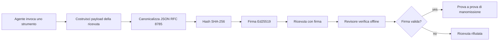
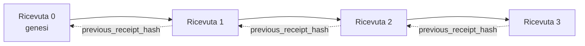

[Guarda il video della lezione: Proteggere gli agenti AI con ricevute crittografiche](https://youtu.be/PLACEHOLDER_VIDEO_ID)

> _(Video della lezione e miniatura da aggiungere dal team contenuti Microsoft dopo la fusione, seguendo il modello delle lezioni 14 / 15.)_

# Proteggere gli agenti AI con ricevute crittografiche

## Introduzione

Questa lezione coprirà:

- Perché le tracce di audit per gli agenti AI sono importanti per conformità, debug e fiducia.
- Cos’è una ricevuta crittografica e come differisce da una semplice riga di log non firmata.
- Come produrre una ricevuta firmata per una chiamata a uno strumento dell’agente in Python semplice.
- Come verificare una ricevuta offline e rilevare manomissioni.
- Come concatenare le ricevute in modo che la rimozione o la riorganizzazione di una interrompa la catena.
- Cosa provano le ricevute e cosa esplicitamente non provano.

## Obiettivi di apprendimento

Dopo aver completato questa lezione, saprai come:

- Identificare i modi in cui i guasti motivano la provenienza crittografica per le azioni degli agenti.
- Produrre una ricevuta firmata Ed25519 su un payload JSON canonico.
- Verificare una ricevuta indipendentemente usando solo la chiave pubblica del firmatario.
- Rilevare manomissioni rieseguendo la verifica su una ricevuta modificata.
- Costruire una sequenza di ricevute concatenata tramite hash e spiegare perché la catena è importante.
- Riconoscere il confine tra cosa le ricevute provano (attribuzione, integrità, ordinamento) e cosa non provano (correttezza dell’azione, fondatezza della politica).

## Il problema: la traccia di audit del tuo agente

Immagina di aver distribuito un agente AI per Contoso Travel. L’agente legge le richieste dei clienti, chiama un’API di voli per cercare opzioni e prenota posti per conto del cliente. Lo scorso trimestre, l’agente ha elaborato 50.000 prenotazioni.

Oggi arriva un revisore. Fa una domanda semplice: "Mostrami cosa ha fatto il tuo agente."

Gli consegni i file di log. Il revisore li guarda e pone una domanda più difficile: "Come faccio a sapere che questi log non sono stati modificati?"

Questo è il problema della traccia di audit. La maggior parte delle implementazioni di agenti oggi si basa su:

- **Log delle applicazioni**: scritti dallo stesso agente, modificabili da chiunque abbia accesso al file system.
- **Servizi di logging cloud**: evidenziano manomissioni a livello di piattaforma ma solo se il revisore si fida dell’operatore della piattaforma.
- **Log delle transazioni del database**: adatti ai cambiamenti nel database ma non per chiamate arbitrarie a strumenti.

Nessuno di questi può rispondere alla domanda del revisore senza farlo dipendere da qualcuno (te, il tuo provider cloud, il fornitore del database). Per uso interno, quella fiducia è spesso accettabile. Per workload regolamentati (finanza, sanità, qualsiasi cosa soggetta all’EU AI Act), non lo è.

Le ricevute crittografiche risolvono questo problema rendendo ogni azione dell’agente verificabile indipendentemente. Il revisore non deve fidarsi di te. Gli basta la tua chiave pubblica e la ricevuta stessa.

## Cos’è una ricevuta crittografica?

Una ricevuta è un oggetto JSON che registra cosa ha fatto un agente, firmato con una firma digitale.



Una ricevuta minima appare così:

```json
{
  "type": "agent.tool_call.v1",
  "agent_id": "contoso-travel-bot",
  "tool_name": "lookup_flights",
  "tool_args_hash": "sha256:a3f9c1...",
  "result_hash": "sha256:7b2e1d...",
  "policy_id": "contoso-travel-policy-v3",
  "timestamp": "2026-04-25T14:30:00Z",
  "sequence": 47,
  "previous_receipt_hash": "sha256:9d4e6a...",
  "signature": {
    "alg": "EdDSA",
    "sig": "c5af83...",
    "public_key": "8f3b2c..."
  }
}
```

Tre proprietà fanno il lavoro:

1. **La firma**. La ricevuta è firmata dal gateway dell’agente usando una chiave privata Ed25519. Chiunque abbia la chiave pubblica corrispondente può verificarla offline. Manomettere un campo invalida la firma.

2. **Codifica canonica**. Prima della firma, la ricevuta viene serializzata usando lo JSON Canonicalization Scheme (JCS, RFC 8785). Questo assicura che due implementazioni che producono la stessa ricevuta logica producano un output byte-identico. Senza la canonizzazione, diversi serializer JSON produrrebbero firme differenti per lo stesso contenuto.

3. **Concatenamento tramite hash**. Il campo `previous_receipt_hash` collega ogni ricevuta a quella precedente. Rimuovere o riorganizzare una ricevuta invalida tutte quelle successive. La manomissione diventa visibile a livello di catena anche se le singole firme venissero aggirate.

Queste proprietà insieme offrono tre garanzie:

- **Attribuzione**: questa chiave ha firmato questo contenuto.
- **Integrità**: il contenuto non è cambiato dopo la firma.
- **Ordinamento**: questa ricevuta è successiva a quella catena.

## Produrre una ricevuta in Python

Non serve una libreria speciale per produrre una ricevuta. Le primitive crittografiche sono ampiamente disponibili e la logica è poche decine di righe di Python.

Gli esercizi pratici in `code_samples/18-signed-receipts.ipynb` guidano l’intero flusso. La versione riassunta:

```python
import json
import hashlib
import base64
from nacl import signing
from jcs import canonicalize  # JSON canonico RFC 8785

def b64url_nopad(data: bytes) -> str:
    return base64.urlsafe_b64encode(data).decode("ascii").rstrip("=")

def sha256_canonical(obj) -> str:
    """SHA-256 of a Python object's JCS-canonical JSON form."""
    return f"sha256:{hashlib.sha256(canonicalize(obj)).hexdigest()}"

# Genera o carica una chiave di firma (in produzione, memorizzala in un caveau di chiavi)
signing_key = signing.SigningKey.generate()
verify_key = signing_key.verify_key

# Costruisci il payload della ricevuta (ancora senza firma)
tool_args = {"origin": "SYD", "destination": "LAX"}
tool_result = [{"flight": "QF11", "price": 1850, "stops": 0}]

payload = {
    "type": "agent.tool_call.v1",
    "agent_id": "contoso-travel-bot",
    "tool_name": "lookup_flights",
    "tool_args_hash": sha256_canonical(tool_args),
    "result_hash": sha256_canonical(tool_result),
    "policy_id": "contoso-travel-policy-v3",
    "timestamp": "2026-04-25T14:30:00Z",
    "sequence": 0,
    "previous_receipt_hash": None,
}

# Canonicalizza, hash, firma.
canonical_bytes = canonicalize(payload)
message_hash = hashlib.sha256(canonical_bytes).digest()
signature_bytes = signing_key.sign(message_hash).signature

# Allegare un oggetto firma strutturato.
receipt = {
    **payload,
    "signature": {
        "alg": "EdDSA",
        "sig": b64url_nopad(signature_bytes),
        "public_key": b64url_nopad(bytes(verify_key)),
    },
}
```

Questo è l’intero flusso di firma. Gli esercizi nel notebook spiegano ogni passaggio.

## Verificare una ricevuta e rilevare manomissioni

La verifica è l’operazione inversa:

```python
import base64
import hashlib
from nacl import signing
from nacl.exceptions import BadSignatureError
from jcs import canonicalize

def b64url_decode(s: str) -> bytes:
    padding = "=" * ((4 - len(s) % 4) % 4)
    return base64.urlsafe_b64decode(s + padding)

def verify_receipt(receipt: dict) -> bool:
    # La firma è un oggetto strutturato: {"alg", "sig", "public_key"}.
    sig_obj = receipt.get("signature")
    if not sig_obj or sig_obj.get("alg") != "EdDSA":
        return False

    # Ricostruire il payload che è stato effettivamente firmato (tutto tranne la firma).
    payload = {k: v for k, v in receipt.items() if k != "signature"}

    canonical_bytes = canonicalize(payload)
    message_hash = hashlib.sha256(canonical_bytes).digest()

    try:
        verify_key = signing.VerifyKey(b64url_decode(sig_obj["public_key"]))
        verify_key.verify(message_hash, b64url_decode(sig_obj["sig"]))
        return True
    except BadSignatureError:
        return False
```

Questa funzione prende una ricevuta e restituisce `True` se la firma è valida, `False` altrimenti. Nessuna chiamata di rete, nessuna dipendenza da servizi, nessuna fiducia in terze parti.

Per vedere come funziona il rilevamento di manomissioni, il notebook spiega:

1. Produrre una ricevuta valida e confermare che verifica correttamente.
2. Modificare un byte del campo `tool_args_hash`.
3. Rieseguire la verifica e osservare il fallimento.

Questa è la dimostrazione pratica che le ricevute evidenziano le manomissioni: qualsiasi modifica, per quanto piccola, invalida la firma.

## Concatenare le ricevute per agenti multi-step

Una singola ricevuta firmata protegge un’azione. Una catena di ricevute protegge una sequenza.



Ogni ricevuta registra l’hash della ricevuta precedente. Per rimuovere silenziosamente la ricevuta 2, un attaccante dovrebbe o:

- Modificare il campo `previous_receipt_hash` della ricevuta 3 (invalida la firma della ricevuta 3), O
- Falsificare una nuova firma sulla ricevuta 3 modificata (serve la chiave privata dell’agente).

Se la chiave privata è custodita in un hardware key vault e pubblichi la chiave pubblica con ogni ricevuta, nessun attacco è fattibile senza essere scoperto.

Il notebook guida attraverso:

1. Costruire una catena di tre ricevute.
2. Verificare che `previous_receipt_hash` di ogni ricevuta corrisponda all’effettivo hash della ricevuta precedente.
3. Manomettere una ricevuta in mezzo e vedere la catena rompersi in quel punto esatto.

Così produci una traccia di audit che un revisore esterno può verificare senza doversi fidare di te.

## Cosa provano (e cosa non provano) le ricevute

Questa è la parte più importante della lezione. Le ricevute sono potenti ma i loro poteri sono limitati.

**Le ricevute provano tre cose:**

1. **Attribuzione**: una chiave specifica ha firmato un payload specifico.
2. **Integrità**: il payload non è cambiato dopo la firma.
3. **Ordinamento**: questa ricevuta è successiva a quella catena.

**Le ricevute NON provano:**

1. **Correttezza**: che l’azione dell’agente fosse quella giusta. Una ricevuta può essere firmata per una risposta sbagliata tanto facilmente quanto per una giusta.
2. **Conformità alla politica**: che la politica indicata in `policy_id` sia stata effettivamente valutata, o che avrebbe permesso quell’azione se controllata. La ricevuta registra ciò che è stato dichiarato, non ciò che è stato applicato.
3. **Identità oltre la chiave**: la ricevuta dice "questa chiave ha firmato questo contenuto." Non dice "questa persona ha autorizzato." Collegare una chiave a una persona o organizzazione richiede un’infrastruttura di identità separata (direttorio, registro chiavi pubbliche, ecc.).
4. **Veridicità degli input**: se l’agente riceve un prompt manipolato e agisce di conseguenza, la ricevuta registra fedelmente l’azione. Le ricevute sono a valle della validazione degli input, non un suo sostituto.

Questo confine è importante per due motivi:

- Dice a cosa servono le ricevute: rendere il comportamento dell’agente verificabile e rilevare manomissioni, anche oltre i confini organizzativi.
- Dice quali livelli aggiuntivi servono ancora: validazione degli input (Lezione 6), applicazione delle politiche (coperta brevemente più avanti), infrastruttura di identità (fuori dallo scopo di questa lezione).

Un errore comune è assumere che "avere ricevute" significhi "essere governati." Non è così. Le ricevute sono la base. Il governo è il sistema che costruisci sopra.

## Riferimenti per la produzione

Il codice Python di questa lezione è volutamente minimale per farti leggere ogni riga e capire esattamente cosa succede. In produzione hai due opzioni:

1. **Costruire direttamente sulle primitive crittografiche.** Le 50 righe viste sopra sono sufficienti per molti casi d’uso. PyNaCl (Ed25519) e il pacchetto `jcs` (JSON canonico) sono librerie ben mantenute e revisionate.

2. **Usare una libreria di ricevute per la produzione.** Vari progetti open source implementano lo stesso schema con funzionalità aggiuntive (rotazione chiavi, verifica batch, distribuzione JWK Set, integrazione con motori di policy):
   - Il formato delle ricevute usato in questa lezione segue un Internet-Draft IETF (`draft-farley-acta-signed-receipts`) attualmente in fase di standardizzazione.
   - Il Microsoft Agent Governance Toolkit compone ricevute con decisioni di policy basate su Cedar; vedi il Tutorial 33 in quel repository per un esempio end-to-end.
   - I pacchetti `protect-mcp` (npm) e `@veritasacta/verify` (npm) offrono un’implementazione Node per firmare e verificare ricevute offline, pensata per avvolgere qualsiasi server MCP con una traccia di audit tamper-evident.
   - L’**[SDK Python nobulex](https://github.com/arian-gogani/nobulex)** (`pip install nobulex`) fornisce lo stesso schema di firma Ed25519 + JCS in Python con integrazioni LangChain e CrewAI, includendo vettori di test di cross-validazione pubblicati e una mappatura di conformità contribuita via [OWASP PR #2210](https://github.com/OWASP/CheatSheetSeries/pull/2210).

La scelta tra implementare da zero e usare una libreria è come scegliere tra scrivere la propria libreria JWT o usarne una già collaudata: entrambe valide; la libreria risparmia tempo e riduce la superficie di audit; l’approccio da zero ti costringe a capire ogni primitiva. Questa lezione insegna il percorso da zero così da darti basi per entrambe le scelte.

## Verifica della conoscenza

Metti alla prova la tua comprensione prima di passare all’esercizio pratico.

**1. Una ricevuta è firmata con la chiave privata Ed25519 dell’agente. Il revisore ha solo la chiave pubblica. Può verificare la ricevuta offline?**

<details>
<summary>Risposta</summary>

Sì. La verifica Ed25519 richiede solo la chiave pubblica e i byte firmati. Nessuna chiamata di rete, nessuna dipendenza da servizi. Questo è il motivo per cui le ricevute sono utili in contesti isolati, multi-organizzazione o a bassa fiducia.
</details>

**2. Un attaccante modifica il campo `policy_id` di una ricevuta per affermare che fosse governata da una politica più permissiva. La firma copriva il payload originale. Cosa succede durante la verifica?**

<details>
<summary>Risposta</summary>

La verifica fallisce. La firma è calcolata sui byte canonici del payload originale; modificare anche un campo cambia i byte canonici, cambia l’hash SHA-256 e rende la firma invalida. L’attaccante dovrebbe avere la chiave privata per produrre una nuova firma valida, che non ha.
</details>

**3. Perché la ricevuta include un `tool_args_hash` e `result_hash` invece degli argomenti e risultati in chiaro?**

<details>
<summary>Risposta</summary>

Per due motivi. Primo, la ricevuta può dover essere archiviata o trasmessa in ambienti dove trapelare il contenuto in chiaro (PII, dati aziendali) è un problema. L’hashing mantiene la ricevuta piccola e il contenuto privato; il revisore verifica che l’hash corrisponda a una copia del contenuto conservata separatamente. Secondo, gli hash hanno dimensione fissa; una ricevuta con hash ha dimensione limitata indipendentemente dalla grandezza degli input/output.
</details>

**4. Il campo `previous_receipt_hash` collega ogni ricevuta al suo predecessore. Se un attaccante cancella silenziosamente una ricevuta in mezzo alla catena, cosa diventa invalido?**

<details>
<summary>Risposta</summary>

Ogni ricevuta che segue quella cancellata. I loro campi `previous_receipt_hash` non corrispondono più alla catena reale (perché la ricevuta referenziata non esiste più o perché la catena ora punta a un predecessore diverso). Per nascondere la cancellazione, l’attaccante dovrebbe rifirmare tutte le ricevute successive, cosa che richiede la chiave privata.
</details>

**5. Una ricevuta verifica correttamente. Ciò prova che l’azione dell’agente era corretta, fondata o conforme alla politica?**

<details>
<summary>Risposta</summary>

No. Una ricevuta valida prova tre cose: attribuzione (questa chiave ha firmato questo contenuto), integrità (il contenuto non è cambiato), e ordinamento (questa ricevuta viene dopo quell’altra). Non prova che l’azione fosse corretta, che la politica in `policy_id` sia stata effettivamente valutata, o che l’agente abbia seguito ogni regola. Le ricevute rendono il comportamento dell’agente oggetto di audit, non necessariamente corretto. Questo è il confine più importante della lezione.
</details>

## Esercizio pratico

Apri `code_samples/18-signed-receipts.ipynb` e completa tutte e quattro le sezioni:

1. **Sezione 1**: Firma la tua prima ricevuta e verifica.
2. **Sezione 2**: Manometti la ricevuta e osserva il fallimento della verifica.
3. **Sezione 3**: Costruisci una catena di tre ricevute e verifica l’integrità della catena.
4. **Sezione 4**: Applica il modello a un agente costruito con Microsoft Agent Framework: avvolgi una chiamata a uno strumento nella firma della ricevuta, quindi verifica la ricevuta indipendentemente.
**Sfida aggiuntiva 1:** estendi lo schema della ricevuta con un campo aggiuntivo a tua scelta (ad esempio, un ID richiesta per il tracciamento), aggiorna la logica di firma canonica per includerlo e conferma che la ricevuta passi comunque attraverso la verifica. Poi modifica il campo dopo la firma e conferma che la verifica fallisce. Questo ti obbliga a capire come ogni byte dell’encoding canonico contribuisce alla firma.

**Sfida aggiuntiva 2:** crea un hash SHA-256 di due tue ricevute insieme (concatena i loro byte canonici in ordine deterministico) e incorpora il digest risultante come un nuovo campo in una terza ricevuta prima di firmarla. Verifica che tutte e tre le ricevute si verifichino correttamente. Hai appena costruito una prova di inclusione a un passaggio: chiunque abbia la terza ricevuta può dimostrare che le prime due esistevano al momento della firma, senza bisogno di rivelarne il contenuto. Questo è il modello usato dai ricevute a divulgazione selettiva su larga scala (impegni Merkle, RFC 6962).

## Conclusione

Le ricevute crittografiche forniscono agli agenti AI una traccia di audit che è:

- **Verificabile indipendentemente:** qualsiasi soggetto con la chiave pubblica può verificare, senza dipendenze da servizi.
- **Evidente a manomissioni:** ogni modifica invalida la firma.
- **Portatile:** una ricevuta è un piccolo file JSON; può essere archiviata, trasmessa e verificata ovunque.
- **Allineata agli standard:** basata su Ed25519 (RFC 8032), JCS (RFC 8785) e SHA-256, tutte primitive ampiamente utilizzate.

Non sono un sostituto per la validazione degli input, l’applicazione delle policy o l’infrastruttura di identità. Sono una base per quegli strati. Quando distribuisci agenti in carichi di lavoro regolamentati, flussi di lavoro multi-organizzazione o qualsiasi ambiente in cui un futuro revisore non può essere dato per scontato che ti fidi, le ricevute sono il modo per rendere onesta la traccia di audit.

Il messaggio più importante: le ricevute provano chi ha detto cosa e quando. Non provano che ciò che è stato detto fosse vero o giusto. Tieni ben chiara questa distinzione. È la differenza tra un sistema di provenienza onesto e uno ingannevole.

## Checklist per la Produzione

Quando sei pronto a passare da questa lezione a distribuire agenti firmati da ricevute in un ambiente reale:

- [ ] **Sposta la chiave di firma fuori dal laptop dello sviluppatore.** Usa Azure Key Vault, AWS KMS o un modulo hardware di sicurezza. La chiave privata con cui firmi le tue ricevute non deve mai vivere nel controllo del codice sorgente o in chiaro sulle macchine applicative.
- [ ] **Pubblica la chiave pubblica di verifica.** I revisori ne hanno bisogno per verificare offline. Il modello standard è un JWK Set a un URL noto (RFC 7517), es., `https://your-org.example.com/.well-known/agent-keys.json`.
- [ ] **Ancora la catena esternamente.** Periodicamente scrivi l’hash dell’ultimo capo catena in un registro di trasparenza (Sigstore Rekor, autorità timestamp RFC 3161 o un secondo sistema interno) così un soggetto esterno può confermare "questa catena esisteva a questo momento."
- [ ] **Conserva le ricevute in modo immutabile.** Lo storage append-only (Azure Storage con policy di immutabilità, AWS S3 Object Lock) impedisce a un insider di riscrivere la storia a livello di storage.
- [ ] **Decidi la retention.** Molti regimi di conformità richiedono la conservazione pluriennale. Pianifica la crescita delle ricevute (una ricevuta è ~500 byte; un agente che esegue 10K chiamate al giorno produce ~1.8 GB all’anno).
- [ ] **Documenta cosa le ricevute non coprono.** Le ricevute dimostrano attribuzione, integrità e ordine. Il tuo runbook dovrebbe elencare esplicitamente quali controlli aggiuntivi (validazione input, applicazione policy, limitazione rate, infrastruttura d’identità) si affiancano alle ricevute nella tua postura di governance.

### Hai altre domande su come mettere in sicurezza gli agenti AI?

Unisciti al [Microsoft Foundry Discord](https://aka.ms/ai-agents/discord) per incontrare altri studenti, partecipare agli orari di ufficio e ottenere risposte alle tue domande sugli agenti AI.

## Oltre Questa Lezione

Questa lezione copre la firma di singole ricevute e sequenze concatenate tramite hash. Le stesse primitive compongono diversi modelli più avanzati che potresti incontrare man mano che la tua postura di governance matura:

- **Divulgazione selettiva.** Quando i campi di una ricevuta sono impegnati indipendentemente (albero Merkle in stile RFC 6962), puoi rivelare campi specifici a revisori specifici e provare che il resto non è cambiato senza esporlo. Utile quando la stessa ricevuta deve soddisfare sia un audit completo (che richiede completezza) sia regolamenti sulla minimizzazione dei dati come il GDPR (che vogliono che il revisore veda il minimo necessario).
- **Revoca delle ricevute.** Se una chiave di firma viene compromessa, serve un modo per segnare come non affidabili tutte le ricevute firmate da quella chiave da un certo momento in poi. Modelli standard: chiavi di firma a breve durata più una lista di revoca pubblicata, o un registro di trasparenza con voci di revoca.
- **Ricevute bilaterali / con firma divisa.** Alcune implementazioni suddividono il payload firmato in una metà pre-esecuzione (`authorization_*`) e una metà post-esecuzione (`result_*`) con firme indipendenti, utile quando la decisione di autorizzazione e il risultato osservato sono prodotti da attori diversi o in tempi diversi. Questo si aggiunge in modo compositivo al formato di ricevuta insegnato in questa lezione.
- **Composizione del payload.** Una ricevuta sigilla i byte messi in `result_hash`. I payload reali sono spesso più completi di un singolo risultato di chiamata: il ragionamento pre-decisione (predizione del modello, opzioni considerate, evidenze e loro completezza, postura di rischio, catena di responsabilità, esito di gate) può vivere tutto nel payload, sigillato da una singola ricevuta. Questo mantiene minimalista il formato della ricevuta lasciando evolvere gli schemi dei payload dominio per dominio.
- **Conformità cross-implementazione.** Più implementazioni indipendenti dello stesso formato di ricevuta (Python, TypeScript, Rust, Go) si verificano incrociando vettori di test condivisi. Se costruisci la tua implementazione, validare contro vettori pubblicati conferma la compatibilità a livello wire.
- **Migrazione post-quantistica.** Ed25519 è oggi ampiamente usato ma non resistente al quantum. Il formato di ricevuta è agile rispetto all’algoritmo: il campo `signature.alg` può portare `ML-DSA-65` (lo standard NIST di firma post-quantistica) quando serve migrare. Prevedi un periodo di transizione in cui le ricevute sono firmate doppiamente.

## Risorse Aggiuntive

- <a href="https://datatracker.ietf.org/doc/draft-farley-acta-signed-receipts/" target="_blank">IETF Internet-Draft: Ricevute Firmate di Decisione per il Controllo Accesso Machine-to-Machine</a>
- <a href="https://learn.microsoft.com/azure/ai-studio/responsible-use-of-ai-overview" target="_blank">Panoramica Responsible AI (Azure AI)</a>
- <a href="https://datatracker.ietf.org/doc/html/rfc8032" target="_blank">RFC 8032: Algoritmo di Firma Digitale a Curva Edwards (EdDSA)</a>
- <a href="https://datatracker.ietf.org/doc/html/rfc8785" target="_blank">RFC 8785: JSON Canonicalization Scheme (JCS)</a>
- <a href="https://datatracker.ietf.org/doc/html/rfc6962" target="_blank">RFC 6962: Trasparenza dei Certificati</a> (costruzione ad albero Merkle usata dalle ricevute a divulgazione selettiva)
- <a href="https://github.com/microsoft/agent-governance-toolkit/blob/main/docs/tutorials/33-offline-verifiable-receipts.md" target="_blank">Microsoft Agent Governance Toolkit, Tutorial 33: Ricevute di Decisione Verificabili Offline</a>
- <a href="https://github.com/ScopeBlind/agent-governance-testvectors" target="_blank">Vettori di test cross-implementazione</a> per il formato di ricevuta usato in questa lezione (Apache-2.0)
- <a href="https://pynacl.readthedocs.io/" target="_blank">Documentazione PyNaCl</a> (Ed25519 in Python)

## Lezione Precedente

[Costruire Agenti per l’Uso del Computer (CUA)](../15-browser-use/README.md)

## Prossima Lezione

_(Da determinare dai mantenitori del curriculum)_

---

<!-- CO-OP TRANSLATOR DISCLAIMER START -->
**Disclaimer**:
Questo documento è stato tradotto utilizzando il servizio di traduzione AI [Co-op Translator](https://github.com/Azure/co-op-translator). Sebbene ci impegniamo per garantire la precisione, si prega di notare che le traduzioni automatizzate possono contenere errori o imprecisioni. Il documento originale nella sua lingua nativa deve essere considerato la fonte autorevole. Per informazioni critiche, si raccomanda una traduzione professionale effettuata da un essere umano. Non siamo responsabili per eventuali malintesi o interpretazioni errate derivanti dall’uso di questa traduzione.
<!-- CO-OP TRANSLATOR DISCLAIMER END -->