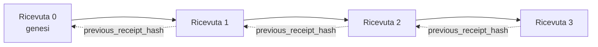

[Guarda il video della lezione: Proteggere gli agenti AI con ricevute crittografiche](https://youtu.be/PLACEHOLDER_VIDEO_ID)

> _(Il team di contenuti Microsoft aggiungerà il video della lezione e la miniatura dopo la fusione, seguendo il modello della lezione 14 / 15.)_

# Proteggere gli agenti AI con ricevute crittografiche

## Introduzione

Questa lezione tratterà:

- Perché le tracce di controllo per gli agenti AI sono importanti per la conformità, il debug e la fiducia.
- Cos’è una ricevuta crittografica e in cosa differisce da una linea di log non firmata.
- Come produrre una ricevuta firmata per la chiamata a uno strumento di un agente in puro Python.
- Come verificare una ricevuta offline e rilevare manomissioni.
- Come concatenare le ricevute in modo che rimuovere o riordinare una le rompa.
- Cosa dimostrano le ricevute e cosa esplicitamente non dimostrano.

## Obiettivi di apprendimento

Dopo aver completato questa lezione, saprai come:

- Identificare i modi in cui possono verificarsi errori che motivano la provenienza crittografica per le azioni dell’agente.
- Produrre una ricevuta firmata Ed25519 su un payload JSON canonico.
- Verificare una ricevuta in modo indipendente usando solo la chiave pubblica del firmatario.
- Rilevare manomissioni rieseguendo la verifica su una ricevuta modificata.
- Costruire una sequenza di ricevute concatenata tramite hash e spiegare perché la catena è importante.
- Riconoscere il confine tra ciò che le ricevute dimostrano (attribuzione, integrità, ordinamento) e ciò che non dimostrano (correttezza dell’azione, validità della politica).

## Il problema: la traccia di controllo del tuo agente

Immagina di aver distribuito un agente AI per Contoso Travel. L’agente legge le richieste dei clienti, chiama un’API per voli per cercare opzioni e prenota i posti per conto del cliente. Lo scorso trimestre, l’agente ha gestito 50.000 prenotazioni.

Oggi arriva un revisore. Fa una domanda semplice: "Mostrami cosa ha fatto il tuo agente."

Gli consegni i tuoi file di log. Il revisore li guarda e fa una domanda più difficile: "Come faccio a sapere che questi log non sono stati modificati?"

Questo è il problema della traccia di controllo. La maggior parte delle distribuzioni di agenti oggi si basa su:

- **Log applicativi**: scritti dallo stesso agente, modificabili da chiunque abbia accesso al file system.
- **Servizi di logging cloud**: evidenziano le manomissioni a livello di piattaforma ma solo se il revisore si fida dell’operatore della piattaforma.
- **Log delle transazioni di database**: adatti per i cambiamenti del database ma non per chiamate arbitrari a strumenti.

Nessuno di questi può rispondere alla domanda del revisore senza che il revisore debba fidarsi di qualcuno (te, il tuo provider cloud, il tuo fornitore di database). Per uso interno, questa fiducia è spesso accettabile. Per carichi di lavoro regolamentati (finanza, sanità, qualsiasi cosa soggetta all’AI Act dell’UE), non lo è.

Le ricevute crittografiche risolvono questo problema rendendo ogni azione dell’agente indipendentemente verificabile. Il revisore non deve fidarsi di te. Ha bisogno solo della tua chiave pubblica e della stessa ricevuta.

## Cos’è una ricevuta crittografica?

Una ricevuta è un oggetto JSON che registra ciò che un agente ha fatto, firmato con una firma digitale.


Una ricevuta minima appare così:

```json
{
  "type": "agent.tool_call.v1",
  "agent_id": "contoso-travel-bot",
  "tool_name": "lookup_flights",
  "tool_args_hash": "sha256:a3f9c1...",
  "result_hash": "sha256:7b2e1d...",
  "policy_id": "contoso-travel-policy-v3",
  "timestamp": "2026-04-25T14:30:00Z",
  "sequence": 47,
  "previous_receipt_hash": "sha256:9d4e6a...",
  "signature": {
    "alg": "EdDSA",
    "sig": "c5af83...",
    "public_key": "8f3b2c..."
  }
}
```

Tre proprietà fanno il lavoro:

1. **La firma**. La ricevuta è firmata dal gateway dell’agente usando una chiave privata Ed25519. Chiunque abbia la corrispondente chiave pubblica può verificare la firma offline. La manomissione di qualsiasi campo invalida la firma.

2. **Codifica canonica**. Prima di firmare, la ricevuta viene serializzata usando lo JSON Canonicalization Scheme (JCS, RFC 8785). Questo assicura che due implementazioni che producono la stessa ricevuta logica producano un output identico byte per byte. Senza la canonicalizzazione, diversi serializer JSON produrrebbero firme diverse per lo stesso contenuto.

3. **Catena di hash**. Il campo `previous_receipt_hash` collega ogni ricevuta a quella precedente. Rimuovere o riordinare una ricevuta rompe tutte le ricevute successive. Le manomissioni diventano visibili a livello di catena anche se le firme individuali vengono aggirate.

Insieme queste proprietà forniscono tre garanzie:

- **Attribuzione**: questa chiave ha firmato questo contenuto.
- **Integrità**: il contenuto non è cambiato dalla firma.
- **Ordinamento**: questa ricevuta è venuta dopo quella nella catena.

## Produrre una ricevuta in Python

Non serve una libreria speciale per produrre una ricevuta. Le primitive crittografiche sono ampiamente disponibili e la logica è di poche decine di righe di Python.

Gli esercizi pratici in `code_samples/18-signed-receipts.ipynb` illustrano l’intero flusso. La versione riassunta:

```python
import json
import hashlib
import base64
from nacl import signing
from jcs import canonicalize  # JSON canonico RFC 8785

def b64url_nopad(data: bytes) -> str:
    return base64.urlsafe_b64encode(data).decode("ascii").rstrip("=")

def sha256_canonical(obj) -> str:
    """SHA-256 of a Python object's JCS-canonical JSON form."""
    return f"sha256:{hashlib.sha256(canonicalize(obj)).hexdigest()}"

# Genera o carica una chiave di firma (in produzione, conserva in un portachiavi)
signing_key = signing.SigningKey.generate()
verify_key = signing_key.verify_key

# Costruisci il payload della ricevuta (ancora senza firma)
tool_args = {"origin": "SYD", "destination": "LAX"}
tool_result = [{"flight": "QF11", "price": 1850, "stops": 0}]

payload = {
    "type": "agent.tool_call.v1",
    "agent_id": "contoso-travel-bot",
    "tool_name": "lookup_flights",
    "tool_args_hash": sha256_canonical(tool_args),
    "result_hash": sha256_canonical(tool_result),
    "policy_id": "contoso-travel-policy-v3",
    "timestamp": "2026-04-25T14:30:00Z",
    "sequence": 0,
    "previous_receipt_hash": None,
}

# Canonicalizza, esegui hash, firma.
canonical_bytes = canonicalize(payload)
message_hash = hashlib.sha256(canonical_bytes).digest()
signature_bytes = signing_key.sign(message_hash).signature

# Allegare un oggetto firma strutturato.
receipt = {
    **payload,
    "signature": {
        "alg": "EdDSA",
        "sig": b64url_nopad(signature_bytes),
        "public_key": b64url_nopad(bytes(verify_key)),
    },
}
```

Questa è tutta la pipeline di firma. Gli esercizi nel notebook spiegano ogni passaggio.

## Verificare una ricevuta e rilevare manomissioni

La verifica è l’operazione inversa:

```python
import base64
import hashlib
from nacl import signing
from nacl.exceptions import BadSignatureError
from jcs import canonicalize

def b64url_decode(s: str) -> bytes:
    padding = "=" * ((4 - len(s) % 4) % 4)
    return base64.urlsafe_b64decode(s + padding)

def verify_receipt(receipt: dict) -> bool:
    # La firma è un oggetto strutturato: {"alg", "sig", "public_key"}.
    sig_obj = receipt.get("signature")
    if not sig_obj or sig_obj.get("alg") != "EdDSA":
        return False

    # Ricostruisci il payload che è stato effettivamente firmato (tutto tranne la firma).
    payload = {k: v for k, v in receipt.items() if k != "signature"}

    canonical_bytes = canonicalize(payload)
    message_hash = hashlib.sha256(canonical_bytes).digest()

    try:
        verify_key = signing.VerifyKey(b64url_decode(sig_obj["public_key"]))
        verify_key.verify(message_hash, b64url_decode(sig_obj["sig"]))
        return True
    except BadSignatureError:
        return False
```

Questa funzione prende una ricevuta e restituisce `True` se la firma è valida, `False` altrimenti. Nessuna chiamata di rete, nessuna dipendenza da servizi, nessuna fiducia richiesta in terzi.

Per vedere in azione il rilevamento della manomissione, il notebook illustra:

1. Produrre una ricevuta valida e confermare che verifica correttamente.
2. Modificare un byte del campo `tool_args_hash`.
3. Eseguire di nuovo la verifica e vedere il fallimento.

Questa è la dimostrazione pratica che le ricevute evidenziano la manomissione: qualsiasi modifica, anche minima, rompe la firma.

## Concatenare le ricevute per agenti multi-step

Una singola ricevuta firmata protegge un’azione. Una catena di ricevute protegge una sequenza.



Ogni ricevuta registra l’hash della ricevuta precedente. Per rimuovere silenziosamente la ricevuta 2, un attaccante dovrebbe:

- Modificare il campo `previous_receipt_hash` della ricevuta 3 (rompe la firma della ricevuta 3), OPPURE
- Falsificare una nuova firma sulla ricevuta 3 modificata (serve la chiave privata dell’agente).

Se la chiave privata è in un hardware key vault e pubblichi la chiave pubblica con ogni ricevuta, nessun attacco è fattibile senza essere scoperto.

Il notebook mostra:

1. Costruire una catena di tre ricevute.
2. Verificare che il `previous_receipt_hash` di ogni ricevuta corrisponda all’hash reale della ricevuta precedente.
3. Manomettere una ricevuta nel mezzo e vedere la catena rompersi esattamente in quel punto.

Così si produce una traccia di controllo che un revisore esterno può verificare senza dover fidarsi di te.

## Cosa dimostrano le ricevute (e cosa non dimostrano)

Questa è la sezione più importante di questa lezione. Le ricevute sono potenti ma il loro potere ha un limite.

**Le ricevute dimostrano tre cose:**

1. **Attribuzione**: una chiave specifica ha firmato un payload specifico.
2. **Integrità**: il payload non è cambiato dalla firma.
3. **Ordinamento**: questa ricevuta è venuta dopo quella nella catena di hash.

**Le ricevute NON dimostrano:**

1. **Correttezza**: che l’azione dell’agente fosse quella giusta. Una ricevuta può essere firmata per una risposta sbagliata con la stessa facilità di una risposta corretta.
2. **Conformità alla policy**: che la policy indicata in `policy_id` sia stata realmente valutata, o che avrebbe permesso quell’azione se verificata. La ricevuta registra ciò che è stato affermato, non ciò che è stato effettivamente applicato.
3. **Identità oltre la chiave**: la ricevuta dice "questa chiave ha firmato questo contenuto." Non dice "questa persona ha autorizzato questo." Collegare una chiave a una persona o organizzazione richiede un’infrastruttura di identità separata (un directory, un registro di chiavi pubbliche, ecc.).
4. **Veridicità degli input**: se l’agente riceve un prompt manipolato e agisce di conseguenza, la ricevuta registra fedelmente l’azione. Le ricevute sono downstream dalla validazione degli input, non un suo sostituto.

Questo confine è importante per due motivi:

- Ti dice a cosa servono le ricevute: rendere il comportamento degli agenti verificabile e resistente alle manomissioni, anche attraverso i confini organizzativi.
- Ti dice quali ulteriori strati servono ancora: validazione degli input (Lezione 6), applicazione delle policy (brevemente trattata sotto), e infrastrutture di identità (fuori dallo scope di questa lezione).

Un errore comune è assumere che "abbiamo le ricevute" significhi "siamo sotto controllo." Non è così. Le ricevute sono una base. Il controllo è il sistema che costruisci sopra.

## Riferimenti per produzione

Il codice Python in questa lezione è volutamente minimale, così puoi leggere ogni riga e capire esattamente cosa succede. In produzione, hai due opzioni:

1. **Costruire direttamente sulle primitive crittografiche.** Le 50 righe viste sopra sono sufficienti per molti casi d’uso. PyNaCl (Ed25519) e il pacchetto `jcs` (JSON canonico) sono librerie ben mantenute e controllate.

2. **Usare una libreria di ricevute in produzione.** Diversi progetti open-source implementano lo stesso schema con funzionalità aggiuntive (rotazione delle chiavi, verifica batch, distribuzione JWK Set, integrazione con motori di policy):
   - Il formato della ricevuta usato in questa lezione segue un Internet-Draft IETF (`draft-farley-acta-signed-receipts`) attualmente in fase di standardizzazione.
   - Il Microsoft Agent Governance Toolkit compone ricevute con decisioni policy basate su Cedar; vedi il Tutorial 33 in quel repository per un esempio completo.
   - I pacchetti `protect-mcp` (npm) e `@veritasacta/verify` (npm) forniscono un’implementazione Node per la firma di ricevute e la verifica offline, pensati per avvolgere qualunque server MCP con una traccia di controllo resistente alle manomissioni.

La scelta tra scrivere il proprio codice e usare una libreria rispecchia la scelta tra scrivere una libreria JWT da zero e usarne una testata: entrambe valide; la libreria fa risparmiare tempo e riduce la superficie di audit; la scrittura da zero ti costringe a comprendere ogni primitiva. Questa lezione insegna la strada da zero così hai la base per entrambe le scelte.

## Verifica della conoscenza

Metti alla prova la tua comprensione prima di passare all’esercizio pratico.

**1. Una ricevuta è firmata con la chiave privata Ed25519 dell’agente. Il revisore ha solo la chiave pubblica. Può verificare la ricevuta offline?**

<details>
<summary>Risposta</summary>

Sì. La verifica Ed25519 richiede solo la chiave pubblica e i byte firmati. Nessuna chiamata di rete, nessuna dipendenza da servizi. Questa è la proprietà che rende le ricevute utili in ambienti isolati, multi-organizzazione o a bassa fiducia.
</details>

**2. Un attaccante modifica il campo `policy_id` di una ricevuta per affermare che era governata da una policy più permissiva. La firma era sul payload originale. Cosa succede durante la verifica?**

<details>
<summary>Risposta</summary>

La verifica fallisce. La firma è calcolata sui byte canonici del payload originale; modificare qualsiasi campo cambia i byte canonici, modifica l’hash SHA-256, rendendo la firma invalida. L’attaccante dovrebbe avere la chiave privata per produrre una nuova firma valida, cosa che non ha.
</details>

**3. Perché la ricevuta include un `tool_args_hash` e un `result_hash` invece degli argomenti e risultati grezzi?**

<details>
<summary>Risposta</summary>

Per due ragioni. Primo, la ricevuta potrebbe dover essere archiviata o trasmessa in ambienti dove perdere il contenuto grezzo (dati personali, dati aziendali) è un problema. Gli hash mantengono la ricevuta piccola e il contenuto privato; il revisore verifica che l’hash corrisponda a una copia separatamente archiviata del contenuto reale. Secondo, gli hash hanno una dimensione fissa; una ricevuta con hash ha una dimensione limitata indipendentemente da quanto sono grandi input e output.
</details>

**4. Il campo `previous_receipt_hash` collega ogni ricevuta alla sua predecessore. Se un attaccante elimina silenziosamente una ricevuta nel mezzo di una catena, cosa diventa invalido?**

<details>
<summary>Risposta</summary>

Ogni ricevuta che viene dopo quella eliminata. I loro campi `previous_receipt_hash` non corrispondono più alla catena reale (perché la ricevuta di riferimento non esiste più, o la catena punta ora a un predecessore diverso). Per nascondere l’eliminazione, l’attaccante dovrebbe rifirmare tutte le ricevute successive, cosa che richiede la chiave privata.
</details>

**5. Una ricevuta verifica correttamente. Questo dimostra che l’azione dell’agente era corretta, valida o conforme alla policy?**

<details>
<summary>Risposta</summary>

No. Una ricevuta valida dimostra tre cose: attribuzione (questa chiave ha firmato questo contenuto), integrità (il contenuto non è cambiato), e ordinamento (questa ricevuta viene dopo quella). Non dimostra che l’azione fosse corretta, che la policy nominata in `policy_id` sia stata realmente valutata, o che l’agente abbia rispettato ogni regola. Le ricevute rendono il comportamento dell’agente verificabile, non necessariamente corretto. Questo è il confine più importante della lezione.
</details>

## Esercizio pratico

Apri `code_samples/18-signed-receipts.ipynb` e completa tutte e quattro le sezioni:

1. **Sezione 1**: Firma la tua prima ricevuta e verifica.
2. **Sezione 2**: Modifica la ricevuta e osserva il fallimento della verifica.
3. **Sezione 3**: Costruisci una catena di tre ricevute e verifica l’integrità della catena.
4. **Sezione 4**: Applica il modello a un agente costruito con Microsoft Agent Framework: avvolgi una chiamata a uno strumento nella firma della ricevuta, quindi verifica la ricevuta indipendentemente.

**Sfida extra 1:** estendi lo schema della ricevuta con un campo aggiuntivo a tua scelta (ad esempio un ID richiesta per il tracciamento), aggiorna la logica di firma canonica per includerlo, e conferma che la ricevuta passi la verifica. Poi modifica il campo dopo la firma e conferma che la verifica fallisca. Questo ti costringe a capire come ogni byte della codifica canonica contribuisca alla firma.
**Sfida avanzata 2:** Calcola l'hash SHA-256 di due delle tue ricevute insieme (concatenando i loro byte canonici in un ordine deterministico) e integra il digest risultante come un nuovo campo su una terza ricevuta prima di firmarla. Verifica che tutte e tre le ricevute possano ancora essere convertite avanti e indietro senza problemi. Hai appena costruito una prova di inclusione in un solo passaggio: chiunque possieda la terza ricevuta può dimostrare che le prime due esistevano al momento della sua firma, senza dover rivelare il loro contenuto. Questo è il pattern che le ricevute a divulgazione selettiva utilizzano su larga scala (impegni Merkle, RFC 6962).

## Conclusione

Le ricevute crittografiche danno agli agenti AI una traccia di controllo che è:

- **Verificabile indipendentemente**: qualsiasi parte con la chiave pubblica può verificare, senza dipendenze da servizi.
- **Evidente di manomissione**: ogni modifica invalida la firma.
- **Portatile**: una ricevuta è un piccolo file JSON; può essere archiviata, trasmessa e verificata ovunque.
- **Allineata agli standard**: basata su Ed25519 (RFC 8032), JCS (RFC 8785) e SHA-256, tutti primitivi ampiamente impiegati.

Non sono un sostituto per la validazione degli input, l’applicazione di policy o l’infrastruttura di identità. Sono una base per questi livelli. Quando distribuisci agenti in carichi di lavoro regolamentati, flussi di lavoro multi-organizzazione o in qualsiasi contesto in cui non si possa presupporre che un revisore futuro ti sia affidabile, le ricevute sono il modo per rendere onesta la traccia di audit.

Il punto più importante: le ricevute provano chi ha detto cosa e quando. Non provano che ciò che è stato detto fosse vero o giusto. Mantieni saldamente questa distinzione. È la differenza tra un sistema di provenienza onesto e uno fuorviante.

## Lista di Controllo per la Produzione

Quando sarai pronto a passare da questa lezione a distribuire agenti firmati con ricevute in un ambiente reale:

- [ ] **Sposta la chiave di firma fuori dal laptop dello sviluppatore.** Usa Azure Key Vault, AWS KMS o un modulo hardware di sicurezza. La chiave privata che firma le tue ricevute non deve mai vivere nel controllo del codice sorgente o in chiaro sulle macchine applicative.
- [ ] **Pubblica la chiave pubblica di verifica.** Gli auditor ne hanno bisogno per verificare offline. Il pattern standard è un JWK Set a un URL ben noto (RFC 7517), es. `https://your-org.example.com/.well-known/agent-keys.json`.
- [ ] **Ancorare la catena esternamente.** Scrivi periodicamente l’hash della testa della catena più recente su un registro di trasparenza (Sigstore Rekor, autorità di timestamp RFC 3161, o un secondo sistema interno) così una parte esterna può confermare "questa catena esisteva a questo momento."
- [ ] **Conserva le ricevute in modo immutabile.** Lo storage blob append-only (Azure Storage con policy di immutabilità, AWS S3 Object Lock) impedisce a un insider di riscrivere la storia a livello di archiviazione.
- [ ] **Decidi in merito alla conservazione.** Molti regimi di conformità richiedono conservazione pluriennale. Pianifica la crescita delle ricevute (ogni ricevuta è ~500 byte; un agente che fa 10.000 chiamate al giorno produce ~1,8 GB all’anno).
- [ ] **Documenta cosa le ricevute non coprono.** Le ricevute provano attribuzione, integrità e ordinamento. Il tuo runbook dovrebbe elencare esplicitamente quali controlli aggiuntivi (validazione input, applicazione policy, limitazione rate, infrastruttura identità) stanno accanto alle ricevute nel tuo modello di governance.

### Hai altre domande sulla sicurezza degli agenti AI?

Iscriviti al [Microsoft Foundry Discord](https://aka.ms/ai-agents/discord) per incontrare altri studenti, partecipare a ore di ufficio e ricevere risposte alle tue domande sugli Agenti AI.

## Oltre Questa Lezione

Questa lezione copre la firma di una singola ricevuta e le sequenze concatenate tramite hash. Gli stessi primitivi si combinano in diversi pattern più avanzati che potresti incontrare man mano che matura la tua postura di governance:

- **Divulgazione selettiva.** Quando i campi di una ricevuta sono impegnati indipendentemente (albero Merkle stile RFC 6962), puoi rivelare specifici campi a determinati auditor e dimostrare che gli altri non sono cambiati senza esporli. Utile quando la stessa ricevuta deve soddisfare sia un audit completo (che richiede completezza) che regolamenti di minimizzazione dati come GDPR (che vogliono che l’auditor veda il minimo indispensabile).
- **Revoca di ricevute.** Se una chiave di firma è compromessa, serve un modo per segnare tutte le ricevute firmate da quella chiave come non attendibili da un certo momento in avanti. Pattern standard: chiavi di firma a vita breve più una lista di revoca pubblicata, o un registro di trasparenza con voci di revoca.
- **Ricevute con firma bilaterale / divisa.** Alcune implementazioni suddividono il payload firmato in metà pre-esecuzione (`authorization_*`) e metà post-esecuzione (`result_*`) con firme indipendenti, utile quando la decisione di autorizzazione e il risultato osservato sono prodotti da attori o tempi differenti. Questo si sovrappone al formato ricevuta insegnato in questa lezione.
- **Composizione del payload.** Una ricevuta sigilla i byte che metti in `result_hash`. I payload reali sono spesso più ricchi di un singolo risultato di chiamata strumento: ragionamenti pre-decisione (predizione modello, opzioni considerate, prove e loro completezza, posizione di rischio, catena di responsabilità, esito di una gate) possono vivere dentro al payload, sigillati da una singola ricevuta. Mantiene il formato della ricevuta minimale permettendo agli schemi di payload di evolvere dominio-per-dominio.
- **Conformità cross-implementazione.** Diverse implementazioni indipendenti dello stesso formato di ricevuta (Python, TypeScript, Rust, Go) si verificano incrociando vettori di prova condivisi. Se costruisci la tua implementazione, validare contro vettori pubblicati conferma la compatibilità wire.
- **Migrazione post-quantistica.** Ed25519 è oggi ampiamente adottato ma non resistente al quantum. Il formato ricevuta è agile rispetto all’algoritmo: il campo `signature.alg` può contenere `ML-DSA-65` (lo standard NIST per firme post-quantistiche) quando serve migrare. Prevedi un periodo di transizione in cui le ricevute sono firmate doppiamente.

## Risorse Addizionali

- <a href="https://datatracker.ietf.org/doc/draft-farley-acta-signed-receipts/" target="_blank">IETF Internet-Draft: Ricevute di Decisione Firmate per il Controllo Accessi Macchina-a-Macchina</a>
- <a href="https://learn.microsoft.com/azure/ai-studio/responsible-use-of-ai-overview" target="_blank">Panoramica sull’AI Responsabile (Azure AI)</a>
- <a href="https://datatracker.ietf.org/doc/html/rfc8032" target="_blank">RFC 8032: Algoritmo di Firma Digitale a Curva Edwards (EdDSA)</a>
- <a href="https://datatracker.ietf.org/doc/html/rfc8785" target="_blank">RFC 8785: Schema di Canonicalizzazione JSON (JCS)</a>
- <a href="https://datatracker.ietf.org/doc/html/rfc6962" target="_blank">RFC 6962: Trasparenza dei Certificati</a> (costruzione ad albero Merkle usata da ricevute a divulgazione selettiva)
- <a href="https://github.com/microsoft/agent-governance-toolkit/blob/main/docs/tutorials/33-offline-verifiable-receipts.md" target="_blank">Microsoft Agent Governance Toolkit, Tutorial 33: Ricevute di Decisione Verificabili Offline</a>
- <a href="https://github.com/ScopeBlind/agent-governance-testvectors" target="_blank">Vettori di test per la conformità cross-implementazione</a> per il formato di ricevuta usato in questa lezione (Apache-2.0)
- <a href="https://pynacl.readthedocs.io/" target="_blank">Documentazione PyNaCl</a> (Ed25519 in Python)

## Lezione Precedente

[Costruire Agenti per l'Uso del Computer (CUA)](../15-browser-use/README.md)

## Prossima Lezione

_(Da determinare dagli amministratori del curriculum)_

---

<!-- CO-OP TRANSLATOR DISCLAIMER START -->
**Disclaimer**:
Questo documento è stato tradotto utilizzando il servizio di traduzione AI [Co-op Translator](https://github.com/Azure/co-op-translator). Sebbene ci impegniamo per garantire la precisione, si prega di notare che le traduzioni automatizzate possono contenere errori o imprecisioni. Il documento originale nella sua lingua nativa deve essere considerato la fonte autorevole. Per informazioni critiche, si raccomanda una traduzione professionale effettuata da un essere umano. Non siamo responsabili per eventuali malintesi o interpretazioni errate derivanti dall’uso di questa traduzione.
<!-- CO-OP TRANSLATOR DISCLAIMER END -->