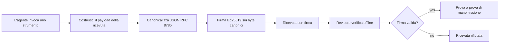
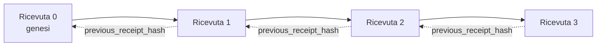

[Guarda il video della lezione: Proteggere gli Agenti AI con Ricevute Crittografiche](https://youtu.be/PLACEHOLDER_VIDEO_ID)

> _(Video della lezione e miniatura da aggiungere dal team contenuti Microsoft post-fusione, in linea con il modello delle lezioni 14 / 15.)_

# Proteggere gli Agenti AI con Ricevute Crittografiche

## Introduzione

Questa lezione tratterà:

- Perché le tracce di controllo per gli agenti AI sono importanti per conformità, debugging e fiducia.
- Cos'è una ricevuta crittografica e in cosa differisce da una linea di log non firmata.
- Come produrre una ricevuta firmata per una chiamata a uno strumento dell'agente in Python semplice.
- Come verificare una ricevuta offline e rilevare eventuali manomissioni.
- Come concatenare le ricevute così che rimuovere o riordinare una spezzi la catena.
- Cosa dimostrano le ricevute e cosa esplicitamente non dimostrano.

## Obiettivi di Apprendimento

Dopo aver completato questa lezione, saprai come:

- Identificare le modalità di guasto che motivano la provenienza crittografica per le azioni dell'agente.
- Produrre una ricevuta firmata Ed25519 su un payload JSON canonico.
- Verificare una ricevuta in modo indipendente usando solo la chiave pubblica del firmatario.
- Rilevare manomissioni rieseguendo la verifica su una ricevuta modificata.
- Costruire una sequenza di ricevute concatenata tramite hash e spiegare perché la catena è importante.
- Riconoscere il confine tra ciò che le ricevute dimostrano (attribuzione, integrità, ordinamento) e ciò che non dimostrano (correttezza dell'azione, validità della policy).

## Il Problema: La Traccia di Controllo del Tuo Agente

Immagina di aver distribuito un agente AI per Contoso Travel. L'agente legge le richieste dei clienti, chiama un'API voli per cercare opzioni e prenota posti per conto del cliente. Nell'ultimo trimestre, l'agente ha gestito 50.000 prenotazioni.

Oggi arriva un revisore. Fa una domanda semplice: "Mostrami cosa ha fatto il tuo agente."

Consegni i tuoi file di log. Il revisore li guarda e fa una domanda più difficile: "Come faccio a sapere che questi log non sono stati modificati?"

Questo è il problema della traccia di controllo. La maggior parte degli agenti oggi si basa su:

- **Log di applicazione**: scritti dallo stesso agente, modificabili da chiunque abbia accesso al file system.
- **Servizi di logging cloud**: evidentemente manomessi a livello di piattaforma ma solo se il revisore si fida dell'operatore della piattaforma.
- **Log di transazione del database**: adatti per modifiche al database ma non per chiamate arbitrarie a strumenti.

Nessuno di questi può rispondere alla domanda del revisore senza richiedere che il revisore si fidi di qualcuno (te, il tuo provider cloud, il tuo fornitore di database). Per usi interni, questa fiducia è spesso accettabile. Per carichi regolamentati (finanza, sanità, qualsiasi cosa soggetta all'AI Act UE), non lo è.

Le ricevute crittografiche risolvono questo problema rendendo ogni azione dell'agente verificabile indipendentemente. Il revisore non ha bisogno di fidarsi di te. Serve solo la tua chiave pubblica e la ricevuta stessa.

## Cos'è una Ricevuta Crittografica?

Una ricevuta è un oggetto JSON che registra ciò che un agente ha fatto, firmato con una firma digitale.


```mermaid
flowchart LR
    A[L'agente invoca uno strumento] --> B[Costruisci il payload della ricevuta]
    B --> C[Canonicalizza JSON RFC 8785]
    C --> E[Firma Ed25519 sui byte canonici]
    E --> F[Ricevuta con firma]
    F --> G[Revisore verifica offline]
    G --> H{Firma valida?}
    H -- yes --> I[Prova a prova di manomissione]
    H -- no --> J[Ricevuta rifiutata]
```

Una ricevuta minima appare così:

```json
{
  "type": "agent.tool_call.v1",
  "agent_id": "contoso-travel-bot",
  "tool_name": "lookup_flights",
  "tool_args_hash": "sha256:a3f9c1...",
  "result_hash": "sha256:7b2e1d...",
  "policy_id": "contoso-travel-policy-v3",
  "timestamp": "2026-04-25T14:30:00Z",
  "sequence": 47,
  "previous_receipt_hash": "sha256:9d4e6a...",
  "signature": {
    "alg": "EdDSA",
    "sig": "c5af83...",
    "public_key": "8f3b2c..."
  }
}
```

Tre proprietà svolgono il lavoro:

1. **La firma**. La ricevuta è firmata dal gateway dell'agente usando una chiave privata Ed25519. Chiunque abbia la chiave pubblica corrispondente può verificare la firma offline. Manomettere un campo invalida la firma.

2. **Codifica canonica**. Prima della firma, la ricevuta è serializzata usando lo schema di canonizzazione JSON (JCS, RFC 8785). Questo assicura che due implementazioni che producono la stessa ricevuta logica producano un output identico bit a bit. Senza canonizzazione, diversi serializzatori JSON produrrebbero firme diverse per lo stesso contenuto.

3. **Concatenamento hash**. Il campo `previous_receipt_hash` collega ogni ricevuta a quella precedente. Rimuovere o riordinare una ricevuta interrompe ogni ricevuta successiva. La manomissione diventa visibile a livello di catena anche se singole firme vengono bypassate.

Queste proprietà insieme forniscono tre garanzie:

- **Attribuzione**: questa chiave ha firmato questo contenuto.
- **Integrità**: il contenuto non è cambiato dalla firma.
- **Ordinamento**: questa ricevuta è venuta dopo quella nella catena.

## Produrre una Ricevuta in Python

Non serve una libreria speciale per produrre una ricevuta. Le primitive crittografiche sono ampiamente disponibili e la logica è poche decine di righe di Python.

Gli esercizi pratici in `code_samples/18-signed-receipts.ipynb` illustrano tutto il flusso. La versione riassunta:

```python
import json
import hashlib
import base64
from nacl import signing
from jcs import canonicalize  # RFC 8785 JSON canonico

def b64url_nopad(data: bytes) -> str:
    return base64.urlsafe_b64encode(data).decode("ascii").rstrip("=")

def sha256_canonical(obj) -> str:
    """SHA-256 of a Python object's JCS-canonical JSON form."""
    return f"sha256:{hashlib.sha256(canonicalize(obj)).hexdigest()}"

# Genera o carica una chiave di firma (in produzione, memorizzarla in un caveau per chiavi)
signing_key = signing.SigningKey.generate()
verify_key = signing_key.verify_key

# Costruisci il payload della ricevuta (ancora senza firma)
tool_args = {"origin": "SYD", "destination": "LAX"}
tool_result = [{"flight": "QF11", "price": 1850, "stops": 0}]

payload = {
    "type": "agent.tool_call.v1",
    "agent_id": "contoso-travel-bot",
    "tool_name": "lookup_flights",
    "tool_args_hash": sha256_canonical(tool_args),
    "result_hash": sha256_canonical(tool_result),
    "policy_id": "contoso-travel-policy-v3",
    "timestamp": "2026-04-25T14:30:00Z",
    "sequence": 0,
    "previous_receipt_hash": None,
}

# Canonicalizza e firma direttamente i byte JCS. PureEdDSA esegue hash internamente.
canonical_bytes = canonicalize(payload)
signature_bytes = signing_key.sign(canonical_bytes).signature

# Allegare un oggetto firma strutturato.
receipt = {
    **payload,
    "signature": {
        "alg": "EdDSA",
        "sig": b64url_nopad(signature_bytes),
        "public_key": b64url_nopad(bytes(verify_key)),
    },
}
```

Questo è l'intero processo di firma. Gli esercizi nel notebook esaminano ogni passaggio.

## Verificare una Ricevuta e Rilevare Manomissioni

La verifica è l'operazione inversa:

```python
import base64
import hashlib
from nacl import signing
from nacl.exceptions import BadSignatureError
from jcs import canonicalize

def b64url_decode(s: str) -> bytes:
    padding = "=" * ((4 - len(s) % 4) % 4)
    return base64.urlsafe_b64decode(s + padding)

def verify_receipt(receipt: dict) -> bool:
    # La firma è un oggetto strutturato: {"alg", "sig", "public_key"}.
    sig_obj = receipt.get("signature")
    if not sig_obj or sig_obj.get("alg") != "EdDSA":
        return False

    # Ricostruisci il payload che è stato effettivamente firmato (tutto tranne la firma).
    payload = {k: v for k, v in receipt.items() if k != "signature"}

    canonical_bytes = canonicalize(payload)

    try:
        verify_key = signing.VerifyKey(b64url_decode(sig_obj["public_key"]))
        verify_key.verify(canonical_bytes, b64url_decode(sig_obj["sig"]))
        return True
    except BadSignatureError:
        return False
```

Questa funzione prende una ricevuta e restituisce `True` se la firma è valida, `False` altrimenti. Nessuna chiamata di rete, nessuna dipendenza da servizi, nessuna fiducia richiesta in terze parti.

Per vedere la rilevazione di manomissioni in azione, il notebook guida attraverso:

1. Produrre una ricevuta valida e confermare che venga verificata.
2. Modificare un byte del campo `tool_args_hash`.
3. Rieseguire la verifica e vedere che fallisce.

Questa è la dimostrazione pratica che le ricevute sono evidenti a manomissioni: qualsiasi modifica, per quanto piccola, rompe la firma.

## Concatenare Ricevute per Agenti con Più Passi

Una singola ricevuta firmata protegge una azione. Una catena di ricevute protegge una sequenza.


```mermaid
flowchart LR
    R0[Ricevuta 0<br/>genesi] --> R1[Ricevuta 1]
    R1 --> R2[Ricevuta 2]
    R2 --> R3[Ricevuta 3]
    R1 -. previous_receipt_hash .-> R0
    R2 -. previous_receipt_hash .-> R1
    R3 -. previous_receipt_hash .-> R2
```

Ogni ricevuta registra l'hash della precedente. Per rimuovere silenziosamente la ricevuta 2, un attaccante dovrebbe o:

- Modificare il campo `previous_receipt_hash` della ricevuta 3 (rompe la firma della ricevuta 3), OPPURE
- Falsificare una nuova firma sulla ricevuta 3 modificata (richiede la chiave privata dell'agente).

Se la chiave privata è in un key vault hardware e pubblichi la chiave pubblica con ogni ricevuta, nessun attacco è fattibile senza essere rilevato.

Il notebook illustra:

1. Costruire una catena di tre ricevute.
2. Verificare che il `previous_receipt_hash` di ogni ricevuta corrisponda all'hash effettivo della ricevuta precedente.
3. Manomettere una ricevuta in mezzo e vedere la catena rompersi esattamente in quel punto.

Questo è come si produce una traccia di controllo che un revisore esterno può verificare senza doversi fidare di te.

## Cosa Dimostrano le Ricevute (e Cosa Non Dimostrano)

Questa è la sezione più importante della lezione. Le ricevute sono potenti ma il loro potere è limitato.

**Le ricevute dimostrano tre cose:**

1. **Attribuzione**: una chiave specifica ha firmato un payload specifico.
2. **Integrità**: il payload non è cambiato dalla firma.
3. **Ordinamento**: questa ricevuta è venuta dopo quella nella catena hash.

**Le ricevute NON dimostrano:**

1. **Correttezza**: che l'azione dell'agente sia stata quella corretta. Una ricevuta può essere firmata per una risposta errata con la stessa facilità di una risposta corretta.
2. **Conformità alla policy**: che la policy indicata in `policy_id` sia stata effettivamente valutata, o che avrebbe permesso l'azione se controllata. La ricevuta registra ciò che è stato dichiarato, non ciò che è stato applicato.
3. **Identità oltre la chiave**: la ricevuta dice "questa chiave ha firmato questo contenuto." Non dice "questo umano ha autorizzato questo." Collegare una chiave a una persona o organizzazione richiede infrastrutture di identità separate (una directory, un registro di chiavi pubbliche, ecc.).
4. **Veridicità degli input**: se l'agente riceve un prompt manipolato e agisce di conseguenza, la ricevuta registra fedelmente l'azione. Le ricevute si trovano a valle della validazione degli input, non sono un suo sostituto.

Questo confine è importante per due ragioni:

- Indica a cosa servono le ricevute: rendere il comportamento dell'agente controllabile e evidente in caso di manomissione, anche oltre i confini organizzativi.
- Indica quali strati aggiuntivi ancora servono: validazione degli input (Lezione 6), applicazione di policy (coperta brevemente più avanti) e infrastruttura di identità (fuori dallo scopo di questa lezione).

Un errore comune è assumere che "abbiamo ricevute" significhi "siamo governati." Non è così. Le ricevute sono una base. La governance è il sistema che costruisci sopra.

## Dimostrare che un Umano ha Approvato l'Azione Esatta

Il punto 3 sopra merita la sua sezione: una ricevuta di azione dice "questa chiave ha firmato questo contenuto," mai "un umano ha autorizzato questo." Per azioni ad alto rischio (rimborsi, cancellazioni, trasferimenti bancari), i framework di governance richiedono sempre più quella dichiarazione mancante, ed è producibile con le stesse primitive già costruite in questa lezione.

Il notebook successivo `code_samples/human-authorization-receipts.ipynb` aggiunge un secondo tipo di ricevuta, `human.approval.v1`, con lo stesso formato envelope delle ricevute della lezione (un payload tipizzato firmato da Ed25519 sulle sue byte canonici JCS, con l'oggetto `signature` fuori dai byte firmati). Un firmatario nominato firma **l'intera azione canonica e il suo digest** prima dell'esecuzione; la ricevuta dell'azione dell'agente porta lo **stesso digest di azione** e un `parent_approval_ref`, l'`receipt_hash` dell'approvazione, la stessa convenzione di `previous_receipt_hash` nella catena costruita sopra. Una `verify_chain` controlla entrambi gli artefatti sotto **registri di chiavi separati e bloccati** (chiavi degli approvatori vs chiavi dell'agente), così il percorso del codice è condiviso ma le autorità mai.

La proprietà acquisita, espressa con cura: *l'umano ha approvato questa esatta azione, e l'agente ha eseguito proprio quell'azione approvata.* I casi di rifiuto del notebook sono ciò che rende reale la proprietà piuttosto che solo affermata:

- il classico set: manomissione, confused deputy, replay, chiavi falsificate da entrambe le parti, input malformati;
- **autorità scaduta**: una firma che ancora verifica, rifiutata comunque perché la versione della policy è cambiata, la chiave dell'approvatore è stata rimossa dal registro bloccato, o l'approvazione è scaduta prima dell'esecuzione;
- **sostituzione del digest**: una ricevuta di azione validamente firmata che punta a una *vera* approvazione che vincola una *azione canonica differente*.

Ogni fallimento rifiuta per motivi distinti, così un revisore leggendo un rifiuto può capire se l'autorità è scaduta o se l'azione eseguita è cambiata. La regola insegnata dal notebook: una approvazione firmata non è autorità da sola. L'autorità esiste solo se entrambe le ricevute vincolano ancora la stessa azione canonica al momento dell'esecuzione. La ricevuta di approvazione umana è una composizione didattica definita da questa lezione, non un tipo di ricevuta definito da `draft-farley-acta-signed-receipts`.

## Riferimenti per la Produzione

Il codice Python in questa lezione è intenzionalmente minimale così puoi leggere ogni riga e capire esattamente cosa succede. In produzione hai due opzioni:

1. **Costruire direttamente sulle primitive crittografiche.** Le 50 righe viste sopra sono sufficienti per molti casi d'uso. PyNaCl (Ed25519) e il pacchetto `jcs` (JSON canonico) sono librerie ben mantenute e sottoposte a audit.

2. **Usare una libreria di ricevute per la produzione.** Vari progetti open-source implementano lo stesso modello con funzionalità aggiuntive (rotazione chiavi, verifica batch, distribuzione di JWK Set, integrazione con motori di policy):
   - La pipeline di firma usa le convenzioni JCS e ambito firma in un Internet-Draft IETF indipendente ([`draft-farley-acta-signed-receipts`](https://datatracker.ietf.org/doc/draft-farley-acta-signed-receipts/), revisione 02). La ricevuta piatta didattica della lezione differisce dall'envelope `{payload, signature}` del draft e non è presentata come implementazione conforme. Il draft pubblica una suite di conformità condivisa ([agent-governance-testvectors](https://github.com/ScopeBlind/agent-governance-testvectors)) per implementazioni orientate al suo formato wire.
   - Il Microsoft Agent Governance Toolkit compone ricevute con decisioni di policy basate su Cedar; vedere il Tutorial 33 in quel repository per un esempio end-to-end.
   - I pacchetti `protect-mcp` (npm) e `@veritasacta/verify` (npm) forniscono un'implementazione Node di firma ricevute e verifica offline, pensata per incapsulare qualsiasi server MCP con traccia di controllo evidente a manomissioni, inclusi flussi in attesa di co-firma in cui un'azione sospesa emette una ricevuta di approvazione vincolata al digest dell'azione (supportato da WebAuthn nel flusso desktop), lo stesso modello di ricevuta approvazione umana del notebook sopra.
   - L'SDK Python **[nobulex](https://github.com/arian-gogani/nobulex)** (`pip install nobulex`) offre lo stesso schema di firma Ed25519 + JCS con integrazioni LangChain e CrewAI, inclusi vettori di test di convalida incrociata pubblicati e una mappatura di conformità contribuita tramite [OWASP PR #2210](https://github.com/OWASP/CheatSheetSeries/pull/2210).

La decisione tra implementare da soli o usare una libreria riflette la scelta tra scrivere una propria libreria JWT o usarne una testata: entrambe ragionevoli; la libreria fa risparmiare tempo e riduce la superficie di audit; il metodo da zero ti costringe a capire ogni primitiva. Questa lezione insegna il percorso da zero così hai la base per entrambe le scelte.

## Verifica della Comprensione

Metti alla prova la tua comprensione prima di passare all'esercizio pratico.

**1. Una ricevuta è firmata con la chiave privata Ed25519 dell'agente. Il revisore possiede solo la chiave pubblica. Il revisore può verificare la ricevuta offline?**

<details>
<summary>Risposta</summary>

Sì. La verifica Ed25519 richiede solo la chiave pubblica e i byte firmati. Nessuna chiamata di rete, nessuna dipendenza da servizi. Questa è la proprietà che rende utili le ricevute in ambientiisolati, multi-organizzazione, o con bassa fiducia.
</details>

**2. Un attaccante modifica il campo `policy_id` di una ricevuta per affermare che fosse regolata da una policy più permissiva. La firma era sul payload originale. Cosa succede durante la verifica?**

<details>
<summary>Risposta</summary>


La verifica fallisce. La firma è stata calcolata sui byte canonici del payload originale; modificare un qualsiasi campo cambia quei byte, rendendo la firma non valida. L'attaccante avrebbe bisogno della chiave privata per produrre una nuova firma valida, cosa che non possiede.
</details>

**3. Perché la ricevuta include un `tool_args_hash` e un `result_hash` invece dei parametri grezzi e del risultato?**

<details>
<summary>Risposta</summary>

Due motivi. Primo, la ricevuta potrebbe dover essere archiviata o trasmessa in ambienti dove la fuoriuscita del contenuto grezzo (PII, dati aziendali) è un problema. L’hashing mantiene la ricevuta compatta e il contenuto privato; l’auditor verifica che l’hash corrisponda a una copia separatamente memorizzata del contenuto reale. Secondo, gli hash hanno dimensione fissa; una ricevuta con hash ha dimensione limitata indipendentemente da quanto grandi fossero input e output.
</details>

**4. Il campo `previous_receipt_hash` collega ogni ricevuta al suo predecessore. Se un attaccante elimina silenziosamente una ricevuta a metà di una catena, cosa diventa non valido?**

<details>
<summary>Risposta</summary>

Ogni ricevuta successiva a quella cancellata. I loro campi `previous_receipt_hash` non corrispondono più alla catena reale (perché la ricevuta cui facevano riferimento non esiste più, o la catena ora punta a un predecessore diverso). Per nascondere la cancellazione, l’attaccante dovrebbe rifirmare ogni ricevuta successiva, cosa che richiede la chiave privata.
</details>

**5. Una ricevuta viene verificata correttamente. Questo prova che l’azione dell’agente è stata corretta, valida, o conforme alla policy?**

<details>
<summary>Risposta</summary>

No. Una ricevuta valida dimostra tre cose: attribuzione (questa chiave ha firmato questo contenuto), integrità (il contenuto non è cambiato) e ordine (questa ricevuta è arrivata dopo quella). Non dimostra che l’azione fosse corretta, che la policy indicata in `policy_id` sia stata effettivamente valutata, o che l’agente abbia seguito tutte le regole. Le ricevute rendono il comportamento dell’agente verificabile, non necessariamente corretto. Questo è il confine più importante della lezione.
</details>

## Esercizio Pratico

Apri `code_samples/18-signed-receipts.ipynb` e completa tutte e quattro le sezioni:

1. **Sezione 1**: Firma la tua prima ricevuta e verificane la validità.
2. **Sezione 2**: Manometti la ricevuta e osserva il fallimento della verifica.
3. **Sezione 3**: Costruisci una catena di tre ricevute e verifica l’integrità della catena.
4. **Sezione 4**: Applica il modello a un agente costruito con Microsoft Agent Framework: incapsula una chiamata a uno strumento con la firma della ricevuta, quindi verifica la ricevuta indipendentemente.

**Sfida extra 1:** estendi lo schema della ricevuta con un campo aggiuntivo di tua scelta (per esempio un ID richiesta per il tracciamento), aggiorna la logica di firma canonica per includerlo, e conferma che la ricevuta venga sempre verificata correttamente. Poi modifica il campo dopo la firma e conferma il fallimento della verifica. Questo ti costringe a capire come ogni byte della codifica canonica contribuisce alla firma.

**Sfida extra 2:** applica l’hash SHA-256 a due delle tue ricevute insieme (concatenando i loro byte canonici in un ordine deterministico) e incorpora il digest risultante come nuovo campo in una terza ricevuta prima di firmarla. Verifica che tutte e tre le ricevute vengano ancora verificate correttamente. Hai appena costruito una prova di inclusione a un livello: chiunque possieda la terza ricevuta può dimostrare che le prime due esistevano al momento della firma, senza rivelarne i contenuti. Questo è il modello usato dalle ricevute a divulgazione selettiva su larga scala (impegni Merkle, RFC 6962).

## Conclusione

Le ricevute crittografiche forniscono agli agenti AI una traccia di audit che è:

- **Verificabile indipendentemente**: qualsiasi parte con la chiave pubblica può verificare, senza dipendenze da servizi.
- **Evidente alla manomissione**: ogni modifica invalida la firma.
- **Portatile**: una ricevuta è un piccolo file JSON; può essere archiviata, trasmessa e verificata ovunque.
- **Allineata agli standard**: costruita su Ed25519 (RFC 8032), JCS (RFC 8785) e SHA-256, tutte primitive ampiamente diffuse.

Non sono un sostituto per la validazione degli input, l’applicazione delle policy, o l’infrastruttura di identità. Sono una base per questi livelli. Quando distribuisci agenti in carichi di lavoro regolamentati, flussi multi-organizzazione o qualsiasi contesto in cui un futuro auditor non può considerarti affidabile, le ricevute sono come rendere onesta la traccia di audit.

Il punto più importante: le ricevute provano chi ha detto cosa e quando. Non provano che ciò che è stato detto sia vero o corretto. Mantieni questa distinzione saldamente. È la differenza tra un sistema di provenienza onesto e uno fuorviante.

## Checklist per la Produzione

Quando sei pronto a passare da questa lezione a distribuzioni di agenti con firma di ricevuta in ambienti reali:

- [ ] **Sposta la chiave di firma dal laptop dello sviluppatore.** Usa Azure Key Vault, AWS KMS o un modulo hardware di sicurezza. La chiave privata che firma le tue ricevute non deve mai vivere in controllo versione o in chiaro sulle macchine di applicazione.
- [ ] **Pubblica la chiave pubblica di verifica.** Gli auditor ne hanno bisogno per verificare offline. Il modello standard è un JWK Set a un URL noto (RFC 7517), es. `https://your-org.example.com/.well-known/agent-keys.json`.
- [ ] **Ancora la catena esternamente.** Scrivi periodicamente l’hash dell’ultima testa di catena in un registro di trasparenza (Sigstore Rekor, autorità di timestamp RFC 3161, o secondo sistema interno) così una parte esterna può confermare "questa catena esisteva a questo momento."
- [ ] **Conserva le ricevute in modo immutabile.** Lo storage blob append-only (Azure Storage con politiche di immutabilità, AWS S3 Object Lock) impedisce a un insider di riscrivere la storia a livello di storage.
- [ ] **Decidi la retention.** Molte normative richiedono conservazione pluriennale. Pianifica la crescita delle ricevute (ogni ricevuta è ~500 byte; un agente che fa 10K chiamate al giorno produce ~1.8 GB all’anno).
- [ ] **Documenta cosa non coprono le ricevute.** Le ricevute provano attribuzione, integrità e ordine. Il tuo runbook dovrebbe elencare esplicitamente quali controlli aggiuntivi (validazione input, applicazione policy, rate limiting, infrastruttura di identità) accompagnano le ricevute nella tua postura di governance.

### Hai altre domande sulla sicurezza degli agenti AI?

Unisciti al [Microsoft Foundry Discord](https://aka.ms/ai-agents/discord) per incontrare altri studenti, partecipare a office hours e ottenere risposte alle tue domande sugli AI Agents.

## Oltre questa lezione

Questa lezione copre la firma di ricevute singole e sequenze hash-catenate. Le stesse primitive compongono vari schemi più avanzati che potresti incontrare man mano che la tua postura di governance matura:

- **Divulgazione selettiva.** Quando i campi di una ricevuta sono impegnati indipendentemente (albero Merkle stile RFC 6962), puoi rivelare campi specifici a certi auditor e dimostrare che gli altri sono invariati senza esporli. Utile quando la stessa ricevuta deve soddisfare sia un audit completo (che vuole completezza) sia regolamenti di minimizzazione dati come il GDPR (che vogliono che l’auditor veda il minimo possibile).
- **Revoca delle ricevute.** Se una chiave di firma è compromessa, serve un metodo per marcare tutte le ricevute firmate da quella chiave come non affidabili da un certo momento in poi. Schemi standard: chiavi di firma a vita breve più lista pubblicata di revoca, o registro di trasparenza con voci di revoca.
- **Ricevute bilaterali / a firma divisa.** Alcune implementazioni dividono il payload firmato in metà pre-esecuzione (`authorization_*`) e post-esecuzione (`result_*`) con firme indipendenti, utile quando la decisione di autorizzazione e il risultato osservato sono prodotti da attori diversi o in momenti diversi. Questo si compone additivamente sopra al formato di ricevuta insegnato in questa lezione.
- **Composizione del payload.** Una ricevuta sigilla qualunque byte tu metta in `result_hash`. I payload reali spesso sono più ricchi del solo risultato di una chiamata a uno strumento: ragionamenti pre-decisione (predizione modello, opzioni considerate, prove e loro completezza, postura di rischio, catena di responsabilità, esito gate) possono risiedere tutti nel payload, sigillati da una singola ricevuta. Questo mantiene il formato della ricevuta minimo facendoti evolvere gli schemi payload per dominio.
- **Conformità tra implementazioni.** Implementazioni indipendenti multipiattaforma dello stesso formato di ricevuta (Python, TypeScript, Rust, Go) si verificano cross contro vettori di test condivisi. Se costruisci la tua implementazione, validare contro vettori pubblicati conferma la compatibilità wire.
- **Migrazione post-quantistica.** Ed25519 è ampiamente usato oggi ma non è resistente ai computer quantistici. Il formato della ricevuta è agile rispetto all’algoritmo: il campo `signature.alg` può incorporare `ML-DSA-65` (lo standard di firma post-quantistica NIST) quando serve migrare. Pianifica un periodo di transizione dove le ricevute sono firmate doppiamente.

## Risorse Aggiuntive

- <a href="https://datatracker.ietf.org/doc/draft-farley-acta-signed-receipts/" target="_blank">IETF Internet-Draft: Ricevute di Decisione Firmate per il Controllo Accessi Macchina-a-Macchina</a>
- <a href="https://learn.microsoft.com/azure/ai-studio/responsible-use-of-ai-overview" target="_blank">Panoramica su AI Responsabile (Azure AI)</a>
- <a href="https://datatracker.ietf.org/doc/html/rfc8032" target="_blank">RFC 8032: Algoritmo di Firma Digitale a Curva Edwards (EdDSA)</a>
- <a href="https://datatracker.ietf.org/doc/html/rfc8785" target="_blank">RFC 8785: Schema di Canonicalizzazione JSON (JCS)</a>
- <a href="https://datatracker.ietf.org/doc/html/rfc6962" target="_blank">RFC 6962: Trasparenza dei Certificati</a> (costruzione ad albero Merkle usata dalle ricevute a divulgazione selettiva)
- <a href="https://github.com/microsoft/agent-governance-toolkit/blob/main/docs/tutorials/33-offline-verifiable-receipts.md" target="_blank">Microsoft Agent Governance Toolkit, Tutorial 33: Ricevute di Decisione Verificabili Offline</a>
- <a href="https://github.com/ScopeBlind/agent-governance-testvectors" target="_blank">Vettori di test per conformità cross-implementazione</a> per il formato di ricevuta usato in questa lezione (Apache-2.0)
- <a href="https://pynacl.readthedocs.io/" target="_blank">Documentazione PyNaCl</a> (Ed25519 in Python)

## Lezione Precedente

[Creare agenti AI locali](../17-creating-local-ai-agents/README.md)

---

<!-- CO-OP TRANSLATOR DISCLAIMER START -->
**Disclaimer**:
Questo documento è stato tradotto utilizzando il servizio di traduzione AI [Co-op Translator](https://github.com/Azure/co-op-translator). Sebbene ci impegniamo per garantire la precisione, si prega di notare che le traduzioni automatizzate possono contenere errori o imprecisioni. Il documento originale nella sua lingua nativa deve essere considerato la fonte autorevole. Per informazioni critiche, si raccomanda una traduzione professionale effettuata da un essere umano. Non siamo responsabili per eventuali malintesi o interpretazioni errate derivanti dall’uso di questa traduzione.
<!-- CO-OP TRANSLATOR DISCLAIMER END -->