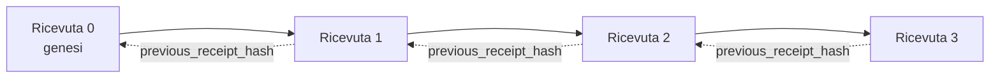

[Guarda il video della lezione: Protezione degli Agenti AI con Ricevute Crittografiche](https://youtu.be/PLACEHOLDER_VIDEO_ID)

> _(Video della lezione e miniatura saranno aggiunti dal team di contenuti Microsoft dopo la fusione, seguendo il modello delle lezioni 14 / 15.)_

# Protezione degli Agenti AI con Ricevute Crittografiche

## Introduzione

Questa lezione tratterà:

- Perché le tracce di audit per gli agenti AI sono importanti per la conformità, il debugging e la fiducia.
- Cos'è una ricevuta crittografica e come differisce da una riga di log non firmata.
- Come produrre una ricevuta firmata per la chiamata a uno strumento da parte di un agente in Python semplice.
- Come verificare una ricevuta offline e rilevare manomissioni.
- Come concatenare le ricevute affinché rimuovere o riordinare una interrompa la catena.
- Cosa dimostrano le ricevute e cosa invece non dimostrano esplicitamente.

## Obiettivi di Apprendimento

Dopo aver completato questa lezione, saprai come:

- Identificare le modalità di errore che motivano un'origine crittografica per le azioni degli agenti.
- Produrre una ricevuta firmata Ed25519 su un payload JSON canonico.
- Verificare una ricevuta indipendentemente utilizzando solo la chiave pubblica del firmatario.
- Rilevare manomissioni rieseguendo la verifica su una ricevuta modificata.
- Costruire una sequenza di ricevute concatenate tramite hash e spiegare perché la catena è importante.
- Riconoscere il confine tra ciò che le ricevute dimostrano (attribuzione, integrità, ordinamento) e ciò che non dimostrano (correttezza dell'azione, solidità della policy).

## Il Problema: La Traccia di Audit del Tuo Agente

Immagina di aver distribuito un agente AI per Contoso Travel. L'agente legge le richieste dei clienti, chiama un'API per i voli per cercare opzioni, e prenota posti per conto del cliente. Lo scorso trimestre, l'agente ha gestito 50.000 prenotazioni.

Oggi arriva un revisore. Fa una domanda semplice: "Mostrami cosa ha fatto il tuo agente."

Gli consegni i file di log. Il revisore li guarda e fa una domanda più difficile: "Come faccio a sapere che questi log non sono stati modificati?"

Questo è il problema della traccia di audit. La maggior parte delle distribuzioni di agenti oggi si basa su:

- **Log delle applicazioni**: scritti dallo stesso agente, modificabili da chiunque abbia accesso al file system.
- **Servizi di logging cloud**: a prova di manomissione a livello di piattaforma, ma solo se il revisore si fida dell'operatore della piattaforma.
- **Log delle transazioni del database**: adatti per i cambiamenti del database ma non per chiamate arbitrarie a strumenti.

Nessuno di questi può rispondere alla domanda del revisore senza che questi debba fidarsi di qualcuno (te, il tuo provider cloud, il fornitore del database). Per uso interno, quella fiducia è spesso accettabile. Per carichi di lavoro regolamentati (finanza, sanità, qualsiasi cosa soggetta al Regolamento UE sull'IA), non lo è.

Le ricevute crittografiche risolvono questo problema rendendo ogni azione dell'agente verificabile in modo indipendente. Il revisore non deve fidarsi di te. Ha bisogno solo della tua chiave pubblica e della ricevuta stessa.

## Cos'è una Ricevuta Crittografica?

Una ricevuta è un oggetto JSON che registra ciò che ha fatto un agente, firmato con una firma digitale.


```mermaid
flowchart LR
    A[L'agente invoca uno strumento] --> B[Costruisci il payload della ricevuta]
    B --> C[Canonicalizza JSON RFC 8785]
    C --> E[Firma Ed25519 sui byte canonici]
    E --> F[Ricevuta con firma]
    F --> G[L'auditor verifica offline]
    G --> H{Firma valida?}
    H -- yes --> I[Prova a prova di manomissione]
    H -- no --> J[Ricevuta rifiutata]
```

Una ricevuta minima si presenta così:

```json
{
  "type": "agent.tool_call.v1",
  "agent_id": "contoso-travel-bot",
  "tool_name": "lookup_flights",
  "tool_args_hash": "sha256:a3f9c1...",
  "result_hash": "sha256:7b2e1d...",
  "policy_id": "contoso-travel-policy-v3",
  "timestamp": "2026-04-25T14:30:00Z",
  "sequence": 47,
  "previous_receipt_hash": "sha256:9d4e6a...",
  "signature": {
    "alg": "EdDSA",
    "sig": "c5af83...",
    "public_key": "8f3b2c..."
  }
}
```

Tre proprietà stanno facendo il lavoro:

1. **La firma**. La ricevuta è firmata dal gateway dell'agente usando una chiave privata Ed25519. Chiunque possieda la chiave pubblica corrispondente può verificare la firma offline. La manomissione di qualsiasi campo invalida la firma.

2. **Codifica canonica**. Prima della firma, la ricevuta viene serializzata usando lo standard JSON Canonicalization Scheme (JCS, RFC 8785). Questo assicura che due implementazioni che producono la stessa ricevuta logica generino un output identico byte per byte. Senza canonizzazione, diversi serializzatori JSON produrrebbero firme diverse per lo stesso contenuto.

3. **Concatenazione tramite hash**. Il campo `previous_receipt_hash` collega ogni ricevuta a quella precedente. Rimuovere o riordinare una ricevuta invalida tutte quelle successive. La manomissione diventa visibile a livello di catena anche se singole firme fossero aggirate.

Insieme queste proprietà forniscono tre garanzie:

- **Attribuzione**: questa chiave ha firmato questo contenuto.
- **Integrità**: il contenuto non è cambiato dalla firma.
- **Ordinamento**: questa ricevuta è venuta dopo quella nella catena.

## Produrre una Ricevuta in Python

Non serve una libreria speciale per produrre una ricevuta. Le primitive crittografiche sono ampiamente disponibili e la logica è di poche decine di righe di Python.

Gli esercizi pratici in `code_samples/18-signed-receipts.ipynb` illustrano il flusso completo. Una versione sintetica:

```python
import json
import hashlib
import base64
from nacl import signing
from jcs import canonicalize  # JSON canonico RFC 8785

def b64url_nopad(data: bytes) -> str:
    return base64.urlsafe_b64encode(data).decode("ascii").rstrip("=")

def sha256_canonical(obj) -> str:
    """SHA-256 of a Python object's JCS-canonical JSON form."""
    return f"sha256:{hashlib.sha256(canonicalize(obj)).hexdigest()}"

# Genera o carica una chiave di firma (in produzione, memorizzare in un key vault)
signing_key = signing.SigningKey.generate()
verify_key = signing_key.verify_key

# Costruisci il payload della ricevuta (ancora senza firma)
tool_args = {"origin": "SYD", "destination": "LAX"}
tool_result = [{"flight": "QF11", "price": 1850, "stops": 0}]

payload = {
    "type": "agent.tool_call.v1",
    "agent_id": "contoso-travel-bot",
    "tool_name": "lookup_flights",
    "tool_args_hash": sha256_canonical(tool_args),
    "result_hash": sha256_canonical(tool_result),
    "policy_id": "contoso-travel-policy-v3",
    "timestamp": "2026-04-25T14:30:00Z",
    "sequence": 0,
    "previous_receipt_hash": None,
}

# Canonicalizza e firma direttamente i byte JCS. PureEdDSA esegue hash internamente.
canonical_bytes = canonicalize(payload)
signature_bytes = signing_key.sign(canonical_bytes).signature

# Allegare un oggetto firma strutturato.
receipt = {
    **payload,
    "signature": {
        "alg": "EdDSA",
        "sig": b64url_nopad(signature_bytes),
        "public_key": b64url_nopad(bytes(verify_key)),
    },
}
```

Questa è tutta la pipeline di firma. Gli esercizi nel notebook descrivono ogni passo.

## Verificare una Ricevuta e Rilevare Manomissioni

La verifica è l'operazione inversa:

```python
import base64
import hashlib
from nacl import signing
from nacl.exceptions import BadSignatureError
from jcs import canonicalize

def b64url_decode(s: str) -> bytes:
    padding = "=" * ((4 - len(s) % 4) % 4)
    return base64.urlsafe_b64decode(s + padding)

def verify_receipt(receipt: dict) -> bool:
    # La firma è un oggetto strutturato: {"alg", "sig", "public_key"}.
    sig_obj = receipt.get("signature")
    if not sig_obj or sig_obj.get("alg") != "EdDSA":
        return False

    # Ricostruisci il payload che è stato effettivamente firmato (tutto tranne la firma).
    payload = {k: v for k, v in receipt.items() if k != "signature"}

    canonical_bytes = canonicalize(payload)

    try:
        verify_key = signing.VerifyKey(b64url_decode(sig_obj["public_key"]))
        verify_key.verify(canonical_bytes, b64url_decode(sig_obj["sig"]))
        return True
    except BadSignatureError:
        return False
```

Questa funzione prende una ricevuta e restituisce `True` se la firma è valida, `False` altrimenti. Nessuna chiamata di rete, nessuna dipendenza da servizio, nessuna fiducia in terze parti.

Per vedere in azione il rilevamento di manomissioni, il notebook illustra:

1. Produrre una ricevuta valida e confermare che verifica correttamente.
2. Modificare un byte del campo `tool_args_hash`.
3. Rieseguire la verifica e osservare il fallimento.

Questa è la dimostrazione pratica che le ricevute sono a prova di manomissione: qualunque modifica, anche piccola, invalida la firma.

## Concatenare le Ricevute per Agenti Multi-Passo

Una singola ricevuta firmata protegge un'azione. Una catena di ricevute protegge una sequenza.


```mermaid
flowchart LR
    R0[Ricevuta 0<br/>genesi] --> R1[Ricevuta 1]
    R1 --> R2[Ricevuta 2]
    R2 --> R3[Ricevuta 3]
    R1 -. previous_receipt_hash .-> R0
    R2 -. previous_receipt_hash .-> R1
    R3 -. previous_receipt_hash .-> R2
```

Ogni ricevuta registra l'hash della ricevuta precedente. Per rimuovere la ricevuta 2 senza lasciare tracce, un attaccante dovrebbe:

- Modificare il campo `previous_receipt_hash` della ricevuta 3 (invalida la firma della ricevuta 3), OPPURE
- Forgiare una nuova firma sulla ricevuta 3 modificata (richiede la chiave privata dell'agente).

Se la chiave privata è conservata in un hardware key vault e pubblichi la chiave pubblica con ogni ricevuta, nessuno dei due attacchi è possibile senza essere rilevato.

Il notebook mostra:

1. Come costruire una catena di tre ricevute.
2. Come verificare che il `previous_receipt_hash` di ogni ricevuta corrisponda all'hash reale della ricevuta precedente.
3. Come manomettere una ricevuta nel mezzo e osservare la rottura della catena proprio in quel punto.

Questo è come produrre una traccia di audit che un revisore esterno può verificare senza dover fidarsi di te.

## Cosa Dimostrano le Ricevute (e Cosa Non Dimostrano)

Questa è la sezione più importante di questa lezione. Le ricevute sono potenti ma con limiti.

**Le ricevute dimostrano tre cose:**

1. **Attribuzione**: una specifica chiave ha firmato un payload specifico.
2. **Integrità**: il payload non è cambiato dalla firma.
3. **Ordinamento**: questa ricevuta è venuta dopo quella nella catena hash.

**Le ricevute NON dimostrano:**

1. **Correttezza**: che l'azione dell'agente fosse quella giusta. Una ricevuta può essere firmata per una risposta sbagliata tanto facilmente quanto per una corretta.
2. **Conformità alla policy**: che la policy indicata in `policy_id` sia stata effettivamente valutata, o che avrebbe permesso quell'azione se controllata. La ricevuta registra ciò che è stato affermato, non ciò che è stato applicato.
3. **Identità oltre la chiave**: la ricevuta dice "questa chiave ha firmato questo contenuto." Non dice "questo umano ha autorizzato questo." Collegare una chiave a una persona o organizzazione richiede infrastrutture di identità separate (un directory, un registro di chiavi pubbliche, ecc.).
4. **Veridicità degli input**: se l'agente riceve un prompt manipolato e agisce di conseguenza, la ricevuta registra fedelmente l'azione. Le ricevute sono a valle della validazione degli input, non un suo sostituto.

Questo confine è importante per due motivi:

- Ti indica a cosa servono realmente le ricevute: rendere il comportamento dell'agente verificabile e a prova di manomissione, anche attraverso confini organizzativi.
- Ti indica quali ulteriori livelli servono ancora: validazione degli input (Lezione 6), applicazione della policy (trattata brevemente più avanti) e infrastruttura di identità (fuori dallo scopo di questa lezione).

Un errore comune è presumere che "abbiamo ricevute" significhi "siamo regolamentati." Non è così. Le ricevute sono una base. La governance è il sistema che costruisci sopra.

## Dimostrare che un Umano ha Approvato l'Azione Esatta

Il punto 3 sopra merita una sezione a parte: una ricevuta di azione dice "questa chiave ha firmato questo contenuto," mai "un umano ha autorizzato questo." Per azioni ad alto rischio (rimborso, cancellazioni, trasferimenti bancari), le framework di governance richiedono sempre più spesso esattamente questa dichiarazione mancante, ed è producibile con le stesse primitive che hai costruito in questa lezione.

Il notebook successivo `code_samples/human-authorization-receipts.ipynb` aggiunge un secondo tipo di ricevuta, `human.approval.v1`, con la stessa struttura a busta delle ricevute della lezione (un payload tipizzato firmato da Ed25519 sui byte JCS canonici, con l’oggetto `signature` fuori dai byte firmati). Un approvatore nominato firma **l’intera azione canonica e il suo digest** prima dell’esecuzione; la ricevuta dell’azione dell'agente porta lo **stesso digest dell’azione** e un `parent_approval_ref`, l’`receipt_hash` dell’approvazione, la stessa convenzione di `previous_receipt_hash` nella catena sopra costruita. Un unico `verify_chain` percorre entrambi i documenti sotto **registri chiave fissati separati** (chiavi dell'approvatore vs chiavi dell'agente), così il percorso del codice è condiviso ma le autorità mai.

La proprietà che ciò garantisce, dichiarata con cura: *l'umano ha approvato questa esatta azione, e l'agente ha eseguito esattamente quell'azione approvata.* I meccanismi di rifiuto nel notebook rendono questa proprietà reale e non solo affermata:

- il classico set: manomissione, confused deputy, replay, chiavi contraffatte da entrambe le parti, input malformati;
- **autorità scaduta**: una firma che ancora verifica, rifiutata comunque perché la versione della policy è cambiata, la chiave dell'approvatore è stata rimossa dal registro fissato, o l'approvazione è scaduta prima dell'esecuzione;
- **sostituzione del digest**: una ricevuta d'azione firmata validamente che punta a un'approvazione *reale* che vincola un'azione canonica *diversa*.

Ogni errore produce un rifiuto con motivo distinto, così un revisore leggendo un rifiuto può capire se l’autorità è scaduta o l’azione eseguita è cambiata. La regola insegnata dal notebook è: un’approvazione firmata non è autorità di per sé. L’autorità esiste solo se entrambe le ricevute vincolano ancora la stessa azione canonica al momento dell’esecuzione. La ricevuta di approvazione umana è una composizione educativa definita da questa lezione, non un tipo di ricevuta definito da `draft-farley-acta-signed-receipts`.

## Riferimenti di Produzione

Il codice Python in questa lezione è intenzionalmente minimo per consentirti di leggere ogni riga e comprendere esattamente cosa accade. In produzione hai due opzioni:

1. **Costruire direttamente sulle primitive crittografiche.** Le 50 righe viste sopra sono sufficienti per molti casi d’uso. PyNaCl (Ed25519) e il pacchetto `jcs` (JSON canonico) sono librerie ben mantenute e verificate.

2. **Usare una libreria di ricevute di produzione.** Diversi progetti open source implementano lo stesso schema con funzionalità aggiuntive (rotazione chiavi, verifica batch, distribuzione JWK Set, integrazione con motori di policy):
   - La pipeline di firma usa le convenzioni JCS e ambito firma in un Internet-Draft IETF indipendente ([`draft-farley-acta-signed-receipts`](https://datatracker.ietf.org/doc/draft-farley-acta-signed-receipts/), revisione 02). La ricevuta educativa piatta di questa lezione differisce dalla busta `{payload, signature}` del draft e non è presentata come implementazione conforme. Il draft pubblica una suite di conformità condivisa ([agent-governance-testvectors](https://github.com/ScopeBlind/agent-governance-testvectors)) per implementazioni che usano quel formato.
   - Il Microsoft Agent Governance Toolkit compone ricevute con decisioni di policy basate su Cedar; vedi il Tutorial 33 in quel repository per un esempio completo.
   - I pacchetti `protect-mcp` (npm) e `@veritasacta/verify` (npm) forniscono un'implementazione Node per firma e verifica offline di ricevute, pensata per incapsulare qualsiasi server MCP con una traccia di audit a prova di manomissione, incluso un flusso "held-for-co-sign" in cui un’azione sospesa emette una ricevuta di approvazione vincolata al digest dell’azione (supportato da WebAuthn sulla versione desktop), stesso schema di ricevuta di approvazione umana del notebook citato sopra.
   - L’SDK Python **[nobulex](https://github.com/arian-gogani/nobulex)** (`pip install nobulex`) offre lo stesso schema di firma Ed25519 + JCS in Python con integrazioni LangChain e CrewAI, incluse test suite di cross-validazione pubblicate e mappatura di conformità fornita tramite [OWASP PR #2210](https://github.com/OWASP/CheatSheetSeries/pull/2210).

La decisione tra fare da sé e usare una libreria è simile a quella tra scrivere la propria libreria JWT o usarne una testata: entrambe sono valide; la libreria fa risparmiare tempo e riduce la superficie di audit; il metodo da zero ti costringe a capire ogni primitiva. Questa lezione insegna il percorso da zero così hai la base per entrambe le scelte.

## Verifica della Conoscenza

Metti alla prova la tua comprensione prima di passare all’esercizio pratico.

**1. Una ricevuta è firmata con la chiave privata Ed25519 dell’agente. Il revisore ha solo la chiave pubblica. Può verificare la ricevuta offline?**

<details>
<summary>Risposta</summary>

Sì. La verifica Ed25519 richiede solo la chiave pubblica e i byte firmati. Nessuna chiamata di rete, nessuna dipendenza da servizi. Questa è la proprietà che rende le ricevute utili in contesti isolati, multi-organizzazione o con bassa fiducia.
</details>

**2. Un attaccante modifica il campo `policy_id` di una ricevuta per affermare che era governata da una policy più permissiva. La firma era sul payload originale. Cosa succede durante la verifica?**

<details>
<summary>Risposta</summary>


La verifica fallisce. La firma è stata calcolata sui byte canonici del payload originale; modificare qualsiasi campo cambia quei byte, il che rende la firma non valida. L'attaccante avrebbe bisogno della chiave privata per produrre una nuova firma valida, cosa che non possiede.
</details>

**3. Perché la ricevuta include un `tool_args_hash` e un `result_hash` piuttosto che gli argomenti e il risultato grezzi?**

<details>
<summary>Risposta</summary>

Due motivi. Primo, la ricevuta potrebbe dover essere archiviata o trasmessa in ambienti dove la fuoriuscita del contenuto grezzo (PII, dati aziendali) rappresenta un problema. L'hashing mantiene la ricevuta piccola e il contenuto privato; l'auditor verifica che l'hash corrisponda a una copia separatamente archiviata del contenuto reale. Secondo, gli hash hanno una dimensione fissa; una ricevuta con hash ha una dimensione limitata indipendentemente da quanto grandi siano stati gli input e gli output.
</details>

**4. Il campo `previous_receipt_hash` collega ogni ricevuta al suo predecessore. Se un attaccante elimina silenziosamente una ricevuta nel mezzo di una catena, cosa diventa invalido?**

<details>
<summary>Risposta</summary>

Ogni ricevuta successiva a quella eliminata. I loro campi `previous_receipt_hash` non corrispondono più alla catena reale (perché la ricevuta a cui facevano riferimento non esiste più, o la catena punta ora a un predecessore diverso). Per nascondere l'eliminazione, l'attaccante dovrebbe rifirmare ogni ricevuta successiva, cosa che richiede la chiave privata.
</details>

**5. Una ricevuta viene verificata correttamente. Questo prova che l'azione dell'agente è stata corretta, valida o conforme alla policy?**

<details>
<summary>Risposta</summary>

No. Una ricevuta valida dimostra tre cose: attribuzione (questa chiave ha firmato questo contenuto), integrità (il contenuto non è cambiato) e ordinamento (questa ricevuta è venuta dopo quell'altra). NON prova che l'azione sia stata corretta, che la policy nominata in `policy_id` sia stata effettivamente valutata, o che l'agente abbia seguito tutte le regole. Le ricevute rendono il comportamento dell'agente verificabile, non necessariamente corretto. Questa è la distinzione più importante nella lezione.
</details>

## Esercizio Pratico

Apri `code_samples/18-signed-receipts.ipynb` e completa tutte e quattro le sezioni:

1. **Sezione 1**: Firma la tua prima ricevuta e verificane la validità.
2. **Sezione 2**: Manometti la ricevuta e osserva la verifica fallire.
3. **Sezione 3**: Costruisci una catena di tre ricevute e verifica l'integrità della catena.
4. **Sezione 4**: Applica il modello a un agente costruito con il Microsoft Agent Framework: ingloba una chiamata a uno strumento nel processo di firma della ricevuta, poi verifica la ricevuta indipendentemente.

**Sfida aggiuntiva 1:** estendi lo schema della ricevuta con un campo aggiuntivo a tua scelta (ad esempio, un ID richiesta per il tracciamento), aggiorna la logica di firma canonica per includerlo e conferma che la ricevuta riesca ancora a passare la verifica. Poi modifica il campo dopo la firma e conferma che la verifica fallisca. Questo ti costringe a capire come ogni byte della codifica canonica contribuisce alla firma.

**Sfida aggiuntiva 2:** Calcola l'hash SHA-256 di due tue ricevute insieme (concatenando i loro byte canonici in un ordine deterministico) e incorpora il digest risultante come un nuovo campo in una terza ricevuta prima di firmarla. Verifica che tutte e tre le ricevute passino ancora la verifica. Hai appena costruito una prova di inclusione a un solo passo: chiunque possegga la terza ricevuta può dimostrare che le prime due esistevano al momento della firma senza dover rivelarne il contenuto. Questo è il modello che ricevute a divulgazione selettiva usano su larga scala (impegni Merkle, RFC 6962).

## Conclusione

Le ricevute crittografiche forniscono agli agenti AI una traccia di controllo che è:

- **Verificabile indipendentemente**: qualsiasi parte con la chiave pubblica può verificare, senza dipendenza da servizi.
- **Tamper-evident**: ogni modifica invalida la firma.
- **Portabile**: una ricevuta è un piccolo file JSON; può essere archiviata, trasmessa e verificata ovunque.
- **Allineata agli standard**: basata su Ed25519 (RFC 8032), JCS (RFC 8785), e SHA-256, tutte primitive ampiamente adottate.

Non sono un sostituto per la validazione degli input, l'applicazione delle policy o l'infrastruttura di identità. Sono una base per questi livelli. Quando distribuisci agenti in carichi di lavoro regolamentati, flussi di lavoro multi-organizzazione o qualsiasi contesto dove un futuro auditor non può presumere di fidarsi di te, le ricevute rendono la traccia di controllo onesta.

Il messaggio più importante: le ricevute dimostrano chi ha detto cosa e quando. Non dimostrano che ciò che è stato detto sia vero o corretto. Tieni strettamente questa distinzione. È la differenza tra un sistema di provenienza onesto e uno ingannevole.

## Checklist per la Produzione

Quando sei pronto a passare da questa lezione a distribuire agenti con ricevute firmate in un ambiente reale:

- [ ] **Sposta la chiave di firma dal laptop dello sviluppatore.** Usa Azure Key Vault, AWS KMS o un modulo hardware di sicurezza. La chiave privata che firma le tue ricevute non deve mai trovarsi nel controllo versione o in chiaro sulle macchine applicative.
- [ ] **Pubblica la chiave pubblica per la verifica.** Gli auditor ne hanno bisogno per verificare offline. Il modello standard è un JWK Set a un URL noto (RFC 7517), es. `https://your-org.example.com/.well-known/agent-keys.json`.
- [ ] **Ancorare esternamente la catena.** Periodicamente scrivi l'hash della testa più recente della catena in un registro di trasparenza (Sigstore Rekor, autorità timestamp RFC 3161 o un secondo sistema interno) così una parte esterna può confermare "questa catena esisteva a questo momento".
- [ ] **Conserva le ricevute in modo immutabile.** Lo storage blob solo-append impedisce a un insider di riscrivere la storia al livello di archiviazione (Azure Storage con politiche di immutabilità, AWS S3 Object Lock).
- [ ] **Decidi la retention.** Molti regimi di compliance richiedono conservazione pluriennale. Pianifica la crescita delle ricevute (ogni ricevuta è ~500 byte; un agente che fa 10.000 chiamate al giorno produce ~1,8 GB all'anno).
- [ ] **Documenta cosa le ricevute non coprono.** Le ricevute provano attribuzione, integrità e ordinamento. Il tuo runbook dovrebbe elencare esplicitamente quali controlli aggiuntivi (validazione input, applicazione policy, limitazione del rateo, infrastruttura di identità) affiancano le ricevute nella tua postura di governance.

### Hai altre domande su come mettere in sicurezza gli agenti AI?

Iscriviti al [Microsoft Foundry Discord](https://aka.ms/ai-agents/discord) per incontrare altri studenti, partecipare alle ore di ufficio e ottenere risposte sulle domande riguardanti gli agenti AI.

## Oltre Questa Lezione

Questa lezione tratta la firma di singole ricevute e sequenze concatenate con hash. Le stesse primitive compongono diversi modelli più avanzati che potresti incontrare man mano che la tua postura di governance matura:

- **Divulgazione selettiva.** Quando i campi di una ricevuta sono impegnati indipendentemente (albero Merkle stile RFC 6962), puoi rivelare specifici campi a specifici auditor e dimostrare che il resto è immutato senza esporli. Utile quando la stessa ricevuta deve soddisfare sia un audit completo (che vuole completezza) sia normative di minimizzazione dati come GDPR (che vogliono che l'auditor veda il meno possibile).
- **Revoca delle ricevute.** Se una chiave di firma viene compromessa, servono modi per segnare tutte le ricevute firmate con quella chiave come non affidabili da un certo punto in avanti. Modelli standard: chiavi di firma a vita breve più una lista di revoca pubblicata, o un registro di trasparenza con voci di revoca.
- **Ricevute bilaterali / con firma divisa.** Alcune implementazioni dividono il payload firmato in metà pre-esecuzione (`authorization_*`) e post-esecuzione (`result_*`) con firme indipendenti, utile quando la decisione di autorizzazione e il risultato osservato sono prodotti da attori diversi o in tempi differenti. Questo si compone in modo additivo sopra il formato della ricevuta insegnato in questa lezione.
- **Composizione del payload.** Una ricevuta sigilla qualsiasi byte tu metta in `result_hash`. I payload reali sono spesso più ricchi del solo risultato di una chiamata a uno strumento: ragionamenti pre-decisione (predizioni modello, opzioni considerate, prove e loro completezza, postura di rischio, catena di responsabilità, esito filtri) possono vivere tutti dentro il payload, sigillati da una sola ricevuta. Questo mantiene il formato della ricevuta minimale pur permettendo agli schemi del payload di evolversi dominio per dominio.
- **Conformità cross-implementazione.** Molte implementazioni indipendenti dello stesso formato di ricevuta (Python, TypeScript, Rust, Go) si verificano incrociando vettori di test condivisi. Se costruisci la tua implementazione, la validazione contro vettori pubblicati conferma la compatibilità wire.
- **Migrazione post-quantistica.** Ed25519 è ampiamente distribuito oggi ma non è resistente ai quantistici. Il formato ricevuta è agile rispetto all'algoritmo: il campo `signature.alg` può portare `ML-DSA-65` (lo standard NIST di firma post-quantistica) quando serve migrare. Pianifica un periodo di transizione in cui le ricevute sono firmate doppie.

## Risorse Aggiuntive

- <a href="https://datatracker.ietf.org/doc/draft-farley-acta-signed-receipts/" target="_blank">IETF Internet-Draft: Ricevute di Decisione Firmate per il Controllo di Accesso Machine-to-Machine</a>
- <a href="https://learn.microsoft.com/azure/ai-studio/responsible-use-of-ai-overview" target="_blank">Panoramica sulla Responsabilità AI (Azure AI)</a>
- <a href="https://datatracker.ietf.org/doc/html/rfc8032" target="_blank">RFC 8032: Algoritmo di Firma Digitale a Curva di Edwards (EdDSA)</a>
- <a href="https://datatracker.ietf.org/doc/html/rfc8785" target="_blank">RFC 8785: Schema di Canonicalizzazione JSON (JCS)</a>
- <a href="https://datatracker.ietf.org/doc/html/rfc6962" target="_blank">RFC 6962: Trasparenza dei Certificati</a> (Costruzione ad albero Merkle usata da ricevute a divulgazione selettiva)
- <a href="https://github.com/microsoft/agent-governance-toolkit/blob/main/docs/tutorials/33-offline-verifiable-receipts.md" target="_blank">Microsoft Agent Governance Toolkit, Tutorial 33: Ricevute di Decisione Verificabili Offline</a>
- <a href="https://github.com/ScopeBlind/agent-governance-testvectors" target="_blank">Vettori di test cross-implementazione</a> per il formato di ricevuta usato in questa lezione (Apache-2.0)
- <a href="https://pynacl.readthedocs.io/" target="_blank">Documentazione PyNaCl</a> (Ed25519 in Python)

## Lezione Precedente

[Creare Agenti AI Locali](../17-creating-local-ai-agents/README.md)

---

<!-- CO-OP TRANSLATOR DISCLAIMER START -->
**Disclaimer**:
Questo documento è stato tradotto utilizzando il servizio di traduzione AI [Co-op Translator](https://github.com/Azure/co-op-translator). Sebbene ci impegniamo per garantire la precisione, si prega di notare che le traduzioni automatizzate possono contenere errori o imprecisioni. Il documento originale nella sua lingua nativa deve essere considerato la fonte autorevole. Per informazioni critiche, si raccomanda una traduzione professionale effettuata da un essere umano. Non siamo responsabili per eventuali malintesi o interpretazioni errate derivanti dall’uso di questa traduzione.
<!-- CO-OP TRANSLATOR DISCLAIMER END -->