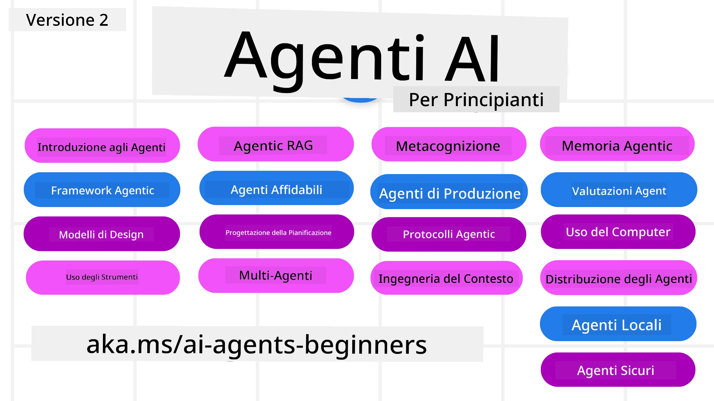

# Agenti AI per Principianti - Un Corso



## Un corso che insegna tutto quello che devi sapere per iniziare a costruire Agenti AI

[](https://github.com/microsoft/ai-agents-for-beginners/blob/master/LICENSE?WT.mc_id=academic-105485-koreyst)
[](https://GitHub.com/microsoft/ai-agents-for-beginners/graphs/contributors/?WT.mc_id=academic-105485-koreyst)
[](https://GitHub.com/microsoft/ai-agents-for-beginners/issues/?WT.mc_id=academic-105485-koreyst)
[](https://GitHub.com/microsoft/ai-agents-for-beginners/pulls/?WT.mc_id=academic-105485-koreyst)
[](http://makeapullrequest.com?WT.mc_id=academic-105485-koreyst)

### 🌐 Supporto Multilingue

#### Supportato tramite GitHub Action (Automatizzato e Sempre Aggiornato)

<!-- CO-OP TRANSLATOR LANGUAGES TABLE START -->
[Arabic](../ar/README.md) | [Bengali](../bn/README.md) | [Bulgarian](../bg/README.md) | [Burmese (Myanmar)](../my/README.md) | [Chinese (Simplified)](../zh-CN/README.md) | [Chinese (Traditional, Hong Kong)](../zh-HK/README.md) | [Chinese (Traditional, Macau)](../zh-MO/README.md) | [Chinese (Traditional, Taiwan)](../zh-TW/README.md) | [Croatian](../hr/README.md) | [Czech](../cs/README.md) | [Danish](../da/README.md) | [Dutch](../nl/README.md) | [Estonian](../et/README.md) | [Finnish](../fi/README.md) | [French](../fr/README.md) | [German](../de/README.md) | [Greek](../el/README.md) | [Hebrew](../he/README.md) | [Hindi](../hi/README.md) | [Hungarian](../hu/README.md) | [Indonesian](../id/README.md) | [Italian](./README.md) | [Japanese](../ja/README.md) | [Kannada](../kn/README.md) | [Korean](../ko/README.md) | [Lithuanian](../lt/README.md) | [Malay](../ms/README.md) | [Malayalam](../ml/README.md) | [Marathi](../mr/README.md) | [Nepali](../ne/README.md) | [Nigerian Pidgin](../pcm/README.md) | [Norwegian](../no/README.md) | [Persian (Farsi)](../fa/README.md) | [Polish](../pl/README.md) | [Portuguese (Brazil)](../pt-BR/README.md) | [Portuguese (Portugal)](../pt-PT/README.md) | [Punjabi (Gurmukhi)](../pa/README.md) | [Romanian](../ro/README.md) | [Russian](../ru/README.md) | [Serbian (Cyrillic)](../sr/README.md) | [Slovak](../sk/README.md) | [Slovenian](../sl/README.md) | [Spanish](../es/README.md) | [Swahili](../sw/README.md) | [Swedish](../sv/README.md) | [Tagalog (Filipino)](../tl/README.md) | [Tamil](../ta/README.md) | [Telugu](../te/README.md) | [Thai](../th/README.md) | [Turkish](../tr/README.md) | [Ukrainian](../uk/README.md) | [Urdu](../ur/README.md) | [Vietnamese](../vi/README.md)

> **Preferisci Clonare Localmente?**
>
> Questo repository include traduzioni in più di 50 lingue che aumentano significativamente la dimensione del download. Per clonare senza traduzioni, usa il sparse checkout:
>
> **Bash / macOS / Linux:**
> ```bash
> git clone --filter=blob:none --sparse https://github.com/microsoft/ai-agents-for-beginners.git
> cd ai-agents-for-beginners
> git sparse-checkout set --no-cone '/*' '!translations' '!translated_images'
> ```
>
> **CMD (Windows):**
> ```cmd
> git clone --filter=blob:none --sparse https://github.com/microsoft/ai-agents-for-beginners.git
> cd ai-agents-for-beginners
> git sparse-checkout set --no-cone "/*" "!translations" "!translated_images"
> ```
>
> Questo ti offre tutto il necessario per completare il corso con un download molto più veloce.
<!-- CO-OP TRANSLATOR LANGUAGES TABLE END -->

**Se desideri che vengano supportate ulteriori lingue di traduzione, sono elencate [qui](https://github.com/Azure/co-op-translator/blob/main/getting_started/supported-languages.md)**

[](https://GitHub.com/microsoft/ai-agents-for-beginners/watchers/?WT.mc_id=academic-105485-koreyst)
[](https://GitHub.com/microsoft/ai-agents-for-beginners/network/?WT.mc_id=academic-105485-koreyst)
[](https://GitHub.com/microsoft/ai-agents-for-beginners/stargazers/?WT.mc_id=academic-105485-koreyst)

[](https://discord.gg/nTYy5BXMWG)


## 🌱 Iniziare

Questo corso contiene lezioni che coprono i fondamenti per costruire Agenti AI. Ogni lezione tratta un argomento specifico quindi inizia dove preferisci!

C'è supporto multilingue per questo corso. Vai alle nostre [lingue disponibili qui](../..). 

Se è la prima volta che costruisci usando modelli di AI Generativa, dai un'occhiata al nostro corso [Generative AI For Beginners](https://aka.ms/genai-beginners), che include 21 lezioni su come costruire con GenAI.

Non dimenticare di [mettere una stella (🌟) a questo repo](https://docs.github.com/en/get-started/exploring-projects-on-github/saving-repositories-with-stars?WT.mc_id=academic-105485-koreyst) e di [fare il fork di questo repo](https://github.com/microsoft/ai-agents-for-beginners/fork) per eseguire il codice.

### Incontra altri Learner, ottieni risposta alle tue domande

Se sei bloccato o hai domande su come costruire Agenti AI, unisciti al nostro canale Discord dedicato in [Microsoft Foundry Discord](https://aka.ms/ai-agents/discord).

### Cosa Ti Serve 

Ogni lezione di questo corso include esempi di codice, che puoi trovare nella cartella code_samples. Puoi [fare il fork di questo repo](https://github.com/microsoft/ai-agents-for-beginners/fork) per creare la tua copia.

Gli esempi di codice in questi esercizi utilizzano il Microsoft Agent Framework con Azure AI Foundry Agent Service V2:

- [Microsoft Foundry](https://aka.ms/ai-agents-beginners/ai-foundry) - Account Azure Richiesto

Questo corso utilizza i seguenti framework e servizi per Agenti AI di Microsoft:

- [Microsoft Agent Framework (MAF)](https://aka.ms/ai-agents-beginners/agent-framewrok)
- [Azure AI Foundry Agent Service V2](https://aka.ms/ai-agents-beginners/ai-agent-service)


Per maggiori informazioni su come eseguire il codice per questo corso, vai a [Impostazioni del Corso](./00-course-setup/README.md).

## 🙏 Vuoi aiutare?

Hai suggerimenti o hai trovato errori di ortografia o di codice? [Apri un issue](https://github.com/microsoft/ai-agents-for-beginners/issues?WT.mc_id=academic-105485-koreyst) o [Crea una pull request](https://github.com/microsoft/ai-agents-for-beginners/pulls?WT.mc_id=academic-105485-koreyst)


## 📂 Ogni lezione include

- Una lezione scritta nel README e un breve video
- Esempi di codice Python utilizzando Microsoft Agent Framework con Azure AI Foundry
- Link a risorse extra per continuare il tuo apprendimento


## 🗃️ Lezioni

| **Lezione**                                  | **Testo & Codice**                                  | **Video**                                                  | **Apprendimento Extra**                                                                     |
|----------------------------------------------|----------------------------------------------------|------------------------------------------------------------|--------------------------------------------------------------------------------------------|
| Introduzione agli Agenti AI e Casi d'Uso    | [Link](./01-intro-to-ai-agents/README.md)          | [Video](https://youtu.be/3zgm60bXmQk?si=z8QygFvYQv-9WtO1)  | [Link](https://aka.ms/ai-agents-beginners/collection?WT.mc_id=academic-105485-koreyst)      |
| Esplorare Framework Agentici                  | [Link](./02-explore-agentic-frameworks/README.md)  | [Video](https://youtu.be/ODwF-EZo_O8?si=Vawth4hzVaHv-u0H)  | [Link](https://aka.ms/ai-agents-beginners/collection?WT.mc_id=academic-105485-koreyst)      |
| Capire i Pattern di Design Agentici          | [Link](./03-agentic-design-patterns/README.md)     | [Video](https://youtu.be/m9lM8qqoOEA?si=BIzHwzstTPL8o9GF)  | [Link](https://aka.ms/ai-agents-beginners/collection?WT.mc_id=academic-105485-koreyst)      |
| Pattern di Design per l'Uso di Strumenti     | [Link](./04-tool-use/README.md)                    | [Video](https://youtu.be/vieRiPRx-gI?si=2z6O2Xu2cu_Jz46N)  | [Link](https://aka.ms/ai-agents-beginners/collection?WT.mc_id=academic-105485-koreyst)      |
| RAG Agentico                                  | [Link](./05-agentic-rag/README.md)                 | [Video](https://youtu.be/WcjAARvdL7I?si=gKPWsQpKiIlDH9A3)  | [Link](https://aka.ms/ai-agents-beginners/collection?WT.mc_id=academic-105485-koreyst)      |
| Costruire Agenti AI Affidabili                | [Link](./06-building-trustworthy-agents/README.md) | [Video](https://youtu.be/iZKkMEGBCUQ?si=jZjpiMnGFOE9L8OK ) | [Link](https://aka.ms/ai-agents-beginners/collection?WT.mc_id=academic-105485-koreyst)      |
| Pattern di Design per la Pianificazione      | [Link](./07-planning-design/README.md)             | [Video](https://youtu.be/kPfJ2BrBCMY?si=6SC_iv_E5-mzucnC)  | [Link](https://aka.ms/ai-agents-beginners/collection?WT.mc_id=academic-105485-koreyst)      |
| Pattern di Design Multi-Agente                | [Link](./08-multi-agent/README.md)                 | [Video](https://youtu.be/V6HpE9hZEx0?si=rMgDhEu7wXo2uo6g)  | [Link](https://aka.ms/ai-agents-beginners/collection?WT.mc_id=academic-105485-koreyst)      |
| Pattern di Design Metacognitivo               | [Link](./09-metacognition/README.md)               | [Video](https://youtu.be/His9R6gw6Ec?si=8gck6vvdSNCt6OcF)  | [Link](https://aka.ms/ai-agents-beginners/collection?WT.mc_id=academic-105485-koreyst)      |
| Agenti AI in Produzione                      | [Link](./10-ai-agents-production/README.md)        | [Video](https://youtu.be/l4TP6IyJxmQ?si=31dnhexRo6yLRJDl)  | [Link](https://aka.ms/ai-agents-beginners/collection?WT.mc_id=academic-105485-koreyst) |
| Uso di Protocolli Agentici (MCP, A2A e NLWeb) | [Link](./11-agentic-protocols/README.md)           | [Video](https://youtu.be/X-Dh9R3Opn8)                                 | [Link](https://aka.ms/ai-agents-beginners/collection?WT.mc_id=academic-105485-koreyst) |
| Ingegneria del Contesto per Agenti AI       | [Link](./12-context-engineering/README.md)         | [Video](https://youtu.be/F5zqRV7gEag)                                 | [Link](https://aka.ms/ai-agents-beginners/collection?WT.mc_id=academic-105485-koreyst) |
| Gestione della Memoria Agentica              | [Link](./13-agent-memory/README.md)     |      [Video](https://youtu.be/QrYbHesIxpw?si=vZkVwKrQ4ieCcIPx)                                                      |                                                                                        |
| Esplorazione del Microsoft Agent Framework   | [Link](./14-microsoft-agent-framework/README.md)                            |                                                            |                                                                                        |
| Costruire Agenti per l'Uso del Computer (CUA) | Prossimamente                            |                                                            |                                                                                        |
| Distribuzione di Agenti Scalabili             | Prossimamente                            |                                                            |                                                                                        |
| Creazione di Agenti AI Locali                  | Prossimamente                               |                                                            |                                                                                        |
| Sicurezza degli Agenti AI                      | Prossimamente                               |                                                            |                                                                                        |

## 🎒 Altri Corsi

Il nostro team produce altri corsi! Dai un'occhiata a:

<!-- CO-OP TRANSLATOR OTHER COURSES START -->
### LangChain
[](https://aka.ms/langchain4j-for-beginners)
[](https://aka.ms/langchainjs-for-beginners?WT.mc_id=m365-94501-dwahlin)
[](https://github.com/microsoft/langchain-for-beginners?WT.mc_id=m365-94501-dwahlin)
---

### Azure / Edge / MCP / Agenti
[](https://github.com/microsoft/AZD-for-beginners?WT.mc_id=academic-105485-koreyst)
[](https://github.com/microsoft/edgeai-for-beginners?WT.mc_id=academic-105485-koreyst)
[](https://github.com/microsoft/mcp-for-beginners?WT.mc_id=academic-105485-koreyst)
[](https://github.com/microsoft/ai-agents-for-beginners?WT.mc_id=academic-105485-koreyst)

---
 
### Serie AI Generativa
[](https://github.com/microsoft/generative-ai-for-beginners?WT.mc_id=academic-105485-koreyst)
[-9333EA?style=for-the-badge&labelColor=E5E7EB&color=9333EA)](https://github.com/microsoft/Generative-AI-for-beginners-dotnet?WT.mc_id=academic-105485-koreyst)
[-C084FC?style=for-the-badge&labelColor=E5E7EB&color=C084FC)](https://github.com/microsoft/generative-ai-for-beginners-java?WT.mc_id=academic-105485-koreyst)
[-E879F9?style=for-the-badge&labelColor=E5E7EB&color=E879F9)](https://github.com/microsoft/generative-ai-with-javascript?WT.mc_id=academic-105485-koreyst)

---
 
### Apprendimento Core
[](https://aka.ms/ml-beginners?WT.mc_id=academic-105485-koreyst)
[](https://aka.ms/datascience-beginners?WT.mc_id=academic-105485-koreyst)
[](https://aka.ms/ai-beginners?WT.mc_id=academic-105485-koreyst)
[](https://github.com/microsoft/Security-101?WT.mc_id=academic-96948-sayoung)
[](https://aka.ms/webdev-beginners?WT.mc_id=academic-105485-koreyst)
[](https://aka.ms/iot-beginners?WT.mc_id=academic-105485-koreyst)
[](https://github.com/microsoft/xr-development-for-beginners?WT.mc_id=academic-105485-koreyst)

---
 
### Serie Copilot
[](https://aka.ms/GitHubCopilotAI?WT.mc_id=academic-105485-koreyst)
[](https://github.com/microsoft/mastering-github-copilot-for-dotnet-csharp-developers?WT.mc_id=academic-105485-koreyst)
[](https://github.com/microsoft/CopilotAdventures?WT.mc_id=academic-105485-koreyst)
<!-- CO-OP TRANSLATOR OTHER COURSES END -->

## 🌟 Ringraziamenti alla Community

Grazie a [Shivam Goyal](https://www.linkedin.com/in/shivam2003/) per aver contribuito con importanti esempi di codice che dimostrano Agentic RAG.

## Contribuire

Questo progetto accoglie contributi e suggerimenti. La maggior parte dei contributi richiede l'accettazione di un
Accordo di Licenza per Contribuenti (CLA) che dichiara che hai il diritto e effettivamente concedi a noi
i diritti di usare il tuo contributo. Per dettagli, visita <https://cla.opensource.microsoft.com>.

Quando invii una pull request, un bot CLA determinerà automaticamente se devi fornire
un CLA e decorerà la PR di conseguenza (es. controllo dello stato, commento). Basta seguire le istruzioni
fornite dal bot. Dovrai farlo solo una volta per tutti i repository che usano il nostro CLA.

Questo progetto ha adottato il [Codice di Condotta per il Codice Open Source Microsoft](https://opensource.microsoft.com/codeofconduct/).
Per maggiori informazioni consulta le [FAQ sul Codice di Condotta](https://opensource.microsoft.com/codeofconduct/faq/) o
contatta [opencode@microsoft.com](mailto:opencode@microsoft.com) per domande o commenti aggiuntivi.

## Marchi

Questo progetto può contenere marchi o loghi di progetti, prodotti o servizi. L'uso autorizzato di marchi o loghi Microsoft
è soggetto a e deve seguire le
[Linee guida sui Marchi e Brand Microsoft](https://www.microsoft.com/legal/intellectualproperty/trademarks/usage/general).
L'uso di marchi o loghi Microsoft in versioni modificate di questo progetto non deve creare confusione o implicare sponsorizzazione da parte di Microsoft.
Qualsiasi uso di marchi o loghi di terze parti è soggetto alle politiche di tali terze parti.

## Ottenere Aiuto

Se rimani bloccato o hai domande sulla costruzione di app AI, unisciti a:

[](https://aka.ms/foundry/discord)

Se hai feedback sul prodotto o errori durante la creazione, visita:

[](https://aka.ms/foundry/forum)

---

<!-- CO-OP TRANSLATOR DISCLAIMER START -->
**Dichiarazione di non responsabilità**:
Questo documento è stato tradotto utilizzando il servizio di traduzione automatica [Co-op Translator](https://github.com/Azure/co-op-translator). Sebbene ci impegniamo per garantire l'accuratezza, si prega di essere consapevoli che le traduzioni automatiche possono contenere errori o inesattezze. Il documento originale nella sua lingua nativa deve essere considerato la fonte autorevole. Per informazioni critiche, si raccomanda la traduzione professionale umana. Non ci assumiamo alcuna responsabilità per eventuali incomprensioni o interpretazioni errate derivanti dall'uso di questa traduzione.
<!-- CO-OP TRANSLATOR DISCLAIMER END -->