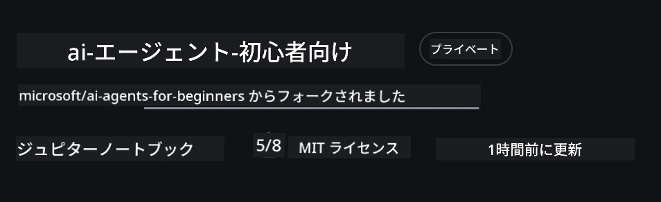
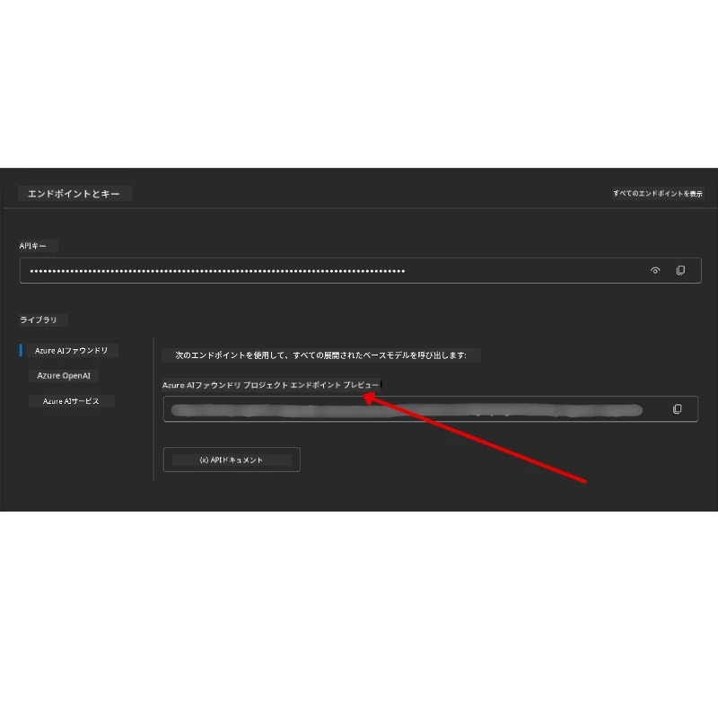

# コースセットアップ

## はじめに

このレッスンでは、このコースのコードサンプルを実行する方法について説明します。

## 他の学習者と参加して助けを得る

リポジトリをクローンし始める前に、セットアップの手助けを受けたり、コースについての質問をしたり、他の学習者と繋がったりするために、[AI Agents For Beginners Discordチャンネル](https://aka.ms/ai-agents/discord) に参加してください。

## このリポジトリをクローンまたはフォークする

まず、GitHubリポジトリをクローンまたはフォークしてください。これにより、コードを実行、テスト、調整できるようにコースの資料の自分専用バージョンを作成できます！

<a href="https://github.com/microsoft/ai-agents-for-beginners/fork" target="_blank">リポジトリをフォークする</a> リンクをクリックすることでこれを行うことができます。

以下のリンクにご自身のフォークしたコースのバージョンができているはずです：



### 浅いクローン（ワークショップ / Codespacesに推奨）

  >フルリポジトリは、すべての履歴とすべてのファイルをダウンロードすると大きくなることがあります (~3 GB)。ワークショップだけ参加する場合や、一部のレッスンフォルダーだけ必要な場合は、浅いクローン（またはスパースクローン）がはるかに少ないダウンロード量です。

#### クイックな浅いクローン — 最小限の履歴、すべてのファイル

以下のコマンドで `<your-username>` をフォークURL（または上流URL）に置き換えてください。

最新のコミット履歴のみをクローンするには（ダウンロードが小さい）：

```bash
git clone --depth 1 https://github.com/<your-username>/ai-agents-for-beginners.git
```

特定のブランチをクローンするには：

```bash
git clone --depth 1 --branch <branch-name> https://github.com/<your-username>/ai-agents-for-beginners.git
```

#### 部分的（スパース）クローン — 最小限のブロブ + 選択フォルダーのみ

これは部分的クローンとスパースチェックアウトを使います（Git 2.25+ と部分クローン対応の最新Git推奨）：

```bash
git clone --depth 1 --filter=blob:none --sparse https://github.com/<your-username>/ai-agents-for-beginners.git
```

リポジトリフォルダに移動：

```bash
cd ai-agents-for-beginners
```

その後取得したいフォルダーを指定します（以下の例は二つのフォルダーを示しています）：

```bash
git sparse-checkout set 00-course-setup 01-intro-to-ai-agents
```

クローンとファイルの確認後に、ファイルだけが欲しい場合やスペースを空けたい場合（git履歴は不要）、リポジトリのメタデータを削除してください（💀取り消し不可 — 全Git機能が失われます）：

```bash
# zsh/bash
rm -rf .git
```

```powershell
# PowerShell
Remove-Item -Recurse -Force .git
```

#### GitHub Codespaces を使う（ローカルの大きなダウンロードを避けるために推奨）

- このリポジトリのために [GitHub UI](https://github.com/codespaces) で新しいCodespaceを作成します。  

- 新しく作成したCodespaceの端末で、上記の浅い/スパースクローンコマンドのいずれかを実行し、Codespaceのワークスペースに必要なレッスンフォルダーだけを取り込みます。
- 任意で：Codespaces内でクローン後に .git を削除してスペースを確保（上記の削除コマンドを参照）。
- 注意：リポジトリを直接Codespacesで開く（追加のクローンなし）ことも可能ですが、Codespacesはdevcontainer環境を構築し、必要以上の設定をする可能性があります。

#### ヒント

- 編集やコミットを行いたい場合は常にクローンURLを自分のフォークに置き換えてください。
- 後でさらに履歴やファイルが必要になったら、フェッチしたり、スパースチェックアウトの対象フォルダを調整できます。

## コードの実行

このコースでは、AIエージェントを構築する実践的な体験ができる一連のJupyterノートブックを提供しています。

コードサンプルは、`FoundryChatClient` を使った **Microsoft Agent Framework (MAF)** を用いており、これは **Microsoft Foundry** を通じて **Microsoft Foundry Agent Service V2**（Responses API）に接続します。

すべてのPythonノートブックは `*-python-agent-framework.ipynb` とラベル付けされています。

## 必要要件

- Python 3.12以上
  - <strong>注意</strong>：Python3.12がインストールされていない場合は必ずインストールしてください。その後、python3.12を使ってvenvを作成し、requirements.txtから正しいバージョンがインストールされるようにします。
  
    >例

    Pythonのvenvディレクトリを作成：

    ```bash
    python -m venv venv
    ```

    次に、以下でvenv環境をアクティベート：

    ```bash
    # zsh/bash
    source venv/bin/activate
    ```
  
    ```dos
    # Command Prompt for Windows
    venv\Scripts\activate
    ```

- .NET 10以上：.NETを使用するサンプルコードの場合、[.NET 10 SDK](https://dotnet.microsoft.com/download/dotnet/10.0)以降をインストールしてください。次にインストール済みのSDKバージョンを確認します：

    ```bash
    dotnet --list-sdks
    ```

- **Azure CLI** — 認証に必要です。[aka.ms/installazurecli](https://aka.ms/installazurecli)からインストールしてください。
- **Azureサブスクリプション** — Microsoft Foundry および Microsoft Foundry Agent Serviceへのアクセスに必要。
- **Microsoft Foundry プロジェクト** — モデルが展開されているプロジェクト（例：`gpt-5-mini`）。詳細は[ステップ1](#ステップ1：microsoft-foundryプロジェクトを作成する)を参照。

このリポジトリのルートに、コードサンプル実行に必要なすべてのPythonパッケージを含む`requirements.txt`ファイルを含めています。

ルートのターミナルで以下のコマンドを実行してインストールできます：

```bash
pip install -r requirements.txt
```

競合や問題を避けるために、Python仮想環境を作成することを推奨します。

## VSCodeのセットアップ

VSCodeで正しいPythonバージョンを使用していることを確認してください。


## Microsoft Foundry と Microsoft Foundry Agent Service のセットアップ

### ステップ1：Microsoft Foundryプロジェクトを作成する

ノートブックを実行するには、Microsoft Foundryの<strong>ハブ</strong>と<strong>プロジェクト</strong>が必要で、モデルが展開されている必要があります。

1. [ai.azure.com](https://ai.azure.com)にアクセスし、Azureアカウントでサインインします。
2. <strong>ハブ</strong>を作成する（または既存のものを使用）。詳細は：[Hub resources overview](https://learn.microsoft.com/azure/ai-foundry/concepts/ai-resources)。
3. ハブ内で<strong>プロジェクト</strong>を作成します。
4. **Models + Endpoints** → **Deploy model** からモデル（例：`gpt-5-mini`）を展開します。

### ステップ2：プロジェクトエンドポイントとモデル展開名を取得する

Microsoft Foundryポータルのプロジェクトから：

- <strong>プロジェクトエンドポイント</strong> — <strong>概要</strong>ページに行き、エンドポイントURLをコピー。



- <strong>モデル展開名</strong> — **Models + Endpoints** に行き、展開済みモデルを選択し、**Deployment name**（例：`gpt-5-mini`）をメモ。

### ステップ3：`az login` でAzureにサインインする

ほとんどのノートブックは、`azure-identity`パッケージの `AzureCliCredential` または `DefaultAzureCredential`（いずれも `az login` セッションを利用）を使った **Azure CLIサインイン** で認証するためAPIキーは不要です。一部のレッスンや任意の統合でAPIキーを使う場合があります。各レッスンの前提条件で追加の環境変数を確認してください。このためにはAzure CLIでのサインインが必要です。

1. **Azure CLIを未インストールの場合はインストール**：[aka.ms/installazurecli](https://aka.ms/installazurecli)

2. <strong>以下を実行してサインイン</strong>：

    ```bash
    az login
    ```

    または、リモート/Codespace環境でブラウザが使えない場合：

    ```bash
    az login --use-device-code
    ```

3. プロンプトがあれば<strong>サブスクリプションを選択</strong> — Foundryプロジェクトのあるサブスクリプションを選びます。

4. <strong>サインイン済みか確認</strong>：

    ```bash
    az account show
    ```

> **なぜ `az login`？** ノートブックは `azure-identity` パッケージの `AzureCliCredential`（または `DefaultAzureCredential`、これもAzure CLIサインインを取得）を用いて認証します。つまり、Azure CLIセッションが認証情報を提供するため、`.env`ファイルにAPIキーやシークレットは不要です。これは[セキュリティのベストプラクティス](https://learn.microsoft.com/azure/developer/ai/keyless-connections)です。

### ステップ4： `.env` ファイルを作成する

例ファイルをコピー：

```bash
# zsh/bash
cp .env.example .env
```

```powershell
# パワーシェル
Copy-Item .env.example .env
```

`.env` を開いて以下の2つの値を入力：

```env
AZURE_AI_PROJECT_ENDPOINT=https://<your-project>.services.ai.azure.com/api/projects/<your-project-id>
AZURE_AI_MODEL_DEPLOYMENT_NAME=gpt-5-mini
```

| 変数 | 入手場所 |
|----------|-----------------|
| `AZURE_AI_PROJECT_ENDPOINT` | Foundry ポータル → プロジェクト → <strong>概要</strong> ページ |
| `AZURE_AI_MODEL_DEPLOYMENT_NAME` | Foundry ポータル → **Models + Endpoints** → 展開済みモデル名 |

多くのレッスンはこれで完了です！ノートブックは `az login` セッションを通じて自動で認証します。

### ステップ5：Python依存関係をインストールする

```bash
pip install -r requirements.txt
```

以前作成した仮想環境内でこれを実行することをお勧めします。

## オプションセットアップ：Azure AI Search（レッスン5と16）

レッスン5（Agentic RAG）とレッスン16のノートブックは、<strong>インメモリナレッジベース</strong>でそのまま動作します — 追加のAzureリソースは不要です。これらを本物の **Azure AI Search** インデックスでバックアップしたい場合、<strong>レッスン16のノートブックは現在キー認証を使用</strong>していることに注意してください：`AZURE_SEARCH_SERVICE_ENDPOINT` と `AZURE_SEARCH_API_KEY` の両方が設定された場合にのみ、インメモリ検索からAzure AI Searchに切り替わり、そうでなければインメモリ検索のままです — そのため本物のインデックスで実行するには管理キーも設定必須です。キーなし認証（Microsoft Entra ID RBAC）が推奨の方法で、コースの他の部分の `az login` フローと一貫しています。

以下のRBAC手順はセットアップガイドサンプルと自身のコードに適用されますが、レッスン16のノートブックのキーなし認証は有効になりません。レッスン16は依然としてエンドポイントと管理キーの双方が必要です。

1. 検索サービスに<strong>ロールベースアクセスを有効化</strong>する：

    ```bash
    az search service update --name <service-name> --resource-group <resource-group> --auth-options aadOrApiKey
    ```

2. 必要なロール（インデックスの作成/ロード、クエリ）の<strong>自分への割り当て</strong>：

    ```bash
    az role assignment create --assignee <your-user-or-principal-id> --role "Search Service Contributor" --scope $(az search service show -g <resource-group> -n <service-name> --query id -o tsv)
    az role assignment create --assignee <your-user-or-principal-id> --role "Search Index Data Contributor" --scope $(az search service show -g <resource-group> -n <service-name> --query id -o tsv)
    ```

3. `.env` ファイルにエンドポイントを追加：

| 変数 | 入手場所 |
|----------|-----------------|
| `AZURE_SEARCH_SERVICE_ENDPOINT` | Azure ポータル → ご自身の **Azure AI Search** リソース → <strong>概要</strong> → URL |
| `AZURE_SEARCH_API_KEY` | レッスン16ノートブックでキー認証を使ってAzure AI Searchを有効にするため必要。Azureポータル → <strong>設定</strong> → <strong>キー</strong> → プライマリ管理キー |

> **なぜキーなし？** 管理キーは検索サービスへの完全書き込みアクセスを与え、`.env`ファイルを通じて漏洩する可能性があります。RBACを使うと、代わりに`az login` IDが使われます — コースノートブックが使うキーなしEntra IDパターン（`AzureCliCredential` / `DefaultAzureCredential` 経由）です。詳細は[ロールを利用したAzure AI Searchへの接続](https://learn.microsoft.com/azure/search/search-security-rbac)を参照してください。

Pythonと.NETの完全なインデックス作成サンプルは[Azure AI Searchセットアップガイド](./AzureSearch.md)にあります。

## Azure OpenAIを直接呼び出すレッスンの追加セットアップ（レッスン6と8）

レッスン6と8の一部ノートブックは、Microsoft Foundryプロジェクトを経由せずに<strong>Azure OpenAI</strong>を直接呼び出します（<strong>Responses API</strong>を使用）。これらのサンプルは以前GitHub Modelsを使っていましたが、これは非推奨でResponses APIをサポートしていません。以下の変数を `.env` ファイルに追加してください：

| 変数 | 入手場所 |
|----------|-----------------|
| `AZURE_OPENAI_ENDPOINT` | Azureポータル → ご自身の **Azure OpenAI** リソース → <strong>キーとエンドポイント</strong> → エンドポイント（例：`https://<your-resource>.openai.azure.com`） |
| `AZURE_OPENAI_DEPLOYMENT` | Responses APIをサポートする展開済みモデル名（例：`gpt-5-mini`） |
| `AZURE_OPENAI_API_KEY` | 任意 — `az login` / Entra IDの代わりにキー認証を使う場合のみ必要 |

> Responses APIは安定版の `/openai/v1/` エンドポイントを使うため、`api-version`は不要です。キーなしのEntra ID認証を使うには`az login`でサインインしてください。

## 別のプロバイダー：MiniMax（OpenAI互換）

[MiniMax](https://platform.minimaxi.com/)は、最大204Kトークンの大コンテキストモデルをOpenAI互換APIを通じて提供します。Microsoft Agent Frameworkの `OpenAIChatClient` はOpenAI互換エンドポイントで動作するため、`OpenAIChatClient` を使用するレッスンにはMiniMaxを代替としてそのまま利用できます。

以下の変数を `.env` ファイルに追加してください：

| 変数 | 入手場所 |
|----------|-----------------|
| `MINIMAX_API_KEY` | [MiniMax Platform](https://platform.minimaxi.com/) → APIキー |
| `MINIMAX_BASE_URL` | `https://api.minimax.io/v1` （デフォルト値）を使用 |
| `MINIMAX_MODEL_ID` | 使用するモデル名（例：`MiniMax-M3`） |

<strong>モデル例</strong>：`MiniMax-M3`（推奨）、`MiniMax-M2.7`、`MiniMax-M2.7-highspeed`（高速応答）。モデル名や利用可能性は変わることがあり、利用可能モデルはアカウントによって異なることがあります。

`OpenAIChatClient` を使用するコードサンプル（例：レッスン14のホテル予約ワークフロー）は、`MINIMAX_API_KEY` が設定されている場合、自動でMiniMax設定を検出し利用します。


## 代替プロバイダー: Foundry Local（モデルをデバイス上で実行）

[Foundry Local](https://foundrylocal.ai) は、OpenAI互換APIを通じて言語モデルを<strong>完全にご自身のマシン上で</strong>ダウンロード、管理、提供する軽量のランタイムであり、クラウドは不要です。

Microsoft Agent Frameworkの `OpenAIChatClient` は任意のOpenAI互換エンドポイントと動作するため、Foundry LocalはAzure OpenAIのローカルに置き換え可能な代替手段です。

**1. Foundry Localをインストールする**

```bash
# Windows（ウィンドウズ）
winget install Microsoft.FoundryLocal

# macOS（マックオーエス）
brew install foundrylocal
```

**2. モデルをダウンロードして実行する**（これによりローカルサービスも起動します）：

```bash
foundry model list          # 利用可能なモデルを見る
foundry model run phi-4-mini
```

**3. ローカルエンドポイントを検出するために使うPython SDKをインストールする：**

```bash
pip install foundry-local-sdk
```

**4. Microsoft Agent Frameworkがあなたのローカルモデルを指すように設定する：**

```python
from foundry_local import FoundryLocalManager
from agent_framework.openai import OpenAIChatClient

# モデルをローカルで（必要に応じて）ダウンロードして提供し、その後エンドポイント/ポートを検出します。
manager = FoundryLocalManager("phi-4-mini")

chat_client = OpenAIChatClient(
    base_url=manager.endpoint,      # 例 http://localhost:<ポート>/v1
    api_key=manager.api_key,        # Foundry Localでは常に「not-required」です
    model_id=manager.get_model_info("phi-4-mini").id,
)

agent = chat_client.as_agent(
    name="LocalAgent",
    instructions="You are a helpful assistant running fully on-device.",
)
```

> **注意:** Foundry LocalはOpenAI互換の<strong>Chat Completions</strong>エンドポイントを公開しています。ローカル開発やオフラインのシナリオに使用してください。完全な<strong>Responses API</strong>機能セット（状態管理会話など）については、Azure OpenAIまたはMicrosoft Foundryプロジェクトを利用してください。

## レッスン8（Bing Groundingワークフロー）用追加設定

レッスン8の条件付きワークフローノートブックはMicrosoft Foundryを介した<strong>Bing Grounding</strong>を使用します。このサンプルを実行する場合、`.env`ファイルに次の変数を追加してください：

| 変数 | 入手場所 |
|----------|-----------------|
| `BING_CONNECTION_ID` | Microsoft Foundryポータル → あなたのプロジェクト → <strong>管理</strong> → <strong>接続済みリソース</strong> → あなたのBing接続 → 接続IDをコピー |

## トラブルシューティング

### macOSでのSSL証明書検証エラー

macOSで以下のようなエラーが発生した場合：

```plaintext
ssl.SSLCertVerificationError: [SSL: CERTIFICATE_VERIFY_FAILED] certificate verify failed: self-signed certificate in certificate chain
```

これはmacOS上のPythonの既知の問題で、システムのSSL証明書が自動的に信頼されないことが原因です。次の解決策を順に試してください：

**オプション1: PythonのInstall Certificatesスクリプトを実行する（推奨）**

```bash
# インストールされているPythonのバージョン（例：3.12または3.13）に3.XXを置き換えてください:
/Applications/Python\ 3.XX/Install\ Certificates.command
```

**オプション2: ノートブック内で`connection_verify=False`を使う（GitHub Modelsノートブックのみ）**

レッスン6のノートブック（`06-building-trustworthy-agents/code_samples/06-system-message-framework.ipynb`）にはすでにコメントアウトされた回避策が含まれています。証明書エラーが起きたら`connection_verify=False`のコメントを外してください：

```python
client = ChatCompletionsClient(
    endpoint=endpoint,
    credential=AzureKeyCredential(token),
    connection_verify=False,  # 証明書エラーが発生した場合はSSL検証を無効にしてください
)
```

> **⚠️ 警告:** SSL検証を無効化する（`connection_verify=False`）と証明書検証をスキップするためセキュリティが低下します。これは開発環境の一時的な回避策としてのみ使用し、本番環境では絶対に使わないでください。

**オプション3: `truststore`をインストールして使用する**

```bash
pip install truststore
```

その後、ノートブックやスクリプトの最上部に次のコードを追加し、ネットワーク呼び出しの前に実行してください：

```python
import truststore
truststore.inject_into_ssl()
```

## どこかで詰まっていますか？

このセットアップの実行で問題があれば、<a href="https://discord.gg/kzRShWzttr" target="_blank">Azure AI Community Discord</a>へ参加するか、<a href="https://github.com/microsoft/ai-agents-for-beginners/issues?WT.mc_id=academic-105485-koreyst" target="_blank">issueを作成</a>してください。

## 次のレッスン

このコースのコードを実行する準備が整いました。AIエージェントの世界をさらに学ぶのを楽しんでください！

[Introduction to AI Agents and Agent Use Cases](../01-intro-to-ai-agents/README.md)

---

<!-- CO-OP TRANSLATOR DISCLAIMER START -->
**免責事項**：
本書類は AI 翻訳サービス [Co-op Translator](https://github.com/Azure/co-op-translator) を使用して翻訳されています。正確性を期していますが、自動翻訳には誤りや不正確な部分が含まれる可能性があることをご承知おきください。原文の原語版が正式な情報源とみなされるべきです。重要な情報については、専門の人間による翻訳を推奨します。本翻訳の利用により生じたいかなる誤解や解釈違いについても、当方は責任を負いかねます。
<!-- CO-OP TRANSLATOR DISCLAIMER END -->