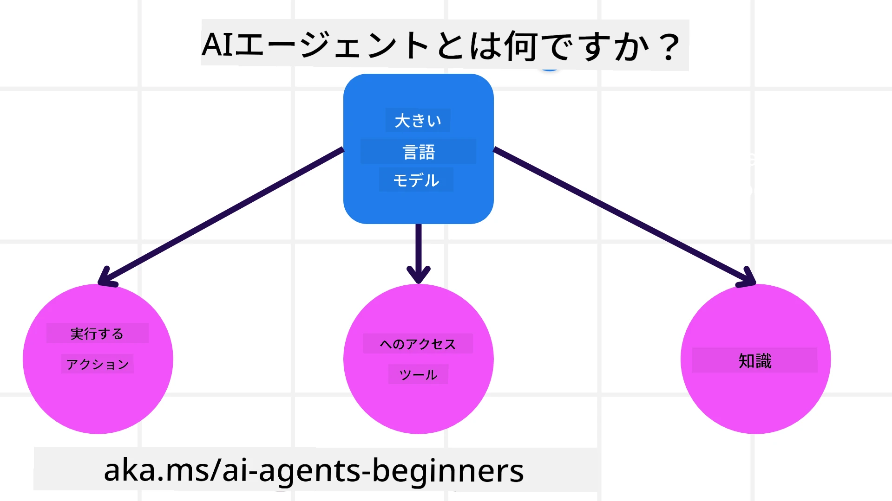
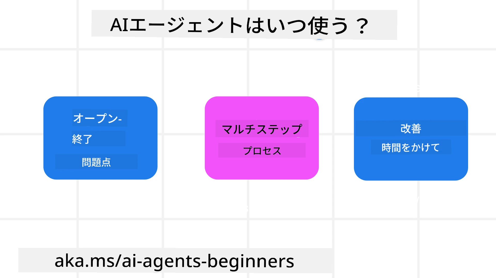

> _(上の画像をクリックするとこのレッスンの動画が表示されます)_

# AIエージェントとユースケース入門

Welcome to the "AI Agents for Beginners" course! このコースは、AIエージェントを構築するための基礎知識と応用サンプルを提供します。

Join the <a href="https://discord.gg/kzRShWzttr" target="_blank">Azure AI Discord コミュニティ</a> に参加して、他の学習者やAIエージェントの開発者と交流し、このコースに関する質問をしてください。

このコースを始めるにあたり、まずAIエージェントとは何か、そしてそれらをどのようにアプリケーションやワークフローで活用できるかをより深く理解します。

## はじめに

This lesson covers:

- AIエージェントとは何か、そしてエージェントの種類
- AIエージェントが最も適しているユースケースと、それらがどのように役立つか
- エージェント型ソリューションを設計する際の基本的な構成要素

## 学習目標
After completing this lesson, you should be able to:

- AIエージェントの概念と、他のAIソリューションとの違いを理解する。
- AIエージェントを最適に適用する。
- ユーザーと顧客の両方にとって生産的なエージェント型ソリューションを設計する。

## AIエージェントの定義とエージェントの種類

### AIエージェントとは何か？

AIエージェントは**システム**であり、**大規模言語モデル(LLMs)** に**ツールへのアクセス**や**知識**を与えて能力を拡張し、**行動を実行**できるようにするものです。

この定義をいくつかの要素に分解して説明します:

- **システム** - エージェントを単一のコンポーネントと見なすのではなく、複数のコンポーネントからなるシステムとして考えることが重要です。基本的なレベルで、AIエージェントの構成要素は次のとおりです:
  - **環境** - AIエージェントが動作する定義された領域。例えば、旅行予約AIエージェントであれば、環境はそのエージェントがタスクを完了するために使用する旅行予約システムである可能性があります。
  - **センサー** - 環境には情報がありフィードバックを提供します。AIエージェントはセンサーを使用して環境の現在の状態に関する情報を収集・解釈します。旅行予約エージェントの例では、予約システムはホテルの空室状況やフライト価格などの情報を提供できます。
  - **アクチュエーター** - AIエージェントが環境の現在の状態を受け取ると、現在のタスクに対して環境を変化させるためにどのアクションを実行するかを決定します。旅行予約エージェントの場合、ユーザーのために利用可能な部屋を予約することがアクションとなるかもしれません。

**大規模言語モデル** - エージェントの概念はLLMが登場する前から存在していました。LLMを用いてAIエージェントを構築する利点は、人間の言語やデータを解釈する能力にあります。この能力により、LLMは環境情報を解釈して、環境を変化させるための計画を定義できます。

**行動を実行** - AIエージェントシステムの外では、LLMはユーザーのプロンプトに基づいてコンテンツや情報を生成することに限定されます。AIエージェントシステム内では、LLMはユーザーの要求を解釈し、環境内で利用可能なツールを使用してタスクを達成できます。

**ツールへのアクセス** - LLMがアクセスできるツールは、1) それが動作する環境と 2) AIエージェントの開発者によって定義されます。旅行エージェントの例では、エージェントのツールは予約システムで利用可能な操作によって制限されるか、開発者がエージェントのツールアクセスをフライトに限定することもできます。

**メモリ＋知識** - メモリはユーザーとエージェント間の会話の文脈で短期的であることがあります。長期的には、環境が提供する情報の外で、AIエージェントは他のシステム、サービス、ツール、さらには他のエージェントから知識を取得することができます。旅行エージェントの例では、この知識は顧客データベースにあるユーザーの旅行の嗜好情報である可能性があります。

### エージェントの種類

Now that we have a general definition of AI Agents, let us look at some specific agent types and how they would be applied to a travel booking AI agent.

| **エージェントの種類**                | **説明**                                                                                                                       | **例**                                                                                                                                                                                                                   |
| ----------------------------- | ------------------------------------------------------------------------------------------------------------------------------------- | ----------------------------------------------------------------------------------------------------------------------------------------------------------------------------------------------------------------------------- |
| **単純反射エージェント (Simple Reflex Agents)**      | 事前定義されたルールに基づいて即時にアクションを実行します。                                                                                  | 旅行エージェントがメールの文脈を解釈し、旅行に関する苦情をカスタマーサービスに転送する。                                                                                                                          |
| **モデルベース反射エージェント (Model-Based Reflex Agents)** | 世界のモデルとそのモデルに対する変化に基づいてアクションを実行します。                                                              | 旅行エージェントが過去の価格データにアクセスして、価格変動が大きいルートを優先する。                                                                                                             |
| **目標志向エージェント (Goal-Based Agents)**         | 目標を解釈し、その目標を達成するための行動を決定して計画を作成します。                                  | 旅行エージェントが現在地から目的地までの必要な移動手段（車、公共交通機関、フライト）を決定して旅程を予約する。                                                                                |
| **効用ベースエージェント (Utility-Based Agents)**      | 好みを考慮し、トレードオフを数値的に比較して目標を達成する方法を決定します。                                               | 旅行エージェントが利便性とコストを比較して旅行を予約することで効用を最大化する。                                                                                                                                          |
| **学習エージェント (Learning Agents)**           | フィードバックに応じて時間とともに改善し、行動を調整します。                                                        | 旅行エージェントが旅行後のアンケートなどの顧客フィードバックを用いて、将来の予約を改善する。                                                                                                               |
| **階層型エージェント (Hierarchical Agents)**       | 複数のエージェントを階層的に配置し、上位エージェントがタスクを下位エージェントのサブタスクに分割します。 | 旅行エージェントが旅行をキャンセルするタスクを特定の予約のキャンセルなどのサブタスクに分割し、下位エージェントがそれらを完了して上位エージェントに報告する。                                     |
| **マルチエージェントシステム (Multi-Agent Systems (MAS))** | エージェントが独立して、協力的または競合的にタスクを完了します。                                                           | 協力的: 複数のエージェントがホテル、フライト、エンターテイメントといった特定の旅行サービスを予約する。競合的: 複数のエージェントが共有のホテル予約カレンダーで顧客の宿泊を競って管理する。 |

## AIエージェントをいつ使うか

In the earlier section, we used the Travel Agent use-case to explain how the different types of agents can be used in different scenarios of travel booking. We will continue to use this application throughout the course.

Let's look at the types of use cases that AI Agents are best used for:

- **オープンエンドな問題** - 必要な手順をLLMに判断させることで、ワークフローに常にハードコードできない問題に対応できます。
- **複数ステップのプロセス** - AIエージェントが単一の取得ではなくツールや情報を複数ターンにわたって使用する必要があるような複雑さを持つタスク。
- **時間とともに改善するタスク** - エージェントが環境やユーザーからのフィードバックを受け取り、より良い効用を提供するために時間とともに改善できるタスク。

詳しい検討事項については、「Building Trustworthy AI Agents」レッスンで扱います。

## エージェント型ソリューションの基本

### エージェント開発

AIエージェントシステムを設計する最初のステップは、ツール、アクション、および振る舞いを定義することです。本コースでは、エージェントを定義するために**Azure AI Agent Service**を使用することに焦点を当てます。これには次のような機能があります:

- OpenAI、Mistral、Llamaなどのオープンモデルの選択
- Tripadvisorなどのプロバイダーを通じたライセンス済みデータの使用
- 標準化されたOpenAPI 3.0ツールの使用

### エージェントパターン

LLMとの通信はプロンプトを通じて行われます。AIエージェントは半自律的であるため、環境の変化後に常に手動で再プロンプトすることが可能でも必要でもありません。私たちは、複数のステップにわたってよりスケーラブルにLLMにプロンプトを与えることを可能にする**エージェントパターン**を使用します。

本コースは、現在人気のあるいくつかのエージェントパターンに分かれています。

### エージェントフレームワーク

エージェントフレームワークは、開発者がコードを通じてエージェントパターンを実装できるようにします。これらのフレームワークは、テンプレート、プラグイン、より良いAIエージェント協調のためのツールを提供します。これらの利点により、AIエージェントシステムの可観測性やトラブルシューティングが向上します。

本コースでは、実運用向けのAIエージェント構築のためにMicrosoft Agent Framework (MAF) を検討します。

## サンプルコード

- Python: [エージェントフレームワーク](./code_samples/01-python-agent-framework.ipynb)
- .NET: [Agent Framework](./code_samples/01-dotnet-agent-framework.md)

## AIエージェントについてもっと質問がありますか？

Join the [Microsoft Foundry Discord](https://aka.ms/ai-agents/discord) に参加して、他の学習者と交流したり、オフィスアワーに参加したりして、AIエージェントに関する質問を解決してください。

## 前のレッスン

[Course Setup](../00-course-setup/README.md)

## 次のレッスン

[エージェントフレームワークの探求](../02-explore-agentic-frameworks/README.md)

---

<!-- CO-OP TRANSLATOR DISCLAIMER START -->
免責事項：
本書はAI翻訳サービス「Co-op Translator」（https://github.com/Azure/co-op-translator）を用いて翻訳されました。正確性には努めていますが、自動翻訳には誤りや不正確な表現が含まれる場合があります。原文（原言語の文書）を正式な情報源としてご参照ください。重要な情報については、専門の翻訳者による人による翻訳を推奨します。この翻訳の使用に起因するいかなる誤解や誤訳についても責任を負いかねます。
<!-- CO-OP TRANSLATOR DISCLAIMER END -->