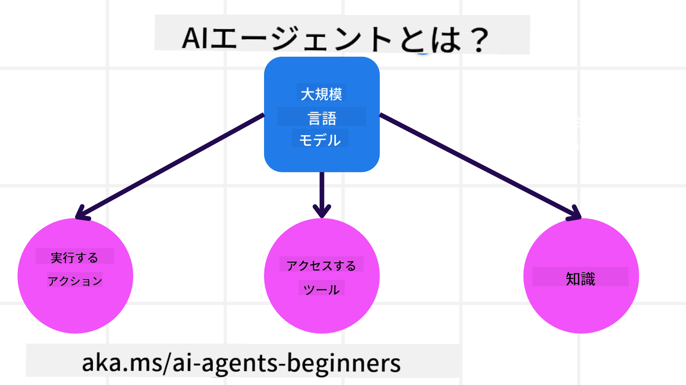
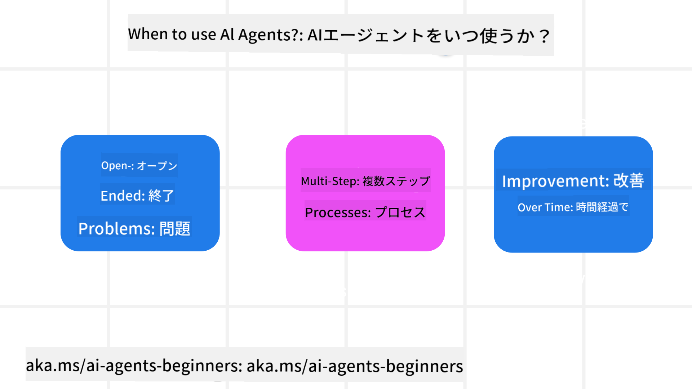

<!--
CO_OP_TRANSLATOR_METADATA:
{
  "original_hash": "1e40fe956ff79462a02a17080b125041",
  "translation_date": "2025-08-30T07:42:25+00:00",
  "source_file": "01-intro-to-ai-agents/README.md",
  "language_code": "ja"
}
-->

> _(上の画像をクリックすると、このレッスンの動画をご覧いただけます)_

# AIエージェントとそのユースケースの紹介

「初心者向けAIエージェント」コースへようこそ！このコースでは、AIエージェントを構築するための基本的な知識と実践的なサンプルを提供します。

このコースに参加して、他の学習者やAIエージェント開発者と交流し、このコースに関する質問を自由にしてください。

このコースを始めるにあたり、まずAIエージェントとは何か、そしてそれをどのようにアプリケーションやワークフローに活用できるのかを理解していきましょう。

## はじめに

このレッスンでは以下を学びます：

- AIエージェントとは何か、またその種類は？
- AIエージェントに最適なユースケースとその利点は？
- エージェントソリューションを設計する際の基本的な構成要素とは？

## 学習目標
このレッスンを終えた後には、以下ができるようになります：

- AIエージェントの概念を理解し、他のAIソリューションとの違いを把握する。
- AIエージェントを効率的に活用する。
- ユーザーや顧客にとって生産的なエージェントソリューションを設計する。

## AIエージェントの定義と種類

### AIエージェントとは？

AIエージェントとは、**大規模言語モデル（LLM）**に**ツールや知識へのアクセス**を与えることで、その能力を拡張し、**アクションを実行**できるようにする**システム**です。

この定義を細かく分解してみましょう：

- **システム** - エージェントは単一のコンポーネントではなく、多くのコンポーネントからなるシステムとして考える必要があります。AIエージェントの基本的な構成要素は以下の通りです：
  - **環境** - AIエージェントが動作する定義された空間。例えば、旅行予約AIエージェントの場合、環境はタスクを完了するためにエージェントが使用する旅行予約システムです。
  - **センサー** - 環境には情報があり、フィードバックを提供します。AIエージェントはセンサーを使用して、環境の現在の状態に関する情報を収集し解釈します。旅行予約エージェントの例では、ホテルの空室状況や航空券の価格などの情報を提供する旅行予約システムがセンサーに該当します。
  - **アクチュエーター** - AIエージェントが環境の現在の状態を受け取った後、タスクに応じて環境を変えるためのアクションを決定します。旅行予約エージェントの場合、ユーザーのために空室を予約することがアクションに該当します。

**大規模言語モデル（LLM）** - エージェントの概念はLLMが登場する以前から存在していました。LLMを使用してAIエージェントを構築する利点は、人間の言語やデータを解釈する能力にあります。この能力により、LLMは環境情報を解釈し、環境を変えるための計画を立てることができます。

**アクションを実行する** - AIエージェントシステムの外では、LLMはユーザーのプロンプトに基づいてコンテンツや情報を生成する状況に限定されます。しかし、AIエージェントシステム内では、LLMはユーザーのリクエストを解釈し、環境内で利用可能なツールを使用してタスクを達成することができます。

**ツールへのアクセス** - LLMがアクセスできるツールは、1) エージェントが動作する環境、2) AIエージェントの開発者によって定義されます。旅行エージェントの例では、エージェントのツールは予約システムで利用可能な操作によって制限されるか、開発者がエージェントのツールアクセスをフライトに限定することもできます。

**記憶+知識** - 記憶は、ユーザーとエージェントの会話の文脈において短期的なものです。長期的には、環境から提供される情報の外でも、AIエージェントは他のシステム、サービス、ツール、さらには他のエージェントから知識を取得することができます。旅行エージェントの例では、この知識は顧客データベースに保存されているユーザーの旅行の好みに関する情報である可能性があります。

### エージェントの種類

AIエージェントの一般的な定義を理解したところで、具体的なエージェントの種類と、それらが旅行予約AIエージェントにどのように適用されるかを見てみましょう。

| **エージェントの種類**         | **説明**                                                                                                                       | **例**                                                                                                                                                                                                                   |
| ----------------------------- | -------------------------------------------------------------------------------------------------------------------------------- | ----------------------------------------------------------------------------------------------------------------------------------------------------------------------------------------------------------------------------- |
| **単純反射型エージェント**      | 事前定義されたルールに基づいて即座にアクションを実行します。                                                                                  | 旅行エージェントがメールの文脈を解釈し、旅行に関する苦情をカスタマーサービスに転送します。                                                                                                                          |
| **モデルベース反射型エージェント** | 世界のモデルとそのモデルの変化に基づいてアクションを実行します。                                                                                  | 旅行エージェントが過去の価格データへのアクセスに基づいて、価格変動が大きいルートを優先します。                                                                                                             |
| **目標指向型エージェント**         | 特定の目標を達成するための計画を作成し、目標を解釈してそれを達成するためのアクションを決定します。                                                  | 旅行エージェントが現在地から目的地までの必要な移動手段（車、公共交通機関、フライト）を決定して旅程を予約します。                                                                                |
| **効用指向型エージェント**         | 優先順位を考慮し、数値的にトレードオフを評価して目標を達成する方法を決定します。                                                               | 旅行エージェントが利便性とコストを比較して、旅行を予約する際の効用を最大化します。                                                                                                                                          |
| **学習型エージェント**           | フィードバックに応じてアクションを調整し、時間とともに改善します。                                                                                  | 旅行エージェントが旅行後のアンケートからの顧客フィードバックを使用して、将来の予約を改善します。                                                                                                               |
| **階層型エージェント**           | 複数のエージェントが階層的に構成されており、上位エージェントがタスクをサブタスクに分割し、下位エージェントがそれを完了します。                              | 旅行エージェントが旅行をキャンセルする際、タスクをサブタスク（例：特定の予約のキャンセル）に分割し、下位エージェントがそれを完了し、上位エージェントに報告します。                                     |
| **マルチエージェントシステム (MAS)** | エージェントが協力的または競争的に独立してタスクを完了します。                                                                                   | 協力的: 複数のエージェントがホテル、フライト、エンターテイメントなどの特定の旅行サービスを予約します。競争的: 複数のエージェントが共有のホテル予約カレンダーを管理し、顧客の予約を競い合います。 |

## AIエージェントを使用するタイミング

前のセクションでは、旅行エージェントのユースケースを使用して、さまざまな種類のエージェントが旅行予約のさまざまなシナリオでどのように使用されるかを説明しました。このコース全体を通じて、このアプリケーションを引き続き使用します。

次に、AIエージェントが最適に使用されるユースケースの種類を見てみましょう：

- **オープンエンドな問題** - タスクを完了するために必要なステップをLLMが決定する必要がある場合。これらのステップは常にワークフローにハードコードできるわけではありません。
- **マルチステッププロセス** - 単一の情報取得ではなく、複数のターンにわたってツールや情報を使用する必要がある複雑なタスク。
- **時間とともに改善** - 環境やユーザーからのフィードバックを受け取り、より良い効用を提供するためにエージェントが改善できるタスク。

AIエージェントの使用に関するさらなる考慮事項については、「信頼できるAIエージェントの構築」レッスンで詳しく説明します。

## エージェントソリューションの基本

### エージェント開発

AIエージェントシステムを設計する最初のステップは、ツール、アクション、行動を定義することです。このコースでは、エージェントを定義するために**Azure AI Agent Service**を使用することに焦点を当てます。このサービスは以下の機能を提供します：

- OpenAI、Mistral、Llamaなどのオープンモデルの選択
- Tripadvisorなどのプロバイダーを通じたライセンスデータの使用
- 標準化されたOpenAPI 3.0ツールの使用

### エージェントパターン

LLMとの通信はプロンプトを通じて行われます。AIエージェントの半自律的な性質を考えると、環境の変化後に手動でLLMを再プロンプトすることが常に可能または必要ではありません。**エージェントパターン**を使用することで、複数のステップにわたってLLMをよりスケーラブルにプロンプトすることができます。

このコースでは、現在人気のあるエージェントパターンのいくつかを取り上げます。

### エージェントフレームワーク

エージェントフレームワークは、コードを通じてエージェントパターンを実装するためのものです。これらのフレームワークは、テンプレート、プラグイン、ツールを提供し、AIエージェントのコラボレーションを向上させます。これにより、AIエージェントシステムの観測性やトラブルシューティングの能力が向上します。

このコースでは、研究主導のAutoGenフレームワークと、Semantic Kernelの実運用向けエージェントフレームワークを探ります。

### AIエージェントに関する質問はありますか？

[Azure AI Foundry Discord](https://aka.ms/ai-agents/discord)に参加して、他の学習者と交流したり、オフィスアワーに参加したり、AIエージェントに関する質問に答えてもらいましょう。

## 前のレッスン

[コースセットアップ](../00-course-setup/README.md)

## 次のレッスン

[エージェントフレームワークの探求](../02-explore-agentic-frameworks/README.md)

---

**免責事項**:  
この文書は、AI翻訳サービス [Co-op Translator](https://github.com/Azure/co-op-translator) を使用して翻訳されています。正確性を期すよう努めておりますが、自動翻訳には誤りや不正確な表現が含まれる可能性があります。原文（元の言語で記載された文書）が信頼できる情報源と見なされるべきです。重要な情報については、専門の人間による翻訳を推奨します。この翻訳の使用に起因する誤解や誤訳について、当社は一切の責任を負いません。