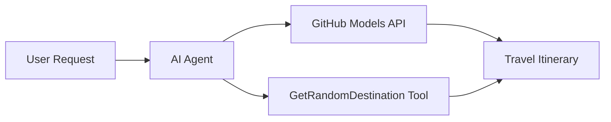

<!--
CO_OP_TRANSLATOR_METADATA:
{
  "original_hash": "23afd9be7b6ba5b69a44c3b6a78e07f6",
  "translation_date": "2025-11-06T10:02:28+00:00",
  "source_file": "01-intro-to-ai-agents/code_samples/01-dotnet-agent-framework.md",
  "language_code": "ja"
}
-->
# 🌍 Microsoft Agent Framework (.NET) を使ったAI旅行代理店

## 📋 シナリオ概要

このノートブックでは、Microsoft Agent Framework for .NETを使用して、知的な旅行計画エージェントを構築する方法を紹介します。このエージェントは、世界中のランダムな目的地に対して、個別にカスタマイズされた日帰り旅行の旅程を自動生成することができます。

**主な機能:**
- 🎲 **ランダムな目的地選択**: カスタムツールを使用して旅行先を選択
- 🗺️ **知的な旅行計画**: 詳細な日ごとの旅程を作成
- 🔄 **リアルタイムストリーミング**: 即時応答とストリーミング応答の両方をサポート
- 🛠️ **カスタムツール統合**: エージェントの機能拡張方法を示す

## 🔧 技術アーキテクチャ

### コア技術
- **Microsoft Agent Framework**: AIエージェント開発のための最新の.NET実装
- **GitHub Models Integration**: GitHubのAIモデル推論サービスを使用
- **OpenAI API Compatibility**: カスタムエンドポイントを備えたOpenAIクライアントライブラリを活用
- **セキュアな設定**: 環境ベースのAPIキー管理

### 主なコンポーネント
1. **AIAgent**: 会話の流れを管理する主要なエージェントオーケストレーター
2. **カスタムツール**: エージェントが利用可能な`GetRandomDestination()`関数
3. **チャットクライアント**: GitHub Modelsをバックエンドにした会話インターフェース
4. **ストリーミングサポート**: リアルタイム応答生成機能

### 統合パターン


## 🚀 はじめに

**前提条件:**
- .NET 10.0以上
- GitHub Models APIアクセストークン
- `.env`ファイルに設定された環境変数

**必要な環境変数:**
```env
GITHUB_TOKEN=your_github_token
GITHUB_ENDPOINT=https://models.inference.ai.azure.com
GITHUB_MODEL_ID=gpt-4o-mini
```

以下のコードサンプルを順番に実行して、旅行エージェントの動作を確認してください！

---

## .NET単一ファイルアプリ: AI旅行代理店の例

完全な実行可能コードサンプルは`01-dotnet-agent-framework.cs`をご覧ください。

```bash
dotnet run 01-dotnet-agent-framework.cs
```

### サンプルコード

```csharp
static string GetRandomDestination()
{
    var destinations = new List<string>
    {
        "Paris, France",
        "Tokyo, Japan",
        "New York City, USA",
        "Sydney, Australia",
        "Rome, Italy",
        "Barcelona, Spain",
        "Cape Town, South Africa",
        "Rio de Janeiro, Brazil",
        "Bangkok, Thailand",
        "Vancouver, Canada"
    };
    var random = new Random();
    int index = random.Next(destinations.Count);
    return destinations[index];
}

// Extract configuration from environment variables
var github_endpoint = Environment.GetEnvironmentVariable("GITHUB_ENDPOINT") ?? throw new InvalidOperationException("GITHUB_ENDPOINT is not set.");
var github_model_id = Environment.GetEnvironmentVariable("GITHUB_MODEL_ID") ?? "gpt-4o-mini";
var github_token = Environment.GetEnvironmentVariable("GITHUB_TOKEN") ?? throw new InvalidOperationException("GITHUB_TOKEN is not set.");

// Configure OpenAI Client Options
var openAIOptions = new OpenAIClientOptions()
{
    Endpoint = new Uri(github_endpoint)
};

// Initialize OpenAI Client with GitHub Models Configuration
var openAIClient = new OpenAIClient(new ApiKeyCredential(github_token), openAIOptions);

// Create AI Agent with Travel Planning Capabilities
AIAgent agent = openAIClient
    .GetChatClient(github_model_id)
    .CreateAIAgent(
        instructions: "You are a helpful AI Agent that can help plan vacations for customers at random destinations",
        tools: [AIFunctionFactory.Create(GetRandomDestination)]
    );

// Execute Agent: Plan a Day Trip (Non-Streaming)
Console.WriteLine(await agent.RunAsync("Plan me a day trip"));

// Execute Agent: Plan a Day Trip (Streaming Response)
await foreach (var update in agent.RunStreamingAsync("Plan me a day trip"))
{
    Console.Write(update);
}
```

---

**免責事項**:  
この文書はAI翻訳サービス[Co-op Translator](https://github.com/Azure/co-op-translator)を使用して翻訳されています。正確性を追求しておりますが、自動翻訳には誤りや不正確な部分が含まれる可能性があります。元の言語で記載された文書を正式な情報源としてください。重要な情報については、専門の人間による翻訳を推奨します。この翻訳の使用に起因する誤解や誤解について、当社は責任を負いません。