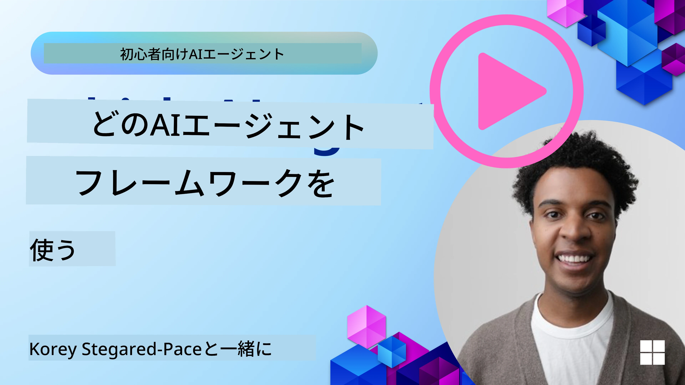

[](https://youtu.be/ODwF-EZo_O8?si=1xoy_B9RNQfrYdF7)

> _(上の画像をクリックしてこのレッスンのビデオを視聴してください)_

# AIエージェントフレームワークを探る

AIエージェントフレームワークは、AIエージェントの作成、デプロイ、および管理を簡素化するために設計されたソフトウェアプラットフォームです。これらのフレームワークは、開発者に対して複雑なAIシステムの開発を効率化するための事前構築コンポーネント、抽象化、およびツールを提供します。

これらのフレームワークは、AIエージェント開発における共通の課題に対して標準化されたアプローチを提供することで、開発者がアプリケーションの固有の側面に集中できるように支援します。スケーラビリティ、アクセシビリティ、および効率性を向上させます。

## はじめに 

このレッスンで扱う内容：

- AIエージェントフレームワークとは何か、開発者が何を達成できるようになるか？
- チームはこれらをどのように使って、エージェントの機能を迅速にプロトタイプ、反復、改善できるか？
- Microsoft によって作られたフレームワークとツール（<a href="https://aka.ms/ai-agents-beginners/ai-agent-service" target="_blank">Azure AI Agent Service</a> と <a href="https://learn.microsoft.com/azure/ai-services/openai/how-to/responses" target="_blank">Microsoft Agent Framework</a>）の違いは何か？
- 既存の Azure エコシステムのツールを直接統合できますか、それともスタンドアロンのソリューションが必要ですか？
- Azure AI Agent Serviceとは何か、どのように役立つのか？

## 学習目標

このレッスンの目的は、以下を理解することです：

- AI開発におけるAIエージェントフレームワークの役割。
- AIエージェントを構築するためにAIエージェントフレームワークを活用する方法。
- AIエージェントフレームワークによって実現される主要な機能。
- Microsoft Agent Framework と Azure AI Agent Service の違い。

## AIエージェントフレームワークとは何か、開発者は何をできるようになるか？

従来のAIフレームワークは、アプリにAIを統合し、次のような方法でアプリを改善するのに役立ちます：

- **パーソナライズ**: AIはユーザーの行動や好みを分析して、パーソナライズされた推奨、コンテンツ、および体験を提供できます。
例: Netflix のようなストリーミングサービスは、視聴履歴に基づいて映画や番組を提案し、ユーザーのエンゲージメントと満足度を高めます。
- **自動化と効率化**: AIは反復的なタスクを自動化し、ワークフローを合理化し、運用効率を改善できます。
例: カスタマーサービスアプリは、AI搭載チャットボットを使用して一般的な問い合わせに対応し、応答時間を短縮し、複雑な問題には人間の担当者を割り当てます。
- **ユーザー体験の向上**: AIは音声認識、自然言語処理、予測入力などのインテリジェントな機能を提供することで、ユーザー体験を向上させることができます。
例: Siri や Google Assistant のような仮想アシスタントは、音声コマンドを理解して応答するためにAIを使用し、デバイスとのやり取りを容易にします。

### 素晴らしいですね、ではなぜAIエージェントフレームワークが必要なのでしょうか？

AIエージェントフレームワークは、単なるAIフレームワーク以上のものを表します。これらは、ユーザー、他のエージェント、環境とやり取りして特定の目標を達成できるインテリジェントなエージェントの作成を可能にするように設計されています。これらのエージェントは自律的な振る舞いを示し、意思決定を行い、変化する条件に適応することができます。AIエージェントフレームワークによって可能になる主な機能をいくつか見てみましょう：

- **エージェントの協働と調整**: 複数のAIエージェントを作成し、協力し、通信し、複雑なタスクを解決するために調整することを可能にします。
- **タスクの自動化と管理**: マルチステップのワークフローの自動化、タスクの委任、およびエージェント間の動的なタスク管理の仕組みを提供します。
- **コンテキストの理解と適応**: エージェントにコンテキストを理解し、変化する環境に適応し、リアルタイム情報に基づいて意思決定を行う能力を持たせます。

要約すると、エージェントを使うことでより多くのことが可能になり、自動化を次のレベルへ引き上げ、環境から適応・学習できるよりインテリジェントなシステムを作成できます。

## エージェントの機能を迅速にプロトタイプ化、反復、改善するには？

この分野は急速に進化していますが、ほとんどのAIエージェントフレームワークに共通するいくつかのポイントがあり、それらはモジュールコンポーネント、協働ツール、およびリアルタイム学習です。これらを詳しく見ていきましょう：

- **モジュール化コンポーネントを使用する**: AI SDK は、AIおよびメモリコネクタ、自然言語またはコードプラグインを使った関数呼び出し、プロンプトテンプレートなどの事前構築コンポーネントを提供します。
- **協働ツールを活用する**: 役割とタスクを持つエージェントを設計し、協働ワークフローをテストして改善できます。
- **リアルタイムで学習する**: エージェントが相互作用から学習し、その振る舞いを動的に調整するフィードバックループを実装します。

### モジュール化コンポーネントを使用する

Microsoft Agent Framework のような SDK は、AI コネクタ、ツール定義、エージェント管理などの事前構築コンポーネントを提供します。

**チームがこれをどのように活用できるか**: チームはこれらのコンポーネントを素早く組み合わせて機能的なプロトタイプを作成でき、ゼロから構築する必要がなく、迅速な実験と反復が可能になります。

**実際の動作**: 事前構築されたパーサーを使用してユーザー入力から情報を抽出し、データを保存・取得するメモリモジュールや、ユーザーと対話するためのプロンプトジェネレータを利用できます。これらを一から構築する必要はありません。

**例となるコード**. `AzureAIProjectAgentProvider` を使用して Microsoft Agent Framework を使い、モデルがツール呼び出しでユーザー入力に応答する方法の例を見てみましょう:

``` python
# Microsoft Agent Framework Pythonの例

import asyncio
import os
from typing import Annotated

from agent_framework.azure import AzureAIProjectAgentProvider
from azure.identity import AzureCliCredential


# 旅行予約のためのサンプルツール関数を定義する
def book_flight(date: str, location: str) -> str:
    """Book travel given location and date."""
    return f"Travel was booked to {location} on {date}"


async def main():
    provider = AzureAIProjectAgentProvider(credential=AzureCliCredential())
    agent = await provider.create_agent(
        name="travel_agent",
        instructions="Help the user book travel. Use the book_flight tool when ready.",
        tools=[book_flight],
    )

    response = await agent.run("I'd like to go to New York on January 1, 2025")
    print(response)
    # 出力例: 2025年1月1日のニューヨーク行きのフライトは正常に予約されました。良い旅を！✈️🗽


if __name__ == "__main__":
    asyncio.run(main())
```

この例からわかるのは、事前構築されたパーサーを活用して、フライト予約リクエストの出発地、目的地、日付などの主要情報をユーザー入力から抽出できることです。このモジュール式アプローチにより、高レベルのロジックに集中できます。

### 協働ツールを活用する

Microsoft Agent Framework のようなフレームワークは、協力して動作できる複数のエージェントの作成を容易にします。

**チームがこれをどのように活用できるか**: チームは特定の役割とタスクを持つエージェントを設計し、協働ワークフローをテストして洗練させ、システム全体の効率を向上させることができます。

**実際の動作**: データ取得、分析、意思決定など、それぞれ専門機能を持つエージェントのチームを作成できます。これらのエージェントは通信と情報共有を行い、ユーザーの問い合わせに答えたり、タスクを遂行したりするために協調します。

**例となるコード (Microsoft Agent Framework)**:

```python
# Microsoft Agent Frameworkを使用して協力して動作する複数のエージェントを作成する

import os
from agent_framework.azure import AzureAIProjectAgentProvider
from azure.identity import AzureCliCredential

provider = AzureAIProjectAgentProvider(credential=AzureCliCredential())

# データ取得エージェント
agent_retrieve = await provider.create_agent(
    name="dataretrieval",
    instructions="Retrieve relevant data using available tools.",
    tools=[retrieve_tool],
)

# データ分析エージェント
agent_analyze = await provider.create_agent(
    name="dataanalysis",
    instructions="Analyze the retrieved data and provide insights.",
    tools=[analyze_tool],
)

# タスク上でエージェントを順番に実行する
retrieval_result = await agent_retrieve.run("Retrieve sales data for Q4")
analysis_result = await agent_analyze.run(f"Analyze this data: {retrieval_result}")
print(analysis_result)
```

前述のコードで示されているのは、複数のエージェントが協力してデータを分析するタスクを作成する方法です。各エージェントは特定の機能を実行し、目的の結果を達成するためにエージェントを調整してタスクが実行されます。専門化された役割を持つ専用エージェントを作成することで、タスクの効率とパフォーマンスを向上させることができます。

### リアルタイムで学習する

高度なフレームワークは、リアルタイムのコンテキスト理解と適応の機能を提供します。

**チームがこれをどのように活用できるか**: チームは、エージェントが相互作用から学習し、その振る舞いを動的に調整するフィードバックループを実装できます。これにより、機能の継続的改善と洗練が可能になります。

**実際の動作**: エージェントはユーザーのフィードバック、環境データ、タスクの結果を分析して知識ベースを更新し、意思決定アルゴリズムを調整し、時間の経過とともにパフォーマンスを向上させます。この反復的な学習プロセスにより、エージェントは変化する状況やユーザーの好みに適応し、システム全体の有効性を高めます。

## Microsoft Agent Framework と Azure AI Agent Service の違いは何ですか？

比較の方法はいくつかありますが、設計、機能、および対象となるユースケースの点での主な違いを見てみましょう：

## Microsoft Agent Framework (MAF)

Microsoft Agent Framework は、`AzureAIProjectAgentProvider` を使用して AI エージェントを構築するための効率化された SDK を提供します。これにより、組み込みのツール呼び出し、会話管理、および Azure ID を通じたエンタープライズグレードのセキュリティを備えた Azure OpenAI モデルを活用するエージェントを作成できます。

**ユースケース**: ツール利用、マルチステップワークフロー、およびエンタープライズ統合シナリオを持つ本番環境向けのAIエージェント構築。

Microsoft Agent Framework の重要なコア概念は次のとおりです：

- **Agents（エージェント）**. エージェントは `AzureAIProjectAgentProvider` を介して作成され、名前、指示、ツールで構成されます。エージェントは:
  - **ユーザーメッセージを処理**し、Azure OpenAI モデルを使用して応答を生成します。
  - **会話のコンテキストに応じてツールを呼び出す**ことができます。
  - **複数のやり取りにわたって会話状態を維持**します。

  エージェントを作成する方法を示すコードスニペット：

    ```python
    import os
    from agent_framework.azure import AzureAIProjectAgentProvider
    from azure.identity import AzureCliCredential

    provider = AzureAIProjectAgentProvider(credential=AzureCliCredential())
    agent = await provider.create_agent(
        name="my_agent",
        instructions="You are a helpful assistant.",
    )

    response = await agent.run("Hello, World!")
    print(response)
    ```

- **Tools（ツール）**. フレームワークは、エージェントが自動的に呼び出せる Python 関数としてツールを定義することをサポートします。ツールはエージェント作成時に登録されます：

    ```python
    def get_weather(location: str) -> str:
        """Get the current weather for a location."""
        return f"The weather in {location} is sunny, 72\u00b0F."

    agent = await provider.create_agent(
        name="weather_agent",
        instructions="Help users check the weather.",
        tools=[get_weather],
    )
    ```

- **マルチエージェント調整**. 異なる専門化を持つ複数のエージェントを作成し、それらの作業を調整できます：

    ```python
    planner = await provider.create_agent(
        name="planner",
        instructions="Break down complex tasks into steps.",
    )

    executor = await provider.create_agent(
        name="executor",
        instructions="Execute the planned steps using available tools.",
        tools=[execute_tool],
    )

    plan = await planner.run("Plan a trip to Paris")
    result = await executor.run(f"Execute this plan: {plan}")
    ```

- **Azure Identity 統合**. フレームワークは安全なキー不要認証のために `AzureCliCredential`（または `DefaultAzureCredential`）を使用し、APIキーを直接管理する必要を排除します。

## Azure AI Agent Service

Azure AI Agent Service は、Microsoft Ignite 2024 で導入された比較的新しい追加サービスです。Llama 3、Mistral、Cohere のようなオープンソース LLM を直接呼び出すなど、より柔軟なモデルを使用したエージェントの開発とデプロイを可能にします。

Azure AI Agent Service は強力なエンタープライズ向けのセキュリティ機構とデータ保存方法を提供し、エンタープライズアプリケーションに適しています。

Microsoft Agent Framework と連携して、エージェントの構築とデプロイを容易に行えます。

このサービスは現在パブリック プレビュー中で、エージェント構築には Python と C# をサポートしています。

Azure AI Agent Service の Python SDK を使用すると、ユーザー定義のツールを持つエージェントを作成できます：

```python
import asyncio
from azure.identity import DefaultAzureCredential
from azure.ai.projects import AIProjectClient

# ツール関数を定義する
def get_specials() -> str:
    """Provides a list of specials from the menu."""
    return """
    Special Soup: Clam Chowder
    Special Salad: Cobb Salad
    Special Drink: Chai Tea
    """

def get_item_price(menu_item: str) -> str:
    """Provides the price of the requested menu item."""
    return "$9.99"


async def main() -> None:
    credential = DefaultAzureCredential()
    project_client = AIProjectClient.from_connection_string(
        credential=credential,
        conn_str="your-connection-string",
    )

    agent = project_client.agents.create_agent(
        model="gpt-4o-mini",
        name="Host",
        instructions="Answer questions about the menu.",
        tools=[get_specials, get_item_price],
    )

    thread = project_client.agents.create_thread()

    user_inputs = [
        "Hello",
        "What is the special soup?",
        "How much does that cost?",
        "Thank you",
    ]

    for user_input in user_inputs:
        print(f"# User: '{user_input}'")
        message = project_client.agents.create_message(
            thread_id=thread.id,
            role="user",
            content=user_input,
        )
        run = project_client.agents.create_and_process_run(
            thread_id=thread.id, agent_id=agent.id
        )
        messages = project_client.agents.list_messages(thread_id=thread.id)
        print(f"# Agent: {messages.data[0].content[0].text.value}")


if __name__ == "__main__":
    asyncio.run(main())
```

### コアコンセプト

Azure AI Agent Service には次のようなコアコンセプトがあります：

- **Agent（エージェント）**. Azure AI Agent Service は Microsoft Foundry と統合されます。AI Foundry 内では、AI エージェントは質問応答（RAG）、アクション実行、完全なワークフロー自動化に使用できる「スマート」マイクロサービスとして機能します。これは、生成AIモデルの力を、実世界のデータソースにアクセスしてやり取りできるツールと組み合わせることで実現します。エージェントの例は次のとおりです：

    ```python
    agent = project_client.agents.create_agent(
        model="gpt-4o-mini",
        name="my-agent",
        instructions="You are helpful agent",
        tools=code_interpreter.definitions,
        tool_resources=code_interpreter.resources,
    )
    ```

    In this example, an agent is created with the model `gpt-4o-mini`, a name `my-agent`, and instructions `You are helpful agent`. The agent is equipped with tools and resources to perform code interpretation tasks.

- **Thread and messages（スレッドとメッセージ）**. スレッドは別の重要な概念です。これは、エージェントとユーザー間の会話ややり取りを表します。スレッドは会話の進行を追跡し、コンテキスト情報を保存し、やり取りの状態を管理するために使用できます。スレッドの例は次のとおりです：

    ```python
    thread = project_client.agents.create_thread()
    message = project_client.agents.create_message(
        thread_id=thread.id,
        role="user",
        content="Could you please create a bar chart for the operating profit using the following data and provide the file to me? Company A: $1.2 million, Company B: $2.5 million, Company C: $3.0 million, Company D: $1.8 million",
    )
    
    # Ask the agent to perform work on the thread
    run = project_client.agents.create_and_process_run(thread_id=thread.id, agent_id=agent.id)
    
    # Fetch and log all messages to see the agent's response
    messages = project_client.agents.list_messages(thread_id=thread.id)
    print(f"Messages: {messages}")
    ```

    In the previous code, a thread is created. Thereafter, a message is sent to the thread. By calling `create_and_process_run`, the agent is asked to perform work on the thread. Finally, the messages are fetched and logged to see the agent's response. The messages indicate the progress of the conversation between the user and the agent. It's also important to understand that the messages can be of different types such as text, image, or file, that is the agents work has resulted in for example an image or a text response for example. As a developer, you can then use this information to further process the response or present it to the user.

- **Microsoft Agent Framework と統合**. Azure AI Agent Service は Microsoft Agent Framework とシームレスに連携します。つまり、`AzureAIProjectAgentProvider` を使用してエージェントを構築し、エージェントサービスを通じて本番環境にデプロイすることが可能です。

**ユースケース**: Azure AI Agent Service は、安全でスケーラブルかつ柔軟な AI エージェントのデプロイが必要なエンタープライズアプリケーション向けに設計されています。

## これらのアプローチの違いは何ですか？
 
重複している部分はありますが、設計、機能、および対象となるユースケースの点でいくつかの重要な違いがあります：
 
- **Microsoft Agent Framework (MAF)**: ツール呼び出しを備えたエージェント構築のための本番対応 SDK です。ツール呼び出し、会話管理、および Azure Identity 統合のための簡潔な API を提供します。
- **Azure AI Agent Service**: エージェント向けのプラットフォームおよび Azure Foundry 内のデプロイメントサービスです。Azure OpenAI、Azure AI Search、Bing Search、コード実行などのサービスへの組み込み接続を提供します。
 
まだどちらを選べばよいかわからないですか？

### ユースケース
 
いくつかの一般的なユースケースを見て、選択の助けになるか確認しましょう：
 
> Q: 本番環境向けのAIエージェントアプリケーションを構築していて、すぐに始めたいのですが
>
> A: Microsoft Agent Framework は素晴らしい選択です。`AzureAIProjectAgentProvider` を通じたシンプルで Python 的な API を提供しており、わずかなコードでツールや指示を持つエージェントを定義できます。

> Q: Azure Search やコード実行のような Azure 統合を含むエンタープライズ対応のデプロイが必要です
>
> A: Azure AI Agent Service が最適です。複数モデル、Azure AI Search、Bing Search、Azure Functions などの組み込み機能を提供するプラットフォームサービスで、Foundry ポータルでエージェントを構築して大規模にデプロイするのが簡単です。
 
> Q: まだ混乱しています。一つだけオプションを教えてください
>
> A: まず Microsoft Agent Framework でエージェントを構築し、必要に応じて本番でデプロイ・スケールする際に Azure AI Agent Service を使用することをお勧めします。このアプローチにより、エージェントロジックを迅速に反復しつつ、エンタープライズ展開への明確な道筋が得られます。
 
キーとなる違いを表にまとめましょう：

| Framework | Focus | Core Concepts | Use Cases |
| --- | --- | --- | --- |
| Microsoft Agent Framework | ツール呼び出しを備えた簡潔なエージェントSDK | エージェント、ツール、Azure Identity | AIエージェントの構築、ツール利用、マルチステップワークフロー |
| Azure AI Agent Service | 柔軟なモデル、エンタープライズセキュリティ、コード生成、ツール呼び出し | モジュール性、協働、プロセスオーケストレーション | 安全でスケーラブルかつ柔軟な AI エージェントのデプロイ |

## 既存の Azure エコシステムのツールを直接統合できますか、それともスタンドアロンのソリューションが必要ですか？
答えははいです。特に Azure AI Agent Service は、他の Azure サービスとシームレスに連携するように構築されているため、既存の Azure エコシステムツールを直接統合できます。例えば Bing、Azure AI Search、Azure Functions を統合できます。Microsoft Foundry との深い統合もあります。

Microsoft Agent Framework は `AzureAIProjectAgentProvider` と Azure identity を通じて Azure サービスと統合し、エージェントツールから直接 Azure サービスを呼び出せるようにします。

## サンプルコード

- Python: [エージェント フレームワーク](./code_samples/02-python-agent-framework.ipynb)
- .NET: [エージェント フレームワーク](./code_samples/02-dotnet-agent-framework.md)

## AI エージェント フレームワークについてもっと質問がありますか？

他の学習者と交流したり、オフィスアワーに参加したり、AI エージェントに関する質問に答えてもらうには [Microsoft Foundry Discord](https://aka.ms/ai-agents/discord) に参加してください。

## 参考

- <a href="https://techcommunity.microsoft.com/blog/azure-ai-services-blog/introducing-azure-ai-agent-service/4298357" target="_blank">Azure エージェント サービス</a>
- <a href="https://learn.microsoft.com/azure/ai-services/openai/how-to/responses" target="_blank">Microsoft Agent Framework - Azure OpenAI レスポンス</a>
- <a href="https://learn.microsoft.com/azure/ai-services/agents/overview" target="_blank">Azure AI Agent サービス</a>

## 前のレッスン

[AI エージェントとユースケースの紹介](../01-intro-to-ai-agents/README.md)

## 次のレッスン

[エージェント設計パターンの理解](../03-agentic-design-patterns/README.md)

---

<!-- CO-OP TRANSLATOR DISCLAIMER START -->
免責事項：
この文書は AI 翻訳サービス「Co-op Translator」（https://github.com/Azure/co-op-translator）を使用して翻訳されています。正確性には努めておりますが、自動翻訳には誤りや不正確な箇所が含まれる可能性があることをご了承ください。重要な内容については、原文（原言語の文書）を権威ある一次情報源とみなし、専門の人による翻訳を推奨します。本翻訳の利用により生じたいかなる誤解や解釈違いについても、当方は責任を負いません。
<!-- CO-OP TRANSLATOR DISCLAIMER END -->