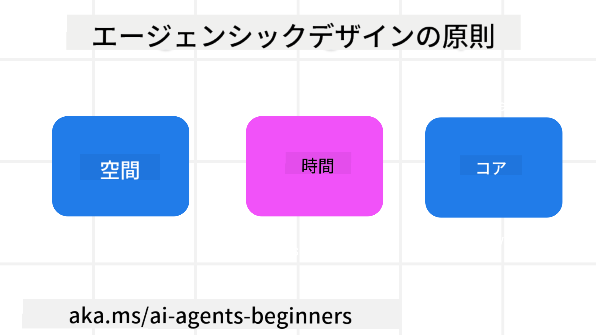

<!--
CO_OP_TRANSLATOR_METADATA:
{
  "original_hash": "4c46e4ff9e349c521e2b0b17f51afa64",
  "translation_date": "2025-08-30T07:55:31+00:00",
  "source_file": "03-agentic-design-patterns/README.md",
  "language_code": "ja"
}
-->

> _(上の画像をクリックすると、このレッスンの動画をご覧いただけます)_
# AIエージェント設計の原則

## はじめに

AIエージェントシステムを構築する方法は数多くあります。生成AIの設計において曖昧さが欠点ではなく特徴であることを考えると、エンジニアがどこから手をつければよいのか悩むこともあります。そこで、開発者が顧客中心のエージェントシステムを構築し、ビジネスニーズを解決するための人間中心のUX設計原則を作成しました。これらの設計原則は、具体的なアーキテクチャを示すものではなく、エージェント体験を定義し構築するチームの出発点となるものです。

一般的に、エージェントは以下を目指すべきです：

- 人間の能力を広げ、スケールさせる（ブレインストーミング、問題解決、自動化など）
- 知識のギャップを埋める（知識分野のキャッチアップ、翻訳など）
- 個人が他者と協力する際の好みに応じた方法でコラボレーションを促進し、支援する
- 自分自身をより良いバージョンにする（例：ライフコーチ/タスクマスター、感情の調整やマインドフルネススキルの学習支援、レジリエンスの構築など）

## このレッスンで学ぶこと

- エージェント設計の原則とは何か
- これらの設計原則を実装する際のガイドライン
- 設計原則を使用した例

## 学習目標

このレッスンを完了すると、以下ができるようになります：

1. エージェント設計の原則が何であるかを説明する
2. エージェント設計の原則を使用するためのガイドラインを説明する
3. エージェント設計の原則を使用してエージェントを構築する方法を理解する

## エージェント設計の原則

### エージェント（空間）

これはエージェントが動作する環境です。これらの原則は、物理的およびデジタルの世界でエージェントを設計する方法を示します。

- **接続を促進し、崩壊を防ぐ** – 人々を他の人々、イベント、実行可能な知識に結びつけ、コラボレーションと接続を可能にする。
  - エージェントはイベント、知識、人々を結びつける。
  - エージェントは人々をより近づける。人々を置き換えたり軽視したりするために設計されているわけではない。
- **簡単にアクセスできるが、時には目立たない** – エージェントは主に背景で動作し、関連性があり適切な場合にのみ私たちに注意を促す。
  - エージェントは、認可されたユーザーがどのデバイスやプラットフォームでも簡単に発見しアクセスできる。
  - エージェントは、音声、テキストなどのマルチモーダルな入力と出力をサポートする。
  - エージェントは、ユーザーのニーズを感知して、前景と背景、プロアクティブとリアクティブの間をシームレスに移行できる。
  - エージェントは目に見えない形で動作することがあるが、その背景プロセスの経路や他のエージェントとのコラボレーションはユーザーに対して透明であり、制御可能である。

### エージェント（時間）

これはエージェントが時間を通じてどのように動作するかを示します。これらの原則は、過去、現在、未来にわたるエージェントの相互作用を設計する方法を示します。

- **過去**: 状態とコンテキストを含む履歴を反映する。
  - エージェントは、イベント、人々、状態だけでなく、より豊富な履歴データの分析に基づいて、より関連性の高い結果を提供する。
  - エージェントは過去のイベントからの接続を作り、記憶を積極的に反映して現在の状況に対応する。
- **現在**: 通知以上の促し。
  - エージェントは人々との相互作用に包括的なアプローチを取り入れる。イベントが発生した際、エージェントは静的な通知や形式的なものを超えて、フローを簡素化したり、動的にキューを生成して適切なタイミングでユーザーの注意を引く。
  - エージェントは、コンテキスト環境、社会的および文化的変化に基づいて情報を提供し、ユーザーの意図に合わせて調整する。
  - エージェントの相互作用は段階的であり、長期的にユーザーを支援するために複雑さが進化する。
- **未来**: 適応と進化。
  - エージェントはさまざまなデバイス、プラットフォーム、モダリティに適応する。
  - エージェントはユーザーの行動、アクセシビリティのニーズに適応し、自由にカスタマイズ可能である。
  - エージェントは継続的なユーザーとの相互作用を通じて形作られ、進化する。

### エージェント（コア）

これらはエージェント設計の中心的な要素です。

- **不確実性を受け入れつつ信頼を確立する**。
  - エージェントの不確実性はある程度予期される。不確実性はエージェント設計の重要な要素である。
  - 信頼と透明性はエージェント設計の基盤となる層である。
  - エージェントがオン/オフになるタイミングは人間が制御し、エージェントの状態は常に明確に表示される。

## これらの原則を実装するためのガイドライン

前述の設計原則を使用する際は、以下のガイドラインを活用してください：

1. **透明性**: AIが関与していること、その機能（過去の行動を含む）、フィードバックの方法やシステムの変更方法をユーザーに知らせる。
2. **制御**: ユーザーがシステムやその属性をカスタマイズし、好みを指定し、個別化し、制御できるようにする（忘れる機能を含む）。
3. **一貫性**: デバイスやエンドポイント間で一貫したマルチモーダルな体験を目指す。可能な限り馴染みのあるUI/UX要素を使用し（例：音声インタラクションのマイクアイコン）、顧客の認知負荷を可能な限り軽減する（例：簡潔な応答、視覚的補助、「詳細を学ぶ」コンテンツ）。

## これらの原則とガイドラインを使用して旅行エージェントを設計する方法

旅行エージェントを設計する場合、以下のように設計原則とガイドラインを活用できます：

1. **透明性** – 旅行エージェントがAI対応エージェントであることをユーザーに知らせる。開始方法に関する基本的な指示を提供する（例：「こんにちは」メッセージ、サンプルプロンプト）。これを製品ページに明確に記載する。ユーザーが過去に尋ねたプロンプトのリストを表示する。フィードバックの方法を明確にする（親指の上げ下げ、フィードバック送信ボタンなど）。エージェントに使用制限やトピック制限がある場合は明確に説明する。
2. **制御** – エージェントが作成された後に、システムプロンプトなどを使用してユーザーがエージェントを変更できる方法を明確にする。エージェントの詳細さ、書き方のスタイル、話題にしない内容などを選択できるようにする。関連するファイルやデータ、プロンプト、過去の会話を表示および削除できるようにする。
3. **一貫性** – プロンプトの共有、ファイルや写真の追加、誰かや何かをタグ付けするアイコンが標準的で認識しやすいものであることを確認する。ファイルのアップロード/共有を示すためにクリップアイコンを使用し、グラフィックのアップロードを示すために画像アイコンを使用する。

### AIエージェント設計パターンについてさらに質問がありますか？

[Azure AI Foundry Discord](https://aka.ms/ai-agents/discord)に参加して、他の学習者と交流したり、オフィスアワーに参加したり、AIエージェントに関する質問に答えてもらいましょう。

## 追加リソース

- 

## 前のレッスン

[エージェントフレームワークの探求](../02-explore-agentic-frameworks/README.md)

## 次のレッスン

[ツール使用設計パターン](../04-tool-use/README.md)

---

**免責事項**:  
この文書は、AI翻訳サービス [Co-op Translator](https://github.com/Azure/co-op-translator) を使用して翻訳されています。正確性を追求しておりますが、自動翻訳には誤りや不正確な部分が含まれる可能性があります。元の言語で記載された原文が正式な情報源と見なされるべきです。重要な情報については、専門の人間による翻訳を推奨します。この翻訳の利用に起因する誤解や誤認について、当社は一切の責任を負いません。