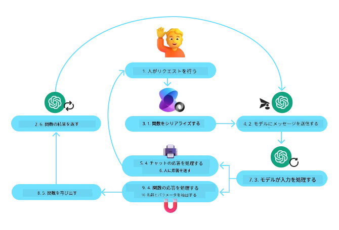
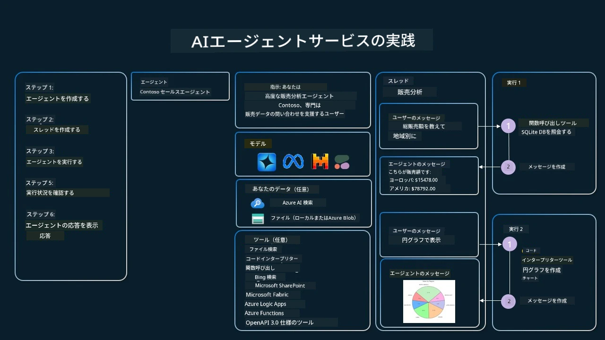

[](https://youtu.be/vieRiPRx-gI?si=cEZ8ApnT6Sus9rhn)

> _(上の画像をクリックしてこのレッスンのビデオを視聴)_

# ツール使用デザインパターン

ツールは、AIエージェントにより広い範囲の能力を持たせることができるため興味深いものです。エージェントが実行できるアクションが限られているのではなく、ツールを追加することで、エージェントは幅広いアクションを実行できるようになります。この章では、AIエージェントが特定のツールを使って目標を達成する方法を説明する「ツール使用デザインパターン」について見ていきます。

## はじめに

このレッスンでは、以下の質問に答えることを目指します：

- ツール使用デザインパターンとは何か？
- どのようなユースケースに適用できるか？
- デザインパターンを実装するために必要な要素／構成要素は何か？
- 信頼できるAIエージェントを構築するためにツール使用デザインパターンを使う際の特別な考慮点は何か？

## 学習目標

このレッスンを修了すると、以下のことができるようになります：

- ツール使用デザインパターンとその目的を定義できる
- ツール使用デザインパターンが適用可能なユースケースを特定できる
- デザインパターンを実装するために必要な主要な要素を理解できる
- このデザインパターンを使うAIエージェントの信頼性を確保するための考慮事項を認識できる

## ツール使用デザインパターンとは？

**ツール使用デザインパターン**は、LLMが特定の目標を達成するために外部のツールとインタラクションする能力を持つことに焦点を当てています。ツールとはエージェントが実行できるコードのことであり、アクションを実行します。ツールは計算機のような単純な関数であったり、株価照会や天気予報のようなサードパーティのサービスへのAPIコールであったりします。AIエージェントの文脈では、ツールは**モデル生成の関数呼び出しに応答してエージェントが実行する**よう設計されています。

## どのようなユースケースに適用できるか？

AIエージェントはツールを活用して複雑なタスクを完了したり、情報を取得したり、意思決定を行ったりできます。ツール使用デザインパターンは、外部システム（データベース、ウェブサービス、コードインタプリタなど）との動的なインタラクションが必要なシナリオでよく使われます。この能力は以下のような多様なユースケースに有用です：

- **動的な情報取得：** エージェントが外部APIやデータベースに問い合わせて最新データを取得（例：SQLiteデータベースへのクエリによるデータ分析、株価や天気情報の取得）
- **コードの実行と解釈：** エージェントがコードやスクリプトを実行して数学の問題を解いたり、レポートを生成したり、シミュレーションを行ったりする
- **ワークフロー自動化：** タスクスケジューラやメールサービス、データパイプラインなどのツールを統合して繰り返しや複数ステップの作業を自動化
- **カスタマーサポート：** CRMシステムやチケッティングプラットフォーム、ナレッジベースとやり取りしてユーザーの問い合わせを解決
- **コンテンツ生成・編集：** 文法チェッカーやテキスト要約、コンテンツ安全性評価ツールなどを使ってコンテンツ作成を支援

## ツール使用デザインパターンを実装するために必要な要素／構成要素は？

これらの構成要素によりAIエージェントが幅広いタスクを実行できるようになります。ツール使用デザインパターン実装に必要な主要な要素を見てみましょう：

- **関数／ツールスキーマ**：利用可能なツールの詳細な定義（関数名、目的、必要なパラメータ、期待される出力など）。これによりLLMがどのツールが使えるか、それらにどのように有効なリクエストを構築するかを理解できる。

- **関数実行ロジック**：ユーザーの意図や会話の文脈に基づいてツールがいつどのように呼び出されるかを制御。プランナーモジュール、ルーティング機構、条件付きフローなどを含むことがあり、ツール使用を動的に決定する。

- **メッセージ処理システム**：ユーザー入力、LLMの応答、ツール呼び出し、ツールの出力間の会話フローを管理するコンポーネント。

- **ツール統合フレームワーク**：単純な関数から複雑な外部サービスまで、様々なツールをエージェントに接続するインフラ。

- **エラー処理と検証**：ツール実行の失敗を処理し、パラメータを検証し、予期しない応答を管理する仕組み。

- **状態管理**：会話の文脈、以前のツールとのやり取り、永続データを追跡し、多ターンの対話での一貫性を確保。

次に、関数／ツール呼び出しについて詳しく見ていきます。

### 関数／ツール呼び出し

関数呼び出しは、大規模言語モデル（LLM）がツールとインタラクションする主な方法です。「関数」と「ツール」はしばしば同義で使われます。なぜなら「関数」（再利用可能なコードブロック）はエージェントがタスクを実行するために使う「ツール」だからです。関数のコードを呼び出すには、LLMがユーザーのリクエストを関数の説明と比較する必要があります。そのため利用可能な関数すべての説明を含むスキーマがLLMに送信されます。LLMはタスクに最も適した関数を選択し、その名前と引数を返します。選択された関数が呼び出され、その応答がLLMに返送され、LLMはその情報を使ってユーザーのリクエストに応答します。

開発者がエージェントの関数呼び出しを実装するには、以下が必要です：

1. 関数呼び出しをサポートするLLMモデル
2. 関数の説明を含むスキーマ
3. 説明された各関数のコード

都市の現在時刻を取得する例で説明します：

1. **関数呼び出しがサポートされているLLMを初期化する：**

   関数呼び出しをサポートしていないモデルもあるため、使用しているLLMが対応しているか確認が必須です。<a href="https://learn.microsoft.com/azure/ai-services/openai/how-to/function-calling" target="_blank">Azure OpenAI</a>は関数呼び出しをサポートしています。まず、Azure OpenAIクライアントを初期化します。

    ```python
    # Azure OpenAI クライアントを初期化する
    client = AzureOpenAI(
        azure_endpoint = os.getenv("AZURE_AI_PROJECT_ENDPOINT"), 
        api_key=os.getenv("AZURE_OPENAI_API_KEY"),  
        api_version="2024-05-01-preview"
    )
    ```

1. **関数スキーマの作成：**

   次に、関数名、関数の説明、関数パラメータの名前と説明を含むJSONスキーマを定義します。
   そのスキーマを先ほど作成したクライアントに渡し、ユーザーからの「サンフランシスコの時刻を知りたい」というリクエストと一緒に送信します。重要なのは、**ツール呼び出し**が返されることであり、質問の最終回答が返されるわけではありません。先述のように、LLMはタスク用に選んだ関数の名前とパラメータを返します。

    ```python
    # モデルが読むための関数の説明
    tools = [
        {
            "type": "function",
            "function": {
                "name": "get_current_time",
                "description": "Get the current time in a given location",
                "parameters": {
                    "type": "object",
                    "properties": {
                        "location": {
                            "type": "string",
                            "description": "The city name, e.g. San Francisco",
                        },
                    },
                    "required": ["location"],
                },
            }
        }
    ]
    ```
   
    ```python
  
    # 最初のユーザーメッセージ
    messages = [{"role": "user", "content": "What's the current time in San Francisco"}] 
  
    # 最初のAPI呼び出し: モデルに関数の使用を依頼する
      response = client.chat.completions.create(
          model=deployment_name,
          messages=messages,
          tools=tools,
          tool_choice="auto",
      )
  
      # モデルの応答を処理する
      response_message = response.choices[0].message
      messages.append(response_message)
  
      print("Model's response:")  

      print(response_message)
  
    ```

    ```bash
    Model's response:
    ChatCompletionMessage(content=None, role='assistant', function_call=None, tool_calls=[ChatCompletionMessageToolCall(id='call_pOsKdUlqvdyttYB67MOj434b', function=Function(arguments='{"location":"San Francisco"}', name='get_current_time'), type='function')])
    ```
  
1. **タスクを実行するための関数コード：**

   LLMが実行する必要がある関数を選択したので、次にそのタスクを実行するコードを実装して実行します。
   Pythonで現在時刻を取得するコードを実装し、返されたresponse_messageから関数名と引数を抽出して最終結果を得るコードも必要です。

    ```python
      def get_current_time(location):
        """Get the current time for a given location"""
        print(f"get_current_time called with location: {location}")  
        location_lower = location.lower()
        
        for key, timezone in TIMEZONE_DATA.items():
            if key in location_lower:
                print(f"Timezone found for {key}")  
                current_time = datetime.now(ZoneInfo(timezone)).strftime("%I:%M %p")
                return json.dumps({
                    "location": location,
                    "current_time": current_time
                })
      
        print(f"No timezone data found for {location_lower}")  
        return json.dumps({"location": location, "current_time": "unknown"})
    ```

     ```python
     # 関数呼び出しを処理する
      if response_message.tool_calls:
          for tool_call in response_message.tool_calls:
              if tool_call.function.name == "get_current_time":
     
                  function_args = json.loads(tool_call.function.arguments)
     
                  time_response = get_current_time(
                      location=function_args.get("location")
                  )
     
                  messages.append({
                      "tool_call_id": tool_call.id,
                      "role": "tool",
                      "name": "get_current_time",
                      "content": time_response,
                  })
      else:
          print("No tool calls were made by the model.")  
  
      # 2回目のAPI呼び出し: モデルから最終応答を取得する
      final_response = client.chat.completions.create(
          model=deployment_name,
          messages=messages,
      )
  
      return final_response.choices[0].message.content
     ```

     ```bash
      get_current_time called with location: San Francisco
      Timezone found for san francisco
      The current time in San Francisco is 09:24 AM.
     ```

関数呼び出しはほぼすべてのエージェントツール使用デザインの中心ですが、ゼロから実装するのは難しい場合があります。
[レッスン2](../../../02-explore-agentic-frameworks)で学んだように、エージェントフレームワークはツール使用を実装するための構成要素を提供してくれます。
 
## エージェントフレームワークを使ったツール使用例

以下は、さまざまなエージェントフレームワークを用いてツール使用デザインパターンを実装する例です：

### Microsoft Agent Framework

<a href="https://learn.microsoft.com/azure/ai-services/agents/overview" target="_blank">Microsoft Agent Framework</a>はAIエージェント構築用のオープンソースフレームワークです。`@tool`デコレータを使ってツールをPython関数として定義し、関数呼び出しのやり取りを簡単に処理します。このフレームワークはモデルとコード間の通信を自動で処理し、`AzureAIProjectAgentProvider`を通じてファイル検索やコードインタプリタなどの既成ツールにもアクセスを提供します。

以下の図はMicrosoft Agent Frameworkでの関数呼び出しのプロセスを示しています：



Microsoft Agent Frameworkでは、ツールはデコレートされた関数として定義されます。先ほどの`get_current_time`関数を`@tool`デコレータを使ってツールに変換できます。フレームワークは関数とそのパラメータを自動的にシリアライズし、LLMに送るスキーマを作成します。

```python
from agent_framework import tool
from agent_framework.azure import AzureAIProjectAgentProvider
from azure.identity import AzureCliCredential

@tool
def get_current_time(location: str) -> str:
    """Get the current time for a given location"""
    ...

# クライアントを作成する
provider = AzureAIProjectAgentProvider(credential=AzureCliCredential())

# エージェントを作成し、ツールで実行する
agent = await provider.create_agent(name="TimeAgent", instructions="Use available tools to answer questions.", tools=get_current_time)
response = await agent.run("What time is it?")
```
  
### Azure AI Agent Service

<a href="https://learn.microsoft.com/azure/ai-services/agents/overview" target="_blank">Azure AI Agent Service</a>は、開発者が基盤となるコンピュートやストレージリソースの管理なしに高品質で拡張可能なAIエージェントを安全に構築、展開、スケールできるよう設計された新しいエージェントフレームワークです。エンタープライズアプリケーションに特に向いており、フルマネージドでエンタープライズグレードのセキュリティを備えています。

LLM APIを直接使用する場合と比べ、Azure AI Agent Serviceの利点には以下があります：

- 自動ツール呼び出し – ツール呼び出しの解析、ツールの起動、応答処理をサーバー側で全て実行
- セキュアに管理されたデータ – 独自に会話状態を管理する代わりにスレッドに会話履歴を保存可能
- すぐに使えるツール – Bing、Azure AI Search、Azure Functionsなどのデータソースとやり取りするためのツール

Azure AI Agent Serviceで利用できるツールは大きく2つのカテゴリに分けられます：

1. 知識ツール：
    - <a href="https://learn.microsoft.com/azure/ai-services/agents/how-to/tools/bing-grounding?tabs=python&pivots=overview" target="_blank">Bing検索による基盤付け</a>
    - <a href="https://learn.microsoft.com/azure/ai-services/agents/how-to/tools/file-search?tabs=python&pivots=overview" target="_blank">ファイル検索</a>
    - <a href="https://learn.microsoft.com/azure/ai-services/agents/how-to/tools/azure-ai-search?tabs=azurecli%2Cpython&pivots=overview-azure-ai-search" target="_blank">Azure AI Search</a>

2. アクションツール：
    - <a href="https://learn.microsoft.com/azure/ai-services/agents/how-to/tools/function-calling?tabs=python&pivots=overview" target="_blank">関数呼び出し</a>
    - <a href="https://learn.microsoft.com/azure/ai-services/agents/how-to/tools/code-interpreter?tabs=python&pivots=overview" target="_blank">コードインタプリタ</a>
    - <a href="https://learn.microsoft.com/azure/ai-services/agents/how-to/tools/openapi-spec?tabs=python&pivots=overview" target="_blank">OpenAPI定義ツール</a>
    - <a href="https://learn.microsoft.com/azure/ai-services/agents/how-to/tools/azure-functions?pivots=overview" target="_blank">Azure Functions</a>

Agent Serviceでは、これらのツールを`toolset`として一緒に使えます。また各会話のメッセージ履歴を追跡する`threads`も活用されます。

たとえば、Contoso社の営業担当者として、営業データに関する質問に答える対話型エージェントを開発したいとします。

以下の画像はAzure AI Agent Serviceを使って営業データを分析する例を示しています：



これらのツールをサービスで使うにはクライアントを作成し、ツールやツールセットを定義します。具体的には以下のPythonコードを使います。LLMはツールセットを参照して、ユーザーが作成した関数`fetch_sales_data_using_sqlite_query`を使うか、既成のコードインタプリタを使うかをユーザーのリクエストに応じて決定します。

```python 
import os
from azure.ai.projects import AIProjectClient
from azure.identity import DefaultAzureCredential
from fetch_sales_data_functions import fetch_sales_data_using_sqlite_query # fetch_sales_data_functions.py ファイルにある fetch_sales_data_using_sqlite_query 関数。
from azure.ai.projects.models import ToolSet, FunctionTool, CodeInterpreterTool

project_client = AIProjectClient.from_connection_string(
    credential=DefaultAzureCredential(),
    conn_str=os.environ["PROJECT_CONNECTION_STRING"],
)

# ツールセットを初期化する
toolset = ToolSet()

# fetch_sales_data_using_sqlite_query 関数を使用して関数呼び出しエージェントを初期化し、ツールセットに追加する
fetch_data_function = FunctionTool(fetch_sales_data_using_sqlite_query)
toolset.add(fetch_data_function)

# コードインタープリターツールを初期化し、ツールセットに追加する。
code_interpreter = code_interpreter = CodeInterpreterTool()
toolset.add(code_interpreter)

agent = project_client.agents.create_agent(
    model="gpt-4o-mini", name="my-agent", instructions="You are helpful agent", 
    toolset=toolset
)
```

## 信頼できるAIエージェントを構築するためにツール使用デザインパターンを使う際の特別な考慮点は？

LLMが動的に生成するSQLに対してよくある懸念はセキュリティです。特にSQLインジェクションやデータベースの削除・改ざんといった悪意のある行動のリスクです。これらの懸念は妥当ですが、データベースのアクセス権限を適切に設定することで効果的に緩和可能です。ほとんどのデータベースは読み取り専用に設定することが望ましいです。PostgreSQLやAzure SQLのようなデータベースサービスでは、アプリに読み取り専用（SELECT）ロールを割り当てるべきです。

さらに、安全な環境でアプリを実行することが保護を強化します。エンタープライズシナリオでは、操作システムからデータを抽出・変換し、ユーザーフレンドリーなスキーマを持つ読み取り専用のデータベースやデータウェアハウスを用意します。この方法でデータの安全性、パフォーマンス、アクセス性が最適化され、アプリは制限された読み取り専用アクセスを持つことになります。

## サンプルコード

- Python: [エージェントフレームワーク](./code_samples/04-python-agent-framework.ipynb)
- .NET: [エージェントフレームワーク](./code_samples/04-dotnet-agent-framework.md)

## ツール使用デザインパターンについての質問がありますか？

[Microsoft Foundry Discord](https://aka.ms/ai-agents/discord)に参加して、他の学習者と交流したり、オフィスアワーに参加したり、AIエージェントに関する疑問を解消しましょう。

## 追加リソース

- <a href="https://microsoft.github.io/build-your-first-agent-with-azure-ai-agent-service-workshop/" target="_blank">Azure AI Agents Service ワークショップ</a>
- <a href="https://github.com/Azure-Samples/contoso-creative-writer/tree/main/docs/workshop" target="_blank">Contoso Creative Writer マルチエージェントワークショップ</a>
- <a href="https://learn.microsoft.com/azure/ai-services/agents/overview" target="_blank">Microsoft Agent Framework 概要</a>

## 前のレッスン

[エージェントデザインパターンの理解](../03-agentic-design-patterns/README.md)

## 次のレッスン
[Agentic RAG](../05-agentic-rag/README.md)

---

<!-- CO-OP TRANSLATOR DISCLAIMER START -->
**免責事項**：  
本ドキュメントはAI翻訳サービス「Co-op Translator」（https://github.com/Azure/co-op-translator）を使用して翻訳されています。正確性を期しておりますが、自動翻訳には誤りや不正確な表現が含まれる可能性があることをご了承ください。原文のネイティブ言語版が正式な情報源とみなされます。重要な情報については、専門の人間による翻訳を推奨します。本翻訳の利用により生じたいかなる誤解や誤訳についても責任を負いかねます。
<!-- CO-OP TRANSLATOR DISCLAIMER END -->