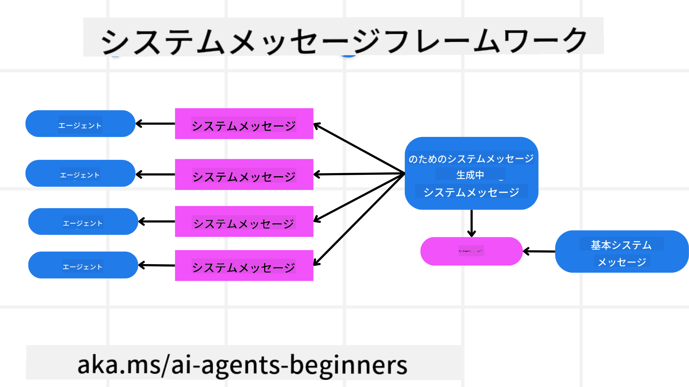
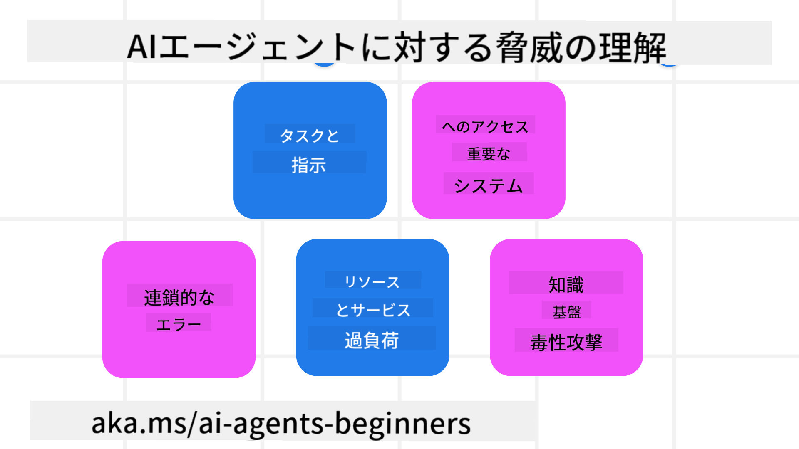
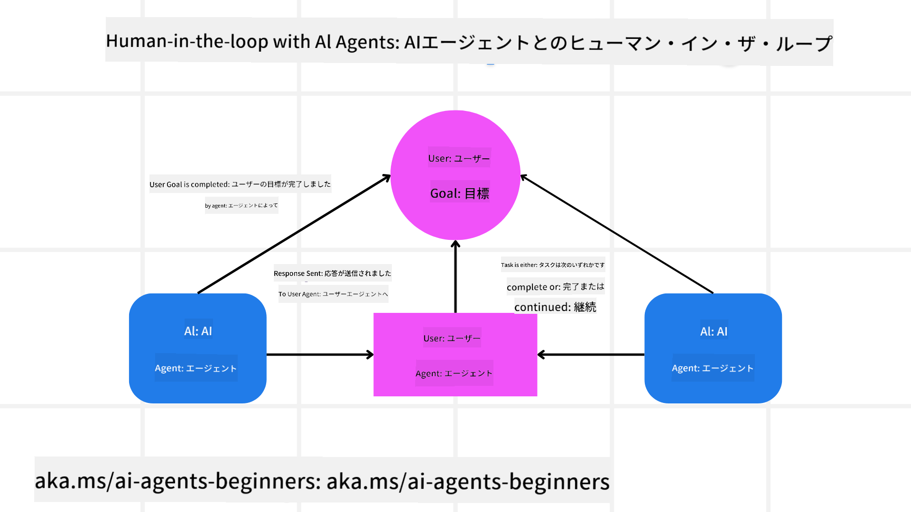

<!--
CO_OP_TRANSLATOR_METADATA:
{
  "original_hash": "498802b4c3c3cc486b86f27a12cebb34",
  "translation_date": "2025-08-30T07:49:09+00:00",
  "source_file": "06-building-trustworthy-agents/README.md",
  "language_code": "ja"
}
-->
[](https://youtu.be/iZKkMEGBCUQ?si=Q-kEbcyHUMPoHp8L)

> _(上の画像をクリックして、このレッスンの動画をご覧ください)_

# 信頼できるAIエージェントの構築

## はじめに

このレッスンでは以下を学びます：

- 安全で効果的なAIエージェントの構築と展開方法
- AIエージェントを開発する際の重要なセキュリティ上の考慮事項
- データとユーザーのプライバシーを保護しながらAIエージェントを開発する方法

## 学習目標

このレッスンを終えると、以下ができるようになります：

- AIエージェントを作成する際のリスクを特定し、軽減する方法を理解する。
- データとアクセスを適切に管理するためのセキュリティ対策を実装する。
- データのプライバシーを維持し、質の高いユーザー体験を提供するAIエージェントを作成する。

## 安全性

まず、安全なエージェントアプリケーションを構築する方法を見ていきましょう。安全性とは、AIエージェントが設計通りに動作することを意味します。エージェントアプリケーションの開発者として、安全性を最大化するための方法とツールがあります。

### システムメッセージフレームワークの構築

大規模言語モデル（LLM）を使用してAIアプリケーションを構築したことがある場合、堅牢なシステムプロンプトやシステムメッセージを設計する重要性をご存じでしょう。これらのプロンプトは、LLMがユーザーやデータとどのようにやり取りするかの基本ルール、指示、ガイドラインを確立します。

AIエージェントの場合、システムプロンプトはさらに重要です。エージェントが設計されたタスクを完了するためには、非常に具体的な指示が必要です。

スケーラブルなシステムプロンプトを作成するために、アプリケーション内で1つ以上のエージェントを構築するためのシステムメッセージフレームワークを使用できます：



#### ステップ1: メタシステムメッセージを作成する

メタプロンプトは、LLMがエージェント用のシステムプロンプトを生成するために使用されます。テンプレートとして設計することで、必要に応じて複数のエージェントを効率的に作成できます。

以下は、LLMに提供するメタシステムメッセージの例です：

```plaintext
You are an expert at creating AI agent assistants. 
You will be provided a company name, role, responsibilities and other
information that you will use to provide a system prompt for.
To create the system prompt, be descriptive as possible and provide a structure that a system using an LLM can better understand the role and responsibilities of the AI assistant. 
```

#### ステップ2: 基本プロンプトを作成する

次に、AIエージェントを説明する基本プロンプトを作成します。エージェントの役割、完了するタスク、その他の責任を含めるべきです。

以下はその例です：

```plaintext
You are a travel agent for Contoso Travel that is great at booking flights for customers. To help customers you can perform the following tasks: lookup available flights, book flights, ask for preferences in seating and times for flights, cancel any previously booked flights and alert customers on any delays or cancellations of flights.  
```

#### ステップ3: 基本システムメッセージをLLMに提供する

次に、メタシステムメッセージをシステムメッセージとして提供し、基本システムメッセージを追加して最適化します。

これにより、AIエージェントを導くためにより適切に設計されたシステムメッセージが生成されます：

```markdown
**Company Name:** Contoso Travel  
**Role:** Travel Agent Assistant

**Objective:**  
You are an AI-powered travel agent assistant for Contoso Travel, specializing in booking flights and providing exceptional customer service. Your main goal is to assist customers in finding, booking, and managing their flights, all while ensuring that their preferences and needs are met efficiently.

**Key Responsibilities:**

1. **Flight Lookup:**
    
    - Assist customers in searching for available flights based on their specified destination, dates, and any other relevant preferences.
    - Provide a list of options, including flight times, airlines, layovers, and pricing.
2. **Flight Booking:**
    
    - Facilitate the booking of flights for customers, ensuring that all details are correctly entered into the system.
    - Confirm bookings and provide customers with their itinerary, including confirmation numbers and any other pertinent information.
3. **Customer Preference Inquiry:**
    
    - Actively ask customers for their preferences regarding seating (e.g., aisle, window, extra legroom) and preferred times for flights (e.g., morning, afternoon, evening).
    - Record these preferences for future reference and tailor suggestions accordingly.
4. **Flight Cancellation:**
    
    - Assist customers in canceling previously booked flights if needed, following company policies and procedures.
    - Notify customers of any necessary refunds or additional steps that may be required for cancellations.
5. **Flight Monitoring:**
    
    - Monitor the status of booked flights and alert customers in real-time about any delays, cancellations, or changes to their flight schedule.
    - Provide updates through preferred communication channels (e.g., email, SMS) as needed.

**Tone and Style:**

- Maintain a friendly, professional, and approachable demeanor in all interactions with customers.
- Ensure that all communication is clear, informative, and tailored to the customer's specific needs and inquiries.

**User Interaction Instructions:**

- Respond to customer queries promptly and accurately.
- Use a conversational style while ensuring professionalism.
- Prioritize customer satisfaction by being attentive, empathetic, and proactive in all assistance provided.

**Additional Notes:**

- Stay updated on any changes to airline policies, travel restrictions, and other relevant information that could impact flight bookings and customer experience.
- Use clear and concise language to explain options and processes, avoiding jargon where possible for better customer understanding.

This AI assistant is designed to streamline the flight booking process for customers of Contoso Travel, ensuring that all their travel needs are met efficiently and effectively.

```

#### ステップ4: 繰り返し改善する

このシステムメッセージフレームワークの価値は、複数のエージェントのシステムメッセージを簡単にスケール作成できることと、時間をかけて改善できることです。最初から完全なユースケースに対応するシステムメッセージが得られることは稀です。基本システムメッセージを変更してシステムを通じて実行することで、小さな調整や改善を行い、結果を比較評価できます。

## 脅威の理解

信頼できるAIエージェントを構築するには、リスクや脅威を理解し、それを軽減することが重要です。ここでは、AIエージェントに対するさまざまな脅威の一部と、それに対する計画と準備の方法を見ていきます。



### タスクと指示

**説明:** 攻撃者がプロンプトや入力を操作して、AIエージェントの指示や目標を変更しようとする。

**対策:** AIエージェントが処理する前に、潜在的に危険なプロンプトを検出するための検証チェックや入力フィルターを実行します。この種の攻撃は通常、エージェントとの頻繁なやり取りを必要とするため、会話のターン数を制限することも有効です。

### 重要なシステムへのアクセス

**説明:** AIエージェントが機密データを保存するシステムやサービスにアクセスできる場合、攻撃者がこれらの通信を妨害する可能性があります。これには、直接的な攻撃や、エージェントを介してこれらのシステムに関する情報を得ようとする間接的な試みが含まれます。

**対策:** この種の攻撃を防ぐために、AIエージェントは必要最小限のシステムにのみアクセスできるようにします。エージェントとシステム間の通信は安全であるべきです。認証とアクセス制御を実装することも情報を保護する方法の一つです。

### リソースとサービスの過負荷

**説明:** AIエージェントはタスクを完了するためにさまざまなツールやサービスにアクセスします。攻撃者はこの能力を利用して、AIエージェントを介して大量のリクエストを送信し、システム障害や高コストを引き起こす可能性があります。

**対策:** AIエージェントがサービスに送信できるリクエストの数を制限するポリシーを実装します。会話のターン数やリクエスト数を制限することも、この種の攻撃を防ぐ方法です。

### ナレッジベースの汚染

**説明:** この種の攻撃はAIエージェント自体を直接狙うのではなく、エージェントが使用するナレッジベースやその他のサービスを狙います。これには、エージェントがタスクを完了するために使用するデータや情報を改ざんし、ユーザーに偏ったまたは意図しない応答を返すようにすることが含まれます。

**対策:** AIエージェントがワークフローで使用するデータを定期的に検証します。このデータへのアクセスを安全に保ち、信頼できる人物のみが変更できるようにすることで、この種の攻撃を防ぎます。

### 連鎖的なエラー

**説明:** AIエージェントはタスクを完了するためにさまざまなツールやサービスにアクセスします。攻撃者によるエラーが他のシステムの障害を引き起こし、攻撃が広範囲に及び、トラブルシューティングが困難になる可能性があります。

**対策:** この問題を回避する方法の一つは、AIエージェントをDockerコンテナなどの限定された環境で動作させ、直接的なシステム攻撃を防ぐことです。特定のシステムがエラーを返した場合にフォールバックメカニズムや再試行ロジックを作成することも、大規模なシステム障害を防ぐ方法です。

## ヒューマン・イン・ザ・ループ

信頼できるAIエージェントシステムを構築するもう一つの効果的な方法は、ヒューマン・イン・ザ・ループを使用することです。これにより、ユーザーがエージェントの実行中にフィードバックを提供できるフローが作成されます。ユーザーはマルチエージェントシステム内のエージェントとして機能し、実行プロセスの承認や終了を行います。



以下は、AutoGenを使用してこの概念を実装するコードスニペットです：

```python

# Create the agents.
model_client = OpenAIChatCompletionClient(model="gpt-4o-mini")
assistant = AssistantAgent("assistant", model_client=model_client)
user_proxy = UserProxyAgent("user_proxy", input_func=input)  # Use input() to get user input from console.

# Create the termination condition which will end the conversation when the user says "APPROVE".
termination = TextMentionTermination("APPROVE")

# Create the team.
team = RoundRobinGroupChat([assistant, user_proxy], termination_condition=termination)

# Run the conversation and stream to the console.
stream = team.run_stream(task="Write a 4-line poem about the ocean.")
# Use asyncio.run(...) when running in a script.
await Console(stream)

```

## 結論

信頼できるAIエージェントを構築するには、慎重な設計、堅牢なセキュリティ対策、継続的な改善が必要です。構造化されたメタプロンプトシステムを実装し、潜在的な脅威を理解し、軽減戦略を適用することで、安全で効果的なAIエージェントを作成できます。さらに、ヒューマン・イン・ザ・ループアプローチを取り入れることで、AIエージェントがユーザーのニーズに沿ったままであり、リスクを最小限に抑えることができます。AIが進化を続ける中で、セキュリティ、プライバシー、倫理的な考慮に積極的に取り組む姿勢を維持することが、AI駆動型システムにおける信頼性と信頼を育む鍵となります。

### 信頼できるAIエージェントの構築についてさらに質問がありますか？

[Azure AI Foundry Discord](https://aka.ms/ai-agents/discord)に参加して、他の学習者と交流したり、オフィスアワーに参加したり、AIエージェントに関する質問に答えてもらいましょう。

## 追加リソース

- <a href="https://learn.microsoft.com/azure/ai-studio/responsible-use-of-ai-overview" target="_blank">責任あるAIの概要</a>
- <a href="https://learn.microsoft.com/azure/ai-studio/concepts/evaluation-approach-gen-ai" target="_blank">生成AIモデルとAIアプリケーションの評価</a>
- <a href="https://learn.microsoft.com/azure/ai-services/openai/concepts/system-message?context=%2Fazure%2Fai-studio%2Fcontext%2Fcontext&tabs=top-techniques" target="_blank">安全性に関するシステムメッセージ</a>
- <a href="https://blogs.microsoft.com/wp-content/uploads/prod/sites/5/2022/06/Microsoft-RAI-Impact-Assessment-Template.pdf?culture=en-us&country=us" target="_blank">リスク評価テンプレート</a>

## 前のレッスン

[Agentic RAG](../05-agentic-rag/README.md)

## 次のレッスン

[計画設計パターン](../07-planning-design/README.md)

---

**免責事項**:  
この文書は、AI翻訳サービス [Co-op Translator](https://github.com/Azure/co-op-translator) を使用して翻訳されています。正確性を追求しておりますが、自動翻訳には誤りや不正確な部分が含まれる可能性があります。元の言語で記載された原文が正式な情報源と見なされるべきです。重要な情報については、専門の人間による翻訳を推奨します。本翻訳の利用に起因する誤解や誤訳について、当社は一切の責任を負いません。