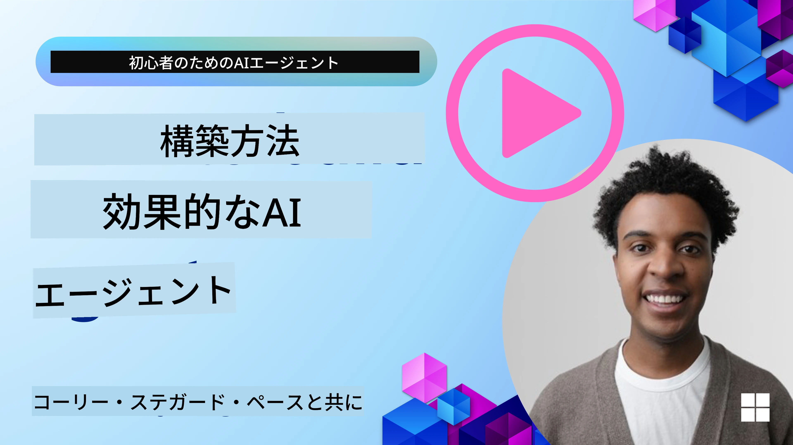
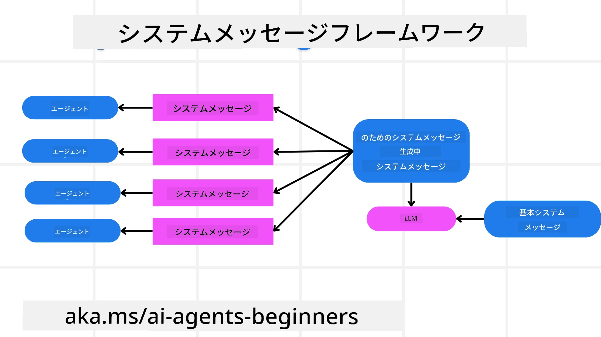
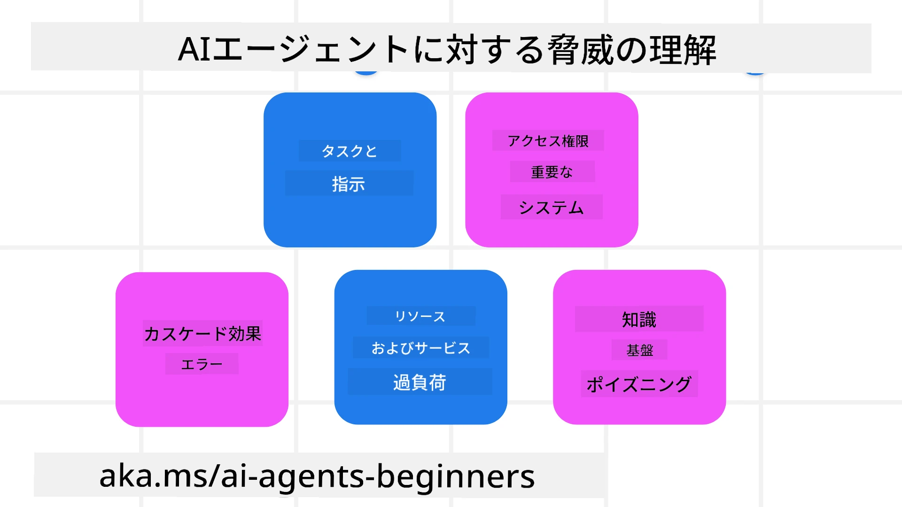
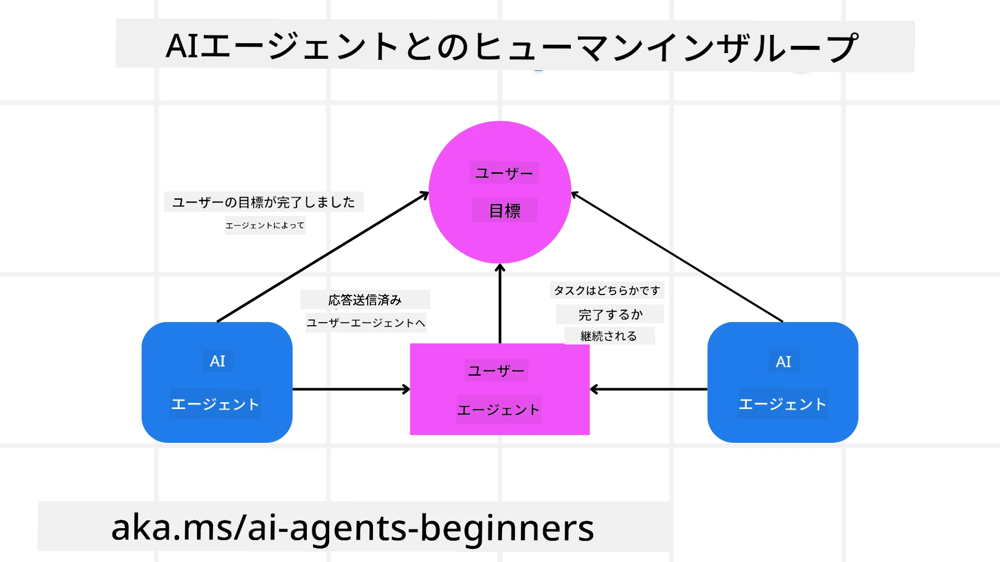

[](https://youtu.be/iZKkMEGBCUQ?si=Q-kEbcyHUMPoHp8L)

> _(上の画像をクリックするとこのレッスンの動画が視聴できます)_

# 信頼できるAIエージェントの構築

## はじめに

このレッスンでは以下を扱います：

- 安全かつ効果的なAIエージェントの構築と展開方法
- AIエージェントを開発する際の重要なセキュリティ上の考慮点
- AIエージェントの開発におけるデータとユーザーのプライバシーの維持方法

## 学習目標

このレッスンを終えた後、あなたは以下のことができるようになります：

- AIエージェント作成時のリスクを認識し軽減する方法
- データとアクセスが適切に管理されるようセキュリティ対策を実装する方法
- データプライバシーを維持し、質の高いユーザー体験を提供するAIエージェントを作成する方法

## 安全性

まず、安全なエージェントアプリケーションの構築を見てみましょう。安全性とは、AIエージェントが設計された通りに動作することを意味します。エージェントアプリケーションの開発者として、最大限の安全性を確保するための手法とツールを持っています。

### システムメッセージフレームワークの構築

もしこれまでに大規模言語モデル（LLM）を用いたAIアプリケーションを構築したことがあれば、堅牢なシステムプロンプトやシステムメッセージの設計がいかに重要かご存じでしょう。これらのプロンプトは、LLMがユーザーとデータにどのように対応するかについてのメタルールや指示、ガイドラインを定めます。

AIエージェントにおいては、システムプロンプトはさらに重要です。なぜなら、AIエージェントは設計されたタスクを完了するために非常に具体的な指示を必要とするからです。

スケーラブルなシステムプロンプトを作成するため、アプリケーション内の１つ以上のエージェントを構築するためのシステムメッセージフレームワークを利用できます：



#### ステップ1: メタシステムメッセージの作成

メタプロンプトは、LLMが我々の作成するエージェントのためのシステムプロンプトを生成する際に使用します。これはテンプレートとして設計し、必要に応じて効率的に複数のエージェントを作成できるようにします。

以下はLLMに与えるメタシステムメッセージの例です：

```plaintext
You are an expert at creating AI agent assistants. 
You will be provided a company name, role, responsibilities and other
information that you will use to provide a system prompt for.
To create the system prompt, be descriptive as possible and provide a structure that a system using an LLM can better understand the role and responsibilities of the AI assistant. 
```

#### ステップ2: 基本的なプロンプトの作成

次に、AIエージェントを説明する基本的なプロンプトを作成します。エージェントの役割、完了するタスク、およびその他の責務を含めるべきです。

以下は例です：

```plaintext
You are a travel agent for Contoso Travel that is great at booking flights for customers. To help customers you can perform the following tasks: lookup available flights, book flights, ask for preferences in seating and times for flights, cancel any previously booked flights and alert customers on any delays or cancellations of flights.  
```

#### ステップ3: 基本システムメッセージをLLMに提供

これで、メタシステムメッセージをシステムメッセージとして、基本システムメッセージを与えることで、このシステムメッセージを最適化できます。

これにより、AIエージェントのガイダンスにより適したシステムメッセージが生成されます：

```markdown
**Company Name:** Contoso Travel  
**Role:** Travel Agent Assistant

**Objective:**  
You are an AI-powered travel agent assistant for Contoso Travel, specializing in booking flights and providing exceptional customer service. Your main goal is to assist customers in finding, booking, and managing their flights, all while ensuring that their preferences and needs are met efficiently.

**Key Responsibilities:**

1. **Flight Lookup:**
    
    - Assist customers in searching for available flights based on their specified destination, dates, and any other relevant preferences.
    - Provide a list of options, including flight times, airlines, layovers, and pricing.
2. **Flight Booking:**
    
    - Facilitate the booking of flights for customers, ensuring that all details are correctly entered into the system.
    - Confirm bookings and provide customers with their itinerary, including confirmation numbers and any other pertinent information.
3. **Customer Preference Inquiry:**
    
    - Actively ask customers for their preferences regarding seating (e.g., aisle, window, extra legroom) and preferred times for flights (e.g., morning, afternoon, evening).
    - Record these preferences for future reference and tailor suggestions accordingly.
4. **Flight Cancellation:**
    
    - Assist customers in canceling previously booked flights if needed, following company policies and procedures.
    - Notify customers of any necessary refunds or additional steps that may be required for cancellations.
5. **Flight Monitoring:**
    
    - Monitor the status of booked flights and alert customers in real-time about any delays, cancellations, or changes to their flight schedule.
    - Provide updates through preferred communication channels (e.g., email, SMS) as needed.

**Tone and Style:**

- Maintain a friendly, professional, and approachable demeanor in all interactions with customers.
- Ensure that all communication is clear, informative, and tailored to the customer's specific needs and inquiries.

**User Interaction Instructions:**

- Respond to customer queries promptly and accurately.
- Use a conversational style while ensuring professionalism.
- Prioritize customer satisfaction by being attentive, empathetic, and proactive in all assistance provided.

**Additional Notes:**

- Stay updated on any changes to airline policies, travel restrictions, and other relevant information that could impact flight bookings and customer experience.
- Use clear and concise language to explain options and processes, avoiding jargon where possible for better customer understanding.

This AI assistant is designed to streamline the flight booking process for customers of Contoso Travel, ensuring that all their travel needs are met efficiently and effectively.

```

#### ステップ4: 繰り返し改善

このシステムメッセージフレームワークの価値は、複数のエージェントのシステムメッセージ作成をより簡単にスケールできることと、時間経過とともにシステムメッセージを改善できることにあります。完全なユースケースにおいて、初回で完璧なシステムメッセージを得られることは稀です。基本的なシステムメッセージを変更し、それをシステムに通すことで、小さな調整と改善を行い、結果を比較・評価できます。

## 脅威の理解

信頼できるAIエージェントを構築するためには、エージェントへのリスクや脅威を理解し軽減することが重要です。ここでは、AIエージェントに対する代表的な脅威の一部と、それらに備え計画を立てる方法を見てみましょう。



### タスクおよび指示

**説明:** 攻撃者はプロンプト操作や入力を操作して、AIエージェントの指示や目標を変更しようと試みます。

**軽減策:** AIエージェントが処理する前に、潜在的に危険なプロンプトを検出するための検証チェックと入力フィルターを実施します。こうした攻撃は通常エージェントとの頻繁な対話を要するため、会話のターン数を制限することも防止策となります。

### 重要システムへのアクセス

**説明:** AIエージェントが機密データを保存するシステムやサービスにアクセスできる場合、攻撃者はエージェントとこれらサービス間の通信を侵害する可能性があります。これらは直接的な攻撃や、エージェントを介して情報を間接的に得ようとする試みです。

**軽減策:** AIエージェントには必要最低限のアクセス権限のみを与えて、こうした攻撃を防止します。また、エージェントとシステム間の通信は安全でなければなりません。認証とアクセス制御の実装も情報保護に有効です。

### リソースおよびサービスの過負荷

**説明:** AIエージェントはタスク完遂のために様々なツールやサービスにアクセスします。攻撃者はAIエージェントを介して大量のリクエストを送信し、これらのサービスを攻撃してシステム障害や高額なコストを引き起こすことがあります。

**軽減策:** AIエージェントがサービスに送るリクエスト数を制限するポリシーを実装します。会話のターン数とAIエージェントへのリクエスト回数を制限することもこの種の攻撃を防ぐ方法です。

### 知識ベースの汚染

**説明:** この攻撃はAIエージェント自体を直接狙うのではなく、AIエージェントがタスク完遂に使う知識ベースや他のサービスを標的にします。データや情報が汚染されることで、AIエージェントは偏った応答や意図しない回答をユーザーに提供することになります。

**軽減策:** AIエージェントのワークフローで使用するデータを定期的に検証します。このデータへのアクセスは安全に管理し、信頼できる人物のみが変更可能とします。

### 連鎖的なエラー

**説明:** AIエージェントは複数のツールやサービスにアクセスします。攻撃者によるエラーは他のシステムの障害を引き起こし、攻撃が広範囲に拡大したり、トラブルシューティングが困難になります。

**軽減策:** これを防ぐ方法の一つは、Dockerコンテナなどの限定された環境内でAIエージェントを動作させ、システムへの直接攻撃を防ぐことです。特定のシステムがエラーを返した際にフォールバックメカニズムやリトライロジックを作成することも、大規模な障害を防ぐ助けになります。

## 人間をループに組み込む

信頼できるAIエージェントシステムのもう一つの効果的な構築方法は、人間をループに組み込む（Human-in-the-loop）ことです。これはユーザーが実行中にエージェントにフィードバックを行えるフローを作り、多エージェントシステムにおけるエージェントとしてユーザー自身が承認や処理の終了を行う仕組みです。



以下はMicrosoft Agent Frameworkを用いてこの概念を実装するコード例です：

```python
import os
from agent_framework.azure import AzureAIProjectAgentProvider
from azure.identity import AzureCliCredential

# 人間の承認を伴うプロバイダーを作成する
provider = AzureAIProjectAgentProvider(
    credential=AzureCliCredential(),
)

# 人間の承認ステップを含むエージェントを作成する
response = provider.create_response(
    input="Write a 4-line poem about the ocean.",
    instructions="You are a helpful assistant. Ask for user approval before finalizing.",
)

# ユーザーは応答を確認して承認できる
print(response.output_text)
user_input = input("Do you approve? (APPROVE/REJECT): ")
if user_input == "APPROVE":
    print("Response approved.")
else:
    print("Response rejected. Revising...")
```

## 結論

信頼できるAIエージェントを構築するには、慎重な設計、強固なセキュリティ対策、継続的な改良が必要です。構造化されたメタプロンプティングシステムの実装、潜在的脅威の理解、それらに対する軽減策の適用により、安全かつ効果的なAIエージェントを作成できます。さらに人間をループに組み込むアプローチを加えることで、ユーザーのニーズに合致しつつリスクを最小限に抑えたAIエージェントを維持できます。AIが進化し続ける中で、セキュリティ、プライバシー、倫理的配慮に積極的に取り組むことが、AI駆動システムの信頼性と信頼を築く鍵となります。

### 信頼できるAIエージェント構築に関してさらに質問がありますか？

[Microsoft Foundry Discord](https://aka.ms/ai-agents/discord) に参加し、他の学習者と交流したり、オフィスアワーに参加してAIエージェントに関する質問を解決しましょう。

## 参考資料

- <a href="https://learn.microsoft.com/azure/ai-studio/responsible-use-of-ai-overview" target="_blank">責任あるAIの概要</a>
- <a href="https://learn.microsoft.com/azure/ai-studio/concepts/evaluation-approach-gen-ai" target="_blank">生成AIモデルおよびAIアプリケーションの評価</a>
- <a href="https://learn.microsoft.com/azure/ai-services/openai/concepts/system-message?context=%2Fazure%2Fai-studio%2Fcontext%2Fcontext&tabs=top-techniques" target="_blank">安全性に関するシステムメッセージ</a>
- <a href="https://blogs.microsoft.com/wp-content/uploads/prod/sites/5/2022/06/Microsoft-RAI-Impact-Assessment-Template.pdf?culture=en-us&country=us" target="_blank">リスク評価テンプレート</a>

## 前のレッスン

[Agentic RAG](../05-agentic-rag/README.md)

## 次のレッスン

[Planning Design Pattern](../07-planning-design/README.md)

---

<!-- CO-OP TRANSLATOR DISCLAIMER START -->
**免責事項**：
本書類はAI翻訳サービス「Co-op Translator」（https://github.com/Azure/co-op-translator）を使用して翻訳されました。正確性を期しておりますが、自動翻訳には誤りや不正確な部分が含まれる可能性があります。原文の言語で記載された文書が正式な情報源とみなされます。重要な情報については、専門の人間による翻訳を推奨します。本翻訳の利用により生じたいかなる誤解や解釈の違いについても、当方は責任を負いかねます。
<!-- CO-OP TRANSLATOR DISCLAIMER END -->