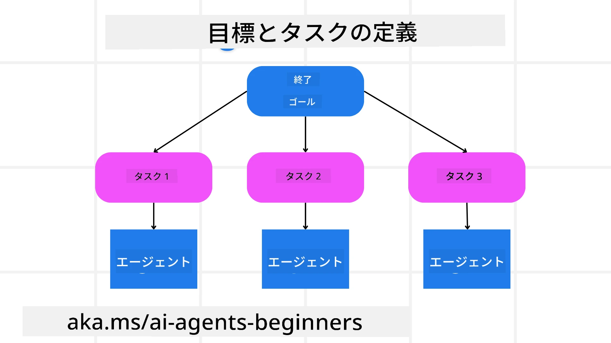

[](https://youtu.be/kPfJ2BrBCMY?si=9pYpPXp0sSbK91Dr)

> _(上の画像をクリックすると、このレッスンのビデオが再生されます)_

# 計画設計

## はじめに

このレッスンでは以下を扱います

* 明確な全体目標の定義と、複雑なタスクを管理しやすいタスクに分割すること。
* 構造化された出力を活用して、より信頼性の高い機械読み取り可能な応答を得ること。
* 動的なタスクや予期せぬ入力を処理するためのイベント駆動型アプローチの適用。

## 学習目標

このレッスンを修了すると、以下のことが理解できるようになります。

* AIエージェントの全体目標を特定し設定し、達成すべきことを明確に認識させる。
* 複雑なタスクを管理しやすいサブタスクに分解し、それらを論理的な順序で整理する。
* エージェントに適切なツール（例えば検索ツールやデータ解析ツール）を装備させ、いつどのように使うかを決め、予期しない状況に対処する。
* サブタスクの結果を評価し、パフォーマンスを測定し、最終成果物を改善するために行動を繰り返す。

## 全体目標の定義とタスクの分解



ほとんどの実世界のタスクは一度のステップで取り組むには複雑すぎます。AIエージェントは計画と行動を導く簡潔な目的を必要とします。例えば、目標として次のようなものを考えてみましょう。

    「3日間の旅行日程を作成する。」

これは簡単に述べられますが、まだ洗練が必要です。目標が明確であればあるほど、エージェント（および人間の協力者）が適切な成果、例えばフライトオプション、ホテルの推奨、アクティビティ提案を含めた包括的な日程作成に集中しやすくなります。

### タスクの分解

大規模または複雑なタスクは、より小さく目標指向のサブタスクに分割することで管理しやすくなります。
旅行日程の例では、次のように目標を分解できます。

* フライト予約
* ホテル予約
* レンタカー
* パーソナライズ

それぞれのサブタスクは専任のエージェントやプロセスに任せることができます。あるエージェントは最適なフライトを検索し、別のエージェントはホテル予約に専念し、といった具合です。調整役や「下流」のエージェントがこれらの結果をひとつの統合された日程にまとめて最終ユーザーに提供します。

このモジュール方式は段階的な改良も可能にします。例えば、食事の推奨や地元のアクティビティ提案のための専門エージェントを追加し、日程を徐々に洗練させることができます。

### 構造化された出力

大規模言語モデル（LLM）は、JSONのような構造化出力を生成でき、これは下流のエージェントやサービスが解析・処理しやすくなります。これは、計画の出力を受けた後にタスクを実行するマルチエージェント環境で特に有効です。

以下のPythonスニペットは、シンプルな計画エージェントが目標をサブタスクに分解し構造化された計画を生成する例です。

```python
from pydantic import BaseModel
from enum import Enum
from typing import List, Optional, Union
import json
import os
from typing import Optional
from pprint import pprint
from agent_framework.azure import AzureAIProjectAgentProvider
from azure.identity import AzureCliCredential

class AgentEnum(str, Enum):
    FlightBooking = "flight_booking"
    HotelBooking = "hotel_booking"
    CarRental = "car_rental"
    ActivitiesBooking = "activities_booking"
    DestinationInfo = "destination_info"
    DefaultAgent = "default_agent"
    GroupChatManager = "group_chat_manager"

# 旅行サブタスクモデル
class TravelSubTask(BaseModel):
    task_details: str
    assigned_agent: AgentEnum  # タスクをエージェントに割り当てたい

class TravelPlan(BaseModel):
    main_task: str
    subtasks: List[TravelSubTask]
    is_greeting: bool

provider = AzureAIProjectAgentProvider(credential=AzureCliCredential())

# ユーザーメッセージを定義する
system_prompt = """You are a planner agent.
    Your job is to decide which agents to run based on the user's request.
    Provide your response in JSON format with the following structure:
{'main_task': 'Plan a family trip from Singapore to Melbourne.',
 'subtasks': [{'assigned_agent': 'flight_booking',
               'task_details': 'Book round-trip flights from Singapore to '
                               'Melbourne.'}
    Below are the available agents specialised in different tasks:
    - FlightBooking: For booking flights and providing flight information
    - HotelBooking: For booking hotels and providing hotel information
    - CarRental: For booking cars and providing car rental information
    - ActivitiesBooking: For booking activities and providing activity information
    - DestinationInfo: For providing information about destinations
    - DefaultAgent: For handling general requests"""

user_message = "Create a travel plan for a family of 2 kids from Singapore to Melbourne"

response = client.create_response(input=user_message, instructions=system_prompt)

response_content = response.output_text
pprint(json.loads(response_content))
```

### マルチエージェントオーケストレーションを用いた計画エージェント

この例では、Semantic Router Agentがユーザーのリクエスト（例：「旅行のホテルプランを作成してほしい」）を受け取ります。

計画者は以下を行います：

* ホテルプランの生成：計画者はユーザーのメッセージを受け取り、システムプロンプト（利用可能なエージェントの詳細を含む）に基づいて構造化された旅行プランを生成します。
* エージェントとツールの一覧表示：エージェントレジストリは、フライト、ホテル、レンタカー、アクティビティなどの各エージェントと、それらが提供する機能やツールのリストを保持します。
* プランの対象エージェントへのルーティング：サブタスクの数に応じて、計画者は単一タスクの場合は専用エージェントに直接メッセージを送信し、複数タスクの場合はグループチャットマネージャーを通じてマルチエージェントの協働を調整します。
* 結果の要約：最後に、計画者は生成されたプランを明確に要約します。
以下のPythonコード例がこれらの手順を示しています。

```python

from pydantic import BaseModel

from enum import Enum
from typing import List, Optional, Union

class AgentEnum(str, Enum):
    FlightBooking = "flight_booking"
    HotelBooking = "hotel_booking"
    CarRental = "car_rental"
    ActivitiesBooking = "activities_booking"
    DestinationInfo = "destination_info"
    DefaultAgent = "default_agent"
    GroupChatManager = "group_chat_manager"

# 旅行のサブタスクモデル

class TravelSubTask(BaseModel):
    task_details: str
    assigned_agent: AgentEnum # タスクをエージェントに割り当てたい

class TravelPlan(BaseModel):
    main_task: str
    subtasks: List[TravelSubTask]
    is_greeting: bool
import json
import os
from typing import Optional

from agent_framework.azure import AzureAIProjectAgentProvider
from azure.identity import AzureCliCredential

# クライアントを作成する

provider = AzureAIProjectAgentProvider(credential=AzureCliCredential())

from pprint import pprint

# ユーザーメッセージを定義する

system_prompt = """You are a planner agent.
    Your job is to decide which agents to run based on the user's request.
    Below are the available agents specialized in different tasks:
    - FlightBooking: For booking flights and providing flight information
    - HotelBooking: For booking hotels and providing hotel information
    - CarRental: For booking cars and providing car rental information
    - ActivitiesBooking: For booking activities and providing activity information
    - DestinationInfo: For providing information about destinations
    - DefaultAgent: For handling general requests"""

user_message = "Create a travel plan for a family of 2 kids from Singapore to Melbourne"

response = client.create_response(input=user_message, instructions=system_prompt)

response_content = response.output_text

# レスポンス内容をJSONとして読み込んだ後に出力する

pprint(json.loads(response_content))
```

以下は前述のコードの出力であり、この構造化された出力を利用して`assigned_agent`にルーティングし、最終ユーザーに旅行プランを要約して提供できます。

```json
{
    "is_greeting": "False",
    "main_task": "Plan a family trip from Singapore to Melbourne.",
    "subtasks": [
        {
            "assigned_agent": "flight_booking",
            "task_details": "Book round-trip flights from Singapore to Melbourne."
        },
        {
            "assigned_agent": "hotel_booking",
            "task_details": "Find family-friendly hotels in Melbourne."
        },
        {
            "assigned_agent": "car_rental",
            "task_details": "Arrange a car rental suitable for a family of four in Melbourne."
        },
        {
            "assigned_agent": "activities_booking",
            "task_details": "List family-friendly activities in Melbourne."
        },
        {
            "assigned_agent": "destination_info",
            "task_details": "Provide information about Melbourne as a travel destination."
        }
    ]
}
```

上記のコード例を含むノートブックは[こちら](07-python-agent-framework.ipynb)で利用可能です。

### 反復的な計画

一部のタスクでは、あるサブタスクの結果が次に影響を与えるため、往復や再計画が必要になります。例えば、エージェントがフライト予約中に予期せぬデータ形式を発見した場合、ホテル予約に進む前に戦略を適応する必要があります。

加えて、ユーザーのフィードバック（例：より早いフライトを希望する人間の判断）が部分的な再計画を引き起こすこともあります。この動的で反復的なアプローチにより、最終解決策は実際の制約や変化するユーザーの好みに適合します。

例：サンプルコード

```python
from agent_framework.azure import AzureAIProjectAgentProvider
from azure.identity import AzureCliCredential
#.. 前のコードと同じで、ユーザーの履歴と現在のプランを渡します

system_prompt = """You are a planner agent to optimize the
    Your job is to decide which agents to run based on the user's request.
    Below are the available agents specialized in different tasks:
    - FlightBooking: For booking flights and providing flight information
    - HotelBooking: For booking hotels and providing hotel information
    - CarRental: For booking cars and providing car rental information
    - ActivitiesBooking: For booking activities and providing activity information
    - DestinationInfo: For providing information about destinations
    - DefaultAgent: For handling general requests"""

user_message = "Create a travel plan for a family of 2 kids from Singapore to Melbourne"

response = client.create_response(
    input=user_message,
    instructions=system_prompt,
    context=f"Previous travel plan - {TravelPlan}",
)
# .. 再計画し、タスクをそれぞれのエージェントに送信します
```

より包括的な計画には、複雑なタスク解決に関する <a href="https://www.microsoft.com/research/articles/magentic-one-a-generalist-multi-agent-system-for-solving-complex-tasks" target="_blank">Magnetic One ブログ記事</a> をご覧ください。

## まとめ

本記事では、利用可能なエージェントを動的に選択できる計画者の例を紹介しました。計画者の出力はタスクを分解し、エージェントに割り当てて実行可能にします。エージェントはタスク実行に必要な関数やツールにアクセスできることが前提です。加えてリフレクション、要約、ラウンドロビンチャットなど他のパターンも組み込むことでさらにカスタマイズが可能です。

## 追加リソース

Magnetic One は複雑なタスクを解決するためのジェネラリストなマルチエージェントシステムで、複数の難しいエージェントベンチマークで優れた結果を達成しています。参考：<a href="https://www.microsoft.com/research/articles/magentic-one-a-generalist-multi-agent-system-for-solving-complex-tasks" target="_blank">Magnetic One</a>。この実装ではオーケストレーターがタスク特化型の計画を作成し、利用可能なエージェントに委任します。計画に加え、オーケストレーターはタスクの進捗を監視し必要に応じて再計画するトラッキング機能を備えています。

### 計画設計パターンについてさらに質問がありますか？

[Microsoft Foundry Discord](https://aka.ms/ai-agents/discord) に参加して他の学習者と交流し、オフィスアワーに参加してAIエージェントに関する質問を解決しましょう。

## 前のレッスン

[信頼できるAIエージェントの構築](../06-building-trustworthy-agents/README.md)

## 次のレッスン

[マルチエージェント設計パターン](../08-multi-agent/README.md)

---

<!-- CO-OP TRANSLATOR DISCLAIMER START -->
**免責事項**：  
本書類はAI翻訳サービス「Co-op Translator」（https://github.com/Azure/co-op-translator）を使用して翻訳されています。正確性の確保に努めておりますが、自動翻訳には誤りや不正確な箇所が含まれる可能性があります。原文の言語で書かれた文書を正式な情報源としてご参照ください。重要な情報については専門の人間翻訳をご利用いただくことを推奨します。本翻訳の使用により生じたいかなる誤解や誤解釈についても、当方は責任を負いかねます。
<!-- CO-OP TRANSLATOR DISCLAIMER END -->