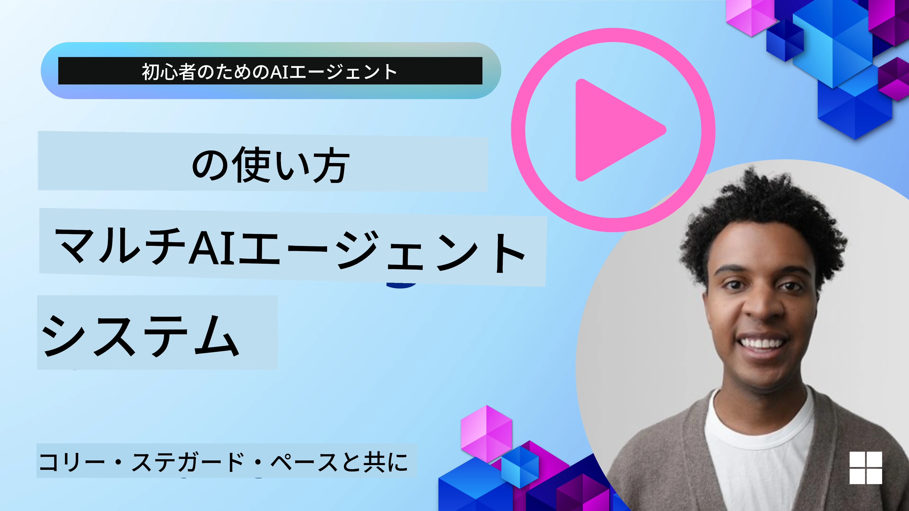
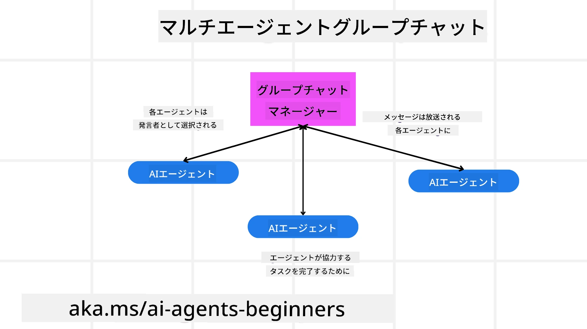
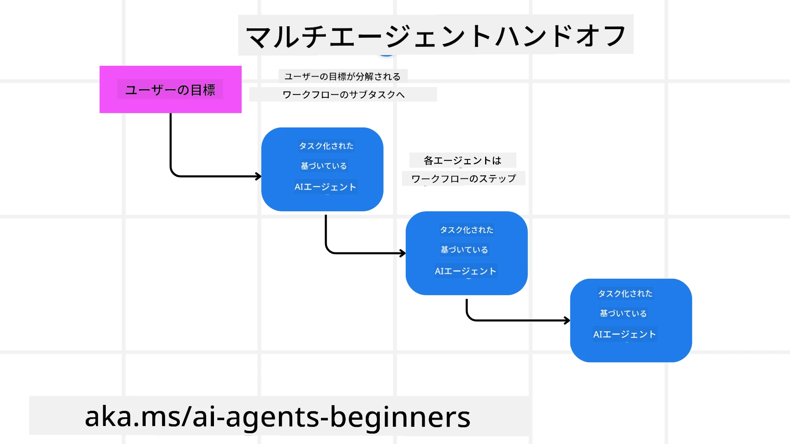
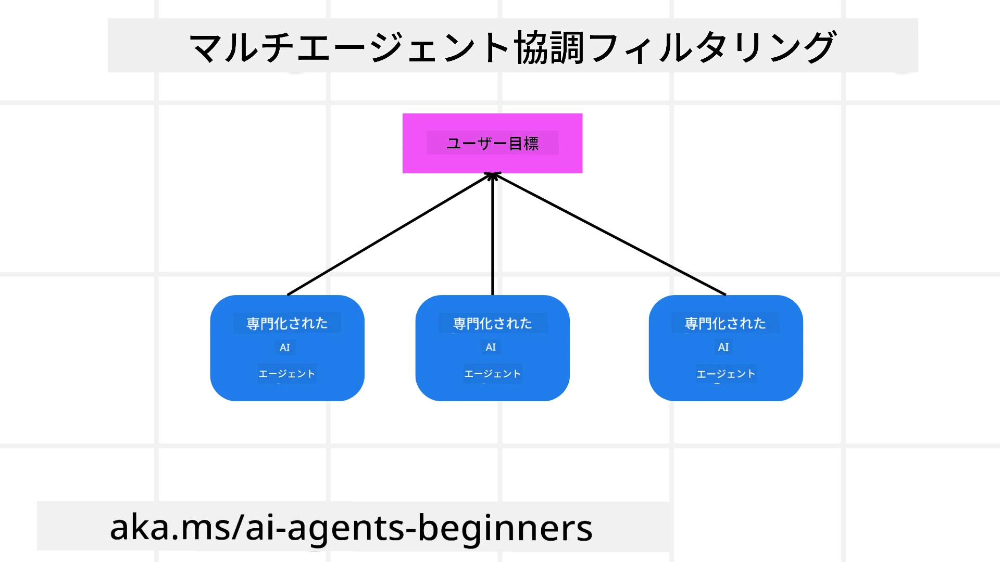

> _(上の画像をクリックすると、このレッスンのビデオが表示されます)_

# マルチエージェント設計パターン

複数のエージェントが関わるプロジェクトに取り組み始めると、マルチエージェント設計パターンを考慮する必要があります。しかし、いつマルチエージェントに切り替えるべきか、その利点は何かがすぐに明確になるとは限りません。

## はじめに

このレッスンでは、以下の質問に答えることを目指します：

- マルチエージェントが適用されるシナリオとは何か？
- 複数のエージェントを使うことの利点は、単一のエージェントが複数のタスクをこなすのと比べて何か？
- マルチエージェント設計パターンの実装における構成要素は何か？
- 複数のエージェントがどのように相互作用しているかをどのように可視化できるか？

## 学習目標

このレッスンの後、以下ができるようになっているはずです：

- マルチエージェントが適用されるシナリオを特定できる
- マルチエージェントの利点を認識できる
- マルチエージェント設計パターンの構成要素を理解できる

大きな視点は？

*マルチエージェントとは、複数のエージェントが協力して共通の目標を達成するための設計パターンです*。

このパターンは、ロボティクス、自律システム、分散コンピューティングなど、さまざまな分野で広く使われています。

## マルチエージェントが適用されるシナリオ

では、どんなシナリオがマルチエージェントを使うのに適しているでしょうか？答えは、多くのシナリオで複数のエージェントを使うことが有利で、特に以下の場合です：

- **大規模な作業負荷**：大きな作業負荷はより小さなタスクに分割し、異なるエージェントに割り当てることができ、並列処理により速い完了が可能です。例としては、大量データ処理のタスクが挙げられます。
- **複雑なタスク**：大規模作業負荷と同様に、複雑なタスクも小さなサブタスクに分割し、それぞれ専門のエージェントに割り当てられます。例えば、自動運転車では、異なるエージェントがナビゲーション、障害物検知、他車両との通信を管理しています。
- **多様な専門知識**：異なるエージェントが多様な専門知識を持ち、単一エージェントより効率的に異なる側面のタスクを処理できます。例えば、医療分野では診断、治療計画、患者のモニタリングを担当するエージェントが存在します。

## 単一エージェントよりマルチエージェントを使う利点

単一エージェントシステムは単純なタスクには適していますが、複雑なタスクでは複数エージェントを使うことに次のような利点があります：

- **専門化**：各エージェントは特定のタスクに特化できます。単一エージェントが全てをこなそうとすると、複雑なタスクで何をすべきか迷い、最適でないタスクを処理する可能性があります。
- **スケーラビリティ**：単一エージェントを過負荷にするよりも、より多くのエージェントを追加してシステムをスケールする方が容易です。
- **障害耐性**：ひとつのエージェントが失敗しても、他のエージェントは動作を続けられ、システムの信頼性が保たれます。

例として、ユーザーのために旅行を予約するタスクを考えましょう。単一エージェントは飛行機予約、ホテル、レンタカーなど全ての側面を管理しなければならず、そのためのツールを持つ必要があります。これは複雑でモノリシックなシステムとなり、維持と拡張が困難です。一方、マルチエージェントシステムでは、飛行機検索、ホテル予約、レンタカー予約に特化した異なるエージェントを持つことができ、よりモジュール的で維持しやすく拡張可能なシステムとなります。

これを、個人経営の旅行代理店とフランチャイズの旅行代理店で例えることができます。個人経営店は単一エージェントが全工程を担当し、フランチャイズは異なるエージェントが各工程を担当します。

## マルチエージェント設計パターンの構成要素

マルチエージェント設計パターンを実装する前に、その構成要素を理解する必要があります。

再び、ユーザーの旅行予約の例で具体化してみましょう。この場合、構成要素には以下が含まれます：

- **エージェント間通信**：飛行機検索、ホテル予約、レンタカー予約のエージェントは、ユーザーの好みや制約に関する情報を通信・共有する必要があります。具体的には、飛行機予約エージェントがホテル予約エージェントと連携し、同じ旅行日程に合わせてホテルを予約する必要があります。つまり、*どのエージェントが情報を共有し、どのように共有するか*を決める必要があります。
- **調整メカニズム**：エージェントがユーザーの好みや制約を満たすために行動を調整する必要があります。例えば、ユーザーは空港近くのホテルを希望し、制約としてレンタカーは空港でしか借りられない場合、ホテル予約エージェントはレンタカー予約エージェントと協調します。つまり、*どのようにエージェントが行動を調整するか*を決める必要があります。
- **エージェントアーキテクチャ**：エージェントは意思決定を行い、ユーザーとの相互作用から学習する内部構造を持つ必要があります。例えば、飛行機検索エージェントは、どのフライトをユーザーに推奨するかを決定できなければなりません。つまり、*エージェントがどのように意思決定しユーザーとのやり取りから学ぶか*を決める必要があります。たとえば、飛行機検索エージェントは過去のユーザーの好みに基づいてフライトを推奨するために機械学習モデルを使うことが考えられます。
- **マルチエージェント間相互作用の可視性**：複数のエージェントがどのように相互作用しているかを可視化できる必要があります。これにはエージェントの活動と相互作用を追跡するためのツールや手法が必要です。ログ記録、監視ツール、可視化ツール、性能指標の形で提供されることがあります。
- **マルチエージェントパターン**：中央集権型、分散型、ハイブリッド型など、マルチエージェントシステムを実装するためのさまざまなパターンがあります。ケースに最適なパターンを選ぶ必要があります。
- **人間の介在**：ほとんどの場合、人間が介在し、エージェントがいつ人間の介入を求めるか指示する必要があります。例えば、ユーザーが特定の未推奨のホテルやフライトを要求したり、予約前に確認を求めたりする場合が該当します。

## マルチエージェント間相互作用の可視性

複数のエージェントがどのように相互作用しているかを可視化することが重要です。この可視性はデバッグ、最適化、システム全体の効果の確保に必須です。そのためにエージェントの活動や相互作用を追跡するためのツールや手法が必要です。ログ記録・監視ツール、可視化ツール、性能指標の形式が考えられます。

例えば、旅行予約のケースでは、各エージェントのステータス、ユーザーの好みや制約、エージェント間のやり取りを示すダッシュボードを用意できます。このダッシュボードはユーザーの旅行日程、飛行機エージェントが推奨したフライト、ホテルエージェントの推奨ホテル、レンタカーエージェントの推奨車両を表示し、エージェントの相互作用やユーザーの要望・制約が満たされているかを把握できます。

以下、それぞれの側面を詳しく見てみましょう。

- **ログ記録・監視ツール**：各エージェントの行動をログに記録します。ログには、行動を起こしたエージェント、行動内容、実行時間、結果などの情報が含まれ、デバッグや最適化に利用されます。

- **可視化ツール**：エージェントの相互作用を直感的に理解するためのグラフやフロー図を用います。これにより、ボトルネックや非効率、その他問題点が特定しやすくなります。

- **性能指標**：タスク完了にかかる時間、単位時間あたりの完了タスク数、エージェントの推奨精度などを計測し、システムの効果を評価します。改善点の特定や最適化に役立ちます。

## マルチエージェントパターン

マルチエージェントアプリを作る際に使える具体的なパターンを見ていきましょう。注目すべき興味深いパターンを紹介します：

### グループチャット

このパターンは、複数のエージェントが互いに通信できるグループチャットアプリを作りたい場合に有効です。典型的な用途はチームコラボレーション、カスタマーサポート、ソーシャルネットワーキングなどです。

このパターンでは、各エージェントがグループチャットのユーザーを表し、メッセージはメッセージングプロトコルによりエージェント間で交換されます。エージェントはグループにメッセージを送信し、受信し、他のエージェントへ返信します。

中央サーバーを経由して全メッセージをルーティングする中央集権型アーキテクチャか、メッセージを直接交換する分散型アーキテクチャで実装できます。

### ハンドオフ

このパターンは、複数のエージェントがタスクを互いに引き継ぐアプリケーションを作りたい場合に有効です。

典型的な用途はカスタマーサポート、タスク管理、ワークフロー自動化です。

このパターンでは、各エージェントがタスクやワークフローのステップを表し、事前定義されたルールに基づいてタスクを他のエージェントに引き継ぐことができます。

### 協調フィルタリング

このパターンは、複数のエージェントが協力してユーザーへの推薦を作成するアプリケーションに有効です。

複数のエージェントが協働する理由は、各エージェントが異なる専門知識を持ち、推薦プロセスで異なる視点から貢献できるためです。

例えば、ユーザーが株式市場での最適な株を推薦してほしい場合を考えましょう。

- **業界専門家**：特定業界に詳しいエージェント。
- **テクニカル分析**：技術的分析に長けたエージェント。
- **ファンダメンタル分析**：基礎的分析に詳しいエージェント。

これらが協力することで、より包括的な推薦がユーザーに提供されます。

## シナリオ：返金プロセス

顧客が商品の返金を求めるシナリオを考えます。このプロセスにはかなり多くのエージェントが関与しますが、このプロセス専用のエージェントと他のプロセスでも使える一般エージェントに分けましょう。

**返金プロセス専用のエージェント**：

返金プロセスに関わるエージェントの例は以下の通りです：

- **顧客エージェント**：顧客を表し、返金プロセスの開始を担当。
- **販売者エージェント**：販売者を表し、返金処理を担当。
- **支払いエージェント**：支払い処理を担い、顧客への返金を行う。
- **解決エージェント**：返金プロセス中に発生する問題を解決する役割。
- **コンプライアンスエージェント**：返金プロセスが規則や方針に準拠しているかを監視。

**一般的なエージェント**：

他の業務領域でも利用できるエージェントです。

- **配送エージェント**：商品を販売者に返送する配送業務を担当。このエージェントは返金プロセスだけでなく、通常の購入に伴う商品の配送にも使用可能。
- **フィードバックエージェント**：顧客からのフィードバック収集を担当。返金プロセス中だけでなく、任意のタイミングで利用される。
- **エスカレーションエージェント**：問題解決のためのサポートレベル引き上げを担当。問題をエスカレートする必要があるあらゆるプロセスで使用可能。
- **通知エージェント**：返金プロセスの各段階で顧客へ通知を送信。
- **分析エージェント**：返金プロセス関連のデータ分析を担当。
- **監査エージェント**：返金プロセスの適切な実施を監査。
- **報告エージェント**：返金プロセスに関する報告書の作成を担当。
- **ナレッジエージェント**：返金や他の業務に関する知識ベースを管理。
- **セキュリティエージェント**：返金プロセスの安全性確保を担当。
- **品質エージェント**：返金プロセスの品質を確保。

返金プロセス専用および他業務でも使える多くのエージェントがリストされました。これにより、マルチエージェントシステムでどのエージェントを使うかの判断材料になるはずです。

## 課題

カスタマーサポートプロセスのマルチエージェントシステムを設計してください。プロセスに関わるエージェント、その役割・責任、相互作用方法を特定してください。カスタマーサポート専用のエージェントと、他業務でも使える一般エージェントの両方を考慮してください。
> 次の解決策を読む前に少し考えてみてください。考えているよりも多くのエージェントが必要になるかもしれません。

> TIP: カスタマーサポートプロセスの異なる段階について考え、また任意のシステムに必要なエージェントも考慮してください。

## Solution

[Solution](./solution/solution.md)

## Knowledge checks

Question: いつマルチエージェントの使用を検討すべきですか？

- [ ] A1: 小規模な作業量と単純なタスクがある場合。
- [ ] A2: 大規模な作業量がある場合。
- [ ] A3: 単純なタスクがある場合。

[Solution quiz](./solution/solution-quiz.md)

## Summary

このレッスンでは、マルチエージェント設計パターンについて考察しました。マルチエージェントが適用されるシナリオ、単一エージェントに対するマルチエージェントの利点、マルチエージェント設計パターンを実装するための構成要素、そして複数のエージェントがどのように相互作用しているかを可視化する方法について学びました。

### マルチエージェント設計パターンについてさらに質問がありますか？

[Microsoft Foundry Discord](https://aka.ms/ai-agents/discord)に参加して、他の学習者と交流したり、オフィスアワーに参加してAIエージェントに関する質問に回答を得ましょう。

## Additional resources

- <a href="https://learn.microsoft.com/azure/ai-services/agents/overview" target="_blank">Microsoft Agent Framework ドキュメント</a>
- <a href="https://www.analyticsvidhya.com/blog/2024/10/agentic-design-patterns/" target="_blank">エージェンティックデザインパターン</a>

## Previous Lesson

[Planning Design](../07-planning-design/README.md)

## Next Lesson

[Metacognition in AI Agents](../09-metacognition/README.md)

---

<!-- CO-OP TRANSLATOR DISCLAIMER START -->
**免責事項**：  
本書類はAI翻訳サービス「Co-op Translator」（https://github.com/Azure/co-op-translator）を使用して翻訳されています。正確性を期しておりますが、自動翻訳には誤りや不正確な部分が含まれる可能性があることをご承知ください。原文が権威ある情報源とみなされます。重要な情報については、専門の人間による翻訳を推奨します。本翻訳の使用により生じたいかなる誤解や誤訳についても、一切の責任を負いかねます。
<!-- CO-OP TRANSLATOR DISCLAIMER END -->