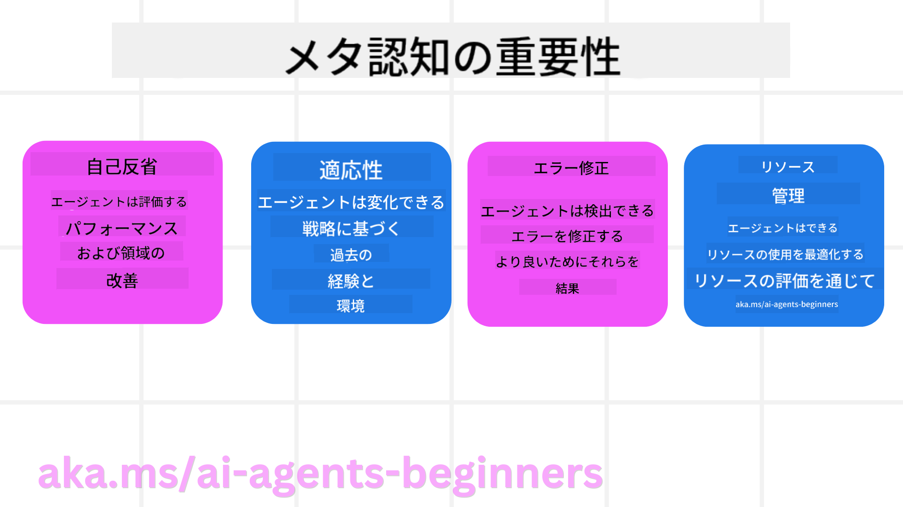
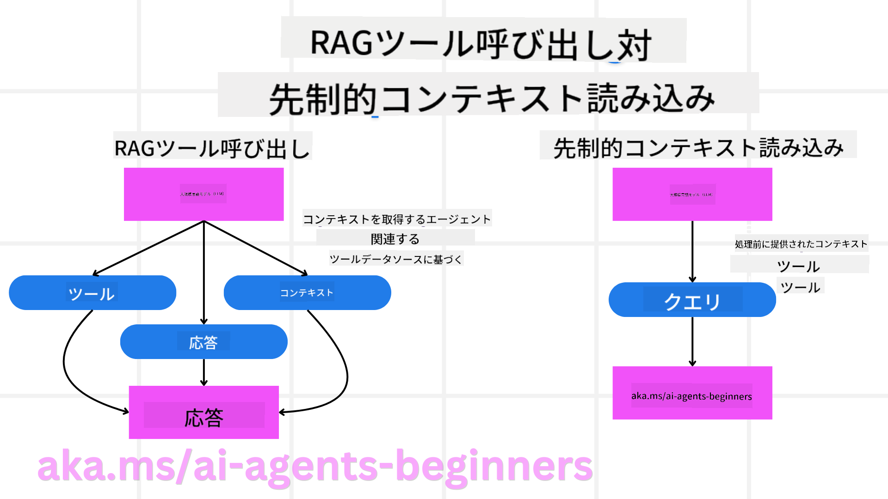

<!--
CO_OP_TRANSLATOR_METADATA:
{
  "original_hash": "5f0deef171fc3a68d5d3d770a8bfb03d",
  "translation_date": "2025-08-30T07:45:07+00:00",
  "source_file": "09-metacognition/README.md",
  "language_code": "ja"
}
-->
[](https://youtu.be/His9R6gw6Ec?si=3_RMb8VprNvdLRhX)

> _(上の画像をクリックすると、このレッスンの動画をご覧いただけます)_
# AIエージェントにおけるメタ認知

## はじめに

AIエージェントにおけるメタ認知に関するレッスンへようこそ！この章は、AIエージェントがどのように自分自身の思考プロセスを考えることができるのかに興味を持つ初心者向けに設計されています。このレッスンを終える頃には、重要な概念を理解し、AIエージェント設計においてメタ認知を応用するための実践的な例を身につけることができるでしょう。

## 学習目標

このレッスンを修了すると、以下のことができるようになります：

1. エージェント定義における推論ループの影響を理解する。
2. 自己修正型エージェントを支援するための計画および評価技術を使用する。
3. タスクを達成するためにコードを操作できるエージェントを作成する。

## メタ認知の概要

メタ認知とは、自分自身の思考について考える高次の認知プロセスを指します。AIエージェントにおいては、自己認識や過去の経験に基づいて自分の行動を評価し、調整する能力を意味します。「思考について考える」というメタ認知は、エージェント型AIシステムの開発において重要な概念です。これは、AIシステムが自分自身の内部プロセスを認識し、監視し、調整し、適応する能力を持つことを含みます。私たちが状況を読み取ったり、問題を分析したりするのと同じように、この自己認識はAIシステムがより良い意思決定を行い、エラーを特定し、時間とともにパフォーマンスを向上させるのに役立ちます。これは、チューリングテストやAIが支配するかどうかという議論にも関連しています。

エージェント型AIシステムの文脈では、メタ認知は以下のような課題に対処するのに役立ちます：
- **透明性**: AIシステムがその推論や意思決定を説明できるようにする。
- **推論**: 情報を統合し、適切な意思決定を行う能力を向上させる。
- **適応性**: 新しい環境や変化する条件に適応できるようにする。
- **認識**: 環境からのデータを正確に認識し解釈する能力を向上させる。

### メタ認知とは？

メタ認知、つまり「思考について考えること」は、自己認識と自己調整を伴う高次の認知プロセスです。AIの分野では、メタ認知はエージェントが自分の戦略や行動を評価し、適応させる能力を与え、問題解決能力や意思決定能力を向上させます。メタ認知を理解することで、より知的で適応性が高く効率的なAIエージェントを設計することができます。本当のメタ認知では、AIが自分の推論について明示的に推論する様子が見られるでしょう。

**例**: 「安いフライトを優先したけど…直行便を見逃しているかもしれないから再確認しよう。」
- どのように、またはなぜ特定のルートを選んだのかを記録する。
- 前回のユーザーの好みに過度に依存したためにミスをしたと認識し、最終的な推奨だけでなく意思決定戦略そのものを修正する。
- 「ユーザーが『混雑しすぎ』と言った場合、特定の観光地を除外するだけでなく、人気順で常にランク付けする方法が欠陥であると反映するべきだ」といったパターンを診断する。

### AIエージェントにおけるメタ認知の重要性

メタ認知は、AIエージェント設計においていくつかの理由で重要な役割を果たします：



- **自己反省**: エージェントが自分のパフォーマンスを評価し、改善すべき点を特定できる。
- **適応性**: 過去の経験や変化する環境に基づいて戦略を変更できる。
- **エラー修正**: エージェントが自律的にエラーを検出し修正することで、より正確な結果を得られる。
- **リソース管理**: 計画と評価を通じて、時間や計算能力などのリソースを最適化できる。

## AIエージェントの構成要素

メタ認知プロセスに入る前に、AIエージェントの基本的な構成要素を理解することが重要です。AIエージェントは通常、以下の要素で構成されます：

- **ペルソナ**: エージェントの性格や特徴で、ユーザーとのやり取りの仕方を定義する。
- **ツール**: エージェントが実行できる機能や能力。
- **スキル**: エージェントが持つ知識や専門性。

これらの要素が組み合わさって、特定のタスクを実行できる「専門性ユニット」を形成します。

**例**:
旅行エージェントを考えてみましょう。このエージェントは、旅行計画を立てるだけでなく、リアルタイムデータや過去の顧客体験に基づいてルートを調整します。

### 例: 旅行エージェントサービスにおけるメタ認知

AIを活用した旅行エージェントサービスを設計していると想像してください。このエージェント「Travel Agent」は、ユーザーの休暇計画を支援します。メタ認知を組み込むことで、Travel Agentは自己認識や過去の経験に基づいて行動を評価し調整する必要があります。以下は、メタ認知がどのように役立つかの例です：

#### 現在のタスク

ユーザーがパリ旅行を計画するのを手助けする。

#### タスクを完了するためのステップ

1. **ユーザーの好みを収集**: 旅行日程、予算、興味（例：美術館、料理、ショッピング）、特定の要件についてユーザーに尋ねる。
2. **情報を取得**: ユーザーの好みに合ったフライト、宿泊施設、観光地、レストランを検索する。
3. **推奨事項を生成**: フライトの詳細、ホテルの予約、提案されたアクティビティを含む個別の旅程を提供する。
4. **フィードバックに基づいて調整**: 推奨事項に対するユーザーのフィードバックを求め、必要に応じて調整する。

#### 必要なリソース

- フライトおよびホテル予約データベースへのアクセス。
- パリの観光地やレストランに関する情報。
- 過去のやり取りからのユーザーフィードバックデータ。

#### 経験と自己反省

Travel Agentは、メタ認知を使用して自分のパフォーマンスを評価し、過去の経験から学びます。例えば：

1. **ユーザーフィードバックの分析**: Travel Agentは、どの推奨事項が好評だったか、どれがそうでなかったかを確認し、将来の提案を調整します。
2. **適応性**: ユーザーが以前に混雑した場所を嫌うと述べていた場合、Travel Agentは今後、ピーク時の人気観光地を避けるようにします。
3. **エラー修正**: 過去に満室のホテルを提案するなどのエラーを犯した場合、今後は提案前に空室状況をより厳密に確認するよう学習します。

#### 実践的な開発者向け例

以下は、Travel Agentのコードがメタ認知を組み込む際の簡略化された例です：

```python
class Travel_Agent:
    def __init__(self):
        self.user_preferences = {}
        self.experience_data = []

    def gather_preferences(self, preferences):
        self.user_preferences = preferences

    def retrieve_information(self):
        # Search for flights, hotels, and attractions based on preferences
        flights = search_flights(self.user_preferences)
        hotels = search_hotels(self.user_preferences)
        attractions = search_attractions(self.user_preferences)
        return flights, hotels, attractions

    def generate_recommendations(self):
        flights, hotels, attractions = self.retrieve_information()
        itinerary = create_itinerary(flights, hotels, attractions)
        return itinerary

    def adjust_based_on_feedback(self, feedback):
        self.experience_data.append(feedback)
        # Analyze feedback and adjust future recommendations
        self.user_preferences = adjust_preferences(self.user_preferences, feedback)

# Example usage
travel_agent = Travel_Agent()
preferences = {
    "destination": "Paris",
    "dates": "2025-04-01 to 2025-04-10",
    "budget": "moderate",
    "interests": ["museums", "cuisine"]
}
travel_agent.gather_preferences(preferences)
itinerary = travel_agent.generate_recommendations()
print("Suggested Itinerary:", itinerary)
feedback = {"liked": ["Louvre Museum"], "disliked": ["Eiffel Tower (too crowded)"]}
travel_agent.adjust_based_on_feedback(feedback)
```

#### メタ認知が重要な理由

- **自己反省**: エージェントが自分のパフォーマンスを分析し、改善すべき点を特定できる。
- **適応性**: フィードバックや変化する条件に基づいて戦略を変更できる。
- **エラー修正**: エージェントが自律的にミスを検出し修正できる。
- **リソース管理**: 時間や計算能力などのリソースを最適化できる。

メタ認知を組み込むことで、Travel Agentはより個別化され、正確な旅行推奨を提供できるようになり、全体的なユーザー体験が向上します。

---

## 2. エージェントにおける計画

計画は、AIエージェントの行動において重要な要素です。これは、目標を達成するために必要なステップを概説し、現在の状況、リソース、および可能な障害を考慮するプロセスを含みます。

### 計画の要素

- **現在のタスク**: タスクを明確に定義する。
- **タスクを完了するためのステップ**: タスクを管理可能なステップに分解する。
- **必要なリソース**: 必要なリソースを特定する。
- **経験**: 過去の経験を計画に活用する。

**例**:
以下は、Travel Agentがユーザーの旅行計画を効果的に支援するために取るべきステップです：

### Travel Agentのステップ

1. **ユーザーの好みを収集**
   - ユーザーに旅行日程、予算、興味、特定の要件について尋ねる。
   - 例: 「旅行の予定日はいつですか？」 「予算の範囲はどれくらいですか？」 「休暇中にどのようなアクティビティを楽しみたいですか？」

2. **情報を取得**
   - ユーザーの好みに基づいて関連する旅行オプションを検索する。
   - **フライト**: ユーザーの予算と希望する旅行日程に合ったフライトを探す。
   - **宿泊施設**: ユーザーの好みに合った場所、価格、設備のホテルやレンタル物件を見つける。
   - **観光地とレストラン**: ユーザーの興味に合った人気の観光地、アクティビティ、食事オプションを特定する。

3. **推奨事項を生成**
   - 取得した情報を個別の旅程にまとめる。
   - ユーザーの好みに合わせたフライトオプション、ホテル予約、提案されたアクティビティの詳細を提供する。

4. **旅程をユーザーに提示**
   - 提案された旅程をユーザーに共有し、レビューを依頼する。
   - 例: 「こちらはパリ旅行の提案旅程です。フライトの詳細、ホテルの予約、おすすめのアクティビティとレストランが含まれています。ご意見をお聞かせください！」

5. **フィードバックを収集**
   - 提案された旅程に対するユーザーのフィードバックを求める。
   - 例: 「フライトオプションは気に入りましたか？」 「ホテルはご要望に合っていますか？」 「追加または削除したいアクティビティはありますか？」

6. **フィードバックに基づいて調整**
   - ユーザーのフィードバックに基づいて旅程を修正する。
   - フライト、宿泊施設、アクティビティの推奨事項をユーザーの好みにより適合するように変更する。

7. **最終確認**
   - 修正後の旅程をユーザーに最終確認のために提示する。
   - 例: 「フィードバックに基づいて調整を行いました。こちらが更新された旅程です。すべて問題ないかご確認ください。」

8. **予約と確認**
   - ユーザーが旅程を承認したら、フライト、宿泊施設、事前計画されたアクティビティを予約する。
   - 確認の詳細をユーザーに送信する。

9. **継続的なサポートを提供**
   - 旅行前および旅行中に、ユーザーの変更や追加リクエストに対応する。
   - 例: 「旅行中に何かお困りの際は、いつでもお気軽にご連絡ください！」

### 例: ユーザーとのやり取り

```python
class Travel_Agent:
    def __init__(self):
        self.user_preferences = {}
        self.experience_data = []

    def gather_preferences(self, preferences):
        self.user_preferences = preferences

    def retrieve_information(self):
        flights = search_flights(self.user_preferences)
        hotels = search_hotels(self.user_preferences)
        attractions = search_attractions(self.user_preferences)
        return flights, hotels, attractions

    def generate_recommendations(self):
        flights, hotels, attractions = self.retrieve_information()
        itinerary = create_itinerary(flights, hotels, attractions)
        return itinerary

    def adjust_based_on_feedback(self, feedback):
        self.experience_data.append(feedback)
        self.user_preferences = adjust_preferences(self.user_preferences, feedback)

# Example usage within a booing request
travel_agent = Travel_Agent()
preferences = {
    "destination": "Paris",
    "dates": "2025-04-01 to 2025-04-10",
    "budget": "moderate",
    "interests": ["museums", "cuisine"]
}
travel_agent.gather_preferences(preferences)
itinerary = travel_agent.generate_recommendations()
print("Suggested Itinerary:", itinerary)
feedback = {"liked": ["Louvre Museum"], "disliked": ["Eiffel Tower (too crowded)"]}
travel_agent.adjust_based_on_feedback(feedback)
```

## 3. 修正型RAGシステム

まず、RAGツールと予測的コンテキストロードの違いを理解しましょう。



### Retrieval-Augmented Generation (RAG)

RAGは、検索システムと生成モデルを組み合わせたものです。クエリが行われると、検索システムが外部ソースから関連する文書やデータを取得し、この取得した情報を生成モデルへの入力として使用します。これにより、モデルはより正確で文脈に即した応答を生成することができます。

RAGシステムでは、エージェントが知識ベースから関連情報を取得し、それを使用して適切な応答やアクションを生成します。

### 修正型RAGアプローチ

修正型RAGアプローチは、RAG技術を使用してエラーを修正し、AIエージェントの精度を向上させることに焦点を当てています。これには以下が含まれます：

1. **プロンプト技術**: エージェントが関連情報を取得するための特定のプロンプトを使用する。
2. **ツール**: 取得した情報の関連性を評価し、正確な応答を生成するアルゴリズムやメカニズムを実装する。
3. **評価**: エージェントのパフォーマンスを継続的に評価し、精度と効率を向上させるための調整を行う。

#### 例: 検索エージェントにおける修正型RAG

ウェブから情報を取得してユーザーのクエリに回答する検索エージェントを考えてみましょう。修正型RAGアプローチでは以下が含まれます：

1. **プロンプト技術**: ユーザーの入力に基づいて検索クエリを作成する。
2. **ツール**: 自然言語処理と機械学習アルゴリズムを使用して検索結果をランク付けし、フィルタリングする。
3. **評価**: ユーザーフィードバックを分析して、取得した情報の不正確さを特定し修正する。

### 旅行エージェントにおける修正型RAG

修正型RAG（Retrieval-Augmented Generation）は、情報を取得して生成するAIの能力を強化し、不正確さを修正します。Travel Agentが修正型RAGアプローチを使用して、より正確で関連性の高い旅行推奨を提供する方法を見てみましょう。

これには以下が含まれます：

- **プロンプト技術**: エージェントが関連情報を取得するための特定のプロンプトを使用する。
- **ツール**: 取得した情報の関連性を評価し、正確な応答を生成するアルゴリズムやメカニズムを実装する。
- **評価**: エージェントのパフォーマンスを継続的に評価し、精度と効率を向上させるための調整を行う。

#### 修正型RAGをTravel Agentに実装するためのステップ

1. **初回のユーザーとのやり取り**
   - Travel Agentは、目的地、旅行日程、予算、興味など、ユーザーの初期の好みを収集する。
   - 例:

     ```python
     preferences = {
         "destination": "Paris",
         "dates": "2025-04-01 to 2025-04-10",
         "budget": "moderate",
         "interests": ["museums", "cuisine"]
     }
     ```

2. **情報の取得**
   - Travel Agentは、ユーザーの好みに基づいてフライト、宿泊施設、観光地、レストランに関する情報を取得する。
   - 例:

     @@CODE
```python
class Travel_Agent:
    def __init__(self):
        self.user_preferences = {}
        self.experience_data = []

    def gather_preferences(self, preferences):
        self.user_preferences = preferences

    def retrieve_information(self):
        flights = search_flights(self.user_preferences)
        hotels = search_hotels(self.user_preferences)
        attractions = search_attractions(self.user_preferences)
        return flights, hotels, attractions

    def generate_recommendations(self):
        flights, hotels, attractions = self.retrieve_information()
        itinerary = create_itinerary(flights, hotels, attractions)
        return itinerary

    def adjust_based_on_feedback(self, feedback):
        self.experience_data.append(feedback)
        self.user_preferences = adjust_preferences(self.user_preferences, feedback)
        new_itinerary = self.generate_recommendations()
        return new_itinerary

# Example usage
travel_agent = Travel_Agent()
preferences = {
    "destination": "Paris",
    "dates": "2025-04-01 to 2025-04-10",
    "budget": "moderate",
    "interests": ["museums", "cuisine"]
}
travel_agent.gather_preferences(preferences)
itinerary = travel_agent.generate_recommendations()
print("Suggested Itinerary:", itinerary)
feedback = {"liked": ["Louvre Museum"], "disliked": ["Eiffel Tower (too crowded)"]}
new_itinerary = travel_agent.adjust_based_on_feedback(feedback)
print("Updated Itinerary:", new_itinerary)
```

### 事前コンテキスト読み込み

事前コンテキスト読み込みとは、クエリを処理する前に関連するコンテキストや背景情報をモデルに読み込むことを指します。これにより、モデルは最初からこの情報にアクセスでき、追加データを取得する必要なく、より情報に基づいた応答を生成することが可能になります。

以下は、Pythonで旅行代理店アプリケーションの事前コンテキスト読み込みの簡単な例です：

```python
class TravelAgent:
    def __init__(self):
        # Pre-load popular destinations and their information
        self.context = {
            "Paris": {"country": "France", "currency": "Euro", "language": "French", "attractions": ["Eiffel Tower", "Louvre Museum"]},
            "Tokyo": {"country": "Japan", "currency": "Yen", "language": "Japanese", "attractions": ["Tokyo Tower", "Shibuya Crossing"]},
            "New York": {"country": "USA", "currency": "Dollar", "language": "English", "attractions": ["Statue of Liberty", "Times Square"]},
            "Sydney": {"country": "Australia", "currency": "Dollar", "language": "English", "attractions": ["Sydney Opera House", "Bondi Beach"]}
        }

    def get_destination_info(self, destination):
        # Fetch destination information from pre-loaded context
        info = self.context.get(destination)
        if info:
            return f"{destination}:\nCountry: {info['country']}\nCurrency: {info['currency']}\nLanguage: {info['language']}\nAttractions: {', '.join(info['attractions'])}"
        else:
            return f"Sorry, we don't have information on {destination}."

# Example usage
travel_agent = TravelAgent()
print(travel_agent.get_destination_info("Paris"))
print(travel_agent.get_destination_info("Tokyo"))
```

#### 説明

1. **初期化（`__init__` メソッド）**: `TravelAgent` クラスは、パリ、東京、ニューヨーク、シドニーなどの人気のある目的地に関する情報を含む辞書を事前に読み込みます。この辞書には、各目的地の国、通貨、言語、主要な観光地などの詳細が含まれています。

2. **情報の取得（`get_destination_info` メソッド）**: ユーザーが特定の目的地について問い合わせると、`get_destination_info` メソッドが事前に読み込まれたコンテキスト辞書から関連情報を取得します。

事前にコンテキストを読み込むことで、旅行代理店アプリケーションはリアルタイムで外部ソースから情報を取得する必要がなく、迅速にユーザーの問い合わせに応答できます。これにより、アプリケーションの効率性と応答性が向上します。

### ゴールを設定してからのプランのブートストラップ

ゴールを設定してからプランをブートストラップするとは、明確な目標や達成したい結果を最初に定義することを指します。このゴールを事前に設定することで、モデルは反復プロセス全体を通じてそれを指針として使用できます。これにより、各反復が目標達成に向けて進むことを保証し、プロセスがより効率的で集中したものになります。

以下は、旅行代理店がゴールを設定してからプランをブートストラップする例です：

### シナリオ

旅行代理店が顧客のためにカスタマイズされた休暇プランを作成したいとします。目標は、顧客の満足度を最大化する旅行日程を、予算と好みに基づいて作成することです。

### ステップ

1. 顧客の好みと予算を定義する。
2. これらの好みに基づいて初期プランを作成する。
3. プランを反復して洗練し、顧客の満足度を最適化する。

#### Pythonコード

```python
class TravelAgent:
    def __init__(self, destinations):
        self.destinations = destinations

    def bootstrap_plan(self, preferences, budget):
        plan = []
        total_cost = 0

        for destination in self.destinations:
            if total_cost + destination['cost'] <= budget and self.match_preferences(destination, preferences):
                plan.append(destination)
                total_cost += destination['cost']

        return plan

    def match_preferences(self, destination, preferences):
        for key, value in preferences.items():
            if destination.get(key) != value:
                return False
        return True

    def iterate_plan(self, plan, preferences, budget):
        for i in range(len(plan)):
            for destination in self.destinations:
                if destination not in plan and self.match_preferences(destination, preferences) and self.calculate_cost(plan, destination) <= budget:
                    plan[i] = destination
                    break
        return plan

    def calculate_cost(self, plan, new_destination):
        return sum(destination['cost'] for destination in plan) + new_destination['cost']

# Example usage
destinations = [
    {"name": "Paris", "cost": 1000, "activity": "sightseeing"},
    {"name": "Tokyo", "cost": 1200, "activity": "shopping"},
    {"name": "New York", "cost": 900, "activity": "sightseeing"},
    {"name": "Sydney", "cost": 1100, "activity": "beach"},
]

preferences = {"activity": "sightseeing"}
budget = 2000

travel_agent = TravelAgent(destinations)
initial_plan = travel_agent.bootstrap_plan(preferences, budget)
print("Initial Plan:", initial_plan)

refined_plan = travel_agent.iterate_plan(initial_plan, preferences, budget)
print("Refined Plan:", refined_plan)
```

#### コードの説明

1. **初期化（`__init__` メソッド）**: `TravelAgent` クラスは、名前、費用、アクティビティタイプなどの属性を持つ潜在的な目的地のリストで初期化されます。

2. **プランのブートストラップ（`bootstrap_plan` メソッド）**: このメソッドは、顧客の好みと予算に基づいて初期旅行プランを作成します。目的地リストを反復し、顧客の好みに一致し、予算内に収まる場合にプランに追加します。

3. **好みの一致（`match_preferences` メソッド）**: このメソッドは、目的地が顧客の好みに一致するかどうかを確認します。

4. **プランの反復（`iterate_plan` メソッド）**: このメソッドは、現在のプラン内の各目的地を、顧客の好みと予算制約を考慮してより良い選択肢に置き換えることで、初期プランを洗練します。

5. **費用の計算（`calculate_cost` メソッド）**: このメソッドは、現在のプランの総費用を計算し、新しい目的地を含めた場合の費用も考慮します。

#### 使用例

- **初期プラン**: 旅行代理店は、観光を好む顧客と2000ドルの予算に基づいて初期プランを作成します。
- **洗練されたプラン**: 旅行代理店はプランを反復し、顧客の好みと予算を最適化します。

ゴール（例：顧客満足度の最大化）を明確に設定し、それを基にプランをブートストラップし、反復して洗練することで、旅行代理店は顧客にカスタマイズされた最適な旅行日程を提供できます。このアプローチにより、旅行プランが最初から顧客の好みと予算に合致し、反復ごとに改善されます。

### LLMを活用した再ランキングとスコアリング

大規模言語モデル（LLM）は、取得したドキュメントや生成された応答の関連性や品質を評価することで、再ランキングとスコアリングに利用できます。以下はその仕組みです：

**取得**: 初期の取得ステップでは、クエリに基づいて候補となるドキュメントや応答のセットを取得します。

**再ランキング**: LLMはこれらの候補を評価し、関連性や品質に基づいて再ランキングします。このステップにより、最も関連性が高く高品質な情報が最初に提示されます。

**スコアリング**: LLMは各候補にスコアを割り当て、その関連性や品質を反映します。これにより、ユーザーに最適な応答やドキュメントを選択するのに役立ちます。

LLMを再ランキングとスコアリングに活用することで、システムはより正確で文脈に即した情報を提供し、全体的なユーザー体験を向上させることができます。

以下は、旅行代理店がユーザーの好みに基づいて旅行先を再ランキングし、スコアリングするためにLLMを使用する例です：

#### シナリオ - 好みに基づく旅行

旅行代理店が、顧客の好みに基づいて最適な旅行先を推薦したいとします。LLMは、旅行先を再ランキングし、スコアリングすることで、最も関連性の高い選択肢を提示します。

#### ステップ：

1. ユーザーの好みを収集する。
2. 潜在的な旅行先のリストを取得する。
3. LLMを使用して、ユーザーの好みに基づいて旅行先を再ランキングし、スコアリングする。

以下は、Azure OpenAI Servicesを使用して前述の例を更新する方法です：

#### 必要条件

1. Azureサブスクリプションが必要です。
2. Azure OpenAIリソースを作成し、APIキーを取得します。

#### Pythonコードの例

```python
import requests
import json

class TravelAgent:
    def __init__(self, destinations):
        self.destinations = destinations

    def get_recommendations(self, preferences, api_key, endpoint):
        # Generate a prompt for the Azure OpenAI
        prompt = self.generate_prompt(preferences)
        
        # Define headers and payload for the request
        headers = {
            'Content-Type': 'application/json',
            'Authorization': f'Bearer {api_key}'
        }
        payload = {
            "prompt": prompt,
            "max_tokens": 150,
            "temperature": 0.7
        }
        
        # Call the Azure OpenAI API to get the re-ranked and scored destinations
        response = requests.post(endpoint, headers=headers, json=payload)
        response_data = response.json()
        
        # Extract and return the recommendations
        recommendations = response_data['choices'][0]['text'].strip().split('\n')
        return recommendations

    def generate_prompt(self, preferences):
        prompt = "Here are the travel destinations ranked and scored based on the following user preferences:\n"
        for key, value in preferences.items():
            prompt += f"{key}: {value}\n"
        prompt += "\nDestinations:\n"
        for destination in self.destinations:
            prompt += f"- {destination['name']}: {destination['description']}\n"
        return prompt

# Example usage
destinations = [
    {"name": "Paris", "description": "City of lights, known for its art, fashion, and culture."},
    {"name": "Tokyo", "description": "Vibrant city, famous for its modernity and traditional temples."},
    {"name": "New York", "description": "The city that never sleeps, with iconic landmarks and diverse culture."},
    {"name": "Sydney", "description": "Beautiful harbour city, known for its opera house and stunning beaches."},
]

preferences = {"activity": "sightseeing", "culture": "diverse"}
api_key = 'your_azure_openai_api_key'
endpoint = 'https://your-endpoint.com/openai/deployments/your-deployment-name/completions?api-version=2022-12-01'

travel_agent = TravelAgent(destinations)
recommendations = travel_agent.get_recommendations(preferences, api_key, endpoint)
print("Recommended Destinations:")
for rec in recommendations:
    print(rec)
```

#### コードの説明 - Preference Booker

1. **初期化**: `TravelAgent` クラスは、名前や説明などの属性を持つ潜在的な旅行先のリストで初期化されます。

2. **推薦の取得（`get_recommendations` メソッド）**: このメソッドは、ユーザーの好みに基づいてAzure OpenAIサービス用のプロンプトを生成し、HTTP POSTリクエストをAzure OpenAI APIに送信して、再ランキングおよびスコアリングされた旅行先を取得します。

3. **プロンプトの生成（`generate_prompt` メソッド）**: このメソッドは、ユーザーの好みと旅行先リストを含むAzure OpenAI用のプロンプトを構築します。このプロンプトは、モデルが提供された好みに基づいて旅行先を再ランキングおよびスコアリングするように指示します。

4. **APIコール**: `requests` ライブラリを使用して、Azure OpenAI APIエンドポイントにHTTP POSTリクエストを送信します。レスポンスには、再ランキングおよびスコアリングされた旅行先が含まれます。

5. **使用例**: 旅行代理店は、ユーザーの好み（例：観光や多様な文化への興味）を収集し、Azure OpenAIサービスを使用して再ランキングおよびスコアリングされた旅行先の推薦を取得します。

`your_azure_openai_api_key` を実際のAzure OpenAI APIキーに、`https://your-endpoint.com/...` をAzure OpenAIデプロイメントの実際のエンドポイントURLに置き換えてください。

LLMを再ランキングとスコアリングに活用することで、旅行代理店は顧客によりパーソナライズされた関連性の高い旅行推薦を提供し、顧客体験を向上させることができます。

### RAG: プロンプト技術とツール

Retrieval-Augmented Generation（RAG）は、AIエージェントの開発において、プロンプト技術としてもツールとしても利用できます。この違いを理解することで、プロジェクトでRAGをより効果的に活用できます。

#### RAGをプロンプト技術として使用する場合

**何か？**

- プロンプト技術としてのRAGは、大規模なコーパスやデータベースから関連情報を取得するための特定のクエリやプロンプトを作成することを指します。この情報は、応答やアクションを生成するために使用されます。

**仕組み：**

1. **プロンプトの作成**: タスクやユーザー入力に基づいて、構造化されたプロンプトやクエリを作成します。
2. **情報の取得**: プロンプトを使用して、既存の知識ベースやデータセットから関連データを検索します。
3. **応答の生成**: 取得した情報を生成AIモデルと組み合わせて、包括的で一貫性のある応答を生成します。

**旅行代理店での例**:

- ユーザー入力: 「パリの美術館を訪れたい」
- プロンプト: 「パリのトップ美術館を見つける」
- 取得情報: ルーブル美術館、オルセー美術館などの詳細
- 生成応答: 「パリのトップ美術館はこちらです：ルーブル美術館、オルセー美術館、ポンピドゥーセンター」

#### RAGをツールとして使用する場合

**何か？**

- ツールとしてのRAGは、取得と生成のプロセスを自動化する統合システムであり、各クエリのプロンプトを手動で作成する必要なく、複雑なAI機能を簡単に実装できます。

**仕組み：**

1. **統合**: RAGをAIエージェントのアーキテクチャに組み込み、取得と生成タスクを自動的に処理します。
2. **自動化**: ツールは、ユーザー入力の受信から最終応答の生成までのプロセス全体を管理します。
3. **効率性**: 取得と生成プロセスを合理化し、より迅速かつ正確な応答を可能にします。

**旅行代理店での例**:

- ユーザー入力: 「パリの美術館を訪れたい」
- RAGツール: 自動的に美術館情報を取得し、応答を生成
- 生成応答: 「パリのトップ美術館はこちらです：ルーブル美術館、オルセー美術館、ポンピドゥーセンター」

### 比較

| 項目                   | プロンプト技術                                           | ツール                                                  |
|------------------------|---------------------------------------------------------|-------------------------------------------------------|
| **手動 vs 自動**       | 各クエリのプロンプトを手動で作成                         | 取得と生成のプロセスを自動化                           |
| **制御**               | 取得プロセスを細かく制御可能                             | 取得と生成を合理化                                     |
| **柔軟性**             | 特定のニーズに基づいてカスタマイズされたプロンプトを作成 | 大規模な実装に効率的                                   |
| **複雑さ**             | プロンプトの作成と調整が必要                             | AIエージェントのアーキテクチャに簡単に統合可能         |

### 実践例

**プロンプト技術の例:**

```python
def search_museums_in_paris():
    prompt = "Find top museums in Paris"
    search_results = search_web(prompt)
    return search_results

museums = search_museums_in_paris()
print("Top Museums in Paris:", museums)
```

**ツールの例:**

```python
class Travel_Agent:
    def __init__(self):
        self.rag_tool = RAGTool()

    def get_museums_in_paris(self):
        user_input = "I want to visit museums in Paris."
        response = self.rag_tool.retrieve_and_generate(user_input)
        return response

travel_agent = Travel_Agent()
museums = travel_agent.get_museums_in_paris()
print("Top Museums in Paris:", museums)
```

### 関連性の評価

関連性の評価は、AIエージェントのパフォーマンスにおいて重要な要素です。これにより、エージェントが取得および生成する情報が適切で正確かつ有用であることを保証します。以下では、AIエージェントにおける関連性の評価方法について、実践例や技術を含めて説明します。

#### 関連性評価の重要な概念

1. **コンテキスト認識**:
   - エージェントは、ユーザーのクエリのコンテキストを理解し、関連する情報を取得および生成する必要があります。
   - 例: ユーザーが「パリのベストレストラン」と尋ねた場合、エージェントは料理の種類や予算などのユーザーの好みを考慮する必要があります。

2. **正確性**:
   - エージェントが提供する情報は、事実に基づいて正確で最新である必要があります。
   - 例: 閉店したレストランではなく、現在営業中で高評価のレストランを推薦する。

3. **ユーザー意図**:
   - エージェントは、クエリの背後にあるユーザーの意図を推測し、最も関連性の高い情報を提供する必要があります。
   - 例: ユーザーが「手頃な価格のホテル」と尋ねた場合、手頃な価格のオプションを優先する。

4. **フィードバックループ**:
   - ユーザーからのフィードバックを継続的に収集・分析することで、エージェントは関連性評価プロセスを改善できます。
   - 例: 過去の推薦に対するユーザーの評価やフィードバックを取り入れて、将来の応答を改善する。

#### 関連性評価の実践技術

1. **関連性スコアリング**:
   - ユーザーのクエリや好みにどれだけ一致しているかに基づいて、取得した項目に関連性スコアを割り当てます。
   - 例:

     ```python
     def relevance_score(item, query):
         score = 0
         if item['category'] in query['interests']:
             score += 1
         if item['price'] <= query['budget']:
             score += 1
         if item['location'] == query['destination']:
             score += 1
         return score
     ```

2. **フィルタリングとランキング**:
   - 関連性の低い項目をフィルタリングし、残りの項目を関連性スコアに基づいてランキングします。
   - 例:

     ```python
     def filter_and_rank(items, query):
         ranked_items = sorted(items, key=lambda item: relevance_score(item, query), reverse=True)
         return ranked_items[:10]  # Return top 10 relevant items
     ```

3. **自然言語処理（NLP）**:
   - NLP技術を使用して、ユーザーのクエリを理解し、関連情報を取得します。
   - 例:

     ```python
     def process_query(query):
         # Use NLP to extract key information from the user's query
         processed_query = nlp(query)
         return processed_query
     ```

4. **ユーザーフィードバックの統合**:
   - 提供された推薦に対するユーザーのフィードバックを収集し、それを使用して将来の関連性評価を調整します。
   - 例:

     ```python
     def adjust_based_on_feedback(feedback, items):
         for item in items:
             if item['name'] in feedback['liked']:
                 item['relevance'] += 1
             if item['name'] in feedback['disliked']:
                 item['relevance'] -= 1
         return items
     ```

#### 例: 旅行代理店における関連性評価

以下は、旅行代理店が旅行推薦の関連性を評価する方法の実践例です：

```python
class Travel_Agent:
    def __init__(self):
        self.user_preferences = {}
        self.experience_data = []

    def gather_preferences(self, preferences):
        self.user_preferences = preferences

    def retrieve_information(self):
        flights = search_flights(self.user_preferences)
        hotels = search_hotels(self.user_preferences)
        attractions = search_attractions(self.user_preferences)
        return flights, hotels, attractions

    def generate_recommendations(self):
        flights, hotels, attractions = self.retrieve_information()
        ranked_hotels = self.filter_and_rank(hotels, self.user_preferences)
        itinerary = create_itinerary(flights, ranked_hotels, attractions)
        return itinerary

    def filter_and_rank(self, items, query):
        ranked_items = sorted(items, key=lambda item: self.relevance_score(item, query), reverse=True)
        return ranked_items[:10]  # Return top 10 relevant items

    def relevance_score(self, item, query):
        score = 0
        if item['category'] in query['interests']:
            score += 1
        if item['price'] <= query['budget']:
            score += 1
        if item['location'] == query['destination']:
            score += 1
        return score

    def adjust_based_on_feedback(self, feedback, items):
        for item in items:
            if item['name'] in feedback['liked']:
                item['relevance'] += 1
            if item['name'] in feedback['disliked']:
                item['relevance'] -= 1
        return items

# Example usage
travel_agent = Travel_Agent()
preferences = {
    "destination": "Paris",
    "dates": "2025-04-01 to 2025-04-10",
    "budget": "moderate",
    "interests": ["museums", "cuisine"]
}
travel_agent.gather_preferences(preferences)
itinerary = travel_agent.generate_recommendations()
print("Suggested Itinerary:", itinerary)
feedback = {"liked": ["Louvre Museum"], "disliked": ["Eiffel Tower (too crowded)"]}
updated_items = travel_agent.adjust_based_on_feedback(feedback, itinerary['hotels'])
print("Updated Itinerary with Feedback:", updated_items)
```

### 意図を理解した検索

意図を理解した検索とは、ユーザーのクエリの背後にある目的や目標を解釈し、最も関連性が高く有用な情報を取得および生成することを指します。このアプローチは、単にキーワードを一致させるだけでなく、ユーザーの実際のニーズやコンテキストを把握することに重点を置いています。

#### 意図を理解した検索の重要な概念

1. **ユーザー意図の理解**:
   - ユーザー意図は、主に以下の3つに分類されます：
     - **情報意図**: ユーザーがトピックに関する情報を求めている（例：「パリのベスト美術館は？」）。
     - **ナビゲーション意図**: ユーザーが特定のウェブサイトやページにアクセスしたい（例：「ルーブル美術館公式サイト」）。
     - **取引意図**: ユーザーがフライト予約や購入などの取引を行いたい（例：「パリ行きのフライトを予約」）。

2. **コンテキスト認識**:
   - ユーザーのクエリのコンテキストを分析することで、意図を正確に特定します。これには、過去のやり取り、ユーザーの好み、現在の
#### 実践例: 旅行代理店での意図を活用した検索

旅行代理店を例に、意図を活用した検索がどのように実装されるかを見てみましょう。

1. **ユーザーの希望を収集する**

   ```python
   class Travel_Agent:
       def __init__(self):
           self.user_preferences = {}

       def gather_preferences(self, preferences):
           self.user_preferences = preferences
   ```

2. **ユーザーの意図を理解する**

   ```python
   def identify_intent(query):
       if "book" in query or "purchase" in query:
           return "transactional"
       elif "website" in query or "official" in query:
           return "navigational"
       else:
           return "informational"
   ```

3. **コンテキストの把握**

   ```python
   def analyze_context(query, user_history):
       # Combine current query with user history to understand context
       context = {
           "current_query": query,
           "user_history": user_history
       }
       return context
   ```

4. **検索と結果のパーソナライズ**

   ```python
   def search_with_intent(query, preferences, user_history):
       intent = identify_intent(query)
       context = analyze_context(query, user_history)
       if intent == "informational":
           search_results = search_information(query, preferences)
       elif intent == "navigational":
           search_results = search_navigation(query)
       elif intent == "transactional":
           search_results = search_transaction(query, preferences)
       personalized_results = personalize_results(search_results, user_history)
       return personalized_results

   def search_information(query, preferences):
       # Example search logic for informational intent
       results = search_web(f"best {preferences['interests']} in {preferences['destination']}")
       return results

   def search_navigation(query):
       # Example search logic for navigational intent
       results = search_web(query)
       return results

   def search_transaction(query, preferences):
       # Example search logic for transactional intent
       results = search_web(f"book {query} to {preferences['destination']}")
       return results

   def personalize_results(results, user_history):
       # Example personalization logic
       personalized = [result for result in results if result not in user_history]
       return personalized[:10]  # Return top 10 personalized results
   ```

5. **使用例**

   ```python
   travel_agent = Travel_Agent()
   preferences = {
       "destination": "Paris",
       "interests": ["museums", "cuisine"]
   }
   travel_agent.gather_preferences(preferences)
   user_history = ["Louvre Museum website", "Book flight to Paris"]
   query = "best museums in Paris"
   results = search_with_intent(query, preferences, user_history)
   print("Search Results:", results)
   ```

---

## 4. ツールとしてのコード生成

コード生成エージェントは、AIモデルを活用してコードを作成・実行し、複雑な問題を解決したりタスクを自動化したりします。

### コード生成エージェント

コード生成エージェントは、生成型AIモデルを使用してコードを作成・実行します。これにより、複雑な問題を解決し、タスクを自動化し、さまざまなプログラミング言語でコードを生成・実行することで貴重な洞察を提供します。

#### 実践的な応用例

1. **自動コード生成**: データ分析、ウェブスクレイピング、機械学習など、特定のタスクに必要なコードスニペットを生成します。
2. **SQLをRAGとして活用**: データベースからデータを取得・操作するためにSQLクエリを使用します。
3. **問題解決**: アルゴリズムの最適化やデータ分析など、特定の問題を解決するためのコードを作成・実行します。

#### 実例: データ分析のためのコード生成エージェント

データ分析を行うコード生成エージェントを設計する場合、以下のように動作します。

1. **タスク**: データセットを分析してトレンドやパターンを特定する。
2. **手順**:
   - データセットをデータ分析ツールにロードする。
   - SQLクエリを生成してデータをフィルタリング・集計する。
   - クエリを実行して結果を取得する。
   - 結果をもとに可視化や洞察を生成する。
3. **必要なリソース**: データセットへのアクセス、データ分析ツール、SQLの機能。
4. **経験**: 過去の分析結果を活用して、将来の分析の精度と関連性を向上させる。

### 実例: 旅行代理店のためのコード生成エージェント

この例では、旅行代理店のコード生成エージェントを設計し、ユーザーが旅行計画を立てる際にコードを生成・実行して支援します。このエージェントは、旅行オプションの取得、結果のフィルタリング、生成型AIを活用した旅程の作成などのタスクを処理できます。

#### コード生成エージェントの概要

1. **ユーザーの希望を収集**: 目的地、旅行日程、予算、興味などのユーザー入力を収集します。
2. **データ取得用コードの生成**: フライト、ホテル、観光地に関するデータを取得するコードスニペットを生成します。
3. **生成されたコードの実行**: 生成されたコードを実行してリアルタイム情報を取得します。
4. **旅程の生成**: 取得したデータをもとにパーソナライズされた旅行プランを作成します。
5. **フィードバックに基づく調整**: ユーザーのフィードバックを受け取り、必要に応じてコードを再生成して結果を改善します。

#### 実装のステップ

1. **ユーザーの希望を収集**

   ```python
   class Travel_Agent:
       def __init__(self):
           self.user_preferences = {}

       def gather_preferences(self, preferences):
           self.user_preferences = preferences
   ```

2. **データ取得用コードの生成**

   ```python
   def generate_code_to_fetch_data(preferences):
       # Example: Generate code to search for flights based on user preferences
       code = f"""
       def search_flights():
           import requests
           response = requests.get('https://api.example.com/flights', params={preferences})
           return response.json()
       """
       return code

   def generate_code_to_fetch_hotels(preferences):
       # Example: Generate code to search for hotels
       code = f"""
       def search_hotels():
           import requests
           response = requests.get('https://api.example.com/hotels', params={preferences})
           return response.json()
       """
       return code
   ```

3. **生成されたコードの実行**

   ```python
   def execute_code(code):
       # Execute the generated code using exec
       exec(code)
       result = locals()
       return result

   travel_agent = Travel_Agent()
   preferences = {
       "destination": "Paris",
       "dates": "2025-04-01 to 2025-04-10",
       "budget": "moderate",
       "interests": ["museums", "cuisine"]
   }
   travel_agent.gather_preferences(preferences)
   
   flight_code = generate_code_to_fetch_data(preferences)
   hotel_code = generate_code_to_fetch_hotels(preferences)
   
   flights = execute_code(flight_code)
   hotels = execute_code(hotel_code)

   print("Flight Options:", flights)
   print("Hotel Options:", hotels)
   ```

4. **旅程の生成**

   ```python
   def generate_itinerary(flights, hotels, attractions):
       itinerary = {
           "flights": flights,
           "hotels": hotels,
           "attractions": attractions
       }
       return itinerary

   attractions = search_attractions(preferences)
   itinerary = generate_itinerary(flights, hotels, attractions)
   print("Suggested Itinerary:", itinerary)
   ```

5. **フィードバックに基づく調整**

   ```python
   def adjust_based_on_feedback(feedback, preferences):
       # Adjust preferences based on user feedback
       if "liked" in feedback:
           preferences["favorites"] = feedback["liked"]
       if "disliked" in feedback:
           preferences["avoid"] = feedback["disliked"]
       return preferences

   feedback = {"liked": ["Louvre Museum"], "disliked": ["Eiffel Tower (too crowded)"]}
   updated_preferences = adjust_based_on_feedback(feedback, preferences)
   
   # Regenerate and execute code with updated preferences
   updated_flight_code = generate_code_to_fetch_data(updated_preferences)
   updated_hotel_code = generate_code_to_fetch_hotels(updated_preferences)
   
   updated_flights = execute_code(updated_flight_code)
   updated_hotels = execute_code(updated_hotel_code)
   
   updated_itinerary = generate_itinerary(updated_flights, updated_hotels, attractions)
   print("Updated Itinerary:", updated_itinerary)
   ```

### 環境認識と推論の活用

テーブルのスキーマに基づいてクエリ生成プロセスを強化することで、環境認識と推論を活用できます。

以下はその例です：

1. **スキーマの理解**: システムはテーブルのスキーマを理解し、この情報をクエリ生成に活用します。
2. **フィードバックに基づく調整**: システムはフィードバックに基づいてユーザーの希望を調整し、スキーマ内のどのフィールドを更新する必要があるかを推論します。
3. **クエリの生成と実行**: システムは調整された希望に基づいてクエリを生成・実行し、最新のフライトやホテルデータを取得します。

以下はこれらの概念を取り入れたPythonコードの例です：

```python
def adjust_based_on_feedback(feedback, preferences, schema):
    # Adjust preferences based on user feedback
    if "liked" in feedback:
        preferences["favorites"] = feedback["liked"]
    if "disliked" in feedback:
        preferences["avoid"] = feedback["disliked"]
    # Reasoning based on schema to adjust other related preferences
    for field in schema:
        if field in preferences:
            preferences[field] = adjust_based_on_environment(feedback, field, schema)
    return preferences

def adjust_based_on_environment(feedback, field, schema):
    # Custom logic to adjust preferences based on schema and feedback
    if field in feedback["liked"]:
        return schema[field]["positive_adjustment"]
    elif field in feedback["disliked"]:
        return schema[field]["negative_adjustment"]
    return schema[field]["default"]

def generate_code_to_fetch_data(preferences):
    # Generate code to fetch flight data based on updated preferences
    return f"fetch_flights(preferences={preferences})"

def generate_code_to_fetch_hotels(preferences):
    # Generate code to fetch hotel data based on updated preferences
    return f"fetch_hotels(preferences={preferences})"

def execute_code(code):
    # Simulate execution of code and return mock data
    return {"data": f"Executed: {code}"}

def generate_itinerary(flights, hotels, attractions):
    # Generate itinerary based on flights, hotels, and attractions
    return {"flights": flights, "hotels": hotels, "attractions": attractions}

# Example schema
schema = {
    "favorites": {"positive_adjustment": "increase", "negative_adjustment": "decrease", "default": "neutral"},
    "avoid": {"positive_adjustment": "decrease", "negative_adjustment": "increase", "default": "neutral"}
}

# Example usage
preferences = {"favorites": "sightseeing", "avoid": "crowded places"}
feedback = {"liked": ["Louvre Museum"], "disliked": ["Eiffel Tower (too crowded)"]}
updated_preferences = adjust_based_on_feedback(feedback, preferences, schema)

# Regenerate and execute code with updated preferences
updated_flight_code = generate_code_to_fetch_data(updated_preferences)
updated_hotel_code = generate_code_to_fetch_hotels(updated_preferences)

updated_flights = execute_code(updated_flight_code)
updated_hotels = execute_code(updated_hotel_code)

updated_itinerary = generate_itinerary(updated_flights, updated_hotels, feedback["liked"])
print("Updated Itinerary:", updated_itinerary)
```

#### 説明 - フィードバックに基づく予約

1. **スキーマ認識**: `schema`辞書は、フィードバックに基づいて希望をどのように調整するかを定義します。`favorites`や`avoid`のようなフィールドと、それに対応する調整が含まれます。
2. **希望の調整（`adjust_based_on_feedback`メソッド）**: このメソッドは、ユーザーのフィードバックとスキーマに基づいて希望を調整します。
3. **環境に基づく調整（`adjust_based_on_environment`メソッド）**: このメソッドは、スキーマとフィードバックに基づいて調整をカスタマイズします。
4. **クエリの生成と実行**: システムは調整された希望に基づいてコードを生成し、最新のフライトやホテルデータを取得するクエリを実行します。
5. **旅程の生成**: システムは新しいフライト、ホテル、観光地データに基づいて更新された旅程を作成します。

システムを環境認識型にし、スキーマに基づいて推論することで、より正確で関連性の高いクエリを生成でき、旅行の提案が向上し、ユーザー体験がよりパーソナライズされたものになります。

### SQLをRAG（Retrieval-Augmented Generation）技術として活用

SQL（Structured Query Language）は、データベースとやり取りするための強力なツールです。RAG（Retrieval-Augmented Generation）アプローチの一部としてSQLを使用することで、データベースから関連データを取得し、AIエージェントの応答やアクションを生成する際に活用できます。旅行代理店の文脈でSQLをRAG技術として使用する方法を見てみましょう。

#### 主要な概念

1. **データベースとの連携**:
   - SQLを使用してデータベースにクエリを送り、関連情報を取得・操作します。
   - 例: フライトの詳細、ホテル情報、観光地情報を旅行データベースから取得。

2. **RAGとの統合**:
   - SQLクエリはユーザー入力と希望に基づいて生成されます。
   - 取得したデータを使用して、パーソナライズされた提案やアクションを生成します。

3. **動的クエリ生成**:
   - AIエージェントはコンテキストやユーザーのニーズに基づいて動的にSQLクエリを生成します。
   - 例: 予算、日程、興味に基づいて結果をフィルタリングするSQLクエリをカスタマイズ。

#### 応用例

- **自動コード生成**: 特定のタスクのコードスニペットを生成。
- **SQLをRAGとして活用**: SQLクエリを使用してデータを操作。
- **問題解決**: 問題を解決するためのコードを作成・実行。

**例**:
データ分析エージェント：

1. **タスク**: データセットを分析してトレンドを見つける。
2. **手順**:
   - データセットをロード。
   - SQLクエリを生成してデータをフィルタリング。
   - クエリを実行して結果を取得。
   - 可視化と洞察を生成。
3. **リソース**: データセットへのアクセス、SQL機能。
4. **経験**: 過去の結果を活用して将来の分析を改善。

#### 実践例: 旅行代理店でのSQLの活用

1. **ユーザーの希望を収集**

   ```python
   class Travel_Agent:
       def __init__(self):
           self.user_preferences = {}

       def gather_preferences(self, preferences):
           self.user_preferences = preferences
   ```

2. **SQLクエリの生成**

   ```python
   def generate_sql_query(table, preferences):
       query = f"SELECT * FROM {table} WHERE "
       conditions = []
       for key, value in preferences.items():
           conditions.append(f"{key}='{value}'")
       query += " AND ".join(conditions)
       return query
   ```

3. **SQLクエリの実行**

   ```python
   import sqlite3

   def execute_sql_query(query, database="travel.db"):
       connection = sqlite3.connect(database)
       cursor = connection.cursor()
       cursor.execute(query)
       results = cursor.fetchall()
       connection.close()
       return results
   ```

4. **提案の生成**

   ```python
   def generate_recommendations(preferences):
       flight_query = generate_sql_query("flights", preferences)
       hotel_query = generate_sql_query("hotels", preferences)
       attraction_query = generate_sql_query("attractions", preferences)
       
       flights = execute_sql_query(flight_query)
       hotels = execute_sql_query(hotel_query)
       attractions = execute_sql_query(attraction_query)
       
       itinerary = {
           "flights": flights,
           "hotels": hotels,
           "attractions": attractions
       }
       return itinerary

   travel_agent = Travel_Agent()
   preferences = {
       "destination": "Paris",
       "dates": "2025-04-01 to 2025-04-10",
       "budget": "moderate",
       "interests": ["museums", "cuisine"]
   }
   travel_agent.gather_preferences(preferences)
   itinerary = generate_recommendations(preferences)
   print("Suggested Itinerary:", itinerary)
   ```

#### SQLクエリの例

1. **フライトクエリ**

   ```sql
   SELECT * FROM flights WHERE destination='Paris' AND dates='2025-04-01 to 2025-04-10' AND budget='moderate';
   ```

2. **ホテルクエリ**

   ```sql
   SELECT * FROM hotels WHERE destination='Paris' AND budget='moderate';
   ```

3. **観光地クエリ**

   ```sql
   SELECT * FROM attractions WHERE destination='Paris' AND interests='museums, cuisine';
   ```

SQLをRAG技術の一部として活用することで、旅行代理店のようなAIエージェントは、関連データを動的に取得して利用し、正確でパーソナライズされた提案を提供できます。

### メタ認知の実例

メタ認知の実装例として、問題を解決する際に自分の意思決定プロセスを「振り返る」エージェントを作成してみましょう。この例では、エージェントがホテルの選択を最適化し、エラーや非最適な選択をした場合に戦略を調整するシステムを構築します。

以下はそのシンプルな例です：

1. **初期の意思決定**: エージェントは最も安いホテルを選びますが、品質の影響を考慮しません。
2. **振り返りと評価**: 初期の選択後、エージェントはそのホテルが「悪い」選択であるかどうかをユーザーのフィードバックを通じて確認します。ホテルの品質が低すぎる場合、意思決定を振り返ります。
3. **戦略の調整**: エージェントは振り返りを基に戦略を調整し、「最安値」から「最高品質」に切り替え、将来の意思決定プロセスを改善します。

以下はその例です：

```python
class HotelRecommendationAgent:
    def __init__(self):
        self.previous_choices = []  # Stores the hotels chosen previously
        self.corrected_choices = []  # Stores the corrected choices
        self.recommendation_strategies = ['cheapest', 'highest_quality']  # Available strategies

    def recommend_hotel(self, hotels, strategy):
        """
        Recommend a hotel based on the chosen strategy.
        The strategy can either be 'cheapest' or 'highest_quality'.
        """
        if strategy == 'cheapest':
            recommended = min(hotels, key=lambda x: x['price'])
        elif strategy == 'highest_quality':
            recommended = max(hotels, key=lambda x: x['quality'])
        else:
            recommended = None
        self.previous_choices.append((strategy, recommended))
        return recommended

    def reflect_on_choice(self):
        """
        Reflect on the last choice made and decide if the agent should adjust its strategy.
        The agent considers if the previous choice led to a poor outcome.
        """
        if not self.previous_choices:
            return "No choices made yet."

        last_choice_strategy, last_choice = self.previous_choices[-1]
        # Let's assume we have some user feedback that tells us whether the last choice was good or not
        user_feedback = self.get_user_feedback(last_choice)

        if user_feedback == "bad":
            # Adjust strategy if the previous choice was unsatisfactory
            new_strategy = 'highest_quality' if last_choice_strategy == 'cheapest' else 'cheapest'
            self.corrected_choices.append((new_strategy, last_choice))
            return f"Reflecting on choice. Adjusting strategy to {new_strategy}."
        else:
            return "The choice was good. No need to adjust."

    def get_user_feedback(self, hotel):
        """
        Simulate user feedback based on hotel attributes.
        For simplicity, assume if the hotel is too cheap, the feedback is "bad".
        If the hotel has quality less than 7, feedback is "bad".
        """
        if hotel['price'] < 100 or hotel['quality'] < 7:
            return "bad"
        return "good"

# Simulate a list of hotels (price and quality)
hotels = [
    {'name': 'Budget Inn', 'price': 80, 'quality': 6},
    {'name': 'Comfort Suites', 'price': 120, 'quality': 8},
    {'name': 'Luxury Stay', 'price': 200, 'quality': 9}
]

# Create an agent
agent = HotelRecommendationAgent()

# Step 1: The agent recommends a hotel using the "cheapest" strategy
recommended_hotel = agent.recommend_hotel(hotels, 'cheapest')
print(f"Recommended hotel (cheapest): {recommended_hotel['name']}")

# Step 2: The agent reflects on the choice and adjusts strategy if necessary
reflection_result = agent.reflect_on_choice()
print(reflection_result)

# Step 3: The agent recommends again, this time using the adjusted strategy
adjusted_recommendation = agent.recommend_hotel(hotels, 'highest_quality')
print(f"Adjusted hotel recommendation (highest_quality): {adjusted_recommendation['name']}")
```

#### エージェントのメタ認知能力

この例のポイントは、エージェントが以下を行える点です：
- 過去の選択と意思決定プロセスを評価する。
- その振り返りに基づいて戦略を調整する、つまりメタ認知を実践する。

これは、システムが内部フィードバックに基づいて推論プロセスを調整できるシンプルなメタ認知の形です。

### 結論

メタ認知は、AIエージェントの能力を大幅に向上させる強力なツールです。メタ認知プロセスを取り入れることで、より知的で適応性が高く効率的なエージェントを設計できます。追加リソースを活用して、AIエージェントにおけるメタ認知の魅力的な世界をさらに探求してください。

### メタ認知デザインパターンについての質問はありますか？

[Azure AI Foundry Discord](https://aka.ms/ai-agents/discord)に参加して、他の学習者と交流したり、オフィスアワーに参加したり、AIエージェントに関する質問に答えてもらいましょう。

## 前のレッスン

[マルチエージェントデザインパターン](../08-multi-agent/README.md)

## 次のレッスン

[AIエージェントの本番環境導入](../10-ai-agents-production/README.md)

---

**免責事項**:  
この文書は、AI翻訳サービス [Co-op Translator](https://github.com/Azure/co-op-translator) を使用して翻訳されています。正確性を期すよう努めておりますが、自動翻訳には誤りや不正確な表現が含まれる可能性があります。元の言語で記載された原文を公式な情報源としてご参照ください。重要な情報については、専門の人間による翻訳を推奨します。本翻訳の利用に起因する誤解や誤認について、当社は一切の責任を負いません。