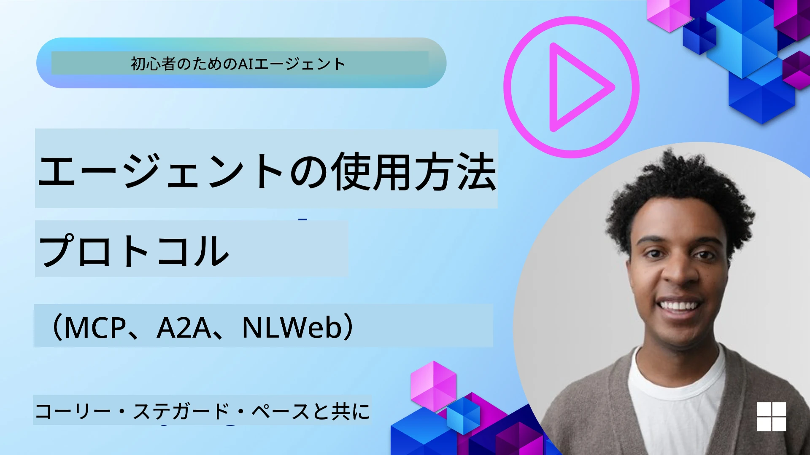
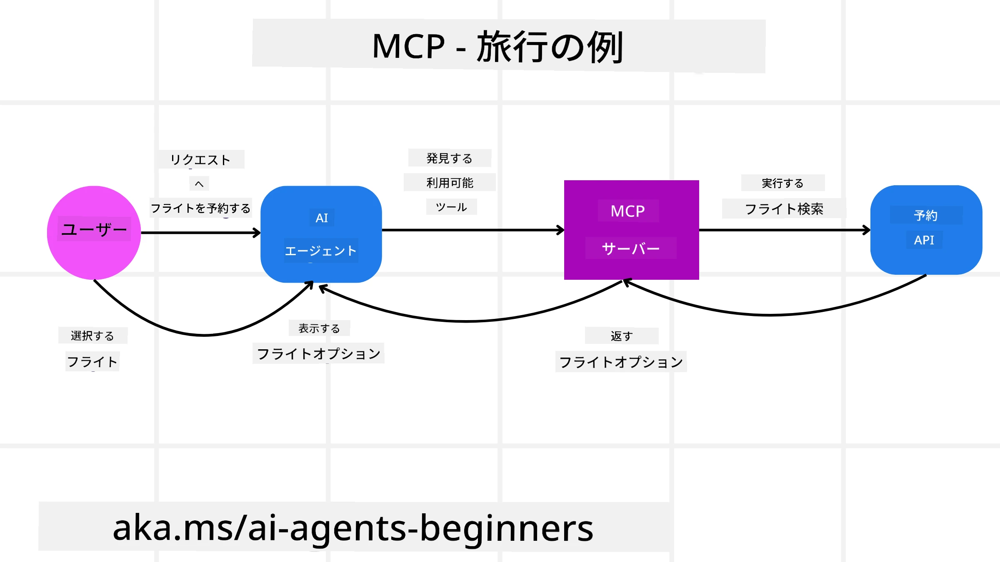
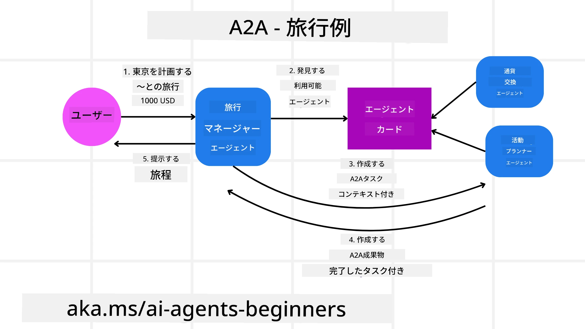
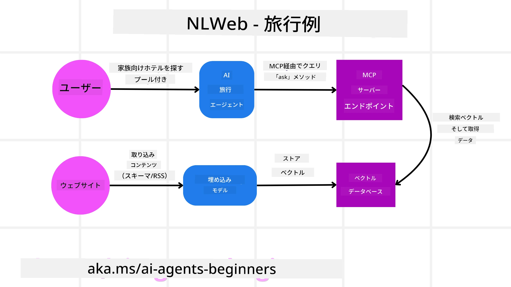

# エージェンティック・プロトコルの使用（MCP、A2AおよびNLWeb）

> _(上の画像をクリックするとこのレッスンのビデオが表示されます)_

AIエージェントの利用が拡大するにつれて、標準化、セキュリティ、オープンなイノベーションをサポートするプロトコルの必要性も高まっています。本レッスンでは、このニーズに応えることを目指す3つのプロトコル — Model Context Protocol (MCP)、Agent to Agent (A2A)、および Natural Language Web (NLWeb) — を取り上げます。

## はじめに

このレッスンでは、以下を取り上げます：

• どのように**MCP**がAIエージェントに外部のツールやデータへのアクセスを提供し、ユーザーのタスクを完了させるか。

• どのように**A2A**が異なるAIエージェント間の通信とコラボレーションを可能にするか。

• どのように**NLWeb**があらゆるウェブサイトに自然言語インターフェイスを提供し、AIエージェントがコンテンツを発見して相互作用できるようにするか。

## 学習目標

• **特定する** AIエージェントの文脈におけるMCP、A2A、NLWebの主要な目的と利点。

• **説明する** 各プロトコルがLLMs、ツール、およびその他のエージェント間の通信と相互作用をどのように促進するか。

• **認識する** 複雑なエージェンティックシステムを構築する上で各プロトコルが果たす異なる役割。

## モデル・コンテキスト・プロトコル

**Model Context Protocol (MCP)** は、アプリケーションがLLMsにコンテキストとツールを提供するための標準化された方法を提供するオープン標準です。これにより、AIエージェントが一貫した方法で接続できる異なるデータソースやツールへの「ユニバーサルアダプタ」のような役割が可能になります。

それではMCPの構成要素、直接APIを使用する場合との利点、そしてAIエージェントがMCPサーバーをどのように利用するかの例を見てみましょう。

### MCPの主要な構成要素

MCPは**クライアント-サーバーアーキテクチャ**で動作し、主要な構成要素は次のとおりです：

• **Hosts** はMCPサーバーへの接続を開始するLLMアプリケーション（例：VSCodeのようなコードエディタ）です。

• **Clients** はホストアプリケーション内のコンポーネントで、サーバーと1対1の接続を維持します。

• **Servers** は特定の機能を公開する軽量プログラムです。

プロトコルには、MCPサーバーの機能である3つのコアプリミティブが含まれます：

• **Tools**: これらはAIエージェントが呼び出して動作を実行できる個別のアクションや関数です。例えば、天気サービスは "get weather" ツールを公開するかもしれませんし、eコマースサーバーは "purchase product" ツールを公開するかもしれません。MCPサーバーは、それぞれのツールの名前、説明、および入出力スキーマをその機能一覧で公開します。

• **Resources**: これらはMCPサーバーが提供できる読み取り専用のデータ項目やドキュメントで、クライアントはそれらをオンデマンドで取得できます。例としてはファイルの内容、データベースレコード、ログファイルなどがあります。Resourcesはテキスト（コードやJSONなど）やバイナリ（画像やPDFなど）になり得ます。

• **Prompts**: これらは提案プロンプトを提供する定義済みテンプレートで、より複雑なワークフローを可能にします。

### MCPの利点

MCPはAIエージェントにとって重要な利点を提供します：

• **動的なツール検出**: エージェントはサーバーから利用可能なツールのリストと、それらが何をするかの説明を動的に受け取ることができます。これは従来のAPIが統合のために静的なコーディングを必要とし、APIの変更ごとにコード更新が必要になるのとは対照的です。MCPは「一度統合する」アプローチを提供し、より高い適応性をもたらします。

• **LLM間の相互運用性**: MCPは異なるLLM間で動作し、コアモデルを切り替えてパフォーマンスを評価する柔軟性を提供します。

• **標準化されたセキュリティ**: MCPには標準的な認証方法が含まれており、追加のMCPサーバーへのアクセスを追加する際のスケーラビリティを向上させます。これは、従来のさまざまなAPIの異なるキーや認証タイプを管理するよりも簡素です。

### MCPの例

ユーザーがMCPで動作するAIアシスタントを使ってフライトを予約したいと想像してみましょう。

1. **接続**: AIアシスタント（MCPクライアント）が航空会社が提供するMCPサーバーに接続します。

2. **ツール検出**: クライアントは航空会社のMCPサーバーに「利用可能なツールは何ですか？」と尋ねます。サーバーは "search flights" や "book flights" のようなツールを返答します。

3. **ツール呼び出し**: 次にあなたがAIアシスタントに「ポートランドからホノルルへのフライトを検索してください。」と依頼します。AIアシスタントはLLMを使用して、'search flights' ツールを呼び出す必要があると判断し、関連するパラメータ（出発地、目的地）をMCPサーバーに渡します。

4. **実行と応答**: MCPサーバーはラッパーとして機能し、航空会社の内部予約APIへの実際の呼び出しを行います。その後フライト情報（例：JSONデータ）を受け取り、それをAIアシスタントに返します。

5. **さらなるやり取り**: AIアシスタントはフライトの選択肢を提示します。あなたがフライトを選択すると、アシスタントは同じMCPサーバー上の 'book flight' ツールを呼び出して予約を完了するかもしれません。

## エージェント間プロトコル（A2A）

MCPがLLMとツールを接続することに焦点を当てる一方で、**Agent-to-Agent (A2A) プロトコル**はさらに一歩進み、異なるAIエージェント間の通信とコラボレーションを可能にします。A2Aは、異なる組織、環境、テックスタックにまたがるAIエージェントを接続して、共有タスクを完了させます。

ここではA2Aの構成要素と利点を検討し、旅行アプリケーションでの適用例を示します。

### A2Aの主要コンポーネント

A2Aはエージェント間の通信を可能にし、ユーザーのサブタスクを完了するためにエージェント同士が協力することに重点を置いています。プロトコルの各コンポーネントはこれに寄与します：

#### エージェントカード

MCPサーバーがツールのリストを共有するのと同様に、エージェントカードには以下が含まれます：
- エージェントの名前 .
- **実行する一般的なタスクの説明**.
- 他のエージェント（あるいは人間のユーザー）にそのエージェントをいつ、なぜ呼び出したいかを理解させるための説明付きの**特定のスキルのリスト**.
- エージェントの**現在のエンドポイント URL**
- ストリーミング応答やプッシュ通知などの**バージョン**と**機能**。

#### エージェント実行者

エージェント実行者は、**ユーザーチャットのコンテキストをリモートエージェントに渡すこと**を担当します。リモートエージェントはこれを必要として、完了すべきタスクを理解します。A2Aサーバーでは、エージェントは受信リクエストを解析し、自身の内部ツールを使ってタスクを実行するために独自の大規模言語モデル（LLM）を使用します。

#### アーティファクト

リモートエージェントが要求されたタスクを完了すると、その成果物はアーティファクトとして作成されます。アーティファクトは**エージェントの作業結果**、**完了した内容の説明**、およびプロトコルを通じて送信される**テキストコンテキスト**を含みます。アーティファクトが送信された後、リモートエージェントとの接続は再び必要になるまで閉じられます。

#### イベントキュー

このコンポーネントは**更新の処理とメッセージの受け渡し**に使用されます。タスクの完了に時間がかかる場合に、エージェント間の接続がタスク完了前に閉じられないようにするため、本番環境のエージェンティックシステムでは特に重要です。

### A2Aの利点

• **強化されたコラボレーション**: 異なるベンダーやプラットフォームのエージェントが相互にやり取りし、コンテキストを共有し、一緒に作業することを可能にし、従来は分断されていたシステム間でシームレスな自動化を促進します。

• **モデル選択の柔軟性**: 各A2Aエージェントは、自分がリクエストに応答するために使用するLLMを決定でき、エージェントごとに最適化またはファインチューニングされたモデルを使用することができます。これは一部のMCPシナリオで見られる単一のLLM接続とは異なります。

• **組み込みの認証**: 認証がA2Aプロトコルに直接統合されており、エージェント間のやり取りに対する堅牢なセキュリティフレームワークを提供します。

### A2Aの例

旅行予約のシナリオをA2Aを使って拡張してみましょう。

1. **ユーザーのマルチエージェントへのリクエスト**: ユーザーが「来週ホノルルへの旅行を丸ごと予約してください。フライト、ホテル、レンタカーを含めて」といった形で「旅行エージェント」A2Aクライアント/エージェントに依頼します。

2. **旅行エージェントによるオーケストレーション**: 旅行エージェントはこの複雑なリクエストを受け取り、LLMを使ってタスクを推論し、他の専門エージェントと連携する必要があると判断します。

3. **エージェント間の通信**: 旅行エージェントはA2Aプロトコルを使用して、異なる会社によって作成された「航空会社エージェント」、「ホテルエージェント」、「レンタカーエージェント」などの下流エージェントに接続します。

4. **委任されたタスクの実行**: 旅行エージェントはこれらの専門エージェントに具体的なタスクを送ります（例："Find flights to Honolulu", "Book a hotel", "Rent a car"）。それぞれの専門エージェントは独自のLLMを実行し、自身のツール（それらがMCPサーバーである場合もあります）を利用して予約の一部を実行します。

5. **統合された応答**: 下流エージェントがすべてタスクを完了すると、旅行エージェントは結果（フライトの詳細、ホテルの確認、レンタカーの予約）をまとめ、チャット形式の包括的な応答をユーザーに返します。

## Natural Language Web (NLWeb)

ウェブサイトは長い間、インターネット上の情報やデータにユーザーがアクセスするための主要な手段でした。

ここではNLWebのさまざまな構成要素、NLWebの利点、そして旅行アプリケーションを例にNLWebがどのように機能するかを見てみましょう。

### NLWebの構成要素

- **NLWeb Application (Core Service Code)**: 自然言語の質問を処理するシステムです。プラットフォームの異なる部分を接続して応答を生成します。ウェブサイトの自然言語機能を動かす**エンジン**と考えることができます。

- **NLWeb Protocol**: これはウェブサイトとの自然言語インタラクションのための**基本的なルールセット**です。応答をJSON形式（多くの場合Schema.orgを使用）で返します。その目的は、HTMLがオンラインでドキュメントを共有可能にしたのと同様に、「AI Web」のための単純な基盤を作ることです。

- **MCP Server (Model Context Protocol Endpoint)**: 各NLWebのセットアップは**MCPサーバー**としても機能します。つまり、他のAIシステムと**ツール（例えば “ask” メソッド）やデータを共有**できることを意味します。実際には、これによりウェブサイトのコンテンツと能力がAIエージェントによって利用可能になり、そのサイトがより広い「エージェントエコシステム」の一部になることを可能にします。

- **Embedding Models**: これらのモデルは、ウェブサイトのコンテンツをベクトル（埋め込み）と呼ばれる数値表現に**変換する**ために使用されます。これらのベクトルは、コンピュータが意味を比較および検索できる形で意味を捉えます。ベクトルは特別なデータベースに格納され、ユーザーは使用したい埋め込みモデルを選択できます。

- **Vector Database (Retrieval Mechanism)**: このデータベースは**ウェブサイトコンテンツの埋め込みを保存**します。誰かが質問をすると、NLWebはベクターデータベースをチェックして最も関連性の高い情報を迅速に見つけます。類似度に基づいてランク付けされた候補回答の高速なリストを返します。NLWebはQdrant、Snowflake、Milvus、Azure AI Search、Elasticsearchなどのさまざまなベクターストレージシステムと連携します。

### NLWebの例

旅行予約のウェブサイトを再び考えてみますが、今回はNLWebで強化されています。

1. **データ取り込み**: 旅行ウェブサイトの既存の製品カタログ（例：フライトリスト、ホテルの説明、ツアーパッケージ）はSchema.orgを使ってフォーマットされるか、RSSフィード経由で読み込まれます。NLWebのツールはこの構造化データを取り込み、埋め込みを作成してローカルまたはリモートのベクターデータベースに格納します。

2. **自然言語クエリ（人間）**: ユーザーがウェブサイトを訪れ、メニューを移動する代わりにチャットインターフェイスに「来週ホノルルでプール付きの家族向けホテルを探して」と入力します。

3. **NLWebの処理**: NLWebアプリケーションはこのクエリを受け取ります。クエリを理解するためにLLMに送信すると同時に、関連するホテルのリスティングを見つけるためにベクターデータベースを検索します。

4. **正確な結果**: LLMはデータベースの検索結果を解釈して、「家族向け」「プール」「ホノルル」といった基準に基づいて最良の一致を特定し、自然言語の応答に整形します。重要なのは、応答がサイトのカタログに実際に存在するホテルを参照しており、作り話の情報を避けていることです。

5. **AIエージェントとの相互作用**: NLWebがMCPサーバーとして機能するため、外部のAI旅行エージェントもこのウェブサイトのNLWebインスタンスに接続できます。AIエージェントは `ask("Are there any vegan-friendly restaurants in the Honolulu area recommended by the hotel?")` という `ask` MCPメソッドを使ってサイトに直接問い合わせることができます。NLWebインスタンスは（レストラン情報がロードされていれば）これを処理し、構造化されたJSON応答を返します。

### MCP/A2A/NLWebについてさらに質問がありますか？

Microsoft Foundry Discordに参加して、他の学習者と交流したり、オフィスアワーに参加したり、AIエージェントに関する質問に答えてもらいましょう: [Microsoft Foundry Discord](https://aka.ms/ai-agents/discord)

## リソース

- [MCP入門](https://aka.ms/mcp-for-beginners)  
- [MCPドキュメント](https://learn.microsoft.com/python/api/overview/azure/ai-projects-readme)
- [NLWebリポジトリ](https://github.com/nlweb-ai/NLWeb)
- [Microsoft エージェントフレームワーク](https://aka.ms/ai-agents-beginners/agent-framewrok)

---

<!-- CO-OP TRANSLATOR DISCLAIMER START -->
免責事項：
この文書は AI 翻訳サービス「Co-op Translator」（https://github.com/Azure/co-op-translator）を使用して翻訳されました。正確性には努めていますが、自動翻訳には誤りや不正確な箇所が含まれる可能性があることをご了承ください。原文（原言語の文書）を正式な情報源と見なしてください。重要な情報については、専門の人間による翻訳を推奨します。本翻訳の利用により生じたいかなる誤解や解釈の相違についても、私たちは責任を負いません。
<!-- CO-OP TRANSLATOR DISCLAIMER END -->