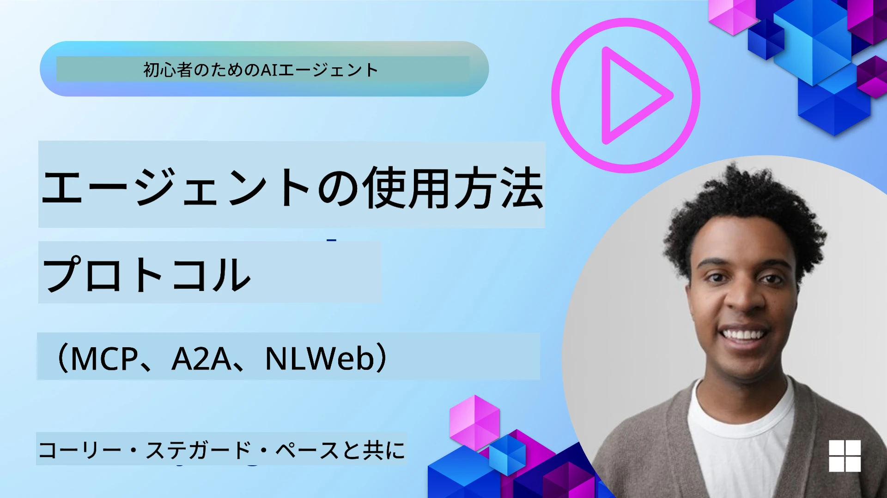
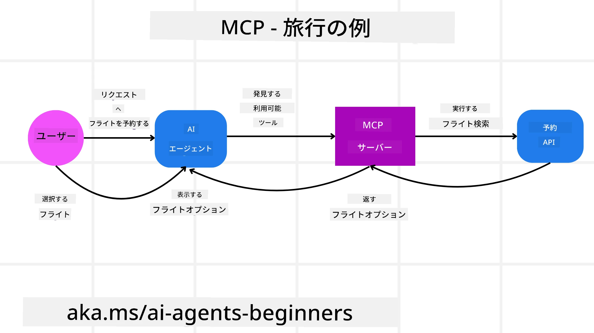
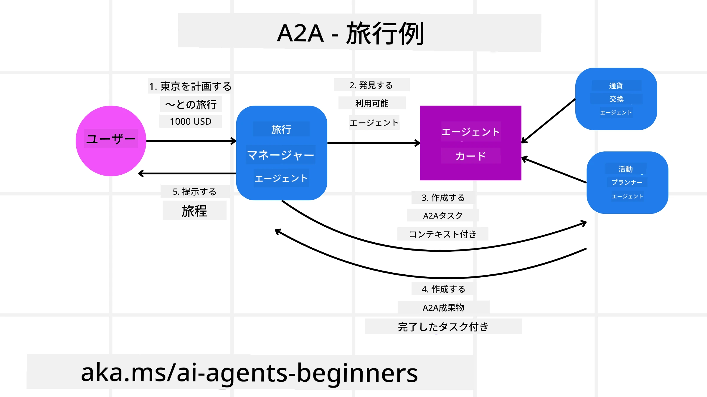
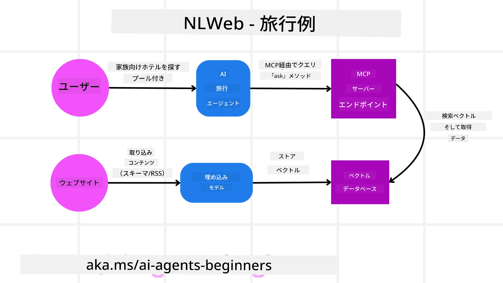

# エージェンティックプロトコルの使用（MCP、A2A、NLWeb）

> _(上の画像をクリックするとこのレッスンの動画が表示されます)_

AIエージェントの利用が増えるとともに、標準化、安全性の確保、オープンイノベーションの支援を保証するプロトコルの必要性も高まっています。本レッスンでは、このニーズに応える3つのプロトコル、Model Context Protocol（MCP）、Agent to Agent（A2A）、Natural Language Web（NLWeb）について説明します。

## はじめに

本レッスンでは以下を扱います：

• AIエージェントが外部ツールやデータにアクセスしてユーザーのタスクを完了するための<strong>MCP</strong>の仕組み。

• 異なるAIエージェント間の通信と協調を可能にする<strong>A2A</strong>の方法。

• 自然言語インターフェースを任意のウェブサイトにもたらし、AIエージェントがコンテンツを発見し操作できるようにする<strong>NLWeb</strong>の仕組み。

## 学習目標

• AIエージェントの文脈で、MCP、A2A、NLWebそれぞれの中心的な目的と利点を<strong>理解する</strong>。

• 各プロトコルがLLM、ツール、他のエージェントとの通信とやり取りをどのように促進するかを<strong>説明できる</strong>。

• 複雑なエージェンティックシステムを構築する際、各プロトコルが果たす異なる役割を<strong>認識する</strong>。

## Model Context Protocol

<strong>Model Context Protocol（MCP）</strong>は、アプリケーションがLLMにコンテキストとツールを標準化された方法で提供するためのオープンスタンダードです。これにより、AIエージェントが一貫した方法で接続可能な「ユニバーサルアダプター」として異なるデータソースやツールに接続できます。

MCPの構成要素、直接API利用との比較での利点、AIエージェントがMCPサーバーをどのように使うかの例を見ていきましょう。

### MCPの主要コンポーネント

MCPは<strong>クライアント・サーバーアーキテクチャ</strong>で動作し、主要なコンポーネントは以下の通りです：

• <strong>ホスト</strong>はLLMアプリケーション（例えばVSCodeのようなコードエディタ）で、MCPサーバーへの接続を開始します。

• <strong>クライアント</strong>はホストアプリケーション内のコンポーネントで、サーバーと一対一の接続を維持します。

• <strong>サーバー</strong>は特定の機能を公開する軽量プログラムです。

プロトコルには、MCPサーバーの能力を示す3つの基本プリミティブが含まれています：

• <strong>ツール</strong>：これはAIエージェントが呼び出して実行できる個別のアクションまたは機能です。例えば、天気情報サービスは「天気取得」ツールを、Eコマースサーバーは「商品購入」ツールを提供することが考えられます。MCPサーバーは各ツールの名称、説明、入出力スキーマを機能としてリストアップします。

• <strong>リソース</strong>：MCPサーバーが提供できる読み取り専用のデータ項目やドキュメントで、クライアントは必要に応じて取得します。例としてファイル内容、データベースのレコード、ログファイルなどがあります。リソースはテキスト（コードやJSONなど）またはバイナリ（画像やPDFなど）です。

• <strong>プロンプト</strong>：これはあらかじめ定義されたテンプレートで、より複雑なワークフローのための提案プロンプトを提供します。

### MCPの利点

MCPはAIエージェントに対して大きな利点を提供します：

• <strong>動的ツール探索</strong>：エージェントはサーバーから利用可能なツールのリストとその説明を動的に受け取れます。従来のAPIは統合時に静的なコーディングが必要で、APIの変更はコードの更新を必須としましたが、MCPは「一度統合すれば良い」アプローチを提供し、柔軟性を高めます。

• **異なるLLM間の相互運用性**：MCPは異なるLLMを横断して動作し、より性能評価に適したコアモデルへの切り替えが可能です。

• <strong>標準化されたセキュリティ</strong>：MCPは標準的な認証方法を含み、複数のMCPサーバーへのアクセス追加時にもスケーラブルな管理が可能です。これにより、異なるAPIキーや認証タイプの管理負荷を減らせます。

### MCPの例

ユーザーがMCPで動作するAIアシスタントを使って航空券を予約するシナリオを想像してみましょう。

1. <strong>接続</strong>：AIアシスタント（MCPクライアント）が航空会社提供のMCPサーバーに接続します。

2. <strong>ツール探索</strong>：クライアントは航空会社のMCPサーバーに「利用可能なツールは何ですか？」と尋ねます。サーバーは「フライト検索」や「フライト予約」などのツールを返答します。

3. <strong>ツール呼び出し</strong>：ユーザーがAIアシスタントに「ポートランドからホノルルへのフライトを検索して」と依頼すると、AIはLLMを使って「フライト検索」ツールを呼び出し、必要なパラメータ（出発地、目的地）をMCPサーバーに渡します。

4. <strong>実行と応答</strong>：MCPサーバーはラッパーとして航空会社の内部予約APIに実際のリクエストを発行し、フライト情報（JSONデータなど）を受け取りAIアシスタントに返します。

5. <strong>さらなる対話</strong>：AIアシスタントがフライトの選択肢を提示し、ユーザーが選択後、同じMCPサーバーの「フライト予約」ツールを呼び出して予約を完了します。

## エージェント間プロトコル（A2A）

MCPがLLMとツール間の接続に焦点を当てるのに対し、<strong>Agent-to-Agent（A2A）プロトコル</strong>は異なるAIエージェント間の通信と協力を可能にします。A2Aは異なる組織、環境、技術スタックをまたがってAIエージェントをつなぎ、共通のタスクを完了します。

A2Aの構成要素と利点、および旅行アプリケーションの例での適用方法を見ていきます。

### A2Aの主要コンポーネント

A2Aはエージェント間の通信を可能にし、ユーザーのサブタスクを協力して完了させることに重点を置きます。各コンポーネントはこれに寄与します：

#### エージェントカード

MCPサーバーがツール一覧を共有するのに似て、エージェントカードは以下を持ちます：
- エージェントの名前。
- 完了する一般的なタスクの<strong>説明</strong>。
- 他のエージェント（あるいは人間ユーザー）に対し、いつ・なぜ呼び出すべきかを理解してもらうための<strong>具体的なスキルの一覧と説明</strong>。
- エージェントの<strong>現在のエンドポイントURL</strong>。
- <strong>バージョン</strong>やストリーミング応答、プッシュ通知などの<strong>能力</strong>。

#### エージェントエグゼキューター

エージェントエグゼキューターは<strong>ユーザーのチャットのコンテキストをリモートエージェントに渡す役割</strong>を担います。リモートエージェントはこれにより、完了すべきタスクを理解します。A2Aサーバー内で、エージェントは自分のLLMを使って受信リクエストを解析し、内部ツールを用いてタスクを実行します。

#### アーティファクト

リモートエージェントがタスクを完了すると、その成果物がアーティファクトとして作成されます。アーティファクトは<strong>作業結果</strong>、<strong>完了内容の説明</strong>、およびプロトコル経由で送られる<strong>テキストコンテキスト</strong>を含みます。アーティファクト送信後、リモートエージェントとの接続は不要になるまで閉じられます。

#### イベントキュー

このコンポーネントは<strong>更新処理とメッセージ伝達</strong>に用いられます。エージェンティックシステムの実運用では、タスク完了までに長時間かかる場合に備え、エージェント間の接続が途中で切断されないようにするために特に重要です。

### A2Aの利点

• <strong>強化された協調作業</strong>：異なるベンダーやプラットフォームのエージェントが相互に交流、コンテキスト共有、共同作業ができ、従来は分断されていたシステム間のシームレスな自動化を実現します。

• <strong>モデル選択の柔軟性</strong>：各A2Aエージェントが使用するLLMを選択でき、各エージェントに最適化・ファインチューニングされたモデルが使えます。これはMCPの一部シナリオでの単一LLM接続とは異なります。

• <strong>組み込み認証</strong>：認証はA2Aプロトコルに直接組み込まれており、エージェント間通信に堅牢なセキュリティフレームワークを提供します。

### A2Aの例

旅行予約シナリオを拡張し、今回はA2Aを使います。

1. <strong>ユーザーの複数エージェントへの依頼</strong>：ユーザーは「来週のホノルルへのフル旅行（フライト、ホテル、レンタカー）を予約してください」と「旅行代理エージェント」A2Aクライアント/エージェントに伝えます。

2. <strong>旅行代理の調整</strong>：旅行代理はLLMを使って依頼を分析し、他の専門エージェントと連携すべきと判断します。

3. <strong>エージェント間通信</strong>：旅行代理はA2Aプロトコルを使い、異なる会社が作成した「航空会社エージェント」「ホテルエージェント」「レンタカーエージェント」と接続します。

4. <strong>委任されたタスク</strong>：旅行代理は「ホノルル行きのフライトを探す」「ホテルを予約する」「レンタカーを借りる」といった具体的なタスクを各専門エージェントに送り、それぞれが自身のLLMとMCPサーバーなどのツールを使って処理します。

5. <strong>統合応答</strong>：すべての下流エージェントのタスク完了後、旅行代理は結果（フライト詳細、ホテル確認、レンタカー予約）をまとめてチャット形式でユーザーに返答します。

## Natural Language Web（NLWeb）

ウェブサイトは長らくインターネット上で情報やデータへアクセスする主要な方法でした。

NLWebの構成要素、利点、および旅行アプリケーションの例での動作を見てみましょう。

### NLWebの構成要素

- **NLWebアプリケーション（コアサービスコード）**：自然言語の質問を処理するシステム。プラットフォームの各部をつなぎ合わせて応答を生成します。ウェブサイトの自然言語機能を支える<strong>エンジン</strong>と考えられます。

- **NLWebプロトコル**：ウェブサイトと自然言語でやり取りするための<strong>基本ルール</strong>。JSON形式（Schema.orgを使うことが多い）で応答を返します。HTMLがオンライン文書の共有を可能にしたように、「AIウェブ」の基礎を作ることが目的です。

- **MCPサーバー（Model Context Protocolエンドポイント）**：各NLWeb環境も<strong>MCPサーバー</strong>として機能します。これにより、他のAIシステムと<strong>ツール（例えば「ask」メソッド）やデータを共有</strong>可能です。実際にはサイトのコンテンツや機能がAIエージェントに利用され、このサイトがより広い「エージェントエコシステム」の一部になります。

- <strong>埋め込みモデル</strong>：ウェブサイトのコンテンツを<strong>ベクトル（埋め込み）と呼ばれる数値表現に変換</strong>します。このベクトルは意味を捉え、比較や検索が可能です。特別なデータベースに保存され、ユーザーは使う埋め込みモデルを選択できます。

- **ベクトルデータベース（検索機構）**：ウェブコンテンツの埋め込みを<strong>保管するデータベース</strong>です。質問が来るとNLWebはベクトルデータベースを参照し、類似度でランク付けされた関連情報のリストを迅速に提供します。Qdrant、Snowflake、Milvus、Azure AI Search、Elasticsearchなどの異なるストレージと連携可能です。

### NLWebの例

もう一度旅行予約のウェブサイトを考えましょう。ただし今度はNLWebで動作しています。

1. <strong>データ取り込み</strong>：旅行サイトの既存の製品カタログ（例：フライトリスト、ホテル説明、ツアーパッケージ）がSchema.org形式やRSSフィードで読み込まれます。NLWebのツールがこの構造化データを取り込み、埋め込みを作成し、ローカルまたはリモートのベクトルデータベースに保存します。

2. **自然言語での問い合わせ（ユーザー）**：ユーザーはサイトを訪れ、メニューを探す代わりにチャットインターフェースに「来週ホノルルでプールのある家族向けホテルを探して」と入力します。

3. **NLWebの処理**：NLWebアプリケーションはこの問い合わせを受け取り、同時にLLMに送り理解させ、ベクトルデータベースも検索して関連ホテル情報を探します。

4. <strong>正確な結果</strong>：LLMはデータベースの検索結果を解釈し、「家族向け」「プール付き」「ホノルル」という条件に合う最良マッチを特定し、自然言語の応答に整形します。重要なのは、応答がサイトのカタログにある実在ホテルを参照し、作り話の情報を避ける点です。

5. **AIエージェントの相互作用**：NLWebがMCPサーバーとして機能するため、外部のAI旅行代理エージェントもこのサイトのNLWebに接続可能です。エージェントは `ask("ホテル推奨のホノルル地域のヴィーガン向けレストランはありますか？")` のようにMCPのaskメソッドを使って直接質問し、NLWebはレストラン情報のデータベースを使って構造化されたJSON応答を返せます。

### MCP/A2A/NLWebについてもっと知りたい？

[Microsoft Foundry Discord](https://discord.com/invite/ATgtXmAS5D) に参加して、他の学習者と交流したり、オフィスアワーに参加してAIエージェントの質問に答えてもらいましょう。

## リソース

- [MCP for Beginners](https://aka.ms/mcp-for-beginners)  
- [MCP Documentation](https://learn.microsoft.com/python/api/overview/azure/ai-projects-readme)
- [NLWeb Repo](https://github.com/nlweb-ai/NLWeb)
- [Microsoft Agent Framework](https://learn.microsoft.com/en-us/agent-framework/overview/?wt.mc_id=youtube_26688_organicsocial_reactor&pivots=programming-language-python)

## 前のレッスン

[AI Agents in Production](../10-ai-agents-production/README.md)

## 次のレッスン

[Context Engineering for AI Agents](../12-context-engineering/README.md)

---

<!-- CO-OP TRANSLATOR DISCLAIMER START -->
**免責事項**：
本書類は AI 翻訳サービス [Co-op Translator](https://github.com/Azure/co-op-translator) を使用して翻訳されています。正確性を期していますが、自動翻訳には誤りや不正確な部分が含まれる可能性があることをご承知おきください。原文の原語版が正式な情報源とみなされるべきです。重要な情報については、専門の人間による翻訳を推奨します。本翻訳の利用により生じたいかなる誤解や解釈違いについても、当方は責任を負いかねます。
<!-- CO-OP TRANSLATOR DISCLAIMER END -->