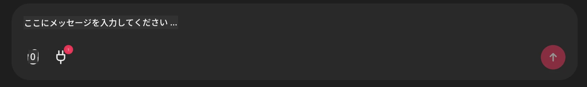

# Github MCP Server の例

## 説明

これは Microsoft Reactor で開催された AI Agents Hackathon のために作成されたデモです。

このツールはユーザーの Github リポジトリに基づいてハッカソンプロジェクトを推薦するために使用されます。
これは次の方法で行われます:

1. **Github Agent** - Github MCP Server を使用してリポジトリとそれらのリポジトリに関する情報を取得します。
2. **Hackathon Agent** - Github Agent からのデータを受け取り、ユーザーのプロジェクトや使用言語、AI Agents ハッカソンのプロジェクトトラックに基づいて創造的なハッカソンプロジェクトのアイデアを考案します。
3. **Events Agent** - Hackathon Agent の提案に基づいて、Events Agent が AI Agent Hackathon シリーズから関連するイベントを推薦します。

## Running the code 

### Environment Variables

This demo uses Microsoft Agent Framework, Azure OpenAI Service, the Github MCP Server and Azure AI Search.

Make sure that you have the proper environment variables set to use these tools:

```python
AZURE_AI_PROJECT_ENDPOINT=""
AZURE_AI_MODEL_DEPLOYMENT_NAME=""
AZURE_SEARCH_SERVICE_ENDPOINT=""
AZURE_SEARCH_API_KEY=""
``` 

## Running the Chainlit Server

To connect to the MCP server, this demo use Chainlit as a chat interface. 

To run the server, use the following command in your terminal:

```bash
chainlit run app.py -w
```

This should start your Chainlit server on `localhost:8000` as well as populate your Azure AI Search Index with the `event-descriptions.md` content. 

## Connecting to the MCP Server

To connect to the Github MCP Server, select the "plug" icon underneath the "Type your message here.." chat box:



From there you can click on the "Connect an MCP" to add the command to connect to the Github MCP Server:

```bash
npx -y @modelcontextprotocol/server-github --env GITHUB_PERSONAL_ACCESS_TOKEN=[YOUR PERSONAL ACCESS TOKEN]
```

Replace "[YOUR PERSONAL ACCESS TOKEN]" with your actual Personal Access Token. 

After connecting, you should see a (1) next to the plug icon to confirm that its connected. If not, try restarting the chainlit server with `chainlit run app.py -w`.

## Using the Demo 

To start the agent workflow of recommending hackathon projects, you can type a message like: 

"Recommend hackathon projects for the Github user koreyspace"

The Router Agent will analyze your request and determine which combination of agents (GitHub, Hackathon, and Events) is best suited to handle your query. The agents work together to provide comprehensive recommendations based on GitHub repository analysis, project ideation, and relevant tech events.

---

<!-- CO-OP TRANSLATOR DISCLAIMER START -->
免責事項:
本書はAI翻訳サービス[Co-op Translator](https://github.com/Azure/co-op-translator)を使用して翻訳されました。正確性には努めていますが、自動翻訳には誤りや不正確な箇所が含まれる可能性があることにご留意ください。原文（原語の文書）を権威ある情報源として扱ってください。重要な情報については、専門の翻訳者による人間翻訳を推奨します。本翻訳の使用により生じたいかなる誤解や誤訳についても、当社は責任を負いません。
<!-- CO-OP TRANSLATOR DISCLAIMER END -->