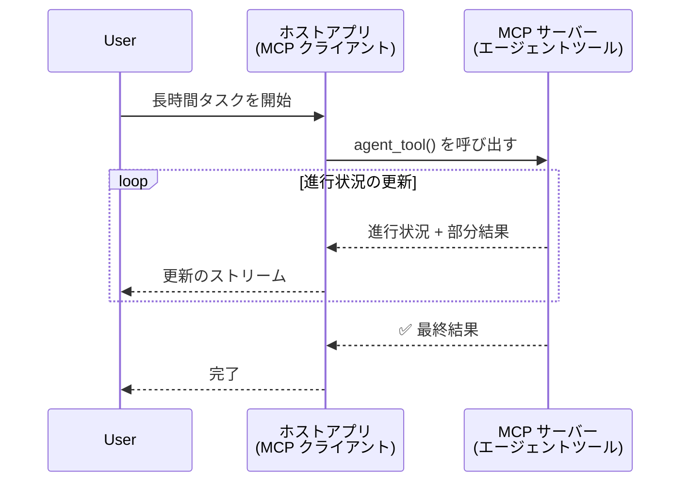
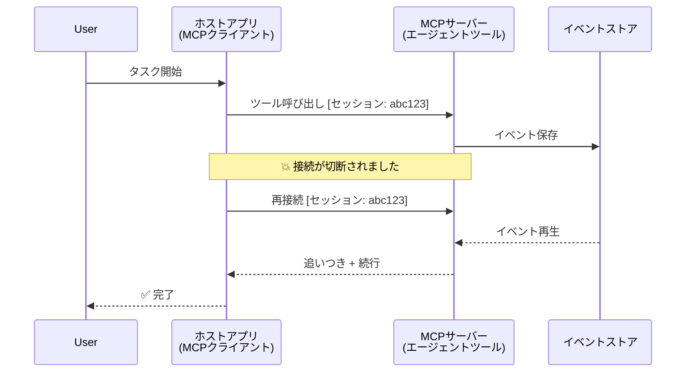
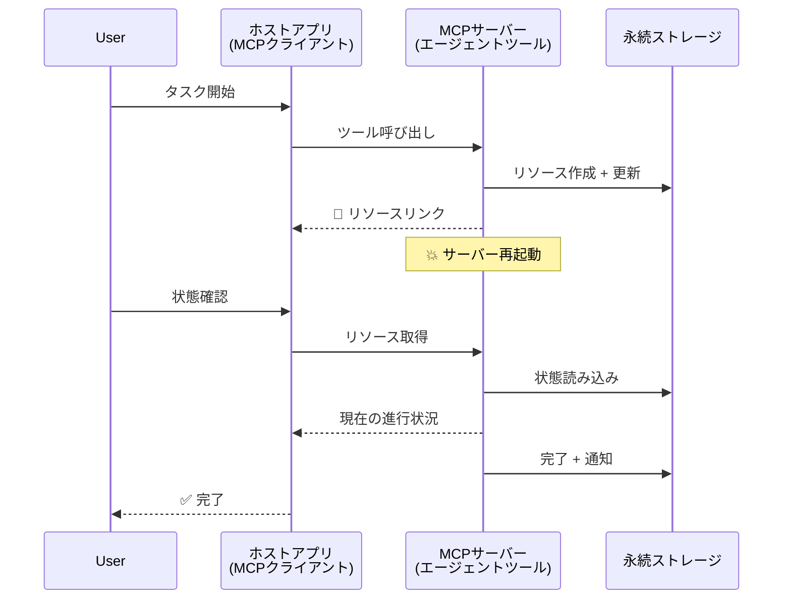
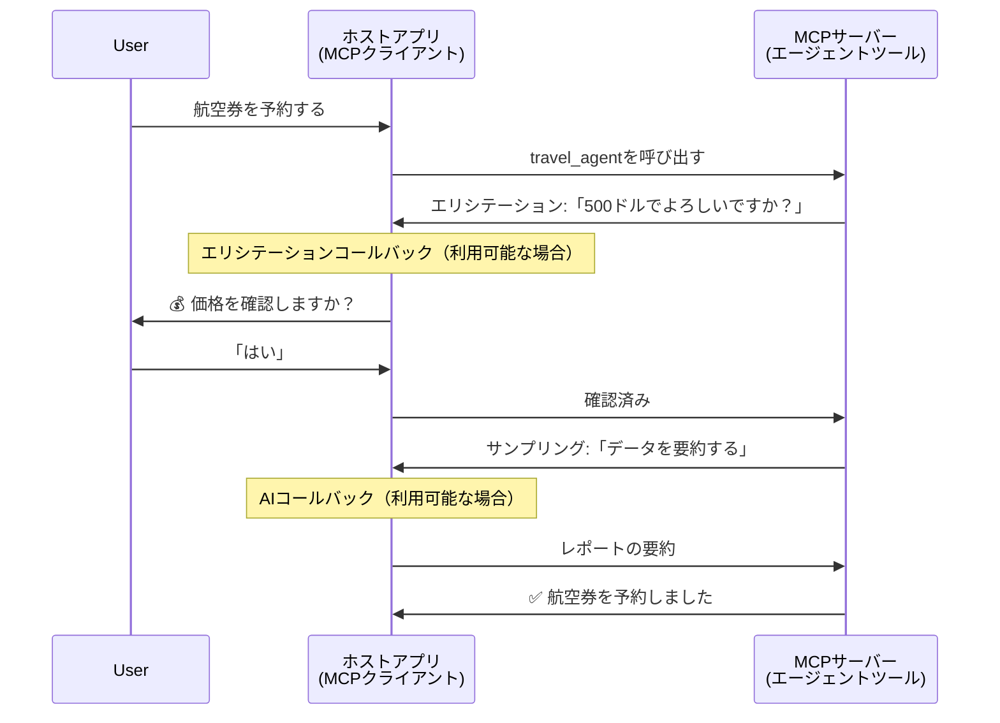
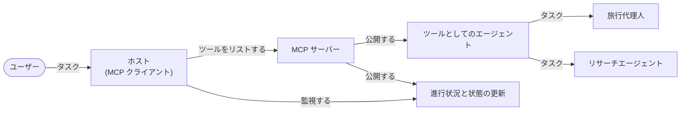

# MCPを使ったエージェント間通信システムの構築

> TL;DR - MCPでAgent2Agentコミュニケーションは構築できますか？はい！

MCPは「LLMに文脈を提供する」という当初の目的を大幅に超えて進化しています。最近の強化には、[再開可能なストリーム](https://modelcontextprotocol.io/docs/concepts/transports#resumability-and-redelivery)、[エリシテーション](https://modelcontextprotocol.io/specification/2025-06-18/client/elicitation)、[サンプリング](https://modelcontextprotocol.io/specification/2025-06-18/client/sampling)、および通知（[進捗](https://modelcontextprotocol.io/specification/2025-06-18/basic/utilities/progress)や[リソース](https://modelcontextprotocol.io/specification/2025-06-18/schema#resourceupdatednotification)）が含まれます。これにより、MCPは複雑なエージェント間通信システムを構築するための堅牢な基盤を提供しています。

## エージェント/ツールの誤解

より多くの開発者がエージェンティックな行動（長時間実行、実行中に追加入力が必要になることがあるなど）を持つツールを探求するにつれて、MCPは初期の単純なリクエスト-レスポンスパターンに焦点を当てた例が主だったため不適切だという誤解が一般的になっています。

この認識はもはや時代遅れです。MCP仕様は、長時間実行のエージェンティックな行動構築のギャップを埋める能力でここ数ヶ月で大幅に強化されました：

- **ストリーミング＆部分結果**：実行中のリアルタイム進捗更新
- <strong>再開可能性</strong>：クライアントが切断後に再接続して継続可能
- <strong>耐久性</strong>：結果はサーバー再起動後も保持される（例：リソースリンクによる）
- <strong>マルチターン</strong>：エリシテーションおよびサンプリングを通じた実行中の双方向入力

これらの機能を組み合わせることで、MCPプロトコル上で複雑なエージェンティックかつマルチエージェントのアプリケーションを実現できます。

参考として、ここでは「エージェント」をMCPサーバー上で利用可能な「ツール」と定義します。これは、MCPクライアントを実装しMCPサーバーとセッションを確立してエージェントを呼び出せるホストアプリケーションの存在を意味します。

## MCPツールを「エージェンティック」にする要素とは？

実装に入る前に、長時間稼働するエージェントを支えるために必要なインフラ機能を確認しましょう。

> エージェントを、長期間自律的に動作し、複数回の対話やリアルタイムフィードバックに基づく調整が必要な複雑なタスクを処理可能な存在と定義します。

### 1. ストリーミング＆部分結果

従来のリクエスト-レスポンスは長期タスクには不適です。エージェントは以下を提供する必要があります：

- リアルタイムの進捗更新
- 中間結果

**MCPサポート**：リソース更新通知により部分結果のストリーミングが可能ですが、JSON-RPCの1:1リクエスト/レスポンスモデルとの競合を避ける慎重な設計が必要です。

| 機能                      | ユースケース                                                                                                                                        | MCPのサポート                                                                             |
| -------------------------- | -------------------------------------------------------------------------------------------------------------------------------------------------- | ----------------------------------------------------------------------------------------- |
| リアルタイム進捗更新     | ユーザーがコードベースの移行タスクを依頼。エージェントが進捗をストリーム： "10% - 依存関係分析中... 25% - TypeScriptファイル変換中... 50% - インポート更新中..." | ✅ 進捗通知                                                                                |
| 部分結果                   | 「本を生成」するタスクが部分的結果をストリーム、例：1) ストーリー概要、2) 章リスト、3) 各章完成。ホストは任意に確認、中断、再指示可能。                      | ✅ 通知は部分結果を含めるよう拡張可能（PR 383、776参照）                                   |

<div align="center" style="font-style: italic; font-size: 0.95em; margin-bottom: 0.5em;">
<strong>図1：</strong> この図は、MCPエージェントが長期タスクの実行中にホストアプリケーションへリアルタイムの進捗と部分結果をストリームし、ユーザーが実行状況をリアルタイムで監視できることを示しています。
</div>



### 2. 再開可能性

エージェントはネットワーク障害を優雅に処理する必要があります：

- （クライアントの）切断後の再接続
- 途切れた箇所からの継続（メッセージの再配信）

**MCPサポート**：現在のMCP StreamableHTTPトランスポートは、セッションIDと最終イベントIDによるセッション再開とメッセージ再配信をサポートしています。重要な点は、サーバーがクライアント再接続時にイベントの再生を可能にするEventStoreを実装しなければならないことです。
コミュニティ提案（PR #975）でトランスポート非依存の再開可能ストリームも検討されています。

| 機能        | ユースケース                                                                                                                                             | MCPサポート                                                               |
| ------------ | --------------------------------------------------------------------------------------------------------------------------------------------------------- | ------------------------------------------------------------------------- |
| 再開可能性   | クライアントが長時間タスク中に切断。再接続時にセッションが再開し、失われたイベントは再生され、中断地点からシームレスに継続。                        | ✅ StreamableHTTPトランスポート（セッションID、イベント再生およびEventStore付） |

<div align="center" style="font-style: italic; font-size: 0.95em; margin-bottom: 0.5em;">
<strong>図2：</strong> この図は、MCPのStreamableHTTPトランスポートとイベントストアがどのようにシームレスなセッション再開を可能にするかを示しています。クライアントが切断されても再接続して失われたイベントを再生し、進捗の損失なくタスクを継続できます。
</div>



### 3. 耐久性

長期実行するエージェントは永続的な状態を必要とします：

- 結果はサーバー再起動後も維持される
- ステータスは非同期に取得可能
- セッションを越えた進捗追跡

**MCPサポート**：MCPはツール呼び出しのためのリソースリンク返却型をサポートしています。現在の一般的なパターンは、ツールがリソースを作成し即座にリソースリンクを返し、タスクをバックグラウンドで続けリソースを更新するよう設計することです。クライアントはリソースの状態をポーリングして部分または全結果を取得したり、リソースの更新通知を購読したりします。

ただし、リソースのポーリングや更新購読は規模が大きくなるとリソース消費が大きいため、サーバーが更新をクライアント/ホストに通知するウェブフックやトリガー含めた提案（#992など）がコミュニティで検討されています。

| 機能      | ユースケース                                                                                                                                    | MCPサポート                                                    |
| ---------- | --------------------------------------------------------------------------------------------------------------------------------------------- | -------------------------------------------------------------- |
| 耐久性     | データ移行タスク中にサーバークラッシュ。結果と進捗は再起動後も保持され、クライアントは状態を確認し永続リソースから処理継続可能。                 | ✅ 永続ストレージ付きリソースリンクとステータス通知            |

現在一般的なパターンとして、ツールはリソースを作成し即座にリソースリンクを返し、バックグラウンドでタスク処理を続行し、進捗更新や部分結果を通知するリソース通知を発行し、必要に応じてリソース内容を更新します。

<div align="center" style="font-style: italic; font-size: 0.95em; margin-bottom: 0.5em;">
<strong>図3：</strong> この図は、MCPエージェントが耐久的リソースとステータス通知を使用して長期タスクがサーバー再起動に耐えられることを示しており、クライアントが進捗を確認し失敗後にも結果を取得できることを説明しています。
</div>



### 4. マルチターン対話

エージェントは実行中に追加入力を必要とすることが多いです：

- 人間の確認や承認
- 複雑な判断に対するAI支援
- 動的パラメータ調整

**MCPサポート**：サンプリング（AI入力）とエリシテーション（人間入力）によって完全にサポートされています。

| 機能                      | ユースケース                                                                                                                                        | MCPサポート                                     |
| ------------------------- | ------------------------------------------------------------------------------------------------------------------------------------------------- | ----------------------------------------------- |
| マルチターン対話          | 旅行代理エージェントがユーザーに価格確認を求め、その後AIに旅行データを要約させて予約完了を行う。                                            | ✅ 人間入力のエリシテーション、AI入力のサンプリング |

<div align="center" style="font-style: italic; font-size: 0.95em; margin-bottom: 0.5em;">
<strong>図4：</strong> この図は、MCPエージェントが実行中に人間の入力を対話的に引き出すかAI支援を要求し、確認や動的意思決定のような複雑なマルチターンワークフローをサポートする様子を示しています。
</div>



## MCPで長期エージェントを実装する - コード概要

本記事では、セッション再開とメッセージ再配信に対応したStreamableHTTPトランスポート付きMCP Python SDKを使い、長期エージェントの完全実装を含む[コードリポジトリ](https://github.com/victordibia/ai-tutorials/tree/main/MCP%20Agents)を提供します。実装例はMCP機能を組み合わせて高度なエージェント的挙動を実現する方法を示しています。

具体的には、サーバーに2つの主要なエージェントツールを実装しています：

- <strong>旅行代理</strong> - エリシテーションによる価格確認付き旅行予約サービスをシミュレート
- <strong>リサーチエージェント</strong> - サンプリングによるAI支援要約付き研究タスクを実行

両エージェントはリアルタイム進捗更新、対話的確認、完全なセッション再開機能を示します。

### 主要実装コンセプト

以下の各機能に対するサーバー側エージェント実装とクライアント側ホスト処理を示します：

#### ストリーミング＆進捗更新 - タスク状態のリアルタイム

ストリーミングによりエージェントは長期タスクの進捗をリアルタイムに更新し、ユーザーに状態や中間結果を知らせます。

**サーバー実装（エージェントが進捗通知を送信）：**

```python
# サーバー/server.py から - 進行状況を送信する旅行代理店
for i, step in enumerate(steps):
    await ctx.session.send_progress_notification(
        progress_token=ctx.request_id,
        progress=i * 25,
        total=100,
        message=step,
        related_request_id=str(ctx.request_id)
    )
    await anyio.sleep(2)  # 作業をシミュレートする

# 代替案: 詳細なステップバイステップの更新のためのログメッセージ
await ctx.session.send_log_message(
    level="info",
    data=f"Processing step {current_step}/{steps} ({progress_percent}%)",
    logger="long_running_agent",
    related_request_id=ctx.request_id,
)
```

**クライアント実装（ホストが進捗更新を受信）：**

```python
# client/client.pyから - リアルタイム通知を処理するクライアント
async def message_handler(message) -> None:
    if isinstance(message, types.ServerNotification):
        if isinstance(message.root, types.LoggingMessageNotification):
            console.print(f"📡 [dim]{message.root.params.data}[/dim]")
        elif isinstance(message.root, types.ProgressNotification):
            progress = message.root.params
            console.print(f"🔄 [yellow]{progress.message} ({progress.progress}/{progress.total})[/yellow]")

# セッション作成時にメッセージハンドラを登録する
async with ClientSession(
    read_stream, write_stream,
    message_handler=message_handler
) as session:
```

#### エリシテーション - ユーザー入力要求

エリシテーションはエージェントが実行中にユーザー入力を要求する機能で、長期タスクでの確認、明確化、承認に必須です。

**サーバー実装（エージェントが確認を要求）：**

```python
# サーバー/server.pyから - 旅行代理店が価格確認を要求
elicit_result = await ctx.session.elicit(
    message=f"Please confirm the estimated price of $1200 for your trip to {destination}",
    requestedSchema=PriceConfirmationSchema.model_json_schema(),
    related_request_id=ctx.request_id,
)

if elicit_result and elicit_result.action == "accept":
    # 予約を続ける
    logger.info(f"User confirmed price: {elicit_result.content}")
elif elicit_result and elicit_result.action == "decline":
    # 予約をキャンセルする
    booking_cancelled = True
```

**クライアント実装（ホストがエリシテーションコールバックを提供）：**

```python
# client/client.py から - クライアントがエリシテーション要求を処理
async def elicitation_callback(context, params):
    console.print(f"💬 Server is asking for confirmation:")
    console.print(f"   {params.message}")

    response = console.input("Do you accept? (y/n): ").strip().lower()

    if response in ['y', 'yes']:
        return types.ElicitResult(
            action="accept",
            content={"confirm": True, "notes": "Confirmed by user"}
        )
    else:
        return types.ElicitResult(
            action="decline",
            content={"confirm": False, "notes": "Declined by user"}
        )

# セッション作成時にコールバックを登録する
async with ClientSession(
    read_stream, write_stream,
    elicitation_callback=elicitation_callback
) as session:
```

#### サンプリング - AI支援要求

サンプリングはエージェントが複雑な判断やコンテンツ生成のためにLLMの支援を要求でき、ハイブリッドな人間・AIワークフローを可能にします。

**サーバー実装（エージェントがAI支援を要求）：**

```python
# server/server.py から - 研究エージェントがAIの要約を要求しています
sampling_result = await ctx.session.create_message(
    messages=[
        SamplingMessage(
            role="user",
            content=TextContent(type="text", text=f"Please summarize the key findings for research on: {topic}")
        )
    ],
    max_tokens=100,
    related_request_id=ctx.request_id,
)

if sampling_result and sampling_result.content:
    if sampling_result.content.type == "text":
        sampling_summary = sampling_result.content.text
        logger.info(f"Received sampling summary: {sampling_summary}")
```

**クライアント実装（ホストがサンプリングコールバックを提供）：**

```python
# client/client.py から - サンプリングリクエストを処理するクライアント
async def sampling_callback(context, params):
    message_text = params.messages[0].content.text if params.messages else 'No message'
    console.print(f"🧠 Server requested sampling: {message_text}")

    # 実際のアプリケーションでは、ここで LLM API を呼び出す可能性があります
    # デモ用に、モックレスポンスを提供します
    mock_response = "Based on current research, MCP has evolved significantly..."

    return types.CreateMessageResult(
        role="assistant",
        content=types.TextContent(type="text", text=mock_response),
        model="interactive-client",
        stopReason="endTurn"
    )

# セッション作成時にコールバックを登録する
async with ClientSession(
    read_stream, write_stream,
    sampling_callback=sampling_callback,
    elicitation_callback=elicitation_callback
) as session:
```

#### 再開可能性 - 切断後のセッション連続性

再開可能性により、長時間実行のエージェントタスクはクライアントの切断に耐え、再接続時にシームレスに継続可能となります。これはイベントストアと再開トークンで実装されます。

**イベントストア実装（サーバーがセッション状態を保持）：**

```python
# server/event_store.py から - 単純なインメモリイベントストア
class SimpleEventStore(EventStore):
    def __init__(self):
        self._events: list[tuple[StreamId, EventId, JSONRPCMessage]] = []
        self._event_id_counter = 0

    async def store_event(self, stream_id: StreamId, message: JSONRPCMessage) -> EventId:
        """Store an event and return its ID."""
        self._event_id_counter += 1
        event_id = str(self._event_id_counter)
        self._events.append((stream_id, event_id, message))
        return event_id

    async def replay_events_after(self, last_event_id: EventId, send_callback: EventCallback) -> StreamId | None:
        """Replay events after the specified ID for resumption."""
        start_index = None
        stream_id = None
        for index, (event_stream_id, event_id, _) in enumerate(self._events):
            if event_id == last_event_id:
                start_index = index + 1
                stream_id = event_stream_id
                break

        if start_index is None:
            return None

        # セッションの元のストリームから後のイベントのみをリプレイします。
        for event_stream_id, event_id, message in self._events[start_index:]:
            if event_stream_id != stream_id:
                continue
            await send_callback(EventMessage(message, event_id))

        return stream_id

# server/server.py から - イベントストアをセッションマネージャに渡す
def create_server_app(event_store: Optional[EventStore] = None) -> Starlette:
    server = ResumableServer()

    # 再開用のイベントストアでセッションマネージャを作成する
    session_manager = StreamableHTTPSessionManager(
        app=server,
        event_store=event_store,  # イベントストアはセッションの再開を可能にします
        json_response=False,
        security_settings=security_settings,
    )

    return Starlette(routes=[Mount("/mcp", app=session_manager.handle_request)])

# 使用法: イベントストアで初期化する
event_store = SimpleEventStore()
app = create_server_app(event_store)
```

**再開トークン付きクライアントメタデータ（クライアントが保存状態で再接続）：**

```python
# client/client.py から - メタデータを使用したクライアントの再開
if existing_tokens and existing_tokens.get("resumption_token"):
    # 既存の再開トークンを使用して中断したところから続行する
    metadata = ClientMessageMetadata(
        resumption_token=existing_tokens["resumption_token"],
    )
else:
    # 受信時に再開トークンを保存するためのコールバックを作成する
    def enhanced_callback(token: str):
        protocol_version = getattr(session, 'protocol_version', None)
        token_manager.save_tokens(session_id, token, protocol_version, command, args)

    metadata = ClientMessageMetadata(
        on_resumption_token_update=enhanced_callback,
    )

# 再開メタデータを含むリクエストを送信する
result = await session.send_request(
    types.ClientRequest(
        types.CallToolRequest(
            method="tools/call",
            params=types.CallToolRequestParams(name=command, arguments=args)
        )
    ),
    types.CallToolResult,
    metadata=metadata,
)
```

ホストアプリケーションはセッションIDと再開トークンをローカルに保持し、進捗や状態を失うことなく既存セッションへ再接続します。

### コード構成

<div align="center" style="font-style: italic; font-size: 0.95em; margin-bottom: 0.5em;">
<strong>図5：</strong> MCPベースのエージェントシステムアーキテクチャ
</div>



**主要ファイル：**

- **`server/server.py`** - エリシテーション、サンプリング、進捗更新を備えた旅行およびリサーチエージェントを持つ再開可能MCPサーバー
- **`client/client.py`** - セッション再開サポート、コールバックハンドラー、トークン管理を備えた対話型ホストアプリケーション
- **`server/event_store.py`** - セッション再開とメッセージ再配信を可能にするイベントストア実装

## MCPにおけるマルチエージェント通信への拡張

上記実装は、ホストアプリケーションのインテリジェンスと範囲を強化することでマルチエージェントシステムに拡張可能です：

- <strong>インテリジェントなタスク分解</strong>：ホストが複雑なユーザー要求を分析し、異なる専門エージェントへのサブタスクに分解
- <strong>マルチサーバー連携</strong>：ホストが複数のMCPサーバーに接続し、それぞれ異なるエージェント機能を公開
- <strong>タスク状態管理</strong>：ホストが複数の同時進行エージェントタスクの進捗を追跡し、依存関係と順序を管理
- **耐障害性＆リトライ**：ホストが障害を管理し、リトライロジックを実装し、エージェントが利用不可時にタスクを再ルーティング
- <strong>結果統合</strong>：ホストが複数エージェントの出力を統合して一貫した最終結果を生成

ホストは単純なクライアントから分散エージェント機能を調整するインテリジェントなオーケストレーターへ進化し、同時にMCPプロトコル基盤を維持します。

## 結論

MCPの強化された機能 - リソース通知、エリシテーション/サンプリング、再開可能ストリーム、および永続リソース - は複雑なエージェント間インタラクションを可能にしつつ、プロトコルの単純さを保ちます。

## はじめに

独自のエージェント2エージェントシステムを構築する準備はできましたか？次のステップに従ってください：

### 1. デモを動かす

```bash
# 再開のためにイベントストア付きでサーバーを起動します
python -m server.server --port 8006

# もう一つの端末でインタラクティブクライアントを実行します
python -m client.client --url http://127.0.0.1:8006/mcp
```

**対話モードで使用可能なコマンド：**

- `travel_agent` - エリシテーションによる価格確認付き旅行予約
- `research_agent` - サンプリングによるAI支援要約付き研究トピック調査
- `list` - 利用可能なツールを一覧表示
- `clean-tokens` - 再開トークンをクリア
- `help` - 詳細なコマンドヘルプを表示
- `quit` - クライアントを終了

### 2. 再開機能をテスト

- 長時間エージェントを開始（例：`travel_agent`）
- 実行中にクライアントを中断（Ctrl+C）
- クライアントを再起動 - 自動的に中断箇所から再開します

### 3. 探索と拡張

- <strong>例を探る</strong>: この[mcp-agents](https://github.com/victordibia/ai-tutorials/tree/main/MCP%20Agents)を確認
- <strong>コミュニティに参加</strong>: GitHubのMCP議論に参加
- <strong>実験する</strong>: シンプルな長期タスクから始めて徐々にストリーミング、再開可能性、マルチエージェント調整を追加

これは、MCPがどのようにインテリジェントなエージェント動作を可能にしつつツールベースの単純さを維持しているかのデモです。

全体としてMCPプロトコル仕様は急速に進化しており、読者には最新情報のために公式ドキュメントサイト https://modelcontextprotocol.io/introduction を参照することを推奨します。

---

<!-- CO-OP TRANSLATOR DISCLAIMER START -->
**免責事項**：
本書類は AI 翻訳サービス [Co-op Translator](https://github.com/Azure/co-op-translator) を使用して翻訳されています。正確性を期していますが、自動翻訳には誤りや不正確な部分が含まれる可能性があることをご承知おきください。原文の原語版が正式な情報源とみなされるべきです。重要な情報については、専門の人間による翻訳を推奨します。本翻訳の利用により生じたいかなる誤解や解釈違いについても、当方は責任を負いかねます。
<!-- CO-OP TRANSLATOR DISCLAIMER END -->