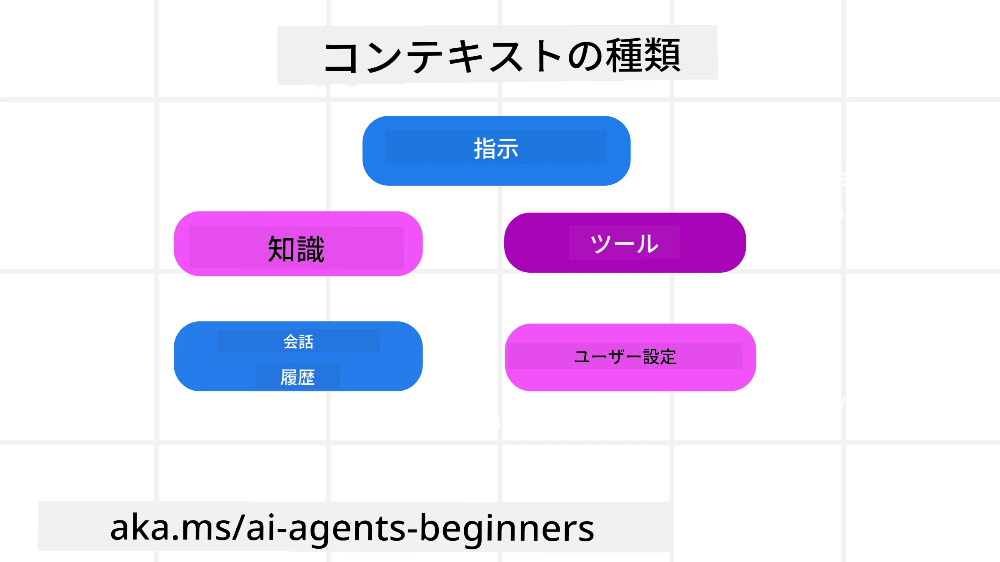
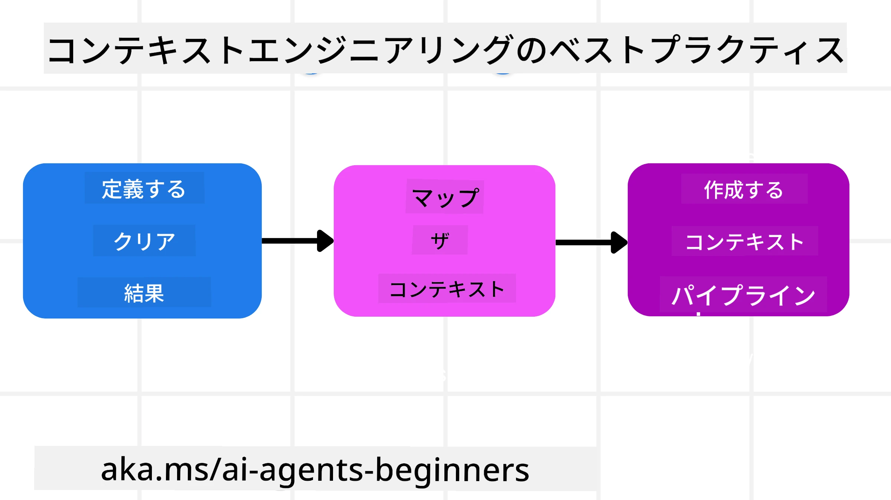

# AIエージェントのためのコンテキストエンジニアリング

> _(上の画像をクリックすると、このレッスンのビデオをご覧いただけます)_

AIエージェントを構築する際に、そのアプリケーションの複雑さを理解することは、信頼性の高いエージェントを作るうえで重要です。単なるプロンプトエンジニアリングを超えた複雑なニーズに対応するために、情報を効果的に管理するAIエージェントを構築する必要があります。

このレッスンでは、コンテキストエンジニアリングとは何か、そのAIエージェント構築における役割について学びます。

## はじめに

本レッスンで扱う内容は以下のとおりです：

• <strong>コンテキストエンジニアリングとは何か</strong>、およびプロンプトエンジニアリングとの違い。

• <strong>効果的なコンテキストエンジニアリングのための戦略</strong>（情報の書き方、選択、圧縮、分離の方法）。

• AIエージェントを脱線させる可能性のある<strong>一般的なコンテキストの失敗例</strong>とその修正方法。

## 学習目標

このレッスンを修了すると、以下のことが理解できます：

• <strong>コンテキストエンジニアリングの定義とプロンプトエンジニアリングとの違い</strong>を理解する。

• 大規模言語モデル（LLM）アプリケーションにおける<strong>コンテキストの主要コンポーネント</strong>を特定する。

• エージェントのパフォーマンスを向上させるための、<strong>コンテキストの書き方、選択、圧縮、分離の戦略</strong>を適用する。

• 毒性の混入、注意散漫、混乱、衝突などの、<strong>よくあるコンテキストの失敗</strong>を認識し、その緩和策を実施する。

## コンテキストエンジニアリングとは？

AIエージェントにとって、コンテキストはエージェントが特定の行動を計画する原動力となります。コンテキストエンジニアリングとは、AIエージェントが次のタスクを完了するために適切な情報を持つようにする実践のことです。コンテキストウィンドウのサイズは限られているため、エージェント開発者はコンテキストウィンドウ内の情報の追加・削除・圧縮を管理するシステムやプロセスを構築する必要があります。

### プロンプトエンジニアリングとコンテキストエンジニアリングの違い

プロンプトエンジニアリングは、AIエージェントを効果的にガイドするための静的な指示セットに注力します。一方、コンテキストエンジニアリングは、初期プロンプトを含む動的な情報セットを管理し、時間の経過とともにエージェントが必要な情報を持ち続けることを保証する方法です。コンテキストエンジニアリングの主な考え方は、このプロセスを繰り返し信頼できるものにすることです。

### コンテキストの種類

コンテキストは単一のものではないということを覚えておくことが重要です。AIエージェントが必要とする情報はさまざまなソースから得られ、それらの情報源にエージェントがアクセスできるようにするのは私たちの役割です。

AIエージェントが管理する可能性のあるコンテキストの種類は以下の通りです：

• **指示（Instructions）:** これらはエージェントの「ルール」のようなもので、プロンプト、システムメッセージ、数ショット例（AIにやり方を示す）、および使用できるツールの説明が含まれます。ここがプロンプトエンジニアリングとコンテキストエンジニアリングの交わる部分です。

• **知識（Knowledge）:** データベースから取得した情報やエージェントが蓄積した長期記憶の事実情報を含みます。エージェントが異なる知識ベースやデータベースにアクセスする必要がある場合には、Retrieval Augmented Generation（RAG）システムの統合も含まれます。

• **ツール（Tools）:** エージェントが呼び出せる外部の関数定義、API、MCPサーバーと、それらを利用して得られたフィードバック（結果）が含まれます。

• **会話履歴（Conversation History）:** ユーザーとの現在進行中の対話です。時間の経過とともに会話は長く複雑になり、コンテキストウィンドウの容量を占めるようになります。

• **ユーザーの好み（User Preferences）:** ユーザーの好き嫌いについて学習した情報です。重要な判断時に呼び出され、ユーザーの支援に役立ちます。

## 効果的なコンテキストエンジニアリングの戦略

### 計画の戦略

良いコンテキストエンジニアリングは良い計画から始まります。コンテキストエンジニアリングの概念を適用するために、以下のアプローチが役立ちます：

1. <strong>明確な成果を定義する</strong> - AIエージェントに割り当てるタスクの成果を明確に定義します。「AIエージェントがタスクを完了した後、世界はどう変わっているのか？」という質問に答えましょう。つまり、ユーザーはAIエージェントとのやり取りの後にどんな変化、情報、または応答を得るべきかを示します。

2. <strong>コンテキストをマッピングする</strong> - 成果を定義したら、「AIエージェントがこのタスクを完了するためにどんな情報が必要か？」という質問に答えます。こうして情報のある場所のコンテキストをマッピングし始めます。

3. <strong>コンテキストパイプラインを作成する</strong> - 情報の場所がわかったので、「エージェントはどのようにしてこの情報を取得するか？」という質問に答えます。これはRAG、MCPサーバーの利用、その他のツール等、さまざまな方法で行えます。

### 実践的な戦略

計画は重要ですが、情報がエージェントのコンテキストウィンドウに流れ込んできたら、具体的な管理戦略が必要になります：

#### コンテキストの管理

情報の一部はコンテキストウィンドウに自動で追加されますが、コンテキストエンジニアリングはこの情報に対して積極的に介入することです。いくつかの戦略が示せます：

1. <strong>エージェントのスクラッチパッド</strong>  
エージェントが現在のタスクやユーザーとのやり取りに関する関連情報をメモできる仕組みです。これはコンテキストウィンドウの外に存在するファイルやランタイムオブジェクトであり、必要に応じてこのセッション内でエージェントが後から取得できます。

2. **メモリー（Memories）**  
スクラッチパッドは単一セッションのコンテキスト外の情報管理に有効ですが、メモリーは複数セッションにまたがり関連情報を保存・取得することを可能にします。これにはサマリー、ユーザーの好み、将来的な改善のためのフィードバックなどが含まれます。

3. <strong>コンテキストの圧縮</strong>  
コンテキストウィンドウが大きくなり制限に近づいたら、要約やトリミングなどの手法を用います。たとえば、最も関連性の高い情報だけを残す、または古いメッセージを削除する方法です。

4. <strong>マルチエージェントシステム</strong>  
複数のエージェントで構成されるシステムの構築はコンテキストエンジニアリングの一形態です。エージェントごとに独自のコンテキストウィンドウがあり、どのように共有し他のエージェントに渡すかを計画する必要があります。

5. <strong>サンドボックス環境</strong>  
エージェントがコードを実行したり、ドキュメント内の大量の情報を処理する必要がある場合、これらの結果を処理するには多くのトークン数が必要となります。これらをすべてコンテキストウィンドウに保存する代わりに、エージェントはコードを実行できるサンドボックス環境を使い、結果や関連情報だけを読み取ります。

6. <strong>ランタイムステートオブジェクト</strong>  
エージェントが特定の情報にアクセスする必要がある状況に対応するため、情報のコンテナを作成します。複雑なタスクでは、エージェントが各小タスクの結果をステップごとに保存でき、コンテキストが特定の小タスクにのみ関連付けられている状態を保てます。

#### コンテキストの検査

これらの戦略を適用した後、次のモデル呼び出しが実際に何を受け取ったかを確認すると良いでしょう。デバッグに役立つ質問は：

> エージェントはコンテキストを多すぎる、誤ったもの、または必要なコンテキストを見逃して読み込んだのか？

この質問に答えるために、生のプロンプトやツール出力、メモリー内容をログにとる必要はありません。運用環境では、カウント、ID、ハッシュ、ポリシーラベルをキャプチャした小さなコンテキスト検査記録を推奨します：

- **選択（Selection）:** どれだけ多くの候補チャンク、ツール、メモリーが検討され、どれだけが選ばれ、どのルールやスコアが他を除外したかを追跡。
- **圧縮（Compression）:** ソース範囲やトレースID、サマリーID、圧縮前後の推定トークン数、次回呼び出しに生コンテンツが含まれたか記録。
- **分離（Isolation）:** どの小タスクが別のエージェント、セッション、サンドボックスで実行され、どんな境界付きサマリーが返され、大量のツール出力が親エージェントコンテキスト外に留まったか記録。
- **メモリーとRAG:** 取得ドキュメントID、メモリーID、スコア、選択ID、編集状態を保存。全文取得テキストは避ける。
- **安全性とプライバシー:** 機密のプロンプトテキストやツール引数、結果、ユーザーメモリ本文の代わりに、ハッシュ、ID、トークンバケット、ポリシーラベルを優先。

目的はコンテキストを増やすことではありません。開発者がどのコンテキスト戦略が動いたか、次のモデル呼び出しに意図した影響を及ぼしたかを判定できる証拠を残すことです。

### コンテキストエンジニアリングの例

例えば、AIエージェントに<strong>「パリへの旅行を予約して」</strong>と頼むとします。

• シンプルにプロンプトエンジニアリングだけを使うエージェントは、<strong>「はい、パリにはいつ行きたいですか？」</strong>と返すかもしれません。これはユーザーの直接的な質問だけを処理した結果です。

• ここで紹介したコンテキストエンジニアリング戦略を使うエージェントはさらに多くのことをします。応答する前に、システムが：

  ◦ あなたの<strong>カレンダー</strong>をチェックし、利用可能な日程を取得（リアルタイムデータ取得）。

  ◦ 長期記憶から過去の<strong>旅行の好み</strong>（好みの航空会社、予算、直行便の希望など）を思い出す。

  ◦ フライトやホテル予約用の<strong>使えるツール</strong>を特定する。

- 例えば、こう応答するかもしれません：「やあ[あなたの名前]！10月の第一週は空いているね。[好みの航空会社]で直行便を、いつもの予算[予算]内で探してみようか？」このような豊富でコンテキストに基づく応答はコンテキストエンジニアリングの力を示しています。

## よくあるコンテキストの失敗

### コンテキスト毒性（Context Poisoning）

**何が起こるか：** LLMが生み出した誤情報（幻覚）やエラーがコンテキストに入り込み、繰り返し参照されることで、エージェントが不可能な目標を追求したり無意味な戦略を展開したりすること。

**対策：** <strong>コンテキスト検証</strong>と<strong>隔離</strong>を実施します。長期記憶に追加する前に情報を検証し、潜在的な毒性が検出されたら、新しいコンテキストスレッドを開始して悪質な情報の拡散を防ぎます。

**旅行予約での例：** エージェントが、実際には国際線を運航していない小規模な地方空港から遠隔国際都市への直行便を幻覚的に想像し、その誤ったフライト情報をコンテキストに保存してしまう。後で予約を頼むと、この不可能なルートのチケット探しを繰り返し試み、エラーを誘発する。

**解決策：** フライト情報をエージェントの作業コンテキストに追加する前に、**リアルタイムAPIでフライトの存在と経路を検証するステップを設ける**。検証に失敗した場合は誤情報を「隔離」し、以後使用しない。

### コンテキストの注意散漫（Context Distraction）

**何が起こるか：** コンテキストが非常に大きくなりすぎて、モデルが訓練で学んだことより過去の履歴に執着し、繰り返しや無益な行動を取るようになる。コンテキストウィンドウが満杯になる前に間違いを起こし始めることも。

**対策：** <strong>コンテキスト要約</strong>を使います。蓄積された情報を定期的に短い要約に圧縮し、重要な詳細は保ちながら冗長な履歴は削除。これにより「焦点をリセット」できます。

**旅行予約での例：** 長時間にわたり夢の旅行先の話をし、2年前のバックパッキング体験を詳細に話したあと、「来月の安いフライトを探して」と頼むと、エージェントは古く関係のない情報に気を取られ、バックパッキング用具や昔の旅程の話題を繰り返し尋ねて現在のリクエストを無視してしまう。

**解決策：** 一定ターン数経過後やコンテキストが大きくなったら、エージェントは<strong>最近かつ関連性の高い会話部分を要約</strong>し、現在の旅行日程や目的地に焦点を当てた要約を次のLLM呼び出しで使い、古い履歴は破棄する。

### コンテキストの混乱（Context Confusion）

**何が起こるか：** 不要なコンテキスト、特に利用可能なツールが多すぎることで、モデルが悪い応答を生成したり、無関係のツールを呼び出したりする。特に小規模モデルで顕著。

**対策：** RAG技術を使った<strong>ツール装備管理</strong>を実装する。ツール説明をベクターデータベースに保存し、それぞれのタスクに最も関連性の高いツールのみを選択。研究では30個未満に限定することが推奨される。

**旅行予約での例：** エージェントは多数のツール（`book_flight`、`book_hotel`、`rent_car`、`find_tours`、`currency_converter`、`weather_forecast`、`restaurant_reservations`など）にアクセス可能。「パリでの移動に最適な方法は？」と尋ねると、多すぎるツールに混乱し、パリ内で`book_flight`を試みたり、公共交通機関を好むのに`rent_car`を呼び出そうとしたりする。

**解決策：** ツールの説明にRAGを適用。「パリでの移動」について問うと、そのクエリに最も関係の深い`rent_car`や`public_transport_info`などのツールだけを動的に取得し、LLMに集中した「装備セット」を提供する。

### コンテキストの衝突（Context Clash）

**何が起こるか：** コンテキスト内に矛盾する情報が存在し、不整合な推論や悪い最終応答を生む。情報が段階的に届く場合、初期の誤った仮定が残ったままになることが多い。

**対策：** <strong>コンテキストの剪定（pruning）</strong>と<strong>オフローディング（offloading）</strong>を使う。剪定は古く矛盾した情報を新しい情報が入るたびに削除する。オフローディングはモデル用に別の「スクラッチパッド」作業スペースを与え、メインのコンテキストを混乱させないように情報を処理する。
**旅行予約の例:** 最初にエージェントに「エコノミークラスで飛びたいです」と伝えます。会話の途中で気が変わり、「実は、今回の旅行はビジネスクラスにしましょう」と言い直します。両方の指示がコンテキストに残っていると、エージェントは矛盾する検索結果を受け取ったり、どの希望を優先すべきか混乱する可能性があります。

**解決策:** <strong>コンテキストプルーニング</strong>を実装します。新しい指示が古いものと矛盾する場合は、古い指示を削除するか明示的に上書きします。あるいは、エージェントが<strong>スクラッチパッド</strong>を使って矛盾する希望を整理し、最終的に一貫した指示のみが行動の指針となるようにします。

## コンテキストエンジニアリングについてもっと質問がありますか？

[Microsoft Foundry Discord](https://aka.ms/ai-agents/discord) に参加して、他の学習者と交流したり、オフィスアワーに参加してAIエージェントの質問に答えてもらいましょう。

---

<!-- CO-OP TRANSLATOR DISCLAIMER START -->
**免責事項**：
本書類は AI 翻訳サービス [Co-op Translator](https://github.com/Azure/co-op-translator) を使用して翻訳されています。正確性を期していますが、自動翻訳には誤りや不正確な部分が含まれる可能性があることをご承知おきください。原文の原語版が正式な情報源とみなされるべきです。重要な情報については、専門の人間による翻訳を推奨します。本翻訳の利用により生じたいかなる誤解や解釈違いについても、当方は責任を負いかねます。
<!-- CO-OP TRANSLATOR DISCLAIMER END -->