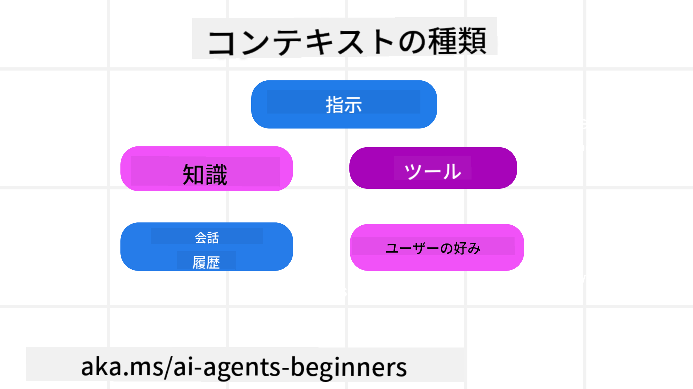
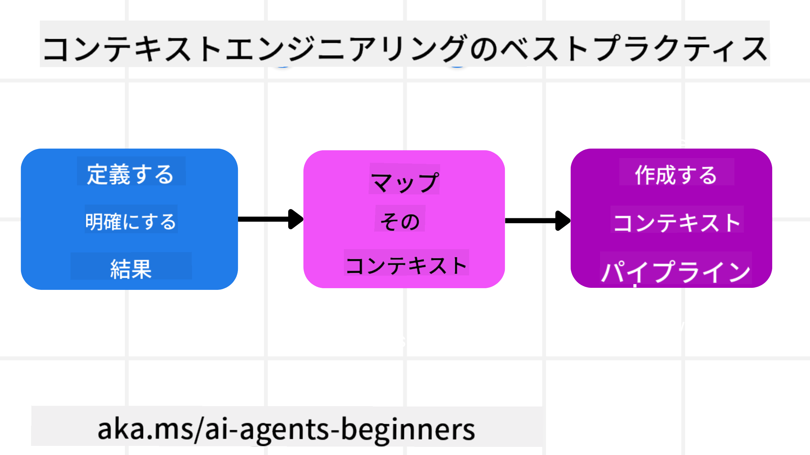

<!--
CO_OP_TRANSLATOR_METADATA:
{
  "original_hash": "cb7e50f471905ce6fdb92a30269a7a98",
  "translation_date": "2025-09-04T09:53:09+00:00",
  "source_file": "12-context-engineering/README.md",
  "language_code": "ja"
}
-->
# AIエージェントのためのコンテキストエンジニアリング

> _(上の画像をクリックして、このレッスンの動画をご覧ください)_

構築するAIエージェントの対象となるアプリケーションの複雑さを理解することは、信頼性の高いエージェントを作るために重要です。プロンプトエンジニアリングを超えて、複雑なニーズに対応するために情報を効果的に管理するAIエージェントを構築する必要があります。

このレッスンでは、コンテキストエンジニアリングとは何か、その役割について学びます。

## はじめに

このレッスンでは以下を学びます：

• **コンテキストエンジニアリングとは何か**、そしてプロンプトエンジニアリングとの違い。

• **効果的なコンテキストエンジニアリングの戦略**、情報の記述、選択、圧縮、分離の方法。

• **よくあるコンテキストの失敗**とその修正方法。

## 学習目標

このレッスンを終えると、以下のことが理解できるようになります：

• **コンテキストエンジニアリングを定義**し、プロンプトエンジニアリングとの違いを説明できる。

• **LLMアプリケーションにおけるコンテキストの重要な要素を特定**できる。

• **コンテキストの記述、選択、圧縮、分離の戦略を適用**してエージェントの性能を向上させる。

• **毒性、注意散漫、混乱、衝突などのよくあるコンテキストの失敗を認識**し、それを軽減する技術を実装できる。

## コンテキストエンジニアリングとは？

AIエージェントにとって、コンテキストは特定の行動を取るための計画を駆動するものです。コンテキストエンジニアリングとは、AIエージェントが次のタスクを完了するために必要な正しい情報を持つようにするための実践です。コンテキストウィンドウにはサイズの制限があるため、エージェントの構築者として、情報を追加、削除、圧縮するシステムとプロセスを構築する必要があります。

### プロンプトエンジニアリングとコンテキストエンジニアリングの違い

プロンプトエンジニアリングは、AIエージェントを一連のルールで効果的に導く静的な指示に焦点を当てています。一方、コンテキストエンジニアリングは、初期プロンプトを含む動的な情報セットを管理し、時間をかけてAIエージェントが必要な情報を確保する方法に焦点を当てています。コンテキストエンジニアリングの主なアイデアは、このプロセスを繰り返し可能で信頼性の高いものにすることです。

### コンテキストの種類

コンテキストは単一のものではないことを覚えておくことが重要です。AIエージェントが必要とする情報はさまざまなソースから来る可能性があり、エージェントがこれらのソースにアクセスできるようにするのは私たちの役割です。

AIエージェントが管理する必要があるコンテキストの種類には以下が含まれます：

• **指示:** エージェントの「ルール」のようなものです。プロンプト、システムメッセージ、少数ショットの例（AIに何かをする方法を示す）、使用可能なツールの説明などが含まれます。これはプロンプトエンジニアリングとコンテキストエンジニアリングが融合する部分です。

• **知識:** データベースから取得した事実や情報、エージェントが蓄積した長期記憶を指します。エージェントが異なる知識ストアやデータベースにアクセスする必要がある場合、RAGシステムの統合が含まれます。

• **ツール:** 外部関数、API、MCPサーバーの定義と、それらを使用した結果（フィードバック）を指します。

• **会話履歴:** ユーザーとの継続的な対話。時間が経つにつれて、これらの会話は長く複雑になり、コンテキストウィンドウ内のスペースを占有します。

• **ユーザーの好み:** 時間をかけて学習したユーザーの好みや嫌いなもの。これらは重要な決定をする際に呼び出され、ユーザーを助けることができます。

## 効果的なコンテキストエンジニアリングの戦略

### 計画戦略

良いコンテキストエンジニアリングは良い計画から始まります。以下はコンテキストエンジニアリングの概念を適用する方法を考えるためのアプローチです：

1. **明確な結果を定義する** - AIエージェントに割り当てられるタスクの結果を明確に定義します。「AIエージェントがタスクを完了したとき、世界はどう変わるのか？」という質問に答えます。つまり、ユーザーがAIエージェントと対話した後に得るべき変化、情報、または応答を定義します。

2. **コンテキストをマッピングする** - AIエージェントの結果を定義したら、「このタスクを完了するためにAIエージェントが必要とする情報は何か？」という質問に答えます。これにより、その情報がどこにあるかをマッピングすることができます。

3. **コンテキストパイプラインを作成する** - 情報の場所が分かったら、「エージェントはこの情報をどのように取得するのか？」という質問に答えます。これにはRAG、MCPサーバーの使用、その他のツールが含まれます。

### 実践的な戦略

計画は重要ですが、情報がエージェントのコンテキストウィンドウに流れ込むときには、それを管理する実践的な戦略が必要です：

#### コンテキストの管理

一部の情報は自動的にコンテキストウィンドウに追加されますが、コンテキストエンジニアリングはこの情報をより積極的に管理することを目的としています。以下の戦略があります：

1. **エージェントのスクラッチパッド**  
エージェントが現在のタスクやユーザーとのやり取りに関する関連情報をメモするためのものです。これはコンテキストウィンドウの外部に存在し、ファイルやランタイムオブジェクトとして保存され、必要に応じてセッション中に後で取得できます。

2. **記憶**  
スクラッチパッドは単一セッションのコンテキストウィンドウ外で情報を管理するのに適していますが、記憶は複数のセッションにわたって関連情報を保存し、取得することを可能にします。これには要約、ユーザーの好み、将来の改善のためのフィードバックが含まれます。

3. **コンテキストの圧縮**  
コンテキストウィンドウが大きくなり、その制限に近づいた場合、要約やトリミングなどの技術を使用できます。これには最も関連性の高い情報のみを保持するか、古いメッセージを削除することが含まれます。

4. **マルチエージェントシステム**  
マルチエージェントシステムを開発することはコンテキストエンジニアリングの一形態です。各エージェントが独自のコンテキストウィンドウを持ち、そのコンテキストを他のエージェントと共有し、渡す方法を計画する必要があります。

5. **サンドボックス環境**  
エージェントがコードを実行したり、ドキュメント内の大量の情報を処理する必要がある場合、結果を処理するために多くのトークンを使用する可能性があります。これをコンテキストウィンドウにすべて保存する代わりに、エージェントはコードを実行できるサンドボックス環境を使用し、結果やその他の関連情報のみを読み取ることができます。

6. **ランタイム状態オブジェクト**  
エージェントが特定の情報にアクセスする必要がある状況を管理するための情報コンテナを作成します。複雑なタスクの場合、エージェントが各サブタスクの結果をステップごとに保存し、その特定のサブタスクにのみ関連するコンテキストを維持することができます。

### コンテキストエンジニアリングの例

例えば、AIエージェントに **「パリへの旅行を予約してほしい」** と言ったとします。

• プロンプトエンジニアリングのみを使用する単純なエージェントは、**「わかりました。いつパリに行きたいですか？」** と答えるだけです。これはユーザーが質問した時点での直接的な質問のみを処理します。

• コンテキストエンジニアリングの戦略を使用するエージェントは、もっと多くのことを行います。応答する前に、そのシステムは以下を行うかもしれません：

  ◦ **カレンダーを確認**して利用可能な日付を取得（リアルタイムデータの取得）。

 ◦ **過去の旅行の好みを思い出す**（長期記憶から）、例えば好みの航空会社、予算、直行便を好むかどうか。

 ◦ **利用可能なツールを特定**して、フライトやホテルの予約を行う。

- その後、例として以下のような応答をするかもしれません：  
「こんにちは、[あなたの名前]さん！10月の第1週が空いているようですね。[好みの航空会社]で予算内の直行便を探しましょうか？」  
このような豊かなコンテキストを考慮した応答は、コンテキストエンジニアリングの力を示しています。

## よくあるコンテキストの失敗

### コンテキストの毒性

**概要:** LLMが生成した誤情報（幻覚）やエラーがコンテキストに入り込み、それが繰り返し参照されることで、エージェントが不可能な目標を追求したり、無意味な戦略を展開する原因となる。

**対策:** **コンテキストの検証**と**隔離**を実施します。長期記憶に追加される前に情報を検証します。毒性の可能性が検出された場合、新しいコンテキストスレッドを開始して悪い情報の拡散を防ぎます。

**旅行予約の例:** エージェントが**小さな地方空港から遠く離れた国際都市への直行便**を幻覚し、その空港が実際には国際便を提供していないにもかかわらず、その詳細をコンテキストに保存します。その後、エージェントに予約を依頼すると、この不可能なルートのチケットを探し続け、繰り返しエラーが発生します。

**解決策:** **リアルタイムAPIを使用してフライトの存在とルートを検証するステップ**を実装し、フライトの詳細をエージェントの作業コンテキストに追加する前に検証します。検証が失敗した場合、誤った情報は「隔離」され、それ以上使用されません。

### コンテキストの注意散漫

**概要:** コンテキストが大きくなりすぎると、モデルが蓄積された履歴に過度に集中し、トレーニング中に学んだことを活用せず、繰り返しや役に立たない行動を取る原因となります。コンテキストウィンドウがいっぱいになる前にモデルがミスを犯し始めることもあります。

**対策:** **コンテキストの要約**を使用します。定期的に蓄積された情報を短い要約に圧縮し、重要な詳細を保持しながら冗長な履歴を削除します。これにより、モデルの焦点を「リセット」できます。

**旅行予約の例:** 長時間にわたりさまざまな夢の旅行先について話し合い、2年前のバックパッキング旅行の詳細な話を含めています。最終的に **「来月の安いフライトを探して」** と依頼すると、エージェントが古い、関連性のない詳細に執着し、バックパッキング用具や過去の旅程について尋ね続け、現在のリクエストを無視します。

**解決策:** 一定のターン数後、またはコンテキストが大きくなりすぎた場合、エージェントは**最近の関連部分を要約**し、現在の旅行日程と目的地に焦点を当てた要約を使用して次のLLM呼び出しを行い、過去の関連性の低いチャットを破棄します。

### コンテキストの混乱

**概要:** 不必要なコンテキスト、特に利用可能なツールが多すぎる場合、モデルが悪い応答を生成したり、関連性のないツールを呼び出す原因となります。小型モデルは特にこれに弱いです。

**対策:** RAG技術を使用して**ツールのロードアウト管理**を実施します。ツールの説明をベクトルデータベースに保存し、特定のタスクに最も関連性の高いツールのみを選択します。研究によれば、ツールの選択を30未満に制限することが推奨されています。

**旅行予約の例:** エージェントが多数のツールにアクセスできます：`book_flight`、`book_hotel`、`rent_car`、`find_tours`、`currency_converter`、`weather_forecast`、`restaurant_reservations`など。**「パリでの移動手段のおすすめは？」** と尋ねると、ツールが多すぎるため、エージェントが混乱し、パリ内で`book_flight`を呼び出したり、公共交通機関を好むにもかかわらず`rent_car`を提案したりします。

**解決策:** **ツールの説明に対するRAGを使用**します。パリでの移動手段について尋ねると、システムは動的に`rent_car`や`public_transport_info`など、最も関連性の高いツールのみを取得し、LLMに焦点を絞った「ロードアウト」を提示します。

### コンテキストの衝突

**概要:** コンテキスト内に矛盾する情報が存在すると、推論が不一致になったり、最終的な応答が悪くなる原因となります。情報が段階的に到着し、初期の誤った仮定がコンテキストに残る場合にこれが発生します。

**対策:** **コンテキストの剪定**と**オフロード**を使用します。剪定は、新しい詳細が到着すると古い情報や矛盾する情報を削除することを意味します。オフロードは、モデルに別の「スクラッチパッド」作業スペースを提供し、主要なコンテキストを乱雑にせずに情報を処理することを可能にします。

**旅行予約の例:** 最初にエージェントに **「エコノミークラスで飛びたい」** と言います。その後、会話の中で気が変わり、**「今回はビジネスクラスにしよう」** と言います。両方の指示がコンテキストに残ると、エージェントが矛盾する検索結果を受け取ったり、どちらの好みを優先するべきか混乱する可能性があります。

**解決策:** **コンテキストの剪定**を実施します。新しい指示が古い指示と矛盾する場合、古い指示はコンテキストから削除されるか、明示的に上書きされます。あるいは、エージェントは**スクラッチパッド**を使用して、決定を下す前に矛盾する設定を調整し、最終的な一貫性のある指示のみが行動の指針となるようにすることもできます。

---

**免責事項**:  
この文書は、AI翻訳サービス [Co-op Translator](https://github.com/Azure/co-op-translator) を使用して翻訳されています。正確性を追求しておりますが、自動翻訳には誤りや不正確な部分が含まれる可能性があります。元の言語で記載された文書を正式な情報源としてお考えください。重要な情報については、専門の人間による翻訳を推奨します。この翻訳の使用に起因する誤解や誤解について、当社は責任を負いません。
