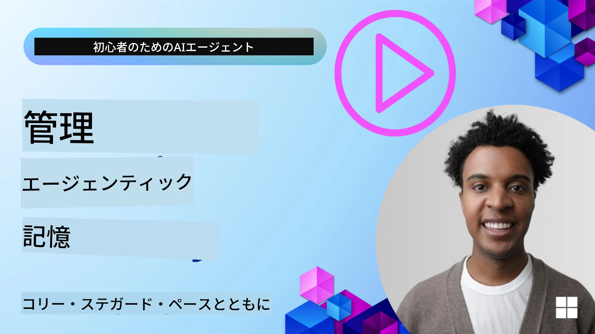

# AIエージェントのメモリ 

AIエージェントを作成する際の独自の利点について議論するとき、主に2つが話題になります：タスクを完了するためにツールを呼び出す能力と、時間とともに改善する能力です。メモリは、ユーザーにより良い体験を提供できる自己改善型エージェントを作成する基盤にあります。

このレッスンでは、AIエージェントにおけるメモリとは何か、それをどのように管理しアプリケーションの利益に活用できるかを見ていきます。

## はじめに

このレッスンで扱う内容は次のとおりです：

• **AIエージェントのメモリを理解する**：メモリとは何か、なぜエージェントにとって重要なのか。

• **メモリの実装と保存**：短期記憶と長期記憶に焦点を当て、AIエージェントにメモリ機能を追加する実践的な方法。

• **自己改善するAIエージェントの作り方**：メモリがどのように過去のやり取りから学習し、時間とともに改善することを可能にするか。

## 利用可能な実装

このレッスンには、2つの包括的なノートブックチュートリアルが含まれます：

• **[13-agent-memory.ipynb](./13-agent-memory.ipynb)**: Mem0 と Azure AI Search を Microsoft Agent Framework と組み合わせてメモリを実装します

• **[13-agent-memory-cognee.ipynb](./13-agent-memory-cognee.ipynb)**: Cognee を使用して構造化メモリを実装し、埋め込みに裏打ちされたナレッジグラフを自動構築、グラフを可視化し、インテリジェントな検索を行います

## 学習目標

このレッスンを修了すると、以下が分かるようになります：

• **作業記憶、短期記憶、長期記憶など、さまざまなタイプのAIエージェントのメモリの違い**、およびペルソナ記憶やエピソード記憶のような専門的な形態について区別できること。

• **Microsoft Agent Framework を使用してAIエージェントの短期記憶と長期記憶を実装および管理する方法**、Mem0、Cognee、Whiteboard memory などのツールを活用し、Azure AI Search と統合する方法。

• **自己改善するAIエージェントの原則**と、堅牢なメモリ管理システムが継続的な学習と適応にどのように寄与するかを理解すること。

## AIエージェントのメモリを理解する

本質的に、**AIエージェントのメモリとは、情報を保持し呼び出すことを可能にする仕組み**を指します。この情報は会話の具体的な詳細、ユーザーの好み、過去の行動、あるいは学習したパターンなどを含むことがあります。

メモリがないと、AIアプリケーションはしばしばステートレスであり、各対話が最初から始まることになります。これはエージェントが以前のコンテキストや好みを「忘れる」ため、反復的でフラストレーションのたまるユーザー体験につながります。

### なぜメモリが重要か？

エージェントの知能は過去の情報を想起し活用する能力に深く結びついています。メモリによりエージェントは以下のことが可能になります：

• **反省的**：過去の行動や結果から学習する。

• **対話的**：継続中の会話でコンテキストを保つ。

• **先取り的および反応的**：過去のデータに基づいてニーズを予測したり適切に応答したりする。

• **自律的**：蓄積された知識を引き出してより独立して動作する。

メモリを実装する目的は、エージェントをより**信頼でき、能力の高いものにする**ことです。

### メモリの種類

#### 作業記憶（Working Memory）

これはエージェントが単一の進行中のタスクや思考過程の間に使うメモのようなものです。次のステップを計算するために必要な即時情報を保持します。

AIエージェントでは、作業記憶は会話から最も関連性の高い情報をキャプチャすることが多く、チャット履歴が長く切り詰められている場合でも重要な要素を抽出します。要件、提案、決定、アクションなどの主要な要素の抽出に焦点を当てます。

**作業記憶の例**

旅行予約エージェントでは、「パリへの旅行を予約したい」といったユーザーの現在のリクエストが作業記憶に保持され、現在のやり取りを導くための即時コンテキストとして機能します。

#### 短期記憶（Short Term Memory）

このタイプのメモリは、単一の会話やセッションの期間中の情報を保持します。現在のチャットのコンテキストであり、エージェントが対話内の前の発言を参照できるようにします。

**短期記憶の例**

ユーザーが「パリ行きのフライトはいくらですか？」と尋ね、その後で「そこの宿泊施設はどう？」と続けた場合、短期記憶は「そこの」が同じ会話内で「パリ」を指していることを確実に把握します。

#### 長期記憶（Long Term Memory）

これは複数の会話やセッションにわたって持続する情報です。ユーザーの好みや過去のやり取り、あるいは長期間にわたる一般的な知識を覚えておくことを可能にします。パーソナライズには重要です。

**長期記憶の例**

長期記憶は「Benはスキーやアウトドア活動が好きで、山の見えるコーヒーが好きで、過去の怪我のため上級コースは避けたい」といった情報を保存するかもしれません。これは過去のやり取りから学ばれ、将来の旅行プランの推奨に影響を与え、非常に個別化された体験を作り出します。

#### ペルソナ記憶（Persona Memory）

この専門的なメモリタイプは、エージェントが一貫した「人格」や「ペルソナ」を発揮するのを助けます。エージェント自身やその想定される役割に関する詳細を覚えておくことで、やり取りがより流暢で焦点の合ったものになります。

**ペルソナ記憶の例**
旅行エージェントが「スキーの専門家プランナー」として設計されている場合、ペルソナ記憶はこの役割を強化し、専門家の口調や知識に沿った応答に影響を与えるかもしれません。

#### ワークフロー／エピソード記憶（Workflow/Episodic Memory）

このメモリは、複雑なタスク中にエージェントが取るステップのシーケンス（成功や失敗を含む）を保存します。特定の「エピソード」や過去の経験を記憶してそこから学ぶようなものです。

**エピソード記憶の例**

エージェントが特定のフライトを予約しようとして在庫不足で失敗した場合、エピソード記憶はこの失敗を記録し、次回の試みで代替フライトを試すか、ユーザーにより的確に問題を伝えることができます。

#### エンティティ記憶（Entity Memory）

これは会話から特定のエンティティ（人、場所、物など）やイベントを抽出して記憶することを含みます。エージェントが議論された主要な要素の構造化された理解を構築できるようにします。

**エンティティ記憶の例**

過去の旅行についての会話から、エージェントは「パリ」「エッフェル塔」「Le Chat Noirでのディナー」といったエンティティを抽出するかもしれません。将来のやり取りでは、エージェントは「Le Chat Noir」を思い出し、そこでの新しい予約を提案することができます。

#### Structured RAG（Retrieval Augmented Generation の構造化版）

RAG はより広範な技術ですが、ここでは「Structured RAG」が強力なメモリ技術として強調されています。これは会話、メール、画像などのさまざまなソースから密で構造化された情報を抽出し、それを応答の精度、再現性、速度の向上に利用します。従来のセマンティック類似度のみに依存するクラシックなRAGとは異なり、Structured RAGは情報の固有の構造を活用します。

**Structured RAG の例**

単にキーワードを一致させるのではなく、Structured RAG はメールからフライトの詳細（目的地、日付、時間、航空会社）を解析して構造化された形で保存することができます。これにより「火曜日にパリへ予約したフライトはどれ？」のような正確な問い合わせが可能になります。

## メモリの実装と保存

AIエージェントのメモリを実装するには、生成、保存、検索、統合、更新、そして場合によっては「忘却」（または削除）を含む体系的なプロセスである**メモリ管理**が必要です。特に重要なのは検索（retrieval）です。

### 専用メモリツール

#### Mem0

エージェントのメモリを保存・管理する方法の一つは、Mem0 のような専用ツールを使用することです。Mem0 は永続的なメモリレイヤーとして機能し、エージェントが関連するやり取りを想起し、ユーザーの好みや事実的コンテキストを保存し、成功や失敗から学習することを可能にします。ここでのアイデアはステートレスなエージェントをステートフルなものに変えることです。

これは**二段階のメモリパイプライン：抽出と更新**を通じて動作します。まず、エージェントのスレッドに追加されたメッセージが Mem0 サービスに送られ、そこで大規模言語モデル（LLM）を使って会話履歴を要約し新しいメモリを抽出します。続いて、LLM駆動の更新フェーズでこれらのメモリを追加、修正、または削除するかどうかが判断され、ベクトル、グラフ、キー・バリュー型データベースを含むハイブリッドデータストアに保存されます。このシステムはさまざまなメモリタイプをサポートし、エンティティ間の関係を管理するためのグラフメモリを組み込むこともできます。

#### Cognee

もう一つの強力なアプローチは、構造化および非構造化データを埋め込みに裏打ちされたクエリ可能なナレッジグラフに変換するオープンソースのセマンティックメモリである **Cognee** を使うことです。Cognee はベクトル類似検索とグラフ関係を組み合わせた**デュアルストアアーキテクチャ**を提供し、エージェントが情報の類似性だけでなく概念同士の関係も理解できるようにします。

これはベクトル類似度、グラフ構造、LLMによる推論をブレンドする**ハイブリッド検索**に優れており、生のチャンク検索からグラフ対応の質問応答まで対応します。システムは**生きたメモリ（living memory）**を維持し、成長しながらも一つの接続されたグラフとしてクエリ可能であり、短期のセッションコンテキストと長期の永続メモリの両方をサポートします。

Cognee のノートブックチュートリアル（[13-agent-memory-cognee.ipynb](./13-agent-memory-cognee.ipynb)）は、この統合メモリレイヤーの構築を示しており、さまざまなデータソースの取り込み、ナレッジグラフの可視化、エージェントのニーズに合わせた異なる検索戦略でのクエリの実例を提供します。

### RAG を用いたメモリの保存

mem0 のような専用メモリツールに加えて、**Azure AI Search のような強力な検索サービスをメモリの保存と検索のバックエンドとして利用する**ことができます。特に構造化された RAG に適しています。

これにより、エージェントの応答を自分のデータで裏付けし、より関連性が高く正確な回答を得ることができます。Azure AI Search はユーザー固有の旅行メモリ、製品カタログ、またはその他のドメイン固有の知識を保存するために使用できます。

Azure AI Search は、会話履歴、メール、画像のような大規模データセットから密で構造化された情報を抽出および検索するのに優れた **Structured RAG** のような機能をサポートします。これは従来のテキストチャンクと埋め込みアプローチに比べて「人間を超える精度と再現性」を提供します。

## AIエージェントを自己改善させる

自己改善するエージェントの一般的なパターンは、**「ナレッジエージェント」**を導入することです。この別のエージェントは、ユーザーと主要エージェントの間の会話を観察します。その役割は次のとおりです：

1. **価値のある情報を特定する**：会話のどの部分を一般的な知識や特定のユーザーの好みとして保存する価値があるかを判断する。

2. **抽出と要約**：会話から重要な学びや好みを抽出して要約する。

3. **ナレッジベースに保存する**：抽出した情報をしばしばベクトルデータベースに永続化し、後で検索できるようにする。

4. **将来のクエリを拡張する**：ユーザーが新しいクエリを開始したとき、ナレッジエージェントは関連する保存情報を取得してユーザーのプロンプトに付加し、主要エージェントに重要なコンテキストを提供する（RAG と同様）。

### メモリの最適化

• **レイテンシ管理**：ユーザー対話を遅くしないために、まずは安価で高速なモデルを使用して情報が保存や検索に値するかを素早くチェックし、必要な場合にのみより複雑な抽出／検索プロセスを呼び出すことができます。

• **ナレッジベースのメンテナンス**：増大するナレッジベースに対しては、使用頻度の低い情報を「コールドストレージ」に移すなどしてコストを管理できます。

## エージェントのメモリについてさらに質問がありますか？

他の学習者と出会い、オフィスアワーに参加し、AIエージェントに関する質問に答えてもらうには、[Microsoft Foundry Discord](https://aka.ms/ai-agents/discord) に参加してください。

---

<!-- CO-OP TRANSLATOR DISCLAIMER START -->
免責事項：
本書はAI翻訳サービス「Co‑op Translator」（https://github.com/Azure/co-op-translator）を用いて翻訳されました。正確さを期しておりますが、自動翻訳には誤りや不正確な表現が含まれる場合があることをご承知おきください。原文が権威ある出典とみなされるべきです。重要な情報については、専門の人間による翻訳を推奨します。本翻訳の利用に伴って生じた誤解や解釈の相違について、当方は一切の責任を負いません。
<!-- CO-OP TRANSLATOR DISCLAIMER END -->