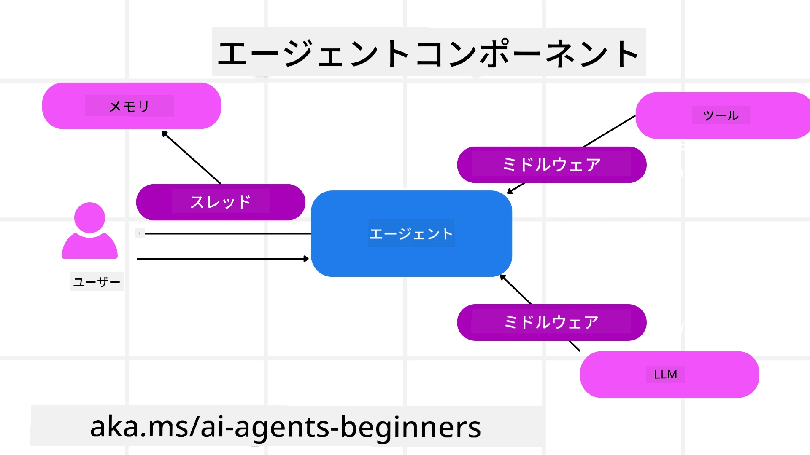

# Microsoft Agent Framework の探求


### はじめに

このレッスンでは以下を扱います：

- Microsoft Agent Framework の理解：主な特徴と価値  
- Microsoft Agent Framework の主要コンセプトの探求
- 高度な MAF パターン：ワークフロー、ミドルウェア、メモリ

## 学習目標

このレッスンを終えると、以下ができるようになります：

- Microsoft Agent Framework を使って生産対応可能な AI エージェントの構築
- Microsoft Agent Framework のコア機能をエージェント利用ケースに適用
- ワークフロー、ミドルウェア、オブザーバビリティを含む高度なパターンの活用

## コードサンプル

[Microsoft Agent Framework (MAF)](https://aka.ms/ai-agents-beginners/agent-framewrok) のコードサンプルはこのリポジトリの `xx-python-agent-framework` と `xx-dotnet-agent-framework` ファイル内にあります。

## Microsoft Agent Framework を理解する


[Microsoft Agent Framework (MAF)](https://aka.ms/ai-agents-beginners/agent-framewrok) は AI エージェント構築のための Microsoft の統一フレームワークです。生産環境や研究環境で見られる様々なエージェント利用ケースに対応する柔軟性を提供します：

- **逐次的エージェントオーケストレーション**：ステップバイステップのワークフローが必要なシナリオで
- **並行オーケストレーション**：エージェントが同時にタスクを完了する必要があるシナリオで
- **グループチャットオーケストレーション**：エージェントが一つのタスクに協力して取り組むシナリオで
- **ハンドオフオーケストレーション**：サブタスクが完了するたびにエージェント間でタスクを引き継ぐシナリオで
- **マグネティックオーケストレーション**：マネージャエージェントがタスクリストを作成・変更し、サブエージェントの調整を行うシナリオで

生産環境で AI エージェントを提供するために、MAF は以下の機能も備えています：

- **オブザーバビリティ**：OpenTelemetry を使い、AI エージェントのすべてのアクション（ツール呼び出し、オーケストレーションステップ、推論フロー、Microsoft Foundry ダッシュボードによるパフォーマンス監視）を追跡
- **セキュリティ**：Microsoft Foundry 上でのネイティブホスティングにより、役割ベースアクセス、プライベートデータ処理、組み込みのコンテンツ安全機能などのセキュリティ制御
- **耐久性**：エージェントスレッドやワークフローは一時停止、再開、エラーからの回復が可能で、長時間の処理を実現
- **制御**：人間による承認が必要なタスクに対応するヒューマンインザループワークフローのサポート

Microsoft Agent Framework は以下の点でも相互運用性を重視しています：

- **クラウド非依存** — エージェントはコンテナ、オンプレミス、複数のクラウド環境で実行可能
- **プロバイダー非依存** — Azure OpenAI や OpenAI など好みの SDK を用いてエージェントを作成可能
- **オープンスタンダードの統合** — Agent-to-Agent (A2A) や Model Context Protocol (MCP) といったプロトコルを使い、他のエージェントやツールを発見・利用可能
- **プラグインとコネクター** — Microsoft Fabric、SharePoint、Pinecone、Qdrant といったデータやメモリサービスへの接続が可能

これらの機能が Microsoft Agent Framework の主要コンセプトにどのように適用されているかを見てみましょう。

## Microsoft Agent Framework の主要コンセプト

### エージェント



**エージェントの作成**

エージェントは推論サービス（LLM プロバイダー）、AI エージェントが従う指示セット、および割り当てられた `name` を定義して作成します：

```python
agent = AzureOpenAIChatClient(credential=AzureCliCredential()).create_agent( instructions="You are good at recommending trips to customers based on their preferences.", name="TripRecommender" )
```

上記は `Azure OpenAI` を使っていますが、`Microsoft Foundry Agent Service` を含む様々なサービスでエージェントを作成可能です：

```python
AzureAIAgentClient(async_credential=credential).create_agent( name="HelperAgent", instructions="You are a helpful assistant." ) as agent
```

OpenAI の `Responses`、`ChatCompletion` API

```python
agent = OpenAIResponsesClient().create_agent( name="WeatherBot", instructions="You are a helpful weather assistant.", )
```

```python
agent = OpenAIChatClient().create_agent( name="HelpfulAssistant", instructions="You are a helpful assistant.", )
```

または A2A プロトコルを使ったリモートエージェント：

```python
agent = A2AAgent( name=agent_card.name, description=agent_card.description, agent_card=agent_card, url="https://your-a2a-agent-host" )
```

**エージェントの実行**

エージェントは `.run` または `.run_stream` メソッドで非ストリーミングまたはストリーミング応答を用いて実行されます。

```python
result = await agent.run("What are good places to visit in Amsterdam?")
print(result.text)
```

```python
async for update in agent.run_stream("What are the good places to visit in Amsterdam?"):
    if update.text:
        print(update.text, end="", flush=True)

```

各エージェント実行時に、エージェントで使われる `max_tokens` や呼び出せる `tools`、さらには使用する `model` 自体といったパラメーターのカスタマイズオプションを設定可能です。

これはユーザーのタスクに特定のモデルやツールが必要な場合に役立ちます。

**ツール**

ツールはエージェント定義時に：

```python
def get_attractions( location: Annotated[str, Field(description="The location to get the top tourist attractions for")], ) -> str: """Get the top tourist attractions for a given location.""" return f"The top attractions for {location} are." 


# ChatAgent を直接作成するとき

agent = ChatAgent( chat_client=OpenAIChatClient(), instructions="You are a helpful assistant", tools=[get_attractions]

```

またはエージェント実行時にも定義可能です：

```python

result1 = await agent.run( "What's the best place to visit in Seattle?", tools=[get_attractions] # この実行専用のツールです )
```

**エージェントスレッド**

エージェントスレッドはマルチターンの会話を扱うために使われます。スレッドは次の方法で生成できます：

- `get_new_thread()` を使い、時間をかけてスレッドを保存可能にする
- エージェントの実行時に自動でスレッドを生成し、現在の実行中のみ有効にする

スレッドの生成コード例：

```python
# 新しいスレッドを作成します。
thread = agent.get_new_thread() # スレッドでエージェントを実行します。
response = await agent.run("Hello, I am here to help you book travel. Where would you like to go?", thread=thread)

```

スレッドは後で使用するためにシリアライズして保存できます：

```python
# 新しいスレッドを作成します。
thread = agent.get_new_thread() 

# スレッドでエージェントを実行します。

response = await agent.run("Hello, how are you?", thread=thread) 

# 保存のためにスレッドをシリアライズします。

serialized_thread = await thread.serialize() 

# 保存から読み込んだ後にスレッドの状態をデシリアライズします。

resumed_thread = await agent.deserialize_thread(serialized_thread)
```

**エージェントミドルウェア**

エージェントはツールや LLM と連携してユーザーのタスクを完遂します。特定のシナリオではこれらのやり取りの間に処理や追跡を行いたい場合があります。エージェントミドルウェアは以下を通じてそれを可能にします：

*関数ミドルウェア*

関数ミドルウェアは、エージェントと呼び出す関数/ツールの間でアクションを実行します。例として関数呼び出しのログを行う場合などがあります。

以下のコードで `next` は次のミドルウェアまたは実際の関数を呼び出すかを定義しています。

```python
async def logging_function_middleware(
    context: FunctionInvocationContext,
    next: Callable[[FunctionInvocationContext], Awaitable[None]],
) -> None:
    """Function middleware that logs function execution."""
    # 前処理：関数実行前のログ
    print(f"[Function] Calling {context.function.name}")

    # 次のミドルウェアまたは関数実行に進む
    await next(context)

    # 後処理：関数実行後のログ
    print(f"[Function] {context.function.name} completed")
```

*チャットミドルウェア*

このミドルウェアはエージェントと LLM へのリクエスト間でアクションの実行やログを可能にします。

ここには AI サービスへ送信される `messages` といった重要な情報が含まれます。

```python
async def logging_chat_middleware(
    context: ChatContext,
    next: Callable[[ChatContext], Awaitable[None]],
) -> None:
    """Chat middleware that logs AI interactions."""
    # 前処理：AI呼び出し前のログ
    print(f"[Chat] Sending {len(context.messages)} messages to AI")

    # 次のミドルウェアまたはAIサービスへ続行
    await next(context)

    # 後処理：AI応答後のログ
    print("[Chat] AI response received")

```

**エージェントメモリ**

「Agentic Memory」レッスンで扱ったように、メモリは異なるコンテキストに跨るエージェント動作を可能にする重要な要素です。MAF はいくつかのメモリタイプを提供しています：

*インメモリストレージ*

これはアプリケーション実行中のスレッドに保存されるメモリです。

```python
# 新しいスレッドを作成します。
thread = agent.get_new_thread() # スレッドでエージェントを実行します。
response = await agent.run("Hello, I am here to help you book travel. Where would you like to go?", thread=thread)
```

*永続メッセージ*

これは異なるセッション間で会話履歴を保存するメモリです。`chat_message_store_factory` で定義されます：

```python
from agent_framework import ChatMessageStore

# カスタムメッセージストアを作成する
def create_message_store():
    return ChatMessageStore()

agent = ChatAgent(
    chat_client=OpenAIChatClient(),
    instructions="You are a Travel assistant.",
    chat_message_store_factory=create_message_store
)

```

*動的メモリ*

エージェント実行前にコンテキストに追加されるメモリです。外部サービス（mem0 など）に保存可能です：

```python
from agent_framework.mem0 import Mem0Provider

# 高度なメモリ機能のためにMem0を使用する
memory_provider = Mem0Provider(
    api_key="your-mem0-api-key",
    user_id="user_123",
    application_id="my_app"
)

agent = ChatAgent(
    chat_client=OpenAIChatClient(),
    instructions="You are a helpful assistant with memory.",
    context_providers=memory_provider
)

```

**エージェントのオブザーバビリティ**

オブザーバビリティは信頼性が高くメンテナンスしやすいエージェントシステムの構築に重要です。MAF は OpenTelemetry と統合し、トレーシングやメーターを提供します。

```python
from agent_framework.observability import get_tracer, get_meter

tracer = get_tracer()
meter = get_meter()
with tracer.start_as_current_span("my_custom_span"):
    # 何かをする
    pass
counter = meter.create_counter("my_custom_counter")
counter.add(1, {"key": "value"})
```

### ワークフロー

MAF は、タスク完了のために事前定義されたステップを提供し、それらのステップに AI エージェントをコンポーネントとして含めるワークフローを提供します。

ワークフローは、より良い制御フローを可能にするさまざまなコンポーネントで構成されます。ワークフローは**マルチエージェントオーケストレーション**や**チェックポイント保存**で状態保存も可能にします。

ワークフローの主な構成要素は次の通りです：

**エグゼキューター**

エグゼキューターは入力メッセージを受け取り、割り当てられたタスクを実行し、出力メッセージを生成します。これにより、ワークフローはより大きなタスクの完了へ進みます。エグゼキューターは AI エージェントやカスタムロジックのいずれかです。

**エッジ**

エッジはワークフロー内のメッセージの流れを定義します。種類は以下の通りです：

*直接エッジ* — エグゼキューター間の単純な一対一の接続：

```python
from agent_framework import WorkflowBuilder

builder = WorkflowBuilder()
builder.add_edge(source_executor, target_executor)
builder.set_start_executor(source_executor)
workflow = builder.build()
```

*条件付きエッジ* — ある条件を満たしたときに発動。例えば、ホテルの部屋が空いていない場合に他の選択肢を提案するエグゼキューターなど。

*スイッチケースエッジ* — 定義された条件に基づいてメッセージを異なるエグゼキューターにルーティング。例：優先アクセスを持つ旅行者のタスクは別のワークフローで処理される場合など。

*ファンアウトエッジ* — ひとつのメッセージを複数のターゲットに送信。

*ファンインエッジ* — 複数の異なるエグゼキューターからのメッセージを集約し、ひとつのターゲットに送信。

**イベント**

ワークフローのオブザーバビリティ向上のため、MAF は実行時の組み込みイベントを提供しています：

- `WorkflowStartedEvent`  - ワークフロー実行開始
- `WorkflowOutputEvent` - ワークフローの出力生成
- `WorkflowErrorEvent` - ワークフローでのエラー発生
- `ExecutorInvokeEvent`  - エグゼキューター処理開始
- `ExecutorCompleteEvent`  -  エグゼキューター処理完了
- `RequestInfoEvent` - リクエスト実行

## 高度な MAF パターン

前述のセクションでは Microsoft Agent Framework の主要コンセプトを扱いました。より複雑なエージェント構築時に検討すべき高度なパターンを以下に示します：

- **ミドルウェアの合成**：関数およびチャットミドルウェアを用いて複数のミドルウェアハンドラー（ログ、認証、レート制限）を連結し、エージェント動作に細やかな制御を実装
- **ワークフローチェックポイント**：ワークフローイベントとシリアライズを活用して長時間実行されるエージェントプロセスの保存・再開
- **動的ツール選択**：ツール説明に基づく RAG と MAF のツール登録を組み合わせ、クエリごとに関連ツールのみ表示
- **マルチエージェントハンドオフ**：ワークフローエッジと条件付きルーティングを用いて専門化されたエージェント間のハンドオフをオーケストレーション

## コードサンプル

Microsoft Agent Framework のコードサンプルはこのリポジトリの `xx-python-agent-framework` および `xx-dotnet-agent-framework` ファイル内にあります。

## Microsoft Agent Framework についてさらに質問がありますか？

[Microsoft Foundry Discord](https://aka.ms/ai-agents/discord) に参加して、他の学習者と交流したり、オフィスアワーに参加して AI エージェントに関する質問をしてください。

---

<!-- CO-OP TRANSLATOR DISCLAIMER START -->
**免責事項**：  
本書類はAI翻訳サービス[Co-op Translator](https://github.com/Azure/co-op-translator)を使用して翻訳されました。正確性の確保に努めておりますが、自動翻訳には誤りや不正確な部分が含まれる可能性があることをご了承ください。原文のネイティブ言語による文書が権威ある情報源として扱われるべきです。重要な情報については、専門の人間による翻訳をご利用いただくことを推奨します。本翻訳の利用に起因するいかなる誤解や誤用についても、一切の責任を負いかねます。
<!-- CO-OP TRANSLATOR DISCLAIMER END -->