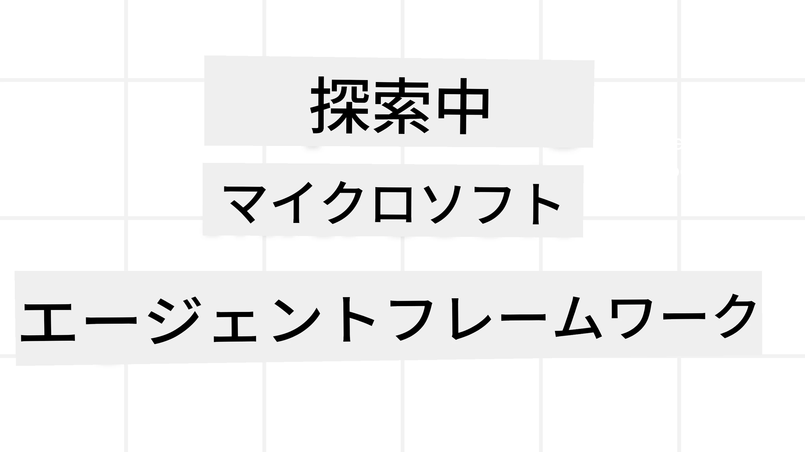
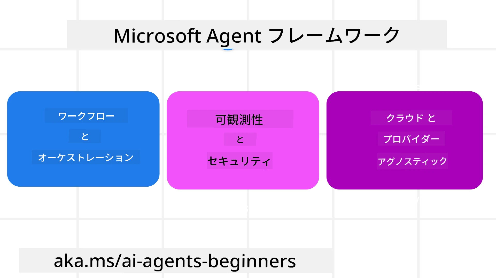
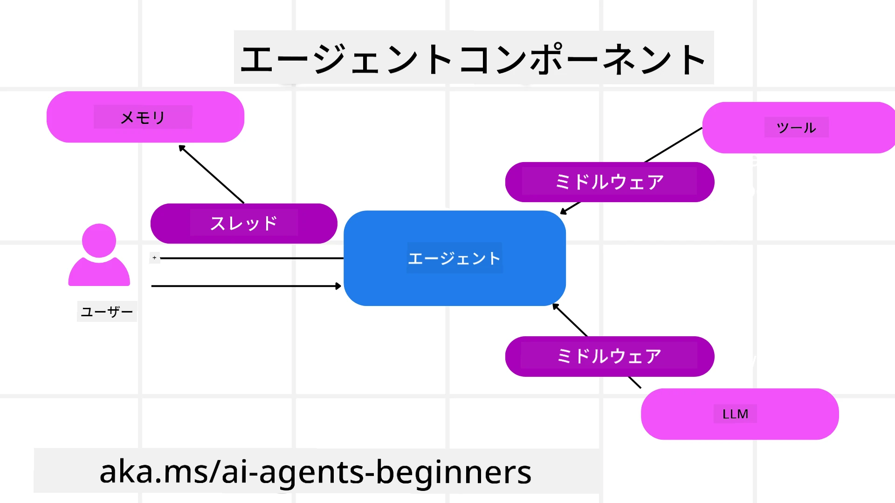

# Microsoft Agent Framework の探求



### はじめに

本レッスンでは以下を扱います：

- Microsoft Agent Framework の理解：主な特徴と価値
- Microsoft Agent Framework の主要な概念の探求
- 高度な MAF パターン：ワークフロー、ミドルウェア、メモリ

## 学習目標

本レッスンを終了すると、次のことが分かるようになります：

- Microsoft Agent Framework を使って本番対応可能な AI エージェントの構築
- Microsoft Agent Framework のコア機能をエージェント用途に適用
- ワークフロー、ミドルウェア、観測性を含む高度なパターンの利用

## コードサンプル

[Microsoft Agent Framework (MAF)](https://learn.microsoft.com/en-us/agent-framework/overview/?wt.mc_id=youtube_26688_organicsocial_reactor&pivots=programming-language-python) のコードサンプルは、本リポジトリの `xx-python-agent-framework` および `xx-dotnet-agent-framework` ファイルにあります。

## Microsoft Agent Framework の理解



[Microsoft Agent Framework (MAF)](https://learn.microsoft.com/en-us/agent-framework/overview/?wt.mc_id=youtube_26688_organicsocial_reactor&pivots=programming-language-python) は Microsoft の統合された AI エージェント構築フレームワークです。生産環境や研究環境で見られるさまざまなエージェントケースに柔軟に対応します。以下のようなシナリオを含みます：

- <strong>逐次的なエージェントオーケストレーション</strong>：ステップバイステップのワークフローが必要な場合のシナリオ。
- <strong>同時進行のオーケストレーション</strong>：複数エージェントが同時にタスクを完了すべき場合のシナリオ。
- <strong>グループチャットオーケストレーション</strong>：エージェントが協働して一つのタスクに取り組む場合のシナリオ。
- <strong>ハンドオフオーケストレーション</strong>：部分タスク完了に伴いエージェントがタスクを引き継ぐ場合のシナリオ。
- <strong>マグネティックオーケストレーション</strong>：マネージャーエージェントがタスクリストを作成・変更し、サブエージェントの調整でタスクを完了させる場合のシナリオ。

本番での AI エージェント提供のために、MAF は以下の機能も組み込んでいます：

- <strong>観測性</strong>：OpenTelemetry を用いた監視で、ツール呼び出し、オーケストレーションのステップ、推論フロー、Microsoft Foundry ダッシュボードでのパフォーマンス監視が行えます。
- <strong>セキュリティ</strong>：エージェントを Microsoft Foundry 上でネイティブにホストし、役割ベースアクセス、プライバシーデータ処理、組み込みのコンテンツセーフティなどのセキュリティ制御を提供。
- <strong>耐障害性</strong>：エージェントスレッドやワークフローは一時停止や再開、エラー回復が可能で、長時間の処理が可能。
- <strong>制御</strong>：人間の介入が必要なタスクを示し、ループ内人間ワークフローをサポート。

Microsoft Agent Framework は相互運用性にも注力しています：

- <strong>クラウド非依存</strong>：エージェントはコンテナ上、オンプレミス、複数クラウド上で実行可能。
- <strong>プロバイダー非依存</strong>：Azure OpenAI や OpenAI を含む好きな SDK でエージェントを作成可能。
- <strong>オープン標準の統合</strong>：Agent-to-Agent (A2A) や Model Context Protocol (MCP) といったプロトコルを用いて他のエージェントやツールを発見・利用可能。
- <strong>プラグインとコネクタ</strong>：Microsoft Fabric、SharePoint、Pinecone、Qdrant などのデータ・メモリサービスと接続可能。

これらの特徴が Microsoft Agent Framework の主要コンセプトにどのように適用されるか見てみましょう。

## Microsoft Agent Framework の主要コンセプト

### エージェント



<strong>エージェントの作成</strong>

エージェントの作成は、推論サービス（LLM プロバイダー）、AI エージェントが従う命令セット、および割り当てられた `name` を定義することで行います：


```python
agent = AzureOpenAIChatClient(credential=AzureCliCredential()).create_agent( instructions="You are good at recommending trips to customers based on their preferences.", name="TripRecommender" )
```

上記は `Azure OpenAI` を使用していますが、エージェントは以下を含む様々なサービスで作成可能です：

```python
AzureAIAgentClient(async_credential=credential).create_agent( name="HelperAgent", instructions="You are a helpful assistant." ) as agent
```

OpenAI の `Responses`、`ChatCompletion` API

```python
agent = OpenAIResponsesClient().create_agent( name="WeatherBot", instructions="You are a helpful weather assistant.", )
```

```python
agent = OpenAIChatClient().create_agent( name="HelpfulAssistant", instructions="You are a helpful assistant.", )
```

また [MiniMax](https://platform.minimaxi.com/) のような、大きなコンテキストウィンドウ（最大204Kトークン）に対応した OpenAI 互換APIもあります：

```python
agent = OpenAIChatClient(base_url="https://api.minimax.io/v1", api_key=os.environ["MINIMAX_API_KEY"], model_id="MiniMax-M3").create_agent( name="HelpfulAssistant", instructions="You are a helpful assistant.", )
```

また A2A プロトコルを使ったリモートエージェントも可能です：

```python
agent = A2AAgent( name=agent_card.name, description=agent_card.description, agent_card=agent_card, url="https://your-a2a-agent-host" )
```

<strong>エージェントの実行</strong>

エージェントは `.run` または `.run_stream` メソッドを使い、非ストリーミングまたはストリーミング応答で実行します。

```python
result = await agent.run("What are good places to visit in Amsterdam?")
print(result.text)
```

```python
async for update in agent.run_stream("What are the good places to visit in Amsterdam?"):
    if update.text:
        print(update.text, end="", flush=True)

```

各エージェント実行時には、`max_tokens` や `tools`、さらにはエージェントに使用する `model` 自体などのパラメーターをカスタマイズするオプションもあります。

これはユーザーのタスクを完了するために特定のモデルやツールが必要な場合に便利です。

<strong>ツール</strong>

ツールはエージェント定義時：

```python
def get_attractions( location: Annotated[str, Field(description="The location to get the top tourist attractions for")], ) -> str: """Get the top tourist attractions for a given location.""" return f"The top attractions for {location} are." 


# ChatAgentを直接作成する場合

agent = ChatAgent( chat_client=OpenAIChatClient(), instructions="You are a helpful assistant", tools=[get_attractions]

```

またエージェント実行時にも定義可能です：

```python

result1 = await agent.run( "What's the best place to visit in Seattle?", tools=[get_attractions] # この実行のためだけに提供されたツール )
```

<strong>エージェントスレッド</strong>

エージェントスレッドは複数ターンの会話を扱うために使います。スレッドの作成は以下の方法があります：

- `get_new_thread()` を使いスレッドを長期間保存できるようにする
- エージェント実行時に自動的にスレッドを作成し、その実行中のみスレッドが有効

スレッド作成のコード例は次の通りです：

```python
# 新しいスレッドを作成します。
thread = agent.get_new_thread() # スレッドでエージェントを実行します。
response = await agent.run("Hello, I am here to help you book travel. Where would you like to go?", thread=thread)

```

後で使用するためにスレッドをシリアライズして保存できます：

```python
# 新しいスレッドを作成します。
thread = agent.get_new_thread() 

# スレッドでエージェントを実行します。

response = await agent.run("Hello, how are you?", thread=thread) 

# ストレージ用にスレッドをシリアライズします。

serialized_thread = await thread.serialize() 

# ストレージから読み込んだ後、スレッドの状態をデシリアライズします。

resumed_thread = await agent.deserialize_thread(serialized_thread)
```

<strong>エージェントミドルウェア</strong>

エージェントはユーザーのタスクを完了するためにツールや LLM とやり取りします。特定の状況では、その間の実行や追跡を行いたいことがあります。エージェントミドルウェアにより、以下のことが可能です：

<em>関数ミドルウェア</em>

このミドルウェアはエージェントと呼び出す関数/ツール間で処理を実行します。例えば関数呼び出し時のログ記録に使えます。

下記のコードでは `next` が次のミドルウェアか実際の関数を呼ぶかを定義します。

```python
async def logging_function_middleware(
    context: FunctionInvocationContext,
    next: Callable[[FunctionInvocationContext], Awaitable[None]],
) -> None:
    """Function middleware that logs function execution."""
    # 前処理：関数実行前にログを記録
    print(f"[Function] Calling {context.function.name}")

    # 次のミドルウェアまたは関数実行へ継続
    await next(context)

    # 後処理：関数実行後にログを記録
    print(f"[Function] {context.function.name} completed")
```

<em>チャットミドルウェア</em>

このミドルウェアはエージェントと LLM 間のリクエスト間で処理やログ記録を行えます。

ここには AI サービスに送る `messages` といった重要な情報が含まれます。

```python
async def logging_chat_middleware(
    context: ChatContext,
    next: Callable[[ChatContext], Awaitable[None]],
) -> None:
    """Chat middleware that logs AI interactions."""
    # 前処理: AI呼び出し前のログ
    print(f"[Chat] Sending {len(context.messages)} messages to AI")

    # 次のミドルウェアまたはAIサービスに進む
    await next(context)

    # 後処理: AI応答後のログ
    print("[Chat] AI response received")

```

<strong>エージェントメモリ</strong>

`Agentic Memory` レッスンで扱ったように、メモリはエージェントが異なるコンテキストで動作する上で重要な要素です。MAF は複数のメモリタイプを提供します：

<em>インメモリストレージ</em>

これはアプリのランタイム中にスレッド内に保存されるメモリです。

```python
# 新しいスレッドを作成します。
thread = agent.get_new_thread() # スレッドでエージェントを実行します。
response = await agent.run("Hello, I am here to help you book travel. Where would you like to go?", thread=thread)
```

<em>永続メッセージ</em>

セッション間で会話履歴を保存するためのメモリです。`chat_message_store_factory` で定義されます：

```python
from agent_framework import ChatMessageStore

# カスタムメッセージストアを作成する
def create_message_store():
    return ChatMessageStore()

agent = ChatAgent(
    chat_client=OpenAIChatClient(),
    instructions="You are a Travel assistant.",
    chat_message_store_factory=create_message_store
)

```

<em>動的メモリ</em>

これはエージェントの実行前にコンテキストに追加されるメモリです。mem0 のような外部サービスに保存されることもあります：

```python
from agent_framework.mem0 import Mem0Provider

# 高度なメモリ機能のためにMem0を使用しています
memory_provider = Mem0Provider(
    api_key="your-mem0-api-key",
    user_id="user_123",
    application_id="my_app"
)

agent = ChatAgent(
    chat_client=OpenAIChatClient(),
    instructions="You are a helpful assistant with memory.",
    context_providers=memory_provider
)

```

<strong>エージェントの観測性</strong>

観測性は信頼性が高く保守性のあるエージェントシステム構築に重要です。MAF は OpenTelemetry と統合しトレースやメーターで観測性を向上させます。

```python
from agent_framework.observability import get_tracer, get_meter

tracer = get_tracer()
meter = get_meter()
with tracer.start_as_current_span("my_custom_span"):
    # 何かをする
    pass
counter = meter.create_counter("my_custom_counter")
counter.add(1, {"key": "value"})
```

### ワークフロー

MAF は、タスクを完了するための事前定義されたステップであるワークフローを提供し、AI エージェントをコンポーネントとして組み込みます。

ワークフローは異なるコンポーネントで構成され、より良い制御フローを実現します。また、<strong>マルチエージェントオーケストレーション</strong>やワークフローステートを保存するための<strong>チェックポイント</strong>を可能にします。

ワークフローの主要コンポーネントは以下です：

**実行者（Executors）**

実行者は入力メッセージを受け取り、割り当てられたタスクを実行し、出力メッセージを生成します。これによりワークフローは大きなタスクの完了に向かって進行します。実行者は AI エージェントまたはカスタムロジックのいずれかです。

**エッジ（Edges）**

エッジはワークフロー内のメッセージの流れを定義します。これには以下があります：

<em>直接エッジ</em> - 実行者間の単純な一対一接続：

```python
from agent_framework import WorkflowBuilder

builder = WorkflowBuilder()
builder.add_edge(source_executor, target_executor)
builder.set_start_executor(source_executor)
workflow = builder.build()
```

<em>条件付きエッジ</em> - 一定条件が満たされた場合にアクティブ化。例：ホテルの部屋が利用不可の場合、実行者が他の選択肢を示唆。

<em>スイッチケースエッジ</em> - 定義条件に基づいてメッセージを異なる実行者に振り分け。例：優先アクセスのある旅行客のタスクは別のワークフローで処理。

<em>ファンアウトエッジ</em> - 一つのメッセージを複数のターゲットに送信。

<em>ファンインエッジ</em> - 複数の実行者からのメッセージを一つのターゲットに集約。

<strong>イベント</strong>

ワークフローの観測性向上のため、MAF は実行中の組み込みイベントを提供します：

- `WorkflowStartedEvent` - ワークフロー実行開始
- `WorkflowOutputEvent` - ワークフローが出力を生成
- `WorkflowErrorEvent` - ワークフローがエラーに遭遇
- `ExecutorInvokeEvent` - 実行者の処理開始
- `ExecutorCompleteEvent` - 実行者の処理完了
- `RequestInfoEvent` - リクエスト発行

## 高度な MAF パターン

上記は Microsoft Agent Framework の主要コンセプトをカバーしました。より複雑なエージェントを構築する際に検討すべき高度なパターンは以下の通りです：

- <strong>ミドルウェアの合成</strong>：複数のミドルウェアハンドラー（ログ、認証、レート制限）を関数とチャットミドルウェアで連鎖し、エージェントの動作を細かく制御。
- <strong>ワークフローチェックポイント</strong>：ワークフローイベントとシリアル化を活用し、長時間のエージェント処理を保存・再開。
- <strong>動的なツール選択</strong>：ツール説明に基づく RAG と MAF のツール登録を組み合わせ、クエリごとに関連ツールのみを提示。
- <strong>マルチエージェントハンドオフ</strong>：ワークフローのエッジと条件付きルーティングを使い、専門化されたエージェント間のタスク引継ぎをオーケストレーション。

## Microsoft Foundry での LangChain / LangGraph エージェントのホスティング

Microsoft Agent Framework は <strong>フレームワーク間の互換性</strong>を持ち、MAF で書かれたエージェントに限定されません。既に **LangChain** や **LangGraph** で構築したエージェントがある場合、<strong>Microsoft Foundry ホストエージェント</strong>として実行し、Foundry がランタイム、セッション、スケーリング、ID、プロトコルエンドポイントを管理しつつ、エージェントのロジックは LangGraph 内に保持できます。

これは `langchain_azure_ai.agents.hosting` パッケージを使用し、Foundry ホストエージェントと同じプロトコルでコンパイル済の LangGraph グラフを公開します。

**1. ホスティングのエクストラをインストール：**

```bash
pip install -U "langchain-azure-ai[hosting]>=1.2.4" azure-identity
```

`hosting` エクストラは Foundry プロトコルライブラリである `azure-ai-agentserver-responses`（OpenAI 互換の `/responses` エンドポイント）と `azure-ai-agentserver-invocations`（汎用 `/invocations` エンドポイント）をインストールします。

**2. ホスティングプロトコルの選択：**

| プロトコル | ホストクラス | エンドポイント | 利用時 |
|----------|-----------|----------|----------|
| **Responses** | `ResponsesHostServer` | `/responses` | OpenAI互換チャット、ストリーミング、応答履歴、会話スレッドを使いたい場合に推奨のデフォルト。 |
| **Invocations** | `InvocationsHostServer` | `/invocations` | カスタムJSON形式やWebhookスタイルのエンドポイント、非会話処理が必要な場合。 |

**Responses API は Foundry におけるエージェント開発の主要APIであるため**、ほとんどのエージェントは `ResponsesHostServer` から始めることを推奨します。

**3. 環境変数を設定** (`az login` を先に行い `DefaultAzureCredential` が認証できるようにします)：

```bash
export FOUNDRY_PROJECT_ENDPOINT="https://<resource>.services.ai.azure.com/api/projects/<project>"
export FOUNDRY_MODEL_NAME="gpt-5-mini"
```

後ほどエージェントを Foundry でホストエージェントとして実行するとき、プラットフォームが自動的に `FOUNDRY_PROJECT_ENDPOINT` を注入します。

**4. Responses プロトコルで LangGraph エージェントを公開：**

```python
import os

from azure.ai.projects import AIProjectClient
from azure.identity import DefaultAzureCredential, get_bearer_token_provider
from langchain.agents import create_agent
from langchain_openai import ChatOpenAI
from langchain_azure_ai.agents.hosting import ResponsesHostServer

_AZURE_AI_SCOPE = "https://ai.azure.com/.default"


def build_chat_model() -> ChatOpenAI:
    project_endpoint = os.environ["FOUNDRY_PROJECT_ENDPOINT"].rstrip("/")
    deployment = os.environ.get("FOUNDRY_MODEL_NAME", "gpt-5-mini")
    credential = DefaultAzureCredential()
    project = AIProjectClient(endpoint=project_endpoint, credential=credential)
    openai_client = project.get_openai_client()
    token_provider = get_bearer_token_provider(credential, _AZURE_AI_SCOPE)

    # ChatOpenAIはFoundryプロジェクトのOpenAI互換（Responses）エンドポイントをターゲットにしています。
    return ChatOpenAI(
        model=deployment,
        base_url=str(openai_client.base_url),
        api_key=token_provider,
    )


def main() -> None:
    graph = create_agent(build_chat_model(), tools=[])
    port = int(os.environ.get("PORT", "8088"))
    ResponsesHostServer(graph).run(port=port)


if __name__ == "__main__":
    main()
```

ローカルで `python main.py` で実行し、`http://localhost:8088/responses` に Responses リクエストを送信します。

**主な動作ポイント：**

- <strong>会話</strong>：クライアントは `previous_response_id` または `conversation` ID を渡して会話を継続します。グラフが LangGraph チェックポインターでコンパイルされていれば、Foundry は会話状態をチェックポイントに紐付けます（本番では耐久性あるチェックポインターの使用を推奨。ローカル検証では `MemorySaver` も可）。
- <strong>人間の介入ループ</strong>：グラフが LangGraph の `interrupt()` を使うと、`ResponsesHostServer` は保留中の割り込みを Responses の `function_call` / `mcp_approval_request` 項目として表現し、クライアントは対応する `function_call_output` / `mcp_approval_response` で再開します。
- **Foundry へのデプロイ**：Azure Developer CLI を使用します。`azd ext install azure.ai.agents`、`azd ai agent init -m <manifest>`、`azd ai agent run`（ローカル、Docker 必須）、続いて `azd provision` と `azd deploy`。ホストエージェントのデプロイには **Foundry Project Manager** ロールが必要です。

この例の実行可能版は [code-samples/14-langchain-hosted-agent.py](../../../14-microsoft-agent-framework/code-samples/14-langchain-hosted-agent.py) にあります。詳細な手順（Invocations プロトコル、カスタムリクエストスキーマ、トラブルシューティング）は [Host LangGraph agents as Foundry hosted agents](https://learn.microsoft.com/azure/foundry/how-to/develop/langchain-hosted-agents) をご参照ください。

## コードサンプル

Microsoft Agent Framework のコードサンプルは、本リポジトリの `xx-python-agent-framework` と `xx-dotnet-agent-framework` ファイルにあります。

## Microsoft Agent Framework に関するさらに質問がありますか？

他の学習者と交流し、オフィスアワーに参加し、AI エージェントに関する質問に対する回答を得るには [Microsoft Foundry Discord](https://discord.com/invite/ATgtXmAS5D) にご参加ください。
## 前のレッスン

[AI エージェントのメモリ](../13-agent-memory/README.md)

## 次のレッスン

[コンピュータ使用エージェント構築 (CUA)](../15-browser-use/README.md)

---

<!-- CO-OP TRANSLATOR DISCLAIMER START -->
**免責事項**：
本書類は AI 翻訳サービス [Co-op Translator](https://github.com/Azure/co-op-translator) を使用して翻訳されています。正確性を期していますが、自動翻訳には誤りや不正確な部分が含まれる可能性があることをご承知おきください。原文の原語版が正式な情報源とみなされるべきです。重要な情報については、専門の人間による翻訳を推奨します。本翻訳の利用により生じたいかなる誤解や解釈違いについても、当方は責任を負いかねます。
<!-- CO-OP TRANSLATOR DISCLAIMER END -->