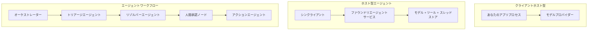
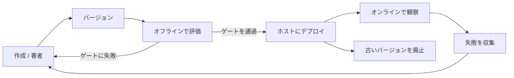
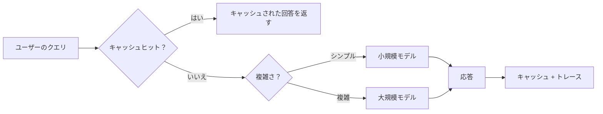
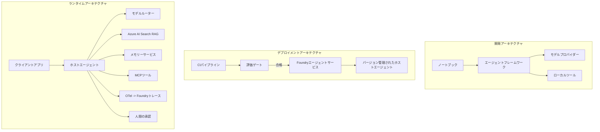

# Microsoft Foundry を使ったスケーラブルなエージェントのデプロイ


これまでのコースでは、ラップトップ上やノートブック内で、`az login` といくつかの環境変数で動くエージェントを構築してきました。それは学習には最適な方法です。しかし、深夜3時に何千人もの顧客が依存するエージェントを動かすには適切な方法ではありません。

このレッスンでは、「自分のマシンでは動く」から「本番環境で信頼性高く費用対効果良く動く」までのギャップを埋める方法を扱います。**Microsoft Foundry** と **Microsoft Foundry Agent Service** を用い、本物のカスタマーサポートエージェントを構築し、ツール、検索、メモリ、評価、モニタリングを組み込みます。

## はじめに

このレッスンでは以下をカバーします:

- <strong>プロトタイプエージェント</strong>と<strong>デプロイ済みエージェント</strong>の違い、および移行がモデルの周辺のすべてに関する理由。
- エージェントの<strong>デプロイパターン</strong>：クライアントホスト、サービスホスト（Hosted Agents）、ワークフローオーケストレーション。
- Microsoft Foundry 上での<strong>エージェントライフサイクル</strong> — 作成、バージョン管理、デプロイ、評価、観察、引退。
- <strong>スケーリング戦略</strong>：モデルルーティング、キャッシング、同時実行、ステートレス設計。
- OpenTelemetry と Foundry トレーシングによる<strong>可観測性</strong>。
- モデル選択、ルーティング、評価ゲートによる<strong>コスト最適化</strong>。
- <strong>エンタープライズの考慮事項</strong>：ガバナンス、人間の承認、高信頼性MCPサーバーの安全運用。

## 学習目標

本レッスン修了後には以下が可能になります:

- 特定のエージェントワークロードに最適なデプロイパターンを選ぶ。
- エージェントを Microsoft Foundry Agent Service にデプロイし、バージョン管理、ガバナンス、可観測性を確保する。
- トレース用の計測とリリース前に実行する評価パイプラインを組み込む。
- モデルルーティングとキャッシングを適用し、大規模でもレイテンシとコストを抑える。
- リスクの高い操作に対して人間の承認ゲートを追加し、安全に MCP サーバーと連携させる。

## 前提条件

本レッスンは以前のレッスンを終えており、以下に慣れていることを想定しています:

- [Microsoft Agent Framework](../14-microsoft-agent-framework/README.md) でのエージェント構築（レッスン14）。
- [Tool Use](../04-tool-use/README.md)（レッスン4）と [Agentic RAG](../05-agentic-rag/README.md)（レッスン5）。
- [Agent Memory](../13-agent-memory/README.md)（レッスン13）と [Agentic Protocols / MCP](../11-agentic-protocols/README.md)（レッスン11）。
- [Observability and Evaluation](../10-ai-agents-production/README.md)（レッスン10） — 本レッスンはこれに直接基づきます。

さらに以下が必要です:

- **Azure サブスクリプション** と少なくとも一つの展開済みチャットモデルを含む **Microsoft Foundry プロジェクト**。
- 認証済み **Azure CLI**（`az login`）。
- Python 3.12+ とリポジトリ内の [`requirements.txt`](../../../requirements.txt) にあるパッケージ。

## プロトタイプから本番へ：実際に変わること

プロトタイプエージェントと本番エージェントは核となるループ — 推論、ツール呼び出し、応答 — は同じです。ただしそのループを囲む運用部分が変わります。モデルは本番エージェントの約20％、残りの80％は運用の骨格です。

| 項目 | プロトタイプ | 本番 |
| --- | --- | --- |
| <strong>ホスティング</strong> | ノートブック内で実行 | ホストされたサービスとして実行、バージョン管理・ロールアウトする |
| **ID** | あなたの `az login` トークン | スコープ付き RBAC の管理ID |
| <strong>状態</strong> | インメモリ、再起動で消失 | 外部化（スレッドストア、メモリサービス） |
| <strong>障害対応</strong> | トレースバックを確認 | リトライ、フォールバック、デッドレター、アラート |
| <strong>コスト</strong> | 「数セント程度」 | リクエストごとに追跡、ルーティング、キャッシュ、予算管理 |
| <strong>品質</strong> | 出力を目視確認 | リリース前に自動評価 |
| <strong>信頼</strong> | すべて自身で承認 | ポリシー＋リスクの高い操作は人間介入あり |

この表を心に留めてください。以下の各セクションはこの表のいずれかの行に対応しています。

## エージェントのデプロイパターン

よく使うパターンが三つあり、多くの場合は組み合わせて使います。

### 1. クライアントホストエージェント

エージェントオブジェクトが <em>あなたの</em> アプリケーションプロセス内に存在します。コードは直接モデルプロバイダーを呼び出し、推論ループはあなたのサービスで実行されます。これまでの授業がまさにこの方法でした。

- <strong>使う場合</strong>：ループの完全な制御が必要な場合、カスタムミドルウェアがある場合、既存バックエンドにエージェントを組み込む場合。
- <strong>トレードオフ</strong>：スケーリング、状態管理、耐障害性は自分で担う必要がある。

### 2. ホスト型エージェント（Foundry Agent Service）

エージェントは Microsoft Foundry にリソースとして登録されます。Foundry が推論ループをホストし、スレッドを保存し、コンテンツ安全性とRBACを強制し、Foundryポータルにエージェントを表示します。アプリはスレッドを作成し応答を読む薄いクライアントになります。

- <strong>使う場合</strong>：耐久性、組み込みの可観測性、ガバナンス、運用コスト削減が必要なとき。
- <strong>トレードオフ</strong>：管理されたランタイムにより低レベルの制御は減る。

### 3. エージェントワークフロー

複数のエージェント（とツール）が明示的な制御フローで合成されます — 逐次ステップ、分岐、人間の承認ノード、ポーズと再開が可能な耐久性のあるチェックポイント。これは Microsoft Agent Framework の **Workflows** 機能を大規模に適用したものです。

- <strong>使う場合</strong>：単一タスクが複数の専門エージェントに跨る場合、あるいは途中に承認ステップが必要な場合。
- <strong>トレードオフ</strong>：構成要素が増え、オーケストレーションレベルの可観測性が必要。



## Microsoft Foundry 上のエージェントライフサイクル

エージェントのデプロイは一回の `push` ではありません。これはループであり、ソフトウェアリリースサイクルに非常によく似ています。



[レッスン 10](../10-ai-agents-production/README.md) から持ち越された重要な考え方は次の通りです：**オフライン評価は付け足しではなくゲートです。** 新しいエージェントバージョンは評価の敷居をクリアしないと出荷されません。オンライン監視は実際の故障をオフラインテストセットにフィードバックします。これが一連のループです。

## スケーリング戦略

エージェントのスケーリングはステートレスなウェブAPIのスケーリングとは異なります。なぜなら各リクエストが複数の高コストなモデルやツール呼び出しをトリガーする可能性があるためです。主に四つのテクニックがあります。

**ステートレスリクエスト処理。** ユーザーごとの状態をプロセスメモリに持たず、会話スレッドは Foundry スレッドストアやメモリサービスに永続化します。どのインスタンスも任意のリクエストを処理可能にし、水平スケールを実現します — インスタンス追加、スティッキーセッション不要。

**モデルルーティング。** すべてのリクエストが最も高性能で高コストなモデルを必要としません。単純なリクエスト（意図分類、短い事実回答など）は小型で高速なモデルに送って、本格的な推論は大きなモデルに任せます。Foundry の **Model Router** がこれを実行できますし、自作の軽量分類器も作れます。実習でDIY版を作成します。

**レスポンスキャッシング。** 多くのサポート問い合わせはほぼ重複しています（「パスワードのリセット方法は？」）。よくある質問の回答をキャッシュし、モデルへの呼び出しなしに提供します。控えめなキャッシュヒット率でもコストとレイテンシが大きく減ります。

**同時実行制御とバックプレッシャー。** モデルプロバイダーはレート制限があります。並列数を制限し、指数的バックオフ付きリトライを使い、フェイルフェイクリーに対応します（キューに「対応中」応答を返す方が500エラーより良い）。



## 本番環境での可観測性

見えなければ運用できません。レッスン10で説明したように、Microsoft Agent Framework は<strong>OpenTelemetry</strong> のトレースをネイティブに発行します — すべてのモデル呼び出し、ツール実行、オーケストレーションステップがスパンになります。本番ではこれらを Microsoft Foundry（またはOTel互換のバックエンド）に送出し、以下を可能にします:

- 1件の顧客クレームを終端まで追跡し、すべてのモデルとツール呼び出しを確認。
- リクエストごとの p50/p95 レイテンシとコストを時間でウォッチ。
- エラー率の急増やコスト異常をユーザーや財務チームより先にアラート。

```python
from agent_framework.observability import get_tracer

tracer = get_tracer()

with tracer.start_as_current_span("support_request") as span:
    span.set_attribute("customer.tier", "enterprise")
    span.set_attribute("routed.model", "gpt-5-nano")
    # このスパン内でエージェントの実行が自動的にトレースされます
```

`customer.tier` や `routed.model` のような属性は、膨大なトレースを意味のある問いに変えます（「エンタープライズ顧客は小さなモデルに送り過ぎていないか？」）。

## コスト最適化

本番エージェントのコストはトークンが支配的です。三つのレバーがあり、影響力の順に：

1. **モデルの適切なサイズ選定。** 評価ゲートを通過する小型モデルは、大型モデルよりほぼ常に安価です。デフォルトで最大モデルを使うのではなく、評価で小さなモデルが十分良いことを証明しましょう。
2. **複雑度によるルーティング。** 先述したとおり、複雑な推論が必要なリクエストだけ大きなモデルにコストをかける。
3. **積極的なキャッシュ活用。** もっとも安いモデル呼び出しは呼ばないこと。

評価ゲートとコスト制御は同じ規律を異なる視点で見たものです：評価で<em>品質の下限</em>を定め、ルーティングとキャッシュでその<em>コスト</em>を可能な限り近づける。

## エンタープライズでのデプロイ考慮点

**ガバナンス。** Hosted Agents は Foundry の RBAC、コンテンツ安全性、監査ログを継承します。各エージェントに最小特権の管理IDを割り当てます — ナレッジベースへの読み取りのみアクセス、チケッティングAPIへのスコープ付きアクセス、不要な権限はなし。

**人間の介入。** 全自動では重大すぎる操作（返金発行、アカウント削除、法務チームへのエスカレーションなど）もあります。Microsoft Agent Framework は<strong>承認必須ツール</strong>をサポートし、エージェントが操作を提案し、実行を一時停止、人間が承認・拒否し、ワークフローが再開されます。[レッスン6](../06-building-trustworthy-agents/README.md)で基礎をご覧になりましたが、ここで実際にデプロイします。

**本番での MCP。** [MCP](../11-agentic-protocols/README.md) は標準インタフェースを通じて外部ツールを利用可能にします。本番ではすべての MCP サーバーを信頼できない境界として扱い、サーバーバージョンを固定し、スコープ付きIDで実行し、出力を検証、秘密情報を決して渡さないようにします。MCP サーバーは依存関係であり、依存関係はパッチ適用、監査、レート制限を行います。



これら三つの図 — 開発、デプロイ、ランタイム — は同一エージェントの三段階の姿です。続くラボで構築方法を案内します。

## ハンズオンラボ：本番対応のカスタマーサポートエージェント

[`code_samples/16-python-agent-framework.ipynb`](./code_samples/16-python-agent-framework.ipynb) を開いて順に進めてください。以下のすべての本番課題を組み込んだ **Contoso カスタマーサポートエージェント** を組み立てます:

1. <strong>ツール呼び出し</strong> — 注文状況確認とサポートチケットのオープン。
2. **RAG** — ナレッジベースからのポリシー質問への回答（Azure AI Search、メモリフォールバック付きでSearchリソースなしでも動作）。
3. <strong>メモリ</strong> — 会話のターンを跨いで顧客情報を記憶。
4. <strong>モデルルーティング</strong> — 複雑度分類器がリクエストを小型モデルか大型モデルへルーティング。
5. <strong>レスポンスキャッシュ</strong> — 繰り返しの質問にキャッシュ回答を提供。
6. <strong>人間承認</strong> — 一定基準以上の返金は人間の承認を待つ。
7. <strong>評価パイプライン</strong> — 小規模オフラインテストセットでエージェントをスコアしリリースのゲートに。
8. <strong>可観測性</strong> — すべてのリクエストに OpenTelemetry トレース。

### 手順説明

ノートブックは各本番課題が自己完結型で実行可能なセクションとして構成されています。中核はルーティング＋キャッシュのリクエストハンドラです:

```python
async def handle_support_request(query: str, customer_id: str) -> str:
    # 1. 可能な場合はキャッシュから提供します。
    cached = response_cache.get(normalize(query))
    if cached:
        return cached

    # 2. コストを管理するために複雑さでルーティングします。
    model = "gpt-5-nano" if is_simple(query) else "gpt-5-mini"

    # 3. 可観測性のためにエージェントをトレーススパン内で実行します。
    with tracer.start_as_current_span("support_request") as span:
        span.set_attribute("routed.model", model)
        span.set_attribute("customer.id", customer_id)
        response = await support_agent.run(query, model=model)

    # 4. キャッシュして返します。
    response_cache.set(normalize(query), response.text)
    return response.text
```

リリースを守る評価ゲートは次のようなものです:

```python
async def evaluation_gate(agent, test_cases, threshold: float = 0.8) -> bool:
    passed = 0
    for case in test_cases:
        result = await agent.run(case["input"])
        if score_response(result.text, case["expected"]) >= 0.8:
            passed += 1
    pass_rate = passed / len(test_cases)
    print(f"Evaluation pass rate: {pass_rate:.0%} (gate: {threshold:.0%})")
    return pass_rate >= threshold  # ゲートが通過した場合のみデプロイする
```

すべての行を読み込んでください — ノートブックはプリミティブが小さく抑えられているため、フレームワーク呼び出しの裏に隠されたものはありません。

## デプロイ済みエージェントのスモークテストによる検証

上記の評価ゲートはエージェントオブジェクトに対して<em>オフライン</em>で実行されます。Hosted Agent としてデプロイしたら、もうひとつ、さらに簡単なチェックが必要です: **展開されたエンドポイントは実際に応答しているか？**

「成功した」デプロイはコントロールプレーンが定義を受け入れたことの証明であり、エージェントが応答することの証明ではありません。依存関係の欠如、誤ったモデルルーティング、期限切れの接続で、何も返さない緑色のデプロイが存在するかもしれません。<strong>スモークテスト</strong>は数秒でそれを検出し、すべてのデプロイ時に、完全な評価のコストなしで行えます。

このリポジトリは即利用可能なスモークテストパイプラインを、[AI Smoke Test](https://github.com/marketplace/actions/ai-smoke-test) GitHub Action を使って提供しています:

- <strong>カタログ</strong> — [`tests/lesson-16-smoke-tests.json`](../../../tests/lesson-16-smoke-tests.json) は Contoso サポートエージェント向けのプロンプトとアサーション（根拠に基づくポリシー回答、注文検索、脱線しない会話、多ターンスレッド継続性）を含みます。ほかレッスンのエージェント用カタログもここにあり — [`tests/README.md`](../tests/README.md) を参照。
- <strong>ワークフロー</strong> — [`.github/workflows/smoke-test.yml`](../../../.github/workflows/smoke-test.yml) は Azure OIDC でログインし、各プロンプトをエージェントの Responses エンドポイントに POST、アサーションミスがあればジョブを失敗にします。

```yaml
- name: Smoke-test hosted agent
  uses: JFolberth/ai-smoketest@v1
  with:
    project_endpoint: ${{ inputs.project_endpoint }}
    agent_name: ContosoSupportAgent
    tests_file: tests/lesson-16-smoke-tests.json
```


エージェントを展開したら、**Actions** タブから実行し、Foundry プロジェクトのエンドポイントとエージェント名を入力してください。フェデレーテッド ID には Foundry プロジェクトのスコープで **Azure AI User** ロールが必要です。レイヤーをピラミッドのように考えてください。スモークテスト（到達可能で応答しているか？）はすべてのデプロイで実行され、オフライン評価（出荷に十分か？）は昇格前に実行され、オンライン評価（実際の運用でどうか？）は継続的に実行されます。

## 知識チェック

課題に進む前に理解度を確認しましょう。

**1. 本番用エージェントのうち「モデル」は大まかにどれくらいの割合で、残りは何ですか？**

<details>
<summary>回答</summary>

モデルはシステムの少数派であり、一般的に約20％とされています。残りは運用の骨組みであり、ホスティングやバージョニング、アイデンティティとRBAC、外部化された状態、障害処理、コスト追跡、評価、ヒューマンインザループコントロールなどがあります。本番移行は主に推論ループの周りにすべてを構築することです。
</details>

**2. クライアントホスト型エージェントよりホスト型エージェントを選ぶのはどんな時ですか？**

<details>
<summary>回答</summary>

耐久性（継続可能なスレッド）、可観測性、コンテンツ安全性、RBAC を備えたマネージドランタイムが欲しい時、かつ推論ループの低レベル制御をある程度犠牲にしても運用面を減らしたい場合です。クライアントホスト型はループを完全に制御したいか、既存のバックエンドにエージェントを組み込みたい場合に適しています。
</details>

**3. なぜスケーラブルなエージェントではプロセスメモリ内でステートレスでなければならないのですか？**

<details>
<summary>回答</summary>

どのインスタンスも任意のリクエストを処理できるようにするためで、これがスティッキーセッションなしの水平スケーリングを可能にします。ユーザーごとの会話状態はスレッドストアやメモリサービスに外部化されます。状態がプロセスメモリ内にあれば、再起動時に失われ、負荷分散も自由にできません。
</details>

**4. モデルルーティングはどんな問題を解決し、評価とはどう関係していますか？**

<details>
<summary>回答</summary>

ルーティングは単純なリクエストを小さく安価で高速なモデルに送り、本格的な推論は大きなモデルに回すことでレイテンシーとコストを制御します。評価は、その小さいモデルが特定のリクエストに十分優れていることを証明するもので、評価なしのルーティングは推測に過ぎません。
</details>

**5. 「評価ゲート（evaluation gate）」とは何で、ライフサイクルのどこに位置しますか？**

<details>
<summary>回答</summary>

評価ゲートは新しいエージェントバージョンに対してオフラインテストセットを実行し、合格率が閾値を超えなければデプロイをブロックします。ライフサイクルでは「バージョン」と「デプロイ」の間にあり、品質を出荷後のチェックではなくリリースの前提条件にします。
</details>

**6. なぜ MCP サーバーは本番環境で信頼されていない境界として扱うべきですか？**

<details>
<summary>回答</summary>

それはエージェントが呼び出す外部依存だからです。バージョンを固定し、スコープ付きアイデンティティで実行し、出力を検証し、レート制限を行い、秘密情報を決して渡さないという、他のサードパーティ依存と同様の厳密な対応が必要です。出力はエージェントの推論に流れ込むため、未検証の信頼はセキュリティリスクです。
</details>

**7. 本番エージェントのコストに最も大きな影響を与える単一の変更は何で、なぜですか？**

<details>
<summary>回答</summary>

モデルの適切なサイズ選びです。評価ゲートを通過する最小のモデルを使うこと。コストはトークン数で支配され、小さいモデルで品質基準を満たすなら、大きいモデルよりほぼ常に安価です。キャッシュとルーティングでさらにコストを削減できますが、最も大きな第一効果は基礎モデル選択です。
</details>

**8. `customer.tier` や `routed.model` のようなスパン属性は可観測性でどんな役割を果たしますか？**

<details>
<summary>回答</summary>

生のトレースを答えられるビジネス質問に変えます。属性なしではスパンの壁ですが、属性があれば「エンタープライズ顧客は小さいモデルに送り過ぎているか？」や「もっとも遅いリクエストを処理しているモデルはどれか？」といった質問ができます。属性は運用で重要な次元ごとにテレメトリをスライスする方法です。
</details>

## 課題

ラボのカスタマーサポートエージェントを取り、特定のシナリオに対して強化してください：**SaaS 企業向けのサブスクリプション請求サポートエージェント**。

提出内容は以下を含むべきです：

1. 請求関連のツールに<strong>置き換える</strong>：`get_subscription_status`、`get_invoice`、`issue_credit`（50ドル超のクレジットは人間の承認が必要）。
2. 会社の返金ポリシー、請求サイクル、キャンセルポリシーをカバーする<strong>3つのRAGドキュメント</strong>を追加。
3. 評価セットを少なくとも8ケースに<strong>拡張</strong>し、うち少なくとも2件は人間承認ルートを起動すべきもので、評価ゲートが正しく合否判定するか確認。
4. 1つのコストレポートを<strong>追加</strong>：混合クエリ10件をエージェントに通した後、小さいモデルに送った数、大きいモデルに送った数、キャッシュから処理した数を出力。

どのモデルルーティングルールを選んだか、実際のトラフィックでどう検証するかを短い段落（マークダウンセル）で説明してください。正解は1つではなく、本番環境の課題を論理的に結びつけられているかが評価されます。

## まとめ

このレッスンでは Microsoft Foundry を使ってエージェントをプロトタイプから本番へ移行しました：

- 本番移行は主にモデルの周りの<strong>運用の骨組み</strong>—ホスティング、アイデンティティ、状態、障害処理、コスト、品質、信頼—に関するものです。
- 3つの<strong>展開パターン</strong>—クライアントホスト型、ホスト型エージェント、エージェントワークフロー—とそれぞれの適用場面を学びました。
- <strong>エージェントのライフサイクル</strong> を体験し、オフラインの<strong>評価がリリースゲート</strong>として機能し、オンライン可観測性が障害をテストセットにフィードバックする流れを理解しました。
- <strong>スケーリング戦略</strong>—ステートレス設計、モデルルーティング、キャッシュ、境界付き同時実行—を適用し、<strong>コスト最適化</strong>と結びつけました。
- <strong>エンタープライズコントロール</strong>である RBAC、人間承認、そして本番対応の MCP 統合を組み込みました。
- これらのすべての課題を一体化した<strong>本番対応のカスタマーサポートエージェント</strong>を動くコードで構築しました。

次のレッスンでは逆の道をたどります：エージェントをクラウドにスケールアップするのではなく、単一開発者のマシンに<strong>ダウンサイズ</strong>し、完全にローカルで実行します。

## 追加リソース

- <a href="https://learn.microsoft.com/azure/ai-foundry/what-is-azure-ai-foundry" target="_blank">Microsoft Foundry ドキュメント</a>
- <a href="https://learn.microsoft.com/azure/ai-foundry/agents/overview" target="_blank">Microsoft Foundry Agent Service 概要</a>
- <a href="https://learn.microsoft.com/en-us/agent-framework/overview/?wt.mc_id=youtube_26688_organicsocial_reactor&pivots=programming-language-python" target="_blank">Microsoft Agent Framework</a>
- <a href="https://learn.microsoft.com/azure/ai-foundry/concepts/model-router" target="_blank">Microsoft Foundry におけるモデルルーター</a>
- <a href="https://learn.microsoft.com/azure/search/search-what-is-azure-search" target="_blank">Azure AI Search</a>
- <a href="https://opentelemetry.io/" target="_blank">OpenTelemetry</a>
- <a href="https://github.com/marketplace/actions/ai-smoke-test" target="_blank">AI Smoke Test GitHub Action</a>
- <a href="https://modelcontextprotocol.io/" target="_blank">Model Context Protocol (MCP)</a>

## 前のレッスン

[Building Computer Use Agents (CUA)](../15-browser-use/README.md)

## 次のレッスン

[Creating Local AI Agents](../17-creating-local-ai-agents/README.md)

---

<!-- CO-OP TRANSLATOR DISCLAIMER START -->
**免責事項**：
本書類は AI 翻訳サービス [Co-op Translator](https://github.com/Azure/co-op-translator) を使用して翻訳されています。正確性を期していますが、自動翻訳には誤りや不正確な部分が含まれる可能性があることをご承知おきください。原文の原語版が正式な情報源とみなされるべきです。重要な情報については、専門の人間による翻訳を推奨します。本翻訳の利用により生じたいかなる誤解や解釈違いについても、当方は責任を負いかねます。
<!-- CO-OP TRANSLATOR DISCLAIMER END -->