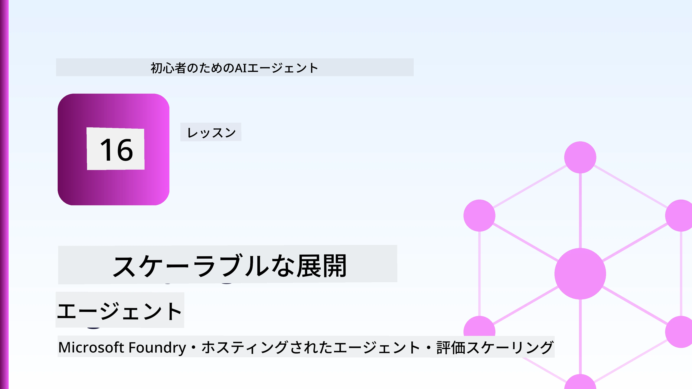
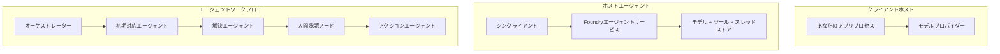
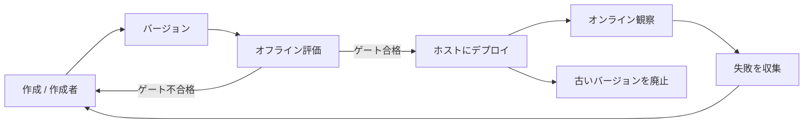
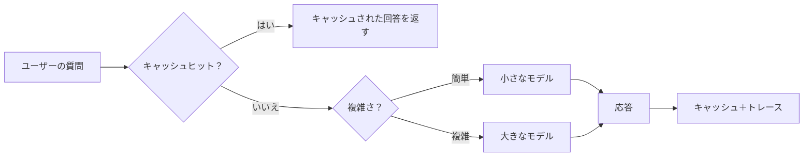
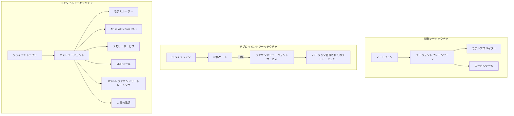

# Microsoft Foundryを使ったスケーラブルエージェントのデプロイ



このコースのここまでで、ラップトップ上やノートブック内で動作し、`az login`といくつかの環境変数によって駆動されるエージェントを作成してきました。これは学習するのにまさに適した方法です。しかし、何千人もの顧客が深夜3時に依存するエージェントを運用するには適切な方法ではありません。

このレッスンでは、「自分のマシンでは動く」という状態と「運用環境で信頼性高く、しかも手頃なコストで動作する」という状態の間にあるギャップに注目します。このギャップを<strong>Microsoft Foundry</strong>と<strong>Microsoft Foundry Agent Service</strong>を用いて埋め、ツール、情報検索、メモリ、評価、監視を備えた実際のカスタマーサポートエージェントを構築します。

## はじめに

本レッスンで学ぶ内容:

- <strong>プロトタイプエージェント</strong>と<strong>デプロイ済みエージェント</strong>の違い、そしてモデルの周辺のすべてが主に変わる理由。
- クライアントホスト型、サービスホスト型（Hosted Agents）、ワークフローオーケストレーション型の<strong>エージェントのデプロイパターン</strong>。
- Microsoft Foundry上の<strong>エージェントのライフサイクル</strong> — 作成、バージョン管理、デプロイ、評価、観察、引退。
- <strong>スケーリング戦略</strong>：モデルルーティング、キャッシュ、同時実行、ステートレス設計。
- OpenTelemetryとFoundryトレーシングによる<strong>観測性</strong>。
- モデル選択、ルーティング、評価ゲートによる<strong>コスト最適化</strong>。
- <strong>エンタープライズ利用の考慮点</strong>：ガバナンス、人間の承認、高信頼性プロダクションでMCPサーバーを安全に運用すること。

## 学習目標

このレッスンを修了すると、以下ができるようになります:

- エージェントのワークロードに合わせて最適なデプロイパターンを選択する。
- エージェントをMicrosoft Foundry Agent Serviceにデプロイしてバージョン管理、ガバナンス、観測性を実現する。
- トレーシングのためにエージェントに計測を施し、リリース前に毎回動く評価パイプラインと連携する。
- モデルルーティングとキャッシュを適用して、スケールしてもレイテンシとコストを制御する。
- 高リスクなアクションには人間の承認ゲートを追加し、MCPサーバーを本番環境で安全に統合する。

## 前提条件

このレッスンは以下の内容を理解し終わっていることを前提としています:

- [Microsoft Agent Framework](../14-microsoft-agent-framework/README.md)でエージェントを構築すること（レッスン14）。
- [ツールの使用](../04-tool-use/README.md)（レッスン4）および[Agentic RAG](../05-agentic-rag/README.md)（レッスン5）。
- [Agent Memory](../13-agent-memory/README.md)（レッスン13）および[Agentic Protocols / MCP](../11-agentic-protocols/README.md)（レッスン11）。
- [観測性と評価](../10-ai-agents-production/README.md)（レッスン10）— 本レッスンはこれを直接発展させています。

また以下も必要です:

- <strong>Azureサブスクリプション</strong>と少なくとも1つのチャットモデルがデプロイされた<strong>Microsoft Foundryプロジェクト</strong>。
- 認証済みの<strong>Azure CLI</strong> (`az login`)。
- Python 3.12+とリポジトリの[`requirements.txt`](../../../requirements.txt)のパッケージ。

## プロトタイプから本番へ：何が実際に変わるか

プロトタイプエージェントと本番エージェントは同じコアループ（推論、ツール呼び出し、応答）を共有します。変わるのはそのループの周りにあるすべてのものです。モデルは本番エージェントの約20%で、残りの80%が運用の骨格です。

| 関心事 | プロトタイプ | 本番 |
| --- | --- | --- |
| <strong>ホスティング</strong> | ノートブック上で動作 | ホストされたサービスとして動作し、バージョン管理とロールアウトがされる |
| <strong>アイデンティティ</strong> | あなたの`az login`トークン | スコープ付きRBACのマネージドアイデンティティ |
| <strong>状態</strong> | メモリ内、再起動で消失 | 外部化（スレッドストア、メモリサービス） |
| <strong>障害</strong> | トレースバックを見る | リトライ、フォールバック、デッドレター、アラート |
| <strong>コスト</strong> | 「数セント程度」 | リクエストごとに追跡され、ルーティング、キャッシュ、予算管理される |
| <strong>品質</strong> | 出力を目でチェック | 毎回のリリース前に自動評価される |
| <strong>信頼性</strong> | あなたがすべての行動を承認 | リスクのある行動にはポリシー＋人間の介入 |

この表を覚えておいてください。以下の各セクションはこれらの項目のどれかに対応しています。

## エージェントのデプロイパターン

主に3つのパターンがあり、組み合わせて使うことも多いです。

### 1. クライアントホスト型エージェント

エージェントオブジェクトは<em>あなたの</em>アプリケーションプロセス内に存在します。コードが直接モデルプロバイダーを呼び出し、推論ループはあなたのサービス内で動作します。これまでのレッスンはすべてこの形でした。

- <strong>使う場面</strong>：ループの完全な制御が必要な場合、カスタムミドルウェアを使いたい場合、または既存のバックエンドにエージェントを埋め込む場合。
- <strong>トレードオフ</strong>：スケーリング、状態管理、耐障害性を自分で担う必要があります。

### 2. Hosted Agents（Foundry Agent Service）

エージェントはMicrosoft Foundryの<em>リソースとして登録</em>されます。Foundryが推論ループをホストし、スレッドを保存し、コンテンツ安全性とRBACを強制し、Foundryポータルでエージェントを見える化します。あなたのアプリはスレッドを作成し、応答を読む薄いクライアントになります。

- <strong>使う場面</strong>：耐久性、組み込み観測性、ガバナンスを望み、運用の面積を減らしたい場合。
- <strong>トレードオフ</strong>：マネージドランタイムの代わりに低レベルの制御が減ります。

### 3. エージェントワークフロー

複数のエージェント（とツール）が明示的な制御フローでグラフとして構成されます — シーケンシャルなステップ、分岐、人間による承認ノード、状態を保持して一時停止や再開が可能な耐久チェックポイント。これはMicrosoft Agent Frameworkの<strong>Workflows</strong>機能をデプロイ規模に適用したものです。

- <strong>使う場面</strong>：単一タスクが複数の専門エージェントにまたがったり、途中に承認ステップが必要な場合。
- <strong>トレードオフ</strong>：部品が増え、オーケストレーションレベルの観測性が必要になる。



## Microsoft Foundry上のエージェントライフサイクル

エージェントをデプロイするのは一度きりの`push`ではありません。ループであり、ソフトウェアのリリースサイクルに非常によく似ています。



[レッスン10](../10-ai-agents-production/README.md)から引き継がれる重要な考え方：**オフライン評価はゲートであり、後付けではありません。** 新しいエージェントバージョンは評価基準をクリアしない限り出荷されません。オンライン観測がリアルワールドの障害をオフラインテストセットにフィードバックします。これが全体のループです。

## スケーリング戦略

エージェントのスケーリングはステートレスWeb APIとは異なります。なぜなら各リクエストが複数のお金のかかるモデルやツール呼び出しをトリガーするからです。4つの技法が負荷の大部分を担います。

**ステートレスリクエスト処理。** プロセスメモリにユーザーごとの状態を保持しないでください。会話スレッドはFoundryのスレッドストアかメモリサービスに永続化し、どのインスタンスでも任意のリクエストを処理できるようにします。これにより水平スケールが可能になります—インスタンスを追加してもスティッキーセッション不要です。

**モデルルーティング。** すべてのリクエストが最も高機能かつ高コストモデルを必要とするわけではありません。単純なリクエスト — 意図分類や短い事実回答 — は小型・高速モデルに送って、大型モデルは本格的な推論に予約しましょう。Foundryの<strong>Model Router</strong>がこれを行いますし、自作の軽量分類器も構築できます。ラボでDIY版を作ります。

**応答キャッシュ。** 多くのサポート問い合わせはほぼ重複（「パスワードのリセット方法は？」等）です。よくある質問の回答をキャッシュし、モデル呼び出しなしで返します。控えめなキャッシュヒット率でもコストとレイテンシを大きく削減できます。

**同時実行とバックプレッシャー。** モデルプロバイダーにはレート制限があります。並行数を制限し、指数遅延を使ったリトライを行い、優雅に失敗させましょう（キューに入って「対応中」の応答は500エラーより優秀です）。



## プロダクションにおける観測性

見えないものは運用できません。レッスン10で説明したように、Microsoft Agent Frameworkは<strong>OpenTelemetry</strong>トレースをネイティブに発行します — すべてのモデル呼び出し、ツール呼び出し、オーケストレーションステップがスパンになります。プロダクションではそれらのスパンをMicrosoft Foundry（またはOTel互換のバックエンド）にエクスポートし、以下が可能になります:

- 単一のお客様のクレームをすべてのモデル・ツール呼び出しを追跡してエンドツーエンドでたどる。
- 時間経過でのリクエストごとのp50/p95レイテンシとコストを監視する。
- ユーザー（または財務チーム）が気づく前にエラー率の急増やコスト異常でアラートを出す。

```python
from agent_framework.observability import get_tracer

tracer = get_tracer()

with tracer.start_as_current_span("support_request") as span:
    span.set_attribute("customer.tier", "enterprise")
    span.set_attribute("routed.model", "gpt-5-nano")
    # エージェントの実行はこのスパン内で自動的に追跡されます
```

`customer.tier`や`routed.model`といった属性がトレースの壁を答えの出せる質問に変えます（「エンタープライズ顧客は小モデルに送り過ぎていないか？」など）。

## コスト最適化

プロダクションエージェントのコストはトークンが支配的です。影響力の順に3つのレバーがあります:

1. **モデルを適正サイズにする。** 小さいモデルで評価ゲートを通過できるなら、必ず大きいモデルより安価です。評価で怖がって大きいモデルに頼るのではなく、小さいモデルが十分な品質であることを証明してください。
2. **複雑性でルーティングする。** 先述の通り、大きいモデルが要るリクエストにのみ大きいモデルのコストを払う。
3. **攻撃的にキャッシュする。** 最も安いモデル呼び出しは、そもそもしない呼び出しです。

評価ゲートとコスト管理は異なる角度から見た同じ規律です。評価は<em>品質の下限</em>を示し、ルーティングとキャッシュがその下限の<em>コスト</em>にできるだけ近づけます。

## エンタープライズでのデプロイ考慮点

**ガバナンス。** Hosted AgentsはFoundryのRBAC、コンテンツ安全性、監査ログを継承します。各エージェントに必要最低限の権限のマネージドアイデンティティを与えましょう — ナレッジベースの読み取り専用、チケットAPIへのスコープアクセス、それ以上はなし。

**人間の介在。** 一部の操作は自動化すると重大すぎます — 返金処理、アカウント削除、法務チームへのエスカレーションなど。Microsoft Agent Frameworkは<strong>承認を要する</strong>ツールをサポートします：エージェントがアクションを提案し、実行は一時停止、人が承認または拒否し、ワークフローが再開します。[レッスン6](../06-building-trustworthy-agents/README.md)で原始的なものを見ましたが、ここでそれをデプロイします。

**本番運用でのMCP。** [MCP](../11-agentic-protocols/README.md)は標準インターフェースを介して外部ツールをエージェントに消費させます。本番ではすべてのMCPサーバーを信用できない境界として扱い、サーバーバージョンを固定し、スコープ付きIDで実行し、出力を検証し、秘密情報を絶対に渡さないでください。MCPサーバーは依存関係であり、依存関係はパッチ適用、監査、レート制限が必要です。



開発、デプロイ、ランタイムの3つの図は、1つのエージェントの生涯の3つの段階です。この後のラボでそれを構築します。

## ハンズオンラボ：本番対応カスタマーサポートエージェント

[`code_samples/16-python-agent-framework.ipynb`](./code_samples/16-python-agent-framework.ipynb) を開き、端から端まで取り組んでください。すべての本番上の懸念が組み込まれた<strong>Contosoカスタマーサポートエージェント</strong>を組み立てます:

1. <strong>ツール呼び出し</strong> — 注文状況の確認とサポートチケットのオープン。
2. **RAG** — ナレッジベースからのポリシー質問への回答（Azure AI Searchと、Searchリソースなしでノートブックが動くメモリフォールバック付き）。
3. <strong>メモリ</strong> — 会話のターンを超えて顧客を記憶。
4. <strong>モデルルーティング</strong> — 複雑さ分類器が各リクエストを小モデルまたは大モデルに割り当てる。
5. <strong>応答キャッシュ</strong> — 繰り返される質問をキャッシュから提供。
6. <strong>人間の承認</strong> — 一定金額以上の返金は人間の承認を必要とし一時停止。
7. <strong>評価パイプライン</strong> — 小規模なオフラインテストセットがエージェントを評価しリリースゲートとして機能。
8. <strong>観測性</strong> — すべてのリクエストでのOpenTelemetryトレース。

### ウォークスルー

ノートブックは各本番上の懸念を自己完結かつ実行可能なセクションに分けて構成されています。核心はルーティングとキャッシュを組み合わせたリクエストハンドラーです:

```python
async def handle_support_request(query: str, customer_id: str) -> str:
    # 1. 可能な場合はキャッシュから提供します。
    cached = response_cache.get(normalize(query))
    if cached:
        return cached

    # 2. コスト管理のために複雑さによってルーティングします。
    model = "gpt-5-nano" if is_simple(query) else "gpt-5-mini"

    # 3. 可観測性のためにトレーススパン内でエージェントを実行します。
    with tracer.start_as_current_span("support_request") as span:
        span.set_attribute("routed.model", model)
        span.set_attribute("customer.id", customer_id)
        response = await support_agent.run(query, model=model)

    # 4. キャッシュして返します。
    response_cache.set(normalize(query), response.text)
    return response.text
```

リリースを守る評価ゲートは以下のようになります:

```python
async def evaluation_gate(agent, test_cases, threshold: float = 0.8) -> bool:
    passed = 0
    for case in test_cases:
        result = await agent.run(case["input"])
        if score_response(result.text, case["expected"]) >= 0.8:
            passed += 1
    pass_rate = passed / len(test_cases)
    print(f"Evaluation pass rate: {pass_rate:.0%} (gate: {threshold:.0%})")
    return pass_rate >= threshold  # ゲートが通過した場合のみデプロイする
```

全ての行を読んでください — ノートブックはあえて原始的なものを小さく保ち、ファームワークコールの背後に何も隠さないようにしています。

## デプロイ済みエージェントのスモークテストでの検証

上記の評価ゲートは<em>オフライン</em>でエージェントオブジェクトに対して動作します。Hosted Agentとしてデプロイ後は、さらにもう一つ、より簡単な検証が必要です: **デプロイ済みのエンドポイントが実際に応答しているか？**

「成功」デプロイはコントロールプレーンが定義を受け入れたことを証明するだけで、エージェントが応答することは保証しません。依存関係の欠落、誤ったモデルルーティング、期限切れの接続などで何も返さない緑のデプロイが残ることがあります。<strong>スモークテスト</strong>はそれを数秒で検知し、毎デプロイ実行し、完全評価のコストなしで検証します。

このリポジトリでは、[AI Smoke Test](https://github.com/marketplace/actions/ai-smoke-test) GitHub Actionを使ったすぐ使えるスモークテストパイプラインが提供されています:

- <strong>カタログ</strong> — [`tests/lesson-16-smoke-tests.json`](../../../tests/lesson-16-smoke-tests.json) はContosoサポートエージェント用のプロンプトとアサーション（基づくポリシー回答、注文検索、話題の維持、多ターンスレッドの継続性）を含みます。その他のレッスンエージェント用のカタログも並んでいます — [`tests/README.md`](../tests/README.md)参照。
- <strong>ワークフロー</strong> — [`.github/workflows/smoke-test.yml`](../../../.github/workflows/smoke-test.yml) はAzure OIDCでログインし、それぞれのプロンプトをエージェントのResponsesエンドポイントにPOSTし、アサーション失敗でジョブを失敗させます。

```yaml
- name: Smoke-test hosted agent
  uses: JFolberth/ai-smoketest@v1
  with:
    project_endpoint: ${{ inputs.project_endpoint }}
    agent_name: ContosoSupportAgent
    tests_file: tests/lesson-16-smoke-tests.json
```


エージェントをデプロイしたら **Actions** タブから実行し、Foundryプロジェクトのエンドポイントとエージェント名を指定してください。フェデレーションIDはFoundryプロジェクトスコープで **Azure AI User** ロールが必要です。レイヤーはピラミッドのように考えてください：スモークテスト（到達可能で応答しているか？）はデプロイごとに実行し、オフライン評価（出荷に値するか？）は昇格前に実行し、オンライン評価（実際の運用でどうか？）は継続的に実行されます。

## 知識チェック

課題に進む前に理解度をテストしましょう。

**1. 製品版エージェントのうち「モデル」はだいたいどれくらいの割合で、残りは何ですか？**

<details>
<summary>回答</summary>

モデルはシステムの少数派で、しばしば約20%とされます。残りは運用の骨格であり、ホスティングやバージョニング、アイデンティティとRBAC、外部化された状態管理、障害処理、コスト追跡、評価、人間の介入コントロールなどです。製品化は主に推論ループの<strong>周辺</strong>を構築することに関わります。
</details>

**2. いつHosted Agentをクライアントホスティングエージェントより選びますか？**

<details>
<summary>回答</summary>

耐久性（永続・再開可能なスレッド）、監視性、コンテンツの安全性、RBACを備えたマネージドランタイムが欲しい場合で、推論ループの低レベル制御を多少犠牲にしてでも運用負荷を減らしたい時です。ループを完全に制御したいか、既存のバックエンドに埋め込みたい場合はクライアントホストが好まれます。
</details>

**3. なぜスケーラブルなエージェントは自身のプロセスメモリにステートレスであるべきですか？**

<details>
<summary>回答</summary>

どのインスタンスでも任意のリクエストを処理できるため、スティッキーセッションなしで水平スケーリングが可能になるからです。ユーザーごとの会話状態はスレッドストアやメモリサービスに外部化されます。もしプロセスメモリに状態があると再起動で失われ、負荷分散もできません。
</details>

**4. モデルルーティングはどんな問題を解決し、評価とどう関係していますか？**

<details>
<summary>回答</summary>

単純なリクエストは小さく安価で高速なモデルに送り、本格的な推論だけ大きなモデルに送ることで、レイテンシとコストを制御します。評価は小さいモデルがある種のリクエストに十分であることを<em>証明</em>するためのもので、評価なしのルーティングは推測に過ぎません。
</details>

**5. 「評価ゲート」とは何で、ライフサイクルのどこに位置しますか？**

<details>
<summary>回答</summary>

評価ゲートは新しいエージェントバージョンに対しオフラインのテストセットを実行し、合格率が閾値をクリアしなければデプロイをブロックします。ライフサイクルの「バージョン」と「デプロイ」の間に位置し、品質をリリースの前提条件にする仕組みです。
</details>

**6. なぜMCPサーバーは本番環境で信頼できない境界として扱うべきですか？**

<details>
<summary>回答</summary>

エージェントが呼び出す外部依存だからです。バージョンピンニング、スコープ付きアイデンティティでの実行、出力の検証、レート制限、秘密情報の非公開など、サードパーティ依存と同じ規律を適用すべきです。出力はエージェントの推論に流れ込むため、無検証の信頼はセキュリティリスクです。
</details>

**7. 製品エージェントコストに通常最も大きな影響を与える単一の変更は何で、それはなぜですか？**

<details>
<summary>回答</summary>

モデルの適正サイズ化です—評価ゲートを通過する最小のモデルを使うこと。コストはトークンが主で、品質基準を満たすより小さなモデルはほぼ常に大きなモデルより低コストです。キャッシュやルーティングでさらにコストは減りますが、適切なベースモデル選択が最も大きな一次効果をもたらします。
</details>

**8. `customer.tier` や `routed.model` のようなスパン属性は監視性でどんな役割を果たしますか？**

<details>
<summary>回答</summary>

生のトレースを答えが得られるビジネスの問いに変換します。属性なしではスパンの壁があるだけですが、属性があれば「エンタープライズ顧客は小さいモデルに送りすぎているか？」や「どのモデルが最も遅いリクエストを処理しているか？」など問いかけが可能になります。属性は運用に重要な次元でテレメトリをスライスする手法です。
</details>

## 課題

ラボのカスタマーサポートエージェントを特定シナリオに対応できるよう強化しましょう：<strong>SaaS企業向けのサブスクリプション課金サポートエージェント</strong>です。

提出物には以下を含めてください：

1. 課金関連ツールに<strong>置き換える</strong>：`get_subscription_status`、`get_invoice`、`issue_credit`（50ドル超のクレジットは人間の承認が必要）。
2. 会社の返金ポリシー、課金サイクル、キャンセルポリシーをカバーする<strong>3つのRAGドキュメント</strong>を加える。
3. 評価セットを少なくとも8ケースに<strong>拡張</strong>し、うち2件以上は必ず人間承認ルートが発動するものとし、評価ゲートが正しく合否判定できることを確認する。
4. 10件の混合クエリをエージェントに通した後の<strong>コストレポート</strong>を1つ追加し、小さいモデルに送った数、大きいモデルに送った数、キャッシュで応答した数を表示する。

モデルルーティングルールの選択理由と実運用トラフィックでの検証方法について短い段落（マークダウンセル）で説明してください。正解は一つではなく、製品上の懸念を整合的に結びつけているかが評価されます。

## まとめ

本レッスンではMicrosoft Foundryでエージェントをプロトタイプから製品化に移行させました：

- 製品化への飛躍は主に<strong>モデル周辺の運用骨格</strong>—ホスティング、アイデンティティ、状態管理、障害処理、コスト、品質、信頼—に関わる。
- 3つの<strong>デプロイパターン</strong>—クライアントホスト、Hosted Agent、Agent Workflow—とその適用場面を学んだ。
- <strong>エージェントライフサイクル</strong>を辿り、オフライン<strong>評価がリリースゲートとして機能</strong>し、オンライン監視がテストセットに障害をフィードバックすることを理解した。
- <strong>スケーリング戦略</strong>—ステートレス設計、モデルルーティング、キャッシュ、制限付き同時実行—を適用し、<strong>コスト最適化</strong>に結びつけた。
- <strong>企業向け管理機構</strong>：RBAC、人間の承認、プロダクション安全なMCP統合を組み込んだ。
- これらすべてを結びつけた<strong>製品品質のカスタマーサポートエージェント</strong>を実装した。

次のレッスンでは逆方向の旅をします：クラウドにスケールアップする代わりに、単一開発者マシンにダウンスケールし、完全にローカルで実行します。

## 参考資料

- <a href="https://learn.microsoft.com/azure/ai-foundry/what-is-azure-ai-foundry" target="_blank">Microsoft Foundry ドキュメンテーション</a>
- <a href="https://learn.microsoft.com/azure/ai-foundry/agents/overview" target="_blank">Microsoft Foundry Agent Service 概要</a>
- <a href="https://learn.microsoft.com/en-us/agent-framework/overview/?wt.mc_id=youtube_26688_organicsocial_reactor&pivots=programming-language-python" target="_blank">Microsoft Agent Framework</a>
- <a href="https://learn.microsoft.com/azure/ai-foundry/concepts/model-router" target="_blank">Microsoft Foundry におけるモデルルーター</a>
- <a href="https://learn.microsoft.com/azure/search/search-what-is-azure-search" target="_blank">Azure AI Search</a>
- <a href="https://opentelemetry.io/" target="_blank">OpenTelemetry</a>
- <a href="https://github.com/marketplace/actions/ai-smoke-test" target="_blank">AI Smoke Test GitHub Action</a>
- <a href="https://modelcontextprotocol.io/" target="_blank">Model Context Protocol (MCP)</a>

## 前のレッスン

[Building Computer Use Agents (CUA)](../15-browser-use/README.md)

## 次のレッスン

[Creating Local AI Agents](../17-creating-local-ai-agents/README.md)

---

<!-- CO-OP TRANSLATOR DISCLAIMER START -->
**免責事項**：
本書類は AI 翻訳サービス [Co-op Translator](https://github.com/Azure/co-op-translator) を使用して翻訳されています。正確性を期していますが、自動翻訳には誤りや不正確な部分が含まれる可能性があることをご承知おきください。原文の原語版が正式な情報源とみなされるべきです。重要な情報については、専門の人間による翻訳を推奨します。本翻訳の利用により生じたいかなる誤解や解釈違いについても、当方は責任を負いかねます。
<!-- CO-OP TRANSLATOR DISCLAIMER END -->