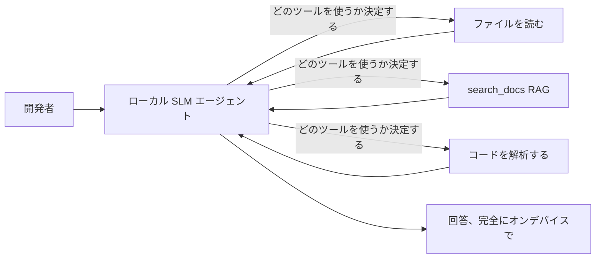
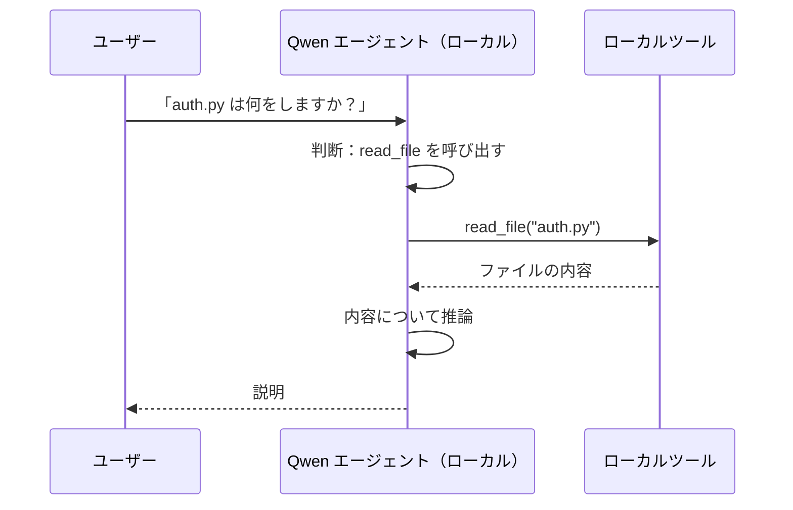
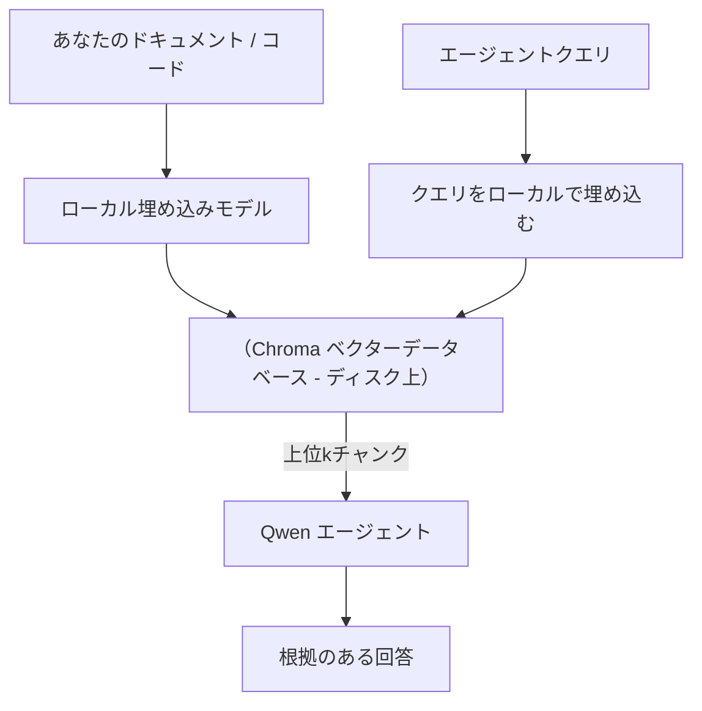
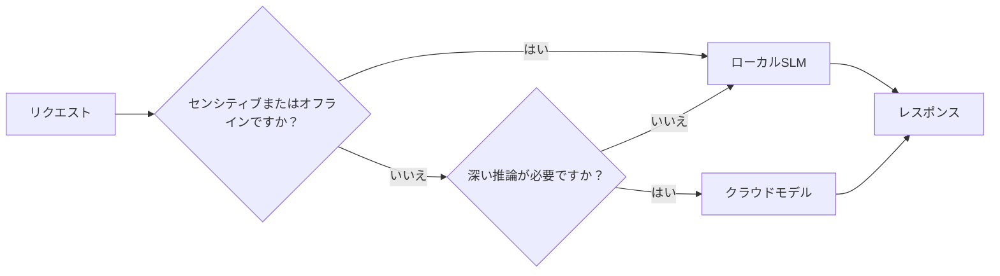

# Microsoft Foundry Local と Qwen を使ったローカル AI エージェントの作成


前回のレッスンではエージェントをクラウドにスケールアップしましたが、今回はそれを単一のマシンにスケールダウンします。最後には、推論が一切クラウドに呼ばれることなく、推論、ツール呼び出し、ファイルの読み込み、ドキュメント検索を行う実用的なエンジニアリングアシスタントが完成します。

なぜこれをやりたいのでしょうか？実際のエンジニアリング作業で頻繁に出てくる理由が3つあります:

- **プライバシー。** コードやドキュメントはマシンから一切出ません。プロンプトもスニペットも顧客データもネットワーク境界を跨ぎません。
- **コスト。** ローカル推論はトークン単位の課金がありません。電気代だけで一日中繰り返し作業できます。
- **オフライン対応。** 飛行機内や安全施設、停電時でもエージェントは動作し続けます。

ただし、これにはフロンティアのクラウドモデルと引き換えに、CPU、GPU、NPU上で動作する<strong>小型言語モデル（SLM）</strong>を使う必要があります。このレッスンは制約を無かったことにせず、その制約の中で<em>良い</em>エージェントを構築する方法について扱います。

## はじめに

このレッスンで学ぶ内容は以下の通りです:

- <strong>小型言語モデル（SLM）</strong>とは何か、向いている点と向いていない点。
- **Microsoft Foundry Local** — モデルをデバイス上でダウンロードして提供する、<strong>OpenAI互換API</strong>を備えたランタイム。
- **Qwen関数呼び出しモデル** — 信頼性あるツール呼び出しを生成し、単なるローカルチャットでなくローカル<em>エージェント</em>を可能にするSLM。
- **ローカルツール、ローカルRAG、ローカルMCP** — クラウドを使わずにエージェントの機能を提供する方法。
- <strong>ハイブリッドパターン</strong> — いつローカルに留めて、いつクラウドを使うかの指針。

## 学習目標

このレッスンを修了すると以下ができるようになります:

- SLMのトレードオフを説明し、適切なローカルエージェントのユースケースを選択する。
- Foundry Localを使ってQwenモデルをローカルで提供し、OpenAI互換エンドポイント経由で接続する。
- ワークステーション上で完全に動作するツール呼び出しエージェントを構築する。
- ローカルベクトルデータベース（Chroma）を使って、自分のドキュメントに対するローカルRAGを追加する。
- エージェントをローカルMCPサーバーに接続し、ローカル／クラウドのハイブリッド設計について理解する。

## 前提条件

このレッスンでは以下の内容を既に修了し、慣れていることを想定しています:

- [Tool Use](../04-tool-use/README.md) (レッスン4) と [Agentic RAG](../05-agentic-rag/README.md) (レッスン5)。
- [Agentic Protocols / MCP](../11-agentic-protocols/README.md) (レッスン11)。
- [Microsoft Agent Framework](../14-microsoft-agent-framework/README.md) (レッスン14)。

また以下が必要です:

- 開発用ワークステーション。**現実的な最低環境は8GB RAM**。16GB以上が快適です。GPUまたはNPUがあれば助かりますが必須ではありません。
- **Microsoft Foundry Local** のインストール（下記セットアップ参照）。
- Python 3.12+ と、本レポジトリの [`requirements.txt`](../../../requirements.txt) に加え、本レッスン用に `foundry-local-sdk`、`openai`、`chromadb` をインストール。

## 小型言語モデル: ローカル作業に最適なツール

フロンティアのクラウドモデルは数千億パラメータとデータセンターを持ちますが、SLMは数十億パラメータでノートパソコンのRAMに収まるサイズです。この差が期待値を明確にします。

**SLMが得意なこと:**

- 構造化され範囲が限定されたタスク — 分類、抽出、既知ドキュメントの要約。
- <strong>ツール呼び出し</strong> — どの関数をどう呼ぶかの判断。
- 自身のデータに対する高速で安価かつプライベートな反復処理。

**SLMが苦手なこと:**

- オープンエンドの長距離推論や複数ステップ推論。
- 広範な世界知識（学習データや記憶が限られている）。

したがってローカルエージェントの勝ち筋は: **SLMはオーケストレーションに専念し、重い処理はツールに任せる** ことです。モデルはコードベースそのものを<em>知る</em>必要はなく、`read_file`や`search_docs`をいつ呼ぶべきかを知れば良い。これがSLMの強みを活かす戦術です。



## Microsoft Foundry Local

**Microsoft Foundry Local** は、モデルをダウンロード、管理、提供までを完全にマシン上で行う軽量ランタイムです。重要な特徴は **OpenAI互換のHTTPエンドポイント** を提供することで、これによりOpenAI SDKやMicrosoft Agent FrameworkのOpenAIクライアントが `base_url` を変えるだけで動作します。エージェント構築の知識がそのまま使え、エンドポイントがクラウドから `localhost` に移るだけです。

Foundry Localは、CPUビルド、CUDA/GPUビルド、またはNPUビルドの中からハードウェアに最適なモデルビルドを自動選択するので、マシンごとの手動最適化は不要です。

### セットアップ

Foundry Localをインストールし（お使いのOS向けの[ドキュメント](https://learn.microsoft.com/azure/ai-foundry/foundry-local/)参照）、動作を確認してください:

```bash
# インストール（例：プラットフォームのドキュメントに従ってください）
winget install Microsoft.FoundryLocal      # Windows
# brew install microsoft/foundrylocal/foundrylocal   # macOS

# Qwenモデルをダウンロードして実行し、その後ローカルサービスを開始します
foundry model run qwen2.5-7b-instruct
foundry service status
```

サービスが起動すると、通常 `http://localhost:PORT/v1` のOpenAI互換エンドポイントが利用可能になります。ノートブックは `foundry-local-sdk` を使って自動的にエンドポイントを検出するため、ポートをハードコーディングする必要はありません。

## Qwen関数呼び出し: なぜ重要か

エージェントはツールを呼び出せるからこそエージェントです。多くのSLMはチャットはできますが、信頼できる整形式のツール呼び出しを生成しません。<strong>Qwen</strong>モデルは関数呼び出し用に訓練されており、常に整形式のツール呼び出し構造を出力します。これがローカルチャットモデルをローカル<em>エージェント</em>に変える要素です。

フローは既知のツール呼び出しループそのもので、デバイス上で実行されているだけです:



## ローカルRAG

ドキュメント検索はローカルエージェントの価値を生み出す部分です。SLMがフレームワークのドキュメントを丸暗記していることに期待するのではなく、ドキュメントを<strong>ローカルベクトルデータベース</strong>に埋め込み、必要に応じて関連部分を検索させます。

我々は **Chroma** を使います。Chromaはサーバー不要でプロセス内に埋め込めるベクトルストアです。パイプラインは完全にローカルです: ローカル埋め込みモデル → ローカルベクトル → ローカル検索 → ローカルSLM。



これはレッスン5で学んだAgentic RAGパターンと同じですが、すべてのコンポーネントがマシン上で動いている点だけが異なります。

## ローカルMCPサーバー

[MCP](../11-agentic-protocols/README.md)は輸送層であってクラウドサービスではありません。MCPサーバーは`stdio`上でローカルプロセスとして動作し、標準プロトコルでエージェントにツールを提供します。これにより、ファイルシステムアクセス、git操作、データベースクエリなどMCPサーバーのエコシステムを完全にオフラインで再利用できます。

セキュリティ姿勢はクラウドとは異なりますが全く無いわけではありません。ローカルMCPサーバーはユーザーの権限で動作するため、アクセス範囲をプロジェクトディレクトリに限定し（ホームフォルダ全体でなく）、出力は入力として検証するよう扱うべきです。

## ハイブリッドクラウド・ローカルパターン

ローカルファーストはローカルオンリーではありません。成熟したシステムは機微性や難易度に応じてルーティングを行います:

| 状況 | 実行場所 |
| --- | --- |
| 機微なコード・データ、またはオフライン時 | **ローカルSLM** |
| 単純で範囲限定なタスク | **ローカルSLM**（安くて速い） |
| 非機微データの難しい複数ホップ推論 | <strong>クラウドモデル</strong> |
| 停電などの全状況 | **ローカルSLM**（劣化しながらも動作） |

これはレッスン16の<strong>モデルルーティング</strong>の考え方と同様で、唯一違うのは「モデル」の一つが自分のマシンになったことです。堅牢な設計ではクラウド不可時にローカルにフォールバックし、エージェントは完全に停止せず品質低下で済みます。



## 実習: ローカルエンジニアリングアシスタント

[`code_samples/17-local-agent-foundry-local.ipynb`](./code_samples/17-local-agent-foundry-local.ipynb) を開いて順に進めてください。以下が完全にワークステーション上で動作する<strong>ローカルエンジニアリングアシスタント</strong>として構築されます:

1. <strong>ツール呼び出し</strong> — Foundry Local経由でQwen関数呼び出しを使う。
2. <strong>ローカルファイル操作</strong> — プロジェクトディレクトリ内のファイル一覧表示と読み込み。
3. <strong>コード解析</strong> — ソースファイルの基本的なメトリクス報告。
4. <strong>ドキュメント検索</strong> — Chromaを使ったドキュメントフォルダのローカルRAG。
5. **MCP使用** — ローカルMCPサーバーに接続（設定されていなければスキップ機能付き）。

どの時点でもクラウド推論は使いません。

### ハンズオン解説

アシスタントはOpenAI互換エンドポイントを介してFoundry Localに接続するため、コードはクラウドレッスンとほぼ同様で、クライアントだけが異なります:

```python
from foundry_local import FoundryLocalManager
from openai import OpenAI

# Foundry Localはモデルを検出してダウンロードし、ローカルのエンドポイントを提供します。
manager = FoundryLocalManager(\"qwen2.5-7b-instruct\")
client = OpenAI(base_url=manager.endpoint, api_key=manager.api_key)  # api_keyはローカルのプレースホルダーです
```

ツールは一般的なPython関数で、プロジェクトディレクトリ内に限定されています:

```python
def read_file(path: str) -> str:
    \"\"\"Read a file, but only inside the sandboxed project directory.\"\"\"
    full = (PROJECT_ROOT / path).resolve()
    if PROJECT_ROOT not in full.parents and full != PROJECT_ROOT:
        return \"Access denied: path is outside the project directory.\"
    return full.read_text(encoding=\"utf-8\")
```

サンドボックスチェックに注意してください — ローカルでも任意パスを読むツールはリスクが高いため、ノートブックではすべてのツールが単一プロジェクトルートにスコープされています。

## 知識チェック

課題に進む前に理解度を試しましょう。

**1. エージェントをクラウドでなくローカルで動かす具体的な理由を2つ挙げてください。**

<details>
<summary>回答</summary>

次のうち2つ: <strong>プライバシー</strong>（コードやデータがマシンから出ない）、<strong>コスト</strong>（トークン単位の推論課金なし）、<strong>オフライン対応</strong>（ネットワーク無しでも動作）。規制やコンプライアンス上の理由でデータをデバイス外に出せない場合がプライバシー理由につながります。
</details>

**2. ローカルエージェントにおけるSLMとツールの役割分担は何で、なぜそうするのですか？**

<details>
<summary>回答</summary>

SLMは<strong>オーケストレーション</strong>（どのツールを使い、引数は何かを決定）を行い、ツールは<strong>重い処理</strong>（ファイルの読み込み、ドキュメントの取得、計算結果の生成）を担います。SLMはツール選択のような限定判断に強く、広範な知識や長距離推論には弱いため、ツール頼みが強みを引き出します。
</details>

**3. Foundry Localでクラウドエージェントのコードを再利用可能にしている仕組みは？**

<details>
<summary>回答</summary>

Foundry Localは<strong>OpenAI互換のHTTPエンドポイント</strong>を公開しています。OpenAI SDKやAgent FrameworkのOpenAIクライアントは`base_url`だけを変えることで対応でき、その他のエージェントコードは変わりません。
</details>

**4. 何故任意のSLMでなくQwen関数呼び出しモデルを使うのですか？**

<details>
<summary>回答</summary>

エージェントは信頼できる整形式の<strong>ツール呼び出し</strong>を出す必要があります。多くのSLMはチャットはできても不整形式や不整合なツール呼び出し構造を出します。Qwenは関数呼び出し向けに訓練され、一貫したツール呼び出しを生成するため、ローカルチャットモデルを実用的なローカルエージェントに変えます。
</details>

**5. ローカルRAGパイプラインでマシン上で動作するコンポーネントはどれですか？**

<details>
<summary>回答</summary>

すべてです: 埋め込みモデル、ベクトルデータベース（Chroma、ディスク上）、検索処理、SLM。ドキュメントはローカルで埋め込み、ローカルで保存・検索・推論します。クラウドに触れるコンポーネントはありません。
</details>

**6. ローカルMCPサーバーはマシン上で動作します。それだけで自動的に安全でしょうか？どんな注意が必要ですか？**

<details>
<summary>回答</summary>

いいえ。ローカルMCPサーバーはユーザーの権限で動作するためユーザーがアクセス可能なすべてに触れられます。必要な範囲に制限し（例: プロジェクトディレクトリのみを範囲に）、出力を入力として検証する工程を必ず設けてください。
</details>

**7. ローカルモデルを含む合理的なハイブリッドルーティングルールを説明してください。**

<details>
<summary>回答</summary>

機微またはオフライン時のリクエストはローカルSLMへ。単純で限定的なタスクはコスト・速度面からローカルSLMへ。非機微データの難しい複数ホップ推論はクラウドモデルへ。クラウドが利用不可時はローカルSLMへフォールバックし、エージェントは完全停止せず劣化動作します。これがレッスン16のモデルルーティング概念のローカルマシン追加版です。
</details>

**8. 今回のローカルエージェント実行に現実的な最低RAMはどれくらいで、多いと何が得られますか？**

<details>
<summary>回答</summary>

約<strong>8GB</strong>が最低ラインで、16GB以上が快適です。RAMが多いとより大きく高性能なモデルを動かせ、保持できるコンテキストも増えます。GPUやNPUは推論を高速化しますが必須ではありません — Foundry Localはアクセラレーターが無い場合CPUビルドを選択します。
</details>

## 課題

ローカルエンジニアリングアシスタントを拡張し、あなたが選んだ小規模プロジェクトの<strong>ローカルドキュメントレビュアー</strong>を作ってください（もしよければこのレポジトリのレッスンフォルダを使って構いません）。

提出物には以下を含めてください:

1. **実際のドキュメントやコードフォルダをChromaにインデックス**（5ファイル以上）。
2. **プロジェクト内の`TODO`/`FIXME`コメントをスキャンし、ファイル名と行番号付きで返す`find_todos`ツールを追加**。`read_file`と同様のサンドボックスチェックを保持してください。

3. **ツールを組み合わせることを強制する3つの質問をエージェントに投げかけます**：純粋なRAG質問1つ、特定のファイルを読む必要のある質問1つ、TODOを見つける必要がある質問1つです。
4. <strong>測定します</strong>：3つの回答それぞれの時間を計測し、マークダウンセルに記録します。レイテンシーがあなたの想定するワークフローで許容できるかコメントしてください。

その後、このレビュアーに対して<strong>クラウドに移すものとローカルに残すもの</strong>について短い段落を書き、理由を述べてください。ローカルコンポーネントが正しく連携されているか、ハイブリッド推論が妥当かどうかで評価されます。モデルの品質に関しては評価されません。

## まとめ

このレッスンでは、あなた自身のマシン上だけで動作するエージェントを構築しました：

- **SLM** はプライバシー、コスト、オフライン動作のために幅を犠牲にし、その代わりに<strong>ツールのオーケストレーション</strong>で輝きます。すべての知識を自身だけで持つわけではありません。
- **Foundry Local** は<strong>OpenAI互換エンドポイント</strong>の背後でデバイス上のモデルを提供するため、クラウドのエージェントコードは一行の変更で移行できます。
- <strong>Qwen関数呼び出しモデル</strong>はローカルツール呼び出しを信頼性高く可能にし、したがってローカル<em>エージェント</em>を可能にします。
- **ローカルRAG**（Chroma）および<strong>ローカルMCP</strong>はマシンを離れずにエージェントに機能を与えます。
- <strong>ハイブリッドパターン</strong>により、感度や難易度でルーティングでき、ローカルは優雅なフォールバックとなります。

これで展開の軌跡が完成しました：レッスン16ではエージェントをMicrosoft Foundryにスケールアップし、このレッスンでは単一ワークステーションにスケールダウンしました。次のレッスンは展開済みエージェントのセキュリティを扱います。

## 追加リソース

- <a href="https://learn.microsoft.com/azure/ai-foundry/foundry-local/" target="_blank">Microsoft Foundry Local ドキュメント</a>
- <a href="https://learn.microsoft.com/azure/ai-foundry/what-is-azure-ai-foundry" target="_blank">Microsoft Foundry ドキュメント</a>
- <a href="https://learn.microsoft.com/en-us/agent-framework/overview/?wt.mc_id=youtube_26688_organicsocial_reactor&pivots=programming-language-python" target="_blank">Microsoft Agent Framework</a>
- <a href="https://qwen.readthedocs.io/en/latest/framework/function_call.html" target="_blank">Qwen 関数呼び出しドキュメント</a>
- <a href="https://modelcontextprotocol.io/" target="_blank">Model Context Protocol (MCP)</a>
- <a href="https://docs.trychroma.com/" target="_blank">Chroma ベクトルデータベース</a>

## 前のレッスン

[Deploying Scalable Agents](../16-deploying-scalable-agents/README.md)

## 次のレッスン

[Securing AI Agents](../18-securing-ai-agents/README.md)

---

<!-- CO-OP TRANSLATOR DISCLAIMER START -->
**免責事項**：
本書類は AI 翻訳サービス [Co-op Translator](https://github.com/Azure/co-op-translator) を使用して翻訳されています。正確性を期していますが、自動翻訳には誤りや不正確な部分が含まれる可能性があることをご承知おきください。原文の原語版が正式な情報源とみなされるべきです。重要な情報については、専門の人間による翻訳を推奨します。本翻訳の利用により生じたいかなる誤解や解釈違いについても、当方は責任を負いかねます。
<!-- CO-OP TRANSLATOR DISCLAIMER END -->