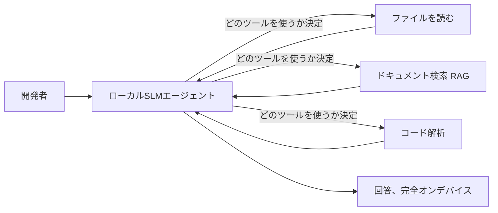
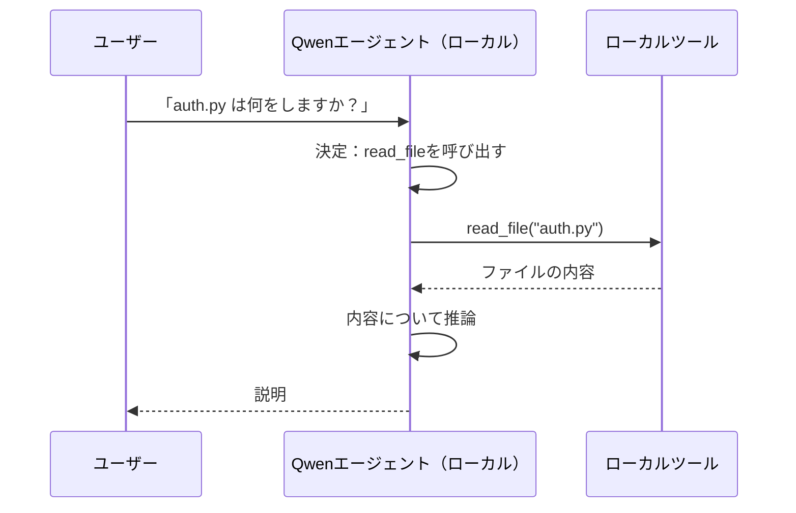
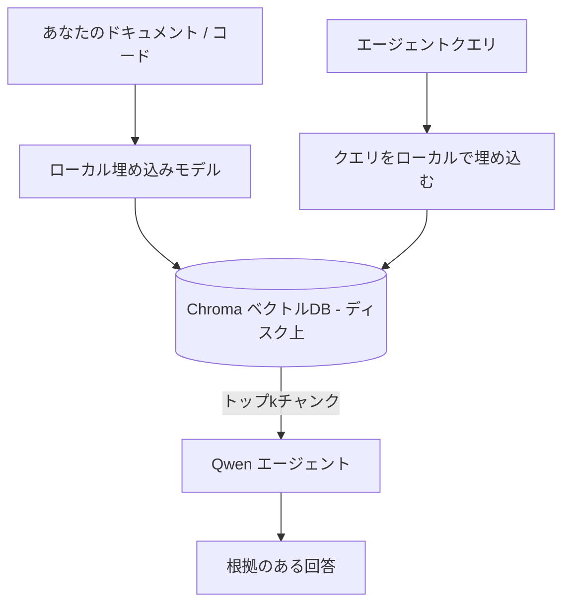
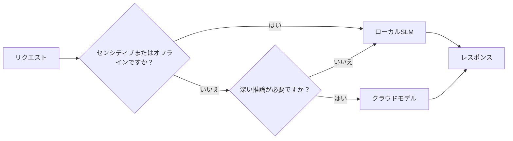

# Microsoft Foundry Local と Qwen を用いたローカルAIエージェントの作成


前のレッスンはエージェントをクラウドに <em>スケールアップ</em> しましたが、このレッスンではそれを単一のマシンに <em>スケールダウン</em> させます。最終的に、推論がクラウドへ一切行かないエンジニアリングアシスタントが完成します。このアシスタントは推論し、ツールを呼び出し、ファイルを読み、ドキュメントを検索します。

なぜこれが望まれるのでしょうか？エンジニアリングの現実で常に浮かび上がる3つの理由があります：

- **プライバシー。** コードやドキュメントはマシンから決して出ません。プロンプトもスニペットも顧客データもネットワーク境界を越えません。
- **コスト。** ローカル推論はトークン単位の課金がありません。電気代だけで一日中繰り返し作業できます。
- **オフライン。** 飛行機内や安全な施設、停電時でもエージェントは動作します。

ただし、最先端クラウドモデルを犠牲にして、CPU、GPU、またはNPU上で動く<strong>小規模言語モデル（SLM）</strong>を使うことになります。このレッスンでは、制約を受け入れた上で <em>優れた</em> エージェントを作ることを目指します。

## はじめに

このレッスンで扱う内容は以下の通りです：

- **小規模言語モデル（SLM）** — それらが何で、どこで優れ、どこで劣るのか。
- **Microsoft Foundry Local** — モデルをダウンロードしてデバイス上で提供するランタイムで、<strong>OpenAI互換API</strong>を通じてアクセス可能。
- **Qwenの関数呼び出しモデル** — ローカルで動くツールコールを信頼して出力できるSLMで、これがローカルの<em>エージェント</em>を可能にする。
- **ローカルツール、ローカルRAG、ローカルMCP** — クラウドなしにエージェントに能力を与える仕組み。
- <strong>ハイブリッドパターン</strong> — どの時点でローカルを使い、いつクラウドに繋ぐか。

## 学習目標

このレッスン終了後には、次のことができるようになります：

- SLMのトレードオフを説明し、適切なローカルエージェントのユースケースを選べる。
- Foundry LocalでQwenモデルをローカルに提供し、OpenAI互換エンドポイントで接続する。
- 完全にワークステーション上で動くツールコール型エージェントを構築する。
- ローカルベクターデータベース（Chroma）を使って、自分のドキュメントの上にローカルRAGを追加する。
- ローカルMCPサーバーにエージェントを接続し、ハイブリッドなローカル/クラウド設計を考察する。

## 前提条件

このレッスンでは、以下のレッスンを終了し、内容を理解していることを前提としています：

- [ツール使用](../04-tool-use/README.md)（レッスン4）と [Agentic RAG](../05-agentic-rag/README.md)（レッスン5）。
- [Agenticプロトコル/MCP](../11-agentic-protocols/README.md)（レッスン11）。
- [Microsoft Agent Framework](../14-microsoft-agent-framework/README.md)（レッスン14）。

また以下が必要です：

- 開発用ワークステーション。<strong>8GBのRAMが現実的な最小値</strong>で、16GB以上が望ましい。GPUまたはNPUがあると便利ですが必須ではありません。
- **Microsoft Foundry Local** のインストール（以下のセットアップをご覧ください）。
- Python 3.12以上とリポジトリ内の [`requirements.txt`](../../../requirements.txt)、さらにこのレッスン用に `foundry-local-sdk`、`openai`、`chromadb` パッケージ。

## 小規模言語モデル：ローカル作業に最適なツール

最先端クラウドモデルは数千億パラメーターを持ち、データセンターが背後にあります。SLMは数十億パラメーターで、ノートパソコンのRAMに収まる必要があります。この違いから明確な期待値が生まれます。

**SLMが得意とするのは：**

- 構造化され限られたタスク — 分類、抽出、既知のドキュメントの要約。
- <strong>ツール呼び出し</strong> — どの関数をどの引数で呼ぶかの決定。
- 自分のデータ上で迅速かつ安価でプライベートな反復作業。

**SLMが苦手とするのは：**

- 広大な文脈に跨る自由形式の多段推論。
- 豊富な世界知識（学習データが少なく、忘却も大きい）。

ローカルエージェントの勝ちパターンはこうです：**SLMにはオーケストレーションを任せ、重い処理はツールに任せる。** モデルはコードベースを <em>知っている</em> 必要はなく、`read_file` や `search_docs` を呼び出すタイミングを知っていれば良い。これがSLMの強みを活かす方法です。



## Microsoft Foundry Local

**Microsoft Foundry Local** は、モデルをローカルマシン上でダウンロード、管理、配信する軽量ランタイムです。最も重要な特徴は、<strong>OpenAI互換のHTTPエンドポイント</strong>を提供することで、OpenAI SDKやMicrosoft Agent FrameworkのOpenAIクライアントが、`base_url`を変更するだけで動作できる点です。これによりクラウドからローカルへの移行がほぼ透過的になります。

Foundry Localはハードウェアに最適なモデルビルド（CPU、CUDA/GPU、NPU）を自動で選択するので、マシンごとに手動で最適化する必要がありません。

### セットアップ

Foundry Localをインストールします（OSごとの[ドキュメント](https://learn.microsoft.com/azure/ai-foundry/foundry-local/)を参照してください）。その後正常に動作するか確認します：

```bash
# インストール（例：お使いのプラットフォームのドキュメントに従ってください）
winget install Microsoft.FoundryLocal      # Windows
# brew install microsoft/foundrylocal/foundrylocal   # macOS

# Qwenモデルをダウンロードして実行し、その後ローカルサービスを開始します
foundry model run qwen2.5-7b-instruct
foundry service status
```

サービスが起動すると、通常 `http://localhost:PORT/v1` のローカルのOpenAI互換エンドポイントが利用可能になります。ノートブックは `foundry-local-sdk` を使ってエンドポイントを自動検出するため、ポート番号をハードコードする必要はありません。

## Qwen関数呼び出しモデル：なぜ重要か

エージェントはツールを呼び出せてこそエージェントです。多くのSLMは会話はできますが信頼できるツールコールの形式を生成できません。<strong>Qwen</strong>モデルは関数呼び出しに特化して訓練されており、整形式のツールコール構造を安定して出力します。これがローカルチャットモデルをローカルの<em>エージェント</em>に変える鍵です。

フローは皆さんが既に知っている標準的なツールコールループと同じですが、デバイス上で動作しています：



## ローカルRAG

ドキュメント検索はローカルエージェントの真価が発揮される場です。SLMにフレームワークのドキュメントを記憶していることを期待する代わりに、<strong>ローカルベクターデータベース</strong>に埋め込みを行い、エージェントが必要なチャンクを要求時に取得できるようにします。

使用するのは、サーバー管理が不要でプロセス内に埋め込めるベクトルストア<strong>Chroma</strong>です。パイプラインは完全にローカル：ローカル埋め込みモデル → ローカルベクトル → ローカル検索 → ローカルSLM。



これはレッスン5のAgentic RAGパターンと同じですが、全てのコンポーネントがマシン上で動く点が異なります。

## ローカルMCPサーバー

[MCP](../11-agentic-protocols/README.md)はクラウドサービスではなくトランスポートです。MCPサーバーは `stdio` 上のローカルプロセスとして動作し、標準プロトコルを通じてツールをエージェントに公開します。これにより、ファイルシステムアクセス、git操作、データベースクエリといったさまざまなMCPサーバー群を完全にオフラインで再利用できます。

セキュリティ姿勢はクラウドとは異なりますが無いわけではありません。ローカルMCPサーバーはユーザー権限で動作するため、アクセス範囲を制限し（プロジェクトディレクトリなど）、出力を入力として検証する必要があります。

## ハイブリッドクラウド＆ローカルパターン

ローカル優先が「ローカル限定」を意味するわけではありません。成熟したシステムは、感度や難易度に応じてルーティングします：

| 状況 | 動作場所 |
| --- | --- |
| 機密コード／データ、またはオフライン | **ローカルSLM** |
| 単純で限定されたタスク | **ローカルSLM**（安価で高速） |
| 非機密データの困難な多段推論 | <strong>クラウドモデル</strong> |
| 停電時など全て | **ローカルSLM**（グレースフルデグラデーション） |

これはレッスン16の<strong>モデルルーティング</strong>の考え方と同じですが、一方の「モデル」が自分のマシンになったイメージです。堅牢な設計はクラウドが使えない時にローカルに切り替わり、エージェントは完全に停止せずに品質を下げて動作し続けます。



## ハンズオンラボ：ローカルエンジニアリングアシスタント

[`code_samples/17-local-agent-foundry-local.ipynb`](./code_samples/17-local-agent-foundry-local.ipynb) を開いて実践してください。完全にワークステーション上で動作する<strong>ローカルエンジニアリングアシスタント</strong>を構築します。このアシスタントは以下を行います：

1. <strong>ツール呼び出し</strong> — Foundry Localを介したQwenの関数呼び出しで。
2. <strong>ローカルファイル操作</strong> — プロジェクトディレクトリ内のファイル一覧表示と読み込み。
3. <strong>コード解析</strong> — ソースファイルの基本的なメトリクスを報告。
4. <strong>ドキュメント検索</strong> — Chromaを使ったドキュメントフォルダー上のローカルRAG。
5. **MCP利用** — ローカルMCPサーバーに接続（未設定ならスキップする柔軟な実装）。

この過程でクラウド推論は一切使用しません。

### 解説

アシスタントはOpenAI互換エンドポイントを通じてFoundry Localと接続するため、クラウドのレッスンとほぼ同じに見えます。変わるのはクライアントだけです：

```python
from foundry_local import FoundryLocalManager
from openai import OpenAI

# Foundry Localはモデルを発見/ダウンロードし、ローカルのエンドポイントを提供します。
manager = FoundryLocalManager(\"qwen2.5-7b-instruct\")
client = OpenAI(base_url=manager.endpoint, api_key=manager.api_key)  # api_keyはローカルのプレースホルダーです。
```

ツールはプロジェクトディレクトリに限定された通常のPython関数です：

```python
def read_file(path: str) -> str:
    \"\"\"Read a file, but only inside the sandboxed project directory.\"\"\"
    full = (PROJECT_ROOT / path).resolve()
    if PROJECT_ROOT not in full.parents and full != PROJECT_ROOT:
        return \"Access denied: path is outside the project directory.\"
    return full.read_text(encoding=\"utf-8\")
```

サンドボックスチェックに注目してください。ローカルでも任意のパスを読むツールはリスクがあります。ノートブックではすべてのツールは単一のプロジェクトルートに限定しています。

## 知識チェック

課題に進む前に理解を確認しましょう。

**1. なぜエージェントをクラウドではなくローカルで実行するのか、具体的な理由を二つ挙げてください。**

<details>
<summary>答え</summary>

以下のどれか二つ：<strong>プライバシー</strong>（コードやデータがマシンを離れないこと）、<strong>コスト</strong>（トークン単位の推論課金が無いこと）、<strong>オフライン対応</strong>（ネットワークなしで動作可能、例えば飛行機内や安全な施設、停電時）。規制やコンプライアンスの制約でデータの持ち出し禁止もプライバシー理由の一環です。
</details>

**2. ローカルエージェントにおけるSLMとツールの役割分担はどうあるべきか、理由と共に説明してください。**

<details>
<summary>答え</summary>

SLMには<strong>オーケストレーション</strong>（どのツールを呼び出すか、その引数を決定）を担当させ、**ファイル読み込みやドキュメント検索、計算など重い作業はツールに任せる**。SLMはツール選択など限定的な判断は得意ですが、広範な知識や長い多段推論は苦手なのでツールを活用すべきです。
</details>

**3. Foundry Localでクラウドのエージェントコードを再利用できる理由は何ですか？**

<details>
<summary>答え</summary>

Foundry Localが<strong>OpenAI互換のHTTPエンドポイント</strong>を提供しているためです。OpenAI SDKやAgent FrameworkのOpenAIクライアントは `base_url` を変えるだけで利用でき、他のエージェントコードは一切変わりません。
</details>

**4. なぜ任意のSLMではなくQwenの関数呼び出しモデルを使うのですか？**

<details>
<summary>答え</summary>

エージェントは信頼性が高く整形式な<strong>ツールコール</strong>を生成しなければならないからです。多くのSLMは会話はできますが、ツールコール形式が不完全か一貫性がありません。Qwenモデルは関数呼び出し向けに訓練され、一貫したツールコールを生み出すため、ローカルチャットモデルを機能するローカルエージェントに変えます。
</details>

**5. ローカルRAGパイプラインでマシン上で動くコンポーネントはどれですか？**

<details>
<summary>答え</summary>

すべてがローカルで、埋め込みモデル、ベクターデータベース（ディスク上のChroma）、検索ステップ、SLMも全てです。ドキュメントはローカルで埋め込み、保存され、検索され、ローカルモデルによって推論されます。クラウドは一切介在しません。
</details>

**6. ローカルMCPサーバーがマシン上で動いているからといって自動的に安全ですか？どんな注意が必要ですか？**

<details>
<summary>答え</summary>

いいえ。ローカルMCPサーバーはユーザーの権限で動くため、ユーザーがアクセスできるあらゆるものに触れられます。アクセス範囲を必要なところ（例えば、プロジェクトディレクトリのみ）に制限し、出力を検証のための入力として扱うことが重要です。
</details>

**7. ローカルモデルを含む賢明なハイブリッドルーティングルールを説明してください。**

<details>
<summary>答え</summary>

機密性の高いまたはオフラインの要求はローカルSLMへ；単純で限られたタスクも速さとコストのためローカルSLMへ；困難な多段推論はクラウドモデルへ。クラウドが利用不可ならローカルへフェイルオーバーし、エージェントは完全に停止せず品質を落として動作し続ける。これはレッスン16のモデルルーティングにローカルマシンが1モデルとして加わったものです。
</details>

**8. このレッスンのローカルエージェントを動かすにあたり、現実的な最低RAM量はどの程度で、より多いRAMは何をもたらしますか？**

<details>
<summary>答え</summary>

およそ<strong>8 GB</strong>が現実的な最低値で、16 GB以上が快適に動作します。より多くのRAMでより大きく高性能なモデルを動かし、より多くの文脈をメモリに保持できます。GPUやNPUは推論を高速化しますが必須ではなく、Foundry Localはアクセラレータ未使用時にCPUビルドを自動選択します。
</details>

## 課題

ローカルエンジニアリングアシスタントを拡張し、<strong>選んだ小規模プロジェクトのローカルドキュメントレビュアー</strong>にしてください（必要ならこのリポジトリのレッスンフォルダーを使っても構いません）。

提出物には次のものが含まれているべきです：

1. **実際のドキュメント/コードフォルダーをChromaにインデックス化**（最低5ファイル以上）。
2. `TODO` / `FIXME` コメントをプロジェクト内でスキャンしてファイル名と行番号と共に返す `find_todos` ツールを追加する — `read_file` と同様にサンドボックスチェックを維持してください。

3. **エージェントにツールを組み合わせることを強いる3つの質問** をしてください：1つは純粋なRAGの質問、1つは特定のファイルを読む必要がある質問、もう1つはTODOを見つける必要がある質問です。
4. <strong>測定してください</strong>：3つの回答それぞれの時間を計り、マークダウンセルに記録します。遅延が意図したワークフローにとって許容範囲かどうかコメントを付けてください。

その後、<strong>このレビュワー向けにクラウドに移すものとローカルに保持するもの</strong>について短い段落を書き、その理由を述べてください。ローカルコンポーネントが正しく連携しているか、ハイブリッド推論が妥当かで評価されます — モデルの品質ではありません。

## まとめ

このレッスンでは、完全に自身のマシン上で動くエージェントを構築しました：

- **SLMs** は幅広さを犠牲にしてプライバシー、コスト、オフライン動作を実現し、全知識を持つよりも <strong>ツールをオーケストレーションする</strong> ことで輝きます。
- **Foundry Local** は OpenAI互換エンドポイントの背後でモデルをオンデバイス提供し、クラウド側のエージェントコードをワンラインの変更で転用可能にします。
- **Qwenの関数呼び出しモデル** は信頼性の高いローカルのツール呼び出しを可能にし、従ってローカル <em>エージェント</em> が可能です。
- **ローカルRAG**（Chroma）と **ローカルMCP** は機械から離れずにエージェントに能力を与えます。
- <strong>ハイブリッドパターン</strong> は感度や難易度によりルーティングし、ローカルを優雅なフォールバックにします。

これで展開の一連の流れが完結します：レッスン16はエージェントをMicrosoft Foundryへスケールアップし、本レッスンは単一のワークステーションにスケールダウンしました。次のレッスンは展開済みエージェントのセキュリティ保持に取り組みます。

## 追加リソース

- <a href="https://learn.microsoft.com/azure/ai-foundry/foundry-local/" target="_blank">Microsoft Foundry Localドキュメント</a>
- <a href="https://learn.microsoft.com/azure/ai-foundry/what-is-azure-ai-foundry" target="_blank">Microsoft Foundryドキュメント</a>
- <a href="https://learn.microsoft.com/en-us/agent-framework/overview/?wt.mc_id=youtube_26688_organicsocial_reactor&pivots=programming-language-python" target="_blank">Microsoft Agent Framework</a>
- <a href="https://qwen.readthedocs.io/en/latest/framework/function_call.html" target="_blank">Qwen関数呼び出しドキュメント</a>
- <a href="https://modelcontextprotocol.io/" target="_blank">Model Context Protocol (MCP)</a>
- <a href="https://docs.trychroma.com/" target="_blank">Chromaベクトルデータベース</a>

## 前のレッスン

[Deploying Scalable Agents](../16-deploying-scalable-agents/README.md)

## 次のレッスン

[Securing AI Agents](../18-securing-ai-agents/README.md)

---

<!-- CO-OP TRANSLATOR DISCLAIMER START -->
**免責事項**：
本書類は AI 翻訳サービス [Co-op Translator](https://github.com/Azure/co-op-translator) を使用して翻訳されています。正確性を期していますが、自動翻訳には誤りや不正確な部分が含まれる可能性があることをご承知おきください。原文の原語版が正式な情報源とみなされるべきです。重要な情報については、専門の人間による翻訳を推奨します。本翻訳の利用により生じたいかなる誤解や解釈違いについても、当方は責任を負いかねます。
<!-- CO-OP TRANSLATOR DISCLAIMER END -->