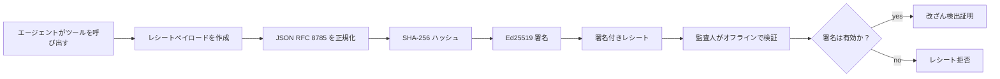
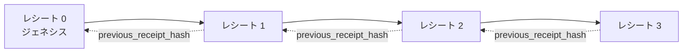

[レッスンビデオを見る: 暗号化レシートを使ったAIエージェントのセキュリティ](https://youtu.be/PLACEHOLDER_VIDEO_ID)

> _(レッスン14 / 15のパターンに合わせて、Microsoftコンテンツチームによってマージ後にレッスンビデオとサムネイルが追加されます。)_

# 暗号化レシートを使ったAIエージェントのセキュリティ

## はじめに

このレッスンでは以下を扱います：

- コンプライアンス、デバッグ、および信頼のためにAIエージェントの監査証跡が重要である理由。
- 暗号化レシートとは何か、署名されていないログ行とどう違うのか。
- プレーンなPythonでエージェントのツール呼び出しに署名済みレシートを生成する方法。
- レシートをオフラインで検証し、改ざんを検出する方法。
- レシートを連鎖させて、1つを削除または並べ替えた場合に連鎖が崩れる仕組み。
- レシートが証明することと、明示的に証明しないこと。

## 学習目標

このレッスンを修了すると、以下ができるようになります：

- エージェントの行動における暗号的由来を必要とする障害モードを特定する。
- 正規化されたJSONペイロードに対しEd25519署名付きレシートを生成する。
- 署名者の公開鍵のみを使ってレシートを独立して検証する。
- 変更されたレシートに対して検証を再実行し、改ざんを検出する。
- レシート列のハッシュ連鎖を構築し、その連鎖がなぜ重要か説明する。
- レシートが証明する事柄（帰属、完全性、順序付け）と証明しない事柄（行動の正しさ、ポリシーの妥当性）との境界を認識する。

## 問題: あなたのエージェントの監査証跡

Contoso Travel用にAIエージェントを展開したと想像してください。エージェントは顧客のリクエストを読み取り、フライトAPIを呼び出してオプションを調べ、顧客に代わって座席を予約します。前四半期には、エージェントは5万件の予約を処理しました。

今日、監査人がやってきました。単純な質問をします。「あなたのエージェントが何をしたか見せてください。」

あなたはログファイルを渡します。監査人はそれを見て、より難しい質問をします。「これらのログが編集されていないとどうやってわかるのですか？」

これが監査証跡問題です。現在ほとんどのエージェント展開は以下に依存しています：

- <strong>アプリケーションログ</strong>：エージェント自身が書き込み、ファイルシステムへのアクセス権を持つ誰でも編集可能。
- <strong>クラウドログサービス</strong>：プラットフォームレベルで改ざん検出可能だが、監査人がプラットフォーム運営者を信頼する場合のみ機能。
- <strong>データベーストランザクションログ</strong>：データベース変更には適しているが、任意のツール呼び出しには不向き。

いずれも、監査人が誰か（あなた、クラウドプロバイダー、データベースベンダー）を信頼しなければ、監査人の質問に答えることができません。内部利用ではその信頼は通常受け入れられますが、規制対象の作業（金融、医療、EU AI法の対象など）ではそうはいきません。

暗号化レシートは、各エージェントの行動を独立して検証可能にすることでこれを解決します。監査人はあなたを信頼する必要がありません。公開鍵とレシートそのものがあれば十分です。

## 暗号化レシートとは？

レシートは、エージェントが何をしたかを記録し、デジタル署名で署名されたJSONオブジェクトです。


  
最小限のレシートは次のようになります：

```json
{
  "type": "agent.tool_call.v1",
  "agent_id": "contoso-travel-bot",
  "tool_name": "lookup_flights",
  "tool_args_hash": "sha256:a3f9c1...",
  "result_hash": "sha256:7b2e1d...",
  "policy_id": "contoso-travel-policy-v3",
  "timestamp": "2026-04-25T14:30:00Z",
  "sequence": 47,
  "previous_receipt_hash": "sha256:9d4e6a...",
  "signature": {
    "alg": "EdDSA",
    "sig": "c5af83...",
    "public_key": "8f3b2c..."
  }
}
```
  
3つの特性が機能しています：

1. <strong>署名</strong>。レシートはエージェントのゲートウェイがEd25519の秘密鍵で署名します。対応する公開鍵を持つ者は誰でもオフラインで署名を検証できます。どのフィールドに対しても改ざんがあると署名は無効になります。

2. <strong>正規化エンコーディング</strong>。署名前に、レシートはJSON正規化スキーム（JCS, RFC 8785）で直列化されます。これにより、2つの実装が同じ論理的内容のレシートを生成すると、バイト単位で完全に一致する出力になります。正規化がないと、異なるJSONシリアライザーが同じ内容に対して異なる署名を生成します。

3. <strong>ハッシュ連鎖</strong>。`previous_receipt_hash`フィールドは各レシートを前のレシートにリンクします。レシートを削除または並べ替えると、それ以降のすべてのレシートが崩れます。個々の署名が回避されても、連鎖レベルで改ざんが可視化されます。

これらの性質が総合して3つの保証を提供します：

- <strong>帰属</strong>：この鍵がこのコンテンツに署名した。
- <strong>完全性</strong>：署名以降内容が変更されていない。
- <strong>順序付け</strong>：このレシートはあのレシートの後に発行された。

## Pythonでレシートを生成する

特別なライブラリは不要です。暗号プリミティブは広く利用可能で、ロジックは数十行のPythonコードです。

`code_samples/18-signed-receipts.ipynb`のハンズオン演習では全手順を案内します。要約：

```python
import json
import hashlib
import base64
from nacl import signing
from jcs import canonicalize  # RFC 8785 標準のJSON

def b64url_nopad(data: bytes) -> str:
    return base64.urlsafe_b64encode(data).decode("ascii").rstrip("=")

def sha256_canonical(obj) -> str:
    """SHA-256 of a Python object's JCS-canonical JSON form."""
    return f"sha256:{hashlib.sha256(canonicalize(obj)).hexdigest()}"

# 署名鍵を生成または読み込みます（本番環境ではキーコンテナに保存してください）
signing_key = signing.SigningKey.generate()
verify_key = signing_key.verify_key

# レシートのペイロードを構築します（まだ署名はありません）
tool_args = {"origin": "SYD", "destination": "LAX"}
tool_result = [{"flight": "QF11", "price": 1850, "stops": 0}]

payload = {
    "type": "agent.tool_call.v1",
    "agent_id": "contoso-travel-bot",
    "tool_name": "lookup_flights",
    "tool_args_hash": sha256_canonical(tool_args),
    "result_hash": sha256_canonical(tool_result),
    "policy_id": "contoso-travel-policy-v3",
    "timestamp": "2026-04-25T14:30:00Z",
    "sequence": 0,
    "previous_receipt_hash": None,
}

# 正規化し、ハッシュ化し、署名します。
canonical_bytes = canonicalize(payload)
message_hash = hashlib.sha256(canonical_bytes).digest()
signature_bytes = signing_key.sign(message_hash).signature

# 構造化された署名オブジェクトを添付します。
receipt = {
    **payload,
    "signature": {
        "alg": "EdDSA",
        "sig": b64url_nopad(signature_bytes),
        "public_key": b64url_nopad(bytes(verify_key)),
    },
}
```
  
これが署名の全パイプラインです。ノートブックの演習で各ステップを詳しく解説しています。

## レシートの検証と改ざん検出

検証は逆操作です：

```python
import base64
import hashlib
from nacl import signing
from nacl.exceptions import BadSignatureError
from jcs import canonicalize

def b64url_decode(s: str) -> bytes:
    padding = "=" * ((4 - len(s) % 4) % 4)
    return base64.urlsafe_b64decode(s + padding)

def verify_receipt(receipt: dict) -> bool:
    # 署名は構造化されたオブジェクトです: {"alg", "sig", "public_key"}。
    sig_obj = receipt.get("signature")
    if not sig_obj or sig_obj.get("alg") != "EdDSA":
        return False

    # 実際に署名されたペイロードを再構築します（署名を除くすべて）。
    payload = {k: v for k, v in receipt.items() if k != "signature"}

    canonical_bytes = canonicalize(payload)
    message_hash = hashlib.sha256(canonical_bytes).digest()

    try:
        verify_key = signing.VerifyKey(b64url_decode(sig_obj["public_key"]))
        verify_key.verify(message_hash, b64url_decode(sig_obj["sig"]))
        return True
    except BadSignatureError:
        return False
```
  
この関数はレシートを受け取り、署名が有効なら`True`、そうでなければ`False`を返します。ネットワーク呼び出しやサービス依存はなく、第三者の信頼も不要です。

改ざん検出の実例はノートブックで次の手順で示されています：

1. 正しいレシートを生成し、検証が通ることを確認する。
2. `tool_args_hash`フィールドの1バイトを変更する。
3. 検証を再実行し、失敗することを確かめる。

これはレシートが改ざん検知可能である実証：いかなる変更も署名を破壊します。

## 複数ステップのエージェントのためのレシート連鎖

単一署名レシートは1つの行動を保護します。レシートの連鎖は一連の行動を守ります。


  
各レシートは前のレシートのハッシュを記録します。攻撃者が連鎖の途中のレシート2を密かに削除しようとすると、

- レシート3の`previous_receipt_hash`を改変すれば署名が破綻する、または
- 改変したレシート3に対して新たな署名を偽造する必要がある（秘密鍵が必要）。

秘密鍵がハードウェアキーボルトにあり、公開鍵を各レシートと共に公開していれば、検出なしにどちらも不可能です。

ノートブックでは、

1. 3つのレシートの連鎖を構築する。
2. 各レシートの`previous_receipt_hash`が直前レシートの実際のハッシュと一致することを検証する。
3. 途中のレシートを改ざんし、連鎖が正確にそのポイントで壊れることを見る。

これが外部監査人があなたを信頼せずに検証できる監査証跡の生成方法です。

## レシートが証明すること（および証明しないこと）

このセクションはこのレッスンで最も重要です。レシートは強力ですが、その力には限界があります。

**レシートが証明する3つのこと：**

1. <strong>帰属</strong>：特定の鍵が特定のペイロードに署名した。
2. <strong>完全性</strong>：署名後にペイロードが変更されていない。
3. <strong>順序付け</strong>：このレシートは連鎖上であのレシートの後に生成された。

**レシートが証明しないこと：**

1. <strong>正当性</strong>：エージェントの行動が正しいこと。誤った答えであってもレシートは同様に署名される。
2. <strong>ポリシー遵守</strong>：`policy_id`で参照されたポリシーが実際に評価されたか、評価されていれば行動が許されるか。レシートは主張を記録するが実施結果を示さない。
3. <strong>鍵以外のアイデンティティ</strong>：レシートは「この鍵がこの内容に署名した」と述べるのみ。「この人間が認可した」とは言わない。鍵を人物や組織に結びつけるには別のアイデンティティ基盤（ディレクトリ、公開鍵登録簿など）が必要。
4. <strong>入力の真実性</strong>：エージェントが改ざんされたプロンプトを受けてそれに基づき行動した場合、レシートは行動を忠実に記録する。レシートは入力検証の下流処理であり、それ自体が代替ではない。

この境界は2つの理由で重要です：

- レシートが有用なのは、組織の壁を越えてもエージェントの行動を監査可能かつ改ざん検知可能にすること。
- それに加えて必要な層が何かを示すから：入力検証（レッスン6）、ポリシー強制（以下簡単に触れる）、アイデンティティ基盤（このレッスンの範囲外）。

よくある誤解は、「レシートがあれば統治されている」と思うことですが実際は違います。レシートは基盤であり、統治はその上に構築されるシステムです。

## 本番環境での参考

このレッスンのPythonコードは、全ての行を読んで何が起きているか正確に理解できるよう意図的に最小限にしています。本番運用では2つの選択肢があります：

1. **暗号プリミティブの上に直接構築する。** 上記の50行ほどで多くのユースケースは十分。PyNaCl（Ed25519）と`jcs`パッケージ（正規化JSON）は維持管理され監査済み。

2. **本番用レシートライブラリを使う。** 複数のオープンソースで同様のパターンを追加機能（鍵ローテーション、バッチ検証、JWKセット配布、ポリシーエンジン連携）つきで実装：
   - 本レッスンのレシート形式は、現在標準化プロセス中のIETFインターネットドラフト(`draft-farley-acta-signed-receipts`)に準拠。
   - Microsoft Agent Governance ToolkitはCedarベースのポリシー決定とレシートを統合しており、リポジトリのTutorial 33でEnd-to-End例を提供。
   - `protect-mcp`（npm）や`@veritasacta/verify`（npm）は、Tamper-evidentな監査証跡でMCPサーバをラップするためのNode実装。
   - **[nobulex](https://github.com/arian-gogani/nobulex)** Python SDK (`pip install nobulex`) はEd25519 + JCS署名パターンをPythonでLangChainやCrewAIと連携し、クロスバリデーションテストベクターおよび[OWASP PR #2210](https://github.com/OWASP/CheatSheetSeries/pull/2210)経由のコンプライアンスマッピングを含む。

独自実装とライブラリ使用の選択は、自前のJWTライブラリを書くかテスト済みライブラリを使うかに似ています：どちらも合理的で、ライブラリは時間を節約し監査対象を減らし、自作は全プリミティブを理解させます。このレッスンは自作ルートの基礎を教え、どちらの選択にも役立てられます。

## 理解度チェック

練習課題に進む前に理解度を確認しましょう。

**1. レシートはエージェントの秘密Ed25519鍵で署名され、監査人は公開鍵だけを持っています。監査人はオフラインでレシートを検証できますか？**

<details>
<summary>回答</summary>

はい。Ed25519検証には公開鍵と署名済みバイト列だけが必要です。ネットワークコールもサービス依存もありません。これがレシートをエアギャップ、複数組織、低信頼監査環境で役立てられる性質です。
</details>

**2. 攻撃者がレシートの`policy_id`フィールドをより寛容なポリシーを示すよう改変しました。署名は元のペイロードで計算されています。検証では何が起きますか？**

<details>
<summary>回答</summary>

検証は失敗します。署名は元のペイロードの正規化バイト列で計算されているため、フィールドを変更すると正規化バイト列も変わり、SHA-256ハッシュも変わり、署名が無効になります。攻撃者は正しい署名を生成するための秘密鍵を持っていません。
</details>

**3. なぜレシートには生の引数や結果ではなく、`tool_args_hash`と`result_hash`が含まれるのでしょうか？**

<details>
<summary>回答</summary>

理由は2つあります。1つは、レシートがアーカイブや情報漏洩が問題となる環境で移送される可能性があるため、個人情報や業務データの生内容を漏らさずハッシュ化で小型かつプライベートに保つため。監査人は別途保存された実データとハッシュを照合します。2つめは、ハッシュは固定長なので入力や出力の大きさに関わらずレシートサイズが制限されるためです。
</details>

**4. `previous_receipt_hash`がレシートを前のレシートにつなぎます。攻撃者が連鎖の中央のレシートをこっそり削除したら何が無効になりますか？**

<details>
<summary>回答</summary>

削除されたレシートより後に続くすべてのレシートです。それらの`previous_receipt_hash`が実際の連鎖と一致しなくなります（参照先レシートが存在しないか、異なる前のレシートを指すため）。削除を隠すには、後続すべてのレシートを再署名する必要があり、秘密鍵がなければ不可能です。
</details>

**5. レシートの検証が正常に通りました。これでエージェントの行動が正しく、健全で、ポリシー遵守していると証明できますか？**

<details>
<summary>回答</summary>

いいえ。有効なレシートは帰属（この鍵がこの内容に署名した）、完全性（内容は変更されていない）、順序（このレシートがあのレシートの後にある）を証明しますが、行動が正しいことや`policy_id`のポリシーが真に評価されたこと、エージェントが全ルールを遵守したことは証明しません。レシートはエージェントの行動を監査可能にしますが、正当性を保証しません。これがレッスンで最も重要な境界です。
</details>

## 実践課題

`code_samples/18-signed-receipts.ipynb`を開き、4つのセクションをすべて完了してください：

1. **セクション1**：はじめてのレシートに署名し、検証する。
2. **セクション2**：レシートを改ざんし、検証が失敗する様子を見る。
3. **セクション3**：3つのレシート連鎖を作り、連鎖の整合性を検証する。
4. **セクション4**：Microsoft Agent Frameworkで構築したエージェントにパターンを適用し、ツール呼び出しをレシート署名でラップし、独立してレシートを検証する。
**Stretch challenge 1:** レシートスキーマを自身で選んだ追加フィールド（例：トレーシング用のリクエストID）で拡張し、正準署名ロジックにそのフィールドを含めて更新し、レシートが検証を通じて正常にラウンドトリップすることを確認します。その後、署名後にフィールドを変更して検証が失敗することを確認してください。これは正準エンコーディングの全バイトが署名にどのように寄与するかを理解することを強制します。

**Stretch challenge 2:** 2つのレシートをSHA-256でハッシュします（正準バイト列を決定的な順序で連結）。生成したダイジェストを3番目のレシートの新しいフィールドとして埋め込み、署名前に追加します。3つのレシート全てが正常にラウンドトリップすることを検証してください。これにより、ワンステップの包含証明を構築しました。3番目のレシートを持つ誰もが、1番目と2番目のレシートが署名時に存在したことを、その中身を明らかにすることなく証明できます。これは選択的開示レシートがスケールで使用するパターンです（Merkleコミットメント、RFC 6962）。

## 結論

暗号署名レシートはAIエージェントに以下のような監査証跡を提供します：

- <strong>独立検証可能</strong>：公開鍵を持つ誰でも検証可能であり、サービス依存性がありません。
- <strong>改ざん検知可能</strong>：改変は署名を無効にします。
- <strong>携帯性</strong>：レシートは小さなJSONファイルで、アーカイブ、伝送、検証がどこでも可能です。
- <strong>標準準拠</strong>：Ed25519（RFC 8032）、JCS（RFC 8785）、SHA-256に基づき、広く展開されたプリミティブです。

これらは入力検証、ポリシー施行、またはアイデンティティ基盤の代わりではありません。これらの層の基盤となるものです。規制されたワークロードや複数組織間のワークフロー、将来の監査人が信用できない環境にエージェントを展開する際、レシートは監査証跡を正直なものにします。

最も重要なポイントは：レシートは「誰が、何を、いつ言ったか」を証明します。「言われたことが真実か正しいか」は証明しません。この区別をしっかり持つこと。これは正直な由来システムと誤解を招くものとの違いです。

## プロダクションチェックリスト

このレッスンから本番環境でレシート署名エージェントを展開する段階に進むとき：

- [ ] **署名鍵を開発者のラップトップから移動する。** Azure Key Vault、AWS KMS、またはハードウェアセキュリティモジュールを使用。署名用の秘密鍵はソース管理やアプリケーションマシン上の平文で決して存在してはいけません。
- [ ] **検証用公開鍵を公開する。** 監査人はオフライン検証に必要。標準パターンは JWK Set を既知のURL（RFC 7517）に置くこと。例：`https://your-org.example.com/.well-known/agent-keys.json`。
- [ ] **チェーンを外部にアンカーする。** 定期的に最新チェーンヘッドのハッシュを透明性ログ（Sigstore Rekor、RFC 3161 タイムスタンプ機関、または社内別システム）に書き込み、外部が「このチェーンはこの時点に存在した」ことを確認できるようにする。
- [ ] **レシートを不変に保存する。** 追記専用のBlobストレージ（Azure Storageの不変ポリシー、AWS S3 Object Lock）で内部関係者による履歴改竄を防止。
- [ ] **保持期間を決める。** 多くのコンプライアンス規則は数年の保持を義務付け。レシートの増加にも備える（レシートは約500バイト；1日10,000件の呼び出しで約年間1.8GBを生成）。
- [ ] **レシートの対象外を文書化する。** レシートは帰属、整合性、順序付けを証明。運用手順書には入力検証、ポリシー施行、レート制限、アイデンティティ基盤などの追加制御がガバナンス姿勢にどのように組み込まれているかを明示。

### AIエージェントのセキュリティについてもっと質問がありますか？

[Microsoft Foundry Discord](https://aka.ms/ai-agents/discord)に参加して、他の学習者と交流し、オフィスアワーに出席して、AIエージェントの質問を解決しましょう。

## このレッスンの先

このレッスンは単一レシート署名とハッシュチェインのシーケンスを扱います。ガバナンス姿勢が成熟するにつれて遭遇するいくつかの高度なパターンは同じプリミティブで構成されています：

- **選択的開示。** レシートのフィールドが独立してコミットされている場合（RFC 6962スタイルのMerkleツリー）、特定監査人に特定のフィールドだけを開示し、残りは非開示かつ変更なしを証明できます。同じレシートが完全性を求める包括的監査と、GDPRのようなデータ最小化規制双方を満たす必要がある場合に役立ちます。
- **レシート無効化。** 署名鍵が漏洩した場合、ある時点以降にその鍵で署名されたレシート全てを信用不能とマークする方法が必要。一般的な手法は短命な署名鍵と公開された失効リスト、または失効エントリを持つ透明性ログ。
- **双方向 / 分割署名レシート。** 署名ペイロードを実行前(`authorization_*`)と実行後(`result_*`)に分け、独立署名する実装もある。認可決定と観測結果が別の主体または別時点で生成される場合に有用。今回のレッスンで扱うレシート形式の上に加算的に構成可能。
- **ペイロード構成。** レシートは`result_hash`に入れるバイト列を封印します。現実のペイロードは単一のツール呼び出し結果より豊かで、事前の意志決定推論（モデル予測、検討された選択肢、証拠とその完全性、リスク姿勢、説明責任の連鎖、ゲートの結果など）がすべてペイロードに入り、単一レシートで封印されます。これによりレシート形式は最小限でありながら、ドメインごとにペイロードスキーマを進化させられます。
- **実装間互換性。** 同じレシート形式の複数独立実装（Python、TypeScript、Rust、Go）が共有テストベクターを使って相互検証。独自実装を作る場合は公開されたベクターで検証してワイヤー互換性を確認。
- **ポスト量子移行。** Ed25519は今日広く使われていますが量子耐性はありません。レシート形式はアルゴリズム柔軟性を持ち、`signature.alg`フィールドに必要に応じてNISTのポスト量子署名標準`ML-DSA-65`を設定可能。レシートが二重署名される移行期間を計画してください。

## 追加リソース

- <a href="https://datatracker.ietf.org/doc/draft-farley-acta-signed-receipts/" target="_blank">IETF Internet-Draft: Signed Decision Receipts for Machine-to-Machine Access Control</a>
- <a href="https://learn.microsoft.com/azure/ai-studio/responsible-use-of-ai-overview" target="_blank">責任あるAIの概要（Azure AI）</a>
- <a href="https://datatracker.ietf.org/doc/html/rfc8032" target="_blank">RFC 8032: Edwards-Curve Digital Signature Algorithm (EdDSA)</a>
- <a href="https://datatracker.ietf.org/doc/html/rfc8785" target="_blank">RFC 8785: JSON Canonicalization Scheme (JCS)</a>
- <a href="https://datatracker.ietf.org/doc/html/rfc6962" target="_blank">RFC 6962: Certificate Transparency</a>（選択的開示レシートで使われるMerkle木構築）
- <a href="https://github.com/microsoft/agent-governance-toolkit/blob/main/docs/tutorials/33-offline-verifiable-receipts.md" target="_blank">Microsoft Agent Governance Toolkit チュートリアル33：オフライン検証可能な決定レシート</a>
- <a href="https://github.com/ScopeBlind/agent-governance-testvectors" target="_blank">本レッスンで使用するレシート形式の実装間互換性検証用テストベクター（Apache-2.0）</a>
- <a href="https://pynacl.readthedocs.io/" target="_blank">PyNaCl ドキュメント（PythonのEd25519）</a>

## 前のレッスン

[Computer Use Agents (CUA)の構築](../15-browser-use/README.md)

## 次のレッスン

_（カリキュラム管理者によって決定予定）_

---

<!-- CO-OP TRANSLATOR DISCLAIMER START -->
**免責事項**：
本書類は AI 翻訳サービス [Co-op Translator](https://github.com/Azure/co-op-translator) を使用して翻訳されています。正確性を期していますが、自動翻訳には誤りや不正確な部分が含まれる可能性があることをご承知おきください。原文の原語版が正式な情報源とみなされるべきです。重要な情報については、専門の人間による翻訳を推奨します。本翻訳の利用により生じたいかなる誤解や解釈違いについても、当方は責任を負いかねます。
<!-- CO-OP TRANSLATOR DISCLAIMER END -->