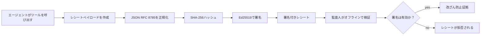
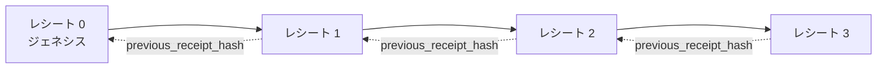

[レッスン動画を見る: 暗号化レシートによるAIエージェントのセキュリティ](https://youtu.be/PLACEHOLDER_VIDEO_ID)

> _(レッスン動画とサムネイルはマイクロソフトのコンテンツチームがマージ後に追加し、レッスン14/15のパターンに合わせます。)_

# 暗号化レシートによるAIエージェントのセキュリティ

## はじめに

このレッスンでは以下を扱います：

- 監査証跡がコンプライアンス、デバッグ、信頼においてAIエージェントにとって重要な理由
- 暗号化レシートとは何か、署名されていないログ行とどう違うか
- プレーンPythonでエージェントのツール呼び出しに対する署名付きレシートを生成する方法
- オフラインでレシートを検証し、改ざんを検出する方法
- レシートを連鎖させ、一つを削除または並べ替えると連鎖が破綻する仕組み
- レシートが証明することと明示的に証明しないこと

## 学習目標

このレッスンを終えた後、以下ができるようになります：

- エージェントの行動に対して暗号的な出所証明が必要となる失敗モードを特定する
- 正準JSONペイロードに対するEd25519署名付きレシートを生成する
- 署名者の公開鍵のみを用いて独立してレシートを検証する
- 変更されたレシートに対して検証を再実行し改ざんを検出する
- レシートのハッシュ連鎖シーケンスを構築し、なぜ連鎖が重要か説明する
- レシートが証明するもの（帰属、整合性、順序）と証明しないもの（行動の正当性、ポリシーの健全性）の境界を認識する

## 問題点：あなたのエージェントの監査証跡

Contoso Travel向けにAIエージェントを展開したと想像してください。エージェントは顧客からのリクエストを読み、フライトAPIを呼び出して選択肢を調べ、顧客の代わりに座席を予約します。前四半期にエージェントは50,000件の予約を処理しました。

今日、監査人が到着し、簡単な質問をします。「あなたのエージェントが何をしたか見せてください。」

ログファイルを渡します。監査人はそれを見てもっと難しい質問をします。「これらのログが編集されていないとどうやってわかりますか？」

これが監査証跡の問題です。現在の多くのエージェント展開は以下に依存しています：

- <strong>アプリケーションログ</strong>：エージェント自身が書き込み、ファイルシステムのアクセス権を持つ誰でも編集可能。
- <strong>クラウドのログサービス</strong>：プラットフォームレベルで改ざん検知可能だが、監査人がプラットフォーム運営者を信頼する必要がある。
- <strong>データベースのトランザクションログ</strong>：データベース変更には向いているが、任意のツール呼び出しには適さない。

これらは誰かを信頼することなく監査人の疑問に応えることはできません（あなた、自分のクラウドプロバイダー、データベースベンダーなど）。内部利用ならば多くの場合それで良いですが、規制対象（金融、医療、EU AI法の対象など）ではそうはいきません。

暗号化レシートはエージェントの各行動を独立して検証可能にすることでこの問題を解決します。監査人はあなたを信頼する必要はありません。公開鍵とレシートだけで十分です。

## 暗号化レシートとは？

レシートはエージェントが何をしたかを記録したJSONオブジェクトで、デジタル署名されています。


  
最小限のレシートは以下のようになります：

```json
{
  "type": "agent.tool_call.v1",
  "agent_id": "contoso-travel-bot",
  "tool_name": "lookup_flights",
  "tool_args_hash": "sha256:a3f9c1...",
  "result_hash": "sha256:7b2e1d...",
  "policy_id": "contoso-travel-policy-v3",
  "timestamp": "2026-04-25T14:30:00Z",
  "sequence": 47,
  "previous_receipt_hash": "sha256:9d4e6a...",
  "signature": {
    "alg": "EdDSA",
    "sig": "c5af83...",
    "public_key": "8f3b2c..."
  }
}
```
  
以下の三つのプロパティが機能しています：

1. <strong>署名</strong>。エージェントのゲートウェイがEd25519秘密鍵でレシートに署名します。対応する公開鍵を持つ者は誰でもオフラインで署名を検証可能。どのフィールドを変更しても署名は無効になります。

2. <strong>正準化エンコーディング</strong>。署名前にJSON正準化スキーム（JCS、RFC 8785）を用いてシリアライズします。これにより、同じ意味のレシートを生成する複数の実装がバイト単位で完全に一致する出力を得られます。正準化をしないと、異なるJSONシリアライザでは同じ内容でも異なる署名が生成されます。

3. <strong>ハッシュ連鎖</strong>。`previous_receipt_hash`フィールドが各レシートを先行するものにリンクします。レシートの削除や並べ替えはその後のすべてのレシートを破綻させます。個別の署名を回避されても連鎖レベルで改ざんが明らかになります。

これらの性質により三つの保証がなされます：

- <strong>帰属</strong>：この鍵がこの内容に署名したこと  
- <strong>整合性</strong>：内容は署名されてから変更されていないこと  
- <strong>順序</strong>：このレシートは連鎖上であのレシートの後に発行されたこと  

## Pythonでレシートを生成する

レシートを生成するのに特殊なライブラリは不要です。暗号プリミティブは広く利用可能で、ロジックは数十行のPythonです。

`code_samples/18-signed-receipts.ipynb`のハンズオン演習でフルフローを歩きます。ここに要約版を示します：

```python
import json
import hashlib
import base64
from nacl import signing
from jcs import canonicalize  # RFC 8785 標準形式のJSON

def b64url_nopad(data: bytes) -> str:
    return base64.urlsafe_b64encode(data).decode("ascii").rstrip("=")

def sha256_canonical(obj) -> str:
    """SHA-256 of a Python object's JCS-canonical JSON form."""
    return f"sha256:{hashlib.sha256(canonicalize(obj)).hexdigest()}"

# 署名鍵を生成または読み込む（本番環境ではキーボルトに保存）
signing_key = signing.SigningKey.generate()
verify_key = signing_key.verify_key

# レシートのペイロードを構築する（まだ署名なし）
tool_args = {"origin": "SYD", "destination": "LAX"}
tool_result = [{"flight": "QF11", "price": 1850, "stops": 0}]

payload = {
    "type": "agent.tool_call.v1",
    "agent_id": "contoso-travel-bot",
    "tool_name": "lookup_flights",
    "tool_args_hash": sha256_canonical(tool_args),
    "result_hash": sha256_canonical(tool_result),
    "policy_id": "contoso-travel-policy-v3",
    "timestamp": "2026-04-25T14:30:00Z",
    "sequence": 0,
    "previous_receipt_hash": None,
}

# 正規化してハッシュ化し、署名する。
canonical_bytes = canonicalize(payload)
message_hash = hashlib.sha256(canonical_bytes).digest()
signature_bytes = signing_key.sign(message_hash).signature

# 構造化された署名オブジェクトを添付する。
receipt = {
    **payload,
    "signature": {
        "alg": "EdDSA",
        "sig": b64url_nopad(signature_bytes),
        "public_key": b64url_nopad(bytes(verify_key)),
    },
}
```
  
これが署名のパイプライン全体です。ノートブックの演習で各ステップを詳細に扱います。

## レシートの検証と改ざん検出

検証は逆の操作です：

```python
import base64
import hashlib
from nacl import signing
from nacl.exceptions import BadSignatureError
from jcs import canonicalize

def b64url_decode(s: str) -> bytes:
    padding = "=" * ((4 - len(s) % 4) % 4)
    return base64.urlsafe_b64decode(s + padding)

def verify_receipt(receipt: dict) -> bool:
    # 署名は構造化されたオブジェクトです：{"alg", "sig", "public_key"}。
    sig_obj = receipt.get("signature")
    if not sig_obj or sig_obj.get("alg") != "EdDSA":
        return False

    # 実際に署名されたペイロード（署名以外のすべて）を再構成します。
    payload = {k: v for k, v in receipt.items() if k != "signature"}

    canonical_bytes = canonicalize(payload)
    message_hash = hashlib.sha256(canonical_bytes).digest()

    try:
        verify_key = signing.VerifyKey(b64url_decode(sig_obj["public_key"]))
        verify_key.verify(message_hash, b64url_decode(sig_obj["sig"]))
        return True
    except BadSignatureError:
        return False
```
  
この関数はレシートを受け取り、署名が有効なら`True`、そうでなければ`False`を返します。ネットワークコールなし、サービス依存なし、第三者への信頼不要です。

改ざん検出の実例はノートブックで紹介されます：

1. 有効なレシートを生成して検証が通ることを確かめる  
2. `tool_args_hash`フィールドの1バイトを変更する  
3. 検証を再実行して失敗することを確認する  

これにより、どんなに些細な変更も署名を崩すため改ざんが可視化されることが分かります。

## マルチステップエージェントのレシート連鎖

1つの署名されたレシートは一つの行動を守ります。レシートの連鎖は一連の行動を守ります。


  
各レシートは前のレシートのハッシュを記録します。例えばレシート2を密かに削除するには：

- レシート3の`previous_receipt_hash`を変更する（レシート3の署名は無効になる）か、
- 変更されたレシート3に新たな署名を偽造する（エージェントの秘密鍵が必要）  

秘密鍵がハードウェアキーボルトに格納されており、各レシートに公開鍵が添付されている場合、どちらの攻撃も検知なしには実行不可能です。

ノートブックでは以下を扱います：

1. 三つのレシートで連鎖を作る  
2. 各レシートの`previous_receipt_hash`が実際の前のレシートのハッシュと一致することを検証する  
3. 真ん中のレシートを改ざんし、その箇所で連鎖が破綻することを確認する  

これにより外部監査人があなたを信頼せずとも検証可能な監査証跡が実現します。

## レシートが証明するもの（と証明しないもの）

このレッスンで最も重要なセクションです。レシートは強力ですが、その力には限界があります。

**レシートは三つのことを証明します：**

1. <strong>帰属</strong>：特定の鍵が特定のペイロードに署名した  
2. <strong>整合性</strong>：ペイロードは署名以来変更されていない  
3. <strong>順序</strong>：このレシートは連鎖上であのレシートの後にある  

**レシートは証明しません：**

1. <strong>正しさ</strong>：エージェントの行動が正しいと。誤った回答に対してもきれいに署名可能です。  
2. <strong>ポリシー遵守</strong>：`policy_id`に記されたポリシーが本当に評価された、あるいはチェックされたなら許可するポリシーだったこと。レシートは主張を記録するだけで、実行を保証しません。  
3. <strong>鍵以上の身元確認</strong>：レシートは「この鍵がこの内容に署名した」と言うだけで、「この人間がこれを承認した」とは言いません。鍵と人物・組織の紐付けには別途アイデンティティ基盤（ディレクトリや公開鍵レジストリなど）が必要です。  
4. <strong>入力の真実性</strong>：エージェントが改変されたプロンプトを受けて行動しても、レシートは忠実に行動を記録します。レシートは入力検証の後続であり、代替ではありません。  

この境界は重要で、二つの理由があります：

- レシートが意味を持つ範囲：エージェントの振る舞いを監査可能かつ改ざん検知可能にし、組織間の壁を越えても使えること。  
- 追加で必要な層：入力検証（レッスン6）、ポリシー強制（以下に簡単に言及）、アイデンティティ基盤（本レッスンの範囲外）。  

「レシートがある＝ガバナンスされている」と考えるのは誤りです。レシートは基礎であり、ガバナンスはそこに作るシステムです。

## 本番環境での参考

このレッスンのPythonコードは故意に最小限にしてあり、すべてのコード行を理解可能にしています。実運用では二つの選択肢があります：

1. **暗号プリミティブに直接組み上げる。** 上記の約50行で多くのユースケースに十分。PyNaCl（Ed25519）と`jcs`パッケージ（正準JSON）はよくメンテされ監査もされているライブラリです。

2. **本番用レシートライブラリを使う。** 複数のオープンソースプロジェクトが、同じパターンに追加機能（鍵ローテーション、一括検証、JWKセット配布、ポリシーエンジン連携）を実装しています：
   - 本レッスンのレシートフォーマットはIETFインターネットドラフト（`draft-farley-acta-signed-receipts`）で、現在標準化プロセス中です。  
   - Microsoft Agent Governance ToolkitはCedarベースのポリシー決定とレシートを組み合わせています。リポジトリのチュートリアル33でエンドツーエンド例を参照。  
   - `protect-mcp`（npm）と`@veritasacta/verify`（npm）はNodeベースでレシート署名とオフライン検証を実装し、改ざん検知可能な監査証跡付きのMCPサーバラッピングに使われます。  

独自実装とライブラリ利用の選択は、JWTライブラリを自作するか既存を使うかの違いに似ています。どちらも合理的ですが、ライブラリ利用は時間節約と監査範囲の削減、自作は全プリミティブを理解する教育効果が高いです。このレッスンは後者を教えて基礎を築き、いずれにも対応できるようにします。

## 知識チェック

練習問題に進む前に理解度をテストしましょう。

**1. レシートはエージェントの秘密のEd25519鍵で署名されます。監査人は公開鍵だけを持ちます。監査人はオフラインでレシートを検証できますか？**

<details>
<summary>回答</summary>

はい。Ed25519の検証には公開鍵と署名済みのバイト列だけが必要です。ネットワークコールもサービス依存もありません。これがレシートをエアギャップ、複数組織、低信頼な監査環境に有用にする特性です。
</details>

**2. 攻撃者がレシートの`policy_id`フィールドを変更し、より許容的なポリシー下にあったと主張しました。署名は元のペイロードに対して行われています。検証時に何が起こりますか？**

<details>
<summary>回答</summary>

検証は失敗します。署名は元のペイロードの正準化バイトに基づいて計算されているため、どのフィールドを変えても正準化バイトが変わり、SHA-256ハッシュが異なり、署名が無効になります。攻撃者は新しい有効な署名を作るには秘密鍵が必要ですが持っていません。
</details>

**3. なぜレシートは生の引数や結果ではなく`tool_args_hash`と`result_hash`を含むのですか？**

<details>
<summary>回答</summary>

二つの理由があります。第一に、レシートはアーカイブや転送先環境で個人情報や業務データ漏洩が問題になることがあり、ハッシュ化によりレシート自体は小さく内容は秘匿されます。監査人は別の場所に保存された実際の内容とハッシュを照合します。第二に、ハッシュは固定長なので、入力・出力のサイズに関係なくレシートのサイズは制限されます。
</details>

**4. `previous_receipt_hash`フィールドは各レシートを前のものに繋げます。攻撃者が連鎖の途中の一つのレシートを密かに削除すると、何が無効になりますか？**

<details>
<summary>回答</summary>

削除したレシート以降のすべてのレシートです。これらの`previous_receipt_hash`は実際の連鎖と一致しなくなります（参照先のレシートがなくなるか異なるものになるため）。削除を隠すには、攻撃者は後のすべてのレシートを再署名する必要があり、それには秘密鍵が必要です。
</details>

**5. レシートの検証がきれいに通りました。それはエージェントの行動が正しく、健全で、ポリシーに準拠していたことの証明になりますか？**

<details>
<summary>回答</summary>

いいえ。有効なレシートは三つを証明します：帰属（この鍵がこの内容に署名した）、整合性（内容は変わっていない）、順序（このレシートはあのレシートの後にある）。行動の正確さや`policy_id`のポリシーが実際に評価されたこと、エージェントがすべてのルールに従ったことは証明しません。レシートはエージェントの振る舞いを監査可能にするが必ずしも正しいとは限りません。これが本レッスンで最も重要な境界です。
</details>

## 演習課題

`code_samples/18-signed-receipts.ipynb`を開き、以下全4セクションを完了してください：

1. **セクション1**：最初のレシートに署名して検証  
2. **セクション2**：レシートを改ざんし、検証失敗を確認  
3. **セクション3**：三連鎖のレシートを構築し、連鎖の整合性を検証  
4. **セクション4**：Microsoft Agent Frameworkで構築されたエージェントにパターンを適用：ツール呼び出しをレシート署名でラップし、独立して検証  

**ストレッチチャレンジ1:**  
レシートスキーマに自分で選んだ追加フィールド（例：トレース用リクエストIDなど）を加え、正準署名ロジックに含めて、検証が通ることを確認してください。署名後にフィールドを変更して検証が失敗することも確認してください。これにより正準エンコードの全バイトが署名にどのように寄与するか理解が深まります。
**ストレッチチャレンジ 2:** 2つのレシートをSHA-256でハッシュし（その正規化バイト列を決定論的な順序で連結）、得られたダイジェストを3つ目のレシートの新しいフィールドとして埋め込み、署名前に追加します。3つのレシートすべてが正しく往復できることを検証してください。これにより、一段階の包含証明を構築したことになります：3つ目のレシートを持つ誰もが、最初の2つが署名時に存在していたことを、それらの内容を明かすことなく証明できます。これは選択的開示レシートが大規模に使用するパターンです（マークルコミットメント、RFC 6962）。

## 結論

暗号学的レシートは、AIエージェントに以下のような監査証跡を提供します：

- <strong>独立して検証可能</strong>：公開鍵を持つ任意の関係者が検証でき、サービスの依存なし。
- <strong>改ざん検知可能</strong>：改変すると署名が無効化される。
- <strong>可搬性</strong>：レシートは小さなJSONファイルであり、どこでもアーカイブ、転送、検証できる。
- <strong>標準準拠</strong>：Ed25519（RFC 8032）、JCS（RFC 8785）、SHA-256という広く使われるプリミティブに基づく。

これらは入力検証、ポリシー施行、またはIDインフラの代替ではありません。そうした層の基礎となるものです。規制対象のワークロード、多組織のワークフロー、あるいは将来の監査者があなたを信頼できない環境でエージェントを展開する際には、監査証跡の誠実性を確保するためにレシートが必要です。

最も重要なポイントは、レシートは「誰が何をいつ言ったか」を証明するものであり、「言われたことが正しいかどうか」を証明するものではないということです。この区別を厳密に持ち続けてください。これは誠実な出所システムと誤解を与えるシステムの違いです。

## 本番環境チェックリスト

このレッスンを終えて、実際の環境でレシート署名済みエージェントを展開する準備ができたら：

- [ ] **署名鍵を開発者のラップトップから移動する。** Azure Key Vault、AWS KMS、またはハードウェアセキュリティモジュールを使用してください。レシートを署名する秘密鍵はソース管理やアプリケーションマシン上の平文で絶対に保持してはいけません。
- [ ] **検証用公開鍵を公開する。** 監査者がオフラインで検証できるようにします。標準的なパターンはJWKセットを既知のURL（RFC 7517）、例：`https://your-org.example.com/.well-known/agent-keys.json`に置くことです。
- [ ] **チェーンを外部にアンカーする。** 最新チェーンヘッドのハッシュを定期的に透明性ログ（Sigstore Rekor、RFC 3161タイムスタンプ認証機関、または別の社内システム）に書き込み、外部の第三者が「このチェーンはこの時点に存在していた」ことを確認できるようにします。
- [ ] **レシートを不変に保存する。** 追加のみ可能なブロブストレージ（Azure Storageの不変性ポリシー付き、AWS S3 Object Lock）を使い、内部者がストレージ層で履歴を書き換えることを防ぎます。
- [ ] **保存期間を決定する。** 多くのコンプライアンス要件が数年単位の保持を求めます。レシートの増加計画を立ててください（1レシートは約500バイト、1日1万コールのエージェントは年間約1.8GBを生成します）。
- [ ] **レシートがカバーしない事項を文書化する。** レシートは帰属、整合性、順序を証明します。実行ドキュメントには、レシート以外にどの追加的な制御（入力検証、ポリシー施行、レート制限、IDインフラ）がガバナンス体制で必要かを明示してください。

### AIエージェントのセキュリティについてもっと質問がありますか？

[Microsoft Foundry Discord](https://aka.ms/ai-agents/discord) に参加して、ほかの学習者と交流し、オフィスアワーに参加し、AIエージェントに関する質問を解決しましょう。

## このレッスンの先へ

本レッスンでは単一レシート署名とハッシュチェーン化された連鎖を扱いました。ガバナンス体制が成熟するにつれて出会う可能性のあるより高度なパターンは以下の通りです：

- **選択的開示。** レシートのフィールドが独立してコミットされている（RFC 6962スタイルのマークルツリー）場合、特定監査者に特定のフィールドだけを開示し、残りは変わっていないことを証明でき、内容は暴露しません。同じレシートで包括的監査（完全性重視）とGDPRのようなデータ最小化（監査者に最小限を見せる）両方を満たす際に便利です。
- **レシートの失効。** 署名鍵が漏洩した場合、以降にその鍵で署名されたすべてのレシートを信頼できないとマークできる仕組みが必要です。標準的なパターンは短命署名鍵と失効リストの公開、または失効エントリ付きの透明性ログです。
- **二者間／分割署名レシート。** 署名ペイロードを事前実行（`authorization_*`）と事後実行（`result_*`）の半分に分割し、それぞれ独立署名する実装もあります。これは承認決定と観察結果が異なるアクターや時点で生成される場合に有用です。本レッスンのレシート形式に加算的に組み合わせ可能です。
- **ペイロード構成。** レシートは`result_hash`に格納したバイト列を封印します。実際のペイロードは単一ツールの結果よりも豊富なことが多く、意思決定前の推論（モデル予測、考慮した選択肢、証拠やその完全性、リスク体制、説明責任チェーン、ゲート結果）も単一レシートで封印できます。レシート形式を小さくしつつ、ペイロードスキーマをドメインごとに進化させることができます。
- **実装間の準拠。** 同一レシート形式の複数独立実装（Python、TypeScript、Rust、Go）が共有のテストベクターで相互検証しています。独自実装を作る場合は公開ベクターと検証し、ワイヤ互換性を確認してください。
- **ポスト量子への移行。** Ed25519は広く使われていますが量子耐性はありません。レシート形式はアルゴリズム柔軟性を備えており、署名の `signature.alg` フィールドに`ML-DSA-65`（NISTのポスト量子署名基準）を指定して移行が可能です。移行期間中はレシートを二重署名にする計画を立てましょう。

## 追加リソース

- <a href="https://datatracker.ietf.org/doc/draft-farley-acta-signed-receipts/" target="_blank">IETF Internet-Draft: 機械間アクセス制御のための署名済み決定レシート</a>
- <a href="https://learn.microsoft.com/azure/ai-studio/responsible-use-of-ai-overview" target="_blank">責任あるAI 概要（Azure AI）</a>
- <a href="https://datatracker.ietf.org/doc/html/rfc8032" target="_blank">RFC 8032：エドワーズ曲線デジタル署名アルゴリズム（EdDSA）</a>
- <a href="https://datatracker.ietf.org/doc/html/rfc8785" target="_blank">RFC 8785：JSON正規化方式（JCS）</a>
- <a href="https://datatracker.ietf.org/doc/html/rfc6962" target="_blank">RFC 6962：証明書透明性</a>（選択的開示レシートが使うマークルツリー構築）
- <a href="https://github.com/microsoft/agent-governance-toolkit/blob/main/docs/tutorials/33-offline-verifiable-receipts.md" target="_blank">Microsoft Agent Governance Toolkit チュートリアル 33: オフライン検証可能な決定レシート</a>
- <a href="https://github.com/ScopeBlind/agent-governance-testvectors" target="_blank">当レッスンのレシート形式用実装間準拠テストベクター（Apache-2.0）</a>
- <a href="https://pynacl.readthedocs.io/" target="_blank">PyNaClドキュメント（PythonのEd25519）</a>

## 前のレッスン

[コンピュータ使用エージェントの構築 (CUA)](../15-browser-use/README.md)

## 次のレッスン

_（カリキュラム管理者によって決定予定）_

---

<!-- CO-OP TRANSLATOR DISCLAIMER START -->
**免責事項**：
本書類は AI 翻訳サービス [Co-op Translator](https://github.com/Azure/co-op-translator) を使用して翻訳されています。正確性を期していますが、自動翻訳には誤りや不正確な部分が含まれる可能性があることをご承知おきください。原文の原語版が正式な情報源とみなされるべきです。重要な情報については、専門の人間による翻訳を推奨します。本翻訳の利用により生じたいかなる誤解や解釈違いについても、当方は責任を負いかねます。
<!-- CO-OP TRANSLATOR DISCLAIMER END -->