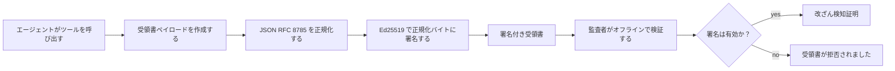
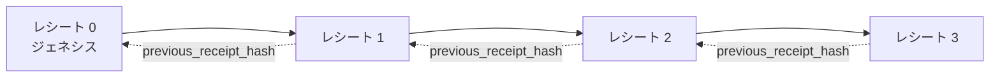

[レッスン動画を視聴する：暗号証明書でAIエージェントを保護する](https://youtu.be/PLACEHOLDER_VIDEO_ID)

> _(レッスン動画とサムネイルは統合後にMicrosoftコンテンツチームが追加します。レッスン14/15のパターンに合わせます。)_

# 暗号証明書でAIエージェントを保護する

## はじめに

このレッスンでは以下を扱います：

- なぜAIエージェントの監査トレイルがコンプライアンス、デバッグ、信頼に重要か。
- 暗号証明書とは何か、署名されていないログ行とどう違うか。
- エージェントのツール呼び出しに対し、プレーンPythonで署名付き証明書を作成する方法。
- オフラインで証明書を検証し、改竄を検出する方法。
- 証明書の連鎖を作り、1つ削除または順序を変えるとチェーンが破綻する仕組み。
- 証明書が証明する内容と明示的に証明しない内容。

## 学習目標

このレッスンを終えると、以下が理解できます：

- エージェントの行動に暗号的由来証明が求められる失敗モードを特定すること。
- Ed25519署名付きの証明書を標準的なJSONペイロードで作成すること。
- 署名者の公開鍵だけで証明書を独立検証すること。
- 改竄があれば、変更した証明書の検証を再実行して検出すること。
- ハッシュ連鎖された証明書列を作り、そのチェーンの意味を説明すること。
- 証明書が証明すること（帰属、完全性、順序）と証明しないこと（アクションの正当性、ポリシーの妥当性）の境界を認識すること。

## 問題：あなたのエージェントの監査トレイル

Contoso TravelのAIエージェントを配備したと想像してください。このエージェントは顧客の要求を読み、フライトAPIを呼び出しながら座席を予約します。前四半期には50,000件の予約を処理しました。

今日、監査人が来て簡単な質問をします：「あなたのエージェントが何をしたか見せてください。」

あなたはログファイルを渡します。監査人はそれを見てより難しい問いをします：「どうやってこれらのログが編集されていないとわかるのですか？」

これが監査トレイル問題です。今日の多くのエージェント配備は以下に依存しています：

- <strong>アプリケーションログ</strong>：エージェント自身が書き込み、ファイルシステムにアクセスできる誰でも編集可能。
- <strong>クラウドロギングサービス</strong>：プラットフォームレベルで改竄検知可能だが、監査人がプラットフォーム運営者を信用しないといけない。
- <strong>データベーストランザクションログ</strong>：データベースの変更には適しているが、任意のツール呼び出しには不向き。

これらはいずれも監査人の質問に答えるのに、監査人が誰か（あなた、クラウドプロバイダー、DBベンダー）を信用しなければならない。内部利用なら許容されがちですが、規制対象のワークロード（金融、ヘルスケア、EU AI法の対象など）では許されません。

暗号証明書は、各エージェント行動を独立して検証可能にすることでこの問題を解決します。監査人はあなたを信用する必要がありません。公開鍵と証明書のみがあればよいのです。

## 暗号証明書とは何か？

証明書は、エージェントがしたことを記録するJSONオブジェクトで、デジタル署名されています。


```mermaid
flowchart LR
    A[エージェントがツールを呼び出す] --> B[受領書ペイロードを作成する]
    B --> C[JSON RFC 8785 を正規化する]
    C --> E[Ed25519 で正規化バイトに署名する]
    E --> F[署名付き受領書]
    F --> G[監査者がオフラインで検証する]
    G --> H{署名は有効か？}
    H -- yes --> I[改ざん検知証明]
    H -- no --> J[受領書が拒否されました]
```

最小限の証明書はこうなります：

```json
{
  "type": "agent.tool_call.v1",
  "agent_id": "contoso-travel-bot",
  "tool_name": "lookup_flights",
  "tool_args_hash": "sha256:a3f9c1...",
  "result_hash": "sha256:7b2e1d...",
  "policy_id": "contoso-travel-policy-v3",
  "timestamp": "2026-04-25T14:30:00Z",
  "sequence": 47,
  "previous_receipt_hash": "sha256:9d4e6a...",
  "signature": {
    "alg": "EdDSA",
    "sig": "c5af83...",
    "public_key": "8f3b2c..."
  }
}
```

ここで重要なのは三つの特性です：

1. <strong>署名</strong>。証明書はエージェントのゲートウェイによってEd25519の秘密鍵で署名されます。対応する公開鍵を持つ者なら誰でも署名をオフラインで検証可能。どのフィールドでも改竄されると署名は無効になります。

2. <strong>正規化エンコーディング</strong>。署名前に、JSON正規化スキーム（JCS、RFC 8785）で証明書が直列化されます。これにより、同じ論理的証明書はどの実装でもバイト単位で同一の出力を生成します。正規化なしでは異なるJSONシリアライザーが同じ内容でも異なる署名を作ります。

3. <strong>ハッシュ連鎖</strong>。`previous_receipt_hash`フィールドが各証明書を前の証明書とリンクします。証明書を削除や順序変更すると、後続のすべての証明書が破損します。個々の署名が回避されても、チェーンレベルで改竄が見えるようになります。

これらの特性が三つの保証を提供します：

- <strong>帰属</strong>：この鍵がこの内容に署名したこと。
- <strong>完全性</strong>：署名後に内容が変更されていないこと。
- <strong>順序</strong>：この証明書はその証明書の後に来たこと。

## Pythonで証明書を作成する

証明書作成に特別なライブラリは不要です。暗号プリミティブは広く利用可能で、ロジックはPythonで数十行です。

`code_samples/18-signed-receipts.ipynb` の実習課題はフルフローを一歩ずつ解説しています。概要版：

```python
import json
import hashlib
import base64
from nacl import signing
from jcs import canonicalize  # RFC 8785 正準 JSON

def b64url_nopad(data: bytes) -> str:
    return base64.urlsafe_b64encode(data).decode("ascii").rstrip("=")

def sha256_canonical(obj) -> str:
    """SHA-256 of a Python object's JCS-canonical JSON form."""
    return f"sha256:{hashlib.sha256(canonicalize(obj)).hexdigest()}"

# 署名キーを生成またはロードする（本番環境ではキーコンテナに保存）
signing_key = signing.SigningKey.generate()
verify_key = signing_key.verify_key

# レシートペイロードを構築する（まだ署名なし）
tool_args = {"origin": "SYD", "destination": "LAX"}
tool_result = [{"flight": "QF11", "price": 1850, "stops": 0}]

payload = {
    "type": "agent.tool_call.v1",
    "agent_id": "contoso-travel-bot",
    "tool_name": "lookup_flights",
    "tool_args_hash": sha256_canonical(tool_args),
    "result_hash": sha256_canonical(tool_result),
    "policy_id": "contoso-travel-policy-v3",
    "timestamp": "2026-04-25T14:30:00Z",
    "sequence": 0,
    "previous_receipt_hash": None,
}

# JCS バイトを直接正準化して署名する。PureEdDSA は内部的にハッシュ化する。
canonical_bytes = canonicalize(payload)
signature_bytes = signing_key.sign(canonical_bytes).signature

# 構造化された署名オブジェクトを添付する。
receipt = {
    **payload,
    "signature": {
        "alg": "EdDSA",
        "sig": b64url_nopad(signature_bytes),
        "public_key": b64url_nopad(bytes(verify_key)),
    },
}
```

これが署名パイプライン全体です。ノートブックの課題は各ステップを解説します。

## 証明書の検証と改竄検出

検証は逆の操作です：

```python
import base64
import hashlib
from nacl import signing
from nacl.exceptions import BadSignatureError
from jcs import canonicalize

def b64url_decode(s: str) -> bytes:
    padding = "=" * ((4 - len(s) % 4) % 4)
    return base64.urlsafe_b64decode(s + padding)

def verify_receipt(receipt: dict) -> bool:
    # 署名は構造化されたオブジェクトです: {"alg", "sig", "public_key"}。
    sig_obj = receipt.get("signature")
    if not sig_obj or sig_obj.get("alg") != "EdDSA":
        return False

    # 実際に署名されたペイロード（署名以外のすべて）を再構築します。
    payload = {k: v for k, v in receipt.items() if k != "signature"}

    canonical_bytes = canonicalize(payload)

    try:
        verify_key = signing.VerifyKey(b64url_decode(sig_obj["public_key"]))
        verify_key.verify(canonical_bytes, b64url_decode(sig_obj["sig"]))
        return True
    except BadSignatureError:
        return False
```

この関数は証明書を受け取り、署名が有効ならTrueを返し、そうでなければFalseを返します。ネットワーク呼び出しもサービス依存も第三者の信用も不要です。

改竄検出のデモのため、ノートブックは以下を解説します：

1. 有効な証明書を作成し、検証が成功することを確認。
2. `tool_args_hash` フィールドの1バイトを変更。
3. 検証を再実行し、失敗する様子を観察。

これが証明書が改竄検知可能である実質的な証明です：どんな小さな変更でも署名が破綻します。

## 複数ステップエージェントのための証明書連鎖

単一署名証明書は一つの行動を保護します。証明書のチェーンは複数行動の連続を保護します。


```mermaid
flowchart LR
    R0[レシート 0<br/>ジェネシス] --> R1[レシート 1]
    R1 --> R2[レシート 2]
    R2 --> R3[レシート 3]
    R1 -. previous_receipt_hash .-> R0
    R2 -. previous_receipt_hash .-> R1
    R3 -. previous_receipt_hash .-> R2
```

各証明書は前の証明書のハッシュを記録します。証明書2を密かに削除するには攻撃者は以下のいずれかを行う必要があります：

- 証明書3の`previous_receipt_hash`フィールドを変更する（証明書3の署名が破綻する）、または
- 修正した証明書3の新しい署名を偽造する（エージェントの秘密鍵が必要）。

秘密鍵がハードウェアキーボルトにあり、公開鍵を各証明書とともに公開していれば、これらの攻撃はいずれも検出なしには不可能です。

ノートブックは以下を解説します：

1. 3つの証明書のチェーンを構築する。
2. 各証明書の`previous_receipt_hash`が前の証明書の実際のハッシュと一致することを検証する。
3. 中間の証明書の一つを改竄し、そこからチェーンが切れる様子を見る。

これが、外部監査人があなたを信用せずに検証できる監査トレイルの作り方です。

## 証明書が証明すること（しないこと）

このセクションはこのレッスンで最も重要です。証明書は強力ですが、その力には限界があります。

**証明書が証明する三つのこと：**

1. <strong>帰属</strong>：特定の鍵が特定のペイロードに署名したこと。
2. <strong>完全性</strong>：署名後にペイロードが変わっていないこと。
3. <strong>順序</strong>：この証明書はチェーンのその証明書の後にあること。

**証明書が証明しないこと：**

1. <strong>正当性</strong>：エージェントの行動が正しいものだったか。誤った回答でも署名できます。
2. <strong>ポリシー準拠</strong>：`policy_id`で参照されたポリシーが実際に評価されたか、チェックしたらこの行動を許可していたとは限らない。証明書は主張を記録するものであり、実行を記録するものではない。
3. <strong>鍵を超える身元</strong>：証明書は「この鍵がこの内容に署名した」と言うのみで、「この人間が承認した」とは言わない。鍵と人や組織を結びつけるには別途身元基盤（ディレクトリや公開鍵レジストリ）が必要。
4. <strong>入力の真実性</strong>：エージェントが操作されたプロンプトを受けて行動すると、その行動は正確に記録される。証明書は入力検証の後流であり、代替ではない。

この境界は二つの理由で重要です：

- 証明書が何に役立つかを示す：エージェントの振る舞いを監査可能かつ改竄検知可能にし、組織をまたがる場合でも役立つ。
- まだ必要な追加レイヤーが何かを示す：入力検証（レッスン6）、ポリシー適用（以下で簡単に説明）、身元基盤（このレッスンの範囲外）。

よくある誤解は「証明書がある＝ガバナンスがある」と考えることですがそうではありません。証明書は基盤です。ガバナンスはその上に作るシステムです。

## 人間の承認した正確な行動の証明

上記3番目は独立した節に値します：行動証明書は「この鍵がこの内容に署名した」と言い、「人間が承認した」とは決して言いません。リスクの高い行動（返金、削除、送金）には、ガバナンスフレームワークがますます正に欠けているその声明を求めています。今回のレッスンで既に構築したプリミティブで生成可能です。

続くノートブック `code_samples/human-authorization-receipts.ipynb` は第二の証明書種別 `human.approval.v1` を追加します。今回のレッスンの証明書と同じエンベロープ形状（型付きペイロードをEd25519でJCS正規化バイト上に署名、`signature`オブジェクトは署名対象バイトの外）です。実行前に名前付き承認者が<strong>全正規化行動とダイジェスト</strong>に署名し、エージェントの行動証明書は<strong>同じ行動ダイジェスト</strong>と承認の`receipt_hash`を指す`parent_approval_ref`を持ちます。以前のチェーンの`previous_receipt_hash`と同じ慣習です。`verify_chain`は<strong>異なるピン留め鍵レジストリ</strong>（承認者鍵とエージェント鍵）で両アーティファクトを検証するため、コード経路は共有しても認可権限は混ざりません。

これにより得られる特性は注意深く記載すると：<em>人間がこの正確な行動を承認し、エージェントもまさにその承認済み行動を実行した</em>ことです。ノートブックの拒否条件がこの特性を単なる主張ではなくリアルなものにします：

- クラシックなセット：改竄、混乱代理、リプレイ、双方の鍵偽造、不正な入力；
- <strong>陳腐化した権限</strong>：署名はまだ検証できても、ポリシーバージョンの移行、承認者鍵のピン留めレジストリからの削除、実行前の承認期限切れにより拒否される場合；
- <strong>ダイジェストすり替え</strong>：異なる正規化行動に結びつく有効署名済行動証明書が真の承認を指す場合。

それぞれの失敗は異なる理由で拒否されるため、監査人は権限の陳腐化か実行行動の変更かを判断できます。ノートブックの教える規則は、署名済み承認は単体で権限を意味しない。実行時に両証明書が同じ正規化行動に拘束されていれば初めて権限が存在する。この人間承認証明書はこのレッスンで定義される教育的合成物であり、`draft-farley-acta-signed-receipts`に定義される証明書型ではありません。

## 本番利用の参考情報

このレッスンのPythonコードは意図的に最小限で、すべての行を読み理解できるようにしています。本番では二つの選択があります：

1. **暗号プリミティブを直接利用する。** 上述の50行は多くの用途で十分です。PyNaCl（Ed25519）と`jcs`パッケージ（正規化JSON）はよく保守され監査済みのライブラリです。

2. **本番用の証明書ライブラリを使う。** 複数のオープンソースプロジェクトは同様のパターンをより多くの機能（鍵ローテーション、一括検証、JWKセット配布、ポリシーエンジン連携）つきで実装しています：
   - 署名パイプラインは独立したIETFインターネットドラフト ([`draft-farley-acta-signed-receipts`](https://datatracker.ietf.org/doc/draft-farley-acta-signed-receipts/)、リビジョン02) のJCSおよび署名スコープ規約を利用します。本レッスンの教育的平坦証明書はドラフトの`{payload, signature}`エンベロープと異なり、準拠実装として提示していません。ドラフトは対応する共通テストスイート ([agent-governance-testvectors](https://github.com/ScopeBlind/agent-governance-testvectors)) を公開し、対応実装ではワイヤフォーマットを標的とします。
   - Microsoft Agent Governance ToolkitはCedarベースのポリシー決定と証明書を合成しています。そのリポジトリのチュートリアル33にはエンドツーエンド例があります。
   - `protect-mcp`(npm) と `@veritasacta/verify`(npm) パッケージはNodeベースの署名とオフライン検証を提供し、不正改ざん監査可能なMCPサーバのラッピングが可能です。停止フローでアクション承認証明を発行し、デスクトップフローでWebAuthn支援を含み、上述の人間承認ノートブックのパターンと同様です。
   - **[nobulex](https://github.com/arian-gogani/nobulex)** Python SDK (`pip install nobulex`) はPythonで同じEd25519 + JCS署名パターンをLangChainとCrewAIとの統合つきで提供し、公開された相互検証テストベクターと[OWASP PR #2210](https://github.com/OWASP/CheatSheetSeries/pull/2210)を通じたコンプライアンスマッピングが含まれます。

自作とライブラリ利用の選択はJWTライブラリを自作するかテスト済みを使うかの選択に似ています。どちらも合理的です。ライブラリは時間を節約し監査面積を減らします。自作はすべてのプリミティブを理解させます。このレッスンはどちらの選択にも足場を提供するため自作ルートを教えます。

## 知識チェック

実習課題に進む前に理解をテストしましょう。

**1. 証明書はエージェントの秘密Ed25519鍵で署名されます。監査人は公開鍵のみを持っています。オフラインで証明書を検証できますか？**

<details>
<summary>回答</summary>

できます。Ed25519検証には公開鍵と署名済みバイトだけが必要です。ネットワーク呼び出しやサービス依存はありません。これが証明書がエアギャップ、多組織、低信頼監査環境で有用となる理由です。
</details>

**2. 攻撃者が証明書の `policy_id` フィールドをより寛容なポリシーを主張するように改変しました。署名は元のペイロードにかかっています。検証時に何が起こりますか？**

<details>
<summary>回答</summary>


検証に失敗します。署名は元のペイロードの正規化されたバイト列に対して計算されています。フィールドのいずれかを変更するとこれらのバイトが変わるため、署名は無効になります。攻撃者が新しい有効な署名を生成するには秘密鍵が必要ですが、攻撃者はそれを持っていません。
</details>

**3. なぜレシートには生の引数や結果ではなく、`tool_args_hash`と`result_hash`が含まれているのですか？**

<details>
<summary>回答</summary>

理由は2つあります。第一に、レシートは個人情報やビジネスデータなどの生の内容が漏洩すると問題となる環境で保存または送信される場合があります。ハッシュ化によりレシートは小さくなり内容は非公開のままにできます。監査者はハッシュが別に保存された実際の内容と一致していることを検証します。第二に、ハッシュは固定サイズであるため、入力や出力がどれほど大きくても、ハッシュ付きのレシートはサイズが制限されます。
</details>

**4. `previous_receipt_hash`フィールドは各レシートを先行レシートにリンクします。攻撃者がチェーンの途中からレシートをひとつこっそり削除した場合、何が無効になりますか？**

<details>
<summary>回答</summary>

削除されたレシート以降のすべてのレシートです。これらの`previous_receipt_hash`フィールドは実際のチェーンと一致しなくなります（参照していたレシートが存在しなくなるか、チェーンが別の先行レシートを指すようになるため）。削除を隠すには、攻撃者は以降のすべてのレシートを再度署名する必要があり、それには秘密鍵が必要です。
</details>

**5. レシートの検証が正常に行われた場合、それはエージェントの行動が正しい、妥当である、またはポリシーに準拠していることを証明しますか？**

<details>
<summary>回答</summary>

いいえ。有効なレシートは次の3点を証明します：帰属（この鍵がこの内容に署名したこと）、完全性（内容が変更されていないこと）、順序（このレシートがあのレシートの後に生成されたこと）。しかし行動が正しい、`policy_id`で指定されたポリシーが実際に評価された、またはエージェントがすべてのルールを遵守したことを証明するものではありません。レシートはエージェントの動作を監査可能にするものであり、必ずしも正しいことを保証するわけではありません。これはこのレッスンで最も重要な境界線です。
</details>

## 練習問題

`code_samples/18-signed-receipts.ipynb` を開き、以下の4つのセクションを完成させてください：

1. **セクション1**: 最初のレシートに署名して検証する。
2. **セクション2**: レシートを改ざんして検証失敗を確認する。
3. **セクション3**: 3つのレシートのチェーンを構築し、チェーンの整合性を検証する。
4. **セクション4**: Microsoft Agent Frameworkで構築されたエージェントにパターンを適用する：ツール呼び出しをレシート署名でラップし、その後にレシートを独立して検証する。

**追加チャレンジ1:** レシートスキーマに任意の追加フィールド（例えば追跡用のリクエストID）を追加し、正規署名ロジックも更新して、そのフィールドを含むようにします。署名後にレシートが検証に通ることを確認し、署名後にフィールドを変更して検証に失敗することを確かめます。これにより正規のエンコードのすべてのバイトが署名にどう影響するか理解が深まります。

**追加チャレンジ2:** 2つのレシートの正規化されたバイト列を決定論的な順序で連結し、それをSHA-256でハッシュし、そのダイジェストを3つ目のレシートの新しいフィールドに埋め込んでから署名します。3つのレシートすべてが検証に通ることを確認します。これによりワンステップの包含証明を構築できます：3つ目のレシートを持つ任意の者は、最初の2つが署名時点で存在したことを内容を明かさずに証明できます。これは選択的開示レシートが大規模に使うパターンです（Merkleコミットメント、RFC 6962）。

## 結論

暗号化されたレシートはAIエージェントに、以下のような監査履歴を提供します：

- <strong>独立して検証可能</strong>：公開鍵を持つ誰でも検証でき、サービスへの依存なし。
- <strong>改ざん検知</strong>：改ざんがあれば署名は無効になる。
- <strong>携帯可能</strong>：レシートは小さなJSONファイルであり、どこでも保管・送信・検証できる。
- <strong>標準準拠</strong>：Ed25519（RFC 8032）、JCS（RFC 8785）、SHA-256といった広く展開されたプリミティブに基づく。

入力検証、ポリシー施行、IDインフラの代わりになるものではありません。これらのレイヤーの土台となるものです。規制された業務や複数組織のワークフロー、将来の監査者に信頼されない可能性がある状況にエージェントを展開するとき、レシートは監査履歴を正直なものにします。

最も重要なポイント：レシートは誰がいつ何を言ったかを証明します。言われたことが真実または正しいことを証明するわけではありません。その区別をしっかり持ってください。それこそが正直な由来システムと誤解を招くものの違いです。

## 本番環境向けチェックリスト

このレッスンを終えてレシート署名エージェントを実環境に展開する準備ができたら：

- [ ] **署名鍵を開発者のラップトップから移動する。** Azure Key Vault、AWS KMS、またはハードウェアセキュリティモジュールを使用してください。レシートの署名に使う秘密鍵はソース管理やアプリケーションマシン上の平文で決して保持してはいけません。
- [ ] **検証用の公開鍵を公開する。** 監査者はオフライン検証に必要とします。標準的なパターンはJWKセットをよく知られたURL（RFC 7517）、例`https://your-org.example.com/.well-known/agent-keys.json`で公開することです。
- [ ] **チェーンを外部にアンカーする。** 定期的に最新のチェーンヘッドハッシュを透明性ログ（Sigstore Rekor、RFC 3161タイムスタンプ認証局、または別の内部システム）に書き込み、外部者が「この時点でこのチェーンが存在した」ことを確認できるようにします。
- [ ] **レシートを不変で保存する。** 追加のみ可能なBlobストレージ（Azure Storageの不変性ポリシー、AWS S3 Object Lock）により、内部者が保存層で履歴を書き換えられないようにします。
- [ ] **保存期間を決定する。** 多くのコンプライアンス規制は数年の保存を求めます。レシートの増加（1レシート約500バイト、1日1万件呼び出しで年間約1.8GB）を見込んで計画してください。
- [ ] **レシートでカバーされないことを文書化する。** レシートは帰属、完全性、順序を証明します。運用ルールにはレシートと並ぶ追加の制御（入力検証、ポリシー施行、レート制限、IDインフラ）が何か、明示的に書くべきです。

### AIエージェントのセキュリティに関する質問はさらにありますか？

[Microsoft Foundry Discord](https://aka.ms/ai-agents/discord) に参加して、他の学習者と交流し、オフィスアワーに参加してAIエージェントの質問を解決しましょう。

## このレッスンを超えて

このレッスンでは単一レシート署名とハッシュチェーンを扱いました。ガバナンス姿勢が成熟するにつれて遭遇するかもしれない、いくつかのより高度なパターンは以下のようにこれらのプリミティブの組み合わせによって構成されます：

- **選択的開示。** レシートのフィールドが独立してコミット（RFC 6962スタイルのMerkle木）されている場合、特定監査者にのみ特定フィールドを公開し、その他は変更されていないことを証明することができます。包括的監査（完全性を求める）と、GDPRのようなデータ最小化規制（監査者が必要最小限だけ見ることを望む）を両立させる際に有効です。
- **レシートの失効。** 署名鍵が漏洩した場合、その鍵で署名された全レシートをある時点以降は信用できないとマークする方法が必要です。標準的パターンは短期間有効な署名鍵と公開失効リスト、または失効を記録する透明性ログです。
- **双方向 / 分割署名レシート。** 一部の実装では署名済みペイロードを実行前（`authorization_*`）と実行後（`result_*`）の二つに分割し、それぞれ独立して署名します。承認判断と結果観察が別の主体や別の時点で行われる場合に有用です。このパターンは本レッスンで教えたレシート形式に加法的に合成されます。
- **ペイロードの構成。** レシートは`result_hash`に入れたバイト列を封印します。実際のペイロードは単一のツール呼び出し結果よりも豊かであることが多いです：事前判断プロセス（モデル予測、検討中の選択肢、証拠とその完全性、リスク姿勢、説明責任の連鎖、ゲート判定結果）をペイロード内に含めて一つのレシートで封印できます。これによりレシート形式は最小限に保ちつつ、ドメインごとにペイロードスキーマを進化させられます。
- **実装間の整合性。** 同じレシート形式の複数の独立実装（Python, TypeScript, Rust, Go）が共有テストベクターに対して相互検証を行っています。独自実装を作る場合は公開ベクターで検証し、ワイヤーの互換性を確認できます。
- **量子耐性への移行。** Ed25519は今日広く使われていますが量子耐性はありません。レシート形式はアルゴリズムに柔軟です：移行時は`signature.alg`フィールドにNISTのポスト量子署名標準である`ML-DSA-65`を持たせられます。レシートの二重署名期間の移行計画を立ててください。

## 追加リソース

- <a href="https://datatracker.ietf.org/doc/draft-farley-acta-signed-receipts/" target="_blank">IETFインターネットドラフト：機械間アクセス制御のための署名付き決定レシート</a>
- <a href="https://learn.microsoft.com/azure/ai-studio/responsible-use-of-ai-overview" target="_blank">責任あるAI概要（Azure AI）</a>
- <a href="https://datatracker.ietf.org/doc/html/rfc8032" target="_blank">RFC 8032: Edwards曲線デジタル署名アルゴリズム（EdDSA）</a>
- <a href="https://datatracker.ietf.org/doc/html/rfc8785" target="_blank">RFC 8785: JSON正規化スキーム（JCS）</a>
- <a href="https://datatracker.ietf.org/doc/html/rfc6962" target="_blank">RFC 6962: 証明書透明性</a>（選択的開示レシートで使われるMerkle木構造）
- <a href="https://github.com/microsoft/agent-governance-toolkit/blob/main/docs/tutorials/33-offline-verifiable-receipts.md" target="_blank">Microsoft Agent Governance Toolkit チュートリアル33：オフライン検証可能な決定レシート</a>
- <a href="https://github.com/ScopeBlind/agent-governance-testvectors" target="_blank">本レッスンで使われるレシート形式の実装間整合性テストベクター（Apache-2.0）</a>
- <a href="https://pynacl.readthedocs.io/" target="_blank">PyNaClドキュメント（PythonのEd25519）</a>

## 前のレッスン

[ローカルAIエージェントの作成](../17-creating-local-ai-agents/README.md)

---

<!-- CO-OP TRANSLATOR DISCLAIMER START -->
**免責事項**：
本書類は AI 翻訳サービス [Co-op Translator](https://github.com/Azure/co-op-translator) を使用して翻訳されています。正確性を期していますが、自動翻訳には誤りや不正確な部分が含まれる可能性があることをご承知おきください。原文の原語版が正式な情報源とみなされるべきです。重要な情報については、専門の人間による翻訳を推奨します。本翻訳の利用により生じたいかなる誤解や解釈違いについても、当方は責任を負いかねます。
<!-- CO-OP TRANSLATOR DISCLAIMER END -->