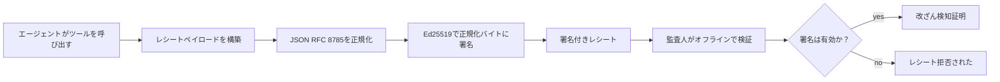
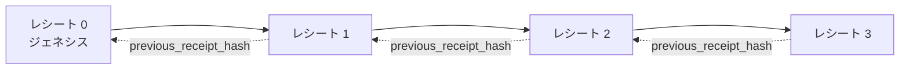

[レッスン動画を視聴する: 暗号学的レシートによるAIエージェントのセキュリティ](https://youtu.be/PLACEHOLDER_VIDEO_ID)

> _(レッスン動画とサムネイルは、マージ後にMicrosoftのコンテンツチームがレッスン14 / 15のパターンに合わせて追加します。)_

# 暗号学的レシートによるAIエージェントのセキュリティ

## はじめに

このレッスンでは以下を扱います：

- コンプライアンス、デバッグ、信頼のためにAIエージェントの監査証跡がなぜ重要か。
- 暗号学的レシートとは何か、署名されていないログ行とどう異なるか。
- エージェントのツール呼び出しに対する署名付きレシートを純粋なPythonでどのように作成するか。
- レシートをオフラインで検証し改ざんを検出する方法。
- レシートをチェーンに繋げて、一つを削除または並び替えるとチェーンが壊れる仕組み。
- レシートが証明すること、そして明確に証明しないこと。

## 学習目標

このレッスンを終えると、以下が理解できます：

- エージェントの行動に対する暗号的な由来証明を動機付ける失敗モードの識別。
- 正準JSONペイロードに対してEd25519で署名されたレシートの生成。
- 署名者の公開鍵だけを使ってレシートを独立に検証する方法。
- 修正されたレシートに対して再検証し改ざんを検出する方法。
- ハッシュチェーンで繋がれたレシートの連鎖を構築し、その重要性を説明する能力。
- レシートが証明すること（帰属、完全性、順序）と証明しないこと（行動の正確さ、ポリシーの妥当性）の境界を認識すること。

## 問題：あなたのエージェントの監査証跡

Contoso TravelのためにAIエージェントを展開したと想像してください。エージェントは顧客のリクエストを読み取り、フライトAPIを呼び出してオプションを調べ、顧客の代理で座席を予約します。前四半期、エージェントは50,000件の予約を処理しました。

今日、監査人が到着します。単純な質問をします：「あなたのエージェントが何をしたか見せてください。」

あなたはログファイルを渡します。監査人はそれを見て、より難しい質問をします：「これらのログが編集されていないとどうやってわかりますか？」

これが監査証跡の問題です。今日の多くのエージェント展開は以下に依存しています：

- <strong>アプリケーションログ</strong>：エージェント自身が書き込み、ファイルシステムアクセス権を持つ誰でも編集可能。
- <strong>クラウドロギングサービス</strong>：プラットフォームレベルで改ざんが明確になるが、監査人がプラットフォーム運営者を信頼する必要がある。
- <strong>データベーストランザクションログ</strong>：データベースの変更には適しているが任意のツール呼び出しには不向き。

いずれも監査人の問いには、監査人が誰か（あなた・クラウドプロバイダー・データベース業者）を信頼しなければ答えられません。内部利用ではその信頼は許容されることが多いですが、規制対象のワークロード（金融、医療、EU AI法適用対象など）では許されません。

暗号学的レシートは、各エージェント行動を独立に検証可能にすることでこれを解決します。監査人はあなたを信頼する必要がなく、公開鍵とレシートのみを必要とします。

## 暗号学的レシートとは？

レシートは、エージェントの行動を記録したJSONオブジェクトで、デジタル署名が付加されています。


```mermaid
flowchart LR
    A[エージェントがツールを呼び出す] --> B[レシートペイロードを構築]
    B --> C[JSON RFC 8785を正規化]
    C --> E[Ed25519で正規化バイトに署名]
    E --> F[署名付きレシート]
    F --> G[監査人がオフラインで検証]
    G --> H{署名は有効か？}
    H -- yes --> I[改ざん検知証明]
    H -- no --> J[レシート拒否された]
```

最小限のレシートはこのような形です：

```json
{
  "type": "agent.tool_call.v1",
  "agent_id": "contoso-travel-bot",
  "tool_name": "lookup_flights",
  "tool_args_hash": "sha256:a3f9c1...",
  "result_hash": "sha256:7b2e1d...",
  "policy_id": "contoso-travel-policy-v3",
  "timestamp": "2026-04-25T14:30:00Z",
  "sequence": 47,
  "previous_receipt_hash": "sha256:9d4e6a...",
  "signature": {
    "alg": "EdDSA",
    "sig": "c5af83...",
    "public_key": "8f3b2c..."
  }
}
```

3つの性質で成り立っています：

1. <strong>署名</strong>。レシートはエージェントのゲートウェイでEd25519の秘密鍵を用いて署名されます。対応する公開鍵を持つ誰でも署名をオフラインで検証可能です。フィールドのいずれかが改ざんされると署名は無効になります。

2. <strong>正準エンコード</strong>。署名前にレシートはJSON Canonicalization Scheme（JCS、RFC 8785）で直列化されます。これにより、同じ論理レシートを生成する2つの実装がバイト単位で同一の出力を出します。正準化しなければ異なるJSONシリアライザで同内容に異なる署名が生じます。

3. <strong>ハッシュ連鎖</strong>。`previous_receipt_hash`フィールドは各レシートを前のレシートとリンクします。レシートを削除または並び替えると、その後のすべてのレシートの連鎖が壊れます。個別の署名を回避してもチェーンレベルで改ざんが明らかになります。

これらの性質は3つの保証を提供します：

- <strong>帰属</strong>：この鍵がこの内容に署名した。
- <strong>完全性</strong>：署名後に内容が変更されていない。
- <strong>順序</strong>：このレシートはチェーン内であのレシートの後に生成された。

## Pythonでレシートを生成する

レシート生成に特別なライブラリは不要です。暗号プリミティブは広く利用可能で、ロジックは数十行のPythonで書けます。

`code_samples/18-signed-receipts.ipynb`のハンズオン演習は全流程を解説しています。概要は以下の通り：

```python
import json
import hashlib
import base64
from nacl import signing
from jcs import canonicalize  # RFC 8785 標準の JSON

def b64url_nopad(data: bytes) -> str:
    return base64.urlsafe_b64encode(data).decode("ascii").rstrip("=")

def sha256_canonical(obj) -> str:
    """SHA-256 of a Python object's JCS-canonical JSON form."""
    return f"sha256:{hashlib.sha256(canonicalize(obj)).hexdigest()}"

# 署名鍵を生成またはロードします（本番環境ではキーボルトに保存してください）
signing_key = signing.SigningKey.generate()
verify_key = signing_key.verify_key

# レシートペイロードを構築します（まだ署名なし）
tool_args = {"origin": "SYD", "destination": "LAX"}
tool_result = [{"flight": "QF11", "price": 1850, "stops": 0}]

payload = {
    "type": "agent.tool_call.v1",
    "agent_id": "contoso-travel-bot",
    "tool_name": "lookup_flights",
    "tool_args_hash": sha256_canonical(tool_args),
    "result_hash": sha256_canonical(tool_result),
    "policy_id": "contoso-travel-policy-v3",
    "timestamp": "2026-04-25T14:30:00Z",
    "sequence": 0,
    "previous_receipt_hash": None,
}

# JCS バイト列を直接標準化して署名します。PureEdDSA は内部的にハッシュ処理を行います。
canonical_bytes = canonicalize(payload)
signature_bytes = signing_key.sign(canonical_bytes).signature

# 構造化された署名オブジェクトを添付します。
receipt = {
    **payload,
    "signature": {
        "alg": "EdDSA",
        "sig": b64url_nopad(signature_bytes),
        "public_key": b64url_nopad(bytes(verify_key)),
    },
}
```

これが署名パイプラインの全体です。ノートブックの演習で各ステップを詳しく解説しています。

## レシートの検証と改ざん検出

検証は逆操作になります：

```python
import base64
import hashlib
from nacl import signing
from nacl.exceptions import BadSignatureError
from jcs import canonicalize

def b64url_decode(s: str) -> bytes:
    padding = "=" * ((4 - len(s) % 4) % 4)
    return base64.urlsafe_b64decode(s + padding)

def verify_receipt(receipt: dict) -> bool:
    # 署名は構造化されたオブジェクトです: {"alg", "sig", "public_key"}。
    sig_obj = receipt.get("signature")
    if not sig_obj or sig_obj.get("alg") != "EdDSA":
        return False

    # 実際に署名されたペイロード（署名を除くすべて）を再構築します。
    payload = {k: v for k, v in receipt.items() if k != "signature"}

    canonical_bytes = canonicalize(payload)

    try:
        verify_key = signing.VerifyKey(b64url_decode(sig_obj["public_key"]))
        verify_key.verify(canonical_bytes, b64url_decode(sig_obj["sig"]))
        return True
    except BadSignatureError:
        return False
```

この関数はレシートを受け取り、署名が有効なら`True`、無効なら`False`を返します。ネットワーク呼び出しやサービス依存、第三者への信頼は不要です。

改ざん検出の実例として、ノートブックは以下を扱います：

1. 正当なレシートを生成し、検証が通ることを確認。
2. `tool_args_hash`フィールドの1バイトを変更。
3. 検証を再実行し、失敗する様子を示す。

これがレシートの改ざん検出能力の実証です。どんな小さな変更でも署名を破壊します。

## 多段階エージェント向けのレシート連鎖

単一の署名レシートは1つの行動を守ります。レシートの連鎖は一連の行動を守ります。


```mermaid
flowchart LR
    R0[レシート 0<br/>ジェネシス] --> R1[レシート 1]
    R1 --> R2[レシート 2]
    R2 --> R3[レシート 3]
    R1 -. previous_receipt_hash .-> R0
    R2 -. previous_receipt_hash .-> R1
    R3 -. previous_receipt_hash .-> R2
```

各レシートは前のレシートのハッシュを記録します。レシート2をこっそり削除するには攻撃者は以下のいずれかを行う必要があります：

- レシート3の`previous_receipt_hash`フィールドを変更（レシート3の署名が壊れる）、または
- 修正済みレシート3に新しい署名を偽造する（エージェントの秘密鍵が必要）。

秘密鍵がハードウェアキー保管庫にあり、公開鍵を各レシートとともに公開するなら、このどちらの攻撃も検出なしで行うことは不可能です。

ノートブックでは以下を解説しています：

1. 3つのレシートの連鎖を作る。
2. 各レシートの`previous_receipt_hash`が前のレシートの実際のハッシュと一致することを検証。
3. 途中のレシートを改ざんし、連鎖がまさにその点で壊れる様子を確認。

こうして外部の監査人があなたを信頼せずに検証可能な監査証跡を作成できます。

## レシートが証明するもの（証明しないもの）

これはこのレッスンで最も重要なセクションです。レシートは強力ですが、その力には限界があります。

**レシートが証明する三つのこと：**

1. <strong>帰属</strong>：特定の鍵が特定のペイロードに署名したこと。
2. <strong>完全性</strong>：署名後にペイロードが変更されていないこと。
3. <strong>順序</strong>：このレシートがハッシュチェーン内であのレシートの後に位置すること。

**レシートが証明しないこと：**

1. <strong>正当性</strong>：エージェントの行動が正しい行動だったこと。レシートは誤った回答に対しても正しい回答に対しても同様に署名可能です。

2. <strong>ポリシーの遵守</strong>: `policy_id`で参照されたポリシーが実際に評価されたか、またはチェックされた場合にこのアクションが許可されたかどうか。レシートは適用されたものではなく、主張された内容を記録する。
3. <strong>キーを超えたアイデンティティ</strong>: レシートは「このキーがこのコンテンツに署名した」と言うだけで、「この人間がこれを承認した」とは言わない。キーと人物や組織を結びつけるには、別のアイデンティティ基盤（ディレクトリ、公的鍵レジストリなど）が必要。
4. <strong>入力の真実性</strong>: エージェントが操作されたプロンプトを受け取りそれに基づいて動作した場合でも、レシートはその動作を忠実に記録する。レシートは入力検証の後流にあり、その代わりにはならない。

この境界が重要な理由は2つあります：

- レシートが何に役立つかを示す：エージェントの動作を監査可能かつ改ざん検知可能にし、組織間をまたいでも保証できる。
- まだ必要な追加レイヤーを示す：入力検証（レッスン6）、ポリシーの執行（以下で簡単に触れる）、およびアイデンティティ基盤（このレッスンの範囲外）。

よくある誤解として、「レシートがある＝統治されている」と考えることがあるが、それは違う。レシートは基盤であり、統治はその上に構築するシステムである。

## 人間が正確なアクションを承認した証明

上記の項目3は独立したセクションに値する：アクションレシートは「このキーがこのコンテンツに署名した」と言うだけで「人間がこれを承認した」とは決して言わない。高リスクアクション（返金、削除、送金）に対しては、統治フレームワークはまさにその不足している記述を求めることが増えており、このレッスンで既に構築した基本機構で生成可能である。

続編のノートブック `code_samples/human-authorization-receipts.ipynb` は、同じエンベロープ形状の第二のレシートタイプ `human.approval.v1` を追加する（Ed25519で署名された型付ペイロードで、`signature` オブジェクトは署名対象バイト列の外側にある）。名前付き承認者が <strong>完全な正準アクションとそのダイジェスト</strong> に署名し実行前に署名する。エージェントのアクションレシートは同じアクションダイジェストと `parent_approval_ref` （承認の `receipt_hash`）を持ち、これは上で構築したチェーンの `previous_receipt_hash` の慣例と同じ。1つの `verify_chain` は **別々の固定キーリポジトリ**（承認者キーとエージェントキー）で両方を検証するため、コードパスは共有されるが権限は分かれる。

この性質を慎重に表すと：*人間がこの正確なアクションを承認し、エージェントはまさにその承認済みアクションを実行した*。ノートブックの拒否例はこの性質を単なる主張でなく実体化している：

- 古典的なセット：改ざん、混乱代理、リプレイ、双方の偽造キー、誤った入力；
- <strong>期限切れ権限</strong>: 署名は検証可能でも、ポリシーバージョンの更新や承認者キーの固定リポジトリからの削除、承認が実行前に期限切れとなったために拒否される；
- <strong>ダイジェスト置換</strong>: 有効な署名付きアクションレシートが異なる正準アクションに紐づく <em>本物の</em> 承認を指す場合。

それぞれの失敗は異なる理由で拒否し、拒否を読む監査者は権限が期限切れか実行アクションが変わったかを判断できる。ノートブックが教えるルールは：署名済み承認は単体では権限ではない。権限は2つのレシートが実行時に同じ正準アクションに結びつく場合にのみ存在する。人間承認レシートはこのレッスンで定義される教育的な構成物であり、`draft-farley-acta-signed-receipts` による定義済みレシートタイプではない。

## 本番参考資料

このレッスンのPythonコードは意図的に最小限で、すべての行を読み理解できるようにしている。実運用では、次の2つの選択肢がある：

1. **暗号プリミティブに直接構築する。** 上記の50行は多くのケースに十分である。PyNaCl（Ed25519）と `jcs` パッケージ（正準JSON）はメンテナンスされ監査済みのライブラリ。

2. **本番用レシートライブラリを使う。** 複数のオープンソースプロジェクトが同じパターンを追加機能付きで実装している（キー回転、バッチ検証、JWKセット配布、ポリシーエンジン統合など）：
   - 署名パイプラインは IETF インターネットドラフトの独立したドキュメント([`draft-farley-acta-signed-receipts`](https://datatracker.ietf.org/doc/draft-farley-acta-signed-receipts/)、リビジョン02)で使われるJCSと署名スコープ規約を利用。このレッスンの教育的な平坦なレシートはドラフトの `{payload, signature}` エンベロープと異なり、準拠実装として提示していない。ドラフトはワイヤ形式を対象とした実装向けに共通適合スイート([agent-governance-testvectors](https://github.com/ScopeBlind/agent-governance-testvectors))を公開している。
   - Microsoft Agent Governance Toolkit は Cedar ベースのポリシー決定にレシートを組み合わせている。同リポジトリのチュートリアル33にエンドツーエンド例がある。
   - `protect-mcp`（npm）と `@veritasacta/verify`（npm）パッケージはNodeベースの署名・オフライン検証を提供し、任意のMCPサーバーを改ざん検知監査トレイルでラップ可能。中断されたアクションが承認レシートをアクションダイジェストに結びつけて発行する共署保持機能も含む（デスクトップフローでWebAuthn対応）。これは上記の人間承認ノートブックの承認レシートパターンと同様。
   - **[nobulex](https://github.com/arian-gogani/nobulex)** Python SDK（`pip install nobulex`）はPythonで同じEd25519 + JCS署名パターンを LangChain と CrewAI 統合を含め提供し、公開された交差検証テストベクターや[OWASP PR #2210](https://github.com/OWASP/CheatSheetSeries/pull/2210)経由のコンプライアンスマッピングも提供する。

自作かライブラリ利用かの選択は、JWTライブラリを自作するか検証済みのものを使うかの選択に似ている：どちらも合理的。ライブラリは時間節約と監査面減少、自作はプリミティブ全ての理解を促す。このレッスンは基礎として自作ルートを教える。

## 知識チェック

練習問題に進む前に理解度をテストしよう。

**1. レシートはエージェントの秘密Ed25519キーで署名される。監査者は公開キーのみ持つ。監査者はオフラインでレシートを検証できるか？**

<details>
<summary>答え</summary>

できる。Ed25519検証は公開キーと署名対象バイトだけ必要で、ネットワークコールやサービス依存はない。これがレシートがエアギャップや複数組織、低信頼の監査環境で役立つ理由である。
</details>

**2. 攻撃者がレシートの `policy_id` フィールドを改ざんし、より寛容なポリシーが適用されたと主張した。署名は元のペイロードに対してなされていた。検証時はどうなるか？**

<details>
<summary>答え</summary>


検証に失敗しました。署名は元のペイロードの正準バイトに対して計算されているため、どのフィールドでも変更するとそのバイトが変わり、署名は無効になります。攻撃者が新たに有効な署名を作成するには秘密鍵が必要ですが、持っていません。
</details>

**3. なぜレシートには生の引数と結果ではなく、`tool_args_hash` と `result_hash` が含まれているのですか？**

<details>
<summary>回答</summary>

理由は2つあります。まず、レシートは生の内容（PII、業務データ）が漏れることが問題となる環境でアーカイブや送信が必要な場合があります。ハッシュ化によりレシートのサイズが小さくなり内容が非公開となり、監査者は別途保管された実際の内容とハッシュが一致することを検証できます。次に、ハッシュは固定サイズなので、入力と出力がどれだけ大きくても、ハッシュ付きレシートのサイズは一定に制限されます。
</details>

**4. `previous_receipt_hash` フィールドは各レシートを前のものにリンクします。攻撃者がチェーンの途中のレシートをひそかに削除した場合、何が無効になりますか？**

<details>
<summary>回答</summary>

削除されたレシート以降のすべてのレシートです。これらの `previous_receipt_hash` フィールドは実際のチェーンと一致しなくなります（参照されていたレシートが存在しないか、チェーンが異なる前任者を指すようになるため）。削除を隠すためには、攻撃者はすべての後続レシートに再署名する必要があり、これには秘密鍵が必要です。
</details>

**5. レシートの検証が正常に行われました。これはエージェントの動作が正しい、妥当で、方針に準拠している証明になりますか？**

<details>
<summary>回答</summary>

いいえ。有効なレシートは3つのことを証明します：帰属（この鍵がこの内容に署名した）、完全性（内容は変更されていない）、順序（このレシートはあのレシートの後にある）。行動が正しいこと、`policy_id` に記載のポリシーが実際に評価されたこと、エージェントがすべての規則を遵守したことを証明するものではありません。レシートはエージェントの振る舞いを監査可能にするものの、必ずしも正しいことを示すわけではありません。これが本レッスンで最も重要な境界です。
</details>

## 練習問題

`code_samples/18-signed-receipts.ipynb` を開き、以下4つのセクションを完了してください：

1. **セクション1**: 最初のレシートに署名して検証する。
2. **セクション2**: レシートを改ざんし、検証が失敗することを確認する。
3. **セクション3**: 3つのレシートチェーンを作りチェーンの完全性を検証する。
4. **セクション4**: Microsoft Agent Frameworkで構築したエージェントにパターンを適用：ツール呼び出しをレシート署名でラップし、レシートを独立して検証する。

**ストレッチチャレンジ1:** レシートスキーマに独自のフィールド（例えばトレース用リクエストID）を追加し、正準署名ロジックに含めて検証成功を確認、署名後にフィールドを変更して検証失敗を確認してください。これにより正準エンコードのすべてのバイトが署名にいかに関与するか理解できます。

**ストレッチチャレンジ2:** 2つのレシートのSHA-256ハッシュ（それらの正準バイトを確定順序で連結）を計算し、そのダイジェストを第三のレシートに新規フィールドとして埋め込み署名します。3つのレシートすべてが検証を通過することを確認します。これにより、第三のレシートを持つ者は最初の2つが署名時に存在していたことを内容を公開せずに証明できます。これは選択的開示レシートがスケールで使うパターン（Merkleコミットメント、RFC 6962）です。

## 総括

暗号化レシートはAIエージェントに以下の監査証跡を提供します：

- <strong>独立検証可能</strong>: 公開鍵を持つ任意の関係者が検証可能で、サービス依存がない。
- <strong>改ざん検知</strong>: 何らかの変更が署名を無効にする。
- <strong>移植性</strong>: レシートは小さなJSONファイルで、どこでもアーカイブ、送信、検証可能。
- <strong>標準準拠</strong>: Ed25519（RFC 8032）、JCS（RFC 8785）、SHA-256といった広く使われるプリミティブで構築。

これらは入力検証、ポリシー執行、IDインフラストラクチャの代替ではなく、それらの基礎となるものです。エージェントを規制されたワークロード、多組織のワークフロー、または将来の監査者に信頼されない環境で展開する際、レシートが監査証跡の正直さを確保します。

最も重要なのは、レシートは誰がいつ何を言ったかを証明する点です。言われたことが真実または正しいことを証明するわけではありません。その違いを厳密に認識してください。それが正直な出自システムと誤解を招くものの差です。

## 本番導入チェックリスト

このレッスンを修了し、実環境でレシート署名済みエージェントを展開するときには：

- [ ] **署名鍵を開発者のラップトップから移動する。** Azure Key Vault、AWS KMS、またはハードウェアセキュリティモジュールを使用。レシートのプライベート鍵はソース管理やアプリケーションマシンに平文で置いてはならない。
- [ ] **検証の公開鍵を発行する。** 監査者はオフラインで検証するために必要。標準的なパターンはJWKセットで既知のURLに置くこと（RFC 7517）、例：`https://your-org.example.com/.well-known/agent-keys.json`。
- [ ] **チェーンを外部にアンカーする。** 最新のチェーンヘッドハッシュを定期的に透明性ログ（Sigstore Rekor、RFC 3161 タイムスタンプ機関、または別の内部システム）に書き込み、外部関係者が「このチェーンはこの時点で存在していた」ことを確認可能にする。
- [ ] **レシートは不変に保存する。** 追記のみのBlobストレージ（Azure Storageの不変性ポリシー、AWS S3オブジェクトロック）を使い、内部関係者がストレージ層で履歴を書き換えられないようにする。
- [ ] **保持期間を決める。** 多くのコンプライアンスで数年単位の保存が必要。レシートの増加（1レシート約500バイト、1日1万回呼び出しで年間約1.8GB）を見込む。
- [ ] **レシートがカバーしない範囲を文書化する。** レシートは帰属、完全性、順序を証明する。運用手順書には、追加の制御（入力検証、ポリシー執行、レート制限、IDインフラなど）がレシートとともにガバナンス体制の一部であることを明示する。

### AIエージェントのセキュリティに関する疑問がもっとある？

[Microsoft Foundry Discord](https://aka.ms/ai-agents/discord) に参加して、他の学習者と交流したり、オフィスアワーに参加してAIエージェントの質問に答えてもらいましょう。

## このレッスンの先へ

本レッスンでは単一レシート署名とハッシュ連結シーケンスを扱いました。ガバナンス体制が成熟すると遭遇するかもしれないさらに高度なパターンは以下の通りです：

- <strong>選択的開示</strong>: レシートのフィールドが独立してコミットされている（RFC 6962スタイルのMerkleツリー）場合、特定の監査者に特定のフィールドのみを公開し、他は変更されていないことを証明しつつ、内容を公開しないことができる。同じレシートを包括的な監査（完全性を求める）とGDPRのようなデータ最小化規制（監査者に必要最小限のみ見せる）両方に使う際に有用。
- <strong>レシート失効</strong>: 署名鍵が漏えいした場合、その鍵で署名されたレシートをある時点以降すべて信用できないとマークする方法が必要。標準的なパターンは短命の署名鍵と公開された失効リスト、または失効エントリを含む透明性ログ。
- **二者間／分割署名レシート**: 一部の実装では署名対象ペイロードを実行前(`authorization_*`)と実行後(`result_*`)の独立署名可能な半分に分割し、承認決定と結果が異なる主体や時間で生成される場合に有効。本レッスンの署名フォーマットに加算的に組み合わせ可能。
- <strong>ペイロード構成</strong>: レシートは `result_hash` に入れたバイト列を封印する。本番ペイロードは単一ツール呼び出し結果以上に複雑な場合も多い：事前決定推論（モデル予測、検討中の選択肢、証拠とその完全性、リスク状況、責任連鎖、ゲート結果）すべてがペイロード中にあり、単一レシートで封印可能。これによりレシートフォーマットは最小限に保ちつつ、ドメインごとにペイロードスキーマの進化を可能にする。
- <strong>実装間の整合性</strong>: 同じレシートフォーマットの複数の独立実装（Python、TypeScript、Rust、Go）が共通のテストベクターで相互検証。独自実装を作る場合は公開ベクターで検証し互換性を確認。
- <strong>量子耐性移行</strong>: Ed25519は現在広く使われているが量子耐性はない。レシートフォーマットはアルゴリズムに柔軟：`signature.alg` フィールドで移行が必要な場合 `ML-DSA-65`（NISTのポスト量子署名標準）を指定可能。切り替え期間はレシートの二重署名を計画。

## 追加リソース

- <a href="https://datatracker.ietf.org/doc/draft-farley-acta-signed-receipts/" target="_blank">IETF Internet-Draft: Signed Decision Receipts for Machine-to-Machine Access Control</a>
- <a href="https://learn.microsoft.com/azure/ai-studio/responsible-use-of-ai-overview" target="_blank">Responsible AI overview (Azure AI)</a>
- <a href="https://datatracker.ietf.org/doc/html/rfc8032" target="_blank">RFC 8032: Edwards-Curve Digital Signature Algorithm (EdDSA)</a>
- <a href="https://datatracker.ietf.org/doc/html/rfc8785" target="_blank">RFC 8785: JSON Canonicalization Scheme (JCS)</a>
- <a href="https://datatracker.ietf.org/doc/html/rfc6962" target="_blank">RFC 6962: Certificate Transparency</a> (選択的開示レシートで使われるMerkleツリー構造)
- <a href="https://github.com/microsoft/agent-governance-toolkit/blob/main/docs/tutorials/33-offline-verifiable-receipts.md" target="_blank">Microsoft Agent Governance Toolkit, Tutorial 33: Offline-Verifiable Decision Receipts</a>
- <a href="https://github.com/ScopeBlind/agent-governance-testvectors" target="_blank">本レッスンで使うレシートフォーマットの実装間コンフォーマンステストベクター</a> (Apache-2.0)
- <a href="https://pynacl.readthedocs.io/" target="_blank">PyNaCl ドキュメント (PythonのEd25519実装)</a>

## 前のレッスン

[ローカルAIエージェントの作成](../17-creating-local-ai-agents/README.md)

---

<!-- CO-OP TRANSLATOR DISCLAIMER START -->
**免責事項**：
本書類は AI 翻訳サービス [Co-op Translator](https://github.com/Azure/co-op-translator) を使用して翻訳されています。正確性を期していますが、自動翻訳には誤りや不正確な部分が含まれる可能性があることをご承知おきください。原文の原語版が正式な情報源とみなされるべきです。重要な情報については、専門の人間による翻訳を推奨します。本翻訳の利用により生じたいかなる誤解や解釈違いについても、当方は責任を負いかねます。
<!-- CO-OP TRANSLATOR DISCLAIMER END -->