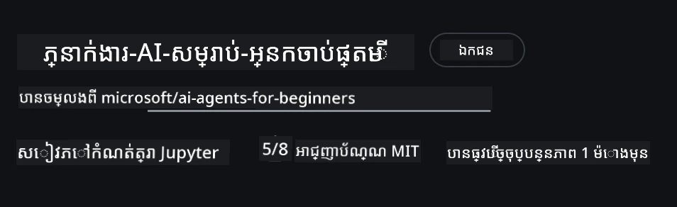
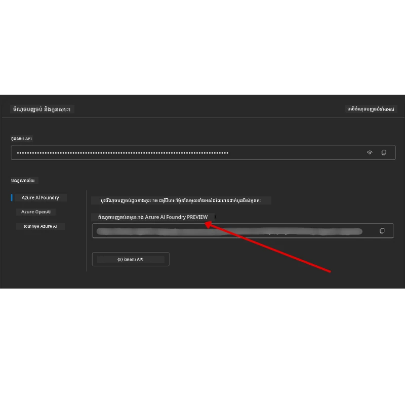

# ការតំឡើងវគ្គសិក្សា

## ការណែនាំ

មេរៀននេះនឹងគ្របដណ្ដប់ពីរបៀបរត់ទន្ទឹមនឹងខ្លួននៃកូដឧទាហរណ៍នៃវគ្គសិក្សានេះ។

## ចូលរួមជាមួយអ្នកសិក្សាផ្សេងទៀត និងទទួលបានជំនួយ

មុននឹងចាប់ផ្តើមបង្កើតក្លូនរបស់អ្នក សូមចូលរួមក្នុង [ឆានែល Discord AI Agents For Beginners](https://aka.ms/ai-agents/discord) ដើម្បីទទួលបានជំនួយណាមួយក្នុងការតំឡើង សំណួរអំពីវគ្គសិក្សា ឬដើម្បីភ្ជាប់ជាមួយអ្នកសិក្សាផ្សេងទៀត។

## ក្លូនឬចម្លង Repo នេះ

ដើម្បីចាប់ផ្តើម សូមក្លូនឬចម្លង GitHub Repository។ នេះនឹងបង្កើតកំណែផ្ទាល់ខ្លួនរបស់អ្នកនៃសម្ភារៈវគ្គសិក្សា ដើម្បីអ្នកអាចរត់ សាកល្បង និងកែប្រែកូដបាន!

អ្នកអាចធ្វើបានដោយចុចលើតំណខាង <a href="https://github.com/microsoft/ai-agents-for-beginners/fork" target="_blank">ចម្លង repo</a>

ឥឡូវនេះអ្នកគួរតែមានកំណែឆ្លៀតផ្ទាល់ខ្លួនរបស់វគ្គសិក្សានេះក្នុងតំណខាងក្រោម៖



### ក្លួនស្រាល (ណែនាំសម្រាប់សិក្ខាសាលា / Codespaces)

  >Repository ពេញលេញអាចធំបាន (~3 GB) ពេលអ្នកទាញយកប្រវត្តិពេញលេញ និងឯកសារទាំងអស់។ ប្រសិនបើអ្នកចូលរួមតែសិក្ខាសាលា ឬត្រូវការបង្ហោះតែថតមេរៀនខ្លះៗ ការក្លូនស្រាល (ឬក៍ sparse clone) ជៀសវាងការទាញយកច្រើនដោយកាត់បន្ថយប្រវត្តិ និង/ឬរំលង blobs។

#### ក្លួនស្រាលរហ័ស — ប្រវត្តិអតិទន់តិច និងឯកសារទាំងអស់

ប្តូរ `<your-username>` នៅក្នុងពាក្យបញ្ជាលេខខាងក្រោមជាមួយ URL ក្លូនរបស់អ្នក (ឬ URL upstream ប្រសិនបើអ្នកចូលចិត្ត)។

ដើម្បីក្លូនតែប្រវត្តិ commit ចុងក្រោយបំផុត (ទាញយកតិច):

```bash|powershell
git clone --depth 1 https://github.com/<your-username>/ai-agents-for-beginners.git
```

ដើម្បីក្លូនសាខាច្បាស់លាស់៖

```bash|powershell
git clone --depth 1 --branch <branch-name> https://github.com/<your-username>/ai-agents-for-beginners.git
```

#### ក្លួនផ្នែក (sparse) — Blobs អតិទន់ និងតែថតដែលបានជ្រើសរើស

នេះប្រើក្លូនផ្នែក និង sparse-checkout (ត្រូវការកម្មវិធី Git 2.25+ និងណែនាំការប្រើ Git សម័យថ្មីដែលគាំទ្រក្លួនផ្នែក)៖

```bash|powershell
git clone --depth 1 --filter=blob:none --sparse https://github.com/<your-username>/ai-agents-for-beginners.git
```

ចូលទៅក្នុងថត repo៖

```bash|powershell
cd ai-agents-for-beginners
```

បន្ទាប់មកបញ្ជាក់ថតដែលអ្នកចង់បាន (ឧទាហរណ៍ខាងក្រោមបង្ហាញពីពីរថត)៖

```bash|powershell
git sparse-checkout set 00-course-setup 01-intro-to-ai-agents
```

បន្ទាប់ពីក្លូន និងបញ្ជាក់ឯកសារ ប្រសិនបើអ្នកត្រូវការតែឯកសារព្រោះចង់ទទួលបានទំហំទំនេរ (គ្មានប្រវត្តិ git) សូមលុបឯកសារ metadata របស់ repository (💀មិនអាចដកហូតវិញបាន — អ្នកនឹងបាត់បង់មុខងារ Git ទាំងអស់៖ គ្មាន commit, pull, push ឬចូលប្រវត្តិ)។

```bash
# zsh/bash
rm -rf .git
```

```powershell
# បារ៉េෂែល
Remove-Item -Recurse -Force .git
```

#### ប្រើ GitHub Codespaces (ណែនាំដើម្បីជៀសវាងការទាញយកធំៗក្នុងម៉ាស៊ីន)

- បង្កើត Codespace ថ្មីសម្រាប់ repo នេះតាមរយៈ [GitHub UI](https://github.com/codespaces) ។  

- ក្នុង terminal នៃ codespace ថ្មីដែលបានបង្កើតរួច រត់ពាក្យបញ្ជាក្លូនស្រាល/ផ្នែកខាងលើដើម្បីយកតែថតមេរៀនដែលអ្នកត្រូវការចូល Codespace workspace។
- ជាជម្រើស៖ ប៉ុន្មានក្រោយពេលក្លូនក្នុង Codespaces សូមដក .git ដើម្បីទទួលបានទំហំបន្ថែម (មើលពាក្យបញ្ជាលុបខាងលើ)។
- សម្គាល់៖ ប្រសិនបើអ្នកចូលចិត្តបើក repo ដាក់ Codespaces តែដោយផ្ទាល់ (គ្មានក្លូនបន្ថែម) មានការប្រុងប្រយ័ត្ន ដោយ Codespaces នឹងកសាងបរិយាកាស devcontainer ហើយប្រហែលជាចំណាយធនមានបន្ថែម។ ការក្លូនស្រាលនៅក្នុង Codespace ថ្មីផ្តល់អំណាចលើការប្រើប្រាស់ថាស។ 

#### បទពិសោធន៍

- ជានិច្ចប្តូរទីតាំង URL ក្លូនជាមួយ fork របស់អ្នក ប្រសិនបើអ្នកចង់កែប្រែ/commit។
- ប្រសិនបើមុននោះអ្នកត្រូវការប្រវត្តិឬឯកសារបន្ថែម អ្នកអាចទាញយកបាន ឬកែប្រែ sparse-checkout ដើម្បីបញ្ចូលថតបន្ថែម។

## រត់កូដ

វគ្គសិក្សានេះផ្តល់អំណោយនូវចំណុច Jupyter Notebooks ដែលអ្នកអាចរត់ដើម្បីទទួលបទពិសោធន៍អនុវត្តក្នុងការសាងសង់ AI Agents។

កូដឧទាហរណ៍ប្រើ **Microsoft Agent Framework (MAF)** ជាមួយ `FoundryChatClient` ដែលភ្ជាប់ទៅកាន់ **Microsoft Foundry Agent Service V2** (Responses API) ដោយរយៈ **Microsoft Foundry**។

ឯកសារ Python notebook ទាំងអស់មានស្លាក `*-python-agent-framework.ipynb`។

## តម្រូវការ

- Python 3.12+
  - **សម្គាល់**៖ ប្រសិនបើអ្នកមិនបានដំឡើង Python3.12 សូមដំឡើងវា។ បន្ទាប់មកបង្កើត venv របស់អ្នកដោយប្រើ python3.12 ដើម្បីធានាថា​ versions ត្រឹមត្រូវត្រូវបានដំឡើងពីរបារម្មណ៍ requirements.txt។
  
    >ឧទាហរណ៍

    បង្កើតថត Python venv៖

    ```bash|powershell
    python -m venv venv
    ```

    បន្ទាប់មកបើកបរិស្ថាន venv សម្រាប់៖

    ```bash
    # zsh/bash
    source venv/bin/activate
    ```
  
    ```dos
    # Command Prompt for Windows
    venv\Scripts\activate
    ```

- .NET 10+: សម្រាប់កូដឧទាហរណ៍ដែលប្រើ .NET សូមផ្ទៀងផ្ទាត់ ដំឡើង [.NET 10 SDK](https://dotnet.microsoft.com/download/dotnet/10.0) ឬក្រោយជាងនេះ។ បន្ទាប់មកពិនិត្យមើលកំណែ .NET SDK ដែលបានដំឡើង៖

    ```bash|powershell
    dotnet --list-sdks
    ```

- **Azure CLI** — តម្រូវសម្រាប់ការផ្ទៀងផ្ទាត់។ ដំឡើងពី [aka.ms/installazurecli](https://aka.ms/installazurecli)។
- **ជាវ Azure** — សម្រាប់ចូលដំណើរការទៅ Microsoft Foundry និង Microsoft Foundry Agent Service។
- **គម្រោង Microsoft Foundry** — គម្រោងដែលមានម៉ូដែលបានផ្សាយ (ឧ. `gpt-4o`)។ មើល [ជំហាន 1](#ជំហាន-1-បង្កើតគម្រោង-microsoft-foundry) ខាងក្រោម។

យើងបានបញ្ចូលឯកសារ `requirements.txt` នៅឫសនៃ repo នេះ ដែលមានកញ្ចប់ Python ដែលត្រូវការទាំងអស់សម្រាប់រត់កូដឧទាហរណ៍។

អ្នកអាចដំឡើងវាបានដោយរត់ពាក្យបញ្ជាតាមខាងក្រោមនៅ terminal របស់អ្នកនៅក្នុងឫស repo៖

```bash|powershell
pip install -r requirements.txt
```

យើងណែនាំឲ្យបង្កើតបរិស្ថានវីរុឆល្យ Python ដើម្បីជៀសវាងការប្រឈមមុខនឹងករណីជ្រុង។

## តំឡើង VSCode

សូមប្រាកដថាអ្នកកំពុងប្រើកំណែ Python ត្រឹមត្រូវនៅក្នុង VSCode។


## តម្លើង Microsoft Foundry និង Microsoft Foundry Agent Service

### ជំហាន 1: បង្កើតគម្រោង Microsoft Foundry

អ្នកត្រូវការមាន **hub** និង **project** ទីMicrosoft Foundry ដែលមានម៉ូដែលបានផ្សាយសម្រាប់រត់ notebooks។

1. ទៅកាន់ [ai.azure.com](https://ai.azure.com) ហើយចុះឈ្មោះជាមួយគណនី Azure របស់អ្នក។
2. បង្កើត **hub** (ឬប្រើមួយដែលមានរួចហើយ)។ មើល៖ [សង្ខេបធនធាន Hub](https://learn.microsoft.com/azure/ai-foundry/concepts/ai-resources)។
3. ក្នុង hub បង្កើត **project** មួយ។
4. ផ្សាយម៉ូដែល (ឧ. `gpt-4o`) ពី **Models + Endpoints** → **Deploy model**។

### ជំហាន 2: យក URL Endpoint គម្រោង និងឈ្មោះម៉ូដែលផ្សាយ

ពីគម្រោងរបស់អ្នកនៅក្នុងក្រឡាហ្នឹង Microsoft Foundry៖

- **Project Endpoint** — ទៅកាន់ទំព័រ **Overview** ហើយចម្លង URL Endpoint។



- **ឈ្មោះម៉ូដែលផ្សាយ** — ទៅ **Models + Endpoints** ជ្រើសម៉ូដែលផ្សាយរបស់អ្នក ហើយចំណាំឈ្មោះ **Deployment** (ឧ. `gpt-4o`)។

### ជំហាន 3: ចុះឈ្មោះក្នុង Azure ជាមួយ `az login`

ឯកសារ notebook ទាំងអស់ប្រើ **`AzureCliCredential`** សម្រាប់ការផ្ទៀងផ្ទាត់ — គ្មានកូនសោ API ត្រូវគ្រប់គ្រង។ អ្នកត្រូវតែចុះឈ្មោះតាមរយៈ Azure CLI។

1. **ដំឡើង Azure CLI** ប្រសិនបើអ្នកមិនបានដំឡើង៖ [aka.ms/installazurecli](https://aka.ms/installazurecli)

2. **ចុះឈ្មោះ** ដោយរត់៖

    ```bash|powershell
    az login
    ```

    ឬប្រសិនបើអ្នកនៅក្នុងបរិយាកាសឆ្ងាយ/Codespace មិនមានកម្មវិធីរុករក៖

    ```bash|powershell
    az login --use-device-code
    ```

3. **ជ្រើសជាវប្រើប្រាស់របស់អ្នក** ប្រសិនបើមានការស្នើ — ជ្រើសវាប្រើប្រាស់គឺមានគម្រោង Foundry របស់អ្នក។

4. **ផ្ទៀងផ្ទាត់** អ្នកបានចុះឈ្មោះហើយ៖

    ```bash|powershell
    az account show
    ```

> **ហេតុអ្វីបានជា `az login`?** ការផ្ទៀងផ្ទាត់ក្នុង notebooks ប្រើ `AzureCliCredential` ពីកញ្ចប់ `azure-identity`។ នេះមានន័យថា សម័យ Azure CLI របស់អ្នកផ្តល់ការផ្ទៀងផ្ទាត់ ដោយគ្មានកូនសោ API ឬសម្ងាត់នៅក្នុងឯកសារ `.env`។ នេះគឺជាអនុសាសន៍សុវត្ថិភាពល្អបំផុត។

### ជំហាន 4: បង្កើតឯកសារ `.env` របស់អ្នក

ចម្លងឯកសារឧទាហរណ៍៖

```bash
# zsh/bash
cp .env.example .env
```

```powershell
# PowerShell
Copy-Item .env.example .env
```

បើក `.env` ហើយបញ្ចូលតម្លៃពីរខាងក្រោម៖

```env
AZURE_AI_PROJECT_ENDPOINT=https://<your-project>.services.ai.azure.com/api/projects/<your-project-id>
AZURE_AI_MODEL_DEPLOYMENT_NAME=gpt-4o
```

| អថេរ | រកឃើញនៅទីណា |
|----------|-----------------|
| `AZURE_AI_PROJECT_ENDPOINT` | ទំព័រ Foundry portal → គម្រោង​របស់​អ្នក → ទំព័រ **Overview** |
| `AZURE_AI_MODEL_DEPLOYMENT_NAME` | Foundry portal → **Models + Endpoints** → ឈ្មោះម៉ូដែលផ្សាយរបស់អ្នក |

នេះគឺគ្រប់គ្រាន់សម្រាប់មេរៀនភាគច្រើន! Notebooks នឹងផ្ទៀងផ្ទាត់ដោយស្វ័យប្រវត្តិតាមរយៈសម័យតភ្ជាប់ `az login` របស់អ្នក។

### ជំហាន 5: ដំឡើងការពឹងផ្អែក Python

```bash|powershell
pip install -r requirements.txt
```

យើងណែនាំឲ្យរត់នេះនៅក្នុងបរិស្ថានវីរុឆល្យដែលបានបង្កើតជាមុន។

## តំឡើងបន្ថែមសម្រាប់មេរៀន 5 (Agentic RAG)

មេរៀន 5 ប្រើ **Azure AI Search** សម្រាប់ការផ្ទុកព័ត៌មាន។ ប្រសិនបើអ្នកមានផែនការរត់មេរៀននោះ សូមបន្ថែមអថេរទាំងនេះទៅឯកសារ `.env` របស់អ្នក៖

| អថេរ | រកឃើញនៅទីណា |
|----------|-----------------|
| `AZURE_SEARCH_SERVICE_ENDPOINT` | ទំព័រ Azure portal → ធនធាន **Azure AI Search** របស់អ្នក → **Overview** → URL |
| `AZURE_SEARCH_API_KEY` | Azure portal → ធនធាន **Azure AI Search** របស់អ្នក → **Settings** → **Keys** → កូនសោគ្រប់គ្រងមួយចម្បង |

## តំឡើងបន្ថែមសម្រាប់មេរៀនដែលហៅ Azure OpenAI តាមផ្លូវ​ផ្ទាល់ (មេរៀន 6 និង 8)

មាន notebooks ក្នុងមេរៀន 6 និង 8 ហៅ **Azure OpenAI** ដោយផ្ទាល់ (ប្រើ **Responses API**) ជំនួសមិនត្រូវប្រើគម្រោង Microsoft Foundry។ ឧទាហរណ៍នេះបានប្រើម៉ូដែល GitHub មុននេះ ដែលបានចោលហើយ (នឹងផុតកំណត់ខែកក្កដា ឆ្នាំ 2026) ហើយមិនគាំទ្រ Responses API ទេ។ ប្រសិនបើអ្នកគ្រោងរត់សំឡេងទាំងនេះ សូមបន្ថែមអថេរទាំងនេះទៅឯកសារ `.env` របស់អ្នក៖

| អថេរ | រកឃើញនៅទីណា |
|----------|-----------------|
| `AZURE_OPENAI_ENDPOINT` | Azure portal → ធនធាន **Azure OpenAI** របស់អ្នក → **Keys and Endpoint** → Endpoint (ឧ. `https://<your-resource>.openai.azure.com`) |
| `AZURE_OPENAI_DEPLOYMENT` | ឈ្មោះម៉ូដែលផ្សាយរបស់អ្នក (ឧ. `gpt-4o-mini`) ដែលគាំទ្រ Responses API |
| `AZURE_OPENAI_API_KEY` | ជាជម្រើស — ប្រើនៅពេលអ្នកប្រើកូនសោជំនួស `az login` / Entra ID |

> Responses API ប្រើ stable `/openai/v1/` endpoint ដូចនេះគ្មានតម្រូវ `api-version` ទេ។ ចុះឈ្មោះជាមួយ `az login` ដើម្បីប្រើការផ្ទៀងផ្ទាត់ Entra ID របៀបគ្មានកូនសោ។

## អ្នកផ្គត់ផ្គង់ជំនួសៈ MiniMax (ផ្គូរផ្គង OpenAI-Compatible)

[MiniMax](https://platform.minimaxi.com/) ផ្តល់ម៉ូដែល context-ធំពីរហូតដល់ 204K តួអក្សរ តាមរយៈ API ដែលផ្គូរផ្គងនឹង OpenAI។ ដោយសារតែ Microsoft Agent Framework `OpenAIChatClient` ដំណើរការជាមួយ endpoint OpenAI-compatible អ្វីណាមួយ អ្នកអាចប្រើ MiniMax ជាជំនួសត្រង់ទៅ Azure OpenAI ឬ OpenAI។

បន្ថែមអថេរទាំងនេះទៅឯកសារ `.env` របស់អ្នក៖

| អថេរ | រកឃើញនៅទីណា |
|----------|-----------------|
| `MINIMAX_API_KEY` | [MiniMax Platform](https://platform.minimaxi.com/) → API Keys |
| `MINIMAX_BASE_URL` | ប្រើ `https://api.minimax.io/v1` (តម្លៃលំនាំដើម) |
| `MINIMAX_MODEL_ID` | ឈ្មោះម៉ូដែលដែលប្រើ (ឧ. `MiniMax-M3`) |

**ឧទាហរណ៍ម៉ូដែល**៖ `MiniMax-M3` (ណែនាំ), `MiniMax-M2.7`, `MiniMax-M2.7-highspeed` (ឆ្លើយតបលឿន)។ ឈ្មោះម៉ូដែលនិងភាពអាចប្រើប្រាស់អាចផ្លាស់ប្តូរតាមពេលវេលា ហើយមូលដ្ឋានប្រើប្រាស់មានលក្ខខណ្ឌលើគណនី ឬតំបន់ — សូមពិនិត្យ [MiniMax Platform](https://platform.minimaxi.com/) សម្រាប់បញ្ជីបច្ចុប្បន្ន។ ប្រសិនបើ `MiniMax-M3` មិនអាចប្រើបានសម្រាប់គណនីអ្នក សូមកំណត់ `MINIMAX_MODEL_ID` ទៅម៉ូដែលដែលអ្នកមានសិទ្ធិប្រើ (ឧ. `MiniMax-M2.7`)។

កូដឧទាហរណ៍ប្រើ `OpenAIChatClient` (ឧទាហរណ៍ មេរៀន 14 ពីដំណើរការកក់សណ្ឋាការ) នឹងរកឃើញនិងប្រើកំណត់រចនាសម្ព័ន្ធ MiniMax របស់អ្នកដោយស្វ័យប្រវត្តិពេល `MINIMAX_API_KEY` ត្រូវបានកំណត់។

## អ្នកផ្គត់ផ្គង់ជំនួស៖ Foundry Local (រត់ម៉ូដែលនៅលើឧបករណ៍)

[Foundry Local](https://foundrylocal.ai) គឺជាកម្មវិធីរត់ម៉ូដែលដែលទាញយក គ្រប់គ្រង និងបម្រើម៉ូដែលភាសា **ទាំងស្រុងនៅលើម៉ាស៊ីនរបស់អ្នក** តាមរយៈ API ដែលផ្គូរផ្គង OpenAI — គ្មាន Cloud, គ្មានជាវ Azure, និងគ្មានកូនសោ API។ វាជាជម្រើសល្អសម្រាប់ការអភិវឌ្ឍដោយអត្រាបញ្ឈប់អនឡាញ​, សាកល្បងដោយមិនចំណាយថ្លៃក្លោដ, ឬរក្សាទិន្នន័យនៅលើឧបករណ៍។

ព្រោះ Microsoft Agent Framework `OpenAIChatClient` ដំណើរការជាមួយ endpoint OpenAI-compatible មួយណា វាមានន័យថា Foundry Local ជាជំនួសមូលដ្ឋានជាលក្ខណៈមួយសម្រាប់ Azure OpenAI។

**1. ដំឡើង Foundry Local**

```bash
# វីនដូว์
winget install Microsoft.FoundryLocal

# ម៉ាគអូអេស
brew install foundrylocal
```

**2. ទាញយក និងរត់ម៉ូដែល** (នេះក៏ដំណើរការកម្មវិធីសេវាកម្មក្នុងមូលដ្ឋានផងដែរ)៖

```bash
foundry model list          # មើលម៉ូដែលដែលមានស្រាប់
foundry model run phi-4-mini
```

**3. ដំឡើង Python SDK** ដែលប្រើស្វែងរក endpoint មូលដ្ឋាន៖

```bash
pip install foundry-local-sdk
```

**4. បញ្ជាក់ Microsoft Agent Framework ទៅម៉ូដែលមូលដ្ឋានរបស់អ្នក៖**

```python
from foundry_local import FoundryLocalManager
from agent_framework.openai import OpenAIChatClient

# ទាញយក (បើចាំបាច់) និងបម្រើម៉ូឌែលនៅលើកុំព្យូទ័របណ្តាញក្នុងស្រុក ហើយបន្ទាប់មកស្វែងរកចំណុចផ្លូវចេញ/ព័រទ៍។
manager = FoundryLocalManager("phi-4-mini")

chat_client = OpenAIChatClient(
    base_url=manager.endpoint,      # ឧទាហរណ៍ http://localhost:<port>/v1
    api_key=manager.api_key,        # តែងតែ "មិនចាំបាច់" សម្រាប់ Foundry Local
    model_id=manager.get_model_info("phi-4-mini").id,
)

agent = chat_client.as_agent(
    name="LocalAgent",
    instructions="You are a helpful assistant running fully on-device.",
)
```

> **សម្គាល់៖** Foundry Local បង្ហាញ OpenAI-compatible **Chat Completions** endpoint។ ប្រើវាសម្រាប់ការអភិវឌ្ឍនៅក្នុងមូលដ្ឋាន និងករណីប្រើក្រៅបណ្តាញ។ សម្រាប់មុខងារ **Responses API** ពេញលេញ (វេនសន្ទនា​មាន​រដ្ឋ, ការចាត់ចែងឧបករណ៍ជ្រាលជ្រៅ, និងការអភិវឌ្ឍលក្ខណៈភ្នាក់ងារ) សូមមើលទៅ **Azure OpenAI** ឬគម្រោង **Microsoft Foundry** ដូចបានបង្ហាញក្នុងមេរៀន។ សូមមើលឯកសារនៃ [Foundry Local](https://foundrylocal.ai) សម្រាប់បញ្ជីម៉ូដែលបច្ចុប្បន្ន និងការគាំទ្រផ្ទាំង។

## តំឡើងបន្ថែមសម្រាប់មេរៀន 8 (ដំណើរការគាំទ្រដោយ Bing Grounding)


សៀវភៅកំណត់ត្រាការងារដើម្បីផ្លាស់ប្តូរនៅក្នុងមេរៀនទី 8 ប្រើ **ការចាក់ដី Bing** តាមរយៈ Microsoft Foundry។ ប្រសិនបើអ្នកមានគម្រោងដំណើរការឧទាហរណ៍នោះ សូមបន្ថែមអថេរនេះទៅក្នុងឯកសារ `.env` របស់អ្នក៖

| អថេរ | កន្លែងស្វែងរក |
|----------|-----------------|
| `BING_CONNECTION_ID` | ទំព័រផ្ទៃ Microsoft Foundry → គម្រោងរបស់អ្នក → **Management** → **Connected resources** → ការតភ្ជាប់ Bing របស់អ្នក → ចំលង ID ការតភ្ជាប់ |

## ការជួយដោះស្រាយបញ្ហា

### កំហុសផ្ទៀងផ្ទាត់លិខិត SSL នៅលើ macOS

ប្រសិនបើអ្នកកំពុងប្រើ macOS និងប្រទៈបញ្ហាជាមួយកំហុសដូចជា:

```plaintext
ssl.SSLCertVerificationError: [SSL: CERTIFICATE_VERIFY_FAILED] certificate verify failed: self-signed certificate in certificate chain
```

នេះគឺជាបញ្ហាដែលបានស្គាល់នៅក្នុង Python លើ macOS ដែលលិខិត SSL របស់ប្រព័ន្ធមិនត្រូវបានទុកចិត្តដោយស្វ័យប្រវត្តិ។ សូមព្យាយាមដោះស្រាយបញ្ហាដូចខាងក្រោមតាមលំដាប់៖

**ជម្រើសទី 1៖ ប្រតិបត្តិការប្រមូលលិខិត SSL របស់ Python (ផ្តល់អនុសាសន៍)**

```bash
# ជំនួយ 3.XX ជាមួយប៊ឺជេន Python ដែលអ្នកបានដំឡើង (ឧ. 3.12 ឬ 3.13):
/Applications/Python\ 3.XX/Install\ Certificates.command
```

**ជម្រើសទី 2៖ ប្រើ `connection_verify=False` ក្នុងសៀវភៅកំណត់ត្រារបស់អ្នក (សម្រាប់សៀវភៅកំណត់ត្រា GitHub Models តែប៉ុណ្ណោះ)**

ក្នុងសៀវភៅកំណត់ត្រាមេរៀន 6 (`06-building-trustworthy-agents/code_samples/06-system-message-framework.ipynb`), ការដោះស្រាយបញ្ហានេះត្រូវបានគេសរសេរជាការកំណត់មួយរួចហើយ។ សូមដោះសោ `connection_verify=False` នៅពេលបង្កើតអតិថិជន៖

```python
client = ChatCompletionsClient(
    endpoint=endpoint,
    credential=AzureKeyCredential(token),
    connection_verify=False,  # បិទការផ្ទៀងផ្ទាត់ SSL ប្រសិនបើអ្នកជួបកំហុសវិញ្ញាបនបត្រ
)
```

> **⚠️ ការព្រមាន៖** ការបិទការផ្ទៀងផ្ទាត់ SSL (`connection_verify=False`) កាត់បន្ថយសុវត្ថិភាពដោយការរំលងការផ្ទៀងផ្ទាត់លិខិត។ សូមប្រើអ្វីនេះតែជា វិធីបណ្ដោះអាសន្ននៅក្នុងបរិយាកាសអភិវឌ្ឍន៍ បើមិនដូច្នេះ សូមកុំប្រើនៅក្នុងផលិតកម្មឡើយ។

**ជម្រើសទី 3៖ ដំឡើង និងប្រើ `truststore`**

```bash
pip install truststore
```

បន្ទាប់មកបន្ថែមអ្វីខាងក្រោមនៅខាងលើសៀវភៅកំណត់ត្រា ឬស្គ្រីបរបស់អ្នក មុនធ្វើការហៅបណ្តាញណាមួយ៖

```python
import truststore
truststore.inject_into_ssl()
```

## ចំណុចណាមួយដែលរុះរើ?

ប្រសិនបើអ្នកមានបញ្ហាណាមួយក្នុងការរត់ការតំឡើងនេះ សូមចូលរួមក្នុង <a href="https://discord.gg/kzRShWzttr" target="_blank">ក្រុម Discord សហគមន៍ Azure AI</a> ឬ <a href="https://github.com/microsoft/ai-agents-for-beginners/issues?WT.mc_id=academic-105485-koreyst" target="_blank">បង្កើតបញ្ហាថ្មី</a>។

## មេរៀនបន្ទាប់

ឥឡូវនេះអ្នកបានរៀបចំរួចរាល់ដើម្បីរត់កូដសម្រាប់វគ្គសិក្សានេះ។ សូមសំណាងល្អក្នុងការសិក្សាបន្ថែមអំពីពិភពលោក AI Agents! 

[ការណែនាំអំពី AI Agents និងករណីប្រើប្រាស់ Agent](../01-intro-to-ai-agents/README.md)

---

<!-- CO-OP TRANSLATOR DISCLAIMER START -->
**ការបដិសេធ**:
ឯកសារនេះត្រូវបានបម្លែងភាសា ដោយប្រើសេវាបម្លែងភាសា AI [Co-op Translator](https://github.com/Azure/co-op-translator)។ ទោះយើងខ្ញុំមានក្តីប្រាថ្នាឱ្យបានច្បាស់លាស់ តែសូមយល់ដឹងថាការបម្លែងដោយស្វ័យប្រវត្តិក៏អាចមានកំហុសឬភាពមិនត្រឹមត្រូវ។ ឯកសារដើមជាភាសាទីតាំងគួរត្រូវបានគេប្រើជាប្រភពច្បាស់លាស់។ សម្រាប់ព័ត៌មានសំខាន់ៗ សូមណែនាំឱ្យប្រើប្រាស់ការប្រែដោយមនុស្សជំនាញ។ យើងខ្ញុំមិនទទួលខុសត្រូវចំពោះការយល់ច្រឡំ ឬការបកស្រាយខុសបន្ទាប់ពីការប្រើប្រាស់ការបម្លែងនេះនោះទេ។
<!-- CO-OP TRANSLATOR DISCLAIMER END -->