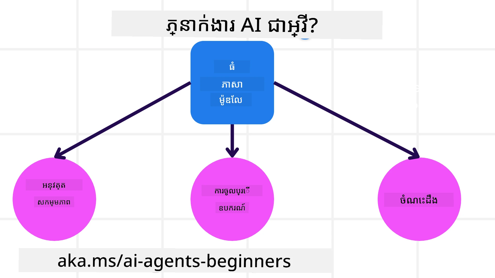
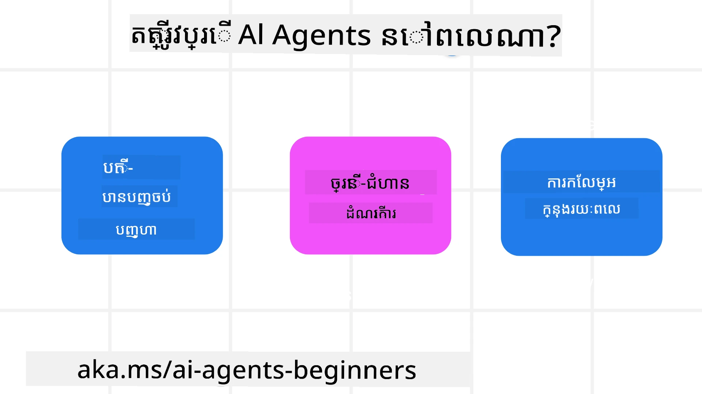

> _(ចុចរូបភាពខាងលើដើម្បីមើលវីដេអូសម្រាប់មេរៀននេះ)_

# ការណែនាំអំពីភ្នាក់ងារសាស្រ្តាចារ AI និងករណីប្រើប្រាស់ភ្នាក់ងារ

សូមស្វាគមន៍មកកាន់វគ្គ **ភ្នាក់ងារសាស្រ្តាចារ AI សម្រាប់អ្នកចាប់ផ្តើម!** វគ្គនេះផ្តល់ជូនអ្នកនូវចំណេះដឹងមូលដ្ឋាន និងកូដដែលអាចប្រើបានពិត ដើម្បីចាប់ផ្តើមសង់ភ្នាក់ងារសាស្រ្តាចារ AI ពីដើម។

មកសួស្តីនៅក្នុង <a href="https://discord.gg/kzRShWzttr" target="_blank">សហគមន៍ Discord Azure AI</a> — ដែលពោរពេញដោយអ្នករៀននិងអ្នកសាងសង់ AI ដែលរីករាយបម្លែងចម្លើយសំណួរ។

មុនពេលយើងចាប់ផ្តើមសង់ភ្នាក់ងារ យើងត្រូវប្រាកដថាយើងយល់ថា ភ្នាក់ងារសាស្រ្តាចារ AI ជាអ្វី និងពេលណាដែលវាសមរម្យប្រើប្រាស់។

---

## ការណែនាំ

មេរៀននេះគ្របដណ្តប់៖

- ភ្នាក់ងារសាស្រ្តាចារ AI ជាអ្វី និងប្រភេទខុសៗគ្នាដែលមាន
- តើភ្នាក់ងារសាស្រ្តាចារ AI សមស្របសម្រាប់ប្រភេទកិច្ចការណាមួយ
- ឯកសារគ្រឹះមូលដ្ឋានដែលអ្នកនឹងប្រើពេលបង្កើតដំណោះស្រាយ Agentic

## គោលបំណងក្នុងការរៀន

នៅចុងបញ្ចប់នៃមេរៀននេះ អ្នកគួរតែអាច:

- ពន្យល់ថាភ្នាក់ងារសាស្រ្តាចារ AI ជាអ្វី ហើយវាផ្សេងពីដំណោះស្រាយ AI សាមញ្ញយ៉ាងដូចម្តេច
- ស្គាល់ពេលណាចាំបាច់ប្រើភ្នាក់ងារសាស្រ្តាចារ AI (និងពេលណាគួរតែមិនប្រើ)
- គូរប្លង់រចនាបទដំណោះស្រាយ Agentic សាមញ្ញសម្រាប់បញ្ហាផ្លូវការពិត

---

## ការកំណត់ភ្នាក់ងារសាស្រ្តាចារ AI និងប្រភេទភ្នាក់ងារសាស្រ្តាចារ AI

### ភ្នាក់ងារអ្វីដែលជាភ្នាក់ងារ AI?

នេះជាវិធីសាមញ្ញក្នុងការគិតពីវា៖

> **ភ្នាក់ងារសាស្រ្តាចារ AI គឺជាប្រព័ន្ធដែលអនុញ្ញាតឱ្យម៉ូដែលភាសាធំ (LLMs) សកម្មភាពពិត — ដោយផ្តល់ឧបករណ៍ និងចំណេះដឹងដើម្បីអនុវត្តលើពិភពលោក មិនត្រឹមតែរេចហើយឆ្លើយតបទៅនឹងការស្នើសុំទេ។**

យើងចាំបាច់បំបែកវាតិច៖

- **ប្រព័ន្ធ** — ភ្នាក់ងារវិជ្ជាសាស្រ្ត AI មិនមែនគ្រាន់តែម្ខាងទេ។ វាជាការប្រមូលផ្ដុំផ្នែកជាច្រើនធ្វើការដោយអនុកោល។ នៅមាត់បូក មនុស្សគ្រប់គ្នាមានបីផ្នែក៖
  - **បរិយាកាស** — ទីកន្លែងដែលភ្នាក់ងារធ្វើការងារ។ សម្រាប់ភ្នាក់ងារការកក់ការធ្វើដំណើរ វានឹងជាវេទិកាកក់ការផ្ទាល់។
  - **ឧបករណ៍កម្សោល** — របៀបដែលភ្នាក់ងារអានស្ថានភាពបច្ចុប្បន្ននៃបរិយាកាសរបស់វា។ ភ្នាក់ងារការធ្វើដំណើរយើងអាចពិនិត្យមើលភាពមានស្រាប់របស់សណ្ឋាគារ ឬតម្លៃយន្តហោះ។
  - **ឧបករណ៍អនុវត្ត** — របៀបដែលភ្នាក់ងារធ្វើសកម្មភាព។ ភ្នាក់ងារធ្វើដំណើរអាចធ្វើការកក់បន្ទប់ ផ្ញើការបញ្ជាក់ ឬលុបបំបាត់ការកក់។

- **ម៉ូដែលភាសាធំ** — ភ្នាក់ងារមានមុន LLMs ប៉ុន្តែ LLMs ជាអ្នកធ្វើឲ្យភ្នាក់ងារពេលបច្ចុប្បន្នមានអំណាចខ្លាំង។ ពួកវាអាចយល់ភាសាធម្មជាតិ សម្រួលអំពីContext ហើយបម្លែងសំណើអ្នកប្រើប្រាស់មិនច្បាស់ជាការគ្រោងផែនការពិត។

- **អនុវត្តសកម្មភាព** — ជាពន្លឺតែមួយ ត្រឹមម៉ូដែលភាសាបង្កើតអត្ថបទ ម្យ៉ាងទៀតក្នុងប្រព័ន្ធភ្នាក់ងារ LLM អាចអនុវត្តជាលំដាប់ក្បាល — ស្វែងរកទិន្នន័យការដាក់អ៊ីមែល ហៅ API ផ្ញើសារជាដើម។

- **ចូលដំណើរការឧបករណ៍** — តើភ្នាក់ងារអាចប្រើឧបករណ៍អ្វីបាននោះអាស្រ័យលើ (1) បរិយាកាសដែលវាចុះបន្តខ្សែ និង (2) អ្វីដែលអ្នកអភិវឌ្ឍជ្រើសរើសផ្តល់។ ភ្នាក់ងារធ្វើដំណើរអាចស្វែងរកយន្តហោះ ប៉ុន្តែមិនអាចកែប្រែថតរបាយការណ៍អតិថិជន — វាអាស្រ័យលើអ្វីដែលអ្នកភ្ជាប់។

- **អនុស្សាវរីយ៍ + ចំណេះដឹង** — ភ្នាក់ងារអាចមានអនុស្សាវរីយ៍រយៈពេលខ្លី (ការសន្ទនាបច្ចុប្បន្ន) និងអនុស្សាវរីយ៍រយៈពេលវែង (មូលដ្ឋានទិន្នន័យអតិថិជន, អំពើនៅមុន)។ ភ្នាក់ងារធ្វើដំណើរអាច "ចាំ" ថាអ្នកចូលចិត្តកៅអីជិតបង្អួច។

---

### ប្រភេទភ្នាក់ងារសាស្រ្តាចារ AI ផ្សេងៗ

មិនមែនភ្នាក់ងារទាំងអស់សង់ដូចគ្នាទេ។ នេះជាការពិភាក្សាអំពីប្រភេទសំខាន់ៗ ដោយវេចខ្ចប់ជាឧទាហរណ៍ភ្នាក់ងារកក់ដំណើរ៖

| **ប្រភេទភ្នាក់ងារ** | **អ្វីដែលវាធ្វើ** | **ឧទាហរណ៍ភ្នាក់ងារធ្វើដំណើរ** |
|---|---|---|
| **ភ្នាក់ងារឆ្លើយតបងាយៗ** | បន្ទាប់បន្សំច្បាប់ដែលបានកំណត់រឹង — គ្មានអនុស្សាវរីយ៍ និងគ្មានការធ្វើផែនការ។ | មើលអ៊ីមែលបណ្តឹង → ផ្ញើទៅសេវាកម្មអតិថិជន។ ប៉ុណ្ណោះ។ |
| **ភ្នាក់ងារឆ្លើយតបផ្អែកលើម៉ូដែល** | រក្សាម៉ូដែលសង្គមខាងក្នុងនៃពិភពលោក និងធ្វើបច្ចុប្បន្នភាពពេលវាមានការផ្លាស់ប្តូរ។ | តាមដានតម្លៃយន្តហោះដែលកើតឡើង និងរាយការណ៍អំពីផ្លូវដែលថ្លៃឡើងយ៉ាងភ្លាម។ |
| **ភ្នាក់ងារដែលផ្អែកលើគោលបំណង** | មានគោលបំណងឆ្ងាយមួយ ហើយស្វែងរកវិធីឆ្ពោះទៅកាន់វាជាដំណាក់កាល។ | កក់ដំណើរពេញលេញ (យន្តហោះ ឡាន សណ្ឋាគារ) ចាប់ផ្តើមពីទីតាំងបច្ចុប្បន្នរបស់អ្នក ដើម្បីទៅកន្លែងគោលដៅរបស់អ្នក។ |
| **ភ្នាក់ងារដែលផ្អែកលើប្រយោជន៍** | មិនត្រឹមតែរកដំណោះស្រាយមួយទេ — ការប្រមូលបញ្ចូលចំណាប់អារម្មណ៍ដល់ដំណោះស្រាយល្អបំផុត។ | តុល្យភាពចំណាយទឹកប្រាក់និងភាពងាយស្រួល ដើម្បីរកដំណើរដែលសមស្របបំផុតសម្រាប់ចំណេញរបស់អ្នក។ |
| **ភ្នាក់ងាររៀន** | រីកចំរូងចំរាសជាមួយពេលវេលា ដោយរៀនពីមតិយោបល់។ | កែលម្អការតំណរអនុម័តការកក់ជាមួយមូលដ្ឋានស្ទង់មតិក្រោយការធ្វើដំណើរ។ |
| **ភ្នាក់ងារឧបាសករណ៍** | ភ្នាក់ងារសម្ពាធខ្ពស់បំបែកកិច្ចការ ទម្រង់កិច្ចការ និងបញ្ជូនទៅភ្នាក់ងារទាបកម្រិត។ | ស្នើសុំ "បោះបង់ដំណើរ" ត្រូវបំបែកជា៖ បោះបង់យន្តហោះ បោះបង់សណ្ឋាគារ បោះបង់ជួលឡាន — រាល់ចំណុចបានគ្រប់គ្រងដោយភ្នាក់ងារជាន់ក្រោម។ |
| **ប្រព័ន្ធភ្នាក់ងារ​ច្រើន(MAS)** | ភ្នាក់ងារឯករាជ្យជាច្រើនធ្វើការរួមគ្នា(មួយគ្នា) ឬប្រកួតគ្នា។ | អនុគ្រោះ: ភ្នាក់ងារផ្សេងៗគ្រប់ទិសសណ្ឋាគារ, យន្តហោះ, និងកម្សាន្ត។ ប្រកួតប្រជែង: ភ្នាក់ងារច្រើនប្រកួតជួសជុលបន្ទប់សណ្ឋាគារនៅតម្លៃល្អបំផុត។ |

---

## ពេលណាដែលត្រូវប្រើភ្នាក់ងារសាស្រ្តាចារ AI

យ៉ាងតិច អ្នកអាចប្រើភ្នាក់ងារសាស្រ្តាចារ AI មិនមានន័យថា អ្នកគួរប្រើវានៅគ្រប់ពេលទេ។ ខាងក្រោមជាស្ថានភាពដែលភ្នាក់ងារផ្តាច់មុខកាន់តែចេញបង្ហាញខ្លាំង៖

- **បញ្ហាដែលគ្មានចប់** — ពេលដែលជំហានដោះស្រាយបញ្ហាមិនអាចកំណត់ជាមុន។ អ្នកត្រូវការឲ្យ LLM រកមើលផ្លូវជាសកម្ម។
- **ដំណើរជាច្រើនជំហាន** — កិច្ចការដែលត្រូវប្រើឧបករណ៍ជាច្រើនជំរៅ ជាងតែស្វែងរកឬបង្កើតតែមួយ។
- **កែលម្អជាមួយពេលវេលា** — ពេលដែលអ្នកចង់ឲ្យប្រព័ន្ធក្លាយទៅឆ្លាតវាងជាងមុន ដោយសារមតិយោបល់អ្នកប្រើ ឬសញ្ញាបរិយាកាស។

យើងនឹងស្វែងយល់ជ្រៅជាងនេះនៅពេលបន្ទាប់ក្នុងមេរៀន **សាងសង់ភ្នាក់ងារសាស្រ្តាចារ AI ដែលគួរឱ្យទុកចិត្ត**។

---

## មូលដ្ឋានដំណោះស្រាយ Agentic

### ការអភិវឌ្ឍភ្នាក់ងារ

អ្វីដែលអ្នកធ្វើជាលើកដំបូង ពេលសង់ភ្នាក់ងារគឺកំណត់ថា *វាអាចធ្វើអ្វីបាន* - ឧបករណ៍ កិច្ចសកម្ម និងអាកប្បកិរិយារបស់វា។

នៅក្នុងវគ្គនេះ យើងប្រើ **Microsoft Foundry Agent Service** ជាវេទិកាមេនឌឺគោល។ វាគាំទ្រ៖

- ម៉ូដែលពីអ្នកផ្តល់ដូចជា OpenAI, Mistral, និង Meta (Llama)
- ទិន្នន័យដែលមានអាជ្ញាបណ្ណពីអ្នកផ្តល់ដូចជា Tripadvisor
- ការបកស្រាយឧបករណ៍ OpenAPI 3.0 ស្តង់ដារ

### លំនាំ Agentic

អ្នកផ្សព្វផ្សាយជាមួយ LLMs តាមរយៈការស្នើសុំ។ ជាមួយភ្នាក់ងារ អ្នកមិនអាចដាក់ខ្ទង់រាល់ស្នើសុំពីដៃបានទេទេ — ភ្នាក់ងារត្រូវអនុវត្តជាច្រើនជំហាន។ នោះជាកន្លែងដែល **លំនាំ Agentic** ចេញមក។ វាជាស្ដ្រាតេជីដែលអាចប្រើជាបន្ទាន់សម្រាប់ការស្នើសុំ និងគ្រប់គ្រង LLMs ដោយមានសមត្ថភាពច្រើន និងទុកចិត្តកាន់តែខ្ពស់។

វគ្គនេះរៀបចំជុំវិញលំនាំ agentic ដែលទូទៅ និងមានប្រយោជន៍បំផុត។

### ខ្នាតដំណោះស្រាយ Agentic

ខ្នាតដំណោះស្រាយ Agentic ផ្តល់ឧបករណ៍ទំរង់រួចរាល់ សម្ភារៈ និងហេដ្ឋារចនាសម្ព័ន្ធដើម្បីបង្កើតភ្នាក់ងារ។ វាធ្វើឲ្យមានភាពងាយស្រួលក្នុងការ៖

- ភ្ជាប់ឧបករណ៍ និងសមត្ថភាព
- ទស្សនានូវអ្វីដែលភ្នាក់ងារធ្វើ (និងសារភាពពេលមានបញ្ហា)
- ប្រយុទ្ធជាមួយភ្នាក់ងារច្រើន

នៅក្នុងវគ្គនេះ យើងផ្តោតលើ **Microsoft Agent Framework (MAF)** សម្រាប់សាងសង់ភ្នាក់ងារដែលមានស្រាប់សម្រាប់ផលិតកម្ម។

---

## ឧទាហរណ៍កូដ

ត្រៀមខ្លួនមើលវាប្រតិបត្តិ​នៅពេលនេះ? នេះជាឧទាហរណ៍កូដសម្រាប់មេរៀននេះ៖

- 🐍 Python: [Agent Framework](./code_samples/01-python-agent-framework.ipynb)
- 🔷 .NET: [Agent Framework](./code_samples/01-dotnet-agent-framework.md)

---

## មានសំណួរទេ?

ចូលរួមនៅក្នុង [Microsoft Foundry Discord](https://discord.com/invite/ATgtXmAS5D) ដើម្បីភ្ជាប់ជាមួយអ្នករៀនផ្សេងទៀត ចូលរួមម៉ោងការិយាល័យ និងទទួលបានចម្លើយសម្រាប់សំណួរភ្នាក់ងារសាស្រ្តាចារ AI របស់អ្នកពីសហគមន៍។

---

## មេរៀនមុន

[ការតំឡើងវគ្គ](../00-course-setup/README.md)

## មេរៀនបន្ទាប់

[ស្វែងយល់អំពីខ្នាតដំណោះស្រាយ Agentic](../02-explore-agentic-frameworks/README.md)

---

<!-- CO-OP TRANSLATOR DISCLAIMER START -->
**ការបដិសេធ**:
ឯកសារនេះត្រូវបានបម្លែងភាសា ដោយប្រើសេវាបម្លែងភាសា AI [Co-op Translator](https://github.com/Azure/co-op-translator)។ ទោះយើងខ្ញុំមានក្តីប្រាថ្នាឱ្យបានច្បាស់លាស់ តែសូមយល់ដឹងថាការបម្លែងដោយស្វ័យប្រវត្តិក៏អាចមានកំហុសឬភាពមិនត្រឹមត្រូវ។ ឯកសារដើមជាភាសាទីតាំងគួរត្រូវបានគេប្រើជាប្រភពច្បាស់លាស់។ សម្រាប់ព័ត៌មានសំខាន់ៗ សូមណែនាំឱ្យប្រើប្រាស់ការប្រែដោយមនុស្សជំនាញ។ យើងខ្ញុំមិនទទួលខុសត្រូវចំពោះការយល់ច្រឡំ ឬការបកស្រាយខុសបន្ទាប់ពីការប្រើប្រាស់ការបម្លែងនេះនោះទេ។
<!-- CO-OP TRANSLATOR DISCLAIMER END -->