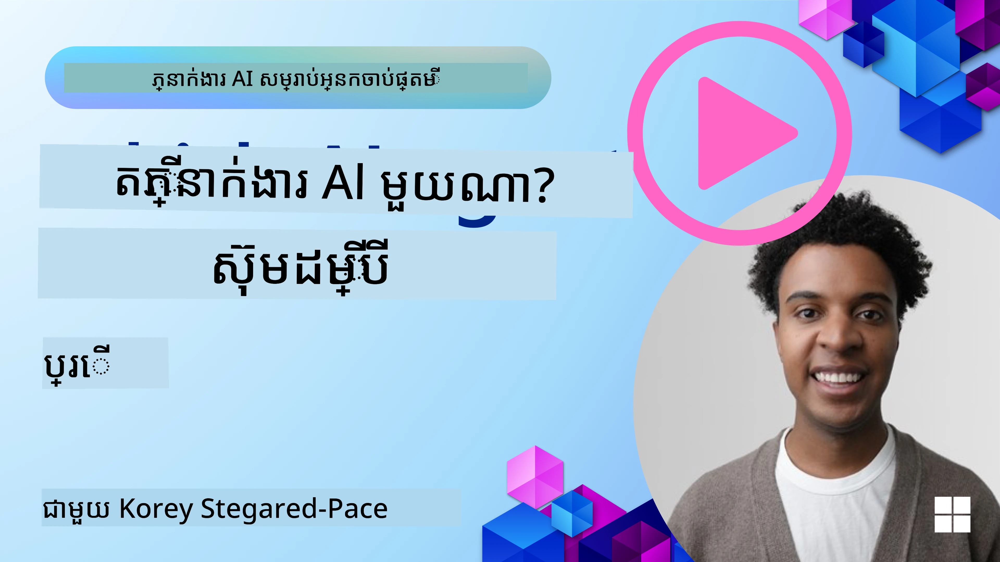

[](https://youtu.be/ODwF-EZo_O8?si=1xoy_B9RNQfrYdF7)

> _(ចុចលើរូបភាពខាងលើដើម្បីមើលវីដេអូមេរៀននេះ)_

# ស្វែងយល់អំពី AI Agent Frameworks

គ្រឹះសម្រាប់ភ្នាក់ងារប្រាជ្ញា (AI agent frameworks) គឺជាវេទិកាសរសេរ​កម្មវិធី ដែលរចនាឡើងដើម្បីបន្ថែមភាពងាយស្រួលក្នុងការបង្កើត ការបង្ហោះ និងការគ្រប់គ្រងភ្នាក់ងារប្រាជ្ញា។ គ្រឹះសម្រាប់នេះផ្តល់ជូនអ្នកអភិវឌ្ឍន៍ដោយមានផ្នែកធ្វើជាស្រេច ផ្នែកសង្ខេប និងឧបករណ៍ដែលជួយធ្វើឲ្យការអភិវឌ្ឍន៍ប្រព័ន្ធ AI ស្មុគស្មាញកាន់តែងាយស្រួល។

គ្រឹះសម្រាប់ទាំងនេះជួយអ្នកអភិវឌ្ឍន៍ផ្តោតលើផ្នែកតែមួយនៃកម្មវិធីរបស់ពួកគេ ដោយផ្តល់វិធីសាស្រ្តស្តង់ដារសម្រាប់ដោះស្រាយបញ្ហាទូទៅនៅក្នុងការអភិវឌ្ឍភ្នាក់ងារប្រាជ្ញា។ វាបន្លាស់បន្តរាការលាយឡំ, ការចូលដំណើរការងាយស្រួល និងប្រសិទ្ធភាពក្នុងការកសាងប្រព័ន្ធ AI។

## ការណែនាំ

មេរៀននេះនឹងគ្របដណ្តបៈ

- តើ AI Agent Frameworks មានអ្វីខ្លះ និងវាធ្វើឲ្យអ្នកអភិវឌ្ឍន៍អាចសម្រេចបានអ្វី?
- តើក្រុមការងារអាចប្រើវា ដើម្បីបង្កើតគំរូរហ័ស ទាញយក និងធ្វើឲ្យ សមត្ថភាពភ្នាក់ងាររបស់ពួកគេច្រើនឡើងបានយ៉ាងដូចម្តេច?
- តើភាពខុសគ្នានៅចន្លោះគ្រឹះនិងឧបករណ៍ដែល Microsoft បង្កើត (Microsoft Foundry Agent Service និង Microsoft Agent Framework)?
- តើខ្ញុំអាចបញ្ចូលឧបករណ៍ក្នុងប្រព័ន្ធ Azure របស់ខ្ញុំបានโดยផ្ទាល់ ឬត្រូវការដំណោះស្រាយឯករាជ្យ?
- តើ Microsoft Foundry Agent Service ជាអ្វី ហើយវាជួយខ្ញុំយ៉ាងដូចម្តេច?

## គោលបំណងសិក្សា

គោលបំណងរបស់មេរៀននេះគឺដើម្បីជួយអ្នកយល់ដឹង៖

- តួនាទីរបស់ AI Agent Frameworks ក្នុងការអភិវឌ្ឍ AI។
- វិធីប្រើ AI Agent Frameworks ដើម្បីបង្កើតភ្នាក់ងារប្រាជ្ញា។
- សមត្ថភាពសំខាន់ៗដែល AI Agent Frameworks អាចធ្វើបាន។
- ភាពខុសគ្នារវាង Microsoft Agent Framework និង Microsoft Foundry Agent Service។

## តើ AI Agent Frameworks ជាអ្វី ហើយវាផ្តល់សមត្ថភាពអ្វីខ្លះសម្រាប់អ្នកអភិវឌ្ឍន៍?

គ្រឹះ AI ប្រពៃណីអាចជួយអ្នកបញ្ចូល AI ទៅក្នុងកម្មវិធីរបស់អ្នក និងធ្វើឲ្យកម្មវិធីទាំងនេះកាន់តែល្អប្រសើរជាមួយវិធីដូចខាងក្រោម៖

- **បុគ្គលិកភាព**៖ AI អាចវិភាគអាកប្បកិរិយារបស់អ្នកប្រើ និងចំណូលចិត្ត ដើម្បីផ្តល់អនុសារណ៍ផ្ទាល់ខ្លួន ការស្នើសុំ និងបទពិសោធន៍ផ្ទាល់ខ្លួន។
ឧទាហរណ៍៖ សេវាប្រគាំងចាក់ផ្សាយដូចជា Netflix ប្រើ AI ដើម្បីណែនាំភាពយន្តនិងកម្មវិធីយោងទៅតាមប្រវត្តិមើល ដើម្បីបង្កើនការចាប់អារម្មណ៍និងការពេញចិត្តរបស់អ្នកប្រើ។
- **ស្វ័យប្រវត្ដ និងប្រសិទ្ធភាព**៖ AI អាចស្វ័យប្រវត្តិភារកិច្ចសូម្បីតែមួយ សម្រួលដំណើរការងារ និងធ្វើឲ្យប្រសើរឡើងប្រសិទ្ធភាពប្រតិបត្តិការ។
ឧទាហរណ៍៖ កម្មវិធីសេវាកម្មអតិថិជនប្រើ chatbot ដឹកនាំដោយ AI ដើម្បីដោះស្រាយសំណួរតាមទូទៅ បន្ថយពេលឆ្លើយតប និងឲ្យភ្នាក់ងារមនុស្សបានផ្តោតលើបញ្ហាស្មុគស្មាញ។
- **បទពិសោធន៍អ្នកប្រើដែលបានលើកកម្ពស់**៖ AI អាចធ្វើឲ្យបទពិសោធន៍អ្នកប្រើទូទាំងប្រព័ន្ធកាន់តែល្អ ដោយផ្តល់សមត្ថភាពដូចជា ការស្គាល់សំឡេង ការពេញនិយមភាសាធម្មជាតិ និងអក្សរមានទំនាក់ទំនងជាមុន។
ឧទាហរណ៍៖ ជំនួយការជាក់ស្ដែងដូចជា Siri និង Google Assistant ប្រើ AI ដើម្បីយល់និងឆ្លើយតបបញ្ជាដែលមានសំឡេង ធ្វើឲ្យមានភាពងាយស្រួលសម្រាប់អ្នកប្រើក្នុងការបញ្ចូលកម្មវិធីរបស់ពួកគេ។

### អ្វីគឺល្អ—ហេតុអ្វីបានជា​យើងត្រូវការ AI Agent Framework?

គ្រឹះសម្រាប់ភ្នាក់ងារប្រាជ្ញានៅលើកម្រិតខ្ពស់ជាងគ្រឹះ AI ទូទៅ ពួកវាត្រូវបានរចនាឡើងដើម្បីអនុញ្ញាតឲ្យបង្កើតភ្នាក់ងារប្រាជ្ញាដែលអាចអន្តរកម្មជាមួយអ្នកប្រើ ប្រភេទភ្នាក់ងារផ្សេងទៀត និងបរិយាកាស ដើម្បីសម្រេចបានគោលបំណងច្បាស់លាស់។ ភ្នាក់ងារទាំងនេះអាចបង្ហាញអាកប្បកិរិយាស្វ័យគ្រប់គ្រង សម្រេចចិត្ត និងបត់បែនទៅតាមលក្ខខណ្ឌផ្លាស់ប្តូរ។ តោះមើលសមត្ថភាពសំខាន់ៗដែល AI Agent Frameworks រៀបចំ៖

- **សហការនិងការសម្របសម្រួលភ្នាក់ងារ**៖ អនុញ្ញាតឲ្យបង្កើតភ្នាក់ងារច្រើនដែលអាចធ្វើការ​រួមគ្នា សន្ទនា និងសម្របដើម្បីដោះស្រាយភារកិច្ចស្មុគស្មាញ។
- **ស្វ័យប្រវត្តិងការគ្រប់គ្រងភារកិច្ច**៖ ផ្តល់យន្តការសម្រាប់ស្វ័យប្រវត្តិកម្មដំណើរការផ្សេងៗច្រើនជំហាន ការចែកចាយភារកិច្ច និងគ្រប់គ្រងភារកិច្ចមានវត្តមានរបស់ភ្នាក់ងារ។
- **ការយល់ដឹងនិងការបត់បែនបរិបទ**៖ ផ្តល់ភាពសមត្ថភាពដល់ភ្នាក់ងារ សម្រាប់យល់ដឹងពីបរិបទ បត់បែនបរិយាកាស និងសម្រេចចិត្តនៅលើព័ត៌មានពេលវេលាពិតប្រាកដ។

ដូច្នេះជារមៀល រាល់ភ្នាក់ងារអនុញ្ញាតឲ្យអ្នកធ្វើបានច្រើនជាង មកកម្រិតខ្ពស់នៃស្វ័យប្រវត្តិ ដើម្បីបង្កើតប្រព័ន្ធប្រាជ្ញារូបបែបដែលអាចបត់បែននិងរៀនពីបរិយាកាសរបស់ពួកវា។

## តើធ្វើដូចម្តេចដើម្បីបង្កើតគំរូរហ័ស សាកល្បង និងបង្កើនសមត្ថភាពភ្នាក់ងារនេះ?

ទីនេះជាឧទាហរណ៍ល្បឿនលឿន ដូចជាក្នុងគ្រឹះភ្នាក់ងារ AI ភាគច្រើន មានវត្ថុធាតុធម្មតា ដូចជាផ្នែកម៉ូឌុល ឧបករណ៍សហការណ៍ និងការរៀនពេលវេលាពិតប្រាកដ។ ចង់ពិសោធន៍ទៅហ្នឹង៖

- **ប្រើផ្នែកម៉ូឌុល**៖ AI SDKs ផ្តល់ផ្នែកធ្វើជាស្រេចដូចជាភ្ជាប់ AI និងអង្គចងចាំ ការហៅមុខងារដោយភាសាធម្មជាតិកម្ម ឬកម្មវិធីជំនួយកូដ ទំរូបញ្ជា និងផ្សេងទៀត។
- **ទាញយកឧបករណ៍សហការណ៍**៖ រចនាភ្នាក់ងារជាមួយតួនាទី និងភារកិច្ចជាក់លាក់ អនុញ្ញាតឱ្យពួកវាសាកល្បងធ្វើការសហការនិងកែលម្អដំណើរការយោងសហការណ៍។
- **រៀនក្នុងពេលវេលាពិតប្រាកដ**៖ អនុវត្តលំនាំផ្ទុកមតិសម្រាប់ឲ្យភ្នាក់ងាររៀនពីការអន្តរកម្ម និងកែប្រែអាកប្បកិរិយារបស់ពួកវាដោយស្វ័យប្រវត្តិ។

### ប្រើផ្នែកម៉ូឌុល

SDKs ដូចជា Microsoft Agent Framework ផ្តល់ផ្នែកធ្វើជាស្រេចដូចជាភ្ជាប់ AI ការបញ្ជាក់ឧបករណ៍ និងការគ្រប់គ្រងភ្នាក់ងារ។

**ក្រុមអាជីពអាចប្រើប្រាស់វាយ៉ាងដូចម្តេច**៖ ក្រុមការងារអាចប្រមួលផ្នែកទាំងនេះយ៉ាងលឿនក្នុងការបង្កើតគំរូឆុះឆាស់ដោយមិនចាំបាច់ចាប់ផ្តើមពីសូន្យ ដែលអនុញ្ញាតឱ្យធ្វើការសាកល្បង និងធ្វើឡើងវិញយ៉ាងលឿន។

**របៀបដំណើរការនៅក្នុងការអនុវត្ត**៖ អ្នកអាចប្រើមុខងារពិនិត្យដែលបានបង្កើតជាស្រេចដើម្បីដកព័ត៌មានពីការបញ្ចូលរបស់អ្នកប្រើ ម៉ូឌុលអង្គចងចាំសម្រាប់រក្សាទុក និងយកទិន្នន័យ និងអ្នកបង្កើតសំនួរដើម្បីអន្តរកម្មជាមួយអ្នកប្រើ ដោយមិនចាំបាច់បង្កើតផ្នែកទាំងនេះពីដើមឡើយ។

**កូដឧទាហរណ៍**៖ តោះមើលឧទាហរណ៍នៃរបៀបប្រើ Microsoft Agent Framework ជាមួយ `FoundryChatClient` ដើម្បីឲ្យម៉ូដែលឆ្លើយតបនឹងការបញ្ចូលរបស់អ្នកប្រើជាមួយការហៅឧបករណ៍៖

``` python
# គំរូ Microsoft Agent Framework Python

import asyncio
import os

from agent_framework import tool
from agent_framework.foundry import FoundryChatClient
from azure.identity import AzureCliCredential


# កំណត់មុខងារឧបករណ៍គំរូសម្រាប់កក់កន្លែងដំណើរកំសាន្ត
@tool(approval_mode="never_require")
def book_flight(date: str, location: str) -> str:
    """Book travel given location and date."""
    return f"Travel was booked to {location} on {date}"


async def main():
    provider = FoundryChatClient(
        project_endpoint=os.environ["AZURE_AI_PROJECT_ENDPOINT"],
        model=os.environ["AZURE_AI_MODEL_DEPLOYMENT_NAME"],
        credential=AzureCliCredential(),
    )
    agent = provider.as_agent(
        name="travel_agent",
        instructions="Help the user book travel. Use the book_flight tool when ready.",
        tools=[book_flight],
    )

    response = await agent.run("I'd like to go to New York on January 1, 2025")
    print(response)
    # លទ្ធផលគំរូ៖ ប្រោយពីបានកក់ជោគជ័យសម្រាប់ការហោះហើរទៅ New York ថ្ងៃទី 1 ខែមករា ឆ្នាំ 2025។ រីករាយក្នុងការធ្វើដំណើរ! ✈️🗽


if __name__ == "__main__":
    asyncio.run(main())
```

អ្វីដែលអ្នកអាចមើលឃើញពីឧទាហរណ៍នេះគឺរបៀបប្រើមុខងារព្យាករណ៍ណែនាំដែលបានបង្កើតជាស្រេច ដើម្បីដកស្រង់ព័ត៌មានសំខាន់ៗពីការបញ្ចូលរបស់អ្នកប្រើ ដូចជាប្រភព ទីកន្លែងគោល និងកាលបរិច្ឆេទស្នើសុំការចុះបញ្ជីយន្តហោះ។ វិធីសាស្រ្តម៉ូឌុលនេះអនុញ្ញាតឲ្យអ្នកផ្តោតលើតុល្យភាពកម្រិតខ្ពស់។

### ទាញយកឧបករណ៍សហការណ៍

គ្រឹះសម្រាប់ដូចជា Microsoft Agent Framework ជួយកសាងភ្នាក់ងារច្រើនដែលអាចធ្វើការសហការគ្នា។

**ក្រុមអាជីពអាចប្រើប្រាស់វាយ៉ាងដូចម្តេច**៖ ក្រុមអាចរចនាភ្នាក់ងារជាមួយតួនាទី និងខ្នាតភារកិច្ចជាក់លាក់ ដើម្បីសាកល្បងនិងកែលម្អដំណើរការសហការនិងប្រសិទ្ធភាពប្រព័ន្ធជាទូទៅ។

**របៀបដំណើរការនៅក្នុងការអនុវត្ត**៖ អ្នកអាចបង្កើតក្រុមភ្នាក់ងារដែលភ្នាក់ងារ​នីមួយៗមានមុខងារពិសេស ដូចជាការប្រមូលទិន្នន័យ វិភាគ ឬសម្រេចចិត្ត។ ភ្នាក់ងារទាំងនេះអាចភ្ជាប់សន្ទនានិងចែករំលែកព័ត៌មានដើម្បីសម្រេចគោលដៅរួម ដូចជាការឆ្លើយតបសំណួររបស់អ្នកប្រើ ឬបញ្ចប់ភារកិច្ចមួយ។

**កូដឧទាហរណ៍ (Microsoft Agent Framework)**៖

```python
# ការបង្កើតភ្នាក់ងារជាច្រើនដែលធ្វើការជាមួយគ្នា ដោយប្រើ Microsoft Agent Framework

import os
from agent_framework.foundry import FoundryChatClient
from azure.identity import AzureCliCredential

provider = FoundryChatClient(
    project_endpoint=os.environ["AZURE_AI_PROJECT_ENDPOINT"],
    model=os.environ["AZURE_AI_MODEL_DEPLOYMENT_NAME"],
    credential=AzureCliCredential(),
)

# ភ្នាក់ងារទាញយកទិន្នន័យ
agent_retrieve = provider.as_agent(
    name="dataretrieval",
    instructions="Retrieve relevant data using available tools.",
    tools=[retrieve_tool],
)

# ភ្នាក់ងារវិភាគទិន្នន័យ
agent_analyze = provider.as_agent(
    name="dataanalysis",
    instructions="Analyze the retrieved data and provide insights.",
    tools=[analyze_tool],
)

# ដំណើរការភ្នាក់ងារតាមលំដាប់លើការងារ
retrieval_result = await agent_retrieve.run("Retrieve sales data for Q4")
analysis_result = await agent_analyze.run(f"Analyze this data: {retrieval_result}")
print(analysis_result)
```

អ្វីដែលអ្នកឃើញក្នុងកូដដែលបានបង្ហាញខាងលើគឺរបៀបកំណត់ភា្ញាក់ងារជាពីរផ្សេងគ្នាជាមួយមុខងារពិសេស ហើយសម្របសម្រួលនិងសហការគ្នាបំពេញការងារវិភាគទិន្នន័យ។ ភ្នាក់ងារនីមួយៗបំពេញមុខងារជាក់លាក់ ហើយភារកិច្ចត្រូវបានបំពេញដោយភ្នាក់ងារជាសហកម្ម។ ការបង្កើតភ្នាក់ងារឆ្លៀតចំណែកដែលមានតួនាទីពិសេសនេះអាចជួយបង្កើនប្រសិទ្ធភាពនិងសមត្ថភាពភារកិច្ច។

### រៀនក្នុងពេលវេលាពិតប្រាកដ

គ្រឹះសម្រាប់ខ្ពស់ផ្តល់សមត្ថភាពសម្រាប់យល់ដឹងបរិបទក្នុងពេលវេលាពិតប្រាកដ និងបត់បែន។

**ក្រុមអាចប្រើប្រាស់វាយ៉ាងដូចម្តេច**៖ ក្រុមអាចអនុវត្តលំនាំផ្ទុកមតិ ដែលភ្នាក់ងាររៀនពីអន្តរកម្ម និងកែប្រែអាកប្បកិរិយារបស់ពួកវាដោយស្វ័យប្រវត្តិ ដែលនាំឱ្យមានការកែលម្អនិងលក្ខណៈពិសេសបន្ត។

**របៀបដំណើរការនៅក្នុងការអនុវត្ត**៖ ភ្នាក់ងារអាចវិភាគមតិអ្នកប្រើ ទិន្នន័យបរិយាកាស និងលទ្ធផលភារកិច្ច ដើម្បីបច្ចុប្បន្នភាពមូលដ្ឋានចំណេះដឹង កែប្រែអត្ត្បារដ្ឋបាលការសម្រេចចិត្ត និងបង្កើនសមត្ថភាពរបស់ពួកវា ដោយប្រើដំណើរការរៀនបន្តថ្នាក់នេះ អនុញ្ញាតឲ្យភ្នាក់ងារបត់បែនទៅលក្ខខណ្ឌផ្លាស់ប្តូរ និងចំណូលចិត្តអ្នកប្រើ ដើម្បីបង្កើនប្រសិទ្ធភាពប្រព័ន្ធទាំងមូល។

## តើភាពខុសគ្នារវាង Microsoft Agent Framework និង Microsoft Foundry Agent Service មានអ្វីខ្លះ?

មានវិធីជាច្រើនក្នុងការប្រៀបធៀបបែបនេះ ប៉ុន្តា តោះមើលភាពខុសគ្នាប្រសើរដែលពាក់ព័ន្ធនឹងរចនា សមត្ថភាព និងករណីប្រើប្រាស់គោលដៅ៖

## Microsoft Agent Framework (MAF)

Microsoft Agent Framework ផ្តល់ SDK ដែលមានរចនាបថងាយស្រួលសម្រាប់សង់ភ្នាក់ងារប្រាជ្ញា ដោយប្រើ `FoundryChatClient`។ វាអនុញ្ញាតឲ្យអភិវឌ្ឍន៍ភ្នាក់ងារដែលប្រើម៉ូដែល Azure OpenAI ជាមួយការហៅឧបករណ៍ស្រេច ការគ្រប់គ្រងបរិបទសន្ទនា និងសុវត្ថិភាពថ្នាក់សហគ្រាសតាមរយៈអត្តសញ្ញាណ Azure។

**ករណីប្រើប្រាស់**៖ ការសាងសង់ភ្នាក់ងារប្រាជ្ញាដែលអាចប្រើឧបករណ៍ នឹងដំណើរការប្រតិបត្តិការជាច្រើនជំហាន និងបញ្ចូលករណីបង្កើតប្រតិបត្តិការថ្នាក់សហគ្រាស។

រូបមន្តគន្លឹះដែលសំខាន់របស់ Microsoft Agent Framework មានដូចជា៖

- **ភ្នាក់ងារ**៖ ភ្នាក់ងារត្រូវបានបង្កើតតាមរយៈ `FoundryChatClient` និងកំណត់ជាមួយឈ្មោះ សេចក្តីណែនាំ និងឧបករណ៍។ ភ្នាក់ងារអាច៖
  - **ដំណើរការបារម្ភអ្នកប្រើ** និងបង្កើតចម្លើយ ដោយប្រើម៉ូដែល Azure OpenAI។
  - **ហៅឧបករណ៍** ដោយស្វ័យប្រវត្តិក្នុងបរិបទសន្ទនា។
  - **រក្សាស្ថានភាពសន្ទនា** ឲ្យរយៈពេលច្រើនការប្រាស្រ័យទាក់ទង។

  នេះជាតំណកូដបង្ហាញរបៀបបង្កើតភ្នាក់ងារ៖

    ```python
    import os
    from agent_framework.foundry import FoundryChatClient
    from azure.identity import AzureCliCredential

    provider = FoundryChatClient(
        project_endpoint=os.environ["AZURE_AI_PROJECT_ENDPOINT"],
        model=os.environ["AZURE_AI_MODEL_DEPLOYMENT_NAME"],
        credential=AzureCliCredential(),
    )
    agent = provider.as_agent(
        name="my_agent",
        instructions="You are a helpful assistant.",
    )

    response = await agent.run("Hello, World!")
    print(response)
    ```

- **ឧបករណ៍**៖ គ្រឹះនេះគាំទ្រការកំណត់ឧបករណ៍ជាមុខងារ Python ដែលភ្នាក់ងារអាចហៅដោយស្វ័យប្រវត្តិ។ ឧបករណ៍ត្រូវបានចុះបញ្ជីពេលបង្កើតភ្នាក់ងារ៖

    ```python
    def get_weather(location: str) -> str:
        """Get the current weather for a location."""
        return f"The weather in {location} is sunny, 72\u00b0F."

    agent = provider.as_agent(
        name="weather_agent",
        instructions="Help users check the weather.",
        tools=[get_weather],
    )
    ```

- **ការសម្របសម្រួលភ្នាក់ងារច្រើន**៖ អ្នកអាចបង្កើតភ្នាក់ងារច្រើនមានជំនាញខុសគ្នា ហើយសម្របការងាររបស់ពួកវា៖

    ```python
    planner = provider.as_agent(
        name="planner",
        instructions="Break down complex tasks into steps.",
    )

    executor = provider.as_agent(
        name="executor",
        instructions="Execute the planned steps using available tools.",
        tools=[execute_tool],
    )

    plan = await planner.run("Plan a trip to Paris")
    result = await executor.run(f"Execute this plan: {plan}")
    ```

- **ការចូលប្រើអត្តសញ្ញាណ Azure**៖ គ្រឹះនេះប្រើ `AzureCliCredential` (ឬ `DefaultAzureCredential`) សម្រាប់ការផ្តល់សុវត្ថិភាពមិនប្រើកូនសោ API ដោយផ្ទាល់។

## Microsoft Foundry Agent Service

Microsoft Foundry Agent Service គឺជាការបន្ថែមថ្មី បង្ហាញនៅ Microsoft Ignite 2024។ វាអនុញ្ញាតឲ្យអភិវឌ្ឍន៍និងចេញផ្សាយភ្នាក់ងារប្រាជ្ញា ដោយប្រើម៉ូដែលមានភាពបត់បែនផ្តាច់មុខ ដូចជាការហៅម៉ូដែល LLM បើកប្រភព ដូចជា Llama 3, Mistral និង Cohere។

Microsoft Foundry Agent Service ផ្តល់វិធានសុវត្ថិភាពថ្នាក់សហគ្រាសរឹងមាំ និងវិធីសាស្រ្តរក្សាទុកទិន្នន័យ ដែលធ្វើឲ្យវាសមស្របសម្រាប់កម្មវិធីសហគ្រាស។

វាដំណើរការជាមួយ Microsoft Agent Framework ដើម្បីសាងសង់និងចេញផ្សាយភ្នាក់ងារ។

សេវាកម្មនេះនៅក្នុងជាថ្មីនៅក្នុងជួរមើលសាធារណៈ ហើយគាំទ្រជាភាសា Python និង C# សម្រាប់សាងសង់ភ្នាក់ងារ។

ប្រើ Microsoft Foundry Agent Service Python SDK អាចបង្កើតភ្នាក់ងារជាមួយឧបករណ៍ដែលកំណត់ដោយអ្នកប្រើបាន៖

```python
import asyncio
from azure.identity import DefaultAzureCredential
from azure.ai.projects import AIProjectClient

# កំណត់មុខងារឧបករណ៍
def get_specials() -> str:
    """Provides a list of specials from the menu."""
    return """
    Special Soup: Clam Chowder
    Special Salad: Cobb Salad
    Special Drink: Chai Tea
    """

def get_item_price(menu_item: str) -> str:
    """Provides the price of the requested menu item."""
    return "$9.99"


async def main() -> None:
    credential = DefaultAzureCredential()
    project_client = AIProjectClient.from_connection_string(
        credential=credential,
        conn_str="your-connection-string",
    )

    agent = project_client.agents.create_agent(
        model="gpt-4o-mini",
        name="Host",
        instructions="Answer questions about the menu.",
        tools=[get_specials, get_item_price],
    )

    thread = project_client.agents.create_thread()

    user_inputs = [
        "Hello",
        "What is the special soup?",
        "How much does that cost?",
        "Thank you",
    ]

    for user_input in user_inputs:
        print(f"# User: '{user_input}'")
        message = project_client.agents.create_message(
            thread_id=thread.id,
            role="user",
            content=user_input,
        )
        run = project_client.agents.create_and_process_run(
            thread_id=thread.id, agent_id=agent.id
        )
        messages = project_client.agents.list_messages(thread_id=thread.id)
        print(f"# Agent: {messages.data[0].content[0].text.value}")


if __name__ == "__main__":
    asyncio.run(main())
```

### គំនិតស្នូល

Microsoft Foundry Agent Service មានគំនិតស្នូលដូចជា៖

- **ភ្នាក់ងារ**៖ Microsoft Foundry Agent Service បញ្ចូលជាមួយ Microsoft Foundry។ ក្នុង Microsoft Foundry ភ្នាក់ងារមានតួនាទីជាសេវាកម្មតូច "ឆ្លាត" ដែលអាចប្រើសម្រាប់ឆ្លើយសំណួរ (RAG) បំពេញសកម្មភាព ឬស្វ័យប្រវត្តិកម្មដំណើរការងារ។ វាសម្រេចបានដោយការលាយបញ្ចូលថាមពលពីម៉ូដែល AI បង្កើតដោយ និងឧបករណ៍ដែលអនុញ្ញាតឲ្យខាងក្នុងភ្នាក់ងារចូលដំណើរការនិងអន្តរកម្មជាមួយប្រភពទិន្នន័យពិភពលោក។ នេះជាឧទាហរណ៍ភ្នាក់ងារមួយ៖

    ```python
    agent = project_client.agents.create_agent(
        model="gpt-4o-mini",
        name="my-agent",
        instructions="You are helpful agent",
        tools=code_interpreter.definitions,
        tool_resources=code_interpreter.resources,
    )
    ```

    ក្នុងឧទាហរណ៍នេះ ភ្នាក់ងារត្រូវបានបង្កើតជាមួយម៉ូដែល `gpt-4o-mini` ឈ្មោះ `my-agent` និងសេចក្តីណែនាំ `You are helpful agent`។ ភ្នាក់ងារត្រូវបានបំពាក់ដោយឧបករណ៍និងធនធានធ្វើការ​ដោះសោលកូដ។

- **ខ្សែសរសេរ និងសារ**៖ ខ្សែសរសេរជាគំនិតសំខាន់មួយទៀត។ វាតំណាងឲ្យសន្ទនា ឬអន្តរកម្មរវាងភ្នាក់ងារ និងអ្នកប្រើ។ ខ្សែសរសេរអាចប្រើដើម្បីតាមដានដំណើរការសន្ទនា រក្សាទុកបរិបទ និងគ្រប់គ្រងស្ថានភាពអន្តរកម្ម។ នេះជាឧទាហរណ៍ខ្សែសរសេរ៖

    ```python
    thread = project_client.agents.create_thread()
    message = project_client.agents.create_message(
        thread_id=thread.id,
        role="user",
        content="Could you please create a bar chart for the operating profit using the following data and provide the file to me? Company A: $1.2 million, Company B: $2.5 million, Company C: $3.0 million, Company D: $1.8 million",
    )
    
    # ស្នើឱ្យភ្នាក់ងារធ្វើការលើខ្សែthreads
    run = project_client.agents.create_and_process_run(thread_id=thread.id, agent_id=agent.id)
    
    # ដកយក និងកត់ត្រាសាររាល់សំណើ ដើម្បីមើលចម្លើយរបស់ភ្នាក់ងារ
    messages = project_client.agents.list_messages(thread_id=thread.id)
    print(f"Messages: {messages}")
    ```

    ក្នុងកូដមុននេះ ខ្សែសរសេរត្រូវបានបង្កើត។ បន្ទាប់មក សារ​ត្រូវបានផ្ញើទៅខ្សែសរសេរ។ ដោយហៅ `create_and_process_run` ភ្នាក់ងារត្រូវបានស្នើឲ្យបំពេញការងារនៅលើខ្សែសរសេរ។ ចុងបញ្ចប់ សារ​ត្រូវបានយកមកផ្ទៀងផ្ទាត់និងកត់ត្រាដើម្បីមើលចម្លើយបញ្ចេញពីភ្នាក់ងារ។ សារទាំងនេះបង្ហាញដំណើរការនៃសន្ទនារវាងអ្នកប្រើ និងភ្នាក់ងារ។ វាក៏មានសារៈសំខាន់ក្នុងការយល់ដឹងថា សារអាចមានប្រភេទខុសៗគ្នា ដូចជាអត្ថបទ រូបភាព ឬឯកសារ ដែលជាផលប៉ះពាល់ពីការងារនៃភ្នាក់ងារ ដូចជារូបភាពឬចម្លើយអត្ថបទជាដើម។ ជាអ្នកអភិវឌ្ឍន៍ អ្នកអាចប្រើព័ត៌មាននេះបន្តដំណើរការចម្លើយ ឬបង្ហាញវាទៅអ្នកប្រើ។

- **បញ្ចូលជាមួយ Microsoft Agent Framework**៖ Microsoft Foundry Agent Service ធ្វើការងារជាមួយMicrosoft Agent Framework តាមរយៈ `FoundryChatClient` ហើយអនុញ្ញាតឲ្យអ្នកបង្កើតភ្នាក់ងារ ហើយចេញផ្សាយពីកន្លែង Agent Service សម្រាប់ករណីផលិតកម្ម។

**ករណីប្រើប្រាស់**៖ Microsoft Foundry Agent Service គឺសម្រាប់កម្មវិធីសហគ្រាសដែលត្រូវការសុវត្ថិភាព ខ្នាតធំ និងទម្រង់បត់បែនក្នុងការចេញផ្សាយភ្នាក់ងារ AI។

## តើភាពខុសគ្នារវាងវិធីសាស្រ្តទាំងនេះមានអ្វីខ្លះ?
 
វាដូចជាមានការច្របូកច្របល់ ប៉ុន្តាមានភាពខុសគ្នាសំខាន់ៗពាក់ព័ន្ធនឹងរចនា សមត្ថភាព និងករណីប្រើប្រាស់៖
 
- **Microsoft Agent Framework (MAF)**៖ ជា SDK សម្រាប់ផលិតកម្ម ដើម្បីសង់ភ្នាក់ងារ AI។ វាប្រើ API ងាយស្រួលក្នុងការបង្កើតភ្នាក់ងារដោយមានការហៅឧបករណ៍ ការគ្រប់គ្រងសន្ទនា និងការចូលប្រើអត្តសញ្ញាណ Azure។
- **Microsoft Foundry Agent Service**៖ ជាវេទិកាហើយជាសេវាកម្មចេញផ្សាយនៅក្នុង Microsoft Foundry សម្រាប់ភ្នាក់ងារ។ វាបង្ហាញការតភ្ជាប់បBuilt-in ជាមួយសេវាកម្មដូចជា Azure OpenAI, Azure AI Search, Bing Search និងការប្រតិបត្តិការ​កូដ។
 
មិនប្រាកដថាតើជ្រើសរើសមួយណា?

### ករណីប្រើប្រាស់
 
មកមើលតើអ្វីដែលយើងអាចជួយអ្នកបានតាមរយៈករណីប្រើប្រាស់ទូទៅ៖
 
> សំណួរ៖ ខ្ញុំកំពុងបង្កើតកម្មវិធីភ្នាក់ងារ AI សម្រាប់ផលិតកម្ម ហើយចង់ចាប់ផ្តើមលឿន
>

> ខ្ញុំ៖ Microsoft Agent Framework ជាជម្រើសល្អ។ វាផ្តល់ API មានរបៀបប្រើ Python តាមរយៈ `FoundryChatClient` ដែលឲ្យអ្នកកំណត់ភ្នាក់ងារជាមួយឧបករណ៍និងសេចក្តីណែនាំក្នុងបន្ទាត់កូដតិចតួច។

> សំណួរ៖ ខ្ញុំត្រូវការជំនួយចេញផ្សាយថ្នាក់សហគ្រាស មានការចូលបា្រស់ជាមួយ Azure ដូចជា Search និងការប្រតិបត្តិការ​កូដ
>
> ខ្ញុំ៖ Microsoft Foundry Agent Service គឺសាកសមបំផុត។ វាជាសេវាកម្មវេទិកា ដែលផ្តល់សមត្ថភាពបBuilt-in សម្រាប់ម៉ូដែលច្រើន Azure AI Search, Bing Search និង Azure Functions។ វាធ្វើឲ្យងាយស្រួលក្នុងការបង្កើតភ្នាក់ងាររបស់អ្នកនៅក្នុងផត្វល័រ Foundry ហើយចេញផ្សាយដោយខ្នាតធំ។
 
> សំណួរ៖ ខ្ញុំនៅតែមិនច្បាស់ ខ្ញុំស្នើរតែជម្រើសតែមួយ
>
> ខ្ញុំ៖ ចាប់ផ្តើមជាមួយ Microsoft Agent Framework សម្រាប់សង់ភ្នាក់ងាររបស់អ្នក ហើយបន្ទាប់មកប្រើ Microsoft Foundry Agent Service នៅពេលដែលអ្នកត្រូវចេញផ្សាយ និងបូកបន្ថែមខ្នាតផលិតកម្ម។ វិធីសាស្រ្តនេះឲ្យអ្នកអាចធ្វើការផ្លាស់ប្ដូរយ៉ាងលឿនលើតុល្យភាពភ្នាក់ងារ នៅពេលបានផ្លូវច្បាស់ក្នុងការចេញផ្សាយថ្នាក់សហគ្រាស។
 
យើងសង្ខេបភាពខុសគ្នាសំខាន់ៗជាអត្រារាងកត់តម្រូវ៖

| គ្រឹះ | ភាពផ្តោត | គំនិតស្នូល | ករណីប្រើប្រាស់ |
| --- | --- | --- | --- |
| Microsoft Agent Framework | SDK រឹងមាំសម្រាប់ភ្នាក់ងារជាមួយការហៅឧបករណ៍ | ភ្នាក់ងារ ឧបករណ៍ អត្តសញ្ញាណ Azure | កសាងភ្នាក់ងារ AI ប្រើឧបករណ៍ និងដំណើរការច្រើនជំហាន |
| Microsoft Foundry Agent Service | ម៉ូដែលបត់បែន សុវត្ថិភាពថ្នាក់សហគ្រាស ការបង្កើតកូដ ហៅឧបករណ៍ | ម៉ូឌុល សហការណ៍ ការសម្របសម្រួលដំណើរការ | ចេញផ្សាយភ្នាក់ងារ AI យ៉ាងសុវត្ថិភាព ខ្នាតធំ និងបត់បែន |

## តើខ្ញុំអាចបញ្ចូលឧបករណ៍ក្នុងប្រព័ន្ធ Azure របស់ខ្ញុំបានដោយផ្ទាល់ ឬត្រូវការដំណោះស្រាយឯករាជ្យ?


ចម្លើយ​គឺ​បាទ/ចាស អ្នកអាចរួមបញ្ចូលឧបករណ៍អេកូស៊ីស្តែម Azure ដែលអ្នកមានស្រាប់ជាមួយសេវាកម្ម Microsoft Foundry Agent ដោយផ្ទាល់ជាពិសេស ពីព្រោះវាត្រូវបានបង្កើតឡើងដើម្បីធ្វើការប្រកបដោយឥតខ្សោយជាមួយសេវាកម្មផ្សេងទៀតរបស់ Azure។ ឧទាហរណ៍ អ្នកអាចរួមបញ្ចូល Bing, Azure AI Search, និង Azure Functions។ ក៏មានការរួមបញ្ចូលជ្រៅជាមួយ Microsoft Foundry ផងដែរ។

ស៊ុម Microsoft Agent Framework ក៏រួមបញ្ចូលជាមួយសេវាកម្ម Azure តាមរយៈ `FoundryChatClient` និងអត្តសញ្ញាណ Azure ដែលអនុញ្ញាតឱ្យអ្នកហៅសេវាកម្ម Azure ដោយផ្ទាល់ពីឧបករណ៍របស់ភ្នាក់ងាររបស់អ្នក។

## កូដគំរូ

- Python: [Agent Framework (Microsoft Foundry)](./code_samples/02-python-agent-framework.ipynb)
- Python: [Agent Framework (Azure OpenAI Responses API)](./code_samples/02-python-agent-framework-azure-openai.ipynb)
- .NET: [Agent Framework](./code_samples/02-dotnet-agent-framework.md)

## មានសំណួរបន្ថែមអំពី AI Agent Frameworks ទេ?

ចូលរួមក្នុង [Microsoft Foundry Discord](https://discord.com/invite/ATgtXmAS5D) ដើម្បីជួបជាមួយអ្នករៀនផ្សេងទៀត ចូលរួមវេទិកាសៀវភៅ និងទទួលបានការឆ្លើយបញ្ញត្តិសំណួរអំពី AI Agents របស់អ្នក។

## សេចក្ដីយោង

- <a href="https://techcommunity.microsoft.com/blog/azure-ai-services-blog/introducing-azure-ai-agent-service/4298357" target="_blank">Azure Agent Service</a>
- <a href="https://learn.microsoft.com/azure/ai-services/openai/how-to/responses" target="_blank">Microsoft Agent Framework - Azure OpenAI Responses</a>
- <a href="https://learn.microsoft.com/azure/ai-services/agents/overview" target="_blank">Microsoft Foundry Agent Service</a>

## មេរៀន​មុន

[ការណែនាំអំពី AI Agents និងករណីប្រើប្រាស់ Agent](../01-intro-to-ai-agents/README.md)

## មេរៀន​បន្ទាប់

[ការយល់ដឹងពីលំនាំរចនាបទ Agentic](../03-agentic-design-patterns/README.md)

---

<!-- CO-OP TRANSLATOR DISCLAIMER START -->
**ការបដិសេធ**:
ឯកសារនេះត្រូវបានបម្លែងភាសា ដោយប្រើសេវាបម្លែងភាសា AI [Co-op Translator](https://github.com/Azure/co-op-translator)។ ទោះយើងខ្ញុំមានក្តីប្រាថ្នាឱ្យបានច្បាស់លាស់ តែសូមយល់ដឹងថាការបម្លែងដោយស្វ័យប្រវត្តិក៏អាចមានកំហុសឬភាពមិនត្រឹមត្រូវ។ ឯកសារដើមជាភាសាទីតាំងគួរត្រូវបានគេប្រើជាប្រភពច្បាស់លាស់។ សម្រាប់ព័ត៌មានសំខាន់ៗ សូមណែនាំឱ្យប្រើប្រាស់ការប្រែដោយមនុស្សជំនាញ។ យើងខ្ញុំមិនទទួលខុសត្រូវចំពោះការយល់ច្រឡំ ឬការបកស្រាយខុសបន្ទាប់ពីការប្រើប្រាស់ការបម្លែងនេះនោះទេ។
<!-- CO-OP TRANSLATOR DISCLAIMER END -->