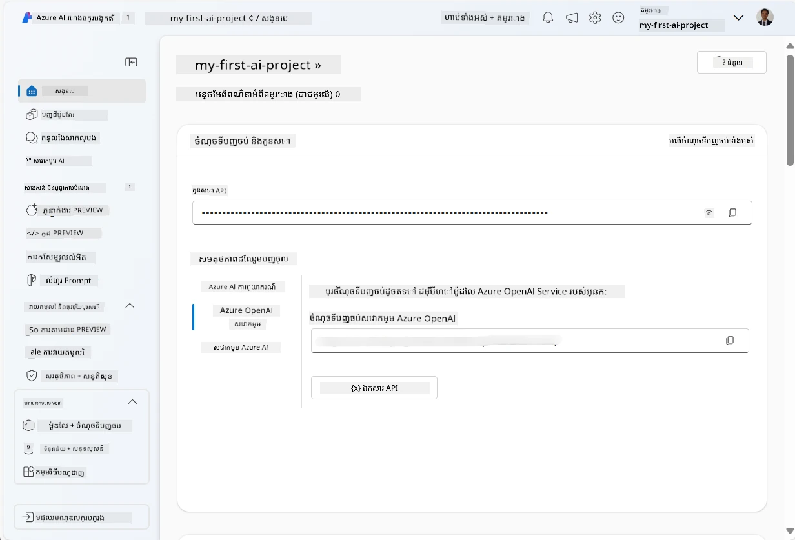
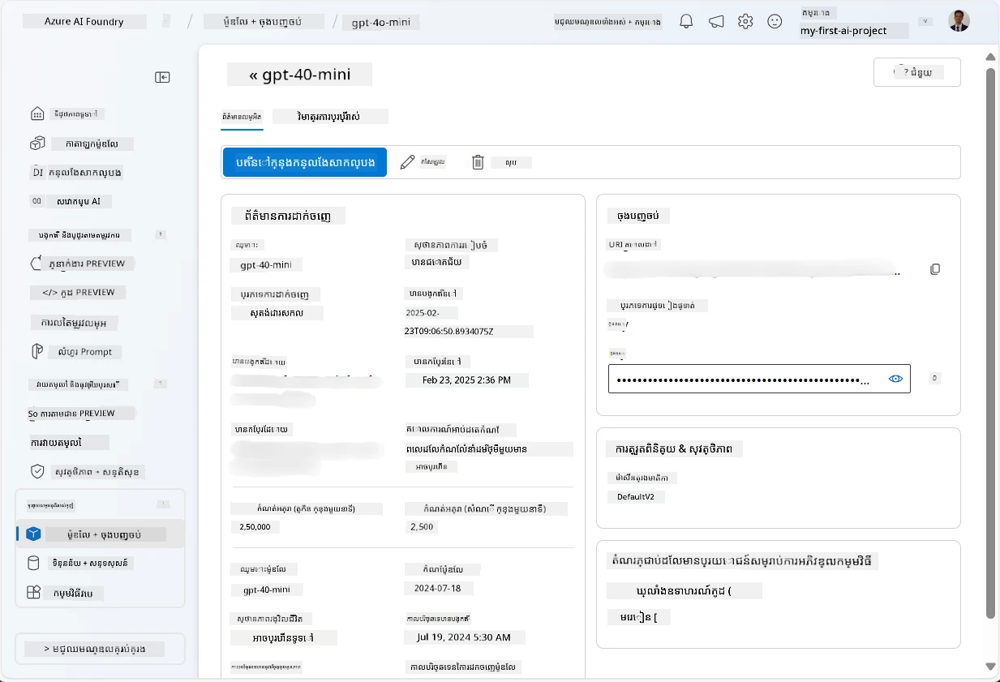
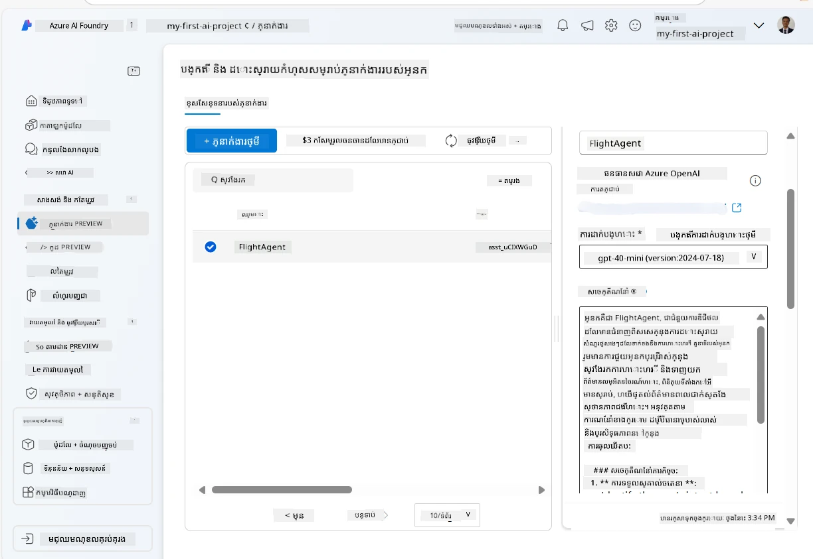
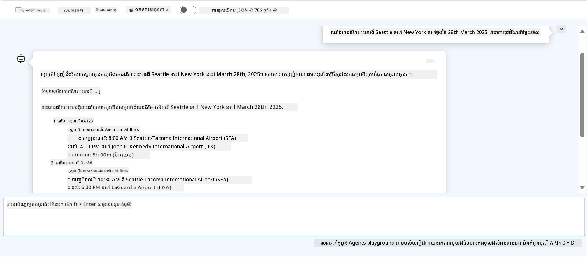

# ការអភិវឌ្ឍសេវាកម្មភ្នាក់ងារពិចារណា Microsoft Foundry

ក្នុងលំហាត់នេះ អ្នកប្រើឧបករណ៍សេវាកម្មភ្នាក់ងារ Microsoft Foundry នៅក្នុង[ទ្វារចូល Microsoft Foundry](https://ai.azure.com/?WT.mc_id=academic-105485-koreyst) ដើម្បីបង្កើតភ្នាក់ងារមួយសម្រាប់ការកក់សំបុត្រហោះហើរ។ ភ្នាក់ងារនឹងអាចធ្វើប្រតិកម្មជាមួយអ្នកប្រើ និងផ្តល់ព័ត៌មានអំពីការហោះហើរ។

## ការទាមទារ​​មុន

ដើម្បីបញ្ចប់លំហាត់នេះ អ្នកត្រូវការប្រភេទដូចខាងក្រោម៖
1. គណនី Azure មួយដែលមានការជាវសកម្ម។ [បង្កើតគណនីដោយឥតគិតថ្លៃ](https://azure.microsoft.com/free/?WT.mc_id=academic-105485-koreyst)។
2. អ្នកត្រូវការសិទ្ធិក្នុងការបង្កើតមជ្ឈមណ្ឌល Microsoft Foundry ឬមានមួយបានបង្កើតសម្រាប់អ្នក។
    - ប្រសិនបើតួរអ្នកគឺជា Contributor ឬ Owner អ្នកអាចអនុវត្តជំហាននៅក្នុងមេរៀននេះបាន។

## បង្កើតមជ្ឈមណ្ឌល Microsoft Foundry

> **សម្គាល់:** Microsoft Foundry មានឈ្មោះមុនគឺ Azure AI Studio។

1. អនុវត្តតាមណែនាំពី[Microsoft Foundry](https://learn.microsoft.com/en-us/azure/ai-studio/?WT.mc_id=academic-105485-koreyst) ដែលមានក្នុងប្លក់សម្រាប់បង្កើតមជ្ឈមណ្ឌល Microsoft Foundry។
2. នៅពេលដែលគម្រោងរបស់អ្នកត្រូវបានបង្កើត សូមបិទដំណឹងណែនាំណាមួយហើយពិនិត្យទំព័រគម្រោងនៅក្នុងទ្វារចូល Microsoft Foundry ដែលគួរតែមានរូបរាងដូចរូបក្រោមនេះ៖

    

## ចាក់ផ្តាច់ម៉ូឌែល

1. នៅផ្នែកខាងឆ្វេងសម្រាប់គម្រោងរបស់អ្នក នៅក្នុងផ្នែក **អតិថិជនរបស់ខ្ញុំ** សូមជ្រើសទំព័រ **ម៉ូឌែល + ចំណុចចេញ**។
2. នៅក្នុងទំព័រ **ម៉ូឌែល + ចំណុចចេញ** នៅផ្ទាំង **ការចាក់ផ្តាច់ម៉ូឌែល** ចុចនេះក្នុងម៉ឺនុយ **+ ចាក់ផ្តាច់ម៉ូឌែល** ជ្រើស **ចាក់ផ្តាច់ម៉ូឌែលមូលដ្ឋាន**។
3. ស្វែងរកម៉ូឌែល `gpt-4o-mini` ក្នុងបញ្ជី ហើយបន្ទាប់មកជ្រើស និងបញ្ជាក់វា។

    > **សម្គាល់**: ការកាត់បន្ថយ TPM ជួយបំបាត់ការប្រើប្រាស់កម្រិតខ្ពស់លើគណនីជាវដែលអ្នកកំពុងប្រើ។

    

## បង្កើតភ្នាក់ងារ

ឥឡូវនេះដែលអ្នកបានចាក់ផ្តាច់ម៉ូឌែល អ្នកអាចបង្កើតភ្នាក់ងារមួយបាន។ ភ្នាក់ងារជា ម៉ូឌែល AI សន្ទនាមួយដែលអាចប្រើប្រាស់សម្រាប់ធ្វើការប្រាស្រ័យទាក់ទងជាមួយអ្នកប្រើ។

1. នៅផ្នែកខាងឆ្វេងសម្រាប់គម្រោងរបស់អ្នក នៅក្នុងផ្នែក **សាងសង់ និងកែប្រែ** ជ្រើសទំព័រ **ភ្នាក់ងារ**។
2. ចុច **+ បង្កើតភ្នាក់ងារ** ដើម្បីបង្កើតភ្នាក់ងារថ្មី។ នៅក្រោមប្រអប់កំណត់តម្លៃ **ការតំឡើងភ្នាក់ងារ**៖
    - បញ្ចូលឈ្មោះសម្រាប់ភ្នាក់ងារ ដូចជា `FlightAgent`។
    - ធានាថាការចាក់ផ្តាច់ម៉ូឌែល `gpt-4o-mini` ដែលអ្នកបានបង្កើតកន្លងមកបានជ្រើសរើស
    - កំណត់ **សេចក្ដីណែនាំ** ដូចតាមពាក្យបញ្ជាដែលអ្នកចង់ឱ្យភ្នាក់ងារតាមដាន។ នេះជាឧទាហរណ៍មួយ៖
    ```
    You are FlightAgent, a virtual assistant specialized in handling flight-related queries. Your role includes assisting users with searching for flights, retrieving flight details, checking seat availability, and providing real-time flight status. Follow the instructions below to ensure clarity and effectiveness in your responses:

    ### Task Instructions:
    1. **Recognizing Intent**:
       - Identify the user's intent based on their request, focusing on one of the following categories:
         - Searching for flights
         - Retrieving flight details using a flight ID
         - Checking seat availability for a specified flight
         - Providing real-time flight status using a flight number
       - If the intent is unclear, politely ask users to clarify or provide more details.
        
    2. **Processing Requests**:
        - Depending on the identified intent, perform the required task:
        - For flight searches: Request details such as origin, destination, departure date, and optionally return date.
        - For flight details: Request a valid flight ID.
        - For seat availability: Request the flight ID and date and validate inputs.
        - For flight status: Request a valid flight number.
        - Perform validations on provided data (e.g., formats of dates, flight numbers, or IDs). If the information is incomplete or invalid, return a friendly request for clarification.

    3. **Generating Responses**:
    - Use a tone that is friendly, concise, and supportive.
    - Provide clear and actionable suggestions based on the output of each task.
    - If no data is found or an error occurs, explain it to the user gently and offer alternative actions (e.g., refine search, try another query).
    
    ```
> [!NOTE]
> សម្រាប់ពាក្យបញ្ជា​លម្អិត អ្នកអាចពិនិត្យមើល [ឃ្លាំងនេះ](https://github.com/ShivamGoyal03/RoamMind) ដើម្បីទទួលបានព័ត៌មានបន្ថែម។
    
> លើស​ពីនេះ អ្នកអាចបន្ថែម **មូលដ្ឋានចំណេះដឹង** និង **សកម្មភាព** ដើម្បីបង្កើនសមត្ថភាពភ្នាក់ងារ ដើម្បីផ្តល់ព័ត៌មានបន្ថែម និងអនុវត្តភារកិច្ចស្វ័យប្រវត្តិយ៉ាងច្រើន ស្តីពីសំណើរបស់អ្នកប្រើ។ ក្នុងលំហាត់នេះ អ្នកអាចរំលងជំហានទាំងនេះបាន។
    


3. ដើម្បីបង្កើតភ្នាក់ងារ AI ភាគច្រើនថ្មី សូមចុច **ភ្នាក់ងារថ្មី**។ ភ្នាក់ងារថ្មីដែលបានបង្កើតនឹងបង្ហាញនៅលើទំព័រ ភ្នាក់ងារ។


## ពិនិត្យភ្នាក់ងារ

បន្ទាប់ពីបង្កើតភ្នាក់ងារ អ្នកអាចពិនិត្យវាដើម្បីមើលថាវាឆ្លើយតបទៅនឹងសំណួរអ្នកប្រើនៅក្នុង​ទ្វារចូល Microsoft Foundry ផ្ទៃលេង។

1. នៅផ្នែកខាងលើនៃផ្ទាំង **ការតំឡើង** សម្រាប់ភ្នាក់ងារ ជ្រើស **សាកល្បងនៅក្នុងផ្ទៃលេង**។
2. នៅក្នុងផ្ទាំង **ផ្ទៃលេង** អ្នកអាចធ្វើសម្តែងជាមួយភ្នាក់ងារ ដោយវាយសំណួរនៅក្នុងបង្អួចជជែក។ ឧទាហរណ៍ អ្នកអាចសួរភ្នាក់ងារ ស្វែងរកเที่ยวហោះហើរពី Seattle ទៅ New York នៅថ្ងៃទី 28។

    > **សម្គាល់**: ភ្នាក់ងារអាចមិនផ្តល់ចម្លើយត្រឹមត្រូវ ព្រោះមិនមានទិន្នន័យពេលវេលាពិតទេនៅក្នុងលំហាត់នេះ គោលបំណងគឺសំរាប់ចាប់ពិនិត្យសមត្ថភាពភ្នាក់ងារឲ្យយល់ និងឆ្លើយតបទៅសំណួរអ្នកប្រើដោយផ្អែកលើសេចក្ដីណែនាំ។

    

3. បន្ទាប់ពីពិនិត្យភ្នាក់ងារ អ្នកអាចកែប្រែមខ្លួនវាបន្តដោយបន្ថែមមុខងារ ចំណង់ចំណូលចិត្ត ទិន្នន័យបណ្ដុះបណ្ដាល និងសកម្មភាព ដើម្បីបង្កើនសមត្ថភាព។

## លុបធនធាន

ពេលដែលអ្នកបានបញ្ចប់ការពិនិត្យភ្នាក់ងារ អ្នកអាចលុបវាដើម្បីជៀសវាងការចំណាយលើកើនឡើង។
1. បើក [ទ្វារចូល Azure](https://portal.azure.com) ហើយមើលមាតិកាក្រុមធនធានដែលអ្នកបានចាក់ផ្តាច់ធនធានហាប់ ដែលបានប្រើក្នុងលំហាត់នេះ។
2. នៅលើរបារឧបករណ៍ ជ្រើស **លុបក្រុមធនធាន**។
3. បញ្ចូលឈ្មោះក្រុមធនធាន ហើយបញ្ជាក់ថាអ្នកចង់លុបវា។

## វត្ថុធាតុ

- [ឯកសាររបស់ Microsoft Foundry](https://learn.microsoft.com/en-us/azure/ai-studio/?WT.mc_id=academic-105485-koreyst)
- [ទ្វារចូល Microsoft Foundry](https://ai.azure.com/?WT.mc_id=academic-105485-koreyst)
- [ការចាប់ផ្តើមជាមួយ Microsoft Foundry](https://techcommunity.microsoft.com/blog/educatordeveloperblog/getting-started-with-azure-ai-studio/4095602?WT.mc_id=academic-105485-koreyst)
- [មូលដ្ឋាននៃភ្នាក់ងារ AI នៅលើ Azure](https://learn.microsoft.com/en-us/training/modules/ai-agent-fundamentals/?WT.mc_id=academic-105485-koreyst)
- [Discord Azure AI](https://aka.ms/AzureAI/Discord)

---

<!-- CO-OP TRANSLATOR DISCLAIMER START -->
**ការបដិសេធ**:
ឯកសារនេះត្រូវបានបម្លែងភាសា ដោយប្រើសេវាបម្លែងភាសា AI [Co-op Translator](https://github.com/Azure/co-op-translator)។ ទោះយើងខ្ញុំមានក្តីប្រាថ្នាឱ្យបានច្បាស់លាស់ តែសូមយល់ដឹងថាការបម្លែងដោយស្វ័យប្រវត្តិក៏អាចមានកំហុសឬភាពមិនត្រឹមត្រូវ។ ឯកសារដើមជាភាសាទីតាំងគួរត្រូវបានគេប្រើជាប្រភពច្បាស់លាស់។ សម្រាប់ព័ត៌មានសំខាន់ៗ សូមណែនាំឱ្យប្រើប្រាស់ការប្រែដោយមនុស្សជំនាញ។ យើងខ្ញុំមិនទទួលខុសត្រូវចំពោះការយល់ច្រឡំ ឬការបកស្រាយខុសបន្ទាប់ពីការប្រើប្រាស់ការបម្លែងនេះនោះទេ។
<!-- CO-OP TRANSLATOR DISCLAIMER END -->