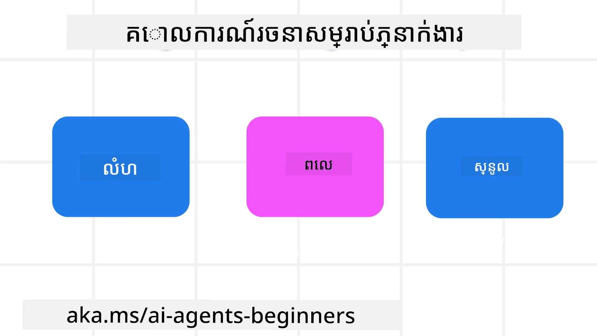

> _(ចុចរូបភាពខាងលើដើម្បីមើលវីដេអូមេរៀននេះ)_
# គោលការណ៍រចនាភ្នែកAI Agentic

## ការណែនាំ

មានវិធីជាច្រើនក្នុងការគិតអំពីការបង្កើតប្រព័ន្ធAI Agentic។ ព្រោះភាពច្របូកច្របល់គឺជាលក្ខណៈមួយ មិនមែនជាកំហុសក្នុងការរចនាអាយភីនៃAI សូម្បីតែក៏ការត្រួតពិនិត្យសម្រាប់វិស្វករសម្រាប់ស្វែងរកចាប់ផ្តើមនៅឯណាគឺពិបាក។ យើងបានបង្កើតលំនាំគោលការណ៍រចនាដែលផ្តោតលើអ្នកប្រើប្រាស់ដើម្បីអនុញ្ញាតឱ្យអ្នកអភិវឌ្ឍសាងសង់ប្រព័ន្ធAgenticមូលដ្ឋានលើអតិថិជនដើម្បីដោះស្រាយតម្រូវការជំនួញរបស់ពួកគេ។ គោលការណ៍រចនានេះមិនមែនជារចនាសម្ព័ន្ធបញ្ជាច្បាស់លាស់ទេ ប៉ុន្តែជាចំណុចចាប់ផ្តើមសម្រាប់ក្រុមដែលកំពុងកំណត់និងសាងសង់បទពិសោធន៍Agent។

ជាទូទៅ អ្នកប្រតិបត្តិគួរតែ:

- ពង្រីកនិងបង្កើនសមត្ថភាពមនុស្ស (គំនិតថ្មី ការដោះស្រាយបញ្ហា អូតូម៉ាស៊ីន ល។)
- បំពេញចន្លោះចែកចាយចំណេះដឹង (ធ្វើឲ្យខ្ញុំបានវឌ្ឍនភាពលើដែនចំណេះដឹង ការប្រែសម្រួល ល។)
- ជំរុញនិងគាំទ្រការសហការបែបដែលមនុស្សនិរន្តរភាពចូលចិត្តការងារ​ជាមួយគ្នា
- ធ្វើឲ្យយើងក្លាយជានរណាមួយប្រសើរជាងខ្លួនយើង (ឧ. ភ្នែកជាគ្រូបង្វឹក/ អ្នកគ្រប់គ្រងភារកិច្ច ជួយយើងរៀនការត្រួតពិនិត្យអារម្មណ៍និងជំនាញចំណត់សតិ, កំណើនភាពធន់មុខ ល។)

## មេរៀននេះនឹងគ្របដណ្តប់

- តើគោលការណ៍រចនាAgenticគឺជាអ្វី
- តើមានមគ្គុទេសក៍អ្វីខ្លះដែលគួរតាមពេលអនុវត្តគោលការណ៍នេះ
- តើមានឧទាហរណ៍អ្វីខ្លះនៃការប្រើគោលការណ៍រចនា

## គោលបំណងរៀន

បន្ទាប់ពីបញ្ចប់មេរៀននេះ អ្នកនឹងអាច:

1. ពន្យល់ពីអ្វីទៅជាគោលការណ៍រចនាAgentic
2. ពន្យល់ពីមគ្គុទេសក៍សម្រាប់ប្រើគោលការណ៍រចនាAgentic
3. យល់ពីវិធីសាស្រ្តសាងសង់ភ្នែកដោយប្រើគោលការណ៍រចនាAgentic

## គោលការណ៍រចនាAgentic

### អ្នកប្រតិបត្តិ (លំនៅដ្ឋាន)

វាជាពីរសជីវបរិយាកាសដែលភ្នែកប្រតិបត្តិដំណើរការ។ គោលការណ៍នេះជាដំណាក់កាលនៃរបៀបដែលយើងរចនាភ្នែកសម្រាប់ចូលរួមនៅលើពិភពរូបប្រាំ និងឌីជីថល។

- **ភ្ជាប់មិនមែនបំភ្លេច** – ជួយភ្ជាប់មនុស្សទៅអ្នកដទៃ រឿង និងចំណេះដឹងដែលអាចអនុវត្តបានដើម្បីជំរុញការសហការនិងការតភ្ជាប់។
- អ្នកប្រតិបត្តិជួយភ្ជាប់រឿង ចំណេះដឹង និងមនុស្ស។
- អ្នកប្រតិបត្តិធ្វើឲ្យមនុស្សជិតស្និទ្ធជាងមុន។ ពួកគេមិនបានរចនាដើម្បីជំនួស ឬបញ្ចុះតម្លៃមនុស្សទេ។
- **ងាយស្រួលចូលដំណើរការប៉ុន្តែមិនសូវបង្ហាញច្បាស់** – ពេលភ្នែកដំណើរការតូចនៅភាគខាងក្រោយ ហើយគ្រាន់តែបញ្ចេញសំឡេងពេលពាក់ព័ន្ធ ומתאים។
  - ភ្នែកងាយរកឃើញ និងចូលដំណើរការដើម្បីអ្នកមានសិទ្ធិនៅលើឧបករណ៍ឬវេទិកាណាមួយ។
  - ភ្នែកគាំទ្រជាច្រើនមុខ (សំលេង​, សំឡេង, អត្ថបទ ល។)។  
  - ភ្នែកអាចប្តូរវិលវិញរវាងចំណុចខាងមុខ និងខាងក្រោយ; ពីសកម្មទៅប្រតិកម្ម តាមការចាប់ពីចម្ងាយនៃតម្រូវការអ្នកប្រើ។
  - ភ្នែកអាចដំណើរការជារូបមន្តមិនបង្ហាញ ប៉ុន្តែដំណើរការផ្នែកខាងក្រោយ និងការសហការជាមួយអ្នកប្រតិបត្តិផ្សេងទៀតត្រូវបានបង្ហាញច្បាស់និងអាចគ្រប់គ្រងដោយអ្នកប្រើ។

### អ្នកប្រតិបត្តិ (ពេលវេលា)

វិធីដែលភ្នែកដំណើរការតាមពេលវេលា។ គោលការណ៍ទាំងនេះជាដំណាក់កាលនៅរបៀបដែលយើងរចនាភ្នែកនៅចន្លោះអតត មកបច្ចុប្បន្ន និងអនាគត។

- **អតីត**: ការឆ្លុះបញ្ចាំងលើប្រវត្តិសាស្ត្រដែលរួមបញ្ចូលពីសភាពនិងបរិបទ។
  - ភ្នែកផ្តល់លទ្ធផលពាក់ព័ន្ធជាងមុនដោយផ្អែកលើការវិភាគទិន្នន័យប្រវត្តិសាស្ត្រដែលសម្បូរជាងត្រឹមតែព្រឹត្តិការណ៍ មនុស្ស ឬសភាព។
  - ភ្នែកបង្កើតការតភ្ជាប់ពីព្រឹត្តិការណ៍អតីត ហើយសកម្មអនុវត្តចងចាំដើម្បីចូលរួមជាមួយស្ថានភាពបច្ចុប្បន្ន។
- **ឥឡូវនេះ**: ជំរុញជាងជូនដំណឹង។
  - ភ្នែកដំណើរការជាវិធីសាស្រ្តទូលំទូលាយសម្រាប់អន្តរកម្មជាមួយមនុស្ស។ នៅពេលមានព្រឹត្តិការណ៍ ភ្នែកមិនត្រឹមតែផ្តល់សារជូនដំណឹងឬទម្រង់ស្ថិតស្ថេរផ្សេងទៀតទេ។ ភ្នែកអាចធ្វើឲ្យស្រួលលំហូរឬបង្កើតកម្រិតដើម្បីទាក់ទាញការយកចិត្តទុកដាក់របស់អ្នកប្រើបានត្រឹមត្រូវ។
  - ភ្នែកផ្តល់ព័ត៌មានផ្អែកលើបរិយាកាសបរិមាណ ប្រែប្រួលសង្គមនិងវប្បធម៌ ហើយត្រូវបានអត្រាតាមបំណងអ្នកប្រើ។
  - អន្តរកម្មរបស់ភ្នែកអាចមានជំហានងាក ធំឡើងដោយជំរុញគុណភាពអ្នកប្រើក្នុងរយៈពេលវែង។
- **អនាគត**: ធ្វើឱ្យសមរម្យនិងកើនឡើង។
  - ភ្នែកប្រកបដោយអក្ខរក្រមឧបករណ៍ វេទិកា ហើយរាងខុសគ្នា។
  - ភ្នែកបង្រៀនតាមអាកប្បកិរិយានៃអ្នកប្រើ ប៉ូលភាពចូលដំណើរការនិងអាចកំណត់តម្កល់ដោយសេរី។
  - ភ្នែកត្រូវបានរៀបចំហើយកើនឡើងតាមរយៈអន្តរកម្មជាប់ជាមួយអ្នកប្រើប្រាស់។

### អ្នកប្រតិបត្តិ (មូលដ្ឋាន)

ធាតុសំខាន់នៅមូលដ្ឋាននៃការរចនាភ្នែក។

- **ទទួលស្គាល់អនិច្ចភាព តែបង្កើតទំនុកចិត្ត**។
  - ភ្នែកត្រូវបានគិតថាយ៉ាងតិចកម្រិតនៃអនិច្ចភាព។ អនិច្ចភាពគឺជាធាតុសំខាន់នៃការរចនាភ្នែក។
  - ទំនុកចិត្តនិងភាពច្បាស់លាស់គឺជាស្រទាប់មូលដ្ឋាននៃការរចនាភ្នែក។
  - មនុស្សគ្រប់គ្រងពេលភ្នែកកំពុងបើក/បិទ ហើយស្ថានភាពភ្នែកច្បាស់លាស់គ្រប់ពេលវេលា។

## គន្លឹះដើម្បីអនុវត្តគោលការណ៍ទាំងនេះ

ពេលអ្នកប្រើគោលការណ៍រចនាមួយចំនួនខាងលើ សូមប្រើគន្លឹះដូចខាងក្រោម:

1. **ភាពច្បាស់លាស់**: ជូនដំណឹងឲ្យអ្នកប្រើដឹងថាAIចូលរួម បែបបទដំណើរការ (រួមទាំងសកម្មភាពអតីត) និងវិធីផ្តល់មតិយោបល់ និងកែប្រែប្រព័ន្ធ។
2. **ការគ្រប់គ្រង**: មានសមត្ថភាពឲ្យអ្នកប្រើកំណត់ជម្រើស បញ្ជាក់ចំណង់ចំណូល និងប្ដូរតាមបំណង ហើយគ្រប់គ្រងប្រព័ន្ធនិងលក្ខណៈរបស់វា (រួមទាំងសមត្ថភាពលប់ចោល)។
3. **ភាពស្ថាពរ**: 지향 統一勻多新體驗ប្រមូលគ្នានៅឧបករណ៍ និងចុងក្រោយ។ ប្រើធាតុUI/UXដែលស្គាល់បានក្នុងកន្លែងដែលអាច (ឧ. រូបតំណាងមីក្រូហ្វូនសម្រាប់អន្តរកម្មសំលេង) ហើយកាត់បន្ថយថាមពលចិត្តកាន់តែបានច្រើនរបស់អតិថិជន (ឧ. ផ្តោតលើយូស្មុីល វេទិកានិងខ្លឹមសាររបស់‘សូមរៀនបន្ថែម’)។

## របៀបរចនាភ្នែកដំណើរកំសាន្តដោយប្រើគោលការណ៍ និង គន្លឹះទាំងនេះ

ស្រមើលថាអ្នកកំពុងរចនាភ្នែកដំណើរកំសាន្ត វាដូចណាដែលអ្នកអាចគិតអំពីការប្រើគោលការណ៍ និងគន្លឹះ:

1. **ភាពច្បាស់លាស់** – ឲ្យយល់ថាភ្នែកដំណើរកំសាន្តគឺជាភ្នែកដែលចូលរួមតាមAI។ ផ្តល់ការណែនាំមូលដ្ឋានពីរបៀបចាប់ផ្តើម (ឧ. សារស្វាគមន៍ ‘’សួស្តី’’ ,​ សំណួរគំរូ)។ ច្បាស់លាស់ក្នុងការចុះលទ្ធផលនៅលើទំព័រផលិតផល។ បង្ហាញបញ្ជីសំណួរដែលអ្នកប្រើបានសួរពីមុន។ ធ្វើឲ្យច្បាស់របៀបផ្តល់មតិយោបល់ (ដៃអុម្ព ឬ ដៃចុះ ប៊ូតុងផ្ញើមតិ)។ បញ្ជាក់យ៉ាងច្បាស់ថាភ្នែកមានការព្យួរឬកំណត់លើប្រធានបទ។
2. **ការគ្រប់គ្រង** – ធ្វើឲ្យច្បាស់របៀបដែលអ្នកប្រើអាចកែប្រែភ្នែកបន្ទាប់ពីបានបង្កើតដោយរឿងដូចជា System Prompt។ អនុញ្ញាតឲ្យអ្នកប្រើជ្រើសរើសថាតើភ្នែកនិយាយច្រើនប៉ុណ្ណា ស្ទីលសរសេររបស់វា និងមានការព្រមានអ្វីដែលភ្នែកមិនគួរនិយាយ។ អនុញ្ញាតឲ្យអ្នកប្រើមើល និងលុបឯកសារ ឬទិន្នន័យពាក់ព័ន្ធ សំណួរ និងការសន្ទនាមុន។
3. **ភាពស្ថាពរ** – ធ្វើឲ្យប្រាកដថារូបតំណាងសម្រាប់សំណួរចែករំលែក បន្ថែមឯកសារ ឬរូបថត និងស្លាកអ្វីមួយ គឺស្តង់ដារនិងអាចស្គាល់បាន។ ប្រើរូបតំណាងថេបក្រដាសសម្រាប់បង្ហាញការផ្ទុកឯកសារ/ចែករំលែកជាមួយភ្នែក ហើយរូបតំណាងរូបភាពសម្រាប់បង្ហាញថាតើជារូបភាព។

## កូដគំរូ

- Python: [Agent Framework](./code_samples/03-python-agent-framework.ipynb)
- .NET: [Agent Framework](./code_samples/03-dotnet-agent-framework.md)

## មានសំណួរបន្ថែមអំពីគំរូរចនាAI Agenticទេ?

ចូលរួម [Microsoft Foundry Discord](https://discord.com/invite/ATgtXmAS5D) ដើម្បីជួបជាមួយអ្នករៀនផ្សេងទៀត ចូលរួមម៉ោងការិយាល័យ និងទទួលបានចម្លើយសំណួរអំពីភ្នែកAIរបស់អ្នក។

## ប្រភពបន្ថែម

- <a href="https://openai.com" target="_blank">អនុវត្តសម្រាប់គ្រប់គ្រងប្រព័ន្ធAgentic AI | OpenAI</a>
- <a href="https://microsoft.com" target="_blank">គម្រោងឧបករណ៍HAX - Microsoft Research</a>
- <a href="https://responsibleaitoolbox.ai" target="_blank">ប្រអប់ឧបករណ៍AI មានលក្ខណៈទំនុកចិត្ត</a>

## មេរៀនមុន

[ស្វែងយល់គ្រប់ទ្រង់ទ្រាយAgentic](../02-explore-agentic-frameworks/README.md)

## មេរៀនបន្ទាប់

[គំរូរចនាការប្រើប្រាស់ឧបករណ៍](../04-tool-use/README.md)

---

<!-- CO-OP TRANSLATOR DISCLAIMER START -->
**ការបដិសេធ**:
ឯកសារនេះត្រូវបានបម្លែងភាសា ដោយប្រើសេវាបម្លែងភាសា AI [Co-op Translator](https://github.com/Azure/co-op-translator)។ ទោះយើងខ្ញុំមានក្តីប្រាថ្នាឱ្យបានច្បាស់លាស់ តែសូមយល់ដឹងថាការបម្លែងដោយស្វ័យប្រវត្តិក៏អាចមានកំហុសឬភាពមិនត្រឹមត្រូវ។ ឯកសារដើមជាភាសាទីតាំងគួរត្រូវបានគេប្រើជាប្រភពច្បាស់លាស់។ សម្រាប់ព័ត៌មានសំខាន់ៗ សូមណែនាំឱ្យប្រើប្រាស់ការប្រែដោយមនុស្សជំនាញ។ យើងខ្ញុំមិនទទួលខុសត្រូវចំពោះការយល់ច្រឡំ ឬការបកស្រាយខុសបន្ទាប់ពីការប្រើប្រាស់ការបម្លែងនេះនោះទេ។
<!-- CO-OP TRANSLATOR DISCLAIMER END -->