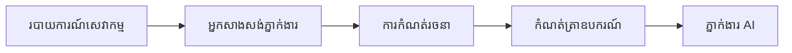

# 🎨 គំរូរចនាប័ទ្ម Agentic ជាមួយ Azure OpenAI (Responses API) (.NET)

## 📋 គោលបំណងការរៀន

ឧទាហរណ៍នេះបង្ហាញពីគំរូរចនាប័ទ្មកម្រិតសហគ្រាសសម្រាប់ការបង្កើតមេឃ្លាំងខ្លាំង ដោយប្រើ Microsoft Agent Framework នៅក្នុង .NET ជាមួយការតភ្ជាប់ Azure OpenAI (Responses API)។ អ្នកនឹងបានរៀនពីគំរូវិជ្ជាជីវៈ និងវិធីសាស្រ្តស្ថាបត្យកម្មដែលធ្វើឲ្យមេឃ្លាំងប្រែជា​អាចប្រើបានក្នុងផលិតកម្ម អាចថែរក្សា និងអាចពង្រីកបាន៕

### គំរូរចនាប័ទ្មសហគ្រាស

- 🏭 **Factory Pattern**: ការបង្កើតមេឃ្លាំងមានស្តង់ដារជាមួយការចាក់ផ្សំអាស្រ័យភាព
- 🔧 **Builder Pattern**: ការកំណត់រចនាប័ទ្ម និងការតំឡើងម៉ាស៊ីនមេឃ្លាំងយ៉ាងវាហ្វ្លូអិន
- 🧵 **Thread-Safe Patterns**: ការគ្រប់គ្រងសន្ទស្សន៍ជាច្រើន​តែម្តង
- 📋 **Repository Pattern**: ការរៀបចំឧបករណ៍ និងសមត្ថភាព

## 🎯 អត្ថប្រយោជន៍ស្ថាបត្យកម្មជាក់លាក់នៃ .NET

### លក្ខណៈសម្បត្តិសហគ្រាស

- **Typing ខ្លាំង**: ការត្រួតពិនិត្យពេលកុំភាគ និងការគាំទ្ររបស់ IntelliSense
- **Dependency Injection**: ការរួមបញ្ចូលប្រអប់ DI ដែលមានស្រេច
- **ការគ្រប់គ្រងរចនាសម្ព័ន្ធ**: ខ្នាត IConfiguration និង គំរូជម្រើស
- **Async/Await**: ការគាំទ្រកម្មវិធីអសន្ឋិនភាពជាន់ខ្ពស់

### គំរូសម្រាប់ផលិតកម្ម

- **ការរួមបញ្ចូលកំណត់ត្រា**: ILogger និងគាំទ្រកំណត់ត្រាទ្រង់ទ្រាយ
- **ការត្រួតពិនិត្យសុខភាព**: ការត្រួតពិនិត្យនិងរោទិ៍មានស្រេច
- **ការត្រួតពិនិត្យរចនាសម្ព័ន្ធ**: Typing ខ្លាំងជាមួយការសម្គាល់ទិន្នន័យ
- **ការគ្រប់គ្រងកំហុស**: ការគ្រប់គ្រងករណីកើតកំហុសទ្រង់ទ្រាយ

## 🔧 ស្ថាបត្យកម្មបច្ចេកទេស

### សមាសភាគមូលដ្ឋាន .NET

- **Microsoft.Extensions.AI**: ការតំណាងសេវា AI លំដាប់តែមួយ
- **Microsoft.Agents.AI**: សំណុំបែបបទចងក្រងមេឃ្លាំងសហគ្រាស
- **Azure OpenAI (Responses API)**: គំរូអតិថិជន API ប្រសិទ្ធភាពខ្ពស់
- **ប្រព័ន្ធរចនាសម្ព័ន្ធ**: appsettings.json និងការរួមបញ្ចូលបរិយាកាស

### ការអនុវត្តគំរូរចនាប័ទ្ម



## 🏗️ គំរូសហគ្រាសដែលបានបង្ហាញ

### 1. **គំរូការបង្កើត**

- **Agent Factory**: ការបង្កើតមេឃ្លាំងមូលដ្ឋានជាមួយការកំណត់រចនាប័ទ្មស្របគ្នា
- **Builder Pattern**: API វាហ្វ្លូសម្រាប់ការកំណត់រចនាប័ទ្មមេឃ្លាំងស្មុគស្មាញ
- **Singleton Pattern**: ការចែករំលែកធនធាន និងការគ្រប់គ្រងរចនាសម្ព័ន្ធ
- **Dependency Injection**: ការចាក់ផ្សំទំនាក់ទំនងដាច់ដោយឡែក និងការធ្វើតេស្តបាន

### 2. **គំរូអាកប្បកិរិយា**

- **Strategy Pattern**: យុទ្ធសាស្ត្រអនុវត្តឧបករណ៍ដែលអាចប្តូរបាន
- **Command Pattern**: ប្រតិបត្តិការ agent ដែលបានបិទបិសាចជាមួយការលុបតាមក្រោយ/កែប្រែ
- **Observer Pattern**: ការគ្រប់គ្រងជីវិតមេឃ្លាំងដោយផ្អែកលើព្រឹត្តិការណ៍
- **Template Method**: របៀបអនុវត្តមេឃ្លាំងស្តង់ដារ

### 3. **គំរូរចនាសម្ព័ន្ធ**

- **Adapter Pattern**: ស្រទាប់ការរួមបញ្ចូល Azure OpenAI (Responses API)
- **Decorator Pattern**: ការកែលម្អសមត្ថភាពមេឃ្លាំង
- **Facade Pattern**: មុខងារផ្ទេសផ្ទាត់សមាសភាគមេឃ្លាំង
- **Proxy Pattern**: ការផ្ទុកយឺតនិងបង្កេីតនូវការផ្ទុកក្នុងចាំសម្រាប់ប្រសិទ្ធភាព

## 📚 គោលការណ៍រចនា .NET

### គោលការណ៍ SOLID

- **កាតព្វកិច្ចតែមួយ**: សមាសភាគម្នាក់មានគោលបំណងច្បាស់មួយ
- **បើក/បិទ**: អាចពង្រីកបានដោយមិនបំលែង
- **ការជំនួស Liskov**: ការអនុវត្តឧបករណ៍ដោយផ្អែកលើផ្ទៃមុខ
- **បំបែកផ្ទៃមុខ**: ផ្ទៃមុខមួយផ្តោតអារម្មណ៍ និងល្អបំព្រួល
- **ការបញ្ច្រាស់ការអាស្រ័យ**: អាស្រ័យលើការតំណាង មិនមែនលើសាច់ប្រាក់

### ស្ថាបត្យកម្មស្អាត

- **ស្រទាប់ដែនដី**: ការតំណាងមេឃ្លាំង និងឧបករណ៍ស្នូល
- **ស្រទាប់កម្មវិធី**: ការរៀបចំមេឃ្លាំង និងបែបបទផ្លូវការងារ
- **ស្រទាប់ហេដ្ឋារចនាសម្ព័ន្ធ**: ការរួមបញ្ចូល Azure OpenAI (Responses API) និងសេវាកម្មខាងក្រៅ
- **ស្រទាប់បង្ហាញ**: អន្តរកម្មអ្នកប្រើ និងទ្រង់ទ្រាយការឆ្លើយតប

## 🔒 ការពិចារណាសហគ្រាស

### សន្តិសុខ

- **ការគ្រប់គ្រងសម្ងាត់សំងាត់**: ការដោះស្រាយកូនសោ API ដែលមានសុវត្ថិភាពជាមួយ IConfiguration
- **ការត្រួតពិនិត្យការបញ្ចូល**: Typing ខ្លាំង និងការត្រួតពិនិត្យលេខាធិការណ៍ទិន្នន័យ
- **ការសុវត្ថិភាពការចេញ**: ការប្រតិបត្តិសុវត្ថិភាព និងការតម្រង
- **កំណត់ត្រាការត្រួតពិនិត្យ**: ការតាមដានប្រតិបត្តការជារួម

### ប្រសិទ្ធភាព

- **គំរូ Async**: ប្រតិបត្តិការអ៊ី/អ៊ិអូដោយមិនរាំងខ្ទប់
- **ការបូកការតភ្ជាប់**: ការគ្រប់គ្រងអតិថិជន HTTP ទន់ភ្លន់
- **ការផ្ទុកក្នុងចាំ**: ការផ្ទុកក្នុងចាំចម្លើយសម្រាប់ការកែលម្អប្រសិទ្ធភាព
- **ការគ្រប់គ្រងធនធាន**: ការជម្រះ និងការសម្អាតជាដំណើរ

### ការពង្រីក

- **សុវត្ថិភាពស្រទាប់**: គាំទ្រការអនុវត្តមេឃ្លាំងមួយច្រើនក្នុងខ្សែព្រោះ
- **ការបូកធនធាន**: ការប្រើប្រាស់ធនធានប្រសិទ្ធភាព
- **ការគ្រប់គ្រងបន្ទុក**: ការមានដែនកំណត់អត្រា និងការគ្រប់គ្រងសំពាធក្រោយ
- **ការត្រួតពិនិត្យ**: គណនាមេនបច្ចេកទេស និងការត្រួតពិនិត្យសុខភាព

## 🚀 ការដាក់បញ្ចូលក្នុងផលិតកម្ម

- **ការគ្រប់គ្រងរចនាសម្ព័ន្ធ**: ការកំណត់ជាក់លាក់បរិយាកាស
- **យុទ្ធសាស្ត្រកំណត់ត្រា**: កំណត់ត្រាទ្រង់ទ្រាយជាមួយអត្តសញ្ញាណភាព
- **ការគ្រប់គ្រងកំហុស**: ការគ្រប់គ្រងករណីកើតកំហុសជាសកលជាមួយការស្តារឡើងវិញត្រឹមត្រូវ
- **ការត្រួតពិនិត្យ**: ការបញ្ចូលទស្សនៈកម្មវិធី និងម៉ែត្រប្រសិទ្ធភាព
- **ការធ្វើតេស្ត**: ការធ្វើតេស្តអង្គភាព តេស្តបញ្ចូល និងគំរូធ្វើតេស្តបន្ទុក

ត្រៀមខ្លួនសម្រាប់បង្កើតមេឃ្លាំងខ្លាំងកម្រិតសហគ្រាសជាមួយ .NET រួចហើយ? មកបង្កើតរចនាសម្ព័ន្ធយ៉ាងរឹងមាំ! 🏢✨

## 🚀 ការចាប់ផ្តើម

### លក្ខខណ្ឌមុន

- [.NET 10 SDK](https://dotnet.microsoft.com/download/dotnet/10.0) ឬខ្ពស់ជាងនេះ
- ការជាវ [Azure subscription](https://azure.microsoft.com/free/) ដែលមានធនធាន Azure OpenAI និងការបញ្ចូលម៉ូដែល
- អ្នកប្រើប្រាស់ [Azure CLI](https://learn.microsoft.com/cli/azure/install-azure-cli) — ចូលគណនីដោយប្រើ `az login`

### អថេរបរិស្ថានដែលទាមទារ

```bash
# zsh/bash
export AZURE_OPENAI_ENDPOINT=https://<your-resource>.openai.azure.com
export AZURE_OPENAI_DEPLOYMENT=gpt-4o-mini
# បន្ទាប់មកចូលគណនីដើម្បីឲ្យ AzureCliCredential អាចទទួលបានសញ្ញាអនុញ្ញាតិបាន
az login
```

```powershell
# PowerShell
$env:AZURE_OPENAI_ENDPOINT = "https://<your-resource>.openai.azure.com"
$env:AZURE_OPENAI_DEPLOYMENT = "gpt-4o-mini"
# បន្ទាប់មកចុះឈ្មោះដើម្បីឱ្យ AzureCliCredential អាចទទួលបានស្លាកសញ្ញា
az login
```

### លំហូរកូដឧទាហរណ៍

ដើម្បីរត់ឧទាហរណ៍កូដ,

```bash
# zsh/bash
chmod +x ./03-dotnet-agent-framework.cs
./03-dotnet-agent-framework.cs
```

ឬប្រើ dotnet CLI:

```bash
dotnet run ./03-dotnet-agent-framework.cs
```

មើល [`03-dotnet-agent-framework.cs`](../../../../03-agentic-design-patterns/code_samples/03-dotnet-agent-framework.cs) សម្រាប់កូដពេញលេញ។

```csharp
#!/usr/bin/dotnet run

#:package Microsoft.Extensions.AI@10.*
#:package Microsoft.Agents.AI.OpenAI@1.*-*
#:package Azure.AI.OpenAI@2.1.0
#:package Azure.Identity@1.13.1

using System.ComponentModel;

using Microsoft.Agents.AI;
using Microsoft.Extensions.AI;

using Azure.AI.OpenAI;
using Azure.Identity;

// Tool Function: Random Destination Generator
// This static method will be available to the agent as a callable tool
// The [Description] attribute helps the AI understand when to use this function
// This demonstrates how to create custom tools for AI agents
[Description("Provides a random vacation destination.")]
static string GetRandomDestination()
{
    // List of popular vacation destinations around the world
    // The agent will randomly select from these options
    var destinations = new List<string>
    {
        "Paris, France",
        "Tokyo, Japan",
        "New York City, USA",
        "Sydney, Australia",
        "Rome, Italy",
        "Barcelona, Spain",
        "Cape Town, South Africa",
        "Rio de Janeiro, Brazil",
        "Bangkok, Thailand",
        "Vancouver, Canada"
    };

    // Generate random index and return selected destination
    // Uses System.Random for simple random selection
    var random = new Random();
    int index = random.Next(destinations.Count);
    return destinations[index];
}

// Azure OpenAI with the Responses API (stable v1 endpoint). Sign in with `az login`.
var azureEndpoint = Environment.GetEnvironmentVariable("AZURE_OPENAI_ENDPOINT")
    ?? throw new InvalidOperationException("AZURE_OPENAI_ENDPOINT is not set.");
var deployment = Environment.GetEnvironmentVariable("AZURE_OPENAI_DEPLOYMENT") ?? "gpt-4o-mini";

var azureClient = new AzureOpenAIClient(new Uri(azureEndpoint), new AzureCliCredential());

// Define Agent Identity and Comprehensive Instructions
// Agent name for identification and logging purposes
var AGENT_NAME = "TravelAgent";

// Detailed instructions that define the agent's personality, capabilities, and behavior
// This system prompt shapes how the agent responds and interacts with users
var AGENT_INSTRUCTIONS = """
You are a helpful AI Agent that can help plan vacations for customers.

Important: When users specify a destination, always plan for that location. Only suggest random destinations when the user hasn't specified a preference.

When the conversation begins, introduce yourself with this message:
"Hello! I'm your TravelAgent assistant. I can help plan vacations and suggest interesting destinations for you. Here are some things you can ask me:
1. Plan a day trip to a specific location
2. Suggest a random vacation destination
3. Find destinations with specific features (beaches, mountains, historical sites, etc.)
4. Plan an alternative trip if you don't like my first suggestion

What kind of trip would you like me to help you plan today?"

Always prioritize user preferences. If they mention a specific destination like "Bali" or "Paris," focus your planning on that location rather than suggesting alternatives.
""";

// Create AI Agent with Advanced Travel Planning Capabilities
// Get the Responses client for the deployment and create the AI agent
// Configure agent with name, detailed instructions, and available tools
// This demonstrates the .NET agent creation pattern with full configuration
AIAgent agent = azureClient
    .GetOpenAIResponseClient(deployment)
    .CreateAIAgent(
        name: AGENT_NAME,
        instructions: AGENT_INSTRUCTIONS,
        tools: [AIFunctionFactory.Create(GetRandomDestination)]
    );

// Create New Conversation Thread for Context Management
// Initialize a new conversation thread to maintain context across multiple interactions
// Threads enable the agent to remember previous exchanges and maintain conversational state
// This is essential for multi-turn conversations and contextual understanding
AgentThread thread = agent.GetNewThread();

// Execute Agent: First Travel Planning Request
// Run the agent with an initial request that will likely trigger the random destination tool
// The agent will analyze the request, use the GetRandomDestination tool, and create an itinerary
// Using the thread parameter maintains conversation context for subsequent interactions
await foreach (var update in agent.RunStreamingAsync("Plan me a day trip", thread))
{
    await Task.Delay(10);
    Console.Write(update);
}

Console.WriteLine();

// Execute Agent: Follow-up Request with Context Awareness
// Demonstrate contextual conversation by referencing the previous response
// The agent remembers the previous destination suggestion and will provide an alternative
// This showcases the power of conversation threads and contextual understanding in .NET agents
await foreach (var update in agent.RunStreamingAsync("I don't like that destination. Plan me another vacation.", thread))
{
    await Task.Delay(10);
    Console.Write(update);
}
```

---

<!-- CO-OP TRANSLATOR DISCLAIMER START -->
**ការបដិសេធ**:
ឯកសារនេះត្រូវបានបម្លែងភាសា ដោយប្រើសេវាបម្លែងភាសា AI [Co-op Translator](https://github.com/Azure/co-op-translator)។ ទោះយើងខ្ញុំមានក្តីប្រាថ្នាឱ្យបានច្បាស់លាស់ តែសូមយល់ដឹងថាការបម្លែងដោយស្វ័យប្រវត្តិក៏អាចមានកំហុសឬភាពមិនត្រឹមត្រូវ។ ឯកសារដើមជាភាសាទីតាំងគួរត្រូវបានគេប្រើជាប្រភពច្បាស់លាស់។ សម្រាប់ព័ត៌មានសំខាន់ៗ សូមណែនាំឱ្យប្រើប្រាស់ការប្រែដោយមនុស្សជំនាញ។ យើងខ្ញុំមិនទទួលខុសត្រូវចំពោះការយល់ច្រឡំ ឬការបកស្រាយខុសបន្ទាប់ពីការប្រើប្រាស់ការបម្លែងនេះនោះទេ។
<!-- CO-OP TRANSLATOR DISCLAIMER END -->