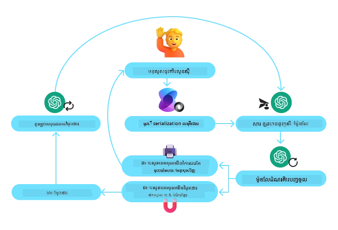
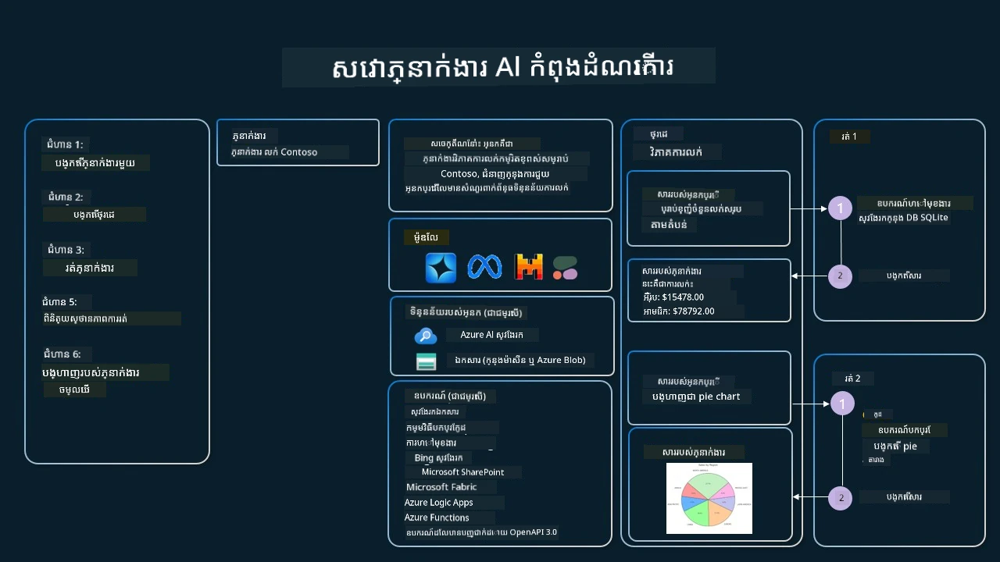

[](https://youtu.be/vieRiPRx-gI?si=cEZ8ApnT6Sus9rhn)

> _(ចុចលើរូបភាពខាងលើដើម្បីមើលវីដេអូមេរៀននេះ)_

# លំនាំការរចនាការប្រើឧបករណ៍

ឧបករណ៍គឺគួរឱ្យចាប់អារម្មណ៍ ពីព្រោះវា​អនុញ្ញាតឲ្យភ្នាក់ងារបញ្ញាសិប្បនិម្មិតមានលក្ខណៈសម្បត្តិ​ដែលទូលាយជាងមុន។ មិនមែនភ្នាក់ងារមានសកម្មភាពកំណត់តែប៉ុណ្ណោះទេ តែដោយបន្ថែមឧបករណ៍ មិត្តភក្តិអាចអនុវត្តសកម្មភាពជាច្រើនប្រភេទបានច្រើន​ជាងមុន។ នៅក្នុងបណ្ឌិតនេះ យើងនឹងមើលលំនាំការរចនាការប្រើឧបករណ៍ ដែលពិពណ៌នាថាយ៉ាងដូចម្តេចដែលភ្នាក់ងារបញ្ញាសិប្បនិម្មិតអាចប្រើឧបករណ៍ជាក់លាក់ ដើម្បីសម្រេចគោលបំណងរបស់ពួកគេ។

## ការណែនាំ

ក្នុងមេរៀននេះ យើងកំពុងស្វែងរកចម្លើយសម្រាប់សំណួរដូចខាងក្រោម៖

- លំនាំការរចនាការប្រើឧបករណ៍គឺជាអ្វី?
- តើវាអាចអនុវត្តទៅករណីប្រើប្រាស់ណាខ្លះ?
- តើមានធាតុ/ប្លក់សំណង់អ្វីខ្លះដែលត្រូវការដើម្បីអនុវត្តលំនាំការរចនានេះ?
- តើមានការពិចារណាពិសេសអ្វីខ្លះសម្រាប់ការប្រើលំនាំការរចនាការប្រើឧបករណ៍ ដើម្បីបង្កើតភ្នាក់ងារអេហ្វអាយដែលគួរឱ្យទុកចិត្ត?

## គោលដៅការសិក្សា

បន្ទាប់ពីបញ្ចប់មេរៀននេះ អ្នកនឹងអាច៖

- កំណត់លំនាំការរចនាការប្រើឧបករណ៍ និងគោលបំណងរបស់វា។
- សម្គាល់ករណីប្រើប្រាស់ដែលលំនាំការរចនាការប្រើឧបករណ៍អាចអនុវត្តបាន។
- យល់ដឹងពីធាតុសំខាន់ៗដែលត្រូវការដើម្បីអនុវត្តលំនាំការរចនា។
- យល់ដឹងពីការពិចារណា ដើម្បីធានាថាភ្នាក់ងារអេហ្វអាយដែលប្រើលំនាំនេះមានភាពទុកចិត្ត។

## លំនាំការរចនាការប្រើឧបករណ៍គឺជាអ្វី?

**លំនាំការរចនាការប្រើឧបករណ៍** ផ្តោតលើការផ្តល់សមត្ថភាពឲ្យ LLMs អាចទំនាក់ទំនងជាមួយឧបករណ៍ខាងក្រៅ ដើម្បីសម្រេចគោលបំណងជាក់លាក់។ ឧបករណ៍គឺជាសូفتវែរ​កូដដែលភ្នាក់ងារអាចប្រតិបត្តិ ដើម្បីអនុវត្តសកម្មភាពមួយ។ ឧបករណ៍អាចជាអនុគមន៍សាមញ្ញដូចជាកាល់គ្លេទ័រ ឬជាការហៅ API ទៅកាន់សេវាកម្មភាគីទីបី ដូចជាការស្វែងរកតម្លៃភាគហ៊ុន ឬការព្យាករណ៍អាកាសធាតុ។ ក្នុងបរិបទជាភ្នាក់ងារអេហ្វអាយ ឧបករណ៍ត្រូវបានរចនាឡើងដើម្បីអនុវត្តដោយភ្នាក់ងារជាការឆ្លើយតបនឹង **ការហៅអនុគមន៍ដោយម៉ូឌែលបង្កើត**។

## តើវាអាចអនុវត្តទៅករណីប្រើប្រាស់ណាខ្លះ?

ភ្នាក់ងារអេហ្វអាយអាចប្រើឧបករណ៍បាន ដើម្បីបញ្ចប់ភារកិច្ចស្មុគស្មាញ ស្តុកព័ត៌មាន សោះដឹងព័ត៌មាន ឬធ្វើសេចក្តីសម្រេចចិត្ត។ លំនាំការរចនាការប្រើឧបករណ៍ ត្រូវបានប្រើជាញឹកញាប់នៅក្នុងករណីដែលត្រូវការជួបប្រទៈឆ្លើយតប δυναμικនឹងប្រព័ន្ធខាងក្រៅ ដូចជា ឃ្លាំងទិន្នន័យ សេវាវេប ឬឧបករណ៍បកស្រាយកូដ។ សមត្ថភាពនេះមានប្រយោជន៍សម្រាប់ករណីប្រើប្រាស់ជាច្រើន ដូចជា៖

- **ការស្វែងយល់ព័ត៌មានរហ័សរហួន:** ភ្នាក់ងារអាចស្នើសុំ API ឬឃ្លាំងទិន្នន័យខាងក្រៅ ដើម្បីយកទិន្នន័យថ្មីៗ (ឧ. ស្នើសុំទិន្នន័យពី SQLite សម្រាប់វិភាគទិន្នន័យ ស្វែងរកតម្លៃភាគហ៊ុន ឬព័ត៌មានអាកាសធាតុ)។
- **ការប្រតិបត្ដិកូដ និងបកស្រាយ:** ភ្នាក់ងារអាចប្រតិបត្ដិកូដ ឬស្គ្រីប ដើម្បីដោះស្រាយបញ្ហាគណិតវិទ្យា បង្កើតរបាយការណ៍ ឬអនុវត្តសមាហរណកម្ម។
- **ស្វ័យប្រវត្តិសកម្មភាព:** បញ្ចូលកម្មវិធីបើកធ្វើឡើងស្វ័យប្រវត្តិ ដោយបញ្ចូលឧបករណ៍ដូចជាកម្មវិធីកំណត់កាលវិភាគ សេវាអ៊ីមែល ឬបញ្ជីផ្លូវទិន្នន័យ។
- **ការគាំទ្រអតិថិជន:** ភ្នាក់ងារអាចទំនាក់ទំនងជាមួយប្រព័ន្ធ CRM វេទិកាទំនាក់ទំនង ឬមូលដ្ឋានចំណេះដឹង ដើម្បីដោះស្រាយសំណួរអ្នកប្រើ។
- **ការបង្កើត និងកែប្រែខ្លឹមសារ:** ភ្នាក់ងារអាចប្រើឧបករណ៍ដូចជាកម្មវិធីត្រួតពិនិត្យវេយ្យាករណ៍ ជំនួយសន្ទស្សន៍អត្ថបទ ឬកម្មវិធីវាយតម្លៃសុវត្ថិភាពខ្លឹមសារ ដើម្បីជួយបង្កើតខ្លឹមសារជំនួយ។

## តើមានធាតុ/ប្លក់សំណង់អ្វីខ្លះដែលត្រូវការដើម្បីអនុវត្តលំនាំការរចនាការប្រើឧបករណ៍?

ប្លក់សំណង់ទាំងនេះអនុញ្ញាតឲ្យភ្នាក់ងារអេហ្វអាយអាចអនុវត្តភារកិច្ចបានជាច្រើនប្រភេទ។ យើងចាំមើលធាតុសំខាន់ៗដែលត្រូវការដើម្បីអនុវត្តលំនាំការរចនាការប្រើឧបករណ៍ៈ

- **ស្កីមាអនុគមន៍/ឧបក្ខរៈ**៖ ការកំណត់លម្អិតនៃឧបករណ៍ដែលមាន នៅពាក់ព័ន្ធនឹងឈ្មោះអនុគមន៍ គោលបំណង ប៉ារ៉ាម៉ែត្រដែលត្រូវការ និងទិន្នន័យលទ្ធផលដែលរំពឹងទុក។ ស្កីម៉ាដែលអនុញ្ញាតឲ្យ LLM យល់ថាឧបករណ៍ណាត្រូវមាន និងធ្វើដើម្បីស្នើសុំត្រឹមត្រូវ។

- **យុទ្ធសាស្ត្រប្រតិបត្ដិការ Function**៖ គ្រប់គ្រងរបៀបនិងពេលវេលាដែលឧបករណ៍ត្រូវបានហៅ ដោយផ្អែកលើបំណងអ្នកប្រើ និងបរិបទសន្ទនា។ វាអាចរួមបញ្ចូលម៉ូឌុលផែនការ មេកានិចបញ្ជូន ឬចរន្តលក្ខខណ្ឌដែលកំណត់ការប្រើឧបករណ៍ក្នុងរបៀបតាមដំណើរដោយស្វ័យប្រវត្តិ។

- **ប្រព័ន្ធគ្រប់គ្រងសារយោង**៖ ធាតុដែលគ្រប់គ្រងចរន្តសន្ទនា រវាងបញ្ចូលពីអ្នកប្រើ ការឆ្លើយតបពី LLM ការហៅឧបករណ៍ និងលទ្ធផលឧបករណ៍។

- **ស្ថាបត្យកម្មការចងក្រងឧបករណ៍**៖ រចនាសម្ព័ន្ធដែលភ្ជាប់ភ្នាក់ងារជាមួយឧបករណ៍ផ្សេងៗ មិនថាជាអនុគមន៍សាមញ្ញ ឬសេវាកម្មខាងក្រៅស្មុគស្មាញ។

- **ការគ្រប់គ្រងកំហុស និងផ្ទៀងផ្ទាត់**៖ មេកានិចដើម្បីគ្រប់គ្រងការបរាជ័យក្នុងការប្រតិបត្ដិការឧបករណ៍ ផ្ទៀងផ្ទាត់ប៉ារ៉ាម៉ែត្រ និងគ្រប់គ្រងការឆ្លើយតបដែលមិនរំពឹងទុក។

- **ការគ្រប់គ្រងស្ថានភាព**៖ តាមដានបរិបទសន្ទនា ការប្រើឧបករណ៍មុនៗ និងទិន្នន័យអចិន្រ្តៃ័យ ដើម្បីធានាការស្របគ្នា ឆ្លងកាត់ការប្រាស្រ័យពហុជំលួស។

បន្ទាប់មក យើងចាំមើលការហៅអនុគមន៍/ឧបករណ៍លម្អិតបន្ថែម។
 
### ការហៅអនុគមន៍/ឧបករណ៍

ការហៅអនុគមន៍គឺជាវិធីស្នូលដែលអនុញ្ញាតឲ្យម៉ូឌែលភាសាធំៗ (LLMs) ទំនាក់ទំនងជាមួយឧបករណ៍។ អ្នកភាគច្រើននឹងមើលឃើញពាក្យ 'Function' និង 'Tool' ត្រូវបានប្រើប្រាស់ជាប្រាក់ប្រដាប់គ្នា ព្រោះ 'អនុគមន៍' គឺជាប្លុកកូដដែលអាចប្រើឡើងវិញ ហើយវាជា 'ឧបករណ៍' ដែលភ្នាក់ងារ​ប្រើប្រាស់ដើម្បីអនុវត្តភារកិច្ច។ ដើម្បីអនុវត្តកូដអនុគមន៍មួយ ត្រូវឲ្យ LLM ប្រៀបធៀបការស្នើរសុំរបស់អ្នកប្រើ ជាមួយការពិពណ៌នាអនុគមន៍។ ដើម្បីធ្វើនេះ ស្កីម៉ាដែលមានការពិពណ៌នាអនុគមន៍ទាំងអស់ ត្រូវបានផ្ញើទៅ LLM។ LLM នឹងជ្រើសអនុគមន៍សមរម្យបំផុតសម្រាប់ភារកិច្ច ហើយបញ្ចេញឈ្មោះនិងអាគុយម៉ង់។ អនុគមន៍ដែលបានជ្រើសរើសនឹងត្រូវបានហៅ ហើយលទ្ធផលត្រូវបានផ្ញើត្រឡប់ទៅ LLM ដែលប្រើព័ត៌មានដើម្បីឆ្លើយតបនឹងការស្នើសុំរបស់អ្នកប្រើ។

សម្រាប់អ្នកអwickembangkan ក្នុងការអនុវត្តការហៅអនុគមន៍សម្រាប់ភ្នាក់ងារ អ្នកនឹងត្រូវការពីរចំនួន៖

១. ម៉ូឌែល LLM ដែលគាំទ្រការហៅអនុគមន៍
២. ស្កីម៉ាដែលមានការពិពណ៌នាអនុគមន៍
៣. កូដសម្រាប់អនុគមន៍និមួយៗដែលបានពិពណ៌នា

យើងសូមយកឧទាហរណ៍នេះសម្រាប់ការទទួលពេលវេលាបច្ចុប្បន្ននៅក្នុងទីក្រុងមួយដើម្បីបង្ហាញ៖

១. **ចាប់ផ្តើមម៉ូឌែល LLM ដែលគាំទ្រការហៅអនុគមន៍៖**

    មិនមែនម៉ូឌែលទាំងអស់គាំទ្រការហៅអនុគមន៍ទេ ដូច្នេះចាំបាច់ត្រូវពិនិត្យមើលថា LLM ដែលអ្នកប្រើគាំទ្រឬទេ។ <a href="https://learn.microsoft.com/azure/ai-services/openai/how-to/function-calling" target="_blank">Azure OpenAI</a> គាំទ្រការហៅអនុគមន៍។ យើងអាចចាប់ផ្តើមដោយបង្កើតអតិថិជន OpenAI ប្រឆាំងនឹង Azure OpenAI **Responses API** (ចំណុចចូលផ្លូវដែលមានស្ថិរភាព `/openai/v1/` — មិនចាំបាច់មាន `api_version`)។

    ```python
    # កំណត់ចាប់ផ្តើមអ្នកអតិថិជន OpenAI សម្រាប់ Azure OpenAI (Responses API, ចុងភៅ v1)
    client = OpenAI(
        base_url=f"{os.environ['AZURE_OPENAI_ENDPOINT'].rstrip('/')}/openai/v1/",
        api_key=os.environ["AZURE_OPENAI_API_KEY"],
    )
    deployment_name = os.environ["AZURE_OPENAI_DEPLOYMENT"]
    ```

២. **បង្កើតស្កីម៉ាអនុគមន៍**:

    បន្ទាប់មកយើងនឹងកំណត់ស្កីម៉ា JSON ដែលមានឈ្មោះអនុគមន៍ ការពិពណ៌នាអំពីអ្វីដែលអនុគមន៍ធ្វើ និងឈ្មោះ និងការពិពណ៌នារបស់ប៉ារ៉ាម៉ែត្រ។ 
    យើងនឹងបញ្ជូនស្កីម៉ានេះទៅអតិថិជនដែលបានបង្កើតមុននេះ ជាមួយនឹងសំណើរបស់អ្នកប្រើសម្រាប់ស្វែងរកពេលវេលានៅទីក្រុង San Francisco។ ចំណុចដែលគួរបញ្ជាក់គឺថា **ការហៅឧបករណ៍** ជាលទ្ធផលដែលត្រូវបានត្រឡប់មកវិញ មិនមែនចម្លើយចុងក្រោយនៃសំណួរទេ។ ដូចដែលបានចែងពីមុន LLM បញ្ចេញឈ្មោះអនុគមន៍ដែលបានជ្រើស និងអាគុយម៉ង់ដែលនឹងផ្ញើទៅវា។

    ```python
    # ការពណ៌នាអំពីមុខងារសម្រាប់ម៉ូដែលដើម្បីអាន (ទ្រង់ទ្រាយឧបករណ៍ flat API ពីរេសបន)
    tools = [
        {
            "type": "function",
            "name": "get_current_time",
            "description": "Get the current time in a given location",
            "parameters": {
                "type": "object",
                "properties": {
                    "location": {
                        "type": "string",
                        "description": "The city name, e.g. San Francisco",
                    },
                },
                "required": ["location"],
            },
        }
    ]
    ```
   
    ```python
  
    # សាររបស់អ្នកប្រើដំបូង
    messages = [{"role": "user", "content": "What's the current time in San Francisco"}]

    # ការហៅ API ដំបូង: ស្នើឱ្យម៉ូឌែលប្រើមុខងារ
    response = client.responses.create(
        model=deployment_name,
        input=messages,
        tools=tools,
        tool_choice="auto",
        store=False,
    )

    # API ឆ្លើយតបត្រឡប់ការហៅឧបករណ៍ជាធាតុលេខ function_call នៅក្នុង response.output។
    # ដាក់បន្តពួកវាចូលក្នុងការសន្ទនាដើម្បីឱ្យម៉ូឌែលមានបរិបទពេញលេញនៅជំហានបន្ទាប់។
    messages += response.output

    print("Model's response:")
    print(response.output)
  
    ```

    ```bash
    Model's response:
    [ResponseFunctionToolCall(arguments='{"location":"San Francisco"}', call_id='call_pOsKdUlqvdyttYB67MOj434b', name='get_current_time', type='function_call')]
    ```
  
៣. **កូដអនុគមន៍ដែលត្រូវការ ដើម្បីអនុវត្តភារកិច្ច៖**

    ឥឡូវនេះដែល LLM បានជ្រើសអនុគមន៍ដែលត្រូវអនុវត្ត កូដសម្រាប់អនុវត្តភារកិច្ចត្រូវបានរចនានិងបញ្ចេញប្រតិបត្តិការក្នុងពេលត្រឹមត្រូវ។
    យើងអាចសរសេរកូដទទួលពេលវេលាបច្ចុប្បន្នដោយប្រើ Python។ អ្នកក៏ត្រូវការសរសេរកូដដើម្បីដកឈ្មោះ និងអាគុយម៉ង់ពី response_message ដើម្បីទទួលលទ្ធផលចុងក្រោយផងដែរ។

    ```python
      def get_current_time(location):
        """Get the current time for a given location"""
        print(f"get_current_time called with location: {location}")  
        location_lower = location.lower()
        
        for key, timezone in TIMEZONE_DATA.items():
            if key in location_lower:
                print(f"Timezone found for {key}")  
                current_time = datetime.now(ZoneInfo(timezone)).strftime("%I:%M %p")
                return json.dumps({
                    "location": location,
                    "current_time": current_time
                })
      
        print(f"No timezone data found for {location_lower}")  
        return json.dumps({"location": location, "current_time": "unknown"})
    ```

     ```python
    # គ្រប់គ្រងការហៅហ្គោល
    tool_calls = [item for item in response.output if item.type == "function_call"]
    if tool_calls:
        for tool_call in tool_calls:
            if tool_call.name == "get_current_time":

                function_args = json.loads(tool_call.arguments)

                time_response = get_current_time(
                    location=function_args.get("location")
                )

                # ត្រឡប់លទ្ធផលឧបករណ៍ជាផ្ទាំង function_call_output
                messages.append({
                    "type": "function_call_output",
                    "call_id": tool_call.call_id,
                    "output": time_response,
                })
    else:
        print("No tool calls were made by the model.")

    # ការហៅ API ជាលើកទីពីរ: ទទួលបានចម្លើយចុងក្រោយពីម៉ូដែល
    final_response = client.responses.create(
        model=deployment_name,
        input=messages,
        tools=tools,
        store=False,
    )

    return final_response.output_text
     ```

     ```bash
      get_current_time called with location: San Francisco
      Timezone found for san francisco
      The current time in San Francisco is 09:24 AM.
     ```

ការហៅអនុគមន៍គឺជាមូលដ្ឋានសំខាន់នៃរចនាការប្រើឧបករណ៍ភាគច្រើន ឬអាចជារបស់ទាំងអស់នៅភ្នាក់ងារ ប៉ុន្តែការអនុវត្តពីដើមអាចមានការលំបាកខ្លះ។
ដូចដែលយើងបានរៀនក្នុង [មេរៀន 2](../../../02-explore-agentic-frameworks) សេវាកម្មភ្នាក់ងារផ្តល់ឱ្យយើងនូវប្លុកសំណង់ដែលបានសង់រួច ទើបអាចអនុវត្តការប្រើឧបករណ៍បានយ៉ាងងាយស្រួល។
 
## ឧទាហរណ៍ក្នុងការប្រើឧបករណ៍ជាមួយសេវាកម្មភ្នាក់ងារ

ខាងក្រោមជាឧទាហរណ៍ពីរបៀបដែលអ្នកអាចអនុវត្តលំនាំការរចនាការប្រើឧបករណ៍ ដោយប្រើសេវាកម្មភ្នាក់ងារផ្សេងៗ៖

### សេវាកម្មភ្នាក់ងារមីក្រូសូហ្វធីង

<a href="https://learn.microsoft.com/azure/ai-services/agents/overview" target="_blank">សេវាកម្មភ្នាក់ងារមីក្រូសូហ្វធីង</a> គឺជាសេវាកម្មបញ្ញាសិប្បនិម្មិតបើកចំហ សម្រាប់បង្កើតភ្នាក់ងារអេហ្វអាយ។ វាដៃ=\-រហូតកាតព្វកិច្ចការប្រើ function calling ដោយអនុញ្ញាតឲ្យអ្នកកំណត់ឧបករណ៍ជា function Python ដែលមាន `@tool` decorator។ សេវាកម្មខាងនេះគ្រប់គ្រងការទំនាក់ទំនងត្រឡប់ទៅមករវាងម៉ូឌែល និងកូដរបស់អ្នកផងដែរ។ វាក៏ផ្តល់ឲ្យអ្នកនូវឧបករណ៍រួចហើយដូចជា File Search និង Code Interpreter តាមរយៈ `FoundryChatClient`។

គំនូរបង្ហាញខាងក្រោមបង្ហាញពីដំណើរការហៅអនុគមន៍ជាមួយសេវាកម្មភ្នាក់ងារមីក្រូសូហ្វធីង៖



ក្នុងសេវាកម្មភ្នាក់ងារមីក្រូសូហ្វធីង ឧបករណ៍ត្រូវបានកំណត់ជាអនុគមន៍ដែលបានដាក់ស្លាបព្រិល (decorate)។ យើងអាចបំលែងអនុគមន៍ `get_current_time` ដែលយើងបានមើលមុនសម្រាប់ធ្វើឧបករណ៍ដោយប្រើ `@tool` decorator។ សេវាកម្មនឹង serialize អនុគមន៍និងប៉ារ៉ាម៉ែត្រយ៉ាងស្វ័យប្រវត្តិ និងបង្កើតស្កីម៉ា ដើម្បីផ្ញើទៅ LLM។

```python
import os
from agent_framework import tool
from agent_framework.foundry import FoundryChatClient
from azure.identity import AzureCliCredential

@tool(approval_mode="never_require")
def get_current_time(location: str) -> str:
    """Get the current time for a given location"""
    ...

# បង្កើតអតិថិជន
provider = FoundryChatClient(
    project_endpoint=os.environ["AZURE_AI_PROJECT_ENDPOINT"],
    model=os.environ["AZURE_AI_MODEL_DEPLOYMENT_NAME"],
    credential=AzureCliCredential(),
)

# បង្កើតភ្នាក់ងារ ហើយរត់ជាមួយឧបករណ៍
agent = provider.as_agent(name="TimeAgent", instructions="Use available tools to answer questions.", tools=get_current_time)
response = await agent.run("What time is it?")
```
  
### សេវាកម្ម Microsoft Foundry Agent

<a href="https://learn.microsoft.com/azure/ai-services/agents/overview" target="_blank">សេវាកម្ម Microsoft Foundry Agent</a> គឺជាសេវាកម្មភ្នាក់ងារថ្មីដែលបានរចនាឡើងដើម្បីឲ្យអ្នកអwickembangអាចបង្កើត ប្រតិបត្តិ និងពង្រីកភ្នាក់ងារអេហ្វអាយដែលមានគុណភាពខ្ពស់បានយ៉ាងសុវត្ថិភាព ដោយមិនចាំបាច់គ្រប់គ្រងបរិក្ខារគណនា និងឃ្លាំងទិន្នន័យខាងក្រោម។ វាផ្តល់ប្រយោជន៍ចំពោះកម្មវិធីសហគ្រាស ពីព្រោះវាជាសេវាកម្មគ្រប់គ្រងពេញលេញដែលមានសុវត្ថិភាពជាក់លាក់របស់សហគ្រាស។

នៅពេលប្រៀបធៀបនឹងការអwickembangkanដោយផ្ទាល់ជាមួយ API LLM នោះ សេវាកម្ម Microsoft Foundry Agent ផ្តល់អត្ថប្រយោជន៍ដូចខាងក្រោម៖

- ហៅឧបករណ៍ដោយស្វ័យប្រវត្តិ – មិនចាំបាច់បកចែកការហៅឧបករណ៍ អនុវត្តឧបករណ៍ និងគ្រប់គ្រងចម្លើយទៀតទេ; រឿងទាំងនេះត្រូវធ្វើនៅខាងម៉ាស៊ីនមេ
- ទិន្នន័យគ្រប់គ្រងដោយសុវត្ថិភាព – មិនចាំបាច់គ្រប់គ្រងស្ថានភាពសន្ទនា ផ្ទេរទុកបានដោយ threads ដែលរក្សាទិន្នន័យអ្វីៗទាំងឡាយដែលអ្នកត្រូវការ
- ឧបករណ៍ត្រូវបានរៀបចំជាស្រេច – ឧបករណ៍ដែលអ្នកអាចប្រើសម្រាប់ទំនាក់ទំនងជាមួយប្រភពទិន្នន័យរបស់អ្នក ដូចជា Bing, Azure AI Search និង Azure Functions។

ឧបករណ៍ដែលមាននៅក្នុងសេវាកម្ម Microsoft Foundry Agent អាចចែកចេញជាប្រភេទពីរនៅខាងក្រោម៖

១. ឧបករណ៍ចំណេះដឹង៖
    - <a href="https://learn.microsoft.com/azure/ai-services/agents/how-to/tools/bing-grounding?tabs=python&pivots=overview" target="_blank">ស្រោចស្រង់ជាមួយ Bing Search</a>
    - <a href="https://learn.microsoft.com/azure/ai-services/agents/how-to/tools/file-search?tabs=python&pivots=overview" target="_blank">ការស្វែងរកឯកសារ</a>
    - <a href="https://learn.microsoft.com/azure/ai-services/agents/how-to/tools/azure-ai-search?tabs=azurecli%2Cpython&pivots=overview-azure-ai-search" target="_blank">Azure AI Search</a>

២. ឧបករណ៍សកម្មភាព៖
    - <a href="https://learn.microsoft.com/azure/ai-services/agents/how-to/tools/function-calling?tabs=python&pivots=overview" target="_blank">ការហៅអនុគមន៍</a>
    - <a href="https://learn.microsoft.com/azure/ai-services/agents/how-to/tools/code-interpreter?tabs=python&pivots=overview" target="_blank">កម្មវិធីបកស្រាយកូដ</a>
    - <a href="https://learn.microsoft.com/azure/ai-services/agents/how-to/tools/openapi-spec?tabs=python&pivots=overview" target="_blank">ឧបករណ៍ដែលបានកំណត់ដោយ OpenAPI</a>
    - <a href="https://learn.microsoft.com/azure/ai-services/agents/how-to/tools/azure-functions?pivots=overview" target="_blank">Azure Functions</a>

សេវាកម្មភ្នាក់ងារអនុញ្ញាតឲ្យយើងប្រើឧបករណ៍ទាំងនេះរួមគ្នាជា `toolset`។ វាក៏ប្រើ `threads` ដែលតាមដានប្រវត្តិសារពីសន្ទនាតែ១។

សូមស្មានថាអ្នកជាភ្នាក់ងារលក់នៅក្រុមហ៊ុន Contoso។ អ្នកចង់បង្កើតភ្នាក់ងារប្រាស្រ័យសម្តែងដែលអាចឆ្លើយសំណួរអំពីទិន្នន័យលក់របស់អ្នក។

រូបភាពខាងក្រោមបង្ហាញពីរបៀបដែលអ្នកអាចប្រើសេវាកម្ម Microsoft Foundry Agent ដើម្បីវិភាគទិន្នន័យលក់របស់អ្នក៖



ដើម្បីប្រើឧបករណ៍ណាមួយជាមួយសេវាកម្ម លោកអាចបង្កើតអតិថិជន ហើយកំណត់ឧបករណ៍ឬ toolset។ ដើម្បីអនុវត្តជាក់លាក់ អ្នកអាចប្រើកូដ Python ដូចខាងក្រោម។ LLM អាចមើលទៅលើ toolset ហើយសម្រេចចិត្តថាតើនឹងប្រើមុខងារដែលអ្នកប្រើបានបង្កើត `fetch_sales_data_using_sqlite_query` ឬ Code Interpreter ដែលបានបង្កើតរួចទៅតាមសំណើររបស់អ្នកប្រើ។

```python 
import os
from azure.ai.projects import AIProjectClient
from azure.identity import DefaultAzureCredential
from fetch_sales_data_functions import fetch_sales_data_using_sqlite_query # ហាង fetch_sales_data_using_sqlite_query ដែលអាចរកឃើញនៅក្នុងឯកសារ fetch_sales_data_functions.py។
from azure.ai.projects.models import ToolSet, FunctionTool, CodeInterpreterTool

project_client = AIProjectClient.from_connection_string(
    credential=DefaultAzureCredential(),
    conn_str=os.environ["PROJECT_CONNECTION_STRING"],
)

# កំណត់ឧបករណ៍ដំបូង
toolset = ToolSet()

# កំណត់ប្រតិបត្តិករ function calling agent ជាមួយនឹង fetch_sales_data_using_sqlite_query ហើយបន្ថែមវាទៅឧបករណ៍
fetch_data_function = FunctionTool(fetch_sales_data_using_sqlite_query)
toolset.add(fetch_data_function)

# កំណត់ឧបករណ៍ Code Interpreter ហើយបន្ថែមវាទៅឧបករណ៍។
code_interpreter = CodeInterpreterTool()toolset.add(code_interpreter)

agent = project_client.agents.create_agent(
    model="gpt-4o-mini", name="my-agent", instructions="You are helpful agent", 
    toolset=toolset
)
```

## តើមានការពិចារណាពិសេសអ្វីខ្លះសម្រាប់ការប្រើលំនាំការរចនាការប្រើឧបករណ៍ ដើម្បីបង្កើតភ្នាក់ងារអេហ្វអាយដែលគួរឱ្យទុកចិត្ត?

ការព្រួយបារម្ភទូទៅសម្រាប់ SQL ដែលបង្កើតដោយដៃគូ LLM គឺសុវត្ថិភាព ដែលមានហានិភ័យ SQL injection ឬសកម្មភាពអាក្រក់ ដូចជាការលុបចោល ឬបង្ហាប់ប្រែប្រួលក្នុងឃ្លាំងទិន្នន័យ។ ទោះបីមានការព្រួយបារម្ភជាក់លាក់ ប៉ុន្តាវាអាចលុបបំបាត់បានយ៉ាងប្រសើរដោយកំណត់សិទ្ធិចូលប្រើឃ្លាំងទិន្នន័យឲ្យត្រឹមត្រូវ។ សម្រាប់គ្រប់ឃ្លាំងទិន្នន័យ ភាគច្រើន ការកំណត់ឲ្យអានតែប៉ុណ្ណោះគឺជាជម្រើសសុវត្ថិភាព។ សម្រាប់សេវាឃ្លាំងទិន្នន័យដូចជា PostgreSQL ឬ Azure SQL គេគួរតែងតាំងកម្មវិធីជារូបមន្តដែលអាចអានតែ (SELECT) បាន។

ការរត់កម្មវិធីនៅបរិវេណសុវត្ថិភាពនឹងបន្ថែមការការពារច្រើនម្ដងទៀត។ នៅក្នុងសេណារីយ៉ូសហគ្រាស ទិន្នន័យភាគច្រើនត្រូវបានដកចេញ និងបំលែងពីប្រព័ន្ធប្រតិបត្តិការ ទៅក្នុងឃ្លាំងទិន្នន័យអានតែប៉ុណ្ណោះ ឬឃ្លាំងទិន្នន័យដែលមានសម្រួលសម្រាប់អ្នកប្រើ។ វិធីសាស្រ្តនេះធានាថាទិន្នន័យមានសុវត្ថិភាព ប្រសើរជាងសម្រាប់ប្រសិទ្ធភាពនិងសមាសភាពចូលដំណើរការ និងកម្មវិធីមានសិទ្ធិអានតែប៉ុណ្ណោះ។

## កូដឧទាហរណ៍

- Python: [Agent Framework](./code_samples/04-python-agent-framework.ipynb)
- .NET: [Agent Framework](./code_samples/04-dotnet-agent-framework.md)

## តើអ្នកមានសំណួរបន្ថែមអំពីលំនាំការរចនាការប្រើឧបករណ៍ទេ?

ចូលរួមក្រុម [Microsoft Foundry Discord](https://discord.com/invite/ATgtXmAS5D) ដើម្បីជួបជាមួយអ្នកសិក្សាផ្សេងទៀត ចូលរួមម៉ោងការិយាល័យ និងទទួលបានចម្លើយសំណួរអំពីភ្នាក់ងារអេហ្វអាយរបស់អ្នក។

## ឯកសារបន្ថែម

- <a href="https://microsoft.github.io/build-your-first-agent-with-azure-ai-agent-service-workshop/" target="_blank">សិក្ខាសាលាសេវាកម្មភ្នាក់ងារ Azure AI Agents</a>
- <a href="https://github.com/Azure-Samples/contoso-creative-writer/tree/main/docs/workshop" target="_blank">សិក្ខាសាលាភ្នាក់ងារអាជីពសិល្បៈ Contoso Creative Writer Multi-Agent</a>
- <a href="https://learn.microsoft.com/azure/ai-services/agents/overview" target="_blank">ទិដ្ឋភាពទូទៅសេវាកម្ម Microsoft Agent Framework</a>


## មេរៀនមុន

[ការយល់ដឹងអំពីរចនាសម្ព័ន្ធអេហ្ស៊ីន](../03-agentic-design-patterns/README.md)

## មេរៀនបន្ទាប់

[Agentic RAG](../05-agentic-rag/README.md)

---

<!-- CO-OP TRANSLATOR DISCLAIMER START -->
**ការបដិសេធ**:
ឯកសារនេះត្រូវបានបម្លែងភាសា ដោយប្រើសេវាបម្លែងភាសា AI [Co-op Translator](https://github.com/Azure/co-op-translator)។ ទោះយើងខ្ញុំមានក្តីប្រាថ្នាឱ្យបានច្បាស់លាស់ តែសូមយល់ដឹងថាការបម្លែងដោយស្វ័យប្រវត្តិក៏អាចមានកំហុសឬភាពមិនត្រឹមត្រូវ។ ឯកសារដើមជាភាសាទីតាំងគួរត្រូវបានគេប្រើជាប្រភពច្បាស់លាស់។ សម្រាប់ព័ត៌មានសំខាន់ៗ សូមណែនាំឱ្យប្រើប្រាស់ការប្រែដោយមនុស្សជំនាញ។ យើងខ្ញុំមិនទទួលខុសត្រូវចំពោះការយល់ច្រឡំ ឬការបកស្រាយខុសបន្ទាប់ពីការប្រើប្រាស់ការបម្លែងនេះនោះទេ។
<!-- CO-OP TRANSLATOR DISCLAIMER END -->