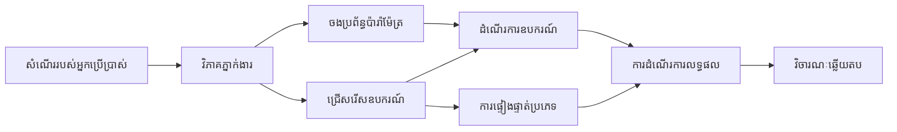

# 🛠️ ការប្រើប្រាស់ឧបករណ៍កម្រិតខ្ពស់ជាមួយ Azure OpenAI (Responses API) (.NET)

## 📋 គោលបំណងរៀន

សៀវភៅកំណត់ត្រានេះបង្ហាញពីគំរូការតភ្ជាប់ឧបករណ៍មុខងាររដ្ឋាភិបាលធ្វើការជា​ក្រុមហ៊ុន​ប្រើ Microsoft Agent Framework ក្នុង .NET ជាមួយ Azure OpenAI (Responses API)។ អ្នកនឹងរៀនបង្កើតភ្នាក់ងារដែលមានជំនាញកម្រិតខ្ពស់ជាមួយឧបករណ៍ជាច្រើនឯកទេស ដោយប្រើប្រព័ន្ធតម្លើងម៉ូដ C# រឹងមាំ និងមុខងាររដ្ឋាភិបាល .NET។

### សមត្ថភាពឧបករណ៍កម្រិតខ្ពស់ដែលអ្នកនឹងចេះ

- 🔧 **សំណុំឧបករណ៍ច្រើន**: ការបង្កើតភ្នាក់ងារជាមួយមុខងារ​ឯកទេស​ច្រើនៗ
- 🎯 **ការប្រតិបត្តិឧបករណ៍ប្រភេទសុវត្ថិភាព**: ប្រើប្រាស់ការផ្ទៀងផ្ទាត់ពេលកម្លាំងកូដ C#
- 📊 **គំរូឧបករណ៍រដ្ឋាភិបាល**: រចនាឧបករណ៍សម្រាប់ផលិតកម្ម និងការគ្រប់គ្រងកំហុស
- 🔗 **ការរួមបញ្ចូលឧបករណ៍**: បញ្ចូលឧបករណ៍សម្រាប់ដំណើរការអាជីវកម្មស្មុគស្មាញ

## 🎯 អត្ថប្រយោជន៍សំណុំឧបករណ៍ .NET

### មុខងារឧបករណ៍រដ្ឋាភិបាល

- **ការផ្ទៀងផ្ទាត់ពេលកម្លាំងកូដ**: ប្រភេទរឹងមាំធានាសុវត្ថិភាពប៉ារ៉ាម៉ែត្រឧបករណ៍
- **ការបញ្ចូលការពឹងផ្អែក**: ការរួមបញ្ចូល CONTENIER IoC សម្រាប់គ្រប់គ្រងឧបករណ៍
- **គំរូ Async/Await**: ការប្រតិបត្តិឧបករណ៍មិនឈប់ឈរ នឹងការ​គ្រប់គ្រងធនធានត្រឹមត្រូវ
- **កំណត់ហេតុដំណើរការ (Logging) រចនាសម្ព័ន្ធ**: ការរួមបញ្ចូលកំណត់ហេតុសម្រាប់តាមដានការប្រតិបត្តិឧបករណ៍

### គំរូសម្រាប់ផលិតកម្មរួម

- **ការគ្រប់គ្រងករណីកំហុស**: ការគ្រប់គ្រងកំហុសទូលំទូលាយជាមួយករណីកំហុសដែលមានប្រភេទ
- **ការគ្រប់គ្រងធនធាន**: គំរូដើម្បីដោះស្រាយនិងគ្រប់គ្រងអង្គចងចាំត្រឹមត្រូវ
- **ការត្រួតពិនិត្យប្រសិទ្ធភាព**: មាត្រដ្ឋាន និងរ៉ែគីឡូប៊ីតដែលរួមបញ្ចូលមកជាមួយ
- **ការគ្រប់គ្រងការរៀបចំរចនា**: ការកំណត់លក្ខខណ្ឌប្រភេទសុវត្ថិភាពជាមួយការបញ្ជាក់ត្រឹមត្រូវ

## 🔧 ស្ថាបត្យកម្មបច្ចេកទេស

### គ្រឿងសម្ភារៈឧបករណ៍ .NET មូលដ្ឋាន

- **Microsoft.Extensions.AI**: ស្រទាប់បទនិយមសាមញ្ញសម្រាប់ឧបករណ៍
- **Microsoft.Agents.AI**: ការគ្រប់គ្រងឧបករណ៍កម្រិត​អាជីវកម្ម
- **Azure OpenAI (Responses API)**: អតិថិជន API ប្រសិទ្ធភាពខ្ពស់ជាមួយការប្រមូលកញ្ចប់ការតភ្ជាប់

### ស៊ុមដំណើរការអនុវត្តឧបករណ៍ 



## 🛠️ ប្រភេទឧបករណ៍ និងគំរូ

### 1. **ឧបករណ៍ដំណើរការទិន្នន័យ**

- **ការផ្ទៀងផ្ទាត់បញ្ចូល**: ប្រភេទរឹងមាំជាមួយកំណត់ទីតាំងទិន្នន័យ
- **ប្រតិបត្តិការបម្លែង**: ការបំលែងទិន្នន័យប្រភេទសុវត្ថិភាព និងទ្រង់ទ្រាយ
- **ច្បាប់អាជីវកម្ម**: ឧបករណ៍គណនា និងវិភាគជាតិដែន
- **ទ្រង់ទ្រាយលទ្ធផល**: ការបង្កើតចម្លើយមានរចនាសម្ព័ន្ធ

### 2. **ឧបករណ៍បញ្ចូលផ្នែកផ្សំ**

- **ឧបករណ៍ភ្ជាប់ API**: ការរួមបញ្ចូលសេវាកម្ម RESTful ជាមួយ HttpClient
- **ឧបករណ៍មូលដ្ឋានទិន្នន័យ**: ការរួមបញ្ចូល Entity Framework សម្រាប់ចូលប្រើទិន្នន័យ
- **ប្រតិបត្តិការឯកសារ**: ប្រតិបត្ដិការរដ្ឋបាលទ្រង់ទ្រាយឯកសារជាមួយការផ្ទៀងផ្ទាត់
- **សេវាកម្មខាងក្រៅ**: គំរូរួមបញ្ចូលសេវាកម្មភាគីទីបី

### 3. **ឧបករណ៍ជំនួយ**

- **ដំណើរការអក្សរ**: ឧបករណ៍កែច្នៃសរសេរ និងទ្រង់ទ្រាយអក្សរ
- **ប្រតិបត្តិនាឡិកា/ម៉ោង**: គណនាថ្ងៃម៉ោងដែលមានការដឹងពីវប្បធម៌
- **ឧបករណ៍គណនា**: គណនាត្រឹមត្រូវ និងប្រតិបត្តិការស្ថិតិ
- **ឧបករណ៍ផ្ទៀងផ្ទាត់**: ការផ្ទៀងផ្ទាត់ច្បាប់អាជីវកម្ម និងការត្រួតពិនិត្យទិន្នន័យ

តើអ្នករួចរាល់សម្រាប់បង្កើតភ្នាក់ងារកម្រិតអាជីវកម្មមួយដែលមានសមត្ថភាពឧបករណ៍ប្រភេទសុវត្ថិភាពខ្លាំងនៅក្នុង .NET ទេ? មកស្ថាបត្យកម្មដំណោះស្រាយកម្រិតវិជ្ជាជីវៈមួយចំនួន! 🏢⚡

## 🚀 ការចាប់ផ្តើម

### វត្ថុត្រូវការមុនកំណត់

- [.NET 10 SDK](https://dotnet.microsoft.com/download/dotnet/10.0) ឬខ្ពស់ជាងនេះ
- ការជាវប្រើប្រាស់មួយ [Azure subscription](https://azure.microsoft.com/free/) ដែលមានធនធាន Azure OpenAI និងការចែកចាយម៉ូដែលមួយ
- កម្មវិធី [Azure CLI](https://learn.microsoft.com/cli/azure/install-azure-cli) — ចុះឈ្មោះជាមួយ `az login`

### បរិស្ថានអថេរដែលត្រូវការជាក់លាក់

```bash
# zsh/bash
export AZURE_OPENAI_ENDPOINT=https://<your-resource>.openai.azure.com
export AZURE_OPENAI_DEPLOYMENT=gpt-4o-mini
# បន្ទាប់មកចូលប្រើ ដើម្បីឲ្យ AzureCliCredential អាចទទួលបានកាតព្វកិច្ចបាន។
az login
```

```powershell
# PowerShell
$env:AZURE_OPENAI_ENDPOINT = "https://<your-resource>.openai.azure.com"
$env:AZURE_OPENAI_DEPLOYMENT = "gpt-4o-mini"
# បន្ទាប់មកចូល ចុះដើម្បីឲ្យ AzureCliCredential បានទទួល token
az login
```

### កូដឧទាហរណ៍

ដើម្បីរត់ឧទាហរណ៍កូដ,

```bash
# zsh/bash
chmod +x ./04-dotnet-agent-framework.cs
./04-dotnet-agent-framework.cs
```

រឺប្រើ dotnet CLI:

```bash
dotnet run ./04-dotnet-agent-framework.cs
```

មើល [`04-dotnet-agent-framework.cs`](../../../../04-tool-use/code_samples/04-dotnet-agent-framework.cs) សម្រាប់កូដពេញលេញ។

```csharp
#!/usr/bin/dotnet run

#:package Microsoft.Extensions.AI@10.*
#:package Microsoft.Agents.AI.OpenAI@1.*-*
#:package Azure.AI.OpenAI@2.1.0
#:package Azure.Identity@1.13.1

using System.ComponentModel;

using Microsoft.Agents.AI;
using Microsoft.Extensions.AI;

using Azure.AI.OpenAI;
using Azure.Identity;

// Tool Function: Random Destination Generator
// This static method will be available to the agent as a callable tool
// The [Description] attribute helps the AI understand when to use this function
// This demonstrates how to create custom tools for AI agents
[Description("Provides a random vacation destination.")]
static string GetRandomDestination()
{
    // List of popular vacation destinations around the world
    // The agent will randomly select from these options
    var destinations = new List<string>
    {
        "Paris, France",
        "Tokyo, Japan",
        "New York City, USA",
        "Sydney, Australia",
        "Rome, Italy",
        "Barcelona, Spain",
        "Cape Town, South Africa",
        "Rio de Janeiro, Brazil",
        "Bangkok, Thailand",
        "Vancouver, Canada"
    };

    // Generate random index and return selected destination
    // Uses System.Random for simple random selection
    var random = new Random();
    int index = random.Next(destinations.Count);
    return destinations[index];
}

// Azure OpenAI with the Responses API (stable v1 endpoint). Sign in with `az login`.
var azureEndpoint = Environment.GetEnvironmentVariable("AZURE_OPENAI_ENDPOINT")
    ?? throw new InvalidOperationException("AZURE_OPENAI_ENDPOINT is not set.");
var deployment = Environment.GetEnvironmentVariable("AZURE_OPENAI_DEPLOYMENT") ?? "gpt-4o-mini";

var azureClient = new AzureOpenAIClient(new Uri(azureEndpoint), new AzureCliCredential());

// Define Agent Identity and Comprehensive Instructions
// Agent name for identification and logging purposes
var AGENT_NAME = "TravelAgent";

// Detailed instructions that define the agent's personality, capabilities, and behavior
// This system prompt shapes how the agent responds and interacts with users
var AGENT_INSTRUCTIONS = """
You are a helpful AI Agent that can help plan vacations for customers.

Important: When users specify a destination, always plan for that location. Only suggest random destinations when the user hasn't specified a preference.

When the conversation begins, introduce yourself with this message:
"Hello! I'm your TravelAgent assistant. I can help plan vacations and suggest interesting destinations for you. Here are some things you can ask me:
1. Plan a day trip to a specific location
2. Suggest a random vacation destination
3. Find destinations with specific features (beaches, mountains, historical sites, etc.)
4. Plan an alternative trip if you don't like my first suggestion

What kind of trip would you like me to help you plan today?"

Always prioritize user preferences. If they mention a specific destination like "Bali" or "Paris," focus your planning on that location rather than suggesting alternatives.
""";

// Create AI Agent with Advanced Travel Planning Capabilities
// Get the Responses client for the deployment and create the AI agent
// Configure agent with name, detailed instructions, and available tools
// This demonstrates the .NET agent creation pattern with full configuration
AIAgent agent = azureClient
    .GetOpenAIResponseClient(deployment)
    .CreateAIAgent(
        name: AGENT_NAME,
        instructions: AGENT_INSTRUCTIONS,
        tools: [AIFunctionFactory.Create(GetRandomDestination)]
    );

// Create New Conversation Thread for Context Management
// Initialize a new conversation thread to maintain context across multiple interactions
// Threads enable the agent to remember previous exchanges and maintain conversational state
// This is essential for multi-turn conversations and contextual understanding
AgentThread thread = agent.GetNewThread();

// Execute Agent: First Travel Planning Request
// Run the agent with an initial request that will likely trigger the random destination tool
// The agent will analyze the request, use the GetRandomDestination tool, and create an itinerary
// Using the thread parameter maintains conversation context for subsequent interactions
await foreach (var update in agent.RunStreamingAsync("Plan me a day trip", thread))
{
    await Task.Delay(10);
    Console.Write(update);
}

Console.WriteLine();

// Execute Agent: Follow-up Request with Context Awareness
// Demonstrate contextual conversation by referencing the previous response
// The agent remembers the previous destination suggestion and will provide an alternative
// This showcases the power of conversation threads and contextual understanding in .NET agents
await foreach (var update in agent.RunStreamingAsync("I don't like that destination. Plan me another vacation.", thread))
{
    await Task.Delay(10);
    Console.Write(update);
}
```

---

<!-- CO-OP TRANSLATOR DISCLAIMER START -->
**ការបដិសេធ**:
ឯកសារនេះត្រូវបានបម្លែងភាសា ដោយប្រើសេវាបម្លែងភាសា AI [Co-op Translator](https://github.com/Azure/co-op-translator)។ ទោះយើងខ្ញុំមានក្តីប្រាថ្នាឱ្យបានច្បាស់លាស់ តែសូមយល់ដឹងថាការបម្លែងដោយស្វ័យប្រវត្តិក៏អាចមានកំហុសឬភាពមិនត្រឹមត្រូវ។ ឯកសារដើមជាភាសាទីតាំងគួរត្រូវបានគេប្រើជាប្រភពច្បាស់លាស់។ សម្រាប់ព័ត៌មានសំខាន់ៗ សូមណែនាំឱ្យប្រើប្រាស់ការប្រែដោយមនុស្សជំនាញ។ យើងខ្ញុំមិនទទួលខុសត្រូវចំពោះការយល់ច្រឡំ ឬការបកស្រាយខុសបន្ទាប់ពីការប្រើប្រាស់ការបម្លែងនេះនោះទេ។
<!-- CO-OP TRANSLATOR DISCLAIMER END -->