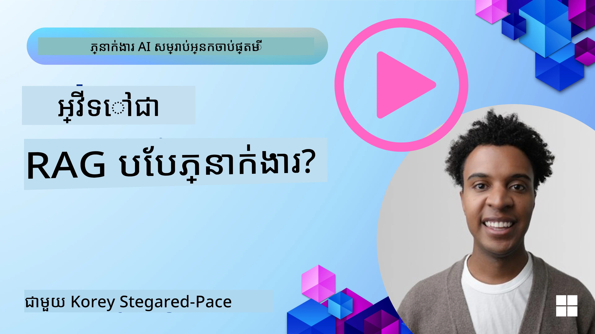
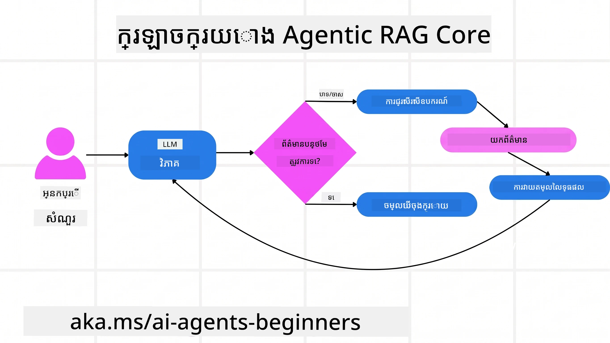
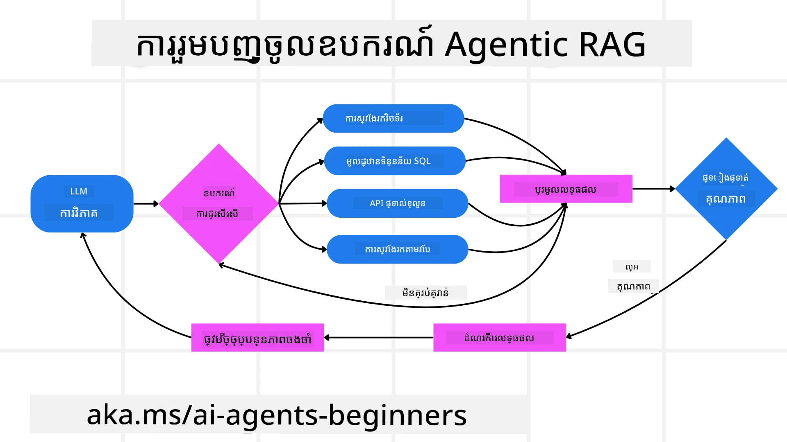
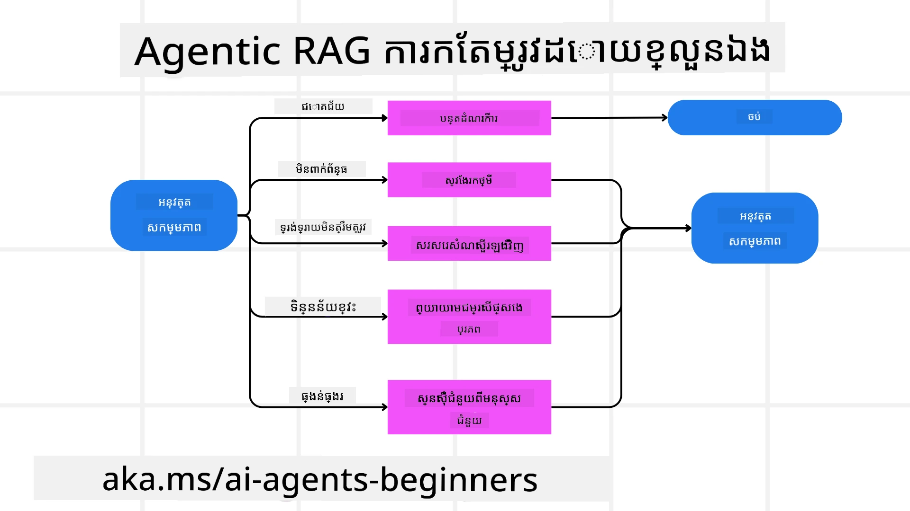
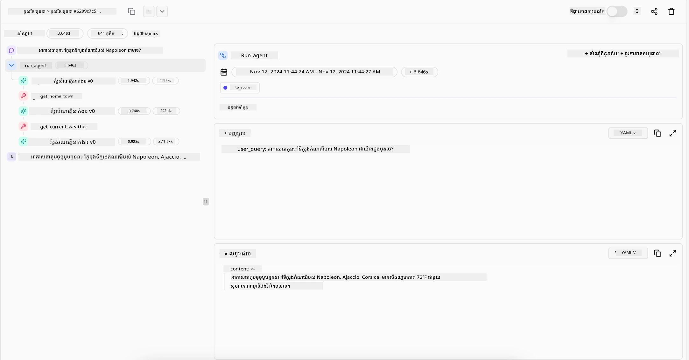

> _(ចុចលើរូបភាពខាងលើដើម្បីមើលវីដេអូមេរៀននេះ)_

# Agentic RAG

មេរៀននេះផ្តល់ការពិពណ៌នាយ៉ាងពេញលេញអំពី Agentic Retrieval-Augmented Generation (Agentic RAG) គឺជាគំរូ AI ថ្មីមួយដែលម៉ូដែលភាសាធំនៅក្នុងវគ្គការស្វ័យប្រវត្តិក្នុងការធ្វើផែនការការងារបន្ទាប់របស់ខ្លួនខណៈពេលទាញយកព័ត៌មានពីប្រភពខាងក្រៅ។ មិនដូចទម្រង់ត្រលប់យកព័ត៌មានហើយបន្ទាប់មកអានដែលមានលក្ខណៈថេរ Agentic RAG រួមបញ្ចូលការហៅម៉ូដែលភាសាប្រចាំដំណាក់កាលជាមួយការហៅឧបករណ៍ ឬមុខងារ និងលទ្ធផលដែលមានរចនាសម្ព័ន្ធ។ ប្រព័ន្ធវាយតម្លៃលទ្ធផល កែលម្អសំណួរ ហៅឧបករណ៍បន្ថែមបើចាំបាច់ ហើយបន្តរឺទូលាយដំណើរការនេះរហូតទទួលបានដំណោះស្រាយពេញចិត្ត។

## ការណែនាំ

មេរៀននេះនឹងគ្របដណ្តប់

- **យល់ដឹងអំពី Agentic RAG:** រៀនអំពីគំរូ AI ថ្មីមួយដែលម៉ូដែលភាសាធំនៅក្នុងវគ្គមានផែនការស្វ័យប្រវត្តិក្នុងការបន្តដំណាក់កាលខ្លួន ពេលដែលទាញយកព័ត៌មានពីប្រភពទិន្នន័យខាងក្រៅ។
- **យល់ដឹងពីមុខងារប្រដាប់ផ្គួរសម្រាប់ត្រួតពិនិត្យជាប្រចាំ:** ចាប់អារម្មណ៍លំនាំការហៅម៉ូដែលភាសាប្រចាំដំណាក់កាលជាមួយមុខងារឯកទេស ឧបករណ៍ និងផលបង្ហាញដែលមានរចនាសម្ព័ន្ធ ដើម្បីបង្កើនភាពត្រឹមត្រូវ និងដោះស្រាយសំណួរមិនគ្រប់គ្រាន់។
- **ស្វែងយល់ពីការអនុវត្តប្រាក់ប្រៃ:** កំណត់រូបភាពករណីប្រើប្រាស់ដែល Agentic RAG មានអត្ថប្រយោជន៍ ដូចជា បរិយាកាសដែលតម្រូវការត្រឹមត្រូវជាមុន អន្តរកម្មមូលដ្ឋានទិន្នន័យស្មុគស្មាញ និងដំណើរការងារពហុជំហាន។

## គោលដៅការសិក្សា

បន្ទាប់ពីបញ្ចប់មេរៀននេះ អ្នកនឹងអាច/យល់ដឹងថា៖

- **យល់ដឹងអំពី Agentic RAG:** រៀនអំពីគំរូ AI ថ្មីមួយដែលម៉ូដែលភាសាធំនៅក្នុងវគ្គមានផែនការស្វ័យប្រវត្តិក្នុងការបន្តដំណាក់កាលខ្លួន ពេលដែលទាញយកព័ត៌មានពីប្រភពទិន្នន័យខាងក្រៅ។
- **លំនាំការហៅម៉ូដែលប្រចាំដំណាក់កាល:** យល់ដឹងពីមូលដ្ឋានលំនាំមូលហៅម៉ូដែលភាសា ជាមួយការហៅឧបករណ៍ ឬមុខងារ និងលទ្ធផលដែលមានរចនាសម្ព័ន្ធ ដើម្បីបង្កើនភាពត្រឹមត្រូវ និងដោះស្រាយសំណួរមិនគ្រប់គ្រាន់។
- **រដ្ឋបាលដំណើរការតំណាង:** យល់ដឹងអំពីសមត្ថភាពប្រព័ន្ធក្នុងការរបស់ខ្លួនដំណើរការចងក្រង អាចគ្រប់គ្រងការសម្រេចចិត្តពីរបៀបដោះស្រាយបញ្ហា ដោយមិនពឹងផ្អែកលើផ្លូវការ​ដែលបានកំណត់មុន។
- **ដំណើរការងារ:** យល់ដឹងរបៀបដែលម៉ូដែល agentic ឈ្នះសម្រេចផែនការស្វ័យប្រវត្តិមួយដើម្បីទាញយករបាយការណ៍និន្នាការទីផ្សារ កំណត់ទិន្នន័យគូប្រកួត ប្រៀបធៀបទិន្នន័យលក់ក្នុង និងសមាសភាសលទ្ធផល ហើយវាយតម្លៃយុទ្ធសាស្រ្ត។
- **លំនាំទូទៅ ប្រើឧបករណ៍ និងមនោសញ្ចេតនា:** រៀនអំពីលំនាំទូទៅពហុជំហាន កាន់ទុកស្ថានភាព និងមេម៉ូរីឲ្យមានតម្លាភាព នៅស្ទួនដំណាក់កាលដើម្បីជៀសវាងវិនិយោគច្រើនលើដំណើរការតែម្តង ហើយធ្វើការសម្រេចចិត្តបានល្អប្រសើរជាងមុន។
- **ដោះស្រាយបញ្ហាខូចខាត និងកែលម្អដោយខ្លួនឯង:** ស្វែងយល់អំពីមេកានិចកែលម្អដោយខ្លួនឯងរឹងមាំ រួមមានការបន្តហៅពង្រឹងការស្វែងរក ការប្រើឧបករណ៍វិភាគ និងជួយដោយមនុស្សបញ្ជាថែមជាមួយ។
- **ព្រំដែនរបស់សមត្ថភាព agentic:** យល់ដឹងពីកំណត់ត្រារបស់ Agentic RAG ដែលផ្តោតលើសំរាប់ដែនកំណត់ជាក់លាក់ ភាពពឹងផ្អែកលើហេដ្ឋារចនាសម្ព័ន្ធ និងគោរពដល់កំណត់សុវត្ថិភាព។
- **ករណីប្រើប្រាស់ និងតម្លៃជាក់ស្តែង:** កំណត់រូបភាពករណីដែល Agentic RAG ឆ្លើយតបបានល្អ ដូចជា នៅក្នុងបរិយាកាសដែលតម្រូវភាពត្រឹមត្រូវ ជាមួយអន្តរកម្មមូលដ្ឋានទិន្នន័យស្មុគស្មាញ និងដំណើរការងារពហុជំហាន។
- **រដ្ឋបាល ការត្រួតពិនិត្យ និងការជឿទុកចិត្ត:** រៀនពីសារៈសំខាន់នៃរដ្ឋបាល និងការត្រួតពិនិត្យ រួមទាំងការពន្យល់ដល់មូលដ្ឋានគិត ការគ្រប់គ្រងមុខងារប្រហែល និងការត្រួតពិនិត្យដោយមនុស្ស។

## Agentic RAG គឺជាអ្វី?

Agentic Retrieval-Augmented Generation (Agentic RAG) គឺជាគំរូ AI ថ្មីមួយ ដែលម៉ូដែលភាសាធំនៅក្នុងវគ្គមានផែនការស្វ័យប្រវត្តិក្នុងដំណាក់កាលបន្ទាប់របស់ខ្លួន ខណៈពេលទាញព័ត៌មានពីប្រភពខាងក្រៅ។ មិនដូចទម្រង់ត្រលប់យកព័ត៌មានហើយបន្ទាប់មកអានដែលមានលក្ខណៈថេរ Agentic RAG រួមបញ្ចូលការហៅម៉ូដែលភាសា ជាដំណាក់កាលជាប់ៗគ្នា ដែលរួមបញ្ចូលការហៅឧបករណ៍ ឬមុខងារ និងលទ្ធផលដែលមានរចនាសម្ព័ន្ធ។ ប្រព័ន្ធវាយតម្លៃលទ្ធផល កែលម្អសំណួរ ហៅឧបករណ៍បន្ថែមបើចាំបាច់ ហើយបន្តរឺទូលាយដំណើរការនេះរហូតទទួលបានដំណោះស្រាយពេញចិត្ត។ លំនាំ “maker-checker” នេះធ្វើឲ្យមានភាពត្រឹមត្រូវកើនឡើង ដោះស្រាយសំណួរមិនត្រឹមត្រូវ និងធានាលទ្ធផលដែលមានគុណភាពខ្ពស់។

ប្រព័ន្ធមានសមត្ថភាពដឹកនាំដំណើរការផ្នែកគិតត្រលប់របស់ខ្លួន ដូចជា ការកែសម្រួលសំណួរដែលបរាជ័យ ជ្រើសរើសវិធីសាស្រ្តទាញយកផ្សេងគ្នា និងរួមបញ្ចូលគ្រឿងឧបករណ៍ជាច្រើន ដូចជា ស្វែងរកវ៉ិចទ័រនៅក្នុង Azure AI Search មូលដ្ឋានទិន្នន័យ SQL ឬ API ផ្ទាល់ខ្លួន មុនពេលចេញចម្លើយចុងក្រោយ។ គុណវិបត្តិសំខាន់នៃប្រព័ន្ធ agentic គឺសមត្ថភាពរបស់វាក្នុងការដឹកនាំដំណើរការត្រលប់របស់ខ្លួន។ ការអនុវត្ត RAG ដើមកម្រង់ដោយផ្លូវការៗ ដែលអាស្រ័យលើផ្លូវដែលបានកំណត់មុន តែក系统 agentic អាចកំណត់លំដាប់ជំហានដោយស្វ័យប្រវត្តិតាមគុណភាពព័ត៌មានដែលវារកឃើញ។

## ការបញ្ជាក់អំពី Agentic Retrieval-Augmented Generation (Agentic RAG)

Agentic Retrieval-Augmented Generation (Agentic RAG) គឺជាគំរូថ្មីមួយក្នុងការអភិវឌ្ឍ AI ដែលម៉ូដែលភាសាធំមិនត្រឹមតែទាញយកព័ត៌មានពីប្រភពទិន្នន័យខាងក្រៅទេ ប៉ុន្តែក៏មានផែនការជំហានបន្ទាប់របស់ខ្លួនដោយស្វ័យប្រវត្តិផងដែរ។ មិនដូចលំនាំត្រលប់យកព័ត៌មានហើយអានដែលមានផ្ទៃមិនផ្លាស់ប្តូរឬលំដាប់ដំណើរការ prompt ដែលបានសរសេរក្នុងរូបមន្តយ៉ាងហ្មត់ចត់ Agentic RAG រួមបញ្ចូលដំណើរការហៅម៉ូដែលភាសាប្រចាំជាប់ៗគ្នា ជាមួយការហៅឧបករណ៍ ឬមុខងារ និងលទ្ធផលដែលមានរចនាសម្ព័ន្ធ។ គ្រប់ដំណាក់កាលប្រព័ន្ធវាយតម្លៃលទ្ធផលដែលទទួលបាន សម្រេចចិត្តថាតើត្រូវកែលម្អសំណួរទេ ឬហៅឧបករណ៍បន្ថែមប្រសិនបើចាំបាច់ ហើយបន្តដំណើរការនេះរហូតទទួលបានដំណោះស្រាយពេញចិត្ត។

លំនាំ “maker-checker” នេះគឺដំណើរការដើម្បីបង្កើនភាពត្រឹមត្រូវ ដោះស្រាយសំណួ្រដែលមិនត្រឹមត្រូវទៅមូលដ្ឋានទិន្នន័យ​ដែលមានរចនាសម្ព័ន្ធ (ឧ. NL2SQL) ហើយធានាលទ្ធផលដែលមានតុល្យភាព និងគុណភាពខ្ពស់។ មិនត្រឹមតែពឹងផ្អែកលើស៊េរី prompt ដែលបានរចនាត្រឹមត្រូវសូម្បីតែប៉ុណ្ណោះទេ ប្រព័ន្ធមានសមត្ថភាពដឹកនាំដំណើរការត្រលប់របស់ខ្លួន។ វាអាចសរសេរឡើងវិញសំណួរដែលបរាជ័យ ជ្រើសរើសវិធីសាស្រ្តទាញយកផ្សេងៗ​ ហើយបញ្ចូលឧបករណ៍ជាច្រើន ដូចជា ស្វែងរកវ៉ិចទ័រនៅ Azure AI Search មានមូលដ្ឋានទិន្នន័យ SQL ឬ API ផ្ទាល់ខ្លួន មុនចេញចម្លើយចុងក្រោយ។ វាបំបេញការ​ចាំបាច់​នៃ​ឧបករណ៍​កំណត់​ក្រោយ​ប្រាក់​បាន​យ៉ាងស្មុគស្មាញ។ ផ្ទុយទៅវិញ ការបង្វិលស្វ័យប្រវត្តិ​ជាងនេះ "ហៅ LLM → ប្រើឧបករណ៍ → ហៅ LLM → …" អាចអោយលទ្ធផលគុណភាពខ្ពស់ និងមានស្ថា​នភាពល្អ។

## ការដឹកនាំដំណើរការត្រលប់

គុណវិបត្តិសំខាន់ ដែលធ្វើឲ្យប្រព័ន្ធមានសភាពជា “agentic” គឺសមត្ថភាពរបស់វានៅក្នុងការដឹកនាំដំណើរការត្រលប់របស់ខ្លួន។ ការអនុវត្ត RAG ធម្មតា តែងតែពឹងផ្អែកលើមនុស្សក្នុងការកំណត់ផ្លូវការ (path) សម្រាប់ម៉ូដែល: ជាស៊េរីគំនិតដែលបញ្ជាក់ថាត្រូវទាញយកអ្វី និងពេលណា។
ប៉ុន្តែពេលប្រព័ន្ធមានសភាព agentic ជិតជាស្ថិតនៅខាងក្នុង វាសម្រេចចិត្តដោយខ្លួនឯងពីរបៀបដោះស្រាយបញ្ហា។ វាមិនត្រឹមតែអនុវត្ត script ទេ ប៉ុន្តែមានសមត្ថភាពកំណត់លំដាប់ជំហានដោយស្វ័យប្រវត្តិតាមគុណភាពនៃព័ត៌មានដែលរកឃើញ។
ឧទាហរណ៍ បើបានស្នើឲ្យបង្កើតយុទ្ធសាស្រ្តចាប់ផ្តើមផលិតផល វាមិនពឹងផ្អែកត្រឹមតែ prompt ដែលបង្ហាញលំដាប់ការស្រាវជ្រាវ និងដំណើរការសម្រេចចិត្តទាំងមូលទេ។ ផ្ទុយទៅវិញ ម៉ូដែល agentic សម្រេចចិត្តដោយខ្លួនឯងដូចជា៖

1. ទាញយករបាយការណ៍និន្នាការទីផ្សារបច្ចុប្បន្នដោយប្រើ Bing Web Grounding
2. កំណត់ទិន្នន័យគូប្រកួតពាក់ព័ន្ធដោយប្រើ Azure AI Search
3. ប្រៀបធៀបមាត្រដ្ឋានលក់នៅក្នុងអតីតកាលដោយប្រើ Azure SQL Database
4. សមាសភាសយុទ្ធសាស្រ្តដោយរួមបញ្ចូលនៅក្នុង Azure OpenAI Service
5. វាយតម្លៃយុទ្ធសាស្រ្តបើមានចន្លោះ ឬការខុសគ្នា ដើម្បីស្នើសុំការទាញយកជាចុងក្រោយបើចាំបាច់
ជំហានទាំងនេះ—កែលម្អសំណួរ ជ្រើសរើសប្រភព ហើយបន្តដល់ពេល “ពេញចិត្ត” ជាមួយចម្លើយ—ត្រូវបានសម្រេចដោយម៉ូដែល មិនមែនដោយស្គ្រីបដែលបានសរសេរជាមុនដោយមនុស្សទេ។

## លំនាំស្វ័យប្រវត្តិ ហៅឧបករណ៍ និងមេម៉ូរី

ប្រព័ន្ធ agentic អាស្រ័យលើលំនាំរោលបញ្ចេសកម្ម៖

- **ហៅដំបូង:** គោលបំណងរបស់អ្នកប្រើប្រាស់ (អថេរ prompt) ត្រូវបានផ្ដល់ទៅម៉ូដែលភាសា។
- **ហៅឧបករណ៍:** ប្រសិនបើម៉ូដែលសម្គាល់ថាមានព័ត៌មានខ្វះខាត ឬការណែនាំមិនច្បាស់លាស់ វាជ្រើសរើសឧបករណ៍ ឬវិធីសាស្រ្តការទាញយក ដូចជាការសួរសំណួរទៅមូលដ្ឋានទិន្នន័យវ៉ិចទ័រ (ឧ. Azure AI Search Hybrid ស្វែងរកលើទិន្នន័យឯកជន) ឬការហៅ SQL ដែលមានរចនាសម្ព័ន្ធ ដើម្បីរកព័ត៌មានបន្ថែម។
- **វាយតម្លៃ និងកែប្រែ:** បន្ទាប់ពីពិនិត្យទិន្នន័យត្រឡប់មកម៉ូដែល សម្រេចថាព័ត៌មានគ្រប់គ្រាន់ឬអត់។ បើមិនគ្រប់ម៉ូដែលកែលម្អសំណួរ ព្យាយាមឧបករណ៍ផ្សេង ឬផ្លាស់ប្តូរវិធីសាស្រ្ត។
- **បន្តរហូតដល់ពេញចិត្ត:** វិធីសាស្រ្តនេះបន្តរហូតម៉ូដែលកំណត់ថាមានភាពបញ្ជាក់ និងភស្តុតាងគ្រប់គ្រាន់ដើម្បីផ្ដល់ចម្លើយចុងក្រោយដែលមានហេតុផល។
- **មេម៉ូរី និងស្ថានភាព:** ដោយសារប្រព័ន្ធរក្សាស្ថានភាព និងមេម៉ូរីនៅក្នុងជំហានទាំងអស់ វាអាចចងចាំការព្យាយាមមុនៗ និងលទ្ធផលរបស់ពួកគេ ដើម្បីជៀសវាងការវិលតម្រង់ម្តងទៀតហើយទទួលការសម្រេចចិត្តល្អប្រសើររៀងរាល់ជំហាន។

នៅរយៈពេលវែងនេះ បង្កើតភាពយល់ដឹងកាន់តែជ្រាលជ្រៅ ឲ្យម៉ូដែលហៅដំណើរការស្មុគស្មាញជាច្រើនជំហានដោយមិនចាំបាច់ត្រូវមានមនុស្សចូលបញ្ចូល ឬកែប្រែលំនាំ prompt ជាប្រចាំ។

## ការដោះស្រាយបញ្ហាបរាជ័យ និងកែលម្អដោយខ្លួនឯង

អាណុក្គាមសភាព agentic RAG គឺរួមបញ្ចូលមេកានិចកែលម្អដោយខ្លួនឯងដែលរឹងមាំ។ ពេលដែលប្រព័ន្ធស្ថិតក្នុងស្ថានភាពគម ឧ. ទាញយកឯកសារមិនពាក់ព័ន្ធ ឬជួបសំណួរមិនត្រឹមត្រូវ វាអាច៖

- **បន្តហើយសួរឡើងវិញ:** មិនត្រឡប់ចម្លើយដែលមានតំលៃទាបទេ ម៉ូដែលព្យាយាមយុទ្ធសាស្រ្តស្វែងរកថ្មីៗ សរសេរសំណួរកម្រិតទិន្នន័យឡើងវិញ ឬមើលជំនួសឯកសារទិន្នន័យផ្សេងទៀត។
- **ប្រើឧបករណ៍វិភាគ:** ប្រព័ន្ធអាចហៅមុខងារបន្ថែមដែលរចនាឡើងសម្រាប់ជួយវាសងេតការគិតរបស់ខ្លួន ឬបញ្ជាក់ភាពត្រឹមត្រូវនៃទិន្នន័យដែលបានទាញយក។ ឧបករណ៍ដូចជា Azure AI Tracing មានសារៈសំខាន់ក្នុងការកំណត់ភាពអាចមើលឃើញ និងត្រួតពិនិត្យ។
- **ព្យាយាមជាមួយការត្រួតពិនិត្យមនុស្ស:** សម្រាប់ស្ថានភាពដែលមានហានិភ័យខ្ពស់ ឬបរាជ័យជាបន្តៗ ម៉ូដែលអាចបង្ហាញភាពមិនច្បាស់លាស់ ហើយស្នើរសុំការជួយពីមនុស្ស។ បន្ទាប់ពីមនុស្សផ្តល់មតិយោបល់កែតម្រូវ ម៉ូដែលអាចបញ្ចូលមេរៀននោះទៅប្រើប្រាស់នៅពេលក្រោយ។

វិធីសាស្រ្តហេតុផល និងបត់បែននេះអនុញ្ញាតឲ្យម៉ូដែលកែលម្អបន្តទៀត ជៀសវាងការវិលតែម្តង ហើយរំលេចថាវាមិនមែនជាប្រព័ន្ធមួយដងទេ ប៉ុន្តែជាដំណើរសិក្សារបស់វាក្នុងសម័យមួយ។

## ព្រំដែនសមត្ថភាព agentic

ទោះបីមានសិទ្ធិឯករាជ្យនៅក្នុងមុខងារ មិនអាចនិយាយថា Agentic RAG ជាបញ្ញាសង្គមទូទៅ (Artificial General Intelligence)។ សមត្ថភាព “agentic” របស់វាមានកំណត់សម្រាប់ឧបករណ៍ ទិន្នន័យ និងគោលការណ៍ដែលអ្នកអភិវឌ្ឍបានផ្តល់។ វាមិនអាចបង្កើតឧបករណ៍ផ្ទាល់ខ្លួន ឬចេញពីដែនកំណត់ដែលបានកំណត់។ ផ្ទុយទៅវិញ វាចូលចិត្តត្រួតពិនិត្យប្រភពធនធានដែលមាន។
ភាពខុសគ្នាចម្បងពី AI អភិវឌ្ឍកម្រិតខ្ពស់មាន៖

1. **ភាពឯករាជ្យក្នុងដែនជាក់លាក់:** ប្រព័ន្ធ Agentic RAG ប្តេជ្ញាទៅរកគោលដៅដែលអ្នកប្រើកំណត់ជាមួយដែនដែលបានស្គាល់ ដោយប្រើយុទ្ធសាស្រ្តដូចជាការសរសេរ query ថ្មី ឬជ្រើសឧបករណ៍ដើម្បីកែលម្អលទ្ធផល។
2. **ពឹងផ្អែកលើហេដ្ឋារចនាសម្ព័ន្ធ:** សមត្ថភាពប្រព័ន្ធឡើងនៅលើឧបករណ៍ និងទិន្នន័យដែលបានបញ្ចូលដោយអ្នកអភិវឌ្ឍ។ វាមិនអាចកាត់ទ្រេតព្រំដែនបានដោយគ្មានការចូលបញ្ជាដោយមនុស្សឡើយ។
3. **គោរពកំណត់សុវត្ថិភាព:** គោលការណ៍ផ្លូវច្បាប់ បានបញ្ជាក់ និងនីតិវិធីអាជីវកម្មនៅតែមានសារៈសំខាន់ខ្លាំង។ សម្លាប់សេរីភាពរបស់ម៉ូដែលតែងតែត្រូវបានគ្រប់គ្រងដោយវិធានសុវត្ថិភាព និងការត្រួតពិនិត្យ (សង្ឃឹមថា)

## ករណីប្រើប្រាស់ជាក់ស្តែង និងតម្លៃ

Agentic RAG សម្បូរជាមួយនៅក្នុងស្ថានភាពដែលតម្រូវចាស់បន្ត និងភាពត្រឹមត្រូវយ៉ាងខ្ពស់៖

1. **បរិយាកាសដែលប្រសើរនៃភាពត្រឹមត្រូវ:** ក្នុងការត្រួតពិនិត្យបទបញ្ជា ការវិភាគគោលការណ៍ ឬស្រាវជ្រាវផ្នែកច្បាប់ ម៉ូដែល agentic អាចត្រួតពិនិត្យតម្លៃម្តងហើយម្តងទៀត ប្រឹងប្រែងនិយាយពីប្រភពច្រើន និងសរសេរសំណួរជាច្រើនរហូតទទួលបានចម្លើយដែលបានត្រួតពិនិត្យយ៉ាងល្អ។
2. **អន្តរកម្មមូលដ្ឋានទិន្នន័យស្មុគស្មាញ:** នៅពេលឆ្លងកាត់ទិន្នន័យដែលមានរចនាសម្ព័ន្ធ ហើយសំណួរអាចបរាជ័យ ឬត្រូវកែលម្អ វាអាចកែលម្អសំណួរដោយខ្លួនឯង ដោយប្រើ Azure SQL ឬ Microsoft Fabric OneLake ដើម្បីធានាការទាញយកចុងក្រោយស្របទៅគោលបំណងអ្នកប្រើ។
3. **ដំណើរការងារពហុជំហាន:** សម័យវែងរហូតអាចកើតមាន ដោយបន្ថែមព័ត៌មានថ្មីៗ កែប្រាយុទ្ធសាស្រ្តបន្ទាប់ពីរៀនសូត្រកាន់តែច្បាស់ពីបញ្ហា។

## រដ្ឋបាល ការត្រួតពិនិត្យ និងការជឿទុកចិត្ត

ពេលប្រព័ន្ធទាំងនេះមានសិទ្ធិឯករាជ្យចុងក្រោយក្នុងការគិត អ្នកត្រូវការរដ្ឋបាល និងភាពបញ្ចេញបំណត់គោលបំណងច្បាស់លាស់៖

- **ការពន្យល់ដល់មូលដ្ឋានគិត:** ម៉ូដែលអាចផ្ដល់កំណត់ត្រា audit នៃសំណួរដែលបានធ្វើ ប្រភពដែលបានពិគ្រោះ និងជំហានគិតដែលបានអនុវត្តដើម្បីទទួលបានលទ្ធផល។ ឧបករណ៍ដូចជា Azure AI Content Safety និង Azure AI Tracing / GenAIOps ជួយរក្សាទុកភាពបង្រួល និងកាត់បន្ថយហានិភ័យ។
- **គ្រប់គ្រងការប្រែប្រួល និងការទាញយកតុល្យាភាព៖** អ្នកអភិវឌ្ឍអាចកំណត់យុទ្ធសាស្រ្តទាញយក ដើម្បីប្រាកដថាប្រភពទិន្នន័យមានតុល្យភាព និងតំណាងដល់គ្នា លទ្ធផលត្រូវតែត្រួតពិនិត្យជារឿយៗ សម្រាប់រកការប្រកួតប្រជែង ឬការប្រែប្រួល ដែលអាចកើតមានដោយប្រើម៉ូដែលបុគ្គលិកលើវិទ្យាសាស្រ្តទិន្នន័យ Azure Machine Learning។
- **ការត្រួតពិនិត្យដោយមនុស្ស និងការអនុវត្តតាមអនាម័យ៖** សម្រាប់កិច្ចការសំខាន់ៗ ការត្រួតពិនិត្យដោយមនុស្សនៅតែមានសារៈសំខាន់។ Agentic RAG មិនជំនួសការសម្រេចចិត្តមនុស្សនៅកម្រិតខ្ពស់ទេ តែជួយបង្កើតជម្រើសដែលបានត្រួតពិនិត្យយ៉ាងត្រឹមត្រូវ។

ការមានឧបករណ៍ដែលផ្តល់កំណត់ត្រាសកម្មភាពយ៉ាងច្បាស់គឺសំខាន់ណាស់។ បើគ្មានវិភាគនេះ ការរកមូលហេតុបញ្ហាក្នុងដំណើរជាច្រើនជំហានអាចលំបាកខ្លាំង។ សូមមើលឧទាហរណ៍ពី Literal AI (ក្រុមហ៊ុននៅពីក្រោយ Chainlit) សម្រាប់ការប្រតិបត្តិ AgentRun៖

## សេចក្តីសន្និដ្ឋាន

Agentic RAG ជាបរិបទវឌ្ឍនភាពធម្មជាតិមួយក្នុងវិធីដែលប្រព័ន្ធ AI ដោះស្រាយបញ្ហាស្មុគស្មាញមានទិន្នន័យច្រើន។ ដោយយកលំនាំរោលបញ្ចេសកម្មជា​មូលដ្ឋាន ស្វ័យប្រវត្តិជ្រើសឧបករណ៍ និងកែលម្អសំណួររហូតដល់ទទួលបានលទ្ធផលដែលមានគុណភាពខ្ពស់ ប្រព័ន្ធចេញពីការតាមដាន prompt ជាថេរមកធ្វើជាអ្នកសម្រេចចិត្តដែលមានបរិបទ និងបត់បែនបានល្អ។ ទោះបីស្ថិតក្រោមកំណត់ហេដ្ឋារចនាសម្ព័ន្ធ និងច្បាប់សីលធម៍ដែលកំណត់ដោយមនុស្ស ក៏សមត្ថភាព agentic នេះអនុញ្ញាតឲ្យមានអន្តរកម្ម AI ដែលឧស្សាហកម្ម និងអ្នកប្រើប្រាស់ចុងក្រោយគ្រប់គ្រាន់ និងមានប្រយោជន៍ច្រើនទៀត។

### មានសំណួរបន្ថែមអំពី Agentic RAG?

ចូលរួមក្នុង [Microsoft Foundry Discord](https://discord.com/invite/ATgtXmAS5D) ដើម្បីជួបជាមួយអ្នករៀនផ្សេងៗ ចូលរួមម៉ោងជំនួយ និងទទួលចម្លើយសំណួរអំពី AI Agents របស់អ្នក។

## ធនធានបន្ថែម

- <a href="https://learn.microsoft.com/training/modules/use-own-data-azure-openai" target="_blank">អនុវត្តការបង្កើត Retrieval Augmented Generation (RAG) ជាមួយ Azure OpenAI Service៖ រៀនពីរបៀបប្រើទិន្នន័យផ្ទាល់ខ្លួនជាមួយ Azure OpenAI Service។ មេរៀន Microsoft Learn នេះផ្ដល់មគ្គុទេសក៍ពេញលេញអំពីការអនុវត្ត RAG</a>
- <a href="https://learn.microsoft.com/azure/ai-studio/concepts/evaluation-approach-gen-ai" target="_blank">ការវាយតម្លៃកម្មវិធី AI បង្កើតថ្មីជាមួយ Microsoft Foundry៖ អត្ថបទនេះគ្របដណ្តប់ការវាយតម្លៃ និងប្រៀបធៀបម៉ូដែលលើទិន្នន័យសាធារណៈ រួមមានកម្មវិធី AI Agentic និងរចនាសម្ព័ន្ធ RAG</a>
- <a href="https://weaviate.io/blog/what-is-agentic-rag" target="_blank">Agentic RAG គឺជាអ្វី | Weaviate</a>
- <a href="https://ragaboutit.com/agentic-rag-a-complete-guide-to-agent-based-retrieval-augmented-generation/" target="_blank">Agentic RAG៖ មគ្គុទេសក៍ពេញលេញស្ដីពីការបង្កើត Retrieval Augmented Generation ដែលផ្អែកលើ Agent – ព័ត៌មានពី generation RAG</a>

- <a href="https://huggingface.co/learn/cookbook/agent_rag" target="_blank">Agentic RAG: បង្កើនសមត្ថភាព RAG របស់អ្នកជាមួយការកែប្រែការស្វែងរក និងការស្វែងរកដោយខ្លួនឯង! សៀវភៅមួយសម្រាប់ AI Open-Source របស់ Hugging Face</a>
- <a href="https://youtu.be/aQ4yQXeB1Ss?si=2HUqBzHoeB5tR04U" target="_blank">ការបន្ថែមស្រទាប់ Agentic ទៅ RAG</a>
- <a href="https://www.youtube.com/watch?v=zeAyuLc_f3Q&t=244s" target="_blank">អនាគតនៃជំនួយការព័ត៌មាន៖ Jerry Liu</a>
- <a href="https://www.youtube.com/watch?v=AOSjiXP1jmQ" target="_blank">របៀបសាងសង់ប្រព័ន្ធ Agentic RAG</a>
- <a href="https://ignite.microsoft.com/sessions/BRK102?source=sessions" target="_blank">ការប្រើប្រាស់សេវាភ្នាក់ងារកម្មវិធី Foundry របស់ Microsoft ដើម្បីពង្រីកភ្នាក់ងារ AI របស់អ្នក</a>

### ឯកសារអកាដេមិក

- <a href="https://arxiv.org/abs/2303.17651" target="_blank">2303.17651 Self-Refine: ការកែប្រែតាមជំហានជាមួយមតិយោបល់ពីខ្លួនឯង</a>
- <a href="https://arxiv.org/abs/2303.11366" target="_blank">2303.11366 Reflexion: ភ្នាក់ងារភាសាជាមួយការសិក្សាការបង្រៀនតាមមាត់</a>
- <a href="https://arxiv.org/abs/2305.11738" target="_blank">2305.11738 CRITIC: ម៉ូដែលភាសាធំនាអាចកែប្រែខ្លួនឯងដោយប្រើការវាយតម្លៃផ្សព្វផ្សាយជាមួយឧបករណ៍អន្តរកម្ម</a>
- <a href="https://arxiv.org/abs/2501.09136" target="_blank">2501.09136 Agentic Retrieval-Augmented Generation: សិក្សាសរុបអំពី Agentic RAG</a>

## មេរៀនមុន

[ទម្រង់ការរចនាការប្រើប្រាស់ឧបករណ៍](../04-tool-use/README.md)

## មេរៀនបន្ទាប់

[ការសង់ភ្នាក់ងារ AI ដែលទុកចិត្តបាន](../06-building-trustworthy-agents/README.md)

---

<!-- CO-OP TRANSLATOR DISCLAIMER START -->
**ការបដិសេធ**:
ឯកសារនេះត្រូវបានបម្លែងភាសា ដោយប្រើសេវាបម្លែងភាសា AI [Co-op Translator](https://github.com/Azure/co-op-translator)។ ទោះយើងខ្ញុំមានក្តីប្រាថ្នាឱ្យបានច្បាស់លាស់ តែសូមយល់ដឹងថាការបម្លែងដោយស្វ័យប្រវត្តិក៏អាចមានកំហុសឬភាពមិនត្រឹមត្រូវ។ ឯកសារដើមជាភាសាទីតាំងគួរត្រូវបានគេប្រើជាប្រភពច្បាស់លាស់។ សម្រាប់ព័ត៌មានសំខាន់ៗ សូមណែនាំឱ្យប្រើប្រាស់ការប្រែដោយមនុស្សជំនាញ។ យើងខ្ញុំមិនទទួលខុសត្រូវចំពោះការយល់ច្រឡំ ឬការបកស្រាយខុសបន្ទាប់ពីការប្រើប្រាស់ការបម្លែងនេះនោះទេ។
<!-- CO-OP TRANSLATOR DISCLAIMER END -->